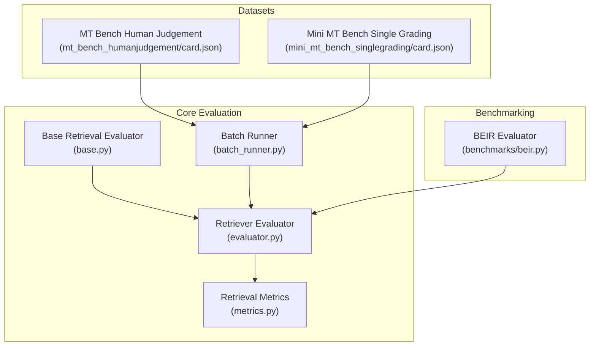
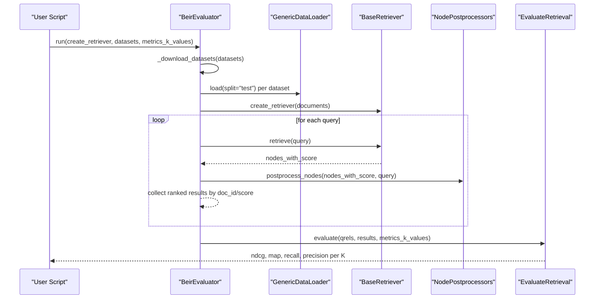
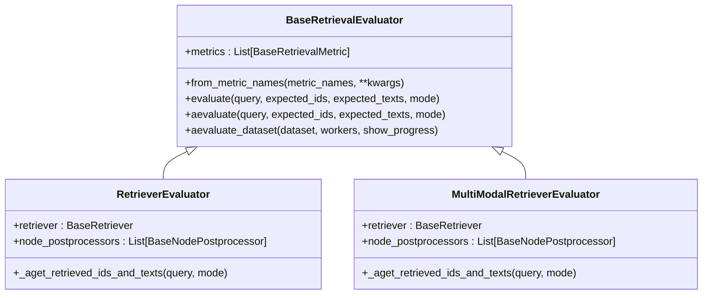
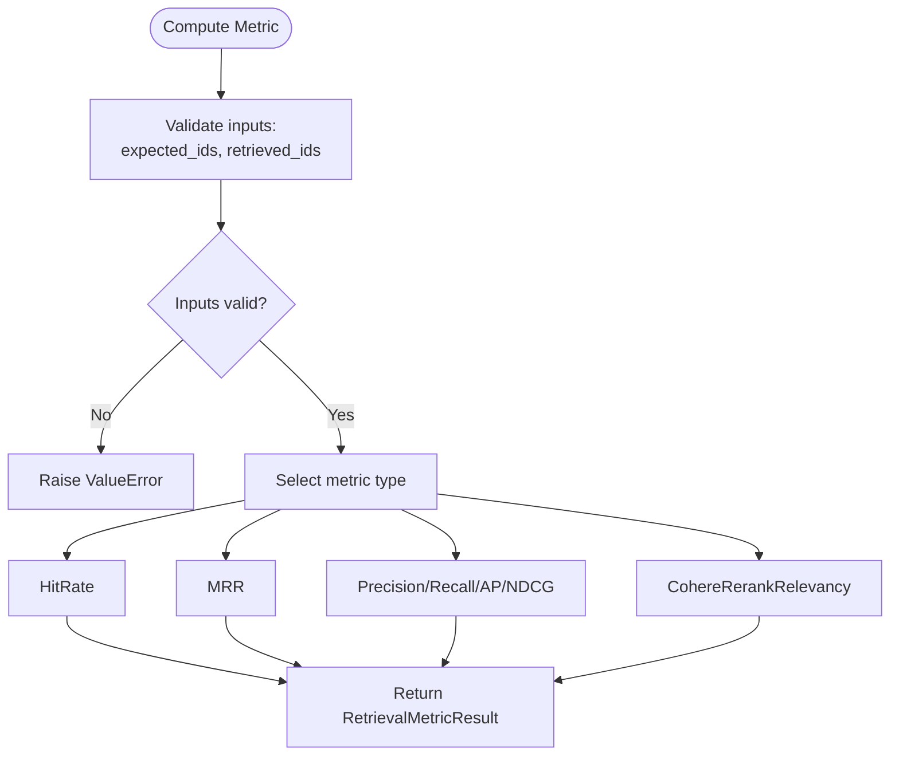
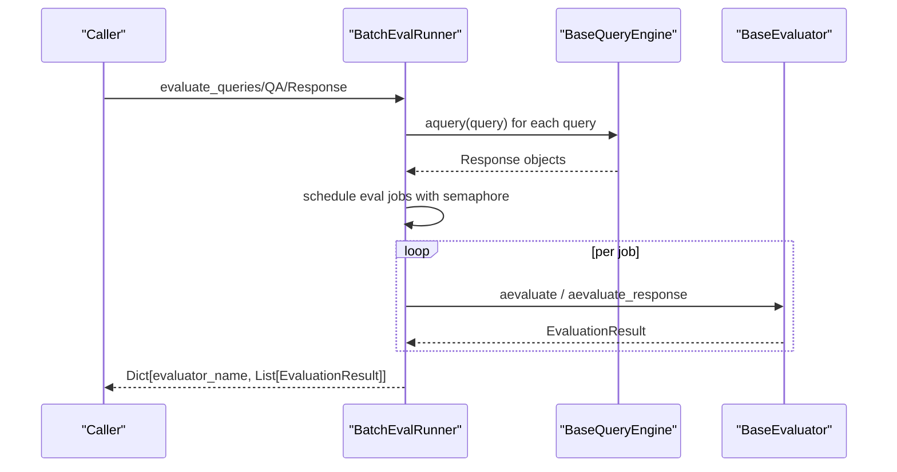
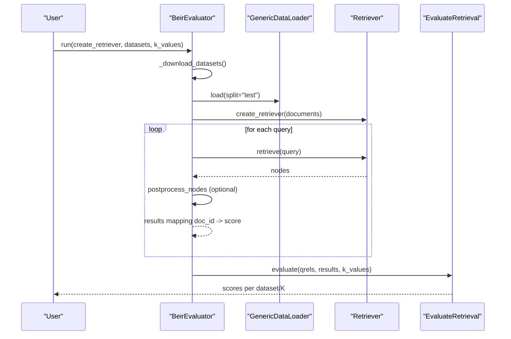
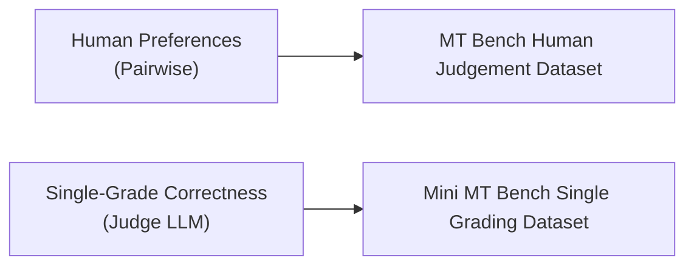
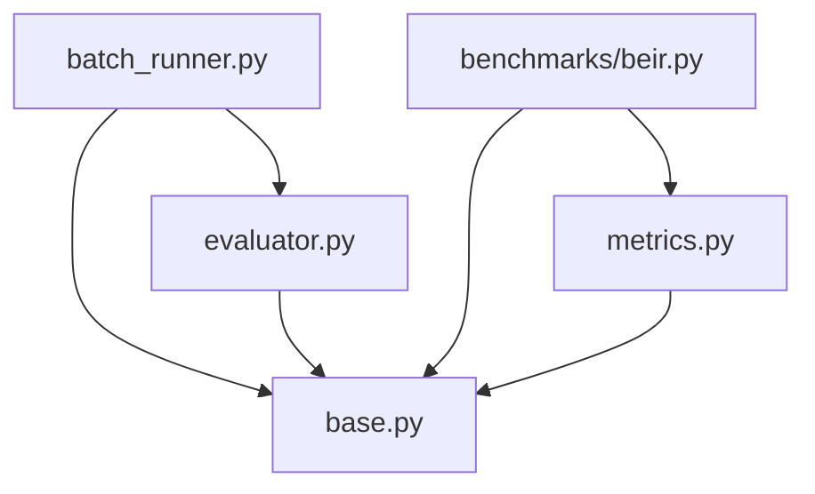

# Specialized Data Analysis

<cite>
**Referenced Files in This Document**
- [beir.py](file://llama-index-core/llama_index/core/evaluation/benchmarks/beir.py)
- [evaluator.py](file://llama-index-core/llama_index/core/evaluation/retrieval/evaluator.py)
- [metrics.py](file://llama-index-core/llama_index/core/evaluation/retrieval/metrics.py)
- [base.py](file://llama-index-core/llama_index/core/evaluation/retrieval/base.py)
- [batch_runner.py](file://llama-index-core/llama_index/core/evaluation/batch_runner.py)
- [card.json (MT Bench Human Judgement)](file://llama-datasets/mt_bench_humanjudgement/card.json)
- [card.json (Mini MT Bench Single Grading)](file://llama-datasets/mini_mt_bench_singlegrading/card.json)
- [BeirEvaluation.ipynb](file://docs/examples/evaluation/BeirEvaluation.ipynb)
- [mt_bench_human_judgement.ipynb](file://docs/examples/evaluation/mt_bench_human_judgement.ipynb)
- [mt_bench_single_grading.ipynb](file://docs/examples/evaluation/mt_bench_single_grading.ipynb)
- [retriever_eval.ipynb](file://docs/examples/evaluation/retrieval/retriever_eval.ipynb)
- [multi_modal_rag_evaluation.ipynb](file://docs/examples/evaluation/multi_modal/multi_modal_rag_evaluation.ipynb)
- [pairwise.py](file://llama-index-core/llama_index/core/evaluation/pairwise.py)
- [correctness.py](file://llama-index-core/llama_index/core/evaluation/correctness.py)
</cite>

## Table of Contents
1. [Introduction](#introduction)
2. [Project Structure](#project-structure)
3. [Core Components](#core-components)
4. [Architecture Overview](#architecture-overview)
5. [Detailed Component Analysis](#detailed-component-analysis)
6. [Dependency Analysis](#dependency-analysis)
7. [Performance Considerations](#performance-considerations)
8. [Troubleshooting Guide](#troubleshooting-guide)
9. [Conclusion](#conclusion)
10. [Appendices](#appendices)

## Introduction
This document explains how to build specialized data analysis applications using LlamaIndex focused on retrieval benchmarking, BEIR evaluation, and MT-Bench human judgment evaluation. It covers:
- Retrieval benchmarking with BEIR datasets and built-in retrieval metrics
- MT-Bench human judgment datasets and single-grading setups
- Custom evaluation metrics and comparative analysis between retrieval strategies
- Performance regression testing and continuous integration integration
- Domain-specific evaluation criteria, bias detection, and fairness assessment
- Automated monitoring and A/B testing frameworks for retrieval optimization

## Project Structure
The evaluation ecosystem centers around:
- Retrieval evaluation primitives and metrics
- Batch evaluation orchestration
- BEIR integration for standardized retrieval benchmarking
- MT-Bench datasets and notebooks for human judgment evaluation
- Example notebooks demonstrating end-to-end workflows

**Diagram sources**
- [base.py](file://llama-index-core/llama_index/core/evaluation/retrieval/base.py#L77-L201)
- [evaluator.py](file://llama-index-core/llama_index/core/evaluation/retrieval/evaluator.py#L16-L104)
- [metrics.py](file://llama-index-core/llama_index/core/evaluation/retrieval/metrics.py#L1-L514)
- [batch_runner.py](file://llama-index-core/llama_index/core/evaluation/batch_runner.py#L75-L444)
- [beir.py](file://llama-index-core/llama_index/core/evaluation/benchmarks/beir.py#L12-L110)
- [card.json (MT Bench Human Judgement)](file://llama-datasets/mt_bench_humanjudgement/card.json#L1-L59)
- [card.json (Mini MT Bench Single Grading)](file://llama-datasets/mini_mt_bench_singlegrading/card.json#L1-L56)

**Section sources**
- [base.py](file://llama-index-core/llama_index/core/evaluation/retrieval/base.py#L1-L201)
- [evaluator.py](file://llama-index-core/llama_index/core/evaluation/retrieval/evaluator.py#L1-L104)
- [metrics.py](file://llama-index-core/llama_index/core/evaluation/retrieval/metrics.py#L1-L514)
- [batch_runner.py](file://llama-index-core/llama_index/core/evaluation/batch_runner.py#L1-L444)
- [beir.py](file://llama-index-core/llama_index/core/evaluation/benchmarks/beir.py#L1-L110)
- [card.json (MT Bench Human Judgement)](file://llama-datasets/mt_bench_humanjudgement/card.json#L1-L59)
- [card.json (Mini MT Bench Single Grading)](file://llama-datasets/mini_mt_bench_singlegrading/card.json#L1-L56)

## Core Components
- Retrieval evaluator abstractions define evaluation modes (text/image), evaluation results, and asynchronous evaluation loops over datasets.
- Built-in retrieval metrics include Hit Rate, MRR, Precision, Recall, AP, NDCG, and Cohere rerank relevancy.
- Batch evaluation orchestrates parallel evaluation across multiple evaluators and query engines with retries and progress support.
- BEIR evaluator integrates with the official BEIR library to download datasets, load qrels, and compute standard retrieval scores.
- MT-Bench datasets provide labeled pairwise and single-grade evaluations for human preference and correctness.

Key capabilities:
- Comparative analysis between retrieval strategies via shared metrics and dataset splits
- Custom metric registration and resolution for domain-specific needs
- Human-in-the-loop evaluation via MT-Bench datasets and judge LLMs
- Scalable batch evaluation with concurrency control and robust retry logic

**Section sources**
- [base.py](file://llama-index-core/llama_index/core/evaluation/retrieval/base.py#L20-L201)
- [metrics.py](file://llama-index-core/llama_index/core/evaluation/retrieval/metrics.py#L16-L514)
- [batch_runner.py](file://llama-index-core/llama_index/core/evaluation/batch_runner.py#L75-L444)
- [beir.py](file://llama-index-core/llama_index/core/evaluation/benchmarks/beir.py#L12-L110)
- [card.json (MT Bench Human Judgement)](file://llama-datasets/mt_bench_humanjudgement/card.json#L1-L59)
- [card.json (Mini MT Bench Single Grading)](file://llama-datasets/mini_mt_bench_singlegrading/card.json#L1-L56)

## Architecture Overview
The evaluation architecture composes retrieval evaluators with metrics, optional post-processing, and batch orchestration. BEIR and MT-Bench datasets provide standardized evaluation sets.

**Diagram sources**
- [beir.py](file://llama-index-core/llama_index/core/evaluation/benchmarks/beir.py#L50-L110)

**Section sources**
- [beir.py](file://llama-index-core/llama_index/core/evaluation/benchmarks/beir.py#L12-L110)

## Detailed Component Analysis

### Retrieval Evaluation Framework
- BaseRetrievalEvaluator defines evaluation modes, result structures, and async evaluation over datasets with concurrency control.
- RetrieverEvaluator and MultiModalRetrieverEvaluator provide concrete implementations to fetch retrieved IDs/texts and optionally separate text vs. image nodes.
- RetrievalEvalResult aggregates per-query metrics and exposes convenient accessors for metric values.

**Diagram sources**
- [base.py](file://llama-index-core/llama_index/core/evaluation/retrieval/base.py#L77-L201)
- [evaluator.py](file://llama-index-core/llama_index/core/evaluation/retrieval/evaluator.py#L16-L104)

**Section sources**
- [base.py](file://llama-index-core/llama_index/core/evaluation/retrieval/base.py#L20-L201)
- [evaluator.py](file://llama-index-core/llama_index/core/evaluation/retrieval/evaluator.py#L16-L104)

### Retrieval Metrics
Built-in metrics include:
- HitRate: default or granular calculation
- MRR: default or granular reciprocal rank
- Precision, Recall, AP, NDCG
- CohereRerankRelevancyMetric: aggregate reranking scores

Metrics are resolved by name and registered in a central registry. They accept expected/retrieved IDs and optional texts, returning RetrievalMetricResult objects.

**Diagram sources**
- [metrics.py](file://llama-index-core/llama_index/core/evaluation/retrieval/metrics.py#L16-L514)

**Section sources**
- [metrics.py](file://llama-index-core/llama_index/core/evaluation/retrieval/metrics.py#L16-L514)

### Batch Evaluation Orchestration
BatchEvalRunner coordinates:
- Parallel evaluation of queries, responses, or response strings
- Per-evaluator keyword argument routing
- Retry logic and progress visualization
- Optional upload to LlamaCloud for centralized evaluation tracking

**Diagram sources**
- [batch_runner.py](file://llama-index-core/llama_index/core/evaluation/batch_runner.py#L75-L444)

**Section sources**
- [batch_runner.py](file://llama-index-core/llama_index/core/evaluation/batch_runner.py#L75-L444)

### BEIR Retrieval Benchmarking
The BeirEvaluator:
- Downloads and unzips BEIR datasets
- Loads corpus, queries, and qrels
- Builds retriever from documents
- Retrieves per query, applies optional postprocessors
- Computes standard metrics (NDCG@K, MAP@K, Recall@K, Precision@K)

**Diagram sources**
- [beir.py](file://llama-index-core/llama_index/core/evaluation/benchmarks/beir.py#L50-L110)

**Section sources**
- [beir.py](file://llama-index-core/llama_index/core/evaluation/benchmarks/beir.py#L12-L110)

### MT-Bench Human Judgment Evaluation
Two dataset cards describe:
- MT Bench Human Judgement: pairwise comparison with aggregated human preferences and tie handling
- Mini MT Bench Single Grading: AI-generated single-grade correctness evaluation with judge LLMs

These datasets enable human preference and correctness evaluation workflows.

**Diagram sources**
- [card.json (MT Bench Human Judgement)](file://llama-datasets/mt_bench_humanjudgement/card.json#L1-L59)
- [card.json (Mini MT Bench Single Grading)](file://llama-datasets/mini_mt_bench_singlegrading/card.json#L1-L56)

**Section sources**
- [card.json (MT Bench Human Judgement)](file://llama-datasets/mt_bench_humanjudgement/card.json#L1-L59)
- [card.json (Mini MT Bench Single Grading)](file://llama-datasets/mini_mt_bench_singlegrading/card.json#L1-L56)

## Dependency Analysis
- Retrieval metrics depend on the metric base classes and are resolved by name.
- Evaluators depend on retrievers and optional postprocessors.
- Batch runner depends on asyncio and optional progress libraries; integrates with LlamaCloud upload utilities.
- BEIR evaluator depends on the external BEIR library and local caching.

**Diagram sources**
- [metrics.py](file://llama-index-core/llama_index/core/evaluation/retrieval/metrics.py#L1-L514)
- [base.py](file://llama-index-core/llama_index/core/evaluation/retrieval/base.py#L1-L201)
- [evaluator.py](file://llama-index-core/llama_index/core/evaluation/retrieval/evaluator.py#L1-L104)
- [batch_runner.py](file://llama-index-core/llama_index/core/evaluation/batch_runner.py#L1-L444)
- [beir.py](file://llama-index-core/llama_index/core/evaluation/benchmarks/beir.py#L1-L110)

**Section sources**
- [metrics.py](file://llama-index-core/llama_index/core/evaluation/retrieval/metrics.py#L1-L514)
- [base.py](file://llama-index-core/llama_index/core/evaluation/retrieval/base.py#L1-L201)
- [evaluator.py](file://llama-index-core/llama_index/core/evaluation/retrieval/evaluator.py#L1-L104)
- [batch_runner.py](file://llama-index-core/llama_index/core/evaluation/batch_runner.py#L1-L444)
- [beir.py](file://llama-index-core/llama_index/core/evaluation/benchmarks/beir.py#L1-L110)

## Performance Considerations
- Concurrency and retries: BatchEvalRunner uses semaphores and exponential backoff to avoid overload and transient failures.
- Asynchronous evaluation: BaseRetrievalEvaluator and BatchEvalRunner leverage async I/O for retrievers and evaluators.
- Metric computation: Built-in metrics are vectorized-friendly; consider batching queries and minimizing repeated computations.
- BEIR evaluation: Download once and reuse cached datasets; tune k-values to balance cost and insight.
- Human judgment datasets: Prefer smaller subsets (mini datasets) for rapid iteration; scale up for final comparisons.

[No sources needed since this section provides general guidance]

## Troubleshooting Guide
Common issues and remedies:
- Missing BEIR installation: The evaluator raises an import error if the BEIR library is not installed; install it to enable BEIR evaluation.
- Invalid metric names: Metric resolution fails if a name is not in the registry; ensure metric names are valid.
- Missing inputs: Many metrics require both expected and retrieved IDs; ensure inputs are provided and non-empty.
- Human judgment dataset access: Verify dataset URLs and baselines; confirm judge LLM availability and credentials.
- Batch runner validation: Ensure input lists have equal lengths and at least one is non-null.

**Section sources**
- [beir.py](file://llama-index-core/llama_index/core/evaluation/benchmarks/beir.py#L18-L25)
- [metrics.py](file://llama-index-core/llama_index/core/evaluation/retrieval/metrics.py#L62-L68)
- [batch_runner.py](file://llama-index-core/llama_index/core/evaluation/batch_runner.py#L112-L142)

## Conclusion
LlamaIndex provides a cohesive evaluation toolkit for retrieval benchmarking, human judgment evaluation, and scalable batch evaluation. By combining BEIR, MT-Bench datasets, built-in metrics, and batch orchestration, teams can implement comparative analysis, custom metrics, regression testing, and continuous monitoring for retrieval systems.

[No sources needed since this section summarizes without analyzing specific files]

## Appendices

### Example Workflows and References
- BEIR evaluation notebook demonstrates downloading datasets, building retrievers, and computing standard metrics.
- MT-Bench human judgment and single grading notebooks show how to evaluate model responses using human preferences and judge LLMs.
- Retrieval evaluation notebook illustrates end-to-end retriever evaluation with built-in metrics.
- Multi-modal RAG evaluation notebook extends evaluation to multimodal retrieval modes.

**Section sources**
- [BeirEvaluation.ipynb](file://docs/examples/evaluation/BeirEvaluation.ipynb)
- [mt_bench_human_judgement.ipynb](file://docs/examples/evaluation/mt_bench_human_judgement.ipynb)
- [mt_bench_single_grading.ipynb](file://docs/examples/evaluation/mt_bench_single_grading.ipynb)
- [retriever_eval.ipynb](file://docs/examples/evaluation/retrieval/retriever_eval.ipynb)
- [multi_modal_rag_evaluation.ipynb](file://docs/examples/evaluation/multi_modal/multi_modal_rag_evaluation.ipynb)

### Domain-Specific Evaluation Criteria and Fairness
- Domain alignment: Align metrics with domain outcomes (e.g., precision@K for legal citations, NDCG for scientific discovery).
- Bias detection: Compare retrieval distributions across protected attributes using stratified analysis and parity metrics.
- Fairness assessment: Evaluate group-wise recall, precision, and ranking stability; monitor disparate impact across subpopulations.

[No sources needed since this section provides general guidance]

### Continuous Integration and A/B Testing
- CI integration: Use BatchEvalRunner to evaluate candidate retrievers against fixed datasets; upload results to LlamaCloud for centralized tracking.
- A/B testing: Randomize retriever selection per query; track metric drift and statistical significance over time; flag regressions automatically.

[No sources needed since this section provides general guidance]