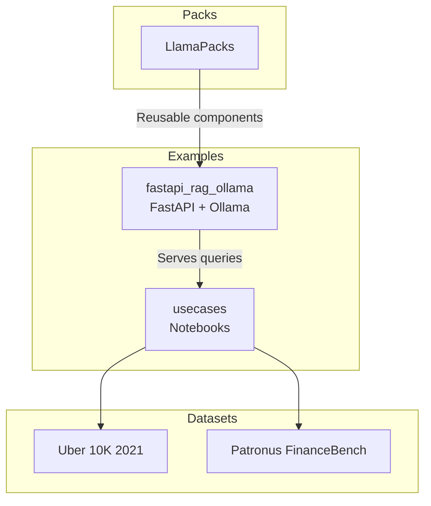
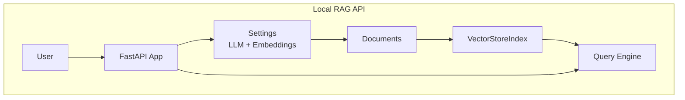
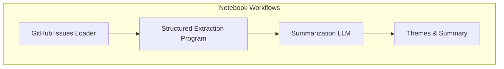
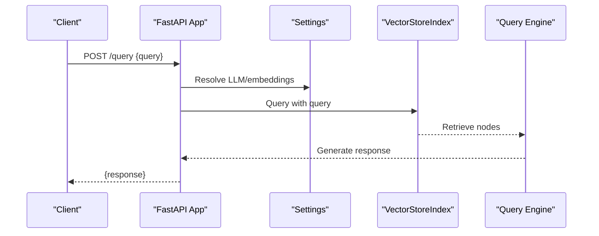
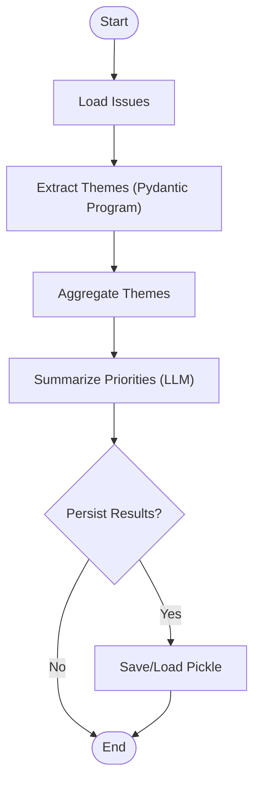
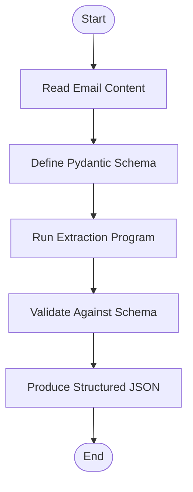
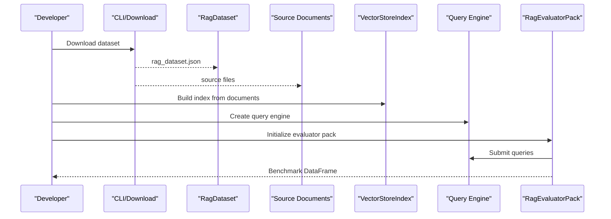
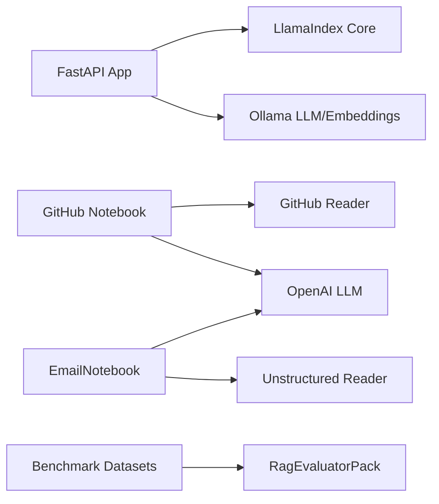

# Use Case Examples

<cite>
**Referenced Files in This Document**
- [examples/fastapi_rag_ollama/README.md](file://examples/fastapi_rag_ollama/README.md)
- [examples/fastapi_rag_ollama/app.py](file://examples/fastapi_rag_ollama/app.py)
- [docs/examples/usecases/github_issue_analysis.ipynb](file://docs/examples/usecases/github_issue_analysis.ipynb)
- [docs/examples/usecases/email_data_extraction.ipynb](file://docs/examples/usecases/email_data_extraction.ipynb)
- [llama-datasets/10k/uber_2021/README.md](file://llama-datasets/10k/uber_2021/README.md)
- [llama-datasets/patronus_financebench/README.md](file://llama-datasets/patronus_financebench/README.md)
- [llama-index-packs/README.md](file://llama-index-packs/README.md)
</cite>

## Table of Contents
1. [Introduction](#introduction)
2. [Project Structure](#project-structure)
3. [Core Components](#core-components)
4. [Architecture Overview](#architecture-overview)
5. [Detailed Component Analysis](#detailed-component-analysis)
6. [Dependency Analysis](#dependency-analysis)
7. [Performance Considerations](#performance-considerations)
8. [Troubleshooting Guide](#troubleshooting-guide)
9. [Conclusion](#conclusion)
10. [Appendices](#appendices)

## Introduction
This document presents real-world use case implementations of LlamaIndex across diverse industries and applications. It covers enterprise knowledge bases, customer support systems, research assistants, and specialized data analysis platforms. The focus areas include:
- Enterprise knowledge bases and internal search
- Customer support automation and triage
- Research assistance and scientific literature analysis
- Specialized data extraction and processing (financial documents, email content)
- Benchmarking and evaluation pipelines
- Managed service integrations and production deployments

The examples highlight end-to-end workflows: data preparation, system configuration, query execution, and deployment considerations. Performance metrics, scalability patterns, and maintenance strategies are included to guide production environments.

## Project Structure
The repository organizes relevant materials across examples, datasets, and packs:
- Use case notebooks demonstrating practical scenarios (GitHub issue analysis, email data extraction)
- Minimal FastAPI + LlamaIndex + Ollama example for local RAG serving
- Benchmark datasets and evaluation guidance
- LlamaPacks for reusable, production-ready building blocks

**Section sources**
- [examples/fastapi_rag_ollama/README.md](file://examples/fastapi_rag_ollama/README.md#L1-L58)
- [examples/fastapi_rag_ollama/app.py](file://examples/fastapi_rag_ollama/app.py#L1-L30)
- [docs/examples/usecases/github_issue_analysis.ipynb](file://docs/examples/usecases/github_issue_analysis.ipynb#L1-L422)
- [docs/examples/usecases/email_data_extraction.ipynb](file://docs/examples/usecases/email_data_extraction.ipynb#L1-L671)
- [llama-datasets/10k/uber_2021/README.md](file://llama-datasets/10k/uber_2021/README.md#L1-L62)
- [llama-datasets/patronus_financebench/README.md](file://llama-datasets/patronus_financebench/README.md#L1-L69)
- [llama-index-packs/README.md](file://llama-index-packs/README.md#L1-L33)

## Core Components
- Local RAG API (FastAPI + Ollama): Demonstrates ingestion, indexing, and query serving with local LLMs and embeddings.
- GitHub Issue Analysis: Loads issues, extracts themes via structured extraction, and summarizes priorities.
- Email Data Extraction: Converts unstructured email content into structured JSON using LLMs and Pydantic models.
- Benchmark Datasets: Provides labeled RAG datasets and evaluation guidance for financial and general domains.
- LlamaPacks: Reusable, prebuilt packs for retrieval, query engines, moderation, and evaluation.

Key capabilities:
- Document ingestion and indexing
- Structured extraction and summarization
- Evaluation and benchmarking
- Production serving patterns (FastAPI)
- Integrations with managed services (via external readers and embeddings)

**Section sources**
- [examples/fastapi_rag_ollama/app.py](file://examples/fastapi_rag_ollama/app.py#L1-L30)
- [docs/examples/usecases/github_issue_analysis.ipynb](file://docs/examples/usecases/github_issue_analysis.ipynb#L1-L422)
- [docs/examples/usecases/email_data_extraction.ipynb](file://docs/examples/usecases/email_data_extraction.ipynb#L1-L671)
- [llama-datasets/10k/uber_2021/README.md](file://llama-datasets/10k/uber_2021/README.md#L1-L62)
- [llama-datasets/patronus_financebench/README.md](file://llama-datasets/patronus_financebench/README.md#L1-L69)
- [llama-index-packs/README.md](file://llama-index-packs/README.md#L1-L33)

## Architecture Overview
The examples illustrate two primary patterns:
- Local-first RAG API: Documents are loaded at startup, indexed, and queried via a FastAPI endpoint using local LLMs and embeddings.
- Notebook-driven analysis: Data is ingested from external sources (GitHub, email files), processed through structured extraction and summarization, and optionally persisted for later use.

**Diagram sources**
- [examples/fastapi_rag_ollama/app.py](file://examples/fastapi_rag_ollama/app.py#L1-L30)

**Diagram sources**
- [docs/examples/usecases/github_issue_analysis.ipynb](file://docs/examples/usecases/github_issue_analysis.ipynb#L1-L422)

## Detailed Component Analysis

### Local RAG API (FastAPI + Ollama)
This example builds a minimal, production-style API for document querying using local models.

Implementation highlights:
- Configuration: Local LLM and embedding configured via Settings
- Ingestion: Documents loaded from a directory and indexed
- Serving: FastAPI endpoint responds to queries using the query engine
- Deployment: Ready-to-run with local models and simple requirements

**Diagram sources**
- [examples/fastapi_rag_ollama/app.py](file://examples/fastapi_rag_ollama/app.py#L1-L30)

**Section sources**
- [examples/fastapi_rag_ollama/README.md](file://examples/fastapi_rag_ollama/README.md#L1-L58)
- [examples/fastapi_rag_ollama/app.py](file://examples/fastapi_rag_ollama/app.py#L1-L30)

### GitHub Issue Analysis
This notebook demonstrates analyzing GitHub issues to extract themes and summarize priorities.

Workflow:
- Load issues from a repository using a dedicated reader
- Extract central themes per issue using a structured extraction program
- Aggregate and summarize themes with a summarization LLM
- Optional persistence/loading of extracted themes

**Diagram sources**
- [docs/examples/usecases/github_issue_analysis.ipynb](file://docs/examples/usecases/github_issue_analysis.ipynb#L1-L422)

**Section sources**
- [docs/examples/usecases/github_issue_analysis.ipynb](file://docs/examples/usecases/github_issue_analysis.ipynb#L1-L422)

### Email Data Extraction
This notebook converts unstructured email content into structured JSON using LLMs and Pydantic models.

Workflow:
- Load email content from .eml/.msg files
- Define Pydantic models for structured output
- Use a program to extract and validate structured data against the schema
- Output JSON consumable by downstream applications

**Diagram sources**
- [docs/examples/usecases/email_data_extraction.ipynb](file://docs/examples/usecases/email_data_extraction.ipynb#L1-L671)

**Section sources**
- [docs/examples/usecases/email_data_extraction.ipynb](file://docs/examples/usecases/email_data_extraction.ipynb#L1-L671)

### Benchmarking Implementations
Benchmark datasets provide labeled RAG datasets and evaluation guidance for production-grade assessment.

Highlights:
- Download datasets via CLI or Python API
- Build baseline RAG systems
- Evaluate using dedicated packs with configurable batching and rate limits

**Diagram sources**
- [llama-datasets/10k/uber_2021/README.md](file://llama-datasets/10k/uber_2021/README.md#L1-L62)
- [llama-datasets/patronus_financebench/README.md](file://llama-datasets/patronus_financebench/README.md#L1-L69)

**Section sources**
- [llama-datasets/10k/uber_2021/README.md](file://llama-datasets/10k/uber_2021/README.md#L1-L62)
- [llama-datasets/patronus_financebench/README.md](file://llama-datasets/patronus_financebench/README.md#L1-L69)

### Managed Service Integrations and Packs
LlamaPacks encapsulate reusable components for retrieval, moderation, evaluation, and more. They enable rapid integration with managed services and standardized patterns.

Usage patterns:
- Install specific packs via pip
- Download templates for customization
- Integrate into pipelines and APIs

**Section sources**
- [llama-index-packs/README.md](file://llama-index-packs/README.md#L1-L33)

## Dependency Analysis
The examples rely on:
- Core LlamaIndex modules for ingestion, indexing, and querying
- LLM providers (OpenAI, Ollama) and embedding providers (Ollama)
- External readers for GitHub and file-based content
- Evaluation packs for benchmarking

**Diagram sources**
- [examples/fastapi_rag_ollama/app.py](file://examples/fastapi_rag_ollama/app.py#L1-L30)
- [docs/examples/usecases/github_issue_analysis.ipynb](file://docs/examples/usecases/github_issue_analysis.ipynb#L1-L422)
- [docs/examples/usecases/email_data_extraction.ipynb](file://docs/examples/usecases/email_data_extraction.ipynb#L1-L671)
- [llama-datasets/10k/uber_2021/README.md](file://llama-datasets/10k/uber_2021/README.md#L1-L62)

**Section sources**
- [examples/fastapi_rag_ollama/app.py](file://examples/fastapi_rag_ollama/app.py#L1-L30)
- [docs/examples/usecases/github_issue_analysis.ipynb](file://docs/examples/usecases/github_issue_analysis.ipynb#L1-L422)
- [docs/examples/usecases/email_data_extraction.ipynb](file://docs/examples/usecases/email_data_extraction.ipynb#L1-L671)
- [llama-datasets/10k/uber_2021/README.md](file://llama-datasets/10k/uber_2021/README.md#L1-L62)

## Performance Considerations
- Throughput and latency
  - Batch evaluations and control API call rates to avoid throttling (see dataset README guidance)
  - Tune batch sizes and sleep intervals for lower-tier subscriptions
- Scalability patterns
  - Horizontal scaling of FastAPI services behind load balancers
  - Use managed vector stores and retrieval strategies for large-scale RAG
- Resource sizing
  - Local models reduce external API costs but require local compute capacity
  - Offload heavy LLM calls to managed providers for throughput and reliability
- Observability
  - Instrument query engines and retrieval steps
  - Track latency, token usage, and error rates

[No sources needed since this section provides general guidance]

## Troubleshooting Guide
Common issues and remedies:
- Authentication and credentials
  - GitHub token required for repository issue loading; ensure environment variables are set
  - OpenAI API key required for structured extraction and summarization programs
- Rate limits and quotas
  - Adjust batch size and sleep intervals for evaluation runs
- Model availability
  - Verify local model pulls and embedding model compatibility
- Data ingestion
  - Confirm file formats (.eml/.msg) and reader dependencies are installed

**Section sources**
- [docs/examples/usecases/github_issue_analysis.ipynb](file://docs/examples/usecases/github_issue_analysis.ipynb#L1-L422)
- [docs/examples/usecases/email_data_extraction.ipynb](file://docs/examples/usecases/email_data_extraction.ipynb#L1-L671)
- [llama-datasets/10k/uber_2021/README.md](file://llama-datasets/10k/uber_2021/README.md#L1-L62)

## Conclusion
These examples demonstrate how to apply LlamaIndex across real-world scenarios:
- Build a local RAG API for internal knowledge access
- Analyze GitHub issues to extract and summarize themes
- Convert unstructured email content into structured financial data
- Evaluate systems using curated benchmark datasets
- Compose production-ready solutions using LlamaPacks

Adopting the patterns here enables scalable, maintainable RAG systems tailored to enterprise needs.

[No sources needed since this section summarizes without analyzing specific files]

## Appendices
- Deployment checklist
  - Containerize FastAPI app with local models
  - Secure API endpoints and manage secrets
  - Monitor performance and cost
- Maintenance strategies
  - Periodic re-indexing of updated knowledge bases
  - Retrain or update prompts based on feedback
  - Rotate models and embeddings as providers evolve

[No sources needed since this section provides general guidance]