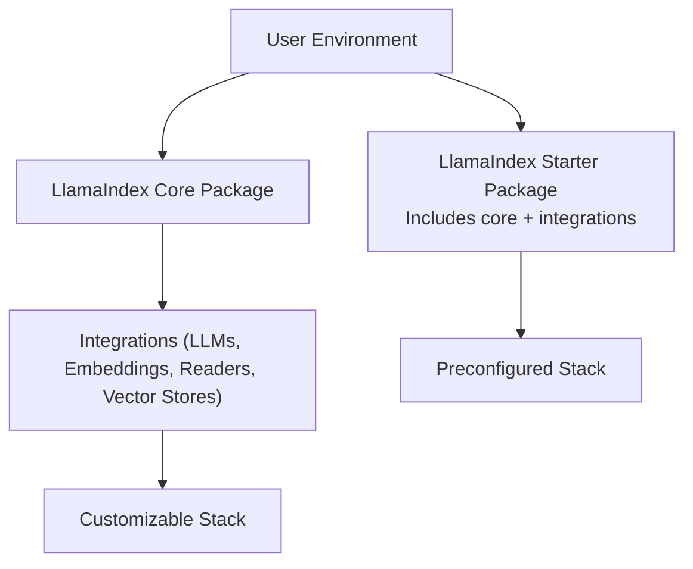
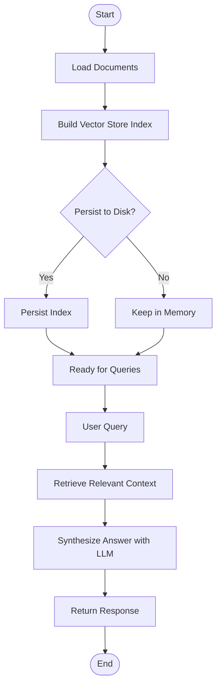
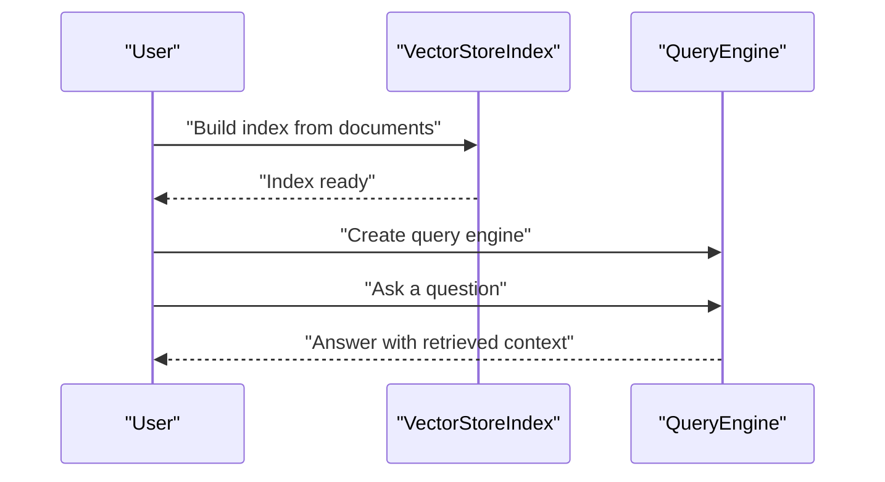
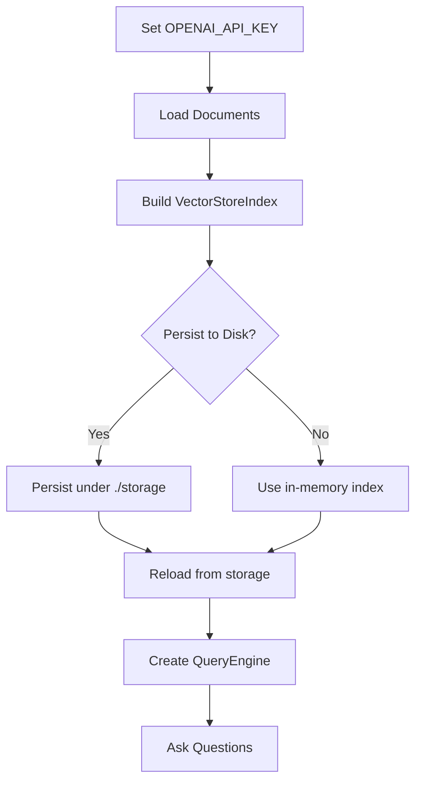
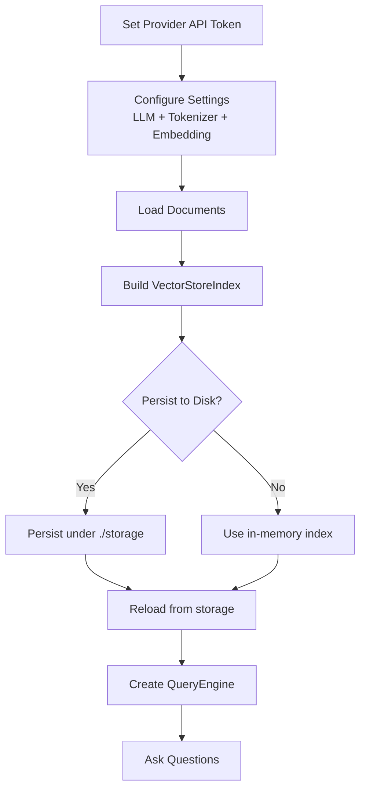
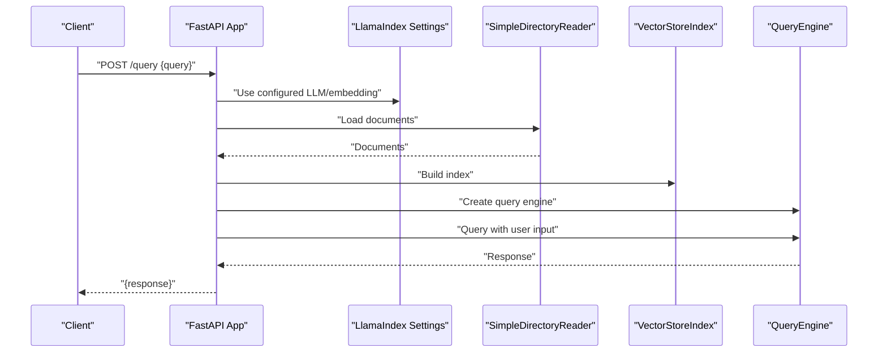
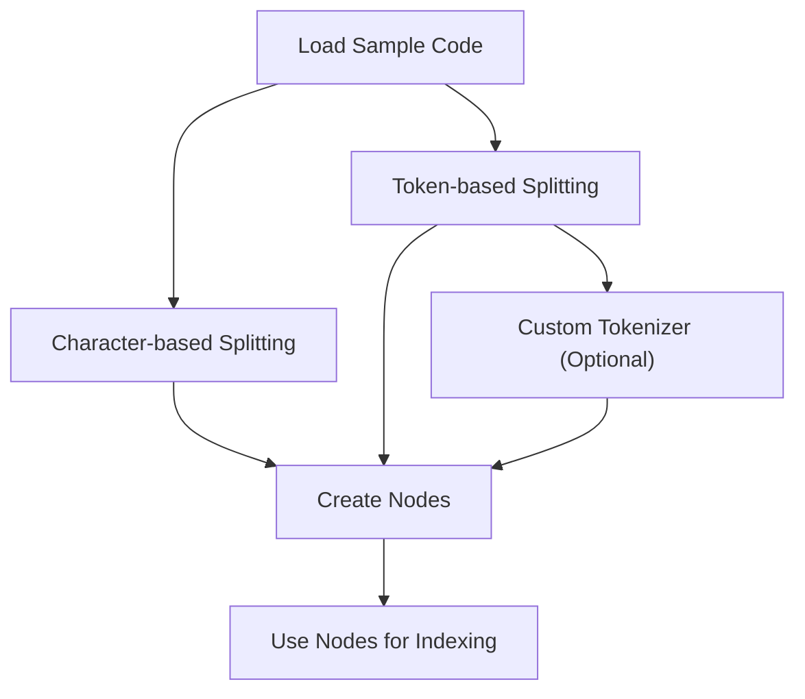
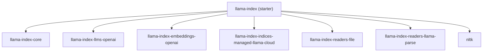

# Getting Started

<cite>
**Referenced Files in This Document**
- [README.md](file://README.md)
- [pyproject.toml](file://pyproject.toml)
- [examples/fastapi_rag_ollama/app.py](file://examples/fastapi_rag_ollama/app.py)
- [examples/fastapi_rag_ollama/README.md](file://examples/fastapi_rag_ollama/README.md)
- [examples/token_based_code_splitter_example.py](file://examples/token_based_code_splitter_example.py)
</cite>

## Table of Contents
1. [Introduction](#introduction)
2. [Project Structure](#project-structure)
3. [Core Components](#core-components)
4. [Architecture Overview](#architecture-overview)
5. [Detailed Component Analysis](#detailed-component-analysis)
6. [Dependency Analysis](#dependency-analysis)
7. [Performance Considerations](#performance-considerations)
8. [Troubleshooting Guide](#troubleshooting-guide)
9. [Conclusion](#conclusion)
10. [Appendices](#appendices)

## Introduction
This guide helps you quickly build your first Retrieval-Augmented Generation (RAG) application with LlamaIndex. You will learn:
- Installation options (starter vs core packages)
- Basic setup and environment configuration
- Essential configuration for LLMs, embeddings, and vector stores
- The end-to-end workflow: data ingestion → indexing → querying
- Practical examples for both OpenAI and non-OpenAI LLMs
- Common setup issues, environment configuration, and initial troubleshooting

## Project Structure
At a high level, LlamaIndex provides:
- A starter package that bundles core and selected integrations
- A core package plus optional integrations for flexible setups
- Examples and documentation to bootstrap your first RAG app

Key takeaways:
- Starter package simplifies installation and is ideal for beginners
- Core package plus integrations lets you pick exactly what you need
- Examples show both OpenAI and non-OpenAI LLM usage patterns

**Section sources**
- [README.md](file://README.md#L11-L24)
- [pyproject.toml](file://pyproject.toml#L42-L50)

## Core Components
Beginner-friendly building blocks you will use:
- Data connectors (readers) to ingest your data
- Indexing engine to structure and store your data
- Query engine to retrieve relevant context and answer questions
- LLM provider integration (OpenAI or others)
- Embedding provider integration (OpenAI or others)

Typical beginner workflow:
- Load data from files or directories
- Build a vector index
- Persist to disk if desired
- Query the index with natural language questions

**Section sources**
- [README.md](file://README.md#L69-L78)
- [README.md](file://README.md#L105-L177)

## Architecture Overview
The RAG pipeline follows a predictable flow: ingest → index → retrieve → synthesize.

**Section sources**
- [README.md](file://README.md#L105-L177)

## Detailed Component Analysis

### Installation Options: Starter vs Core
- Starter package: Includes core and a curated set of integrations for a quick start
- Core package: Install only the core, then add integrations you need (e.g., specific LLMs, embeddings, readers)

Environment and version guidance:
- Minimum Python version is defined in the project configuration
- The starter package pins compatible versions of core and integrations

Practical tips:
- Choose starter for rapid prototyping
- Choose core + integrations for production-grade control

**Section sources**
- [README.md](file://README.md#L11-L24)
- [pyproject.toml](file://pyproject.toml#L72-L73)

### Basic Setup Requirements
Essential environment configuration:
- Set your LLM provider credentials (e.g., API keys)
- Optionally configure embedding provider credentials
- Choose a vector store (defaults to in-memory; can persist to disk)

Where to configure:
- Use environment variables for secrets
- Use LlamaIndex Settings to set LLM, embeddings, and tokenizer

**Section sources**
- [README.md](file://README.md#L105-L177)

### Fundamental Workflow: From Data Ingestion to Querying
Step-by-step:
1. Load documents from a directory or file
2. Build a vector store index from the documents
3. Persist to disk if needed
4. Create a query engine from the index
5. Ask questions and receive answers augmented by retrieved context

**Section sources**
- [README.md](file://README.md#L105-L177)

### Step-by-Step Tutorial: Simple Vector Store Index with OpenAI
- Set your OpenAI API key via environment variable
- Load documents from a directory
- Build a vector store index from the documents
- Persist to disk under a storage directory if desired
- Reload the index from disk later

**Section sources**
- [README.md](file://README.md#L105-L177)

### Step-by-Step Tutorial: Simple Vector Store Index with Non-OpenAI LLMs
- Set your provider’s API token via environment variable
- Configure the LLM, tokenizer, and embedding model via Settings
- Load documents and build a vector store index
- Persist to disk if needed

**Section sources**
- [README.md](file://README.md#L118-L177)

### Practical Example: FastAPI + Local LLM (Ollama)
This example shows how to:
- Configure a local LLM and embedding via Ollama
- Load documents and build an index at startup
- Expose a simple query endpoint

**Section sources**
- [examples/fastapi_rag_ollama/app.py](file://examples/fastapi_rag_ollama/app.py#L1-L30)
- [examples/fastapi_rag_ollama/README.md](file://examples/fastapi_rag_ollama/README.md#L1-L58)

### Practical Example: Token-Based Code Splitting
This example demonstrates:
- Character-based vs token-based splitting
- Using custom tokenizers
- Creating nodes from documents with metadata

**Section sources**
- [examples/token_based_code_splitter_example.py](file://examples/token_based_code_splitter_example.py#L90-L230)

## Dependency Analysis
High-level dependencies for the starter package:
- Core RAG framework
- OpenAI LLM integration
- OpenAI embeddings integration
- Managed index provider integration
- File readers and parsing utilities
- NLTK for text processing

**Section sources**
- [pyproject.toml](file://pyproject.toml#L42-L50)

## Performance Considerations
- Choose appropriate chunk sizes during ingestion to balance recall and cost
- Persist indices to disk for reuse across runs
- Select efficient embedding and LLM providers based on latency and cost targets
- Use token-based splitting for better control over model input sizes

[No sources needed since this section provides general guidance]

## Troubleshooting Guide
Common setup issues and fixes:
- Missing API keys or tokens: Ensure environment variables are set before importing LlamaIndex components
- Version conflicts: Prefer the starter package for compatible versions, or pin core and integrations carefully
- Model availability: Verify that local models (e.g., via Ollama) are pulled and running
- Persistence errors: Confirm the storage directory exists and is writable

Environment configuration checklist:
- Set provider-specific environment variables (e.g., OpenAI API key, replicate token)
- Configure LLM, tokenizer, and embedding models via Settings before loading documents
- Persist and reload indices from the expected storage directory

**Section sources**
- [README.md](file://README.md#L105-L177)
- [examples/fastapi_rag_ollama/README.md](file://examples/fastapi_rag_ollama/README.md#L15-L38)

## Conclusion
You now have the essentials to build a RAG application:
- Choose an installation path (starter or core + integrations)
- Configure environment variables and LlamaIndex Settings
- Ingest data, build an index, and query with confidence
- Explore examples for OpenAI and non-OpenAI providers
- Persist indices and iterate on performance

[No sources needed since this section summarizes without analyzing specific files]

## Appendices

### Appendix A: Quick Reference — OpenAI vs Non-OpenAI Patterns
- OpenAI pattern: set the OpenAI API key, load documents, build index, query
- Non-OpenAI pattern: set the provider token, configure LLM, tokenizer, and embeddings via Settings, then build and query

**Section sources**
- [README.md](file://README.md#L105-L177)