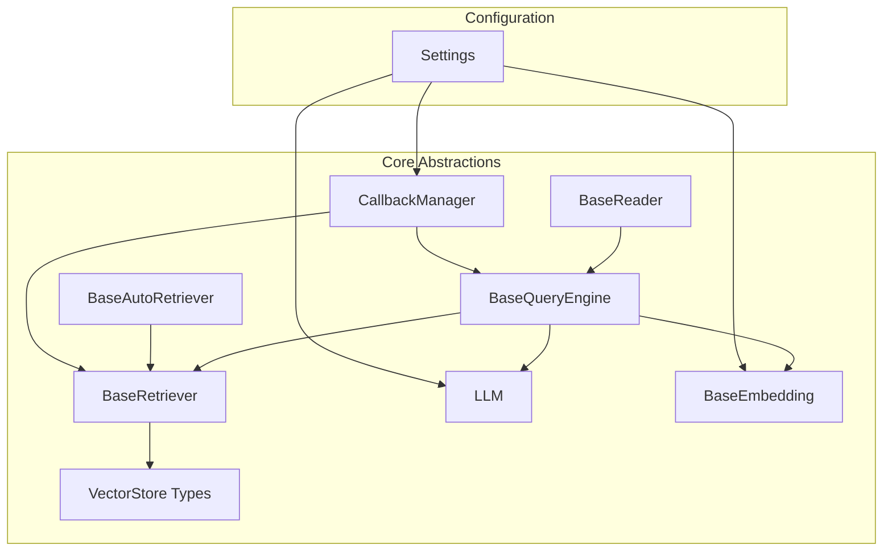
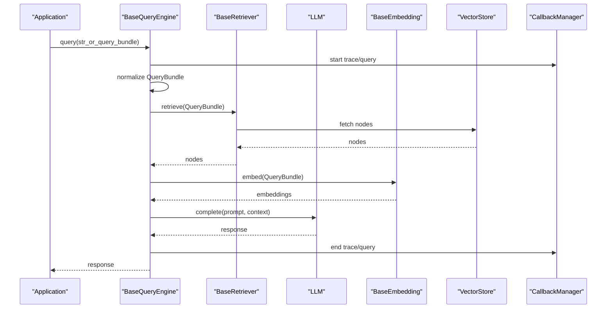
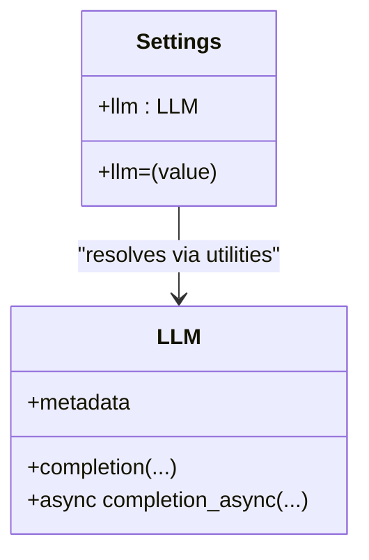
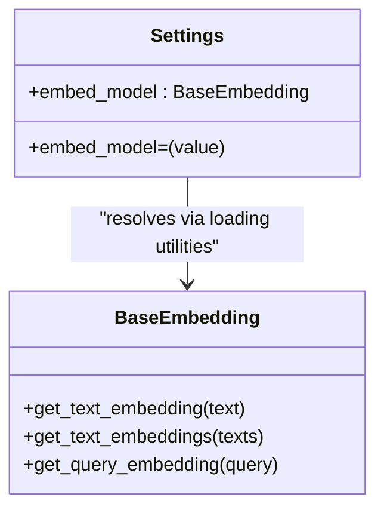
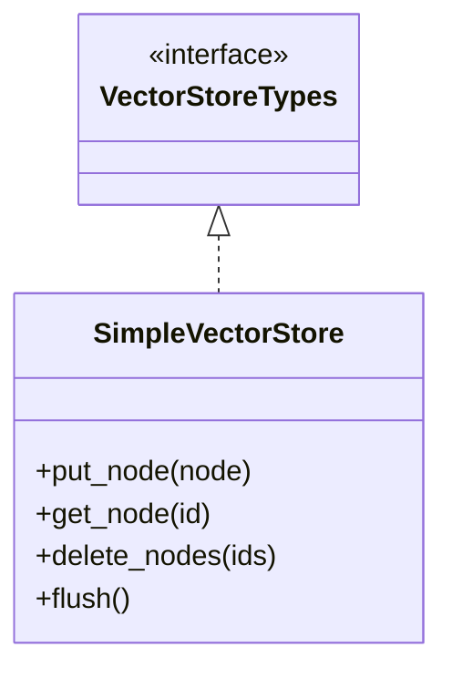
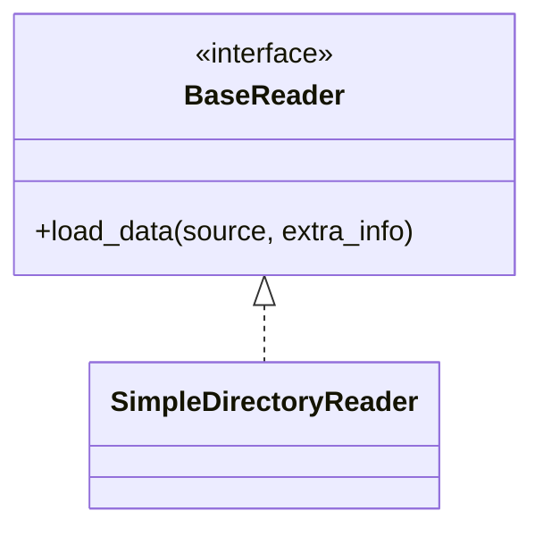
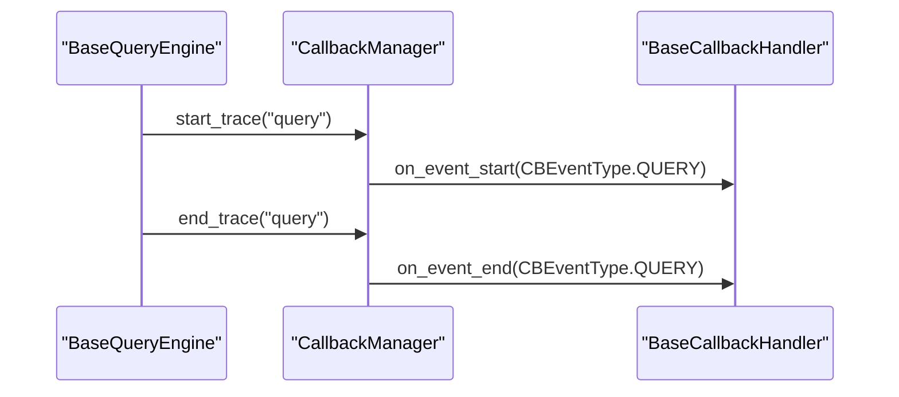
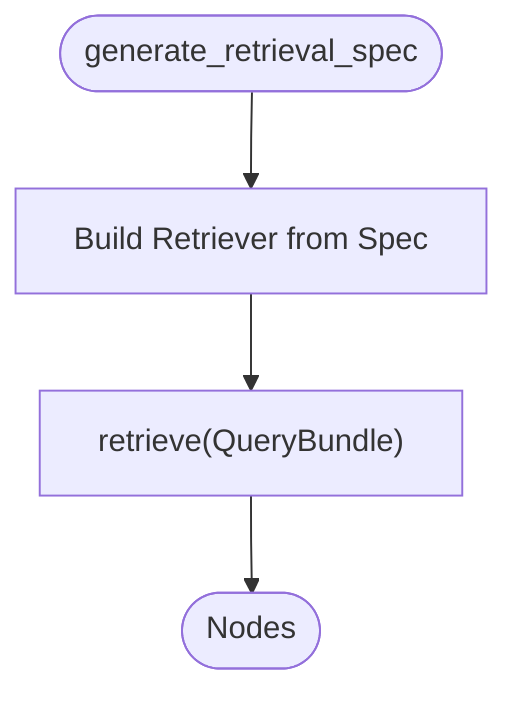
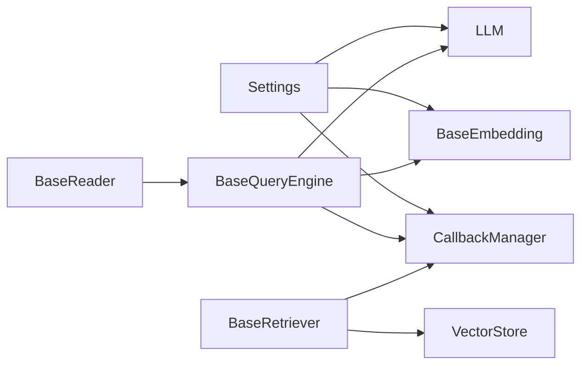

# Custom Integration Development

<cite>
**Referenced Files in This Document**
- [llama_index\core\__init__.py](file://llama_index\core\__init__.py)
- [llama_index\core\settings.py](file://llama_index\core\settings.py)
- [llama_index\core\service_context.py](file://llama_index\core\service_context.py)
- [llama_index\core\base\base_query_engine.py](file://llama_index\core\base\base_query_engine.py)
- [llama_index\core\base\base_retriever.py](file://llama_index\core\base\base_retriever.py)
- [llama_index\core\base\base_auto_retriever.py](file://llama_index\core\base\base_auto_retriever.py)
- [llama_index\core\callbacks\base.py](file://llama_index\core\callbacks\base.py)
- [llama_index\core\llms\llm.py](file://llama_index\core\llms\llm.py)
- [llama_index\core\embeddings\loading.py](file://llama_index\core\embeddings\loading.py)
- [llama_index\core\vector_stores\types.py](file://llama_index\core\vector_stores\types.py)
- [llama_index\core\vector_stores\simple.py](file://llama_index\core\vector_stores\simple.py)
- [llama_index\core\readers\base.py](file://llama_index\core\readers\base.py)
- [llama_index\core\instrumentation\events\query.py](file://llama_index\core\instrumentation\events\query.py)
- [llama_index\core\instrumentation\events\retrieval.py](file://llama_index\core\instrumentation\events\retrieval.py)
- [llama_index-integrations\README.md](file://llama-index-integrations\README.md)
- [CONTRIBUTING.md](file://CONTRIBUTING.md)
</cite>

## Table of Contents
1. [Introduction](#introduction)
2. [Project Structure](#project-structure)
3. [Core Components](#core-components)
4. [Architecture Overview](#architecture-overview)
5. [Detailed Component Analysis](#detailed-component-analysis)
6. [Dependency Analysis](#dependency-analysis)
7. [Performance Considerations](#performance-considerations)
8. [Troubleshooting Guide](#troubleshooting-guide)
9. [Conclusion](#conclusion)
10. [Appendices](#appendices)

## Introduction
This document explains how to develop custom integrations for the LlamaIndex ecosystem. It focuses on extending LLM providers, embedding models, vector stores, data connectors, and observability tools. It documents the base interfaces, abstract classes, and extension points that enable custom integrations, along with adapter patterns, configuration management, testing strategies, and best practices for distribution and contribution.

## Project Structure
LlamaIndex organizes integration points around core abstractions:
- LLMs: Base interface and utilities for language model adapters
- Embeddings: Base interface and resolution utilities for embedding adapters
- Vector Stores: Base types and simple connector for persistent storage
- Readers/Data Connectors: Base reader interface for ingestion pipelines
- Observability: Instrumentation and callback systems for tracing and metrics
- Settings: Centralized configuration for global defaults and module resolution

**Diagram sources**
- [llama_index\core\base\base_query_engine.py](file://llama_index\core\base\base_query_engine.py#L22-L94)
- [llama_index\core\base\base_retriever.py](file://llama_index\core\base\base_retriever.py#L34-L275)
- [llama_index\core\base\base_auto_retriever.py](file://llama_index\core\base\base_auto_retriever.py#L9-L44)
- [llama_index\core\llms\llm.py](file://llama_index\core\llms\llm.py)
- [llama_index\core\embeddings\loading.py](file://llama_index\core\embeddings\loading.py)
- [llama_index\core\vector_stores\types.py](file://llama_index\core\vector_stores\types.py)
- [llama_index\core\readers\base.py](file://llama_index\core\readers\base.py)
- [llama_index\core\callbacks\base.py](file://llama_index\core\callbacks\base.py#L28-L303)
- [llama_index\core\settings.py](file://llama_index\core\settings.py#L17-L249)

**Section sources**
- [llama_index\core\__init__.py](file://llama_index\core\__init__.py#L1-L162)
- [llama_index\core\settings.py](file://llama_index\core\settings.py#L17-L249)
- [llama_index\core\service_context.py](file://llama_index\core\service_context.py#L1-L49)

## Core Components
- BaseQueryEngine: Defines synchronous and asynchronous query interfaces and integrates instrumentation and callbacks.
- BaseRetriever: Provides retrieval APIs with recursive traversal, deduplication, and instrumentation.
- BaseAutoRetriever: Adds dynamic retrieval specification generation and async variants.
- LLM: Base interface for language model adapters; resolved via Settings and utilities.
- BaseEmbedding: Base interface for embedding adapters; resolved via embedding loading utilities.
- VectorStore Types: Shared types and simple connector for vector store integrations.
- BaseReader: Base interface for data readers used in ingestion pipelines.
- CallbackManager: Centralized event-driven tracing and callback orchestration.

**Section sources**
- [llama_index\core\base\base_query_engine.py](file://llama_index\core\base\base_query_engine.py#L22-L94)
- [llama_index\core\base\base_retriever.py](file://llama_index\core\base\base_retriever.py#L34-L275)
- [llama_index\core\base\base_auto_retriever.py](file://llama_index\core\base\base_auto_retriever.py#L9-L44)
- [llama_index\core\llms\llm.py](file://llama_index\core\llms\llm.py)
- [llama_index\core\embeddings\loading.py](file://llama_index\core\embeddings\loading.py)
- [llama_index\core\vector_stores\types.py](file://llama_index\core\vector_stores\types.py)
- [llama_index\core\vector_stores\simple.py](file://llama_index\core\vector_stores\simple.py)
- [llama_index\core\readers\base.py](file://llama_index\core\readers\base.py)
- [llama_index\core\callbacks\base.py](file://llama_index\core\callbacks\base.py#L28-L303)

## Architecture Overview
The integration architecture centers on Settings for module resolution and injection, with Base classes providing extension points. CallbackManager and instrumentation integrate observability across query and retrieval flows.

**Diagram sources**
- [llama_index\core\base\base_query_engine.py](file://llama_index\core\base\base_query_engine.py#L38-L60)
- [llama_index\core\base\base_retriever.py](file://llama_index\core\base\base_retriever.py#L185-L221)
- [llama_index\core\callbacks\base.py](file://llama_index\core\callbacks\base.py#L193-L211)
- [llama_index\core\instrumentation\events\query.py](file://llama_index\core\instrumentation\events\query.py)
- [llama_index\core\instrumentation\events\retrieval.py](file://llama_index\core\instrumentation\events\retrieval.py)

## Detailed Component Analysis

### LLM Adapters
- Extension pattern: Implement the LLM base interface and register via LLM resolution utilities. Settings resolves the default LLM or accepts a configured instance.
- Configuration management: Use Settings.llm setter or pass LLM instances directly to components.
- Testing strategies: Mock the LLM interface and assert prompt handling and response generation.

**Diagram sources**
- [llama_index\core\llms\llm.py](file://llama_index\core\llms\llm.py)
- [llama_index\core\settings.py](file://llama_index\core\settings.py#L32-L47)

**Section sources**
- [llama_index\core\settings.py](file://llama_index\core\settings.py#L32-L47)
- [llama_index\core\llms\llm.py](file://llama_index\core\llms\llm.py)

### Embedding Model Adapters
- Extension pattern: Implement the BaseEmbedding interface and register via embedding loading utilities. Settings resolves the default embedding model or accepts a configured instance.
- Configuration management: Use Settings.embed_model setter or pass embedding instances to components.
- Testing strategies: Mock the embedding interface and assert vector dimensionality and normalization behavior.

**Diagram sources**
- [llama_index\core\embeddings\loading.py](file://llama_index\core\embeddings\loading.py)
- [llama_index\core\settings.py](file://llama_index\core\settings.py#L60-L74)

**Section sources**
- [llama_index\core\settings.py](file://llama_index\core\settings.py#L60-L74)
- [llama_index\core\embeddings\loading.py](file://llama_index\core\embeddings\loading.py)

### Vector Store Connectors
- Extension pattern: Implement the VectorStore types and connect via the simple connector or custom persistence layer. Integrations typically implement CRUD operations for nodes and metadata.
- Configuration management: Pass vector store instances to index constructors or retrieval components.
- Testing strategies: Mock vector store operations and assert upsert, query, and delete semantics.

**Diagram sources**
- [llama_index\core\vector_stores\types.py](file://llama_index\core\vector_stores\types.py)
- [llama_index\core\vector_stores\simple.py](file://llama_index\core\vector_stores\simple.py)

**Section sources**
- [llama_index\core\vector_stores\types.py](file://llama_index\core\vector_stores\types.py)
- [llama_index\core\vector_stores\simple.py](file://llama_index\core\vector_stores\simple.py)

### Data Readers
- Extension pattern: Implement the BaseReader interface to support ingestion from custom sources. Register loaders and use download_loader for dynamic discovery.
- Configuration management: Configure reader parameters via constructor arguments or Settings where applicable.
- Testing strategies: Provide synthetic data streams and assert node generation and metadata propagation.

**Diagram sources**
- [llama_index\core\readers\base.py](file://llama_index\core\readers\base.py)
- [llama_index\core\__init__.py](file://llama_index\core\__init__.py#L67-L67)

**Section sources**
- [llama_index\core\readers\base.py](file://llama_index\core\readers\base.py)
- [llama_index\core\__init__.py](file://llama_index\core\__init__.py#L67-L67)

### Observability and Callback Handlers
- Extension pattern: Implement BaseCallbackHandler and attach via CallbackManager. Use instrumentation spans and events to emit telemetry.
- Configuration management: Set global handler via Settings or pass handlers to components.
- Testing strategies: Capture emitted events and validate handler invocation order and payloads.

**Diagram sources**
- [llama_index\core\callbacks\base.py](file://llama_index\core\callbacks\base.py#L193-L211)
- [llama_index\core\callbacks\base.py](file://llama_index\core\callbacks\base.py#L88-L143)

**Section sources**
- [llama_index\core\callbacks\base.py](file://llama_index\core\callbacks\base.py#L28-L303)

### Auto-Retrieval Pattern
- Extension pattern: Implement BaseAutoRetriever to generate retrieval specs dynamically and build specialized retrievers per query.
- Configuration management: Expose spec generation parameters and delegate retrieval to composed retrievers.
- Testing strategies: Validate spec correctness and ensure composed retriever behavior matches expectations.

**Diagram sources**
- [llama_index\core\base\base_auto_retriever.py](file://llama_index\core\base\base_auto_retriever.py#L12-L31)

**Section sources**
- [llama_index\core\base\base_auto_retriever.py](file://llama_index\core\base\base_auto_retriever.py#L9-L44)

## Dependency Analysis
- Settings centralizes module resolution for LLMs, embeddings, callbacks, tokenizers, and node parsers.
- BaseQueryEngine and BaseRetriever depend on instrumentation and callback systems for observability.
- Vector stores integrate with retrieval components to supply nodes.
- Readers feed nodes into the pipeline, often coordinated with node parsers and embeddings.

**Diagram sources**
- [llama_index\core\settings.py](file://llama_index\core\settings.py#L17-L249)
- [llama_index\core\base\base_query_engine.py](file://llama_index\core\base\base_query_engine.py#L22-L94)
- [llama_index\core\base\base_retriever.py](file://llama_index\core\base\base_retriever.py#L34-L275)
- [llama_index\core\vector_stores\types.py](file://llama_index\core\vector_stores\types.py)
- [llama_index\core\readers\base.py](file://llama_index\core\readers\base.py)

**Section sources**
- [llama_index\core\settings.py](file://llama_index\core\settings.py#L17-L249)
- [llama_index\core\base\base_query_engine.py](file://llama_index\core\base\base_query_engine.py#L22-L94)
- [llama_index\core\base\base_retriever.py](file://llama_index\core\base\base_retriever.py#L34-L275)

## Performance Considerations
- Prefer batching for embeddings and vector store operations to reduce overhead.
- Use async retrieval and query methods where supported to improve throughput.
- Tune chunk size and overlap via Settings.node_parser to balance recall and latency.
- Minimize redundant retrievals by leveraging deduplication logic in BaseRetriever.
- Instrument slow paths using CallbackManager and instrumentation spans to identify bottlenecks.

[No sources needed since this section provides general guidance]

## Troubleshooting Guide
- Authentication: Ensure credentials are configured via environment variables or explicit parameters in adapter constructors. Validate endpoint URLs and API keys before initializing adapters.
- Error handling: Wrap external calls with robust exception handling and propagate meaningful errors upstream. Use CallbackManager to capture exceptions and telemetry.
- Compatibility: Align adapter signatures with base interfaces and preserve backward-compatible method names and parameters.
- Observability: Attach callback handlers to capture query and retrieval events; inspect trace maps and event payloads to diagnose issues.

**Section sources**
- [llama_index\core\callbacks\base.py](file://llama_index\core\callbacks\base.py#L193-L211)
- [llama_index\core\instrumentation\events\query.py](file://llama_index\core\instrumentation\events\query.py)
- [llama_index\core\instrumentation\events\retrieval.py](file://llama_index\core\instrumentation\events\retrieval.py)

## Conclusion
Custom integrations in LlamaIndex are built around well-defined base interfaces and a centralized configuration system. By implementing the appropriate base classes, registering adapters via Settings, and integrating with the callback and instrumentation systems, developers can extend LlamaIndex with robust, observable, and maintainable components.

[No sources needed since this section summarizes without analyzing specific files]

## Appendices

### Practical Examples (by reference)
- Custom LLM integration: Implement the LLM interface and configure via Settings.llm.
  - Reference: [llama_index\core\settings.py](file://llama_index\core\settings.py#L32-L47), [llama_index\core\llms\llm.py](file://llama_index\core\llms\llm.py)
- Custom embedding adapter: Implement BaseEmbedding and configure via Settings.embed_model.
  - Reference: [llama_index\core\settings.py](file://llama_index\core\settings.py#L60-L74), [llama_index\core\embeddings\loading.py](file://llama_index\core\embeddings\loading.py)
- Custom vector store connector: Implement VectorStore types and wire to retrieval components.
  - Reference: [llama_index\core\vector_stores\types.py](file://llama_index\core\vector_stores\types.py), [llama_index\core\vector_stores\simple.py](file://llama_index\core\vector_stores\simple.py)
- Custom data reader: Implement BaseReader and use download_loader for registration.
  - Reference: [llama_index\core\readers\base.py](file://llama_index\core\readers\base.py), [llama_index\core\__init__.py](file://llama_index\core\__init__.py#L67-L67)
- Custom callback handler: Implement BaseCallbackHandler and attach via CallbackManager.
  - Reference: [llama_index\core\callbacks\base.py](file://llama_index\core\callbacks\base.py#L28-L303)

### Contribution and Distribution
- Follow the repository’s contribution guidelines for proposing new integrations.
- Keep backward compatibility by preserving existing method signatures and deprecating old APIs gracefully.
- Provide clear documentation, tests, and examples for new integrations.

**Section sources**
- [CONTRIBUTING.md](file://CONTRIBUTING.md)
- [llama-index-integrations\README.md](file://llama-index-integrations\README.md)