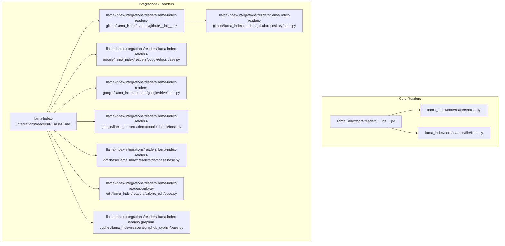
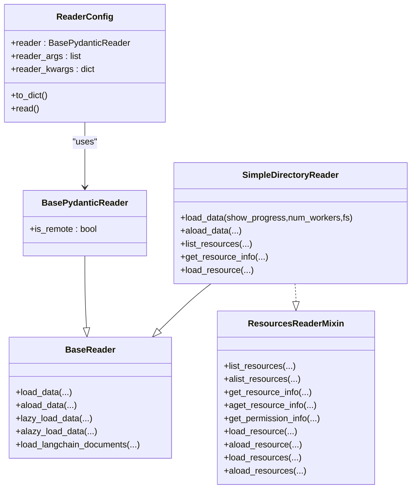
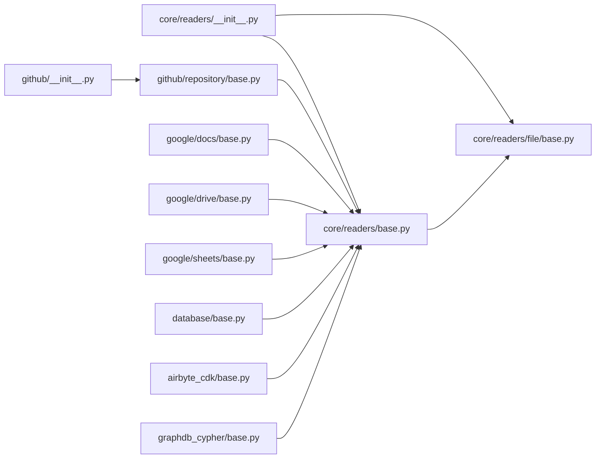

# Data Connector Integrations

<cite>
**Referenced Files in This Document**
- [README.md](file://README.md)
- [__init__.py](file://llama-index-core/llama_index/core/readers/__init__.py)
- [base.py](file://llama-index-core/llama_index/core/readers/base.py)
- [file/base.py](file://llama-index-core/llama_index/core/readers/file/base.py)
- [README.md](file://llama-index-integrations/readers/README.md)
- [github/__init__.py](file://llama-index-integrations/readers/llama-index-readers-github/llama_index/readers/github/__init__.py)
- [repository/base.py](file://llama-index-integrations/readers/llama-index-readers-github/llama_index/readers/github/repository/base.py)
- [google/docs/base.py](file://llama-index-integrations/readers/llama-index-readers-google/llama_index/readers/google/docs/base.py)
- [google/drive/base.py](file://llama-index-integrations/readers/llama-index-readers-google/llama_index/readers/google/drive/base.py)
- [google/sheets/base.py](file://llama-index-integrations/readers/llama-index-readers-google/llama_index/readers/google/sheets/base.py)
- [google/calendar/base.py](file://llama-index-integrations/readers/llama-index-readers-google/llama_index/readers/google/calendar/base.py)
- [google/gmail/base.py](file://llama-index-integrations/readers/llama-index-readers-google/llama_index/readers/google/gmail/base.py)
- [google/keep/base.py](file://llama-index-integrations/readers/llama-index-readers-google/llama_index/readers/google/keep/base.py)
- [google/maps/base.py](file://llama-index-integrations/readers/llama-index-readers-google/llama_index/readers/google/maps/base.py)
- [google/chat/base.py](file://llama-index-integrations/readers/llama-index-readers-google/llama_index/readers/google/chat/base.py)
- [database/base.py](file://llama-index-integrations/readers/llama-index-readers-database/llama_index/readers/database/base.py)
- [README.md](file://llama-index-integrations/readers/llama-index-readers-database/README.md)
- [airbyte_cdk/base.py](file://llama-index-integrations/readers/llama-index-readers-airbyte-cdk/llama_index/readers/airbyte_cdk/base.py)
- [airbyte_cdk/__init__.py](file://llama-index-integrations/readers/llama-index-readers-airbyte-cdk/llama_index/readers/airbyte_cdk/__init__.py)
- [test_readers_airbyte_cdk.py](file://llama-index-integrations/readers/llama-index-readers-airbyte-cdk/tests/test_readers_airbyte_cdk.py)
- [graphdb_cypher/base.py](file://llama-index-integrations/readers/llama-index-readers-graphdb-cypher/llama_index/readers/graphdb_cypher/base.py)
- [test_readers_graphdb_cypher.py](file://llama-index-integrations/readers/llama-index-readers-graphdb-cypher/tests/test_readers_graphdb_cypher.py)
</cite>

## Table of Contents
1. [Introduction](#introduction)
2. [Project Structure](#project-structure)
3. [Core Components](#core-components)
4. [Architecture Overview](#architecture-overview)
5. [Detailed Component Analysis](#detailed-component-analysis)
6. [Dependency Analysis](#dependency-analysis)
7. [Performance Considerations](#performance-considerations)
8. [Troubleshooting Guide](#troubleshooting-guide)
9. [Conclusion](#conclusion)
10. [Appendices](#appendices)

## Introduction
This document explains how LlamaIndex integrates with hundreds of data sources through a unified reader abstraction. It covers the common interface patterns for loading documents, extracting metadata, batching, and streaming; provider-specific authentication and adapters for GitHub repositories, Google Workspace, databases, web APIs, and enterprise platforms; and practical guidance for building custom connectors and contributing new reader adapters to the ecosystem.

## Project Structure
LlamaIndex organizes data connectors under a core readers module with a shared base class and a broad ecosystem of provider-specific adapters. The core readers module defines the foundational interfaces and utilities. Provider-specific readers live in dedicated integration packages and expose classes that inherit from the base reader to implement provider-specific logic.

**Diagram sources**
- [__init__.py](file://llama-index-core/llama_index/core/readers/__init__.py#L1-L33)
- [base.py](file://llama-index-core/llama_index/core/readers/base.py#L1-L250)
- [file/base.py](file://llama-index-core/llama_index/core/readers/file/base.py#L1-L800)
- [README.md](file://llama-index-integrations/readers/README.md#L1-L21)
- [github/__init__.py](file://llama-index-integrations/readers/llama-index-readers-github/llama_index/readers/github/__init__.py#L1-L40)
- [repository/base.py](file://llama-index-integrations/readers/llama-index-readers-github/llama_index/readers/github/repository/base.py#L1-L931)
- [google/docs/base.py](file://llama-index-integrations/readers/llama-index-readers-google/llama_index/readers/google/docs/base.py#L1-L200)
- [google/drive/base.py](file://llama-index-integrations/readers/llama-index-readers-google/llama_index/readers/google/drive/base.py#L1-L200)
- [google/sheets/base.py](file://llama-index-integrations/readers/llama-index-readers-google/llama_index/readers/google/sheets/base.py#L1-L200)
- [database/base.py](file://llama-index-integrations/readers/llama-index-readers-database/llama_index/readers/database/base.py#L1-L200)
- [airbyte_cdk/base.py](file://llama-index-integrations/readers/llama-index-readers-airbyte-cdk/llama_index/readers/airbyte_cdk/base.py#L1-L200)
- [graphdb_cypher/base.py](file://llama-index-integrations/readers/llama-index-readers-graphdb-cypher/llama_index/readers/graphdb_cypher/base.py#L1-L200)

**Section sources**
- [__init__.py](file://llama-index-core/llama_index/core/readers/__init__.py#L1-L33)
- [README.md](file://README.md#L1-L200)
- [README.md](file://llama-index-integrations/readers/README.md#L1-L21)

## Core Components
- Unified reader interface: The BaseReader and BasePydanticReader define synchronous and asynchronous loading methods, plus conversion helpers for LangChain documents. They standardize the contract for all readers.
- Resource-aware readers: ResourcesReaderMixin adds capability to list and inspect provider resources (e.g., files, channels, pages) and load subsets of data by resource ID.
- File system abstraction: SimpleDirectoryReader and FileSystemReaderMixin provide a robust, fsspec-backed file loader supporting remote filesystems, parallel processing, and flexible metadata extraction.
- Reader configuration: ReaderConfig encapsulates a reader instance and its arguments for serialization and reuse.

Key responsibilities:
- Document loading: load_data, aload_data, lazy_load_data, alazy_load_data
- Resource operations: list_resources, get_resource_info, load_resource(s)
- Metadata handling: default file metadata, custom metadata functions, excluded metadata keys
- Batch and streaming: parallel workers, async variants, generator-friendly lazy loading

**Section sources**
- [base.py](file://llama-index-core/llama_index/core/readers/base.py#L1-L250)
- [file/base.py](file://llama-index-core/llama_index/core/readers/file/base.py#L208-L800)
- [__init__.py](file://llama-index-core/llama_index/core/readers/__init__.py#L14-L32)

## Architecture Overview
The reader ecosystem follows a layered pattern:
- Core layer: BaseReader and mixins define the contract and utilities.
- Provider adapters: Each integration package implements readers tailored to a specific platform or protocol.
- Composition: ReaderConfig and download_loader enable dynamic discovery and instantiation of readers.

**Diagram sources**
- [base.py](file://llama-index-core/llama_index/core/readers/base.py#L19-L250)
- [file/base.py](file://llama-index-core/llama_index/core/readers/file/base.py#L208-L800)
- [__init__.py](file://llama-index-core/llama_index/core/readers/__init__.py#L22-L32)

## Detailed Component Analysis

### Unified Reader Abstraction
- Methods and semantics:
  - Synchronous: load_data returns a list; lazy_load_data yields Documents.
  - Asynchronous: aload_data and alazy_load_data provide async counterparts, with default thread-based fallback for true async implementations.
  - LangChain interoperability: load_langchain_documents converts to LangChain’s Document format.
- Extensibility:
  - BasePydanticReader adds serializability and a flag indicating remote vs local data sources.
  - ResourcesReaderMixin standardizes resource enumeration, inspection, and targeted loading.

Best practices:
- Prefer lazy_load_data for large datasets to reduce memory pressure.
- Implement async variants when IO-bound operations dominate.
- Use get_resource_info and list_resources to pre-filter and parallelize by resource sets.

**Section sources**
- [base.py](file://llama-index-core/llama_index/core/readers/base.py#L19-L104)
- [base.py](file://llama-index-core/llama_index/core/readers/base.py#L164-L221)
- [base.py](file://llama-index-core/llama_index/core/readers/base.py#L223-L250)

### File System Reader: SimpleDirectoryReader
- Capabilities:
  - Traverse directories or target files, support include/exclude filters, recursion, and file limits.
  - Automatic file-type routing using a default mapping of suffixes to specialized readers.
  - Remote filesystem support via fsspec, with local fallback.
  - Parallel loading with worker pools and progress reporting.
  - Flexible metadata extraction via a callable and default filesystem metadata.
- Resource operations:
  - list_resources returns file paths.
  - get_resource_info returns filesystem stats.
  - load_resource loads a single file with optional fs override and metadata injection.

Performance tips:
- Use num_workers > 1 for CPU-bound parsing tasks.
- Limit file sets with required_exts, exclude patterns, and num_files_limit.
- For very large directories, prefer resource-based batching with list_resources and load_resources.

**Section sources**
- [file/base.py](file://llama-index-core/llama_index/core/readers/file/base.py#L208-L800)

### GitHub Repositories Reader
- Purpose:
  - Fetch repository contents from a branch or commit, optionally using parser adapters for supported file types.
- Authentication:
  - Uses a GitHub client configured with credentials (e.g., personal access tokens).
  - Supports GitHub App authentication when optional dependencies are present.
- Filtering and control:
  - Directory, extension, and path filters (include/exclude).
  - Concurrent request tuning, timeouts, retries, and a process_file_callback for custom gating.
- Event instrumentation:
  - Emits events for repository processing lifecycle and per-file processing outcomes.
- Data extraction:
  - Decodes base64 blobs, parses with specialized readers when available, falls back to UTF-8 decoding.
  - Builds Document objects with metadata including file path, name, and URL.

Common usage patterns:
- Load a branch or commit.
- Apply filters to restrict scope.
- Stream or batch-process results.
- Integrate with event handlers for observability.

**Section sources**
- [github/__init__.py](file://llama-index-integrations/readers/llama-index-readers-github/llama_index/readers/github/__init__.py#L1-L40)
- [repository/base.py](file://llama-index-integrations/readers/llama-index-readers-github/llama_index/readers/github/repository/base.py#L52-L207)
- [repository/base.py](file://llama-index-integrations/readers/llama-index-readers-github/llama_index/readers/github/repository/base.py#L377-L534)
- [repository/base.py](file://llama-index-integrations/readers/llama-index-readers-github/llama_index/readers/github/repository/base.py#L619-L772)

### Google Workspace Readers
- Coverage:
  - Docs, Drive, Sheets, Calendar, Gmail, Keep, Maps, Chat readers are available as separate modules.
- Pattern:
  - Each reader exposes a class that inherits from BaseReader and implements provider-specific authentication and data retrieval.
- Typical configuration:
  - OAuth credentials or service account keys depending on the endpoint.
  - Resource selection via IDs or query parameters.

Operational guidance:
- Use resource listing and filtering to scope queries.
- Respect rate limits and pagination.
- Normalize metadata to align with downstream ingestion.

**Section sources**
- [README.md](file://llama-index-integrations/readers/README.md#L1-L21)
- [google/docs/base.py](file://llama-index-integrations/readers/llama-index-readers-google/llama_index/readers/google/docs/base.py#L1-L200)
- [google/drive/base.py](file://llama-index-integrations/readers/llama-index-readers-google/llama_index/readers/google/drive/base.py#L1-L200)
- [google/sheets/base.py](file://llama-index-integrations/readers/llama-index-readers-google/llama_index/readers/google/sheets/base.py#L1-L200)
- [google/calendar/base.py](file://llama-index-integrations/readers/llama-index-readers-google/llama_index/readers/google/calendar/base.py#L1-L200)
- [google/gmail/base.py](file://llama-index-integrations/readers/llama-index-readers-google/llama_index/readers/google/gmail/base.py#L1-L200)
- [google/keep/base.py](file://llama-index-integrations/readers/llama-index-readers-google/llama_index/readers/google/keep/base.py#L1-L200)
- [google/maps/base.py](file://llama-index-integrations/readers/llama-index-readers-google/llama_index/readers/google/maps/base.py#L1-L200)
- [google/chat/base.py](file://llama-index-integrations/readers/llama-index-readers-google/llama_index/readers/google/chat/base.py#L1-L200)

### Database Reader
- Purpose:
  - Execute SQL queries against relational databases and stream or load results as Documents.
- Features:
  - Streaming support via lazy_load_data.
  - Async support via aload_data.
  - Metadata columns, excluded text columns, and custom document IDs derived from row data.
- Example usage:
  - Initialize with a connection URI and schema.
  - Run queries with optional metadata mapping and column exclusions.

Operational notes:
- Use streaming for large result sets.
- Map sensitive or non-text columns to metadata to avoid embedding noise.
- Generate deterministic document IDs for incremental updates.

**Section sources**
- [database/base.py](file://llama-index-integrations/readers/llama-index-readers-database/llama_index/readers/database/base.py#L1-L200)
- [README.md](file://llama-index-integrations/readers/llama-index-readers-database/README.md#L47-L89)

### Airbyte CDK Reader
- Purpose:
  - Adapter for Airbyte CDK sources, enabling standardized ingestion of third-party connectors.
- Validation:
  - Tests confirm the reader inherits from BaseReader.

Integration guidance:
- Use Airbyte’s CDK to define source connectors; wrap them with this reader to integrate into LlamaIndex pipelines.

**Section sources**
- [airbyte_cdk/base.py](file://llama-index-integrations/readers/llama-index-readers-airbyte-cdk/llama_index/readers/airbyte_cdk/base.py#L1-L200)
- [airbyte_cdk/__init__.py](file://llama-index-integrations/readers/llama-index-readers-airbyte-cdk/llama_index/readers/airbyte_cdk/__init__.py#L1-L200)
- [test_readers_airbyte_cdk.py](file://llama-index-integrations/readers/llama-index-readers-airbyte-cdk/tests/test_readers_airbyte_cdk.py#L1-L7)

### GraphDB Cypher Reader
- Purpose:
  - Execute Cypher queries against GraphDB systems and return Documents.
- Validation:
  - Tests confirm the reader inherits from BaseReader.

Usage:
- Configure connection details and run Cypher queries; transform results into Documents for downstream indexing.

**Section sources**
- [graphdb_cypher/base.py](file://llama-index-integrations/readers/llama-index-readers-graphdb-cypher/llama_index/readers/graphdb_cypher/base.py#L1-L200)
- [test_readers_graphdb_cypher.py](file://llama-index-integrations/readers/llama-index-readers-graphdb-cypher/tests/test_readers_graphdb_cypher.py#L1-L7)

### Practical Workflows and Patterns

#### Document Loading and Metadata Handling
- Use BaseReader methods consistently across providers:
  - load_data for immediate lists.
  - lazy_load_data for streaming large datasets.
  - aload_data/alazy_load_data for async environments.
- For file-based sources, leverage SimpleDirectoryReader’s metadata pipeline:
  - default_file_metadata_func for filesystem-derived metadata.
  - file_metadata callable override for custom enrichment.
  - excluded_embed_metadata_keys and excluded_llm_metadata_keys to control embedding and prompt content.

#### Batch Processing and Parallelism
- SimpleDirectoryReader supports parallel file parsing with num_workers.
- GitHub reader controls concurrency via concurrent_requests and buffers data with a buffered iterator.
- Database reader supports streaming queries to avoid loading entire result sets.

#### Incremental Updates
- Generate deterministic document IDs (e.g., from row keys or blob SHAs).
- Use resource-based loading (list_resources/load_resource) to process only changed items.
- Track last-modified timestamps and filter by date ranges where supported.

#### Real-Time Updates and Content Filtering
- GitHub reader supports callbacks and filters to skip or include specific files or directories.
- Database reader allows filtering via SQL WHERE clauses and metadata mapping.
- Google Workspace readers can be scoped to recent changes using provider-specific query parameters.

#### Authentication and Permissions
- GitHub:
  - Personal access tokens or GitHub App authentication (when optional dependencies are installed).
  - Permission info and resource inspection via mixin methods.
- Google Workspace:
  - OAuth credentials or service accounts; configure per-module clients.
- Databases:
  - Connection URIs with embedded credentials; consider environment variables for secrets.
- Airbyte/GraphDB:
  - Provider-specific connection strings and credentials; configure in client initialization.

**Section sources**
- [file/base.py](file://llama-index-core/llama_index/core/readers/file/base.py#L148-L198)
- [repository/base.py](file://llama-index-integrations/readers/llama-index-readers-github/llama_index/readers/github/repository/base.py#L105-L207)
- [database/base.py](file://llama-index-integrations/readers/llama-index-readers-database/llama_index/readers/database/base.py#L1-L200)

## Dependency Analysis
The reader ecosystem exhibits loose coupling:
- Core readers depend on a small set of shared abstractions.
- Provider adapters depend on external libraries and provider SDKs.
- No circular dependencies are evident among core reader classes.

**Diagram sources**
- [base.py](file://llama-index-core/llama_index/core/readers/base.py#L1-L250)
- [file/base.py](file://llama-index-core/llama_index/core/readers/file/base.py#L1-L800)
- [__init__.py](file://llama-index-core/llama_index/core/readers/__init__.py#L1-L33)
- [github/__init__.py](file://llama-index-integrations/readers/llama-index-readers-github/llama_index/readers/github/__init__.py#L1-L40)
- [repository/base.py](file://llama-index-integrations/readers/llama-index-readers-github/llama_index/readers/github/repository/base.py#L1-L931)
- [google/docs/base.py](file://llama-index-integrations/readers/llama-index-readers-google/llama_index/readers/google/docs/base.py#L1-L200)
- [google/drive/base.py](file://llama-index-integrations/readers/llama-index-readers-google/llama_index/readers/google/drive/base.py#L1-L200)
- [google/sheets/base.py](file://llama-index-integrations/readers/llama-index-readers-google/llama_index/readers/google/sheets/base.py#L1-L200)
- [database/base.py](file://llama-index-integrations/readers/llama-index-readers-database/llama_index/readers/database/base.py#L1-L200)
- [airbyte_cdk/base.py](file://llama-index-integrations/readers/llama-index-readers-airbyte-cdk/llama_index/readers/airbyte_cdk/base.py#L1-L200)
- [graphdb_cypher/base.py](file://llama-index-integrations/readers/llama-index-readers-graphdb-cypher/llama_index/readers/graphdb_cypher/base.py#L1-L200)

**Section sources**
- [base.py](file://llama-index-core/llama_index/core/readers/base.py#L1-L250)
- [file/base.py](file://llama-index-core/llama_index/core/readers/file/base.py#L1-L800)
- [__init__.py](file://llama-index-core/llama_index/core/readers/__init__.py#L1-L33)

## Performance Considerations
- Prefer lazy loading and streaming for large datasets to minimize memory usage.
- Use parallel workers judiciously; cap by CPU availability and IO bottlenecks.
- Filter early and often: apply directory, extension, and path filters to reduce traversal and parsing work.
- For remote filesystems, tune buffer sizes and concurrency to match provider limits.
- Generate deterministic IDs to enable efficient incremental updates and deduplication.

## Troubleshooting Guide
- Missing optional dependencies:
  - Some readers require extra packages (e.g., file format parsers). ImportError indicates missing extras; install the appropriate reader package.
- Authentication failures:
  - Verify credentials and scopes for Google Workspace and GitHub.
  - For GitHub App auth, ensure optional dependencies are installed.
- Rate limiting and timeouts:
  - Reduce concurrent_requests or increase timeout/retries for GitHub.
  - Respect provider quotas; implement backoff and retry strategies.
- Large result sets:
  - Use streaming loaders and chunk processing.
  - Apply SQL filters or resource filters to narrow scope.

**Section sources**
- [file/base.py](file://llama-index-core/llama_index/core/readers/file/base.py#L608-L626)
- [github/__init__.py](file://llama-index-integrations/readers/llama-index-readers-github/llama_index/readers/github/__init__.py#L14-L39)
- [repository/base.py](file://llama-index-integrations/readers/llama-index-readers-github/llama_index/readers/github/repository/base.py#L134-L139)

## Conclusion
LlamaIndex’s reader abstraction provides a consistent, extensible foundation for integrating with hundreds of data sources. By adhering to the BaseReader contract, leveraging resource-aware patterns, and applying provider-specific authentication and filtering, teams can build scalable ingestion pipelines. The ecosystem encourages contributions of new readers and adapters, enabling continued expansion of supported sources.

## Appendices

### Best Practices for Custom Data Connector Integrations
- Implement BaseReader or BasePydanticReader and provide load_data and lazy_load_data.
- Add resource enumeration via ResourcesReaderMixin when applicable.
- Support async variants for IO-bound operations.
- Normalize metadata and document IDs for downstream processing.
- Provide clear error messages and handle edge cases gracefully.
- Document authentication, permissions, and configuration options.

### Contributing New Reader Adapters
- Package your reader as a separate integration package.
- Include tests verifying inheritance from BaseReader and basic functionality.
- Document installation and usage with examples.
- Follow the existing patterns demonstrated by GitHub, Google, Database, Airbyte, and GraphDB readers.

**Section sources**
- [test_readers_airbyte_cdk.py](file://llama-index-integrations/readers/llama-index-readers-airbyte-cdk/tests/test_readers_airbyte_cdk.py#L1-L7)
- [test_readers_graphdb_cypher.py](file://llama-index-integrations/readers/llama-index-readers-graphdb-cypher/tests/test_readers_graphdb_cypher.py#L1-L7)