# Database Connectors

<cite>
**Referenced Files in This Document**
- [base.py](file://llama-index-integrations/readers/llama-index-readers-database/llama_index/readers/database/base.py)
- [base.py](file://llama-index-integrations/tools/llama-index-tools-database/llama_index/tools/database/base.py)
- [base.py](file://llama-index-integrations/readers/llama-index-readers-elasticsearch/llama_index/readers/elasticsearch/base.py)
- [base.py](file://llama-index-integrations/readers/llama-index-readers-mongodb/llama_index/readers/mongodb/base.py)
- [base.py](file://llama-index-integrations/vector_stores/llama-index-vector-stores-pinecone/llama_index/vector_stores/pinecone/base.py)
- [base.py](file://llama-index-integrations/vector_stores/llama-index-vector-stores-weaviate/llama_index/vector_stores/weaviate/base.py)
- [base.py](file://llama-index-integrations/vector_stores/llama-index-vector-stores-chroma/llama_index/vector_stores/chroma/base.py)
- [base.py](file://llama-index-integrations/storage/docstore/llama-index-storage-docstore-dynamodb/llama_index/storage/docstore/dynamodb/base.py)
- [base.py](file://llama-index-integrations/storage/chat_store/llama-index-storage-chat-store-dynamodb/llama_index/storage/chat_store/dynamodb/base.py)
- [base.py](file://llama-index-integrations/storage/index_store/llama-index-storage-index-store-dynamodb/llama_index/storage/index_store/dynamodb/base.py)
- [base.py](file://llama-index-integrations/storage/kvstore/llama-index-storage-kvstore-dynamodb/llama_index/storage/kvstore/dynamodb/base.py)
- [base.py](file://llama-index-integrations/vector_stores/llama-index-vector-stores-dynamodb/llama_index/vector_stores/dynamodb/base.py)
- [base.py](file://llama-index-integrations/tools/llama-index-tools-cassandra/llama_index/tools/cassandra/cassandra_database_wrapper.py)
- [base.py](file://llama-index-integrations/readers/llama-index-readers-snowflake/llama_index/readers/snowflake/base.py)
</cite>

## Table of Contents
1. [Introduction](#introduction)
2. [Project Structure](#project-structure)
3. [Core Components](#core-components)
4. [Architecture Overview](#architecture-overview)
5. [Detailed Component Analysis](#detailed-component-analysis)
6. [Dependency Analysis](#dependency-analysis)
7. [Performance Considerations](#performance-considerations)
8. [Troubleshooting Guide](#troubleshooting-guide)
9. [Conclusion](#conclusion)

## Introduction
This document describes the unified database connectors and vector store integrations available in the repository, focusing on:
- Structured data sources: SQL databases (PostgreSQL, MySQL, MSSQL, Snowflake), and NoSQL databases (MongoDB, Cassandra, DynamoDB)
- Search engines: Elasticsearch and OpenSearch
- Vector databases: Weaviate, Pinecone, Chroma

It explains connection management, authentication, query optimization, incremental data loading, and best practices for schema mapping and complex data types across these systems.

## Project Structure
The connectors are organized by domain:
- SQL database readers and tools under readers and tools integrations
- NoSQL and search connectors under readers integrations
- Vector stores under vector_stores integrations
- DynamoDB storage adapters under storage integrations

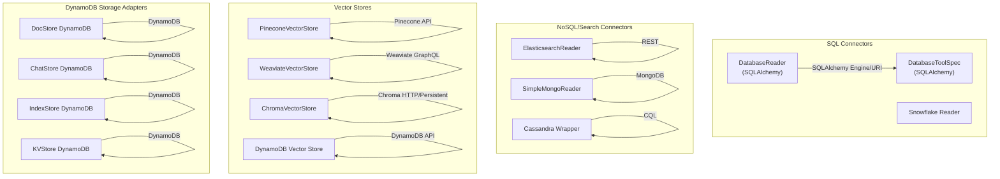

**Diagram sources**
- [base.py](file://llama-index-integrations/readers/llama-index-readers-database/llama_index/readers/database/base.py#L26-L246)
- [base.py](file://llama-index-integrations/tools/llama-index-tools-database/llama_index/tools/database/base.py#L15-L140)
- [base.py](file://llama-index-integrations/readers/llama-index-readers-elasticsearch/llama_index/readers/elasticsearch/base.py#L15-L99)
- [base.py](file://llama-index-integrations/readers/llama-index-readers-mongodb/llama_index/readers/mongodb/base.py#L11-L193)
- [base.py](file://llama-index-integrations/tools/llama-index-tools-cassandra/llama_index/tools/cassandra/cassandra_database_wrapper.py)
- [base.py](file://llama-index-integrations/vector_stores/llama-index-vector-stores-pinecone/llama_index/vector_stores/pinecone/base.py#L114-L552)
- [base.py](file://llama-index-integrations/vector_stores/llama-index-vector-stores-weaviate/llama_index/vector_stores/weaviate/base.py#L113-L556)
- [base.py](file://llama-index-integrations/vector_stores/llama-index-vector-stores-chroma/llama_index/vector_stores/chroma/base.py#L120-L709)
- [base.py](file://llama-index-integrations/vector_stores/llama-index-vector-stores-dynamodb/llama_index/vector_stores/dynamodb/base.py)
- [base.py](file://llama-index-integrations/storage/docstore/llama-index-storage-docstore-dynamodb/llama_index/storage/docstore/dynamodb/base.py)
- [base.py](file://llama-index-integrations/storage/chat_store/llama-index-storage-chat-store-dynamodb/llama_index/storage/chat_store/dynamodb/base.py)
- [base.py](file://llama-index-integrations/storage/index_store/llama-index-storage-index-store-dynamodb/llama_index/storage/index_store/dynamodb/base.py)
- [base.py](file://llama-index-integrations/storage/kvstore/llama-index-storage-kvstore-dynamodb/llama_index/storage/kvstore/dynamodb/base.py)

**Section sources**
- [base.py](file://llama-index-integrations/readers/llama-index-readers-database/llama_index/readers/database/base.py#L1-L246)
- [base.py](file://llama-index-integrations/tools/llama-index-tools-database/llama_index/tools/database/base.py#L1-L140)
- [base.py](file://llama-index-integrations/readers/llama-index-readers-elasticsearch/llama_index/readers/elasticsearch/base.py#L1-L99)
- [base.py](file://llama-index-integrations/readers/llama-index-readers-mongodb/llama_index/readers/mongodb/base.py#L1-L193)
- [base.py](file://llama-index-integrations/tools/llama-index-tools-cassandra/llama_index/tools/cassandra/cassandra_database_wrapper.py)
- [base.py](file://llama-index-integrations/vector_stores/llama-index-vector-stores-pinecone/llama_index/vector_stores/pinecone/base.py#L1-L552)
- [base.py](file://llama-index-integrations/vector_stores/llama-index-vector-stores-weaviate/llama_index/vector_stores/weaviate/base.py#L1-L556)
- [base.py](file://llama-index-integrations/vector_stores/llama-index-vector-stores-chroma/llama_index/vector_stores/chroma/base.py#L1-L709)
- [base.py](file://llama-index-integrations/vector_stores/llama-index-vector-stores-dynamodb/llama_index/vector_stores/dynamodb/base.py)
- [base.py](file://llama-index-integrations/storage/docstore/llama-index-storage-docstore-dynamodb/llama_index/storage/docstore/dynamodb/base.py)
- [base.py](file://llama-index-integrations/storage/chat_store/llama-index-storage-chat-store-dynamodb/llama_index/storage/chat_store/dynamodb/base.py)
- [base.py](file://llama-index-integrations/storage/index_store/llama-index-storage-index-store-dynamodb/llama_index/storage/index_store/dynamodb/base.py)
- [base.py](file://llama-index-integrations/storage/kvstore/llama-index-storage-kvstore-dynamodb/llama_index/storage/kvstore/dynamodb/base.py)

## Core Components
- Unified SQL connector: DatabaseReader and DatabaseToolSpec support SQLAlchemy Engine, URI, or discrete credentials. They stream results, support async loading, and allow metadata mapping and custom document IDs.
- Elasticsearch/OpenSearch connector: ElasticsearchReader loads documents from indices via REST API, supports field selection, metadata fields, and optional embeddings.
- MongoDB connector: SimpleMongoReader connects via URI or host/port, streams documents, supports projections, metadata, and async iteration.
- Vector stores: PineconeVectorStore, WeaviateVectorStore, and ChromaVectorStore implement query, add, delete, and clear operations with standardized metadata filters and query modes.
- DynamoDB adapters: Multiple storage adapters (DocStore, ChatStore, IndexStore, KVStore) and a vector store adapter integrate with AWS DynamoDB.

**Section sources**
- [base.py](file://llama-index-integrations/readers/llama-index-readers-database/llama_index/readers/database/base.py#L26-L246)
- [base.py](file://llama-index-integrations/tools/llama-index-tools-database/llama_index/tools/database/base.py#L15-L140)
- [base.py](file://llama-index-integrations/readers/llama-index-readers-elasticsearch/llama_index/readers/elasticsearch/base.py#L15-L99)
- [base.py](file://llama-index-integrations/readers/llama-index-readers-mongodb/llama_index/readers/mongodb/base.py#L11-L193)
- [base.py](file://llama-index-integrations/vector_stores/llama-index-vector-stores-pinecone/llama_index/vector_stores/pinecone/base.py#L114-L552)
- [base.py](file://llama-index-integrations/vector_stores/llama-index-vector-stores-weaviate/llama_index/vector_stores/weaviate/base.py#L113-L556)
- [base.py](file://llama-index-integrations/vector_stores/llama-index-vector-stores-chroma/llama_index/vector_stores/chroma/base.py#L120-L709)
- [base.py](file://llama-index-integrations/storage/docstore/llama-index-storage-docstore-dynamodb/llama_index/storage/docstore/dynamodb/base.py)
- [base.py](file://llama-index-integrations/storage/chat_store/llama-index-storage-chat-store-dynamodb/llama_index/storage/chat_store/dynamodb/base.py)
- [base.py](file://llama-index-integrations/storage/index_store/llama-index-storage-index-store-dynamodb/llama_index/storage/index_store/dynamodb/base.py)
- [base.py](file://llama-index-integrations/storage/kvstore/llama-index-storage-kvstore-dynamodb/llama_index/storage/kvstore/dynamodb/base.py)
- [base.py](file://llama-index-integrations/vector_stores/llama-index-vector-stores-dynamodb/llama_index/vector_stores/dynamodb/base.py)

## Architecture Overview
The connectors share a common pattern:
- Connection creation via Engine/URI/credentials
- Query execution with streaming and metadata handling
- Standardized metadata mapping and optional custom document IDs
- Vector store abstractions for retrieval and filtering

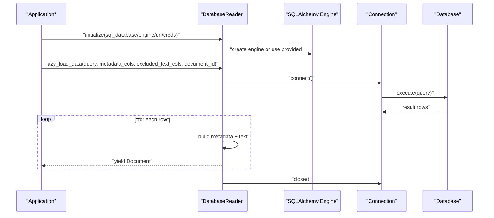

**Diagram sources**
- [base.py](file://llama-index-integrations/readers/llama-index-readers-database/llama_index/readers/database/base.py#L132-L246)

**Section sources**
- [base.py](file://llama-index-integrations/readers/llama-index-readers-database/llama_index/readers/database/base.py#L26-L246)

## Detailed Component Analysis

### SQL Database Connector (DatabaseReader)
- Connection patterns: accepts SQLDatabase, Engine, URI, or discrete credentials; schema honored when constructed internally
- Streaming and async: lazy_load_data yields Documents; async variants available in tool
- Metadata mapping: include/exclude columns; rename metadata keys; custom document_id function
- Error handling: validates query presence; logs warnings for missing columns or invalid metadata items

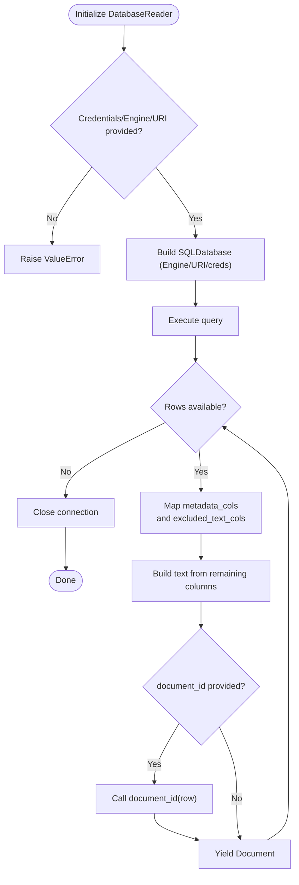

**Diagram sources**
- [base.py](file://llama-index-integrations/readers/llama-index-readers-database/llama_index/readers/database/base.py#L91-L246)

**Section sources**
- [base.py](file://llama-index-integrations/readers/llama-index-readers-database/llama_index/readers/database/base.py#L26-L246)

### SQL Database Tool (DatabaseToolSpec)
- Provides list_tables, describe_tables, and load_data
- Reflects metadata to build table schemas
- Streams rows into Documents

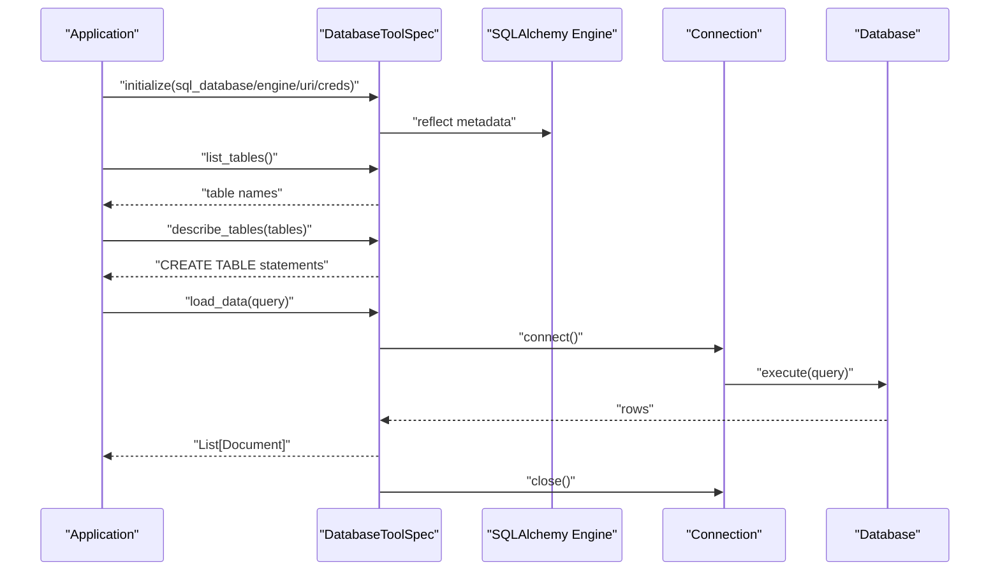

**Diagram sources**
- [base.py](file://llama-index-integrations/tools/llama-index-tools-database/llama_index/tools/database/base.py#L47-L140)

**Section sources**
- [base.py](file://llama-index-integrations/tools/llama-index-tools-database/llama_index/tools/database/base.py#L15-L140)

### Elasticsearch/OpenSearch Reader
- Initializes HTTP client with endpoint and optional client args
- Executes _search with a JSON DSL query
- Builds Documents with id, text, metadata, and optional embeddings

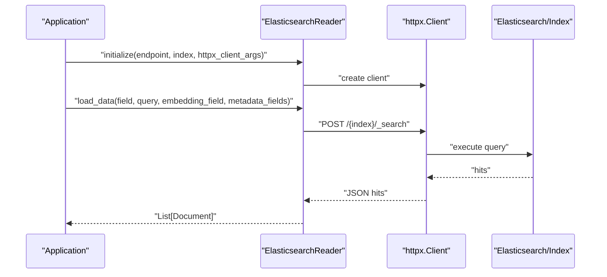

**Diagram sources**
- [base.py](file://llama-index-integrations/readers/llama-index-readers-elasticsearch/llama_index/readers/elasticsearch/base.py#L35-L99)

**Section sources**
- [base.py](file://llama-index-integrations/readers/llama-index-readers-elasticsearch/llama_index/readers/elasticsearch/base.py#L15-L99)

### MongoDB Reader
- Supports URI or host/port; initializes sync and async clients
- lazy_load_data streams documents with configurable field concatenation and metadata
- alazy_load_data provides async streaming

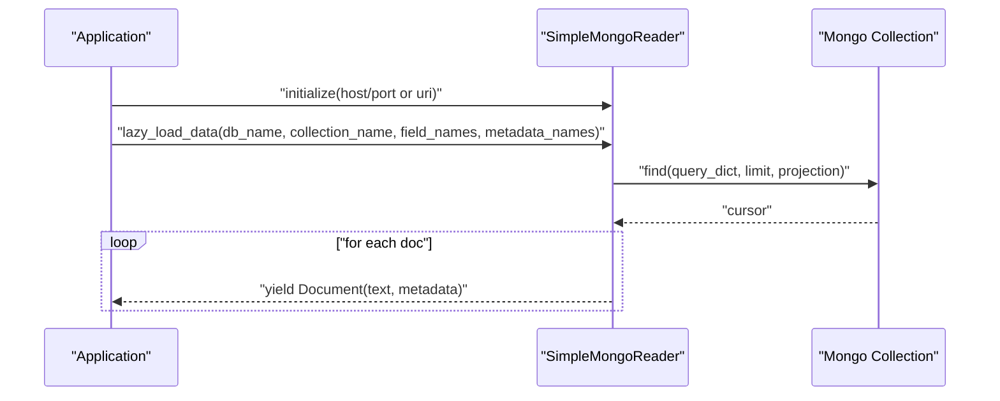

**Diagram sources**
- [base.py](file://llama-index-integrations/readers/llama-index-readers-mongodb/llama_index/readers/mongodb/base.py#L58-L193)

**Section sources**
- [base.py](file://llama-index-integrations/readers/llama-index-readers-mongodb/llama_index/readers/mongodb/base.py#L11-L193)

### Vector Stores

#### PineconeVectorStore
- Adds nodes with optional sparse vectors
- Queries with hybrid/sparse/default modes
- Converts standard metadata filters to Pinecone-specific filters
- Supports batched upsert and deletes

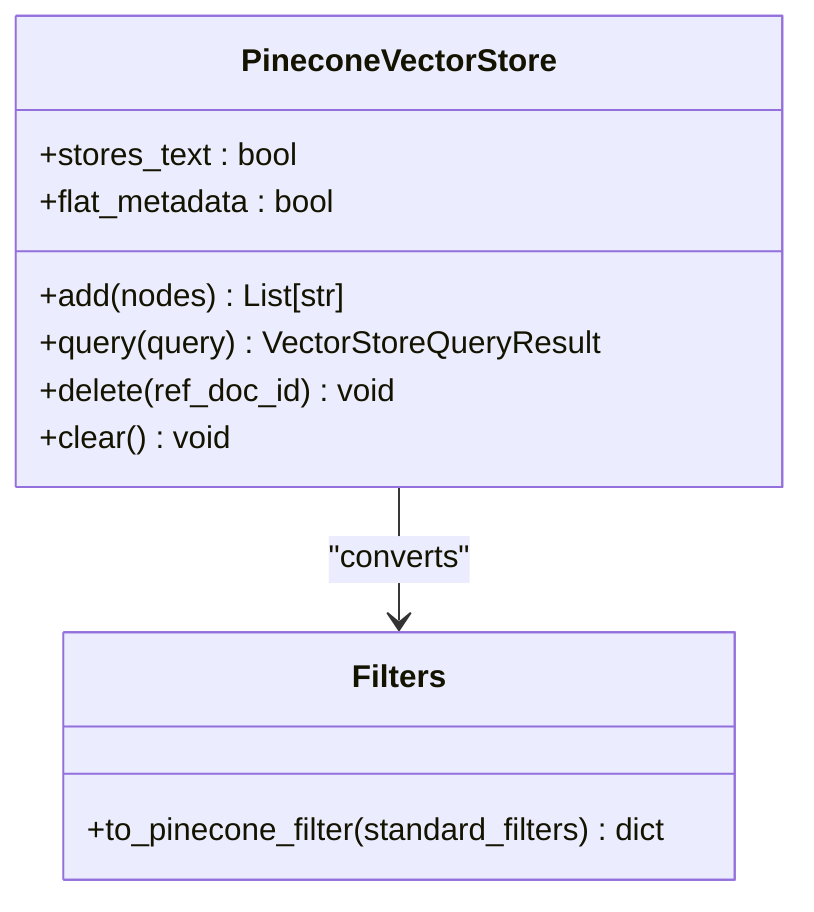

**Diagram sources**
- [base.py](file://llama-index-integrations/vector_stores/llama-index-vector-stores-pinecone/llama_index/vector_stores/pinecone/base.py#L114-L552)

**Section sources**
- [base.py](file://llama-index-integrations/vector_stores/llama-index-vector-stores-pinecone/llama_index/vector_stores/pinecone/base.py#L114-L552)

#### WeaviateVectorStore
- Adds nodes with batching; supports async add
- Converts standard filters to Weaviate GraphQL filters
- Hybrid search with configurable alpha
- Schema creation and cleanup

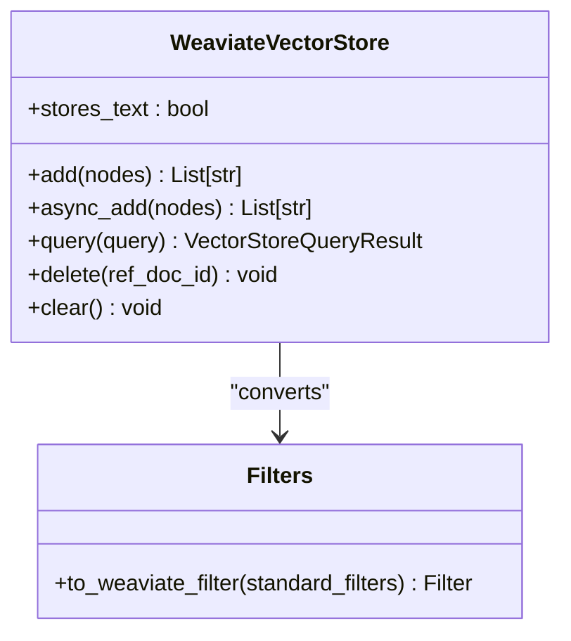

**Diagram sources**
- [base.py](file://llama-index-integrations/vector_stores/llama-index-vector-stores-weaviate/llama_index/vector_stores/weaviate/base.py#L113-L556)

**Section sources**
- [base.py](file://llama-index-integrations/vector_stores/llama-index-vector-stores-weaviate/llama_index/vector_stores/weaviate/base.py#L113-L556)

#### ChromaVectorStore
- Adds nodes in chunks respecting max sizes
- Supports MMR search with prefetch and threshold controls
- Converts standard filters to Chroma $and/$or/$ operators
- get/query/delete with metadata filtering

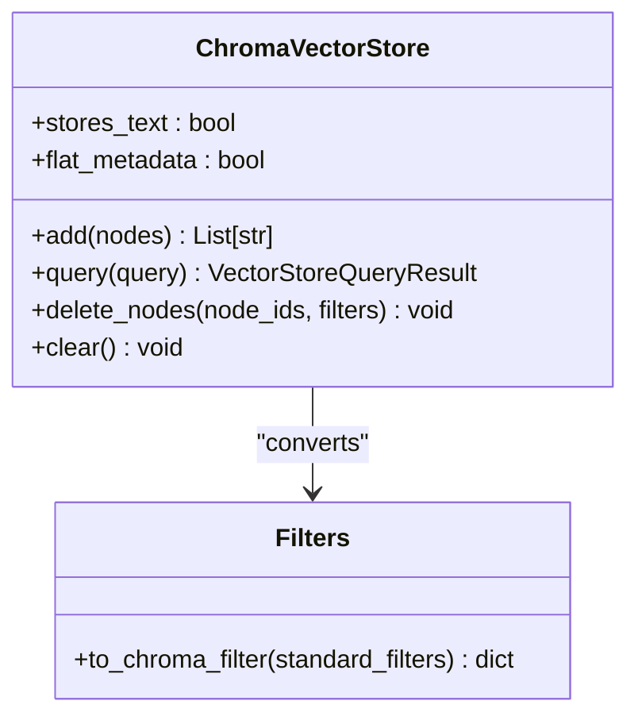

**Diagram sources**
- [base.py](file://llama-index-integrations/vector_stores/llama-index-vector-stores-chroma/llama_index/vector_stores/chroma/base.py#L120-L709)

**Section sources**
- [base.py](file://llama-index-integrations/vector_stores/llama-index-vector-stores-chroma/llama_index/vector_stores/chroma/base.py#L120-L709)

### DynamoDB Adapters and Vector Store
- DocStore, ChatStore, IndexStore, KVStore adapters integrate with DynamoDB for persistence
- DynamoDB vector store adapter integrates with DynamoDB’s vector capabilities

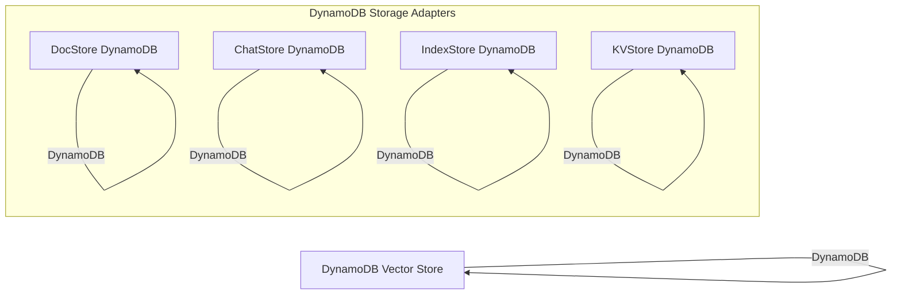

**Diagram sources**
- [base.py](file://llama-index-integrations/storage/docstore/llama-index-storage-docstore-dynamodb/llama_index/storage/docstore/dynamodb/base.py)
- [base.py](file://llama-index-integrations/storage/chat_store/llama-index-storage-chat-store-dynamodb/llama_index/storage/chat_store/dynamodb/base.py)
- [base.py](file://llama-index-integrations/storage/index_store/llama-index-storage-index-store-dynamodb/llama_index/storage/index_store/dynamodb/base.py)
- [base.py](file://llama-index-integrations/storage/kvstore/llama-index-storage-kvstore-dynamodb/llama_index/storage/kvstore/dynamodb/base.py)
- [base.py](file://llama-index-integrations/vector_stores/llama-index-vector-stores-dynamodb/llama_index/vector_stores/dynamodb/base.py)

**Section sources**
- [base.py](file://llama-index-integrations/storage/docstore/llama-index-storage-docstore-dynamodb/llama_index/storage/docstore/dynamodb/base.py)
- [base.py](file://llama-index-integrations/storage/chat_store/llama-index-storage-chat-store-dynamodb/llama_index/storage/chat_store/dynamodb/base.py)
- [base.py](file://llama-index-integrations/storage/index_store/llama-index-storage-index-store-dynamodb/llama_index/storage/index_store/dynamodb/base.py)
- [base.py](file://llama-index-integrations/storage/kvstore/llama-index-storage-kvstore-dynamodb/llama_index/storage/kvstore/dynamodb/base.py)
- [base.py](file://llama-index-integrations/vector_stores/llama-index-vector-stores-dynamodb/llama_index/vector_stores/dynamodb/base.py)

### Cassandra Database Wrapper
- Provides a wrapper around Cassandra for database operations

**Section sources**
- [cassandra_database_wrapper.py](file://llama-index-integrations/tools/llama-index-tools-cassandra/llama_index/tools/cassandra/cassandra_database_wrapper.py)

### Snowflake Reader
- Reader for Snowflake data sources

**Section sources**
- [base.py](file://llama-index-integrations/readers/llama-index-readers-snowflake/llama_index/readers/snowflake/base.py)

## Dependency Analysis
- SQL connectors depend on SQLAlchemy for Engine/URI and connection management
- Elasticsearch connector depends on httpx for REST requests
- MongoDB connector depends on pymongo for sync and async clients
- Vector stores depend on their respective SDKs (pinecone, weaviate, chromadb)
- DynamoDB adapters depend on boto3-compatible APIs for persistence

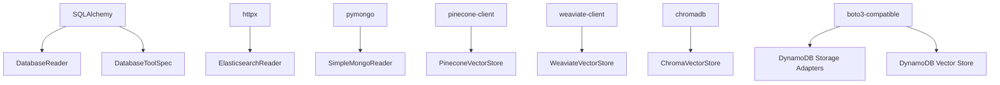

**Diagram sources**
- [base.py](file://llama-index-integrations/readers/llama-index-readers-database/llama_index/readers/database/base.py#L17-L21)
- [base.py](file://llama-index-integrations/readers/llama-index-readers-elasticsearch/llama_index/readers/elasticsearch/base.py#L39-L49)
- [base.py](file://llama-index-integrations/readers/llama-index-readers-mongodb/llama_index/readers/mongodb/base.py#L30-L46)
- [base.py](file://llama-index-integrations/vector_stores/llama-index-vector-stores-pinecone/llama_index/vector_stores/pinecone/base.py#L27-L32)
- [base.py](file://llama-index-integrations/vector_stores/llama-index-vector-stores-weaviate/llama_index/vector_stores/weaviate/base.py#L36-L37)
- [base.py](file://llama-index-integrations/vector_stores/llama-index-vector-stores-chroma/llama_index/vector_stores/chroma/base.py#L7-L8)
- [base.py](file://llama-index-integrations/storage/docstore/llama-index-storage-docstore-dynamodb/llama_index/storage/docstore/dynamodb/base.py)
- [base.py](file://llama-index-integrations/vector_stores/llama-index-vector-stores-dynamodb/llama_index/vector_stores/dynamodb/base.py)

**Section sources**
- [base.py](file://llama-index-integrations/readers/llama-index-readers-database/llama_index/readers/database/base.py#L17-L21)
- [base.py](file://llama-index-integrations/readers/llama-index-readers-elasticsearch/llama_index/readers/elasticsearch/base.py#L39-L49)
- [base.py](file://llama-index-integrations/readers/llama-index-readers-mongodb/llama_index/readers/mongodb/base.py#L30-L46)
- [base.py](file://llama-index-integrations/vector_stores/llama-index-vector-stores-pinecone/llama_index/vector_stores/pinecone/base.py#L27-L32)
- [base.py](file://llama-index-integrations/vector_stores/llama-index-vector-stores-weaviate/llama_index/vector_stores/weaviate/base.py#L36-L37)
- [base.py](file://llama-index-integrations/vector_stores/llama-index-vector-stores-chroma/llama_index/vector_stores/chroma/base.py#L7-L8)
- [base.py](file://llama-index-integrations/storage/docstore/llama-index-storage-docstore-dynamodb/llama_index/storage/docstore/dynamodb/base.py)
- [base.py](file://llama-index-integrations/vector_stores/llama-index-vector-stores-dynamodb/llama_index/vector_stores/dynamodb/base.py)

## Performance Considerations
- Streaming and chunking
  - DatabaseReader lazy_load_data streams rows to avoid large in-memory payloads
  - ChromaVectorStore adds nodes in chunks respecting MAX_CHUNK_SIZE
- Query modes and filtering
  - Vector stores convert standard filters to vendor-specific filter specs to minimize round trips
  - MMR mode in ChromaVectorStore uses prefetch factors to improve diversity while controlling candidate count
- Embedding strategies
  - PineconeVectorStore optionally adds sparse vectors and supports custom tokenizers
- Async support
  - DatabaseToolSpec supports async loading patterns
  - SimpleMongoReader provides async lazy_load_data
- Network and SDK considerations
  - ElasticsearchReader uses httpx client; configure timeouts and retries externally
  - Vector stores rely on SDK defaults; tune batch sizes and namespaces per vendor guidance

[No sources needed since this section provides general guidance]

## Troubleshooting Guide
- SQL connectors
  - Missing query: raises explicit error; ensure query is provided
  - Invalid metadata_cols items: logs warnings and skips invalid entries
  - Schema handling: when passing SQLDatabase, schema parameter is ignored
- Elasticsearch
  - Missing httpx: raises import error; install httpx
  - Malformed query: adjust JSON DSL to match index mapping
- MongoDB
  - Missing fields in documents: raises ValueError; ensure field_names exist
  - Either host/port or uri must be provided
- Vector stores
  - Pinecone: ensure index_name is provided; filter operators must be supported
  - Weaviate: index name must start with uppercase; schema created lazily for async clients
  - Chroma: invalid MMR parameters cause ValueError; avoid mixing mmr_prefetch_factor and mmr_prefetch_k
- DynamoDB
  - Verify credentials and permissions for storage adapters and vector store
  - Ensure table/collection exists or allow automatic creation where supported

**Section sources**
- [base.py](file://llama-index-integrations/readers/llama-index-readers-database/llama_index/readers/database/base.py#L126-L130)
- [base.py](file://llama-index-integrations/readers/llama-index-readers-database/llama_index/readers/database/base.py#L200-L205)
- [base.py](file://llama-index-integrations/readers/llama-index-readers-elasticsearch/llama_index/readers/elasticsearch/base.py#L42-L48)
- [base.py](file://llama-index-integrations/readers/llama-index-readers-mongodb/llama_index/readers/mongodb/base.py#L43-L43)
- [base.py](file://llama-index-integrations/vector_stores/llama-index-vector-stores-pinecone/llama_index/vector_stores/pinecone/base.py#L246-L249)
- [base.py](file://llama-index-integrations/vector_stores/llama-index-vector-stores-weaviate/llama_index/vector_stores/weaviate/base.py#L184-L187)
- [base.py](file://llama-index-integrations/vector_stores/llama-index-vector-stores-chroma/llama_index/vector_stores/chroma/base.py#L512-L516)

## Conclusion
The repository provides a comprehensive set of connectors for structured, semi-structured, and vector data sources. The unified SQL connectors offer flexible connection patterns and robust metadata handling, while specialized readers for Elasticsearch, MongoDB, and vector stores deliver optimized query and retrieval capabilities. DynamoDB adapters enable persistence and vector operations on AWS infrastructure. By leveraging streaming, async patterns, and standardized metadata filters, these connectors support scalable and maintainable data extraction and retrieval workflows.