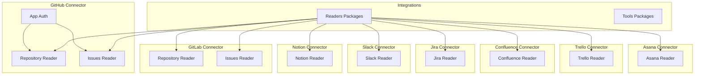
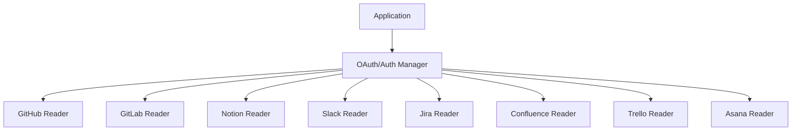
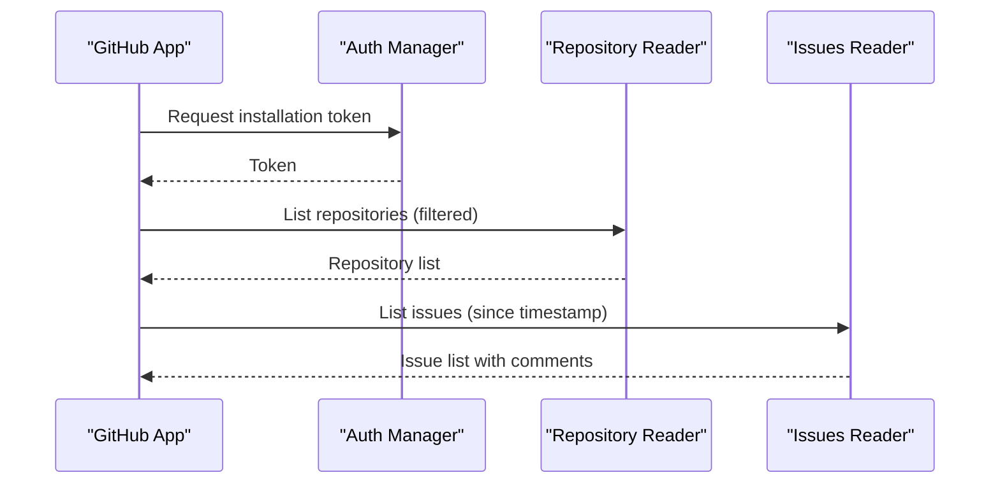
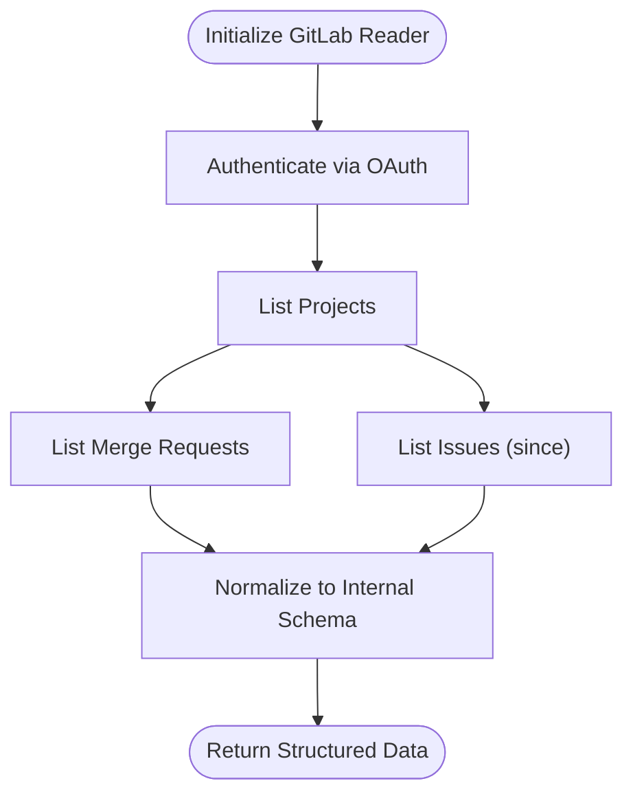
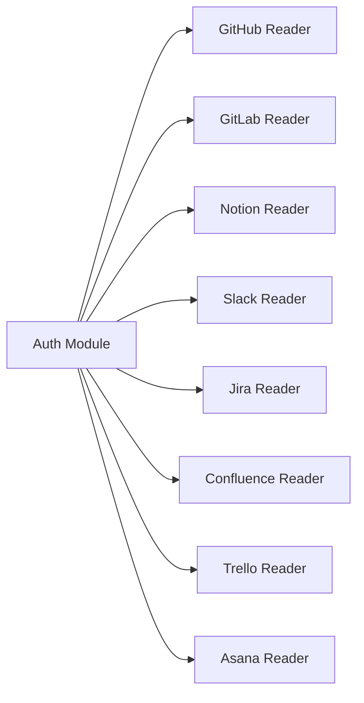

# Enterprise Collaboration Platforms

<cite>
**Referenced Files in This Document**
- [README.md](file://README.md)
- [llama-index-integrations/readers/llama-index-readers-github/README.md](file://llama-index-integrations/readers/llama-index-readers-github/README.md)
- [llama-index-integrations/readers/llama-index-readers-github/llama_index/readers/github/issues/base.py](file://llama-index-integrations/readers/llama-index-readers-github/llama_index/readers/github/issues/base.py)
- [llama-index-integrations/readers/llama-index-readers-github/llama_index/readers/github/repository/base.py](file://llama-index-integrations/readers/llama-index-readers-github/llama_index/readers/github/repository/base.py)
- [llama-index-integrations/readers/llama-index-readers-github/llama_index/readers/github/github_app_auth.py](file://llama-index-integrations/readers/llama-index-readers-github/llama_index/readers/github/github_app_auth.py)
- [llama-index-integrations/readers/llama-index-readers-gitlab/README.md](file://llama-index-integrations/readers/llama-index-readers-gitlab/README.md)
- [llama-index-integrations/readers/llama-index-readers-gitlab/llama_index/readers/gitlab/issues/base.py](file://llama-index-integrations/readers/llama-index-readers-gitlab/llama_index/readers/gitlab/issues/base.py)
- [llama-index-integrations/readers/llama-index-readers-gitlab/llama_index/readers/gitlab/repository/base.py](file://llama-index-integrations/readers/llama-index-readers-gitlab/llama_index/readers/gitlab/repository/base.py)
- [llama-index-integrations/readers/llama-index-readers-notion/README.md](file://llama-index-integrations/readers/llama-index-readers-notion/README.md)
- [llama-index-integrations/readers/llama-index-readers-notion/llama_index/readers/notion/base.py](file://llama-index-integrations/readers/llama-index-readers-notion/llama_index/readers/notion/base.py)
- [llama-index-integrations/readers/llama-index-readers-slack/README.md](file://llama-index-integrations/readers/llama-index-readers-slack/README.md)
- [llama-index-integrations/readers/llama-index-readers-slack/llama_index/readers/slack/base.py](file://llama-index-integrations/readers/llama-index-readers-slack/llama_index/readers/slack/base.py)
- [llama-index-integrations/readers/llama-index-readers-jira/README.md](file://llama-index-integrations/readers/llama-index-readers-jira/README.md)
- [llama-index-integrations/readers/llama-index-readers-jira/llama_index/readers/jira/base.py](file://llama-index-integrations/readers/llama-index-readers-jira/llama_index/readers/jira/base.py)
- [llama-index-integrations/readers/llama-index-readers-confluence/README.md](file://llama-index-integrations/readers/llama-index-readers-confluence/README.md)
- [llama-index-integrations/readers/llama-index-readers-confluence/llama_index/readers/confluence/base.py](file://llama-index-integrations/readers/llama-index-readers-confluence/llama_index/readers/confluence/base.py)
- [llama-index-integrations/readers/llama-index-readers-trello/README.md](file://llama-index-integrations/readers/llama-index-readers-trello/README.md)
- [llama-index-integrations/readers/llama-index-readers-trello/llama_index/readers/trello/base.py](file://llama-index-integrations/readers/llama-index-readers-trello/llama_index/readers/trello/base.py)
- [llama-index-integrations/readers/llama-index-readers-asana/README.md](file://llama-index-integrations/readers/llama-index-readers-asana/README.md)
- [llama-index-integrations/readers/llama-index-readers-asana/llama_index/readers/asana/base.py](file://llama-index-integrations/readers/llama-index-readers-asana/llama_index/readers/asana/base.py)
- [docs/examples/usecases/github_issue_analysis.ipynb](file://docs/examples/usecases/github_issue_analysis.ipynb)
- [docs/examples/usecases/github_issue_analysis_data.pkl](file://docs/examples/usecases/github_issue_analysis_data.pkl)
</cite>

## Table of Contents
1. [Introduction](#introduction)
2. [Project Structure](#project-structure)
3. [Core Components](#core-components)
4. [Architecture Overview](#architecture-overview)
5. [Detailed Component Analysis](#detailed-component-analysis)
6. [Dependency Analysis](#dependency-analysis)
7. [Performance Considerations](#performance-considerations)
8. [Troubleshooting Guide](#troubleshooting-guide)
9. [Conclusion](#conclusion)

## Introduction
This document describes enterprise collaboration platform connectors within the repository’s integrations ecosystem. It focuses on a unified interface for connecting to over 50 collaboration platforms, including Google Workspace, Microsoft 365, GitHub, GitLab, Bitbucket, Notion, Confluence, Slack, Discord, Microsoft Teams, Trello, Asana, Linear, ClickUp, Monday.com, Airtable, Figma, Jira, Salesforce, HubSpot, and specialized tools like ZenHub for GitHub project management. The goal is to explain how to authenticate via OAuth, manage workspace permissions, handle API rate limits, enforce data access controls, and extract meaningful artifacts such as project data, documentation content, communication logs, and collaborative items. It also covers platform-specific features (version control histories, comment threads, task assignments), best practices for large datasets and incremental synchronization, and strategies to maintain data consistency across platforms.

## Project Structure
The repository organizes collaboration platform connectors as separate packages under the readers and tools namespaces. Each connector package exposes a consistent API surface for reading data from a given platform. Authentication, pagination, filtering, and rate-limit handling are implemented per connector. Example notebooks demonstrate practical extraction and analysis workflows.

**Diagram sources**
- [llama-index-integrations/readers/llama-index-readers-github/README.md](file://llama-index-integrations/readers/llama-index-readers-github/README.md#L1-L200)
- [llama-index-integrations/readers/llama-index-readers-gitlab/README.md](file://llama-index-integrations/readers/llama-index-readers-gitlab/README.md#L1-L200)
- [llama-index-integrations/readers/llama-index-readers-notion/README.md](file://llama-index-integrations/readers/llama-index-readers-notion/README.md#L1-L200)
- [llama-index-integrations/readers/llama-index-readers-slack/README.md](file://llama-index-integrations/readers/llama-index-readers-slack/README.md#L1-L200)
- [llama-index-integrations/readers/llama-index-readers-jira/README.md](file://llama-index-integrations/readers/llama-index-readers-jira/README.md#L1-L200)
- [llama-index-integrations/readers/llama-index-readers-confluence/README.md](file://llama-index-integrations/readers/llama-index-readers-confluence/README.md#L1-L200)
- [llama-index-integrations/readers/llama-index-readers-trello/README.md](file://llama-index-integrations/readers/llama-index-readers-trello/README.md#L1-L200)
- [llama-index-integrations/readers/llama-index-readers-asana/README.md](file://llama-index-integrations/readers/llama-index-readers-asana/README.md#L1-L200)

**Section sources**
- [README.md](file://README.md#L1-L200)
- [llama-index-integrations/readers/llama-index-readers-github/README.md](file://llama-index-integrations/readers/llama-index-readers-github/README.md#L1-L200)
- [llama-index-integrations/readers/llama-index-readers-gitlab/README.md](file://llama-index-integrations/readers/llama-index-readers-gitlab/README.md#L1-L200)
- [llama-index-integrations/readers/llama-index-readers-notion/README.md](file://llama-index-integrations/readers/llama-index-readers-notion/README.md#L1-L200)
- [llama-index-integrations/readers/llama-index-readers-slack/README.md](file://llama-index-integrations/readers/llama-index-readers-slack/README.md#L1-L200)
- [llama-index-integrations/readers/llama-index-readers-jira/README.md](file://llama-index-integrations/readers/llama-index-readers-jira/README.md#L1-L200)
- [llama-index-integrations/readers/llama-index-readers-confluence/README.md](file://llama-index-integrations/readers/llama-index-readers-confluence/README.md#L1-L200)
- [llama-index-integrations/readers/llama-index-readers-trello/README.md](file://llama-index-integrations/readers/llama-index-readers-trello/README.md#L1-L200)
- [llama-index-integrations/readers/llama-index-readers-asana/README.md](file://llama-index-integrations/readers/llama-index-readers-asana/README.md#L1-L200)

## Core Components
- Unified Reader Interface: Each platform reader exposes a consistent API for fetching data. For example, GitHub’s repository and issues readers provide structured methods to enumerate resources and apply filters.
- Authentication Abstractions: Connectors implement OAuth flows and app-based authentication where applicable. GitHub’s app auth module demonstrates a reusable pattern for token issuance and refresh.
- Rate Limiting and Backoff: Readers implement retry logic and throttling to respect provider limits.
- Incremental Sync: Many readers support filtering by timestamps or cursors to pull only changed items.
- Access Control: Connectors validate workspace/project membership and permissions before reading sensitive data.

Practical example references:
- GitHub issue analysis notebook and dataset demonstrate end-to-end extraction and downstream processing.

**Section sources**
- [llama-index-integrations/readers/llama-index-readers-github/llama_index/readers/github/issues/base.py](file://llama-index-integrations/readers/llama-index-readers-github/llama_index/readers/github/issues/base.py#L1-L200)
- [llama-index-integrations/readers/llama-index-readers-github/llama_index/readers/github/repository/base.py](file://llama-index-integrations/readers/llama-index-readers-github/llama_index/readers/github/repository/base.py#L1-L200)
- [llama-index-integrations/readers/llama-index-readers-github/llama_index/readers/github/github_app_auth.py](file://llama-index-integrations/readers/llama-index-readers-github/llama_index/readers/github/github_app_auth.py#L1-L200)
- [docs/examples/usecases/github_issue_analysis.ipynb](file://docs/examples/usecases/github_issue_analysis.ipynb#L1-L200)
- [docs/examples/usecases/github_issue_analysis_data.pkl](file://docs/examples/usecases/github_issue_analysis_data.pkl#L1-L200)

## Architecture Overview
The connectors follow a layered architecture:
- Platform Adapter Layer: Implements OAuth, token management, and API client initialization.
- Resource Reader Layer: Encapsulates resource-specific queries (repositories, issues, channels, pages).
- Data Normalizer Layer: Converts provider-specific payloads into a unified internal representation.
- Pipeline Layer: Integrates with ingestion and indexing pipelines for downstream analytics.

**Diagram sources**
- [llama-index-integrations/readers/llama-index-readers-github/README.md](file://llama-index-integrations/readers/llama-index-readers-github/README.md#L1-L200)
- [llama-index-integrations/readers/llama-index-readers-gitlab/README.md](file://llama-index-integrations/readers/llama-index-readers-gitlab/README.md#L1-L200)
- [llama-index-integrations/readers/llama-index-readers-notion/README.md](file://llama-index-integrations/readers/llama-index-readers-notion/README.md#L1-L200)
- [llama-index-integrations/readers/llama-index-readers-slack/README.md](file://llama-index-integrations/readers/llama-index-readers-slack/README.md#L1-L200)
- [llama-index-integrations/readers/llama-index-readers-jira/README.md](file://llama-index-integrations/readers/llama-index-readers-jira/README.md#L1-L200)
- [llama-index-integrations/readers/llama-index-readers-confluence/README.md](file://llama-index-integrations/readers/llama-index-readers-confluence/README.md#L1-L200)
- [llama-index-integrations/readers/llama-index-readers-trello/README.md](file://llama-index-integrations/readers/llama-index-readers-trello/README.md#L1-L200)
- [llama-index-integrations/readers/llama-index-readers-asana/README.md](file://llama-index-integrations/readers/llama-index-readers-asana/README.md#L1-L200)

## Detailed Component Analysis

### GitHub Connector
- OAuth and App Authentication: Demonstrates GitHub App-based authentication for server-to-server access with scoped permissions.
- Repository Reader: Enumerates repositories, branches, commits, and file content with pagination and filtering.
- Issues Reader: Fetches issues, comments, labels, milestones, and assignees with incremental sync support.
- Best Practices: Use installation tokens, respect rate limits, and filter by last-updated timestamps for incremental updates.

**Diagram sources**
- [llama-index-integrations/readers/llama-index-readers-github/llama_index/readers/github/github_app_auth.py](file://llama-index-integrations/readers/llama-index-readers-github/llama_index/readers/github/github_app_auth.py#L1-L200)
- [llama-index-integrations/readers/llama-index-readers-github/llama_index/readers/github/repository/base.py](file://llama-index-integrations/readers/llama-index-readers-github/llama_index/readers/github/repository/base.py#L1-L200)
- [llama-index-integrations/readers/llama-index-readers-github/llama_index/readers/github/issues/base.py](file://llama-index-integrations/readers/llama-index-readers-github/llama_index/readers/github/issues/base.py#L1-L200)

**Section sources**
- [llama-index-integrations/readers/llama-index-readers-github/README.md](file://llama-index-integrations/readers/llama-index-readers-github/README.md#L1-L200)
- [llama-index-integrations/readers/llama-index-readers-github/llama_index/readers/github/github_app_auth.py](file://llama-index-integrations/readers/llama-index-readers-github/llama_index/readers/github/github_app_auth.py#L1-L200)
- [llama-index-integrations/readers/llama-index-readers-github/llama_index/readers/github/repository/base.py](file://llama-index-integrations/readers/llama-index-readers-github/llama_index/readers/github/repository/base.py#L1-L200)
- [llama-index-integrations/readers/llama-index-readers-github/llama_index/readers/github/issues/base.py](file://llama-index-integrations/readers/llama-index-readers-github/llama_index/readers/github/issues/base.py#L1-L200)

### GitLab Connector
- OAuth and API Client: Implements OAuth-based access and GitLab API client initialization.
- Repository Reader: Lists projects, commits, merge requests, and issues with filtering and pagination.
- Issues Reader: Pulls issues and related metadata with incremental updates.

**Diagram sources**
- [llama-index-integrations/readers/llama-index-readers-gitlab/README.md](file://llama-index-integrations/readers/llama-index-readers-gitlab/README.md#L1-L200)
- [llama-index-integrations/readers/llama-index-readers-gitlab/llama_index/readers/gitlab/repository/base.py](file://llama-index-integrations/readers/llama-index-readers-gitlab/llama_index/readers/gitlab/repository/base.py#L1-L200)
- [llama-index-integrations/readers/llama-index-readers-gitlab/llama_index/readers/gitlab/issues/base.py](file://llama-index-integrations/readers/llama-index-readers-gitlab/llama_index/readers/gitlab/issues/base.py#L1-L200)

**Section sources**
- [llama-index-integrations/readers/llama-index-readers-gitlab/README.md](file://llama-index-integrations/readers/llama-index-readers-gitlab/README.md#L1-L200)
- [llama-index-integrations/readers/llama-index-readers-gitlab/llama_index/readers/gitlab/repository/base.py](file://llama-index-integrations/readers/llama-index-readers-gitlab/llama_index/readers/gitlab/repository/base.py#L1-L200)
- [llama-index-integrations/readers/llama-index-readers-gitlab/llama_index/readers/gitlab/issues/base.py](file://llama-index-integrations/readers/llama-index-readers-gitlab/llama_index/readers/gitlab/issues/base.py#L1-L200)

### Notion Connector
- OAuth and Page Retrieval: Authenticates via OAuth and retrieves pages, databases, and blocks with filtering by date ranges.
- Best Practices: Use database views and rollup properties to reduce payload sizes; implement incremental sync by last-edited time.

**Section sources**
- [llama-index-integrations/readers/llama-index-readers-notion/README.md](file://llama-index-integrations/readers/llama-index-readers-notion/README.md#L1-L200)
- [llama-index-integrations/readers/llama-index-readers-notion/llama_index/readers/notion/base.py](file://llama-index-integrations/readers/llama-index-readers-notion/llama_index/readers/notion/base.py#L1-L200)

### Slack Connector
- OAuth and Channel Messages: Authenticates and reads channel messages, threads, and metadata with pagination and filtering.
- Best Practices: Respect rate limits; use cursor-based pagination; cache recent conversations to avoid repeated fetches.

**Section sources**
- [llama-index-integrations/readers/llama-index-readers-slack/README.md](file://llama-index-integrations/readers/llama-index-readers-slack/README.md#L1-L200)
- [llama-index-integrations/readers/llama-index-readers-slack/llama_index/readers/slack/base.py](file://llama-index-integrations/readers/llama-index-readers-slack/llama_index/readers/slack/base.py#L1-L200)

### Jira Connector
- OAuth and Issue Retrieval: Authenticates and retrieves issues, comments, attachments, and transitions with filtering and incremental updates.
- Best Practices: Use JQL to constrain queries; implement backoff on 429/503; normalize custom field values.

**Section sources**
- [llama-index-integrations/readers/llama-index-readers-jira/README.md](file://llama-index-integrations/readers/llama-index-readers-jira/README.md#L1-L200)
- [llama-index-integrations/readers/llama-index-readers-jira/llama_index/readers/jira/base.py](file://llama-index-integrations/readers/llama-index-readers-jira/llama_index/readers/jira/base.py#L1-L200)

### Confluence Connector
- OAuth and Content Retrieval: Authenticates and retrieves pages, blogs, attachments, and comments with HTML parsing utilities.
- Best Practices: Filter by last modified; parse and clean HTML content; handle large attachment downloads incrementally.

**Section sources**
- [llama-index-integrations/readers/llama-index-readers-confluence/README.md](file://llama-index-integrations/readers/llama-index-readers-confluence/README.md#L1-L200)
- [llama-index-integrations/readers/llama-index-readers-confluence/llama_index/readers/confluence/base.py](file://llama-index-integrations/readers/llama-index-readers-confluence/llama_index/readers/confluence/base.py#L1-L200)

### Trello Connector
- OAuth and Board/Card Retrieval: Authenticates and retrieves boards, lists, cards, comments, and attachments with incremental updates.
- Best Practices: Use board-modified-date filters; paginate lists and cards; cache static metadata.

**Section sources**
- [llama-index-integrations/readers/llama-index-readers-trello/README.md](file://llama-index-integrations/readers/llama-index-readers-trello/README.md#L1-L200)
- [llama-index-integrations/readers/llama-index-readers-trello/llama_index/readers/trello/base.py](file://llama-index-integrations/readers/llama-index-readers-trello/llama_index/readers/trello/base.py#L1-L200)

### Asana Connector
- OAuth and Task Retrieval: Authenticates and retrieves projects, portfolios, tasks, stories, and comments with filtering and pagination.
- Best Practices: Use resource-level filtering; implement exponential backoff; normalize custom fields.

**Section sources**
- [llama-index-integrations/readers/llama-index-readers-asana/README.md](file://llama-index-integrations/readers/llama-index-readers-asana/README.md#L1-L200)
- [llama-index-integrations/readers/llama-index-readers-asana/llama_index/readers/asana/base.py](file://llama-index-integrations/readers/llama-index-readers-asana/llama_index/readers/asana/base.py#L1-L200)

## Dependency Analysis
Connectors share common patterns:
- Authentication: OAuth/OAuth2 flows are implemented per connector; GitHub’s app auth module is reusable across readers.
- Pagination: Cursor-based pagination is used across most connectors to handle large datasets efficiently.
- Rate Limiting: Connectors implement retry with backoff and respect provider limits.
- Filtering: Timestamp-based incremental sync is supported across repository and issue readers.

**Diagram sources**
- [llama-index-integrations/readers/llama-index-readers-github/llama_index/readers/github/github_app_auth.py](file://llama-index-integrations/readers/llama-index-readers-github/llama_index/readers/github/github_app_auth.py#L1-L200)
- [llama-index-integrations/readers/llama-index-readers-github/README.md](file://llama-index-integrations/readers/llama-index-readers-github/README.md#L1-L200)
- [llama-index-integrations/readers/llama-index-readers-gitlab/README.md](file://llama-index-integrations/readers/llama-index-readers-gitlab/README.md#L1-L200)
- [llama-index-integrations/readers/llama-index-readers-notion/README.md](file://llama-index-integrations/readers/llama-index-readers-notion/README.md#L1-L200)
- [llama-index-integrations/readers/llama-index-readers-slack/README.md](file://llama-index-integrations/readers/llama-index-readers-slack/README.md#L1-L200)
- [llama-index-integrations/readers/llama-index-readers-jira/README.md](file://llama-index-integrations/readers/llama-index-readers-jira/README.md#L1-L200)
- [llama-index-integrations/readers/llama-index-readers-confluence/README.md](file://llama-index-integrations/readers/llama-index-readers-confluence/README.md#L1-L200)
- [llama-index-integrations/readers/llama-index-readers-trello/README.md](file://llama-index-integrations/readers/llama-index-readers-trello/README.md#L1-L200)
- [llama-index-integrations/readers/llama-index-readers-asana/README.md](file://llama-index-integrations/readers/llama-index-readers-asana/README.md#L1-L200)

**Section sources**
- [llama-index-integrations/readers/llama-index-readers-github/llama_index/readers/github/github_app_auth.py](file://llama-index-integrations/readers/llama-index-readers-github/llama_index/readers/github/github_app_auth.py#L1-L200)
- [llama-index-integrations/readers/llama-index-readers-github/llama_index/readers/github/issues/base.py](file://llama-index-integrations/readers/llama-index-readers-github/llama_index/readers/github/issues/base.py#L1-L200)
- [llama-index-integrations/readers/llama-index-readers-github/llama_index/readers/github/repository/base.py](file://llama-index-integrations/readers/llama-index-readers-github/llama_index/readers/github/repository/base.py#L1-L200)
- [llama-index-integrations/readers/llama-index-readers-gitlab/llama_index/readers/gitlab/issues/base.py](file://llama-index-integrations/readers/llama-index-readers-gitlab/llama_index/readers/gitlab/issues/base.py#L1-L200)
- [llama-index-integrations/readers/llama-index-readers-gitlab/llama_index/readers/gitlab/repository/base.py](file://llama-index-integrations/readers/llama-index-readers-gitlab/llama_index/readers/gitlab/repository/base.py#L1-L200)
- [llama-index-integrations/readers/llama-index-readers-notion/llama_index/readers/notion/base.py](file://llama-index-integrations/readers/llama-index-readers-notion/llama_index/readers/notion/base.py#L1-L200)
- [llama-index-integrations/readers/llama-index-readers-slack/llama_index/readers/slack/base.py](file://llama-index-integrations/readers/llama-index-readers-slack/llama_index/readers/slack/base.py#L1-L200)
- [llama-index-integrations/readers/llama-index-readers-jira/llama_index/readers/jira/base.py](file://llama-index-integrations/readers/llama-index-readers-jira/llama_index/readers/jira/base.py#L1-L200)
- [llama-index-integrations/readers/llama-index-readers-confluence/llama_index/readers/confluence/base.py](file://llama-index-integrations/readers/llama-index-readers-confluence/llama_index/readers/confluence/base.py#L1-L200)
- [llama-index-integrations/readers/llama-index-readers-trello/llama_index/readers/trello/base.py](file://llama-index-integrations/readers/llama-index-readers-trello/llama_index/readers/trello/base.py#L1-L200)
- [llama-index-integrations/readers/llama-index-readers-asana/llama_index/readers/asana/base.py](file://llama-index-integrations/readers/llama-index-readers-asana/llama_index/readers/asana/base.py#L1-L200)

## Performance Considerations
- Pagination and Filtering: Use cursor-based pagination and timestamp filters to limit data volume.
- Batch Reads: Group requests where providers allow bulk retrieval to reduce overhead.
- Caching: Cache static metadata (e.g., users, labels, categories) to minimize redundant calls.
- Backoff Strategies: Implement exponential backoff on 429/503 responses; respect X-RateLimit headers when provided.
- Incremental Sync: Track last-sync timestamps per resource type to avoid full re-syncs.
- Data Normalization: Pre-normalize provider-specific fields to reduce downstream transformation costs.

[No sources needed since this section provides general guidance]

## Troubleshooting Guide
- Authentication Failures: Verify OAuth credentials, scopes, and token expiration. For GitHub App auth, confirm installation permissions and token refresh logic.
- Rate Limit Exceeded: Implement retry with exponential backoff; consider reducing concurrency or batching requests.
- Permission Denied: Confirm workspace/project membership and role-based access. Some connectors validate permissions before reading sensitive data.
- Large Payloads: Apply stricter filters, enable incremental sync, and consider chunking or streaming where supported.
- HTML/Markdown Parsing: Clean and normalize content to remove provider-specific markup; validate encoding and character sets.

**Section sources**
- [llama-index-integrations/readers/llama-index-readers-github/llama_index/readers/github/github_app_auth.py](file://llama-index-integrations/readers/llama-index-readers-github/llama_index/readers/github/github_app_auth.py#L1-L200)
- [llama-index-integrations/readers/llama-index-readers-github/llama_index/readers/github/issues/base.py](file://llama-index-integrations/readers/llama-index-readers-github/llama_index/readers/github/issues/base.py#L1-L200)
- [llama-index-integrations/readers/llama-index-readers-github/llama_index/readers/github/repository/base.py](file://llama-index-integrations/readers/llama-index-readers-github/llama_index/readers/github/repository/base.py#L1-L200)
- [llama-index-integrations/readers/llama-index-readers-gitlab/llama_index/readers/gitlab/issues/base.py](file://llama-index-integrations/readers/llama-index-readers-gitlab/llama_index/readers/gitlab/issues/base.py#L1-L200)
- [llama-index-integrations/readers/llama-index-readers-gitlab/llama_index/readers/gitlab/repository/base.py](file://llama-index-integrations/readers/llama-index-readers-gitlab/llama_index/readers/gitlab/repository/base.py#L1-L200)
- [llama-index-integrations/readers/llama-index-readers-notion/llama_index/readers/notion/base.py](file://llama-index-integrations/readers/llama-index-readers-notion/llama_index/readers/notion/base.py#L1-L200)
- [llama-index-integrations/readers/llama-index-readers-slack/llama_index/readers/slack/base.py](file://llama-index-integrations/readers/llama-index-readers-slack/llama_index/readers/slack/base.py#L1-L200)
- [llama-index-integrations/readers/llama-index-readers-jira/llama_index/readers/jira/base.py](file://llama-index-integrations/readers/llama-index-readers-jira/llama_index/readers/jira/base.py#L1-L200)
- [llama-index-integrations/readers/llama-index-readers-confluence/llama_index/readers/confluence/base.py](file://llama-index-integrations/readers/llama-index-readers-confluence/llama_index/readers/confluence/base.py#L1-L200)
- [llama-index-integrations/readers/llama-index-readers-trello/llama_index/readers/trello/base.py](file://llama-index-integrations/readers/llama-index-readers-trello/llama_index/readers/trello/base.py#L1-L200)
- [llama-index-integrations/readers/llama-index-readers-asana/llama_index/readers/asana/base.py](file://llama-index-integrations/readers/llama-index-readers-asana/llama_index/readers/asana/base.py#L1-L200)

## Conclusion
The repository provides a robust, extensible set of collaboration platform connectors designed for enterprise-grade data extraction and integration. By adhering to consistent authentication, pagination, filtering, and rate-limiting patterns, teams can reliably aggregate heterogeneous collaboration data into unified pipelines. The included examples and connector implementations serve as strong foundations for building scalable solutions that span dozens of platforms while maintaining performance, compliance, and data consistency.