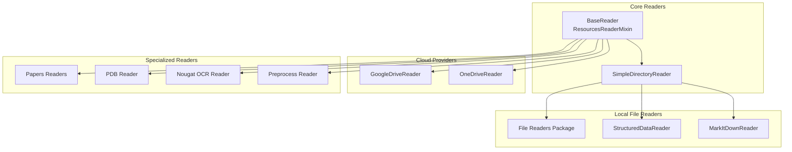
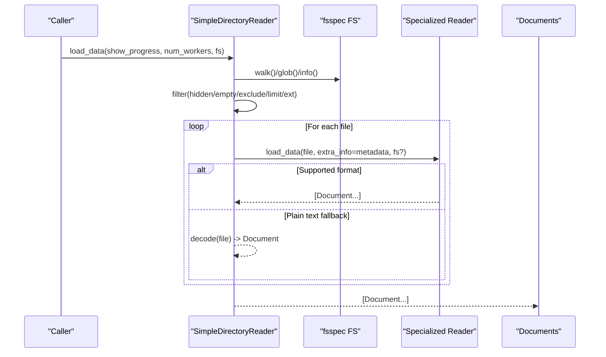
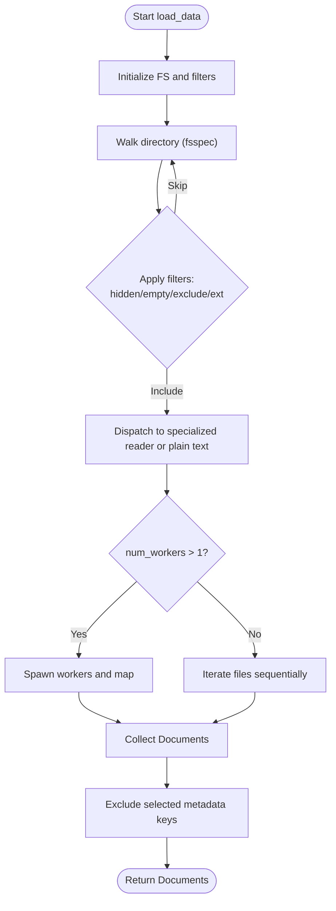
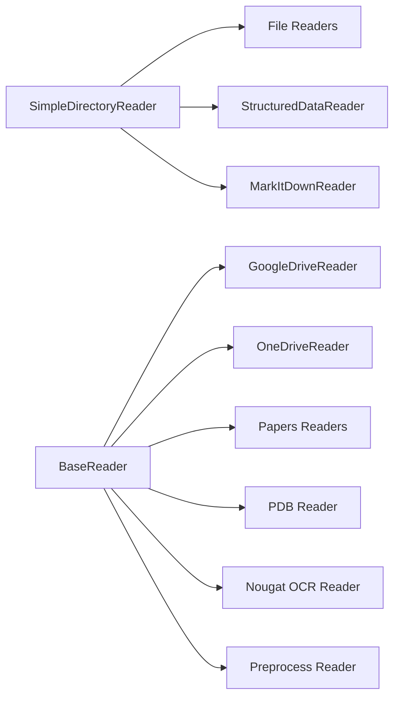

# File System Connectors

<cite>
**Referenced Files in This Document**
- [base.py](file://llama-index-core/llama_index/core/readers/base.py)
- [file/base.py](file://llama-index-core/llama_index/core/readers/file/base.py)
- [file/__init__.py](file://llama-index-integrations/readers/llama-index-readers-file/llama_index/readers/file/__init__.py)
- [google/__init__.py](file://llama-index-integrations/readers/llama-index-readers-google/llama_index/readers/google/__init__.py)
- [google/drive/base.py](file://llama-index-integrations/readers/llama-index-readers-google/llama_index/readers/google/drive/base.py)
- [microsoft_onedrive/__init__.py](file://llama-index-integrations/readers/llama-index-readers-microsoft-onedrive/llama_index/readers/microsoft_onedrive/__init__.py)
- [microsoft_onedrive/base.py](file://llama-index-integrations/readers/llama-index-readers-microsoft-onedrive/llama_index/readers/microsoft_onedrive/base.py)
- [structured_data/base.py](file://llama-index-integrations/readers/llama-index-readers-structured-data/llama_index/readers/structured_data/base.py)
- [structured_data/README.md](file://llama-index-integrations/readers/llama-index-readers-structured-data/README.md)
- [markitdown/base.py](file://llama-index-integrations/readers/llama-index-readers-markitdown/llama_index/readers/markitdown/base.py)
- [markitdown/README.md](file://llama-index-integrations/readers/llama-index-readers-markitdown/README.md)
- [papers/__init__.py](file://llama-index-integrations/readers/llama-index-readers-papers/llama_index/readers/papers/__init__.py)
- [pdb/__init__.py](file://llama-index-integrations/readers/llama-index-readers-pdb/llama_index/readers/pdb/__init__.py)
- [nougat_ocr/__init__.py](file://llama-index-integrations/readers/llama-index-readers-nougat-ocr/llama_index/readers/nougat_ocr/__init__.py)
- [preprocess/base.py](file://llama-index-integrations/readers/llama-index-readers-preprocess/llama_index/readers/preprocess/base.py)
</cite>

## Table of Contents
1. [Introduction](#introduction)
2. [Project Structure](#project-structure)
3. [Core Components](#core-components)
4. [Architecture Overview](#architecture-overview)
5. [Detailed Component Analysis](#detailed-component-analysis)
6. [Dependency Analysis](#dependency-analysis)
7. [Performance Considerations](#performance-considerations)
8. [Troubleshooting Guide](#troubleshooting-guide)
9. [Conclusion](#conclusion)
10. [Appendices](#appendices)

## Introduction
This document describes the unified file system connectors in the repository, focusing on local and cloud file data sources. It explains the shared reading interface that supports over 50 file formats (including PDFs, DOCX, XLSX, CSV, JSON, HTML, and specialized formats such as academic papers, protein structures, and OCR-enabled documents). It covers authentication mechanisms for cloud providers (Google Drive, Microsoft OneDrive), file filtering and pattern matching, metadata extraction from file headers, and batch processing of large file collections. Practical examples illustrate connecting to local directories, cloud storage buckets, and specialized document formats. Guidance is included for handling file size limitations, streaming processing for large files, incremental updates, and corrupted or unsupported file types, along with best practices for preprocessing, content normalization, and performance optimization.

## Project Structure
The file system connectors are implemented through:
- A core BaseReader interface and mixin for resource enumeration and asynchronous access
- A SimpleDirectoryReader that discovers files, applies filters, and dispatches to specialized readers
- Specialized readers for structured data, Markdown, images, presentations, audio/video, mbox, notebooks, and more
- Cloud provider integrations for Google Drive and Microsoft OneDrive
- Additional readers for academic papers, protein structures, OCR, and preprocessing pipelines

**Diagram sources**
- [base.py](file://llama-index-core/llama_index/core/readers/base.py#L19-L250)
- [file/base.py](file://llama-index-core/llama_index/core/readers/file/base.py#L208-L806)
- [file/__init__.py](file://llama-index-integrations/readers/llama-index-readers-file/llama_index/readers/file/__init__.py#L1-L50)
- [structured_data/base.py](file://llama-index-integrations/readers/llama-index-readers-structured-data/llama_index/readers/structured_data/base.py#L10-L45)
- [markitdown/base.py](file://llama-index-integrations/readers/llama-index-readers-markitdown/llama_index/readers/markitdown/base.py#L90-L104)
- [google/drive/base.py](file://llama-index-integrations/readers/llama-index-readers-google/llama_index/readers/google/drive/base.py#L94-L191)
- [microsoft_onedrive/base.py](file://llama-index-integrations/readers/llama-index-readers-microsoft-onedrive/llama_index/readers/microsoft_onedrive/base.py#L80-L200)

**Section sources**
- [base.py](file://llama-index-core/llama_index/core/readers/base.py#L19-L250)
- [file/base.py](file://llama-index-core/llama_index/core/readers/file/base.py#L208-L806)

## Core Components
- BaseReader and ResourcesReaderMixin define the contract for synchronous/asynchronous loading, resource listing, and resource metadata retrieval.
- SimpleDirectoryReader orchestrates discovery, filtering, and dispatch to specialized readers. It supports:
  - Filesystem traversal with include/exclude patterns, recursion, and limits
  - Metadata extraction from filesystem stats
  - Parallel loading with configurable worker counts
  - Custom file extractor mapping for per-format readers
  - Filename-as-id assignment and exclusion of metadata from embeddings/LLM prompts
- File readers package exposes readers for DOCX, PDF, EPUB, CSV/XLSX, HTML, images, audio/video, mbox, notebooks, XML, Markdown, and others.
- StructuredDataReader supports JSON, JSONL, CSV, and XLSX with column selection for index and metadata.
- MarkItDownReader leverages MarkItDown to normalize diverse formats to Markdown.
- Cloud readers (Google Drive, Microsoft OneDrive) provide authenticated access to remote storage with resource enumeration and metadata.
- Specialized readers include academic paper readers (ArXiv/PubMed), PDB readers, Nougat OCR, and preprocessing pipelines.

**Section sources**
- [base.py](file://llama-index-core/llama_index/core/readers/base.py#L19-L250)
- [file/base.py](file://llama-index-core/llama_index/core/readers/file/base.py#L208-L806)
- [file/__init__.py](file://llama-index-integrations/readers/llama-index-readers-file/llama_index/readers/file/__init__.py#L1-L50)
- [structured_data/base.py](file://llama-index-integrations/readers/llama-index-readers-structured-data/llama_index/readers/structured_data/base.py#L10-L45)
- [markitdown/base.py](file://llama-index-integrations/readers/llama-index-readers-markitdown/llama_index/readers/markitdown/base.py#L90-L104)

## Architecture Overview
The connectors follow a layered architecture:
- Resource discovery and filtering via SimpleDirectoryReader
- Dispatch to specialized readers based on file suffix or explicit mapping
- Asynchronous and parallel loading for throughput
- Unified Document output enriched with metadata

**Diagram sources**
- [file/base.py](file://llama-index-core/llama_index/core/readers/file/base.py#L346-L432)
- [file/base.py](file://llama-index-core/llama_index/core/readers/file/base.py#L554-L716)

**Section sources**
- [file/base.py](file://llama-index-core/llama_index/core/readers/file/base.py#L208-L806)

## Detailed Component Analysis

### SimpleDirectoryReader
- Responsibilities:
  - Discover files via fsspec filesystems (local or remote)
  - Apply include/exclude patterns, recursion, hidden file exclusion, and empty file filtering
  - Extract metadata from filesystem stats (size, timestamps, MIME type)
  - Dispatch to specialized readers based on file suffix or provided mapping
  - Fallback to plain text decoding for unknown formats
  - Parallel loading with progress reporting
- Key behaviors:
  - Uses fsspec for cross-platform filesystem abstraction
  - Supports async variants for resource enumeration and loading
  - Excludes certain metadata keys from embedding/LLM prompts by default
- Practical usage:
  - Connect to local directories or remote filesystems via fsspec-compatible FS
  - Configure file_extractor to override default readers or add custom ones
  - Limit concurrency with num_workers and enable progress bars

**Diagram sources**
- [file/base.py](file://llama-index-core/llama_index/core/readers/file/base.py#L346-L432)
- [file/base.py](file://llama-index-core/llama_index/core/readers/file/base.py#L718-L785)

**Section sources**
- [file/base.py](file://llama-index-core/llama_index/core/readers/file/base.py#L208-L806)

### File Readers Package
- Provides readers for:
  - Office and presentation formats: DOCX, PPTX, HWP
  - PDFs: PDFReader and PyMuPDFReader
  - Images: ImageReader and related vision readers
  - Audio/Video: VideoAudioReader
  - Tabular: CSVReader, PandasCSVReader, PandasExcelReader
  - Text/Markup: MarkdownReader, HTMLTagReader, XMLReader, RTFReader
  - Archives/Notebooks: MboxReader, IPYNBReader
  - Others: EpubReader, FlatReader, UnstructuredReader
- Integration:
  - SimpleDirectoryReader automatically maps suffixes to readers via a default mapping
  - Users can override with a custom file_extractor mapping

**Section sources**
- [file/__init__.py](file://llama-index-integrations/readers/llama-index-readers-file/llama_index/readers/file/__init__.py#L1-L50)
- [file/base.py](file://llama-index-core/llama_index/core/readers/file/base.py#L68-L113)

### StructuredDataReader
- Purpose:
  - Read JSON, JSONL, CSV, and XLSX files
  - Select columns for indexing and metadata to normalize structured content
- Usage:
  - Configure col_index and col_metadata to shape Document text and metadata
  - Integrate with SimpleDirectoryReader via file_extractor

**Section sources**
- [structured_data/base.py](file://llama-index-integrations/readers/llama-index-readers-structured-data/llama_index/readers/structured_data/base.py#L10-L45)
- [structured_data/README.md](file://llama-index-integrations/readers/llama-index-readers-structured-data/README.md#L1-L47)

### MarkItDownReader
- Purpose:
  - Normalize various formats (TXT, CSV, XML, JSON, HTML, PPTX, DOCX, PDF, ZIP) to Markdown using MarkItDown
- Usage:
  - Load single files or directories; returns Documents with extracted text and metadata

**Section sources**
- [markitdown/base.py](file://llama-index-integrations/readers/llama-index-readers-markitdown/llama_index/readers/markitdown/base.py#L90-L104)
- [markitdown/README.md](file://llama-index-integrations/readers/llama-index-readers-markitdown/README.md#L1-L29)

### Cloud Storage Connectors

#### Google Drive Reader
- Authentication:
  - Supports authorized user info, service account key, or client config
  - Handles credential refresh and token persistence
- Capabilities:
  - Enumerate and load files/folders
  - Attach permission metadata optionally
  - Respect MIME types and recursive traversal
- Usage:
  - Initialize with credentials and optional file_extractor mapping
  - Use list_resources/get_resource_info/load_resource for targeted access

**Section sources**
- [google/drive/base.py](file://llama-index-integrations/readers/llama-index-readers-google/llama_index/readers/google/drive/base.py#L94-L191)
- [google/__init__.py](file://llama-index-integrations/readers/llama-index-readers-google/llama_index/readers/google/__init__.py#L1-L20)

#### Microsoft OneDrive Reader
- Authentication:
  - Interactive OAuth or App (Client Secret) authentication
  - Tenant-aware authority construction
- Capabilities:
  - Resolve folder_path/file_paths or folder_id/file_ids
  - Construct Graph API endpoints for files and folders
  - Retrieve metadata including permissions when enabled
- Usage:
  - Provide client_id and optional client_secret
  - Specify userprincipalname for App authentication scenarios

**Section sources**
- [microsoft_onedrive/base.py](file://llama-index-integrations/readers/llama-index-readers-microsoft-onedrive/llama_index/readers/microsoft_onedrive/base.py#L80-L200)
- [microsoft_onedrive/__init__.py](file://llama-index-integrations/readers/llama-index-readers-microsoft-onedrive/llama_index/readers/microsoft_onedrive/__init__.py#L1-L4)

### Specialized Readers

#### Academic Papers (Papers)
- Readers:
  - ArxivReader and PubmedReader for academic paper ingestion
- Use cases:
  - Fetch and parse metadata and content from academic repositories

**Section sources**
- [papers/__init__.py](file://llama-index-integrations/readers/llama-index-readers-papers/llama_index/readers/papers/__init__.py#L1-L7)

#### Protein Data Bank (PDB)
- Reader:
  - PdbAbstractReader for protein structure formats
- Use cases:
  - Ingest and process PDB entries for bioinformatics workflows

**Section sources**
- [pdb/__init__.py](file://llama-index-integrations/readers/llama-index-readers-pdb/llama_index/readers/pdb/__init__.py#L1-L4)

#### OCR-Enabled Documents (Nougat)
- Reader:
  - PDFNougatOCR for OCR extraction from PDFs
- Use cases:
  - Enable text extraction from scanned or image-heavy PDFs

**Section sources**
- [nougat_ocr/__init__.py](file://llama-index-integrations/readers/llama-index-readers-nougat-ocr/llama_index/readers/nougat_ocr/__init__.py#L1-L4)

#### Preprocessing Pipeline
- Reader:
  - Preprocess-based reader integrates chunking and relationship building
- Use cases:
  - Normalize and split documents prior to embedding

**Section sources**
- [preprocess/base.py](file://llama-index-integrations/readers/llama-index-readers-preprocess/llama_index/readers/preprocess/base.py#L225-L258)

## Dependency Analysis
- Coupling:
  - SimpleDirectoryReader depends on BaseReader and fsspec for filesystem abstraction
  - Specialized readers depend on BaseReader and are discovered via suffix mapping
  - Cloud readers depend on external SDKs and HTTP clients for authentication and API calls
- Cohesion:
  - Each specialized reader encapsulates parsing logic for a format family
  - Cloud readers encapsulate provider-specific authentication and resource enumeration
- External dependencies:
  - fsspec for filesystem abstraction
  - Provider SDKs (e.g., Google APIs, Microsoft Graph)
  - Optional libraries for specific formats (e.g., PDF, Excel, image processing)

**Diagram sources**
- [file/base.py](file://llama-index-core/llama_index/core/readers/file/base.py#L208-L806)
- [file/__init__.py](file://llama-index-integrations/readers/llama-index-readers-file/llama_index/readers/file/__init__.py#L1-L50)
- [google/drive/base.py](file://llama-index-integrations/readers/llama-index-readers-google/llama_index/readers/google/drive/base.py#L94-L191)
- [microsoft_onedrive/base.py](file://llama-index-integrations/readers/llama-index-readers-microsoft-onedrive/llama_index/readers/microsoft_onedrive/base.py#L80-L200)

**Section sources**
- [file/base.py](file://llama-index-core/llama_index/core/readers/file/base.py#L208-L806)
- [base.py](file://llama-index-core/llama_index/core/readers/base.py#L19-L250)

## Performance Considerations
- Parallelism:
  - Use num_workers > 1 in load_data for CPU-bound parsing; SimpleDirectoryReader caps to CPU count and warns if exceeded
- Streaming and batching:
  - For very large directories, apply num_files_limit and required_exts to constrain scope
  - Prefer fsspec-compatible remote filesystems that support efficient listing and partial reads
- Memory and I/O:
  - Avoid loading entire large binary files into memory; rely on readers that stream or chunk where applicable
  - Use file_extractor to route large files to specialized readers optimized for that format
- Metadata overhead:
  - Exclude unnecessary metadata keys from embeddings/LLM prompts to reduce token usage
- Async patterns:
  - Use async resource enumeration and loading methods where available to overlap I/O with processing

[No sources needed since this section provides general guidance]

## Troubleshooting Guide
- Unsupported or corrupted files:
  - Unknown suffixes fall back to plain text decoding; set raise_on_error to propagate exceptions
  - ImportError from missing dependencies for specialized readers is surfaced explicitly
- Authentication failures:
  - Google Drive: ensure credentials, token persistence, and sharing permissions for service accounts
  - OneDrive: confirm client_secret for App auth, tenant configuration, and userprincipalname for targeted access
- Large file handling:
  - Use num_workers judiciously; monitor memory usage
  - Consider limiting file sizes or applying file_extractor to offload heavy parsing
- Incremental updates:
  - Track last-modified dates via get_resource_info and compare against previous runs to re-ingest changed files
- Metadata anomalies:
  - Verify filesystem timestamps and MIME type detection; adjust file_metadata function if needed

**Section sources**
- [file/base.py](file://llama-index-core/llama_index/core/readers/file/base.py#L614-L626)
- [google/drive/base.py](file://llama-index-integrations/readers/llama-index-readers-google/llama_index/readers/google/drive/base.py#L174-L191)
- [microsoft_onedrive/base.py](file://llama-index-integrations/readers/llama-index-readers-microsoft-onedrive/llama_index/readers/microsoft_onedrive/base.py#L137-L150)

## Conclusion
The file system connectors provide a robust, extensible framework for ingesting heterogeneous file formats from local and cloud sources. By combining a unified BaseReader interface, a flexible SimpleDirectoryReader, and a rich ecosystem of specialized readers, users can efficiently process over 50 formats, integrate cloud authentication seamlessly, and scale to large datasets through parallelism and metadata-driven filtering. Adhering to best practices for preprocessing, normalization, and performance ensures reliable ingestion across diverse environments.

[No sources needed since this section summarizes without analyzing specific files]

## Appendices

### Practical Examples Index
- Local directory ingestion with file_extractor for structured data:
  - See [structured_data/README.md](file://llama-index-integrations/readers/llama-index-readers-structured-data/README.md#L17-L46)
- MarkItDown normalization of mixed formats:
  - See [markitdown/README.md](file://llama-index-integrations/readers/llama-index-readers-markitdown/README.md#L15-L28)
- Google Drive authentication and resource enumeration:
  - See [google/drive/base.py](file://llama-index-integrations/readers/llama-index-readers-google/llama_index/readers/google/drive/base.py#L94-L191)
- OneDrive App vs. interactive authentication:
  - See [microsoft_onedrive/base.py](file://llama-index-integrations/readers/llama-index-readers-microsoft-onedrive/llama_index/readers/microsoft_onedrive/base.py#L80-L110) and [microsoft_onedrive/README.md](file://llama-index-integrations/readers/llama-index-readers-microsoft-onedrive/README.md#L34-L63)

[No sources needed since this section aggregates pointers without analyzing specific files]