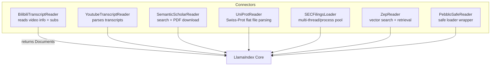
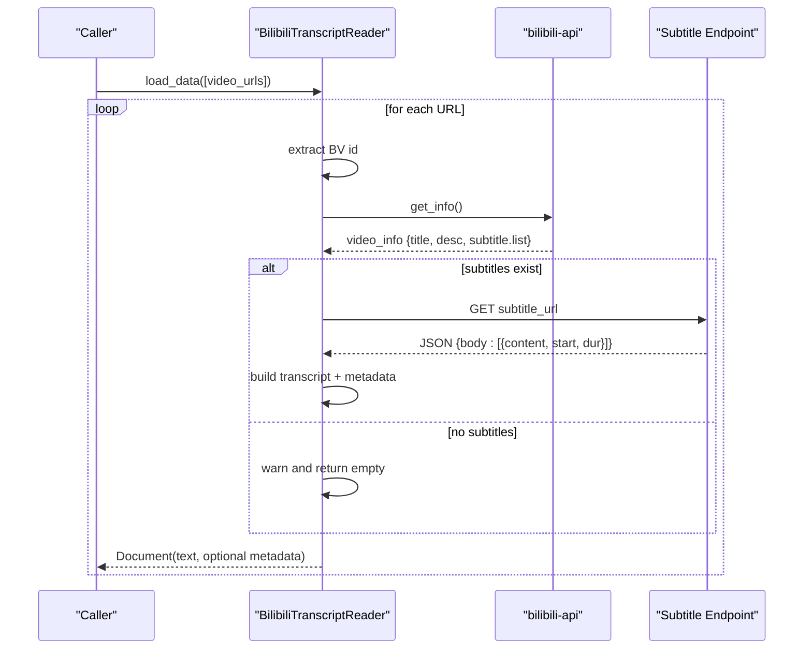
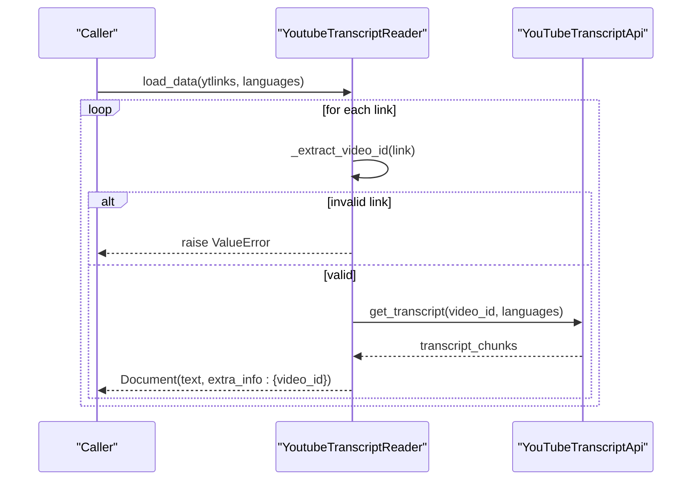
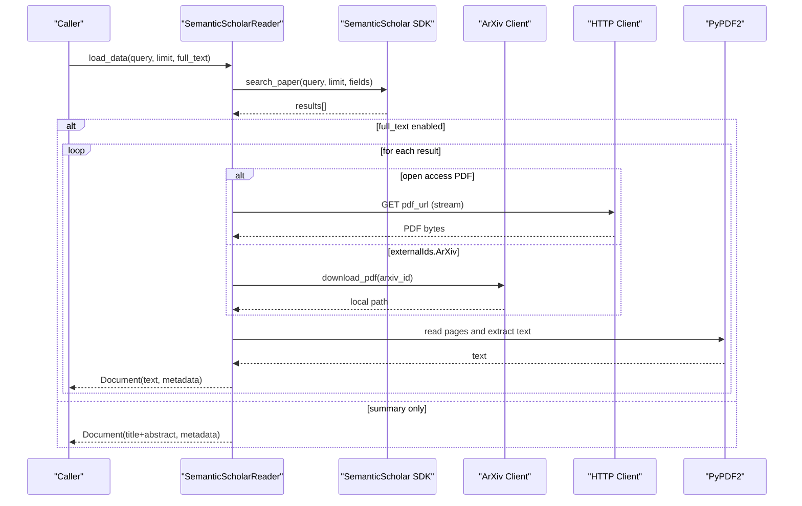
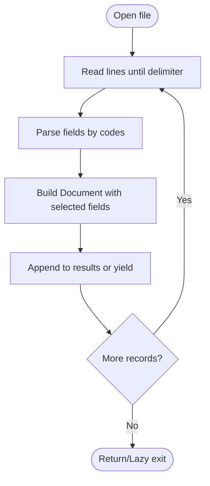
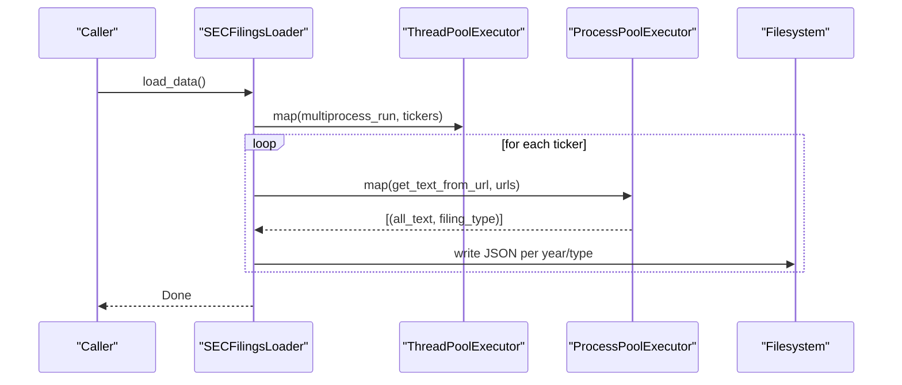
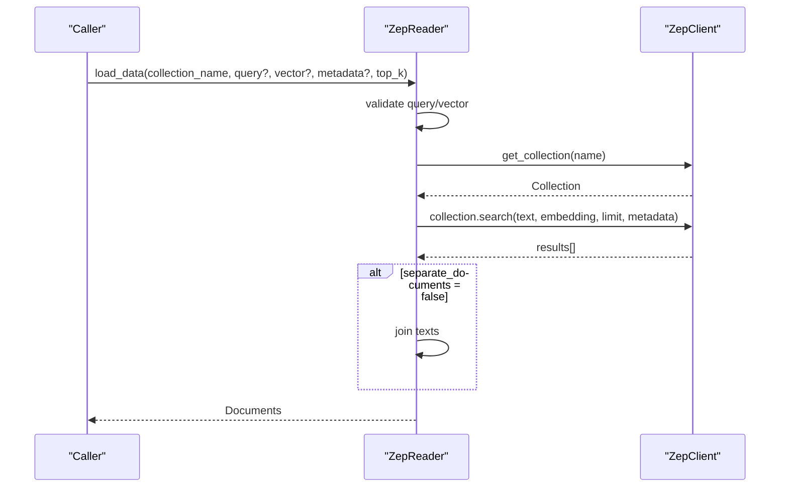
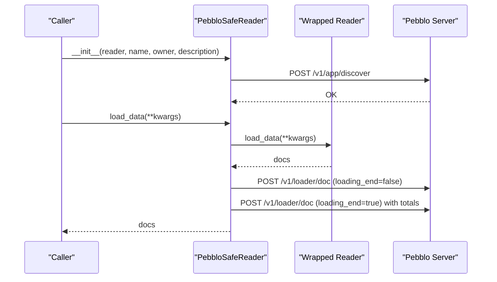
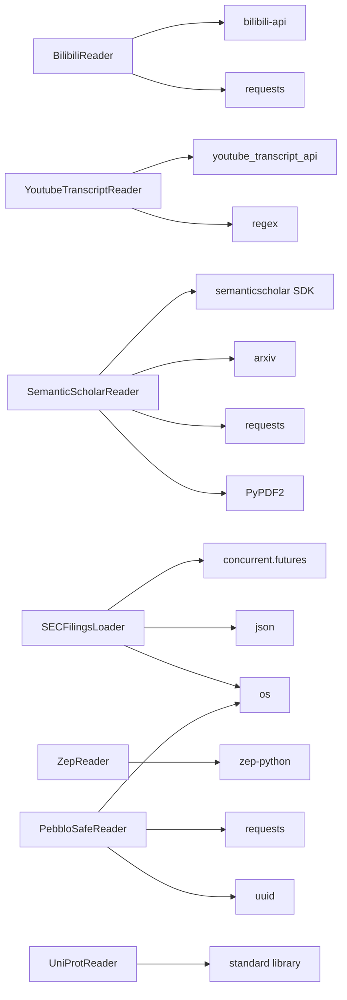

# Specialized Connectors

<cite>
**Referenced Files in This Document**
- [base.py](file://llama-index-integrations/readers/llama-index-readers-bilibili/llama_index/readers/bilibili/base.py)
- [base.py](file://llama-index-integrations/readers/llama-index-readers-youtube-transcript/llama_index/readers/youtube_transcript/base.py)
- [utils.py](file://llama-index-integrations/readers/llama-index-readers-youtube-transcript/llama_index/readers/youtube_transcript/utils.py)
- [base.py](file://llama-index-integrations/readers/llama-index-readers-pebblo/llama_index/readers/pebblo/base.py)
- [base.py](file://llama-index-integrations/readers/llama-index-readers-zep/llama_index/readers/zep/base.py)
- [base.py](file://llama-index-integrations/readers/llama-index-readers-uniprot/llama_index/readers/uniprot/base.py)
- [base.py](file://llama-index-integrations/readers/llama-index-readers-semanticscholar/llama_index/readers/semanticscholar/base.py)
- [base.py](file://llama-index-integrations/readers/llama-index-readers-sec-filings/llama_index/readers/sec_filings/base.py)
</cite>

## Table of Contents
1. [Introduction](#introduction)
2. [Project Structure](#project-structure)
3. [Core Components](#core-components)
4. [Architecture Overview](#architecture-overview)
5. [Detailed Component Analysis](#detailed-component-analysis)
6. [Dependency Analysis](#dependency-analysis)
7. [Performance Considerations](#performance-considerations)
8. [Troubleshooting Guide](#troubleshooting-guide)
9. [Conclusion](#conclusion)

## Introduction
This document focuses on specialized connector implementations for niche data sources and unique integration patterns. It covers connectors for multimedia platforms (YouTube, Bilibili), research databases (Semantic Scholar, UniProt), financial filings (SEC), compliance tools (Pebblo), and vector-backed document stores (Zep). For each connector, we explain authentication and data access patterns, API-specific requirements, data formats, extraction methodologies, and best practices for handling complex schemas and metadata enrichment.

## Project Structure
The specialized connectors live under the integrations readers module. Each connector is implemented as a reader class that extends the LlamaIndex BaseReader interface and returns Document objects. Some connectors wrap third-party libraries or APIs, while others integrate with vector stores or compliance services.

**Diagram sources**
- [base.py](file://llama-index-integrations/readers/llama-index-readers-bilibili/llama_index/readers/bilibili/base.py#L10-L70)
- [base.py](file://llama-index-integrations/readers/llama-index-readers-youtube-transcript/llama_index/readers/youtube_transcript/base.py#L13-L71)
- [base.py](file://llama-index-integrations/readers/llama-index-readers-semanticscholar/llama_index/readers/semanticscholar/base.py#L10-L225)
- [base.py](file://llama-index-integrations/readers/llama-index-readers-uniprot/llama_index/readers/uniprot/base.py#L31-L406)
- [base.py](file://llama-index-integrations/readers/llama-index-readers-sec-filings/llama_index/readers/sec_filings/base.py#L12-L103)
- [base.py](file://llama-index-integrations/readers/llama-index-readers-zep/llama_index/readers/zep/base.py#L9-L78)
- [base.py](file://llama-index-integrations/readers/llama-index-readers-pebblo/llama_index/readers/pebblo/base.py#L26-L271)

**Section sources**
- [base.py](file://llama-index-integrations/readers/llama-index-readers-bilibili/llama_index/readers/bilibili/base.py#L1-L70)
- [base.py](file://llama-index-integrations/readers/llama-index-readers-youtube-transcript/llama_index/readers/youtube_transcript/base.py#L1-L71)
- [base.py](file://llama-index-integrations/readers/llama-index-readers-pebblo/llama_index/readers/pebblo/base.py#L1-L271)
- [base.py](file://llama-index-integrations/readers/llama-index-readers-zep/llama_index/readers/zep/base.py#L1-L78)
- [base.py](file://llama-index-integrations/readers/llama-index-readers-uniprot/llama_index/readers/uniprot/base.py#L1-L406)
- [base.py](file://llama-index-integrations/readers/llama-index-readers-semanticscholar/llama_index/readers/semanticscholar/base.py#L1-L225)
- [base.py](file://llama-index-integrations/readers/llama-index-readers-sec-filings/llama_index/readers/sec_filings/base.py#L1-L103)

## Core Components
- BilibiliTranscriptReader: Extracts video metadata and auto-generated subtitles from Bilibili via bilibili-api and constructs a Document.
- YoutubeTranscriptReader: Parses YouTube transcript URLs, validates formats, retrieves transcripts, and returns Documents with metadata.
- SemanticScholarReader: Searches Semantic Scholar, optionally downloads open-access PDFs or ArXiv equivalents, extracts text, and enriches metadata.
- UniProtReader: Parses UniProt Swiss-Prot flat files, supports inclusion/exclusion of fields, lazy loading, and produces structured Documents with metadata.
- SECFilingsLoader: Multi-threaded and multi-process fetching of SEC filings (10-K/10-Q) for multiple tickers, saving structured JSON outputs.
- ZepReader: Vector-backed document store reader that queries Zep collections using text or vectors, returning Documents optionally merged.
- PebbloSafeReader: A wrapper that discovers app context and streams documents to a Pebblo server for classification and governance.

**Section sources**
- [base.py](file://llama-index-integrations/readers/llama-index-readers-bilibili/llama_index/readers/bilibili/base.py#L10-L70)
- [base.py](file://llama-index-integrations/readers/llama-index-readers-youtube-transcript/llama_index/readers/youtube_transcript/base.py#L13-L71)
- [base.py](file://llama-index-integrations/readers/llama-index-readers-semanticscholar/llama_index/readers/semanticscholar/base.py#L10-L225)
- [base.py](file://llama-index-integrations/readers/llama-index-readers-uniprot/llama_index/readers/uniprot/base.py#L31-L406)
- [base.py](file://llama-index-integrations/readers/llama-index-readers-sec-filings/llama_index/readers/sec_filings/base.py#L12-L103)
- [base.py](file://llama-index-integrations/readers/llama-index-readers-zep/llama_index/readers/zep/base.py#L9-L78)
- [base.py](file://llama-index-integrations/readers/llama-index-readers-pebblo/llama_index/readers/pebblo/base.py#L26-L271)

## Architecture Overview
Each connector follows a consistent pattern:
- Extend BaseReader or a Pydantic-enabled variant
- Accept a list of identifiers or query parameters
- Fetch data from external APIs or file systems
- Normalize to Document objects with text and metadata
- Optionally support streaming/lazy loading and parallelism

```mermaid
classDiagram
class BaseReader
class BilibiliTranscriptReader {
+load_data(video_urls, **kwargs) List[Document]
+get_bilibili_info_and_subs(url) str
}
class YoutubeTranscriptReader {
+load_data(ytlinks, languages, **kwargs) List[Document]
+class_name() str
-_extract_video_id(url) str?
}
class SemanticScholarReader {
+load_data(query, limit, full_text, returned_fields) List[Document]
-_download_pdf(...)
-_get_full_text_docs(docs) List[Document]
}
class UniProtReader {
+load_data(input_file, extra_info) List[Document]
+lazy_load_data(input_file, extra_info) Generator[Document]
-_read_records(path) Generator[List[str]]
-_parse_record(lines) UniProtRecord?
-_record_to_document(record) Document
}
class SECFilingsLoader {
+load_data() void
-multiprocess_run(ticker) dict
}
class ZepReader {
+load_data(collection_name, query, vector, metadata, top_k, separate_documents, include_values) List[Document]
}
class PebbloSafeReader {
+load_data(**kwargs) List[Document]
-_send_discover() void
-_send_reader_doc(loading_end, **kwargs) void
+calculate_content_size(text) int
}
BilibiliTranscriptReader --|> BaseReader
YoutubeTranscriptReader --|> BaseReader
SemanticScholarReader --|> BaseReader
UniProtReader --|> BaseReader
SECFilingsLoader --|> BaseReader
ZepReader --|> BaseReader
PebbloSafeReader --|> BaseReader
```

**Diagram sources**
- [base.py](file://llama-index-integrations/readers/llama-index-readers-bilibili/llama_index/readers/bilibili/base.py#L10-L70)
- [base.py](file://llama-index-integrations/readers/llama-index-readers-youtube-transcript/llama_index/readers/youtube_transcript/base.py#L13-L71)
- [base.py](file://llama-index-integrations/readers/llama-index-readers-semanticscholar/llama_index/readers/semanticscholar/base.py#L10-L225)
- [base.py](file://llama-index-integrations/readers/llama-index-readers-uniprot/llama_index/readers/uniprot/base.py#L31-L406)
- [base.py](file://llama-index-integrations/readers/llama-index-readers-sec-filings/llama_index/readers/sec_filings/base.py#L12-L103)
- [base.py](file://llama-index-integrations/readers/llama-index-readers-zep/llama_index/readers/zep/base.py#L9-L78)
- [base.py](file://llama-index-integrations/readers/llama-index-readers-pebblo/llama_index/readers/pebblo/base.py#L26-L271)

## Detailed Component Analysis

### Bilibili Connector
- Authentication and access: No explicit credentials required for public videos; relies on bilibili-api and subtitle endpoints.
- Data format: Auto-generated subtitles returned as JSON; normalized into a single transcript string with video title/description.
- Extraction methodology: Extracts BV number from URL, fetches video info, retrieves subtitle URL, parses JSON, and concatenates subtitle segments.
- Best practices:
  - Validate URLs and handle missing subtitles gracefully.
  - Consider rate limiting and retries for subtitle fetches.
  - Enrich metadata with video title, description, and timestamps if available.

**Diagram sources**
- [base.py](file://llama-index-integrations/readers/llama-index-readers-bilibili/llama_index/readers/bilibili/base.py#L14-L69)

**Section sources**
- [base.py](file://llama-index-integrations/readers/llama-index-readers-bilibili/llama_index/readers/bilibili/base.py#L10-L70)

### YouTube Transcript Connector
- Authentication and access: Uses youtube_transcript_api; no API key required for public transcripts.
- Data format: Transcript chunks returned as text; combined into a single Document per video.
- Extraction methodology: Validates YouTube URL against supported patterns, extracts video_id, fetches transcript for specified languages, and creates Documents with video_id metadata.
- Best practices:
  - Support multiple language fallbacks.
  - Validate URL formats early and fail fast with clear errors.
  - Respect rate limits and consider caching.

**Diagram sources**
- [base.py](file://llama-index-integrations/readers/llama-index-readers-youtube-transcript/llama_index/readers/youtube_transcript/base.py#L23-L70)
- [utils.py](file://llama-index-integrations/readers/llama-index-readers-youtube-transcript/llama_index/readers/youtube_transcript/utils.py)

**Section sources**
- [base.py](file://llama-index-integrations/readers/llama-index-readers-youtube-transcript/llama_index/readers/youtube_transcript/base.py#L13-L71)
- [utils.py](file://llama-index-integrations/readers/llama-index-readers-youtube-transcript/llama_index/readers/youtube_transcript/utils.py)

### Semantic Scholar Connector
- Authentication and access: Uses Semantic Scholar SDK; optional API key; downloads PDFs via requests or ArXiv client.
- Data format: Search results enriched with metadata; optional full-text extraction from PDFs.
- Extraction methodology: Performs search with configurable fields, optionally downloads PDFs, extracts text with PyPDF2, and merges results.
- Best practices:
  - Cache downloaded PDFs to avoid repeated network calls.
  - Handle protected/non-PDF URLs gracefully.
  - Use timeouts and retry logic for network operations.

**Diagram sources**
- [base.py](file://llama-index-integrations/readers/llama-index-readers-semanticscholar/llama_index/readers/semanticscholar/base.py#L145-L224)

**Section sources**
- [base.py](file://llama-index-integrations/readers/llama-index-readers-semanticscholar/llama_index/readers/semanticscholar/base.py#L10-L225)

### UniProt Connector
- Authentication and access: Reads local UniProt flat files; no API key required.
- Data format: Swiss-Prot flat file format with structured records delimited by “//”.
- Extraction methodology: Streams records, parses fields by two-letter codes, builds a structured Document with metadata, and supports lazy loading for large files.
- Best practices:
  - Use lazy_load_data for memory efficiency with large files.
  - Allow field inclusion/exclusion to tailor content granularity.
  - Preserve original IDs and cross-references in metadata.

**Diagram sources**
- [base.py](file://llama-index-integrations/readers/llama-index-readers-uniprot/llama_index/readers/uniprot/base.py#L147-L383)

**Section sources**
- [base.py](file://llama-index-integrations/readers/llama-index-readers-uniprot/llama_index/readers/uniprot/base.py#L31-L406)

### SEC Filings Connector
- Authentication and access: Uses SECExtractor to fetch accession numbers and filing texts; no API key required.
- Data format: JSON outputs grouped by ticker/year/filing type; supports 10-K and 10-Q with amendments.
- Extraction methodology: Multi-threaded dispatch per ticker; process pool per ticker to fetch and save structured JSON.
- Best practices:
  - Tune num_workers for CPU-bound I/O concurrency.
  - Persist intermediate results to disk to resume partial runs.
  - Validate filing types and normalize amendment suffixes.

**Diagram sources**
- [base.py](file://llama-index-integrations/readers/llama-index-readers-sec-filings/llama_index/readers/sec_filings/base.py#L69-L103)

**Section sources**
- [base.py](file://llama-index-integrations/readers/llama-index-readers-sec-filings/llama_index/readers/sec_filings/base.py#L12-L103)

### Zep Connector
- Authentication and access: Requires Zep API URL and optional API key; initializes ZepClient.
- Data format: Documents with optional embeddings; supports filtering by metadata and vector search.
- Extraction methodology: Retrieves collection, performs search with text or vector, and returns Documents optionally merged into a single document.
- Best practices:
  - Validate either query or vector is provided.
  - Control top_k and separate_documents for retrieval granularity.
  - Include_values to preserve embeddings for downstream vector operations.

**Diagram sources**
- [base.py](file://llama-index-integrations/readers/llama-index-readers-zep/llama_index/readers/zep/base.py#L27-L77)

**Section sources**
- [base.py](file://llama-index-integrations/readers/llama-index-readers-zep/llama_index/readers/zep/base.py#L9-L78)

### Pebblo Connector
- Authentication and access: Sends discovery and loader payloads to Pebblo server; requires server connectivity.
- Data format: Documents streamed to Pebblo with metadata and sizes; aggregates source stats.
- Extraction methodology: Wraps another reader, loads documents, computes sizes, and posts to classifier endpoints.
- Best practices:
  - Ensure server availability and handle timeouts/retries.
  - Use UUID load_id to correlate discovery and loader events.
  - Monitor logs for unexpected HTTP statuses.

**Diagram sources**
- [base.py](file://llama-index-integrations/readers/llama-index-readers-pebblo/llama_index/readers/pebblo/base.py#L57-L159)

**Section sources**
- [base.py](file://llama-index-integrations/readers/llama-index-readers-pebblo/llama_index/readers/pebblo/base.py#L26-L271)

## Dependency Analysis
- External libraries:
  - Bilibili: bilibili-api, requests
  - YouTube: youtube_transcript_api, regex patterns
  - Semantic Scholar: semanticscholar SDK, arxiv, requests, PyPDF2
  - UniProt: standard library (no external dependencies)
  - SEC: concurrent.futures, json, os
  - Zep: zep-python
  - Pebblo: requests, uuid, pwd (platform-dependent)
- Coupling:
  - Readers depend on third-party SDKs or HTTP endpoints.
  - PebbloSafeReader depends on a wrapped reader and server endpoints.
  - ZepReader depends on a vector store client.

**Diagram sources**
- [base.py](file://llama-index-integrations/readers/llama-index-readers-bilibili/llama_index/readers/bilibili/base.py#L13-L46)
- [base.py](file://llama-index-integrations/readers/llama-index-readers-youtube-transcript/llama_index/readers/youtube_transcript/base.py#L6-L10)
- [base.py](file://llama-index-integrations/readers/llama-index-readers-semanticscholar/llama_index/readers/semanticscholar/base.py#L25-L35)
- [base.py](file://llama-index-integrations/readers/llama-index-readers-sec-filings/llama_index/readers/sec_filings/base.py#L1-L6)
- [base.py](file://llama-index-integrations/readers/llama-index-readers-zep/llama_index/readers/zep/base.py#L19-L25)
- [base.py](file://llama-index-integrations/readers/llama-index-readers-pebblo/llama_index/readers/pebblo/base.py#L9-L21)

**Section sources**
- [base.py](file://llama-index-integrations/readers/llama-index-readers-bilibili/llama_index/readers/bilibili/base.py#L1-L70)
- [base.py](file://llama-index-integrations/readers/llama-index-readers-youtube-transcript/llama_index/readers/youtube_transcript/base.py#L1-L71)
- [base.py](file://llama-index-integrations/readers/llama-index-readers-semanticscholar/llama_index/readers/semanticscholar/base.py#L1-L225)
- [base.py](file://llama-index-integrations/readers/llama-index-readers-uniprot/llama_index/readers/uniprot/base.py#L1-L406)
- [base.py](file://llama-index-integrations/readers/llama-index-readers-sec-filings/llama_index/readers/sec_filings/base.py#L1-L103)
- [base.py](file://llama-index-integrations/readers/llama-index-readers-zep/llama_index/readers/zep/base.py#L1-L78)
- [base.py](file://llama-index-integrations/readers/llama-index-readers-pebblo/llama_index/readers/pebblo/base.py#L1-L271)

## Performance Considerations
- Concurrency:
  - SEC filings: Thread pool per ticker and process pool per ticker for I/O bound tasks.
  - YouTube: Single-threaded per link; consider batching and respecting rate limits.
- Memory:
  - UniProt: Use lazy_load_data to process records incrementally.
  - Bilibili: Keep transcript concatenation minimal; avoid large intermediate buffers.
- Network:
  - Semantic Scholar: Cache PDFs; handle timeouts; avoid repeated downloads.
  - Pebblo: Retry on transient failures; log request/response lengths for diagnostics.
- Storage:
  - SEC: Write structured JSON per year/type; ensure directories exist.
  - Zep: Use separate_documents=false to merge when appropriate to reduce overhead.

[No sources needed since this section provides general guidance]

## Troubleshooting Guide
- Bilibili:
  - Missing subtitles: Expect empty transcript and warning; verify BV id extraction.
  - Network errors: Wrap fetches with try/catch and skip problematic URLs.
- YouTube:
  - Unsupported URL formats: Raise ValueError with supported patterns; validate early.
  - Language fallback: Provide multiple languages and handle missing transcripts.
- Semantic Scholar:
  - Protected PDFs: Skip non-PDF content; log warnings.
  - PDF read errors: Continue with remaining documents; catch exceptions during extraction.
- UniProt:
  - Large files: Use lazy_load_data; tune include_fields to reduce text size.
  - Parsing anomalies: Ensure “//” delimiters are respected; handle malformed lines.
- SEC:
  - Disk writes: Ensure target directories exist; handle permission errors.
  - Timeouts: Adjust worker counts; monitor progress.
- Zep:
  - Missing query/vector: Enforce validation; require at least one.
  - Embedding handling: Respect include_values flag for downstream consumers.
- Pebblo:
  - Server unreachable: Log warnings; continue without classification.
  - Unexpected HTTP codes: Inspect request/response bodies; adjust timeouts.

**Section sources**
- [base.py](file://llama-index-integrations/readers/llama-index-readers-bilibili/llama_index/readers/bilibili/base.py#L48-L69)
- [base.py](file://llama-index-integrations/readers/llama-index-readers-youtube-transcript/llama_index/readers/youtube_transcript/base.py#L38-L49)
- [base.py](file://llama-index-integrations/readers/llama-index-readers-semanticscholar/llama_index/readers/semanticscholar/base.py#L185-L194)
- [base.py](file://llama-index-integrations/readers/llama-index-readers-uniprot/llama_index/readers/uniprot/base.py#L117-L145)
- [base.py](file://llama-index-integrations/readers/llama-index-readers-sec-filings/llama_index/readers/sec_filings/base.py#L69-L103)
- [base.py](file://llama-index-integrations/readers/llama-index-readers-zep/llama_index/readers/zep/base.py#L55-L56)
- [base.py](file://llama-index-integrations/readers/llama-index-readers-pebblo/llama_index/readers/pebblo/base.py#L138-L156)

## Conclusion
These specialized connectors demonstrate robust patterns for integrating diverse data sources:
- Multimedia: YouTube and Bilibili transcripts with URL validation and metadata enrichment.
- Research: Semantic Scholar search with optional full-text extraction and PDF handling.
- Biology: UniProt Swiss-Prot parsing with lazy loading and structured metadata.
- Finance: SEC filings with multi-threading and multi-processing for scalability.
- Compliance: Pebblo safe loader wrapper for governance-aware ingestion.
- Vector-backed retrieval: Zep reader for hybrid text/vector search.

Adopting the recommended best practices ensures reliability, performance, and maintainability across varied integration scenarios.