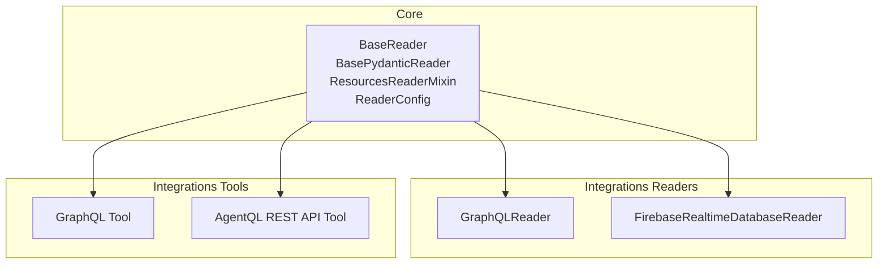
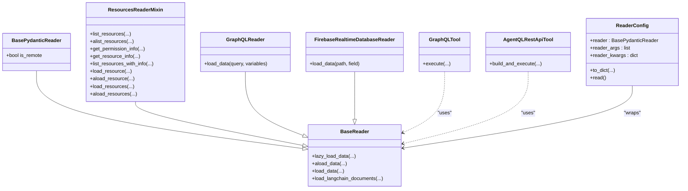
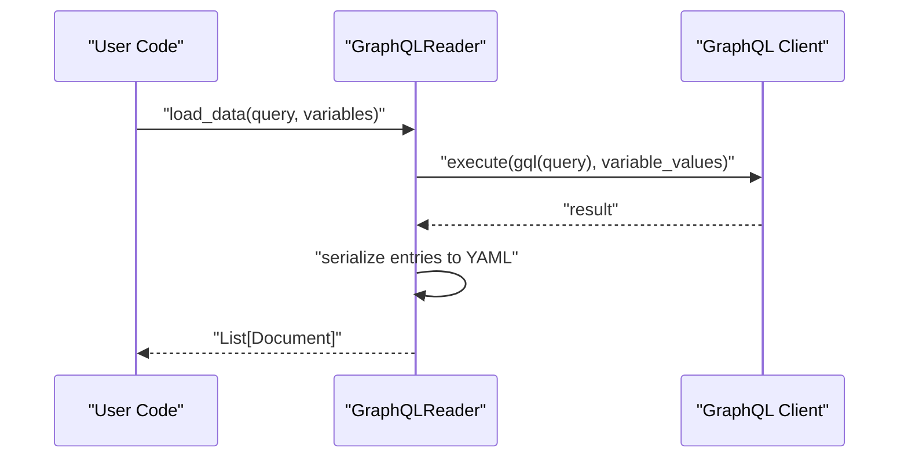
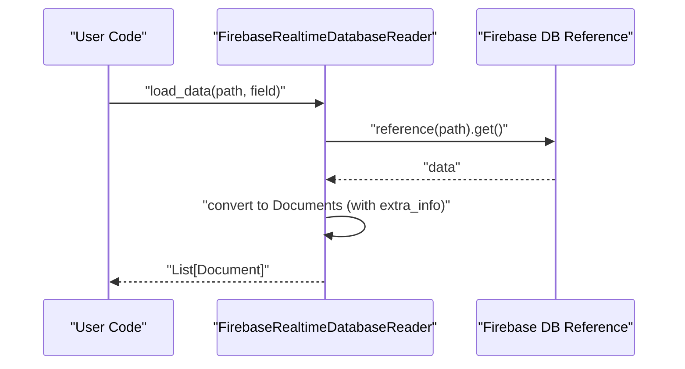
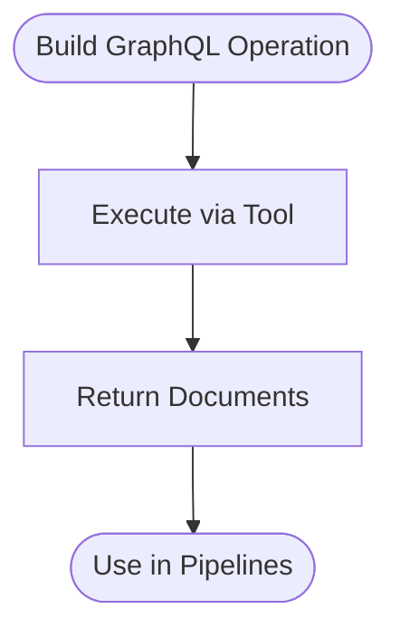
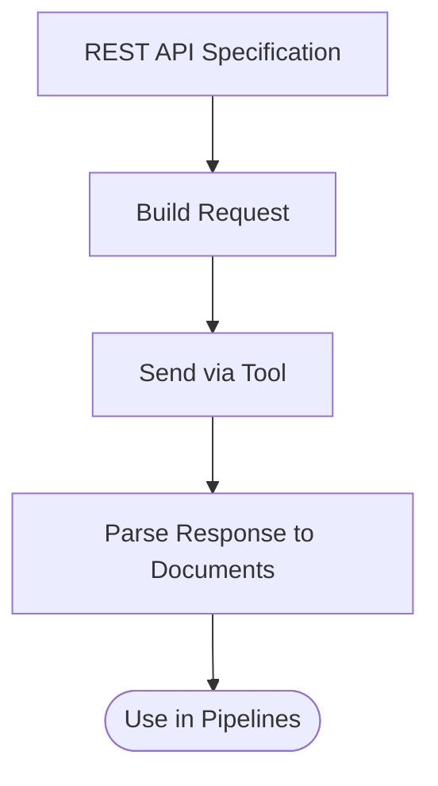
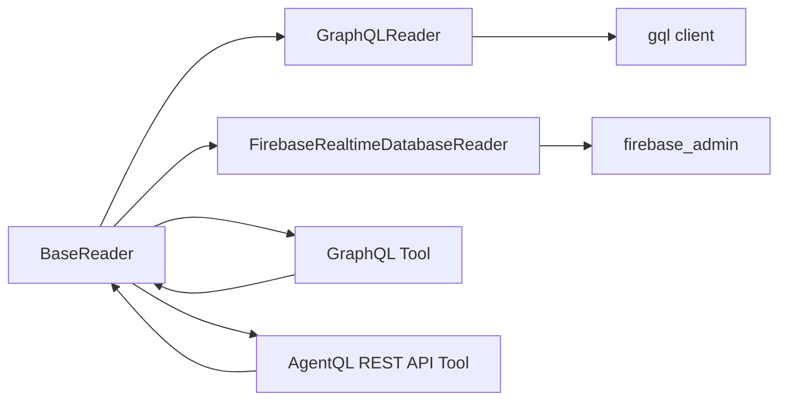

# Web API Connectors

<cite>
**Referenced Files in This Document**
- [base.py](file://llama-index-core/llama_index/core/readers/base.py)
- [__init__.py](file://llama-index-core/llama_index/core/readers/__init__.py)
- [base.py](file://llama-index-integrations/readers/llama-index-readers-graphql/llama_index/readers/graphql/base.py)
- [__init__.py](file://llama-index-integrations/readers/llama-index-readers-graphql/llama_index/readers/graphql/__init__.py)
- [base.py](file://llama-index-integrations/readers/llama-index-readers-firebase-realtimedb/llama_index/readers/firebase_realtimedb/base.py)
- [__init__.py](file://llama-index-integrations/readers/llama-index-readers-firebase-realtimedb/llama_index/readers/firebase_realtimedb/__init__.py)
- [base.py](file://llama-index-integrations/tools/llama-index-tools-graphql/llama_index/tools/graphql/base.py)
- [__init__.py](file://llama-index-integrations/tools/llama-index-tools-graphql/llama_index/tools/graphql/__init__.py)
- [base.py](file://llama-index-integrations/tools/llama-index-tools-agentql/llama_index/tools/agentql/agentql_rest_api_tool/base.py)
- [__init__.py](file://llama-index-integrations/tools/llama-index-tools-agentql/llama_index/tools/agentql/agentql_rest_api_tool/__init__.py)
</cite>

## Table of Contents
1. [Introduction](#introduction)
2. [Project Structure](#project-structure)
3. [Core Components](#core-components)
4. [Architecture Overview](#architecture-overview)
5. [Detailed Component Analysis](#detailed-component-analysis)
6. [Dependency Analysis](#dependency-analysis)
7. [Performance Considerations](#performance-considerations)
8. [Troubleshooting Guide](#troubleshooting-guide)
9. [Conclusion](#conclusion)

## Introduction
This document explains how to build robust web API connectors for RESTful services, GraphQL APIs, and real-time data sources using the LlamaIndex reader and tool abstractions. It covers a unified interface for connecting to over 100 web services, authentication strategies, rate limiting, pagination, error recovery, API versioning, and best practices for caching, batching, and cost optimization. Practical examples demonstrate connecting to popular APIs, building custom request handlers, handling diverse response formats, and managing real-time streams.

## Project Structure
The connector ecosystem centers around a shared BaseReader abstraction and a set of specialized readers and tools:
- Core reader interface and utilities live under the core readers module.
- Specialized readers for GraphQL and Firebase Realtime Database are provided in the integrations readers package.
- Tools for GraphQL and AgentQL REST API enable dynamic request building and execution.

**Diagram sources**
- [base.py](file://llama-index-core/llama_index/core/readers/base.py#L19-L250)
- [base.py](file://llama-index-integrations/readers/llama-index-readers-graphql/llama_index/readers/graphql/base.py#L10-L74)
- [base.py](file://llama-index-integrations/readers/llama-index-readers-firebase-realtimedb/llama_index/readers/firebase_realtimedb/base.py#L9-L87)
- [base.py](file://llama-index-integrations/tools/llama-index-tools-graphql/llama_index/tools/graphql/base.py)
- [base.py](file://llama-index-integrations/tools/llama-index-tools-agentql/llama_index/tools/agentql/agentql_rest_api_tool/base.py)

**Section sources**
- [__init__.py](file://llama-index-core/llama_index/core/readers/__init__.py#L14-L32)
- [base.py](file://llama-index-core/llama_index/core/readers/base.py#L19-L250)

## Core Components
- BaseReader: Defines synchronous and asynchronous loading methods, plus convenience wrappers for LangChain-compatible documents.
- BasePydanticReader: Adds serialization support and a flag indicating whether data is remote.
- ResourcesReaderMixin: Provides resource listing, permission info, resource info, and batch loading capabilities.
- ReaderConfig: Encapsulates a reader instance and its arguments for reproducible loading.

Key responsibilities:
- Unified loading API across heterogeneous sources.
- Async-friendly design via thread-backed async methods.
- Resource-centric operations for granular access patterns.

**Section sources**
- [base.py](file://llama-index-core/llama_index/core/readers/base.py#L19-L250)

## Architecture Overview
The connector architecture composes a shared reader interface with domain-specific adapters. Readers implement BaseReader and optionally ResourcesReaderMixin to expose resource-level operations. Tools complement readers by enabling dynamic request construction and execution against REST endpoints.

**Diagram sources**
- [base.py](file://llama-index-core/llama_index/core/readers/base.py#L19-L250)
- [base.py](file://llama-index-integrations/readers/llama-index-readers-graphql/llama_index/readers/graphql/base.py#L10-L74)
- [base.py](file://llama-index-integrations/readers/llama-index-readers-firebase-realtimedb/llama_index/readers/firebase_realtimedb/base.py#L9-L87)
- [base.py](file://llama-index-integrations/tools/llama-index-tools-graphql/llama_index/tools/graphql/base.py)
- [base.py](file://llama-index-integrations/tools/llama-index-tools-agentql/llama_index/tools/agentql/agentql_rest_api_tool/base.py)

## Detailed Component Analysis

### GraphQL Reader
A reader that executes GraphQL queries and materializes results into Documents. It supports optional HTTP headers and schema fetching from the transport.

Implementation highlights:
- Initializes a client with a configured transport (URI and headers).
- Executes a provided query with optional variables.
- Converts nested result sets into YAML-formatted text for each entry.

**Diagram sources**
- [base.py](file://llama-index-integrations/readers/llama-index-readers-graphql/llama_index/readers/graphql/base.py#L42-L74)

**Section sources**
- [base.py](file://llama-index-integrations/readers/llama-index-readers-graphql/llama_index/readers/graphql/base.py#L10-L74)
- [__init__.py](file://llama-index-integrations/readers/llama-index-readers-graphql/llama_index/readers/graphql/__init__.py#L1-L4)

### Firebase Realtime Database Reader
A reader that retrieves data from Firebase Realtime Database and converts it into Documents. Supports optional service account credentials and field selection.

Implementation highlights:
- Initializes the Firebase app with database URL and optional credentials.
- Fetches data by reference path and iterates entries.
- Builds Documents with optional extra metadata and field extraction.

**Diagram sources**
- [base.py](file://llama-index-integrations/readers/llama-index-readers-firebase-realtimedb/llama_index/readers/firebase_realtimedb/base.py#L45-L87)

**Section sources**
- [base.py](file://llama-index-integrations/readers/llama-index-readers-firebase-realtimedb/llama_index/readers/firebase_realtimedb/base.py#L9-L87)
- [__init__.py](file://llama-index-integrations/readers/llama-index-readers-firebase-realtimedb/llama_index/readers/firebase_realtimedb/__init__.py#L1-L4)

### GraphQL Tool
A tool that encapsulates GraphQL execution logic, enabling dynamic query composition and execution. It complements the reader by offering a programmatic interface for building and running queries.

Implementation highlights:
- Provides an execution method to run prepared GraphQL operations.
- Integrates with the BaseReader ecosystem for consistent document output.

**Diagram sources**
- [base.py](file://llama-index-integrations/tools/llama-index-tools-graphql/llama_index/tools/graphql/base.py)

**Section sources**
- [base.py](file://llama-index-integrations/tools/llama-index-tools-graphql/llama_index/tools/graphql/base.py)
- [__init__.py](file://llama-index-integrations/tools/llama-index-tools-graphql/llama_index/tools/graphql/__init__.py)

### AgentQL REST API Tool
A tool that builds and executes REST API requests dynamically, enabling flexible integration with RESTful services. It supports constructing requests from specifications and returning Documents for downstream processing.

Implementation highlights:
- Offers a method to build and execute REST API calls.
- Designed to integrate with the BaseReader pipeline for unified document output.

**Diagram sources**
- [base.py](file://llama-index-integrations/tools/llama-index-tools-agentql/llama_index/tools/agentql/agentql_rest_api_tool/base.py)

**Section sources**
- [base.py](file://llama-index-integrations/tools/llama-index-tools-agentql/llama_index/tools/agentql/agentql_rest_api_tool/base.py)
- [__init__.py](file://llama-index-integrations/tools/llama-index-tools-agentql/llama_index/tools/agentql/agentql_rest_api_tool/__init__.py)

## Dependency Analysis
Connectors depend on:
- Core reader abstractions for uniform loading semantics.
- Third-party libraries for protocol-specific transports (e.g., GraphQL client, Firebase admin SDK).
- Optional configuration for authentication and transport options.

**Diagram sources**
- [base.py](file://llama-index-core/llama_index/core/readers/base.py#L19-L250)
- [base.py](file://llama-index-integrations/readers/llama-index-readers-graphql/llama_index/readers/graphql/base.py#L28-L40)
- [base.py](file://llama-index-integrations/readers/llama-index-readers-firebase-realtimedb/llama_index/readers/firebase_realtimedb/base.py#L27-L43)
- [base.py](file://llama-index-integrations/tools/llama-index-tools-graphql/llama_index/tools/graphql/base.py)
- [base.py](file://llama-index-integrations/tools/llama-index-tools-agentql/llama_index/tools/agentql/agentql_rest_api_tool/base.py)

**Section sources**
- [base.py](file://llama-index-core/llama_index/core/readers/base.py#L19-L250)
- [base.py](file://llama-index-integrations/readers/llama-index-readers-graphql/llama_index/readers/graphql/base.py#L28-L40)
- [base.py](file://llama-index-integrations/readers/llama-index-readers-firebase-realtimedb/llama_index/readers/firebase_realtimedb/base.py#L27-L43)

## Performance Considerations
- Asynchronous loading: Prefer async variants (e.g., aload_data) to overlap I/O-bound network calls with computation.
- Batching: Use batched resource loading (e.g., load_resources) to minimize repeated round trips when accessing multiple resources.
- Serialization overhead: For GraphQL, converting results to YAML adds CPU cost; consider raw JSON when fidelity allows.
- Transport reuse: Reuse clients and sessions where supported to reduce connection overhead.
- Pagination: Implement cursor-based pagination for large datasets; avoid loading entire collections in a single request.
- Caching: Cache frequently accessed endpoints with appropriate invalidation policies; use ETags or Last-Modified headers when available.
- Retry and backoff: Apply exponential backoff on transient errors; respect server-side throttling signals.

[No sources needed since this section provides general guidance]

## Troubleshooting Guide
Common issues and remedies:
- Missing dependencies: Install required packages (e.g., GraphQL client, Firebase admin SDK) as indicated by import-time errors.
- Authentication failures: Verify credentials, tokens, and scopes; ensure proper header injection for REST endpoints.
- Rate limiting/throttling: Implement retry with exponential backoff; monitor response headers for limits and reset windows.
- Pagination gaps: Validate cursor handling and boundary conditions; implement guardrails to prevent infinite loops.
- Versioning and breaking changes: Pin client versions; test upgrades in staging; maintain fallbacks for deprecated endpoints.
- Response parsing: Normalize heterogeneous response formats (JSON, XML, RSS) into a consistent internal representation before document creation.

**Section sources**
- [base.py](file://llama-index-integrations/readers/llama-index-readers-graphql/llama_index/readers/graphql/base.py#L28-L40)
- [base.py](file://llama-index-integrations/readers/llama-index-readers-firebase-realtimedb/llama_index/readers/firebase_realtimedb/base.py#L27-L43)

## Conclusion
By leveraging the BaseReader abstraction and specialized readers/tools, you can implement a unified, scalable approach to connect to RESTful services, GraphQL APIs, and real-time data sources. The patterns demonstrated here—async loading, resource-centric operations, dynamic request building, and robust error handling—enable reliable integration with hundreds of external services while maintaining performance and cost efficiency.