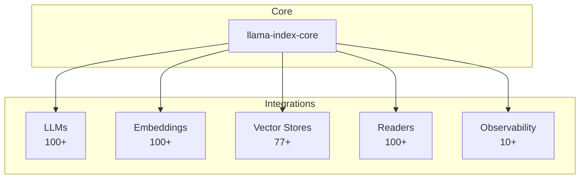
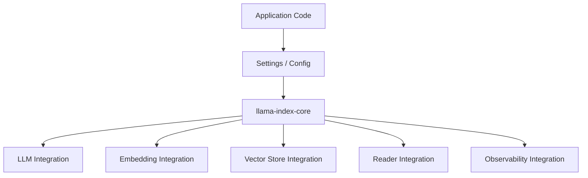
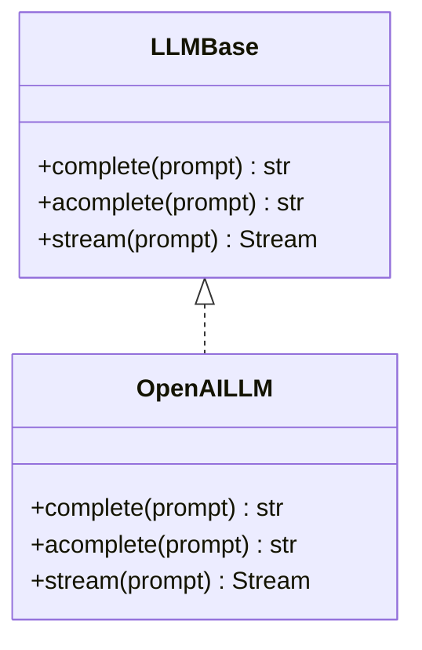
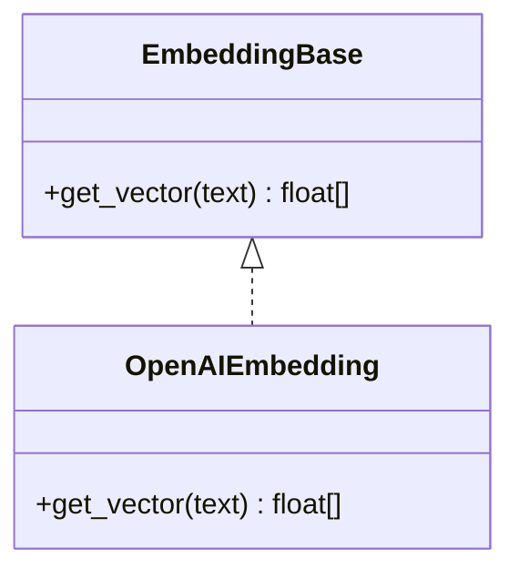
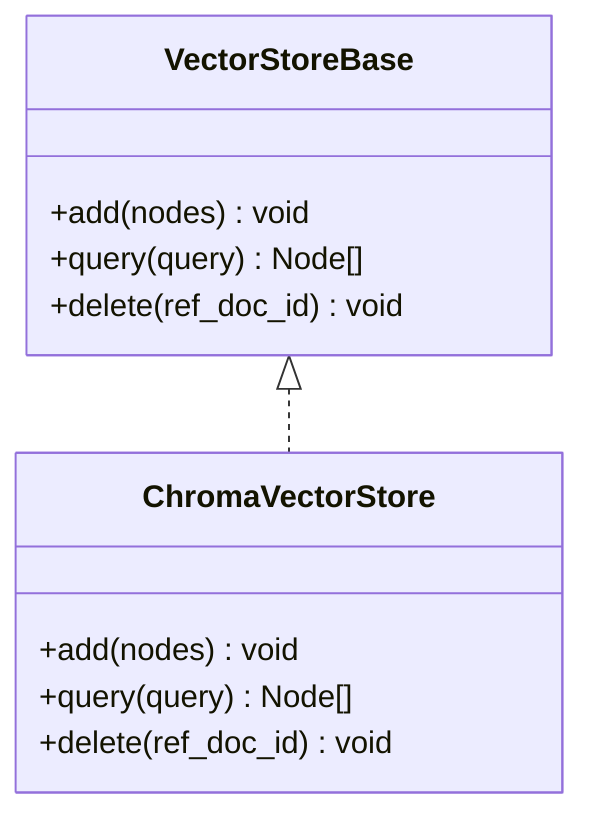
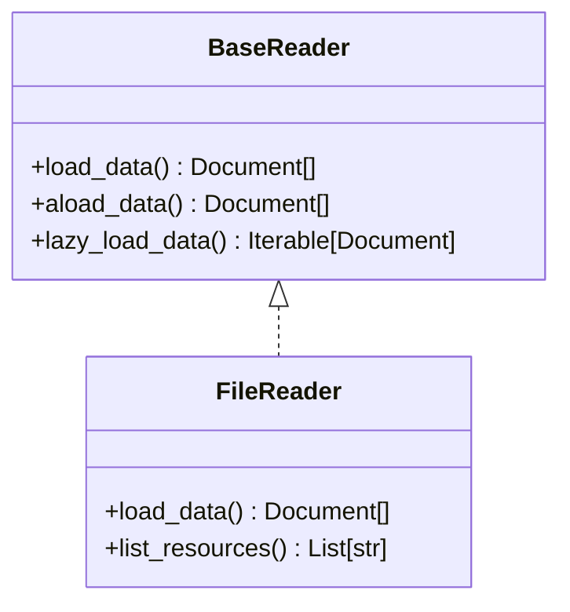
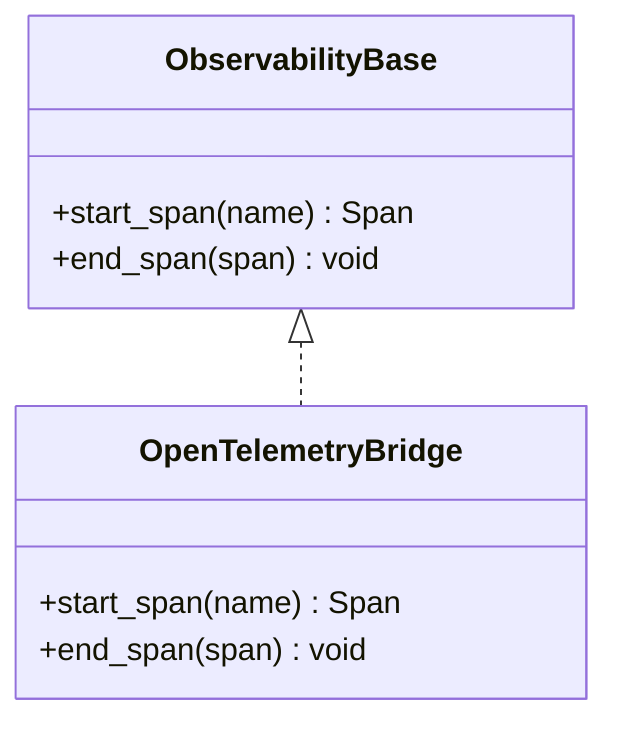
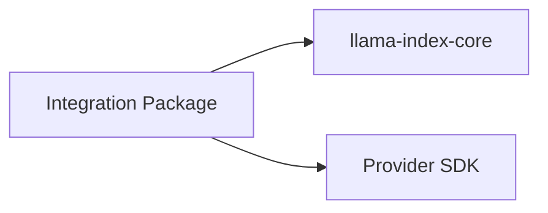

# Integration Ecosystem

<cite>
**Referenced Files in This Document**
- [README.md](file://README.md)
- [llama-index-integrations/README.md](file://llama-index-integrations/README.md)
- [llama-index-integrations/llms/llama-index-llms-openai/pyproject.toml](file://llama-index-integrations/llms/llama-index-llms-openai/pyproject.toml)
- [llama-index-integrations/embeddings/llama-index-embeddings-openai/pyproject.toml](file://llama-index-integrations/embeddings/llama-index-embeddings-openai/pyproject.toml)
- [llama-index-integrations/vector_stores/llama-index-vector-stores-chroma/pyproject.toml](file://llama-index-integrations/vector_stores/llama-index-vector-stores-chroma/pyproject.toml)
- [llama-index-integrations/readers/llama-index-readers-file/pyproject.toml](file://llama-index-integrations/readers/llama-index-readers-file/pyproject.toml)
- [llama-index-integrations/observability/llama-index-observability-otel/pyproject.toml](file://llama-index-integrations/observability/llama-index-observability-otel/pyproject.toml)
- [llama-index-integrations/llms/llama-index-llms-openai/llama_index/llms/openai/__init__.py](file://llama-index-integrations/llms/llama-index-llms-openai/llama_index/llms/openai/__init__.py)
- [llama-index-integrations/embeddings/llama-index-embeddings-openai/llama_index/embeddings/openai/__init__.py](file://llama-index-integrations/embeddings/llama-index-embeddings-openai/llama_index/embeddings/openai/__init__.py)
- [llama-index-integrations/vector_stores/llama-index-vector-stores-chroma/llama_index/vector_stores/chroma/__init__.py](file://llama-index-integrations/vector_stores/llama-index-vector-stores-chroma/llama_index/vector_stores/chroma/__init__.py)
- [llama-index-integrations/readers/llama-index-readers-file/llama_index/readers/file/__init__.py](file://llama-index-integrations/readers/llama-index-readers-file/llama_index/readers/file/__init__.py)
- [llama-index-integrations/observability/llama-index-observability-otel/llama_index/observability/otel/__init__.py](file://llama-index-integrations/observability/llama-index-observability-otel/llama_index/observability/otel/__init__.py)
- [llama-index-core/llama_index/core/readers/base.py](file://llama-index-core/llama_index/core/readers/base.py)
</cite>

## Table of Contents
1. [Introduction](#introduction)
2. [Project Structure](#project-structure)
3. [Core Components](#core-components)
4. [Architecture Overview](#architecture-overview)
5. [Detailed Component Analysis](#detailed-component-analysis)
6. [Dependency Analysis](#dependency-analysis)
7. [Performance Considerations](#performance-considerations)
8. [Troubleshooting Guide](#troubleshooting-guide)
9. [Conclusion](#conclusion)
10. [Appendices](#appendices)

## Introduction
This document describes the LlamaIndex integration ecosystem and how it enables a plugin-based architecture to connect LLM providers, embedding models, vector stores, data connectors, and observability tools. The ecosystem offers over 300 integration packages that work seamlessly with the core library, enabling flexible stacks for diverse use cases. Integrations are organized by category and distributed as separate Python packages, each exposing a small surface area that adheres to LlamaIndex’s base abstractions.

## Project Structure
The integration ecosystem is organized under a dedicated monorepo with one package per integration. Each integration package:
- Depends on llama-index-core within a compatible range
- Exposes a single module path mapped via a LlamaHub metadata field
- Defines a small public API surface aligned with LlamaIndex’s base classes

Key categories include:
- LLM providers (over 100 integrations)
- Embedding providers (dozens of providers)
- Vector stores (77+ integrations)
- Readers/connectors (file systems, databases, web, APIs)
- Observability (OpenTelemetry, vendor SDKs)
- Additional components (retrievers, postprocessors, tools, etc.)

**Section sources**
- [README.md](file://README.md#L11-L24)
- [llama-index-integrations/README.md](file://llama-index-integrations/README.md#L1-L5)

## Core Components
The integration architecture is built around base abstractions that each integration implements. These enable consistent behavior across providers and stores.

- Reader base: Defines synchronous/asynchronous loading and resource listing interfaces used by all data connectors.
- LLM base: Defines the contract for LLM implementations (sync/async completion, streaming, etc.).
- Embedding base: Defines embedding computation interfaces.
- Vector store base: Defines index persistence and retrieval interfaces.
- Observability base: Defines telemetry hooks and spans.

These bases ensure that any integration package can be dropped into an application without changing consumer code.

**Section sources**
- [llama-index-core/llama_index/core/readers/base.py](file://llama-index-core/llama_index/core/readers/base.py#L19-L47)

## Architecture Overview
The integration ecosystem follows a layered architecture:
- Application code uses core abstractions and Settings to configure integrations.
- Each integration package implements the appropriate base class and exposes a small, stable API surface.
- LlamaHub metadata maps each integration’s import path to its module, enabling discovery and installation.

**Section sources**
- [README.md](file://README.md#L25-L35)
- [llama-index-integrations/llms/llama-index-llms-openai/pyproject.toml](file://llama-index-integrations/llms/llama-index-llms-openai/pyproject.toml#L51-L56)
- [llama-index-integrations/embeddings/llama-index-embeddings-openai/pyproject.toml](file://llama-index-integrations/embeddings/llama-index-embeddings-openai/pyproject.toml#L53-L56)
- [llama-index-integrations/vector_stores/llama-index-vector-stores-chroma/pyproject.toml](file://llama-index-integrations/vector_stores/llama-index-vector-stores-chroma/pyproject.toml#L54-L57)
- [llama-index-integrations/readers/llama-index-readers-file/pyproject.toml](file://llama-index-integrations/readers/llama-index-readers-file/pyproject.toml#L97-L100)
- [llama-index-integrations/observability/llama-index-observability-otel/pyproject.toml](file://llama-index-integrations/observability/llama-index-observability-otel/pyproject.toml#L57-L60)

## Detailed Component Analysis

### LLM Provider Integrations
- Category: Over 100 integrations spanning OpenAI, Anthropic, cloud providers, local runtimes, and inference platforms.
- Pattern: Each integration defines a class that implements the LLM base and exposes it via a concise __all__ list.
- Example mapping: The OpenAI integration maps to a specific module path for discovery.

**Diagram sources**
- [llama-index-integrations/llms/llama-index-llms-openai/llama_index/llms/openai/__init__.py](file://llama-index-integrations/llams/llama-index-llms-openai/llama_index/llms/openai/__init__.py#L1-L5)

**Section sources**
- [README.md](file://README.md#L14-L19)
- [llama-index-integrations/llms/llama-index-llms-openai/pyproject.toml](file://llama-index-integrations/llms/llama-index-llms-openai/pyproject.toml#L28-L38)
- [llama-index-integrations/llms/llama-index-llms-openai/llama_index/llms/openai/__init__.py](file://llama-index-integrations/llms/llama-index-llms-openai/llama_index/llms/openai/__init__.py#L1-L5)

### Embedding Model Integrations
- Category: Dozens of providers including OpenAI, Hugging Face, Vertex AI, Ollama, and others.
- Pattern: Each integration exports a class implementing the embedding base and registers itself via LlamaHub metadata.

**Diagram sources**
- [llama-index-integrations/embeddings/llama-index-embeddings-openai/llama_index/embeddings/openai/__init__.py](file://llama-index-integrations/embeddings/llama-index-embeddings-openai/llama_index/embeddings/openai/__init__.py#L1-L14)

**Section sources**
- [README.md](file://README.md#L14-L19)
- [llama-index-integrations/embeddings/llama-index-embeddings-openai/pyproject.toml](file://llama-index-integrations/embeddings/llama-index-embeddings-openai/pyproject.toml#L27-L39)
- [llama-index-integrations/embeddings/llama-index-embeddings-openai/llama_index/embeddings/openai/__init__.py](file://llama-index-integrations/embeddings/llama-index-embeddings-openai/llama_index/embeddings/openai/__init__.py#L1-L14)

### Vector Store Integrations
- Category: 77+ integrations including Chroma, Weaviate, Pinecone, FAISS, Milvus, and managed services.
- Pattern: Each integration implements the vector store base and exposes a single class.

**Diagram sources**
- [llama-index-integrations/vector_stores/llama-index-vector-stores-chroma/llama_index/vector_stores/chroma/__init__.py](file://llama-index-integrations/vector_stores/llama-index-vector-stores-chroma/llama_index/vector_stores/chroma/__init__.py#L1-L4)

**Section sources**
- [README.md](file://README.md#L14-L19)
- [llama-index-integrations/vector_stores/llama-index-vector-stores-chroma/pyproject.toml](file://llama-index-integrations/vector_stores/llama-index-vector-stores-chroma/pyproject.toml#L28-L40)
- [llama-index-integrations/vector_stores/llama-index-vector-stores-chroma/llama_index/vector_stores/chroma/__init__.py](file://llama-index-integrations/vector_stores/llama-index-vector-stores-chroma/llama_index/vector_stores/chroma/__init__.py#L1-L4)

### Data Connector Integrations (Readers)
- Category: Extensive readers for files, databases, web, APIs, and enterprise systems.
- Pattern: Each reader implements the BaseReader base and often supports resource listing and permission info.

**Diagram sources**
- [llama-index-core/llama_index/core/readers/base.py](file://llama-index-core/llama_index/core/readers/base.py#L19-L47)
- [llama-index-integrations/readers/llama-index-readers-file/llama_index/readers/file/__init__.py](file://llama-index-integrations/readers/llama-index-readers-file/llama_index/readers/file/__init__.py#L1-L50)

**Section sources**
- [README.md](file://README.md#L14-L19)
- [llama-index-integrations/readers/llama-index-readers-file/pyproject.toml](file://llama-index-integrations/readers/llama-index-readers-file/pyproject.toml#L29-L79)
- [llama-index-core/llama_index/core/readers/base.py](file://llama-index-core/llama_index/core/readers/base.py#L19-L47)
- [llama-index-integrations/readers/llama-index-readers-file/llama_index/readers/file/__init__.py](file://llama-index-integrations/readers/llama-index-readers-file/llama_index/readers/file/__init__.py#L1-L50)

### Observability Integrations
- Category: OpenTelemetry, vendor-specific SDKs, and callback-based integrations.
- Pattern: Integrations expose a class that bridges LlamaIndex telemetry to external systems.

**Diagram sources**
- [llama-index-integrations/observability/llama-index-observability-otel/llama_index/observability/otel/__init__.py](file://llama-index-integrations/observability/llama-index-observability-otel/llama_index/observability/otel/__init__.py#L1-L6)

**Section sources**
- [README.md](file://README.md#L14-L19)
- [llama-index-integrations/observability/llama-index-observability-otel/pyproject.toml](file://llama-index-integrations/observability/llama-index-observability-otel/pyproject.toml#L27-L42)
- [llama-index-integrations/observability/llama-index-observability-otel/llama_index/observability/otel/__init__.py](file://llama-index-integrations/observability/llama-index-observability-otel/llama_index/observability/otel/__init__.py#L1-L6)

## Dependency Analysis
Each integration package declares:
- A dependency on llama-index-core within a compatible semver range
- Optional dependencies for provider SDKs or specialized libraries
- LlamaHub metadata that maps the integration’s import path to its module

**Diagram sources**
- [llama-index-integrations/llms/llama-index-llms-openai/pyproject.toml](file://llama-index-integrations/llms/llama-index-llms-openai/pyproject.toml#L36-L36)
- [llama-index-integrations/embeddings/llama-index-embeddings-openai/pyproject.toml](file://llama-index-integrations/embeddings/llama-index-embeddings-openai/pyproject.toml#L35-L38)
- [llama-index-integrations/vector_stores/llama-index-vector-stores-chroma/pyproject.toml](file://llama-index-integrations/vector_stores/llama-index-vector-stores-chroma/pyproject.toml#L36-L39)
- [llama-index-integrations/readers/llama-index-readers-file/pyproject.toml](file://llama-index-integrations/readers/llama-index-readers-file/pyproject.toml#L72-L79)
- [llama-index-integrations/observability/llama-index-observability-otel/pyproject.toml](file://llama-index-integrations/observability/llama-index-observability-otel/pyproject.toml#L35-L41)

**Section sources**
- [llama-index-integrations/llms/llama-index-llms-openai/pyproject.toml](file://llama-index-integrations/llms/llama-index-llms-openai/pyproject.toml#L28-L38)
- [llama-index-integrations/embeddings/llama-index-embeddings-openai/pyproject.toml](file://llama-index-integrations/embeddings/llama-index-embeddings-openai/pyproject.toml#L27-L39)
- [llama-index-integrations/vector_stores/llama-index-vector-stores-chroma/pyproject.toml](file://llama-index-integrations/vector_stores/llama-index-vector-stores-chroma/pyproject.toml#L28-L40)
- [llama-index-integrations/readers/llama-index-readers-file/pyproject.toml](file://llama-index-integrations/readers/llama-index-readers-file/pyproject.toml#L29-L79)
- [llama-index-integrations/observability/llama-index-observability-otel/pyproject.toml](file://llama-index-integrations/observability/llama-index-observability-otel/pyproject.toml#L27-L42)

## Performance Considerations
- Choose embeddings and vector stores aligned with scale and latency targets.
- Use async APIs where available to improve throughput.
- Configure batching and chunk sizes appropriately for readers and retrievers.
- Monitor provider rate limits and backoff strategies.
- Persist indices and caches to reduce cold-start costs.

## Troubleshooting Guide
Common issues and remedies:
- Import mismatches: Verify the integration’s import path matches the LlamaHub metadata.
- Version conflicts: Ensure llama-index-core and integration versions are compatible.
- Missing optional dependencies: Install optional extras for specialized readers or providers.
- Environment variables: Confirm provider credentials are set before initialization.
- Async correctness: Prefer async methods for I/O-bound operations.

**Section sources**
- [README.md](file://README.md#L179-L189)
- [llama-index-integrations/readers/llama-index-readers-file/pyproject.toml](file://llama-index-integrations/readers/llama-index-readers-file/pyproject.toml#L81-L82)

## Conclusion
The LlamaIndex integration ecosystem provides a robust, modular foundation for building Retrieval-Augmented Generation (RAG) applications. Its plugin-based architecture, grounded in shared base abstractions, enables rapid experimentation across LLMs, embeddings, vector stores, connectors, and observability tools—without sacrificing portability or maintainability.

## Appendices

### Practical Integration Patterns
- Selective installation: Install only the core plus required integrations.
- Settings-driven configuration: Use Settings to inject LLMs, embeddings, and vector stores.
- Reader composition: Chain readers to unify ingestion from heterogeneous sources.
- Observability hooks: Attach telemetry integrations to monitor latency and throughput.

**Section sources**
- [README.md](file://README.md#L95-L177)