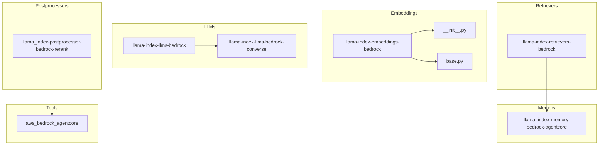
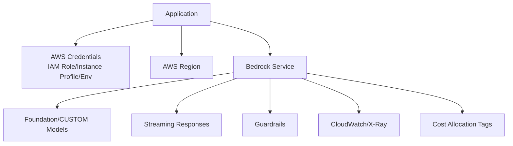
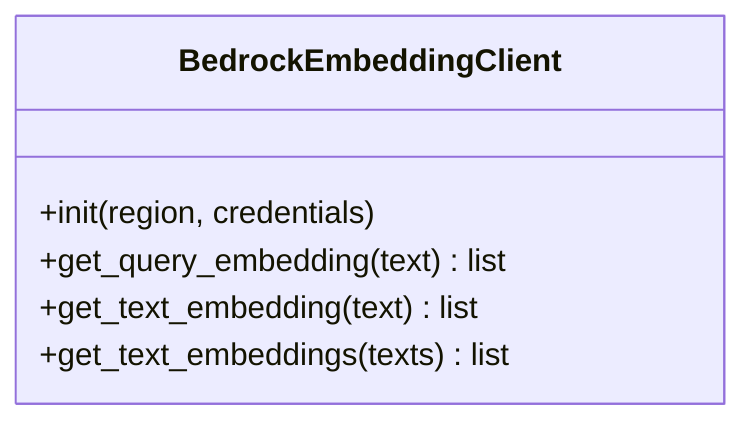
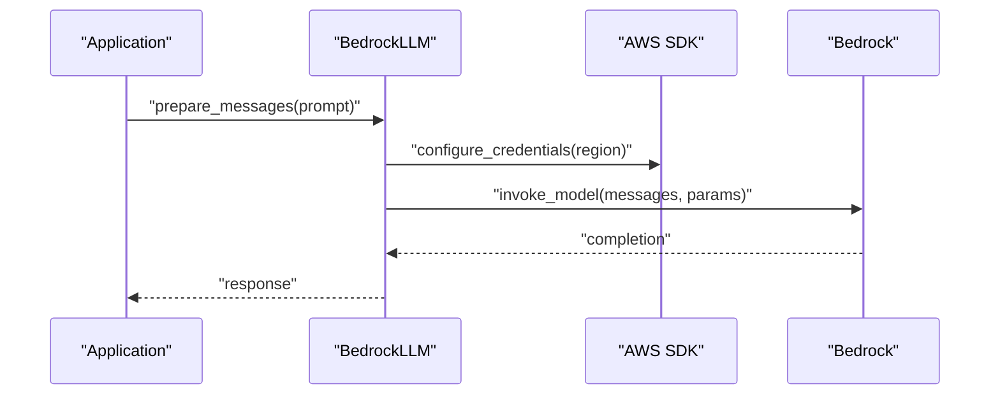
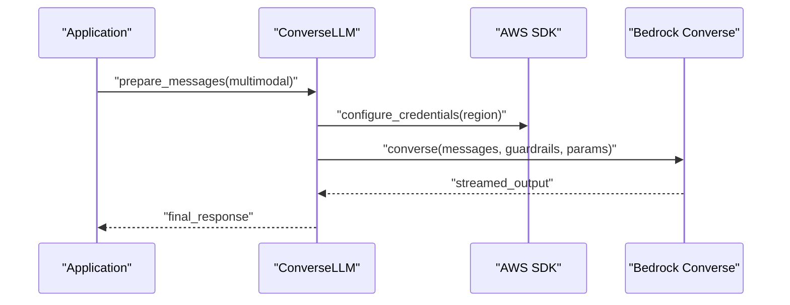
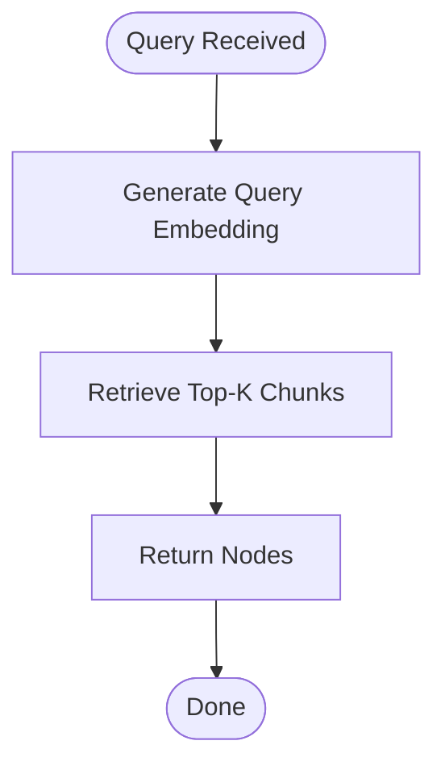
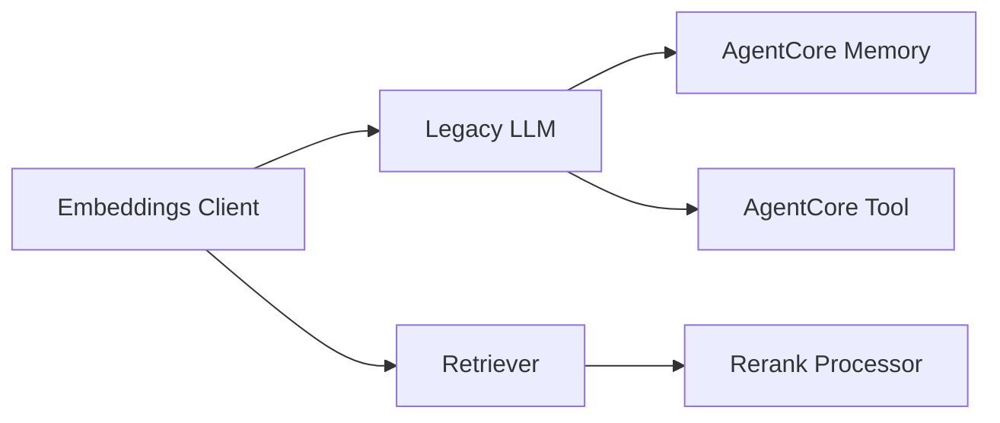

# AWS Bedrock

<cite>
**Referenced Files in This Document**
- [README.md](file://llama-index-integrations/embeddings/llama-index-embeddings-bedrock/README.md)
- [base.py](file://llama-index-integrations/embeddings/llama-index-embeddings-bedrock/llama_index/embeddings/bedrock/base.py)
- [__init__.py](file://llama-index-integrations/embeddings/llama-index-embeddings-bedrock/llama_index/embeddings/bedrock/__init__.py)
- [pyproject.toml](file://llama-index-integrations/embeddings/llama-index-embeddings-bedrock/pyproject.toml)
- [bedrock.md](file://docs/api_reference/api_reference/embeddings/bedrock.md)
- [bedrock.ipynb](file://docs/examples/embeddings/bedrock.ipynb)
- [bedrock.md](file://docs/api_reference/api_reference/llms/bedrock.md)
- [bedrock_converse.md](file://docs/api_reference/api_reference/llms/bedrock_converse.md)
- [bedrock.ipynb](file://docs/examples/llm/bedrock.ipynb)
- [bedrock_converse.ipynb](file://docs/examples/llm/bedrock_converse.ipynb)
- [bedrock.md](file://docs/api_reference/api_reference/retrievers/bedrock.md)
- [bedrock_retriever.ipynb](file://docs/examples/retrievers/bedrock_retriever.ipynb)
- [bedrock_agentcore.md](file://docs/api_reference/api_reference/memory/bedrock_agentcore.md)
- [aws_bedrock_agentcore.md](file://docs/api_reference/api_reference/tools/aws_bedrock_agentcore.md)
- [bedrock_rerank.md](file://docs/api_reference/api_reference/postprocessor/bedrock_rerank.md)
- [llama_index-llms-bedrock](file://llama-index-integrations/llms/llama-index-llms-bedrock)
- [llama_index-llms-bedrock-converse](file://llama-index-integrations/llms/llama-index-llms-bedrock-converse)
- [llama_index-retrievers-bedrock](file://llama-index-integrations/retrievers/llama-index-retrievers-bedrock)
- [llama_index-memory-bedrock-agentcore](file://llama-index-integrations/memory/llama_index-memory-bedrock-agentcore)
- [llama_index-postprocessor-bedrock-rerank](file://llama-index-integrations/postprocessor/llama_index-postprocessor-bedrock-rerank)
</cite>

## Table of Contents
1. [Introduction](#introduction)
2. [Project Structure](#project-structure)
3. [Core Components](#core-components)
4. [Architecture Overview](#architecture-overview)
5. [Detailed Component Analysis](#detailed-component-analysis)
6. [Dependency Analysis](#dependency-analysis)
7. [Performance Considerations](#performance-considerations)
8. [Troubleshooting Guide](#troubleshooting-guide)
9. [Conclusion](#conclusion)
10. [Appendices](#appendices)

## Introduction
This document explains how to integrate AWS Bedrock with LlamaIndex across LLMs, embeddings, retrievers, memory, and postprocessors. It covers IAM authentication, AWS region configuration, model access permissions, Bedrock-specific features (foundation models, custom models, model access management), prompt templates, inference parameters, guardrails configuration, streaming responses, error handling, and AWS-specific considerations such as VPC endpoints, encryption at rest, and compliance. It also documents integration with AWS monitoring, logging, and cost allocation tools.

## Project Structure
The Bedrock integration spans multiple packages under the integrations tree and is documented via API references and examples. The primary areas covered here are:
- Embeddings: Bedrock embeddings client
- LLMs: Bedrock legacy and Bedrock Converse clients
- Retrievers: Bedrock retrieval client
- Memory: Bedrock AgentCore-backed memory
- Postprocessors: Bedrock rerank processor
- Tools: AWS Bedrock AgentCore tool

**Diagram sources**
- [llama_index-llms-bedrock](file://llama-index-integrations/llms/llama-index-llms-bedrock)
- [llama_index-llms-bedrock-converse](file://llama-index-integrations/llms/llama-index-llms-bedrock-converse)
- [llama_index-retrievers-bedrock](file://llama-index-integrations/retrievers/llama-index-retrievers-bedrock)
- [llama_index-memory-bedrock-agentcore](file://llama-index-integrations/memory/llama_index-memory-bedrock-agentcore)
- [llama_index-postprocessor-bedrock-rerank](file://llama-index-integrations/postprocessor/llama_index-postprocessor-bedrock-rerank)
- [aws_bedrock_agentcore.md](file://docs/api_reference/api_reference/tools/aws_bedrock_agentcore.md)

**Section sources**
- [README.md](file://llama-index-integrations/embeddings/llama-index-embeddings-bedrock/README.md#L1-L200)
- [bedrock.md](file://docs/api_reference/api_reference/embeddings/bedrock.md#L1-L200)
- [bedrock.md](file://docs/api_reference/api_reference/llms/bedrock.md#L1-L200)
- [bedrock_converse.md](file://docs/api_reference/api_reference/llms/bedrock_converse.md#L1-L200)
- [bedrock.md](file://docs/api_reference/api_reference/retrievers/bedrock.md#L1-L200)
- [bedrock_agentcore.md](file://docs/api_reference/api_reference/memory/bedrock_agentcore.md#L1-L200)
- [bedrock_rerank.md](file://docs/api_reference/api_reference/postprocessor/bedrock_rerank.md#L1-L200)

## Core Components
- Bedrock Embeddings: Provides embedding generation via AWS Bedrock using the embeddings package.
- Bedrock Legacy LLM: Legacy client for invoking Bedrock foundation models.
- Bedrock Converse LLM: Modern client leveraging the Converse API for multimodal and structured outputs.
- Bedrock Retriever: Retrieves relevant chunks using Bedrock-powered retrieval.
- Bedrock AgentCore Memory: Integrates conversational memory backed by Bedrock AgentCore.
- Bedrock Rerank Processor: Reranks results using Bedrock rerank models.
- AWS Bedrock AgentCore Tool: Bridges Bedrock AgentCore with LlamaIndex tools.

Key implementation anchors:
- Embeddings client initialization and configuration
- LLM invocation patterns for both legacy and converse APIs
- Retrieval and reranking workflows
- Memory and tool integrations

**Section sources**
- [base.py](file://llama-index-integrations/embeddings/llama-index-embeddings-bedrock/llama_index/embeddings/bedrock/base.py#L1-L200)
- [__init__.py](file://llama-index-integrations/embeddings/llama-index-embeddings-bedrock/llama_index/embeddings/bedrock/__init__.py#L1-L200)
- [bedrock.md](file://docs/api_reference/api_reference/embeddings/bedrock.md#L1-L200)
- [bedrock.md](file://docs/api_reference/api_reference/llms/bedrock.md#L1-L200)
- [bedrock_converse.md](file://docs/api_reference/api_reference/llms/bedrock_converse.md#L1-L200)
- [bedrock.md](file://docs/api_reference/api_reference/retrievers/bedrock.md#L1-L200)
- [bedrock_agentcore.md](file://docs/api_reference/api_reference/memory/bedrock_agentcore.md#L1-L200)
- [bedrock_rerank.md](file://docs/api_reference/api_reference/postprocessor/bedrock_rerank.md#L1-L200)

## Architecture Overview
The Bedrock integration follows a layered architecture:
- Authentication and credentials are resolved via AWS SDK credential providers.
- Region selection is configured per client initialization.
- Model access permissions are enforced server-side by AWS IAM policies and Bedrock model access policies.
- Invocation flows differ by API:
  - Legacy LLM: JSON-formatted messages to foundation models.
  - Converse LLM: Structured input/output with support for images, text, and structured outputs.
- Retrieval and reranking leverage Bedrock endpoints for chunk scoring and re-ranking.
- Memory and tools integrate with Bedrock AgentCore for agent-like experiences.

[No sources needed since this diagram shows conceptual workflow, not actual code structure]

## Detailed Component Analysis

### Embeddings: Bedrock Embeddings Client
- Purpose: Generate embeddings using Bedrock embeddings models.
- Configuration: Initialize the client with region and credentials; model ID selection is supported.
- Behavior: Batch embedding requests are sent to Bedrock; errors are surfaced per batch item.

**Diagram sources**
- [base.py](file://llama-index-integrations/embeddings/llama-index-embeddings-bedrock/llama_index/embeddings/bedrock/base.py#L1-L200)

**Section sources**
- [base.py](file://llama-index-integrations/embeddings/llama-index-embeddings-bedrock/llama_index/embeddings/bedrock/base.py#L1-L200)
- [__init__.py](file://llama-index-integrations/embeddings/llama-index-embeddings-bedrock/llama_index/embeddings/bedrock/__init__.py#L1-L200)
- [bedrock.md](file://docs/api_reference/api_reference/embeddings/bedrock.md#L1-L200)
- [bedrock.ipynb](file://docs/examples/embeddings/bedrock.ipynb#L1-L200)

### LLMs: Legacy Bedrock LLM
- Purpose: Invoke Bedrock foundation models with legacy message formatting.
- Features:
  - Prompt templates via message lists.
  - Inference parameters passed through request body.
  - Streaming responses via event streams.
  - Error handling for throttling, validation, and model errors.
- IAM and Permissions:
  - Requires bedrock:InvokeModel permission.
  - Model access policies must grant access to target foundation models.

**Diagram sources**
- [bedrock.md](file://docs/api_reference/api_reference/llms/bedrock.md#L1-L200)
- [bedrock.ipynb](file://docs/examples/llm/bedrock.ipynb#L1-L200)

**Section sources**
- [bedrock.md](file://docs/api_reference/api_reference/llms/bedrock.md#L1-L200)
- [bedrock.ipynb](file://docs/examples/llm/bedrock.ipynb#L1-L200)

### LLMs: Bedrock Converse LLM
- Purpose: Use the modern Converse API for multimodal inputs and structured outputs.
- Features:
  - Support for text, images, and structured outputs.
  - Guardrails configuration via request-level filters.
  - Streaming responses via event stream parsing.
- IAM and Permissions:
  - Requires bedrock:InvokeModel and bedrock:ApplyGuardrail permissions.
  - Model access policies must allow the target foundation/custom model.

**Diagram sources**
- [bedrock_converse.md](file://docs/api_reference/api_reference/llms/bedrock_converse.md#L1-L200)
- [bedrock_converse.ipynb](file://docs/examples/llm/bedrock_converse.ipynb#L1-L200)

**Section sources**
- [bedrock_converse.md](file://docs/api_reference/api_reference/llms/bedrock_converse.md#L1-L200)
- [bedrock_converse.ipynb](file://docs/examples/llm/bedrock_converse.ipynb#L1-L200)

### Retrievers: Bedrock Retriever
- Purpose: Retrieve relevant chunks using Bedrock retrieval capabilities.
- Workflow: Converts query to embedding, retrieves top-k chunks, and returns nodes.

**Diagram sources**
- [bedrock.md](file://docs/api_reference/api_reference/retrievers/bedrock.md#L1-L200)
- [bedrock_retriever.ipynb](file://docs/examples/retrievers/bedrock_retriever.ipynb#L1-L200)

**Section sources**
- [bedrock.md](file://docs/api_reference/api_reference/retrievers/bedrock.md#L1-L200)
- [bedrock_retriever.ipynb](file://docs/examples/retrievers/bedrock_retriever.ipynb#L1-L200)

### Memory: Bedrock AgentCore Memory
- Purpose: Persist and recall conversation history using Bedrock AgentCore-backed memory.
- Integration: Used alongside Bedrock LLMs/converse for agent-like behavior.

**Section sources**
- [bedrock_agentcore.md](file://docs/api_reference/api_reference/memory/bedrock_agentcore.md#L1-L200)

### Postprocessors: Bedrock Rerank
- Purpose: Improve relevance by reranking candidate chunks using Bedrock rerank models.
- Integration: Typically used after retrieval to refine results.

**Section sources**
- [bedrock_rerank.md](file://docs/api_reference/api_reference/postprocessor/bedrock_rerank.md#L1-L200)

### Tools: AWS Bedrock AgentCore Tool
- Purpose: Bridge Bedrock AgentCore capabilities into LlamaIndex tools for agent workflows.

**Section sources**
- [aws_bedrock_agentcore.md](file://docs/api_reference/api_reference/tools/aws_bedrock_agentcore.md#L1-L200)

## Dependency Analysis
- Embeddings package depends on the Bedrock embeddings client implementation.
- LLMs depend on AWS SDK credential resolution and region configuration.
- Retrievers depend on embeddings and Bedrock retrieval endpoints.
- Memory and postprocessors depend on Bedrock AgentCore and rerank endpoints respectively.
- Tools depend on AgentCore integration.

**Diagram sources**
- [base.py](file://llama-index-integrations/embeddings/llama-index-embeddings-bedrock/llama_index/embeddings/bedrock/base.py#L1-L200)
- [bedrock.md](file://docs/api_reference/api_reference/llms/bedrock.md#L1-L200)
- [bedrock_converse.md](file://docs/api_reference/api_reference/llms/bedrock_converse.md#L1-L200)
- [bedrock.md](file://docs/api_reference/api_reference/retrievers/bedrock.md#L1-L200)
- [bedrock_agentcore.md](file://docs/api_reference/api_reference/memory/bedrock_agentcore.md#L1-L200)
- [bedrock_rerank.md](file://docs/api_reference/api_reference/postprocessor/bedrock_rerank.md#L1-L200)

**Section sources**
- [pyproject.toml](file://llama-index-integrations/embeddings/llama-index-embeddings-bedrock/pyproject.toml#L1-L200)
- [README.md](file://llama-index-integrations/embeddings/llama-index-embeddings-bedrock/README.md#L1-L200)

## Performance Considerations
- Prefer streaming responses for long-running generations to reduce perceived latency.
- Use batching for embeddings when possible to minimize round trips.
- Tune inference parameters (temperature, max tokens) to balance quality and speed.
- Place clients close to data sources to reduce network latency; consider VPC endpoints for private connectivity.
- Monitor throughput and latency via CloudWatch metrics and X-Ray traces.

[No sources needed since this section provides general guidance]

## Troubleshooting Guide
Common issues and resolutions:
- Authentication failures:
  - Verify AWS credentials are set via environment variables, profiles, or IAM roles.
  - Confirm the role has bedrock:InvokeModel and related permissions.
- Region misconfiguration:
  - Ensure the client region matches the Bedrock endpoint availability.
- Model access denied:
  - Confirm the model is granted in the Bedrock model access policy.
- Throttling:
  - Implement retry with exponential backoff and consider provisioned throughput if applicable.
- Streaming errors:
  - Validate event stream parsing and handle partial or malformed events gracefully.
- Guardrails violations:
  - Adjust guardrails configuration or pre-process prompts to align with policies.

**Section sources**
- [bedrock.md](file://docs/api_reference/api_reference/llms/bedrock.md#L1-L200)
- [bedrock_converse.md](file://docs/api_reference/api_reference/llms/bedrock_converse.md#L1-L200)
- [bedrock.ipynb](file://docs/examples/llm/bedrock.ipynb#L1-L200)
- [bedrock_converse.ipynb](file://docs/examples/llm/bedrock_converse.ipynb#L1-L200)

## Conclusion
The LlamaIndex Bedrock integration provides robust support for embeddings, LLM invocation (legacy and Converse), retrieval, reranking, memory, and tools. By configuring IAM credentials and regions correctly, enforcing model access permissions, and leveraging streaming and guardrails, teams can build secure, scalable, and high-performance AI applications on AWS.

[No sources needed since this section summarizes without analyzing specific files]

## Appendices

### A. IAM Authentication and Permissions
- Required permissions:
  - bedrock:InvokeModel
  - bedrock:ApplyGuardrail (for Converse guardrails)
  - bedrock:CreateHumanLoop, bedrock:ListHumanLoops (for AgentCore memory)
- Model access policies:
  - Allow specific foundation or custom models via Bedrock model access controls.

**Section sources**
- [bedrock.md](file://docs/api_reference/api_reference/llms/bedrock.md#L1-L200)
- [bedrock_converse.md](file://docs/api_reference/api_reference/llms/bedrock_converse.md#L1-L200)
- [bedrock_agentcore.md](file://docs/api_reference/api_reference/memory/bedrock_agentcore.md#L1-L200)

### B. AWS Region Configuration
- Set the AWS region in the client initialization.
- Ensure the selected region supports the target models and endpoints.

**Section sources**
- [bedrock.md](file://docs/api_reference/api_reference/llms/bedrock.md#L1-L200)
- [bedrock_converse.md](file://docs/api_reference/api_reference/llms/bedrock_converse.md#L1-L200)

### C. Model Access Management
- Foundation models: Select from the list of supported models in the Bedrock console.
- Custom models: Configure model access for fine-tuned or hosted endpoints.

**Section sources**
- [bedrock.md](file://docs/api_reference/api_reference/llms/bedrock.md#L1-L200)
- [bedrock_converse.md](file://docs/api_reference/api_reference/llms/bedrock_converse.md#L1-L200)

### D. Prompt Templates and Inference Parameters
- Legacy LLM: Use structured message arrays; pass temperature, maxTokens, and stop sequences.
- Converse LLM: Use structured inputs with support for multimodal content and structured outputs.

**Section sources**
- [bedrock.md](file://docs/api_reference/api_reference/llms/bedrock.md#L1-L200)
- [bedrock_converse.md](file://docs/api_reference/api_reference/llms/bedrock_converse.md#L1-L200)

### E. Guardrails Configuration
- Enable guardrails in Converse invocations to filter content.
- Configure guardrail ARNs and action policies in the request.

**Section sources**
- [bedrock_converse.md](file://docs/api_reference/api_reference/llms/bedrock_converse.md#L1-L200)

### F. Streaming Responses
- Use streaming modes for both legacy and Converse APIs.
- Parse event streams and handle partial outputs.

**Section sources**
- [bedrock.md](file://docs/api_reference/api_reference/llms/bedrock.md#L1-L200)
- [bedrock_converse.md](file://docs/api_reference/api_reference/llms/bedrock_converse.md#L1-L200)

### G. Error Handling
- Implement retries for throttling and transient errors.
- Log and propagate model-specific errors for diagnostics.

**Section sources**
- [bedrock.md](file://docs/api_reference/api_reference/llms/bedrock.md#L1-L200)
- [bedrock_converse.md](file://docs/api_reference/api_reference/llms/bedrock_converse.md#L1-L200)

### H. AWS-Specific Considerations
- VPC endpoints: Use interface endpoints for private connectivity.
- Encryption at rest: Managed by AWS; ensure S3 and other data stores are appropriately encrypted.
- Compliance: Align with Bedrock compliance offerings and enable audit logging.

[No sources needed since this section provides general guidance]

### I. Monitoring, Logging, and Cost Allocation
- Use CloudWatch for logs and metrics.
- Enable X-Ray for distributed tracing.
- Tag resources for cost allocation and budgeting.

[No sources needed since this section provides general guidance]