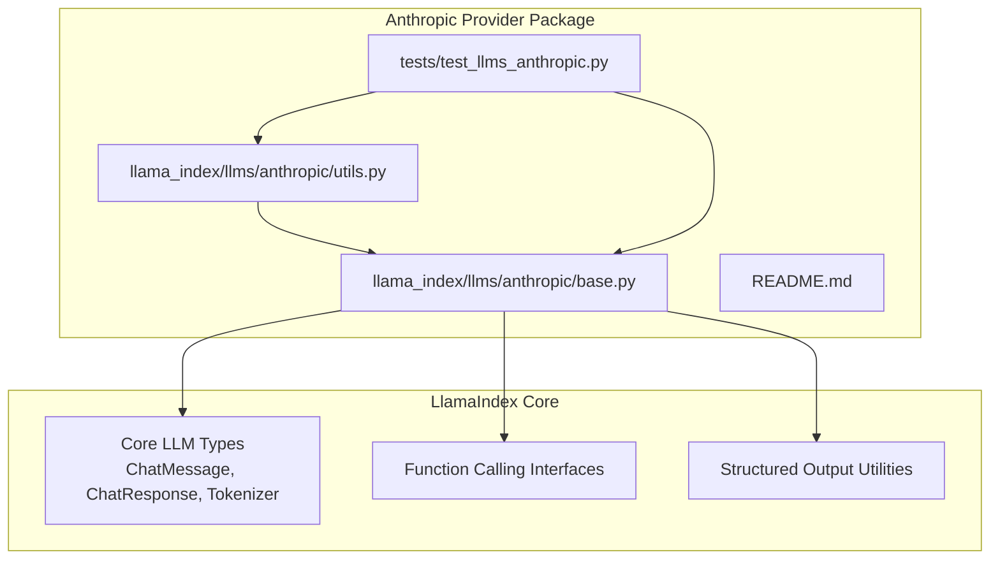
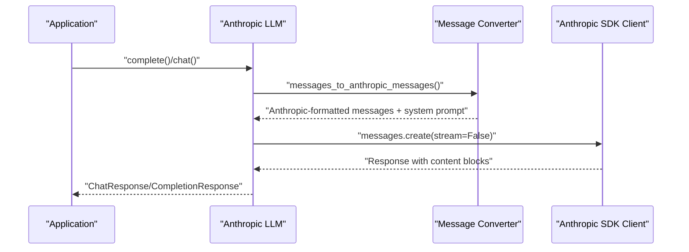
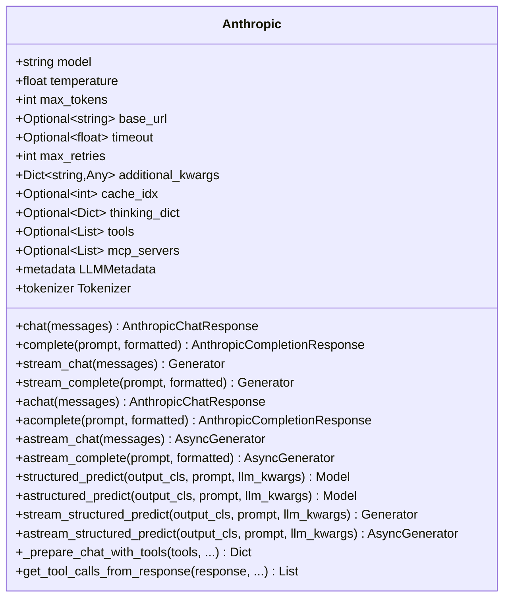
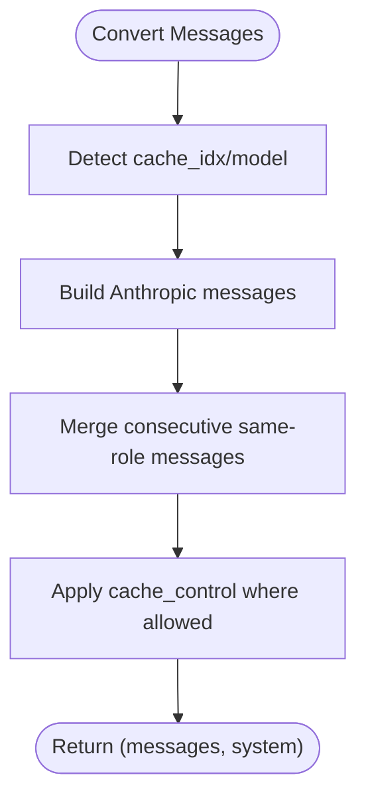
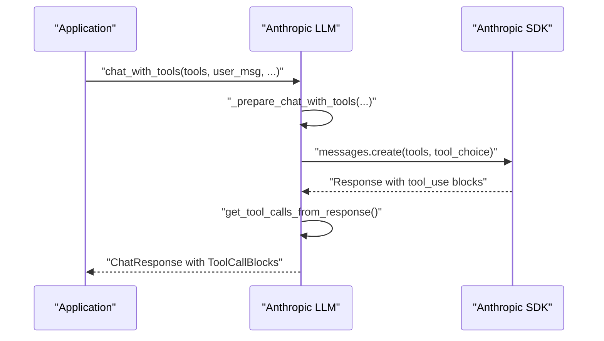
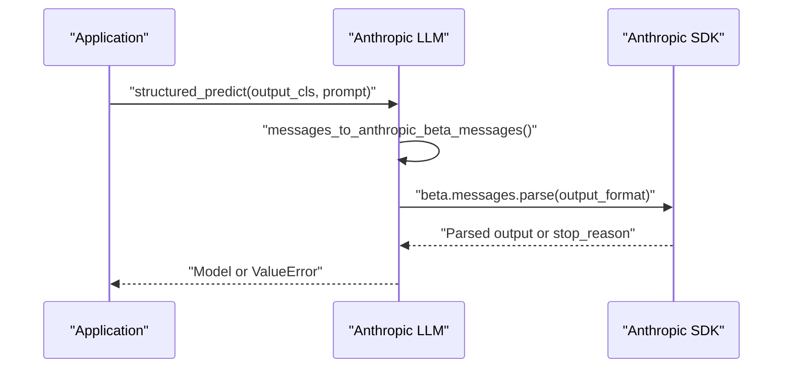
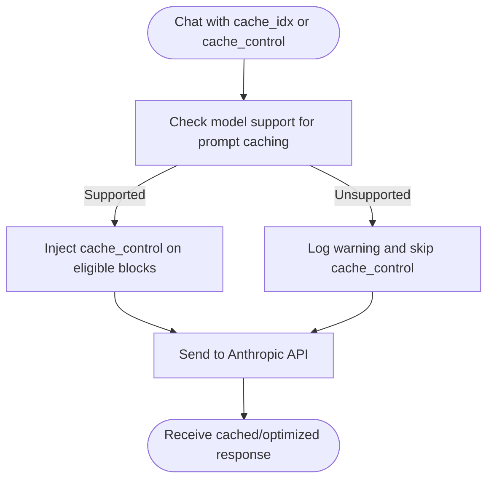
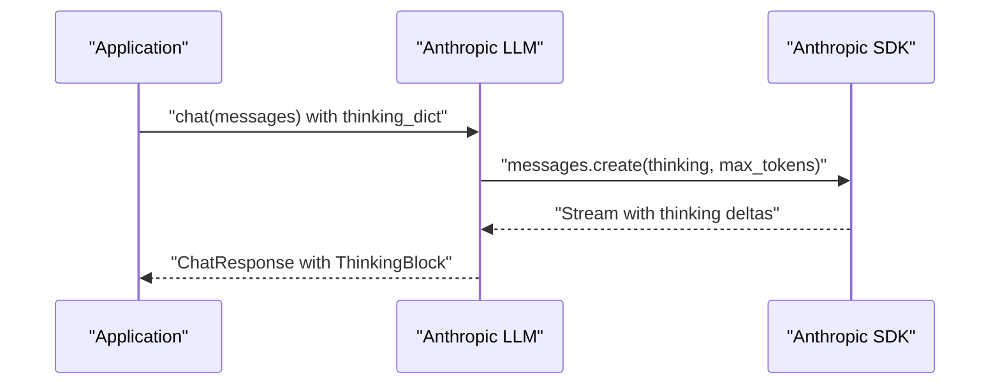
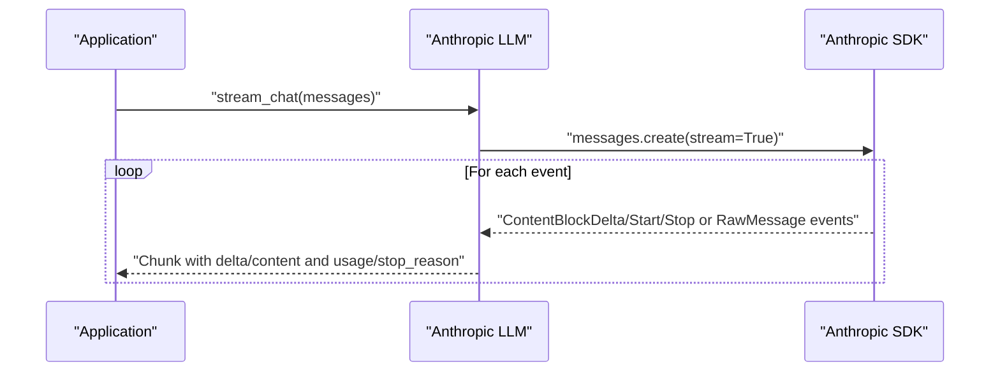
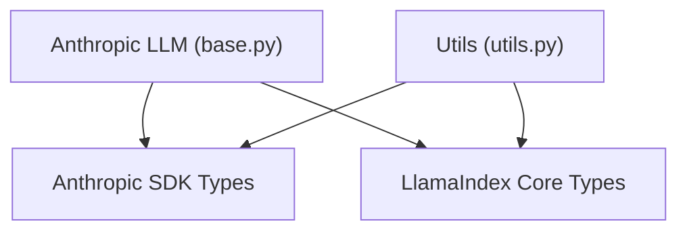

# Anthropic Claude

<cite>
**Referenced Files in This Document**
- [base.py](file://llama-index-integrations/llms/llama-index-llms-anthropic/llama_index/llms/anthropic/base.py)
- [utils.py](file://llama-index-integrations/llms/llama-index-llms-anthropic/llama_index/llms/anthropic/utils.py)
- [README.md](file://llama-index-integrations/llms/llama-index-llms-anthropic/README.md)
- [test_llms_anthropic.py](file://llama-index-integrations/llms/llama-index-llms-anthropic/tests/test_llms_anthropic.py)
- [anthropic.md](file://docs/api_reference/api_reference/llms/anthropic.md)
- [anthropic.ipynb](file://docs/examples/llm/anthropic.ipynb)
</cite>

## Table of Contents
1. [Introduction](#introduction)
2. [Project Structure](#project-structure)
3. [Core Components](#core-components)
4. [Architecture Overview](#architecture-overview)
5. [Detailed Component Analysis](#detailed-component-analysis)
6. [Dependency Analysis](#dependency-analysis)
7. [Performance Considerations](#performance-considerations)
8. [Troubleshooting Guide](#troubleshooting-guide)
9. [Conclusion](#conclusion)
10. [Appendices](#appendices)

## Introduction
This document provides comprehensive documentation for integrating Anthropic Claude as an LLM provider within the LlamaIndex ecosystem. It covers API key configuration, model selection across Claude 3 and Claude 3.5 variants, advanced features such as tool use, structured outputs, citations, prompt caching, thinking mode, streaming responses, and multimodal input handling. It also includes guidance on cost optimization, rate-limit awareness, and best practices for Claude-specific prompting techniques.

## Project Structure
The Anthropic integration is implemented as a dedicated LLM provider package that extends LlamaIndex’s core LLM abstractions. The primary implementation resides under the Anthropic package, with supporting utilities for message conversion, model metadata, and capability checks.

**Diagram sources**
- [base.py](file://llama-index-integrations/llms/llama-index-llms-anthropic/llama_index/llms/anthropic/base.py#L116-L328)
- [utils.py](file://llama-index-integrations/llms/llama-index-llms-anthropic/llama_index/llms/anthropic/utils.py#L114-L141)
- [test_llms_anthropic.py](file://llama-index-integrations/llms/llama-index-llms-anthropic/tests/test_llms_anthropic.py#L1-L120)

**Section sources**
- [base.py](file://llama-index-integrations/llms/llama-index-llms-anthropic/llama_index/llms/anthropic/base.py#L1-L120)
- [utils.py](file://llama-index-integrations/llms/llama-index-llms-anthropic/llama_index/llms/anthropic/utils.py#L1-L120)
- [README.md](file://llama-index-integrations/llms/llama-index-llms-anthropic/README.md#L1-L120)

## Core Components
- Anthropic LLM class: Implements sync and async chat/completion, streaming, tool/function calling, structured outputs, and thinking mode.
- Utility functions: Convert LlamaIndex content blocks/messages to Anthropic SDK-compatible formats, manage prompt caching, and detect model capabilities.
- Tests: Validate Vertex/AWS Bedrock integration, streaming usage metadata, structured outputs, tool calling, and thinking mode.

Key capabilities:
- API key configuration via environment variable or constructor parameter.
- Model selection across Claude 3, 3.5, and 4.x variants with context window detection.
- Tool/function calling with server-side tool use and citations.
- Structured outputs with automatic parsing and fallback behavior.
- Prompt caching for repeated prompts to reduce cost and latency.
- Thinking mode for extended reasoning with token budgeting.
- Streaming with usage metadata and stop reasons.
- Multimodal support for images and documents.

**Section sources**
- [base.py](file://llama-index-integrations/llms/llama-index-llms-anthropic/llama_index/llms/anthropic/base.py#L116-L328)
- [utils.py](file://llama-index-integrations/llms/llama-index-llms-anthropic/llama_index/llms/anthropic/utils.py#L114-L141)
- [README.md](file://llama-index-integrations/llms/llama-index-llms-anthropic/README.md#L19-L120)
- [test_llms_anthropic.py](file://llama-index-integrations/llms/llama-index-llms-anthropic/tests/test_llms_anthropic.py#L35-L130)

## Architecture Overview
The Anthropic provider integrates with LlamaIndex by translating generic LLM abstractions into Anthropic SDK calls and back. It supports multiple deployment targets (direct API, Vertex AI, AWS Bedrock) and exposes advanced features such as tool/function calling, structured outputs, and prompt caching.

**Diagram sources**
- [base.py](file://llama-index-integrations/llms/llama-index-llms-anthropic/llama_index/llms/anthropic/base.py#L416-L441)
- [utils.py](file://llama-index-integrations/llms/llama-index-llms-anthropic/llama_index/llms/anthropic/utils.py#L314-L371)

**Section sources**
- [base.py](file://llama-index-integrations/llms/llama-index-llms-anthropic/llama_index/llms/anthropic/base.py#L416-L441)
- [utils.py](file://llama-index-integrations/llms/llama-index-llms-anthropic/llama_index/llms/anthropic/utils.py#L314-L371)

## Detailed Component Analysis

### Anthropic LLM Class
The Anthropic class encapsulates configuration, client instantiation, and method implementations for chat, completion, streaming, and specialized features.

Key attributes and behaviors:
- Configuration: model, temperature, max_tokens, base_url, timeout, max_retries, additional_kwargs, cache_idx, thinking_dict, tools, mcp_servers.
- Clients: Supports direct API, Vertex AI, and AWS Bedrock clients based on constructor parameters.
- Metadata: Exposes context window and function-calling capability derived from model name.
- Tokenizer: Uses Anthropic SDK’s token counting for accurate context management.
- Tool/function calling: Prepares tool definitions, maps tool_choice, validates single-tool-call behavior when disabled, and extracts tool selections.
- Structured outputs: Uses beta structured outputs when supported; falls back to legacy parsing otherwise.
- Thinking mode: Enables extended reasoning with token budgeting and temperature adjustments.
- Streaming: Captures usage metadata and stop_reason from streaming events.

**Diagram sources**
- [base.py](file://llama-index-integrations/llms/llama-index-llms-anthropic/llama_index/llms/anthropic/base.py#L116-L328)

**Section sources**
- [base.py](file://llama-index-integrations/llms/llama-index-llms-anthropic/llama_index/llms/anthropic/base.py#L116-L328)

### Message Conversion and Prompt Caching
Utilities translate LlamaIndex content blocks and chat messages into Anthropic SDK-compatible formats, including multimodal support, tool results, and citations. They also inject cache_control for prompt caching when supported by the model.

Highlights:
- Blocks to Anthropic blocks: text, image (base64), document (PDF base64), thinking, tool_use, citable blocks, cache points.
- Message conversion: merges consecutive messages with the same role, applies cache_control to selected messages or indices, and separates system prompts.
- Capability detection: identifies models supporting prompt caching and structured outputs.

**Diagram sources**
- [utils.py](file://llama-index-integrations/llms/llama-index-llms-anthropic/llama_index/llms/anthropic/utils.py#L314-L371)
- [utils.py](file://llama-index-integrations/llms/llama-index-llms-anthropic/llama_index/llms/anthropic/utils.py#L547-L663)

**Section sources**
- [utils.py](file://llama-index-integrations/llms/llama-index-llms-anthropic/llama_index/llms/anthropic/utils.py#L197-L311)
- [utils.py](file://llama-index-integrations/llms/llama-index-llms-anthropic/llama_index/llms/anthropic/utils.py#L314-L371)
- [utils.py](file://llama-index-integrations/llms/llama-index-llms-anthropic/llama_index/llms/anthropic/utils.py#L547-L663)

### Tool and Function Calling
The provider supports server-side tool/function calling with optional citations and robust tool-choice mapping.

Key aspects:
- Tool preparation: converts tool metadata to Anthropic tool definitions; applies cache_control for tool schemas when supported.
- Tool choice mapping: auto vs. any depending on whether tools are provided and whether tool_required is set; disables parallel tool use when configured.
- Validation: enforces single tool call when parallel tool calls are disallowed.
- Citations: surfaces citations from tool results as structured CitationBlocks.

**Diagram sources**
- [base.py](file://llama-index-integrations/llms/llama-index-llms-anthropic/llama_index/llms/anthropic/base.py#L931-L986)
- [base.py](file://llama-index-integrations/llms/llama-index-llms-anthropic/llama_index/llms/anthropic/base.py#L1000-L1037)
- [test_llms_anthropic.py](file://llama-index-integrations/llms/llama-index-llms-anthropic/tests/test_llms_anthropic.py#L247-L314)

**Section sources**
- [base.py](file://llama-index-integrations/llms/llama-index-llms-anthropic/llama_index/llms/anthropic/base.py#L931-L986)
- [base.py](file://llama-index-integrations/llms/llama-index-llms-anthropic/llama_index/llms/anthropic/base.py#L1000-L1037)
- [test_llms_anthropic.py](file://llama-index-integrations/llms/llama-index-llms-anthropic/tests/test_llms_anthropic.py#L247-L314)

### Structured Outputs
The provider supports Anthropic’s structured outputs beta when available, with graceful fallback for unsupported models.

Highlights:
- Detection: checks model support for structured outputs.
- Sync/async: structured_predict and astructured_predict use beta messages.parse with output_format.
- Streaming: stream_structured_predict and astream_structured_predict warn and return a single parsed result.

**Diagram sources**
- [base.py](file://llama-index-integrations/llms/llama-index-llms-anthropic/llama_index/llms/anthropic/base.py#L1040-L1104)
- [utils.py](file://llama-index-integrations/llms/llama-index-llms-anthropic/llama_index/llms/anthropic/utils.py#L649-L663)

**Section sources**
- [base.py](file://llama-index-integrations/llms/llama-index-llms-anthropic/llama_index/llms/anthropic/base.py#L1040-L1104)
- [utils.py](file://llama-index-integrations/llms/llama-index-llms-anthropic/llama_index/llms/anthropic/utils.py#L649-L663)

### Prompt Caching
Prompt caching reduces cost and latency by reusing precomputed attention for repeated or shared prompt segments.

Capabilities:
- Global cache control via cache_idx to cache first N messages (including -1 for all).
- Per-message cache_control injection when model supports caching.
- Tool schema caching for tool definitions when supported.

**Diagram sources**
- [utils.py](file://llama-index-integrations/llms/llama-index-llms-anthropic/llama_index/llms/anthropic/utils.py#L314-L371)
- [utils.py](file://llama-index-integrations/llms/llama-index-llms-anthropic/llama_index/llms/anthropic/utils.py#L633-L646)
- [test_llms_anthropic.py](file://llama-index-integrations/llms/llama-index-llms-anthropic/tests/test_llms_anthropic.py#L557-L616)

**Section sources**
- [utils.py](file://llama-index-integrations/llms/llama-index-llms-anthropic/llama_index/llms/anthropic/utils.py#L314-L371)
- [utils.py](file://llama-index-integrations/llms/llama-index-llms-anthropic/llama_index/llms/anthropic/utils.py#L633-L646)
- [test_llms_anthropic.py](file://llama-index-integrations/llms/llama-index-llms-anthropic/tests/test_llms_anthropic.py#L557-L616)

### Thinking Mode
Thinking mode enables Claude to emit an internal reasoning trace before producing the final answer, useful for complex reasoning tasks.

Behavior:
- Enabled via thinking_dict with budget_tokens and type "enabled".
- Requires temperature adjusted appropriately and max_tokens sufficient for the thinking budget.
- Streaming captures thinking blocks and signatures.

**Diagram sources**
- [base.py](file://llama-index-integrations/llms/llama-index-llms-anthropic/llama_index/llms/anthropic/base.py#L452-L653)
- [test_llms_anthropic.py](file://llama-index-integrations/llms/llama-index-llms-anthropic/tests/test_llms_anthropic.py#L447-L476)

**Section sources**
- [base.py](file://llama-index-integrations/llms/llama-index-llms-anthropic/llama_index/llms/anthropic/base.py#L452-L653)
- [test_llms_anthropic.py](file://llama-index-integrations/llms/llama-index-llms-anthropic/tests/test_llms_anthropic.py#L447-L476)

### Streaming Responses
The provider supports streaming for both chat and completion, capturing usage metadata and stop reasons from streaming events.

Highlights:
- Streams content deltas, tool-use deltas, citations, and thinking blocks.
- Aggregates usage metadata and stop_reason updates across the stream lifecycle.

**Diagram sources**
- [base.py](file://llama-index-integrations/llms/llama-index-llms-anthropic/llama_index/llms/anthropic/base.py#L452-L653)
- [test_llms_anthropic.py](file://llama-index-integrations/llms/llama-index-llms-anthropic/tests/test_llms_anthropic.py#L653-L753)

**Section sources**
- [base.py](file://llama-index-integrations/llms/llama-index-llms-anthropic/llama_index/llms/anthropic/base.py#L452-L653)
- [test_llms_anthropic.py](file://llama-index-integrations/llms/llama-index-llms-anthropic/tests/test_llms_anthropic.py#L653-L753)

### Multimodal Input Handling
The provider supports multimodal inputs including images and documents.

Capabilities:
- Images: base64-encoded images with supported MIME types.
- Documents: PDFs encoded as base64.
- Mixed content: combining text, images, and documents within a single message.

**Section sources**
- [utils.py](file://llama-index-integrations/llms/llama-index-llms-anthropic/llama_index/llms/anthropic/utils.py#L166-L194)
- [anthropic.ipynb](file://docs/examples/llm/anthropic.ipynb#L423-L471)

### Model Selection and Context Windows
The provider detects context windows for various Claude models across providers (direct, Vertex AI, AWS Bedrock).

Supported models include:
- Claude 3: haiku, sonnet, opus variants.
- Claude 3.5: haiku, sonnet variants.
- Claude 4.x: opus, sonnet, and experimental variants.

Context windows are derived from model identifiers and validated against known lists.

**Section sources**
- [utils.py](file://llama-index-integrations/llms/llama-index-llms-anthropic/llama_index/llms/anthropic/utils.py#L84-L141)
- [anthropic.ipynb](file://docs/examples/llm/anthropic.ipynb#L18-L21)

## Dependency Analysis
The Anthropic provider depends on:
- Anthropic SDK types and client classes for API interactions.
- LlamaIndex core types for messages, responses, tokenizer, and content blocks.
- Testing infrastructure for Vertex/AWS Bedrock, streaming metadata, structured outputs, and tool/function calling.

**Diagram sources**
- [base.py](file://llama-index-integrations/llms/llama-index-llms-anthropic/llama_index/llms/anthropic/base.py#L56-L84)
- [utils.py](file://llama-index-integrations/llms/llama-index-llms-anthropic/llama_index/llms/anthropic/utils.py#L22-L48)

**Section sources**
- [base.py](file://llama-index-integrations/llms/llama-index-llms-anthropic/llama_index/llms/anthropic/base.py#L56-L84)
- [utils.py](file://llama-index-integrations/llms/llama-index-llms-anthropic/llama_index/llms/anthropic/utils.py#L22-L48)

## Performance Considerations
- Prompt caching: Enable cache_idx or cache_control to reuse computed attention for repeated prompts and reduce cost.
- Structured outputs: Prefer beta structured outputs when supported to avoid parsing overhead.
- Streaming: Use streaming to reduce perceived latency and to capture usage metadata incrementally.
- Thinking mode: Reserve adequate max_tokens and adjust temperature for thinking budgets.
- Tool/function calling: Limit tool usage via tool configurations to avoid unnecessary token consumption.

[No sources needed since this section provides general guidance]

## Troubleshooting Guide
Common issues and resolutions:
- API key not set: Ensure ANTHROPIC_API_KEY is configured or pass api_key to the constructor.
- Vertex/AWS Bedrock integration: Provide region/project_id or aws_region/aws credentials respectively.
- Streaming usage metadata: Verify RawMessageDeltaEvent handling for input/output token counts and stop_reason.
- Structured output failures: Check stop_reason returned by the API; fallback behavior is applied automatically.
- Tool/function calling: Confirm tool_choice mapping and that models support server-side tool use.

**Section sources**
- [README.md](file://llama-index-integrations/llms/llama-index-llms-anthropic/README.md#L28-L66)
- [test_llms_anthropic.py](file://llama-index-integrations/llms/llama-index-llms-anthropic/tests/test_llms_anthropic.py#L35-L130)
- [test_llms_anthropic.py](file://llama-index-integrations/llms/llama-index-llms-anthropic/tests/test_llms_anthropic.py#L839-L931)
- [test_llms_anthropic.py](file://llama-index-integrations/llms/llama-index-llms-anthropic/tests/test_llms_anthropic.py#L949-L1053)

## Conclusion
The Anthropic Claude integration in LlamaIndex provides a robust, feature-rich interface for leveraging Claude models across diverse deployment targets. It supports advanced capabilities such as tool/function calling, structured outputs, prompt caching, thinking mode, streaming, and multimodal inputs. By following the configuration and best practices outlined above, developers can optimize cost, improve responsiveness, and build reliable, scalable AI applications.

[No sources needed since this section summarizes without analyzing specific files]

## Appendices

### API Reference Index
- Anthropic LLM class: [anthropic.md](file://docs/api_reference/api_reference/llms/anthropic.md#L1-L4)

**Section sources**
- [anthropic.md](file://docs/api_reference/api_reference/llms/anthropic.md#L1-L4)