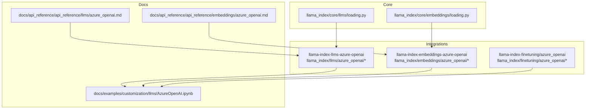
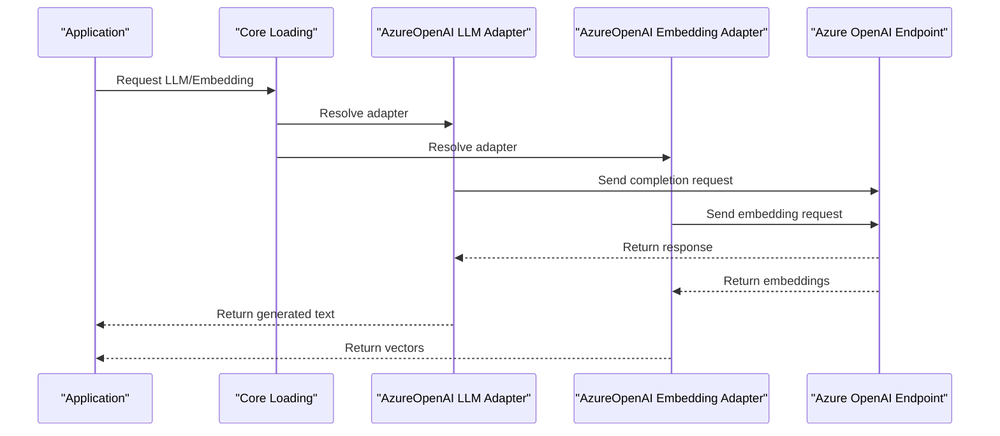
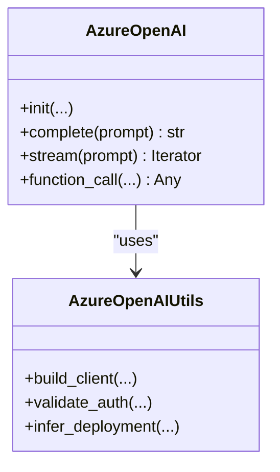
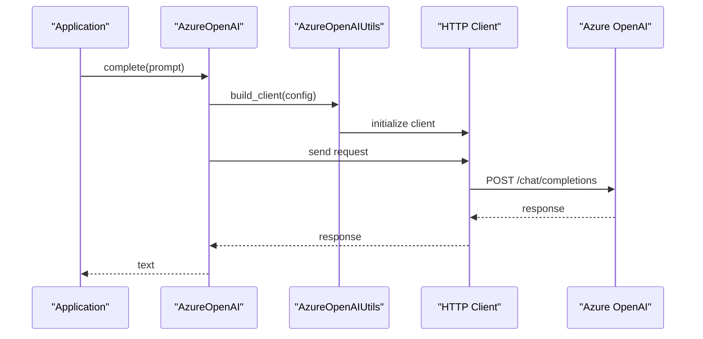
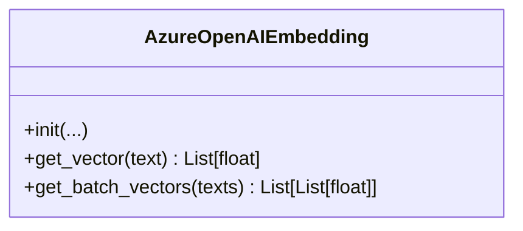
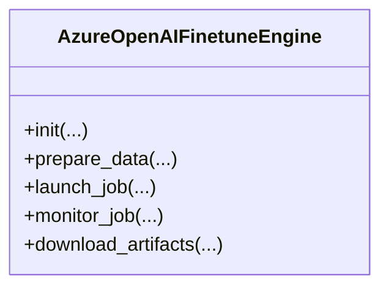
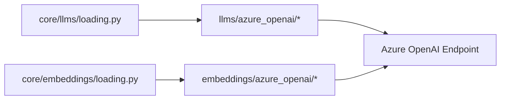

# Azure OpenAI

<cite>
**Referenced Files in This Document**
- [README.md](file://README.md)
- [azure_openai.md](file://docs/api_reference/api_reference/llms/azure_openai.md)
- [azure_openai.md](file://docs/api_reference/api_reference/embeddings/azure_openai.md)
- [AzureOpenAI.ipynb](file://docs/examples/customization/llms/AzureOpenAI.ipynb)
- [azure_openai/__init__.py](file://llama-index-integrations/llms/llama-index-llms-azure-openai/llama_index/llms/azure_openai/__init__.py)
- [base.py](file://llama-index-integrations/llms/llama-index-llms-azure-openai/llama_index/llms/azure_openai/base.py)
- [utils.py](file://llama-index-integrations/llms/llama-index-llms-azure-openai/llama_index/llms/azure_openai/utils.py)
- [azure_openai/__init__.py](file://llama-index-integrations/embeddings/llama-index-embeddings-azure-openai/llama_index/embeddings/azure_openai/__init__.py)
- [base.py](file://llama-index-integrations/embeddings/llama-index-embeddings-azure-openai/llama_index/embeddings/azure_openai/base.py)
- [azure_openai/__init__.py](file://llama-index-finetuning/llama_index/finetuning/azure_openai/__init__.py)
- [base.py](file://llama-index-finetuning/llama_index/finetuning/azure_openai/base.py)
- [loading.py](file://llama-index-core/llama_index/core/llms/loading.py)
- [loading.py](file://llama-index-core/llama_index/core/embeddings/loading.py)
- [CHANGELOG.md](file://CHANGELOG.md)
</cite>

## Table of Contents
1. [Introduction](#introduction)
2. [Project Structure](#project-structure)
3. [Core Components](#core-components)
4. [Architecture Overview](#architecture-overview)
5. [Detailed Component Analysis](#detailed-component-analysis)
6. [Dependency Analysis](#dependency-analysis)
7. [Performance Considerations](#performance-considerations)
8. [Troubleshooting Guide](#troubleshooting-guide)
9. [Conclusion](#conclusion)
10. [Appendices](#appendices)

## Introduction
This document provides comprehensive guidance for integrating Azure OpenAI services within the LlamaIndex ecosystem. It covers authentication via Azure Active Directory, subscription configuration, and endpoint setup for Azure OpenAI resources. It explains deployment names, API versions, and regional availability across Azure regions. Advanced topics include custom domains, managed identity authentication, and enterprise-grade security. Secure credential management, failover strategies, and hybrid cloud deployment patterns are addressed alongside compliance considerations, data governance, and integration with Azure monitoring and logging services.

## Project Structure
The Azure OpenAI integration spans three primary areas:
- LLM integration for text generation
- Embedding integration for vector generation
- Fine-tuning integration for training custom models

Key locations:
- LLM integration: llama-index-integrations/llms/llama-index-llms-azure-openai
- Embedding integration: llama-index-integrations/embeddings/llama-index-embeddings-azure-openai
- Fine-tuning integration: llama-index-finetuning/llama_index/finetuning/azure_openai
- Core loading mechanisms: llama-index-core/llama_index/core/{llms,embeddings}/loading.py
- Examples and API references: docs/examples and docs/api_reference

**Diagram sources**
- [loading.py](file://llama-index-core/llama_index/core/llms/loading.py#L1-L40)
- [loading.py](file://llama-index-core/llama_index/core/embeddings/loading.py#L1-L40)
- [azure_openai/__init__.py](file://llama-index-integrations/llms/llama-index-llms-azure-openai/llama_index/llms/azure_openai/__init__.py#L1-L40)
- [azure_openai/__init__.py](file://llama-index-integrations/embeddings/llama-index-embeddings-azure-openai/llama_index/embeddings/azure_openai/__init__.py#L1-L40)
- [azure_openai/__init__.py](file://llama-index-finetuning/llama_index/finetuning/azure_openai/__init__.py#L1-L40)
- [AzureOpenAI.ipynb](file://docs/examples/customization/llms/AzureOpenAI.ipynb#L1-L120)
- [azure_openai.md](file://docs/api_reference/api_reference/llms/azure_openai.md#L1-L4)
- [azure_openai.md](file://docs/api_reference/api_reference/embeddings/azure_openai.md#L1-L4)

**Section sources**
- [README.md](file://README.md#L1-L224)
- [azure_openai.md](file://docs/api_reference/api_reference/llms/azure_openai.md#L1-L4)
- [azure_openai.md](file://docs/api_reference/api_reference/embeddings/azure_openai.md#L1-L4)

## Core Components
- AzureOpenAI LLM: Provides a drop-in replacement for local LLMs with Azure OpenAI-compatible endpoints, supporting streaming, function calling, and multimodal inputs.
- AzureOpenAIEmbedding: Provides vector embeddings generation compatible with Azure OpenAI embeddings endpoints.
- AzureOpenAIFinetuneEngine: Enables fine-tuning workflows on Azure OpenAI resources.

These components are loaded and configured through the core loading mechanisms and exposed via integration packages.

**Section sources**
- [azure_openai.md](file://docs/api_reference/api_reference/llms/azure_openai.md#L1-L4)
- [azure_openai.md](file://docs/api_reference/api_reference/embeddings/azure_openai.md#L1-L4)
- [loading.py](file://llama-index-core/llama_index/core/llms/loading.py#L1-L40)
- [loading.py](file://llama-index-core/llama_index/core/embeddings/loading.py#L1-L40)

## Architecture Overview
The integration architecture connects application code to Azure OpenAI through standardized adapters. The LLM adapter handles text generation requests, while the embedding adapter produces vectors. Fine-tuning integrates with Azure OpenAI’s training capabilities. Core loading resolves the appropriate adapter based on configuration.

**Diagram sources**
- [loading.py](file://llama-index-core/llama_index/core/llms/loading.py#L1-L40)
- [loading.py](file://llama-index-core/llama_index/core/embeddings/loading.py#L1-L40)
- [base.py](file://llama-index-integrations/llms/llama-index-llms-azure-openai/llama_index/llms/azure_openai/base.py#L1-L200)
- [base.py](file://llama-index-integrations/embeddings/llama-index-embeddings-azure-openai/llama_index/embeddings/azure_openai/base.py#L1-L200)

## Detailed Component Analysis

### AzureOpenAI LLM Adapter
The LLM adapter encapsulates Azure OpenAI endpoint configuration, authentication, and request routing. It supports streaming responses, function/tool calling, and multimodal inputs.

**Diagram sources**
- [base.py](file://llama-index-integrations/llms/llama-index-llms-azure-openai/llama_index/llms/azure_openai/base.py#L1-L200)
- [utils.py](file://llama-index-integrations/llms/llama-index-llms-azure-openai/llama_index/llms/azure_openai/utils.py#L1-L200)

Key configuration aspects:
- Authentication via Azure Active Directory tokens or keys
- Endpoint resolution via base URL or deployment-specific endpoints
- Streaming and function/tool calling support
- Multimodal input handling

Operational flow for a completion request:

**Diagram sources**
- [base.py](file://llama-index-integrations/llms/llama-index-llms-azure-openai/llama_index/llms/azure_openai/base.py#L1-L200)
- [utils.py](file://llama-index-integrations/llms/llama-index-llms-azure-openai/llama_index/llms/azure_openai/utils.py#L1-L200)

**Section sources**
- [azure_openai/__init__.py](file://llama-index-integrations/llms/llama-index-llms-azure-openai/llama_index/llms/azure_openai/__init__.py#L1-L120)
- [base.py](file://llama-index-integrations/llms/llama-index-llms-azure-openai/llama_index/llms/azure_openai/base.py#L1-L200)
- [utils.py](file://llama-index-integrations/llms/llama-index-llms-azure-openai/llama_index/llms/azure_openai/utils.py#L1-L200)

### AzureOpenAI Embedding Adapter
The embedding adapter generates vectors from text using Azure OpenAI embeddings endpoints. It supports dimension configuration and aligns with Azure OpenAI’s embedding API.

**Diagram sources**
- [base.py](file://llama-index-integrations/embeddings/llama-index-embeddings-azure-openai/llama_index/embeddings/azure_openai/base.py#L1-L200)

**Section sources**
- [azure_openai/__init__.py](file://llama-index-integrations/embeddings/llama-index-embeddings-azure-openai/llama_index/embeddings/azure_openai/__init__.py#L1-L120)
- [base.py](file://llama-index-integrations/embeddings/llama-index-embeddings-azure-openai/llama_index/embeddings/azure_openai/base.py#L1-L200)

### AzureOpenAIFinetuneEngine
Fine-tuning integration enables training custom models on Azure OpenAI resources, leveraging the broader LlamaIndex fine-tuning framework.

**Diagram sources**
- [base.py](file://llama-index-finetuning/llama_index/finetuning/azure_openai/base.py#L1-L200)

**Section sources**
- [azure_openai/__init__.py](file://llama-index-finetuning/llama_index/finetuning/azure_openai/__init__.py#L1-L120)
- [base.py](file://llama-index-finetuning/llama_index/finetuning/azure_openai/base.py#L1-L200)

### Configuration and Setup
- Subscription and resource creation: Provision Azure OpenAI resources in the Azure portal and note the resource name, key, and endpoint.
- Deployment names: Configure the deployment name used for chat completions and embeddings.
- API versions: Align with supported API versions for the Azure OpenAI service.
- Regional availability: Select a region where Azure OpenAI is available and ensure network connectivity.

Authentication and credentials:
- Azure Active Directory: Use managed identities or service principals for secure authentication.
- Keys and secrets: Store keys in secure secret stores and pass them to the adapter via environment variables or configuration.
- Custom domains: Configure custom domains for endpoints if required by enterprise policies.

Security and compliance:
- Managed identity authentication: Prefer managed identities for applications running in Azure.
- Enterprise-grade security: Enforce encryption at rest and in transit, audit logs, and compliance frameworks.
- Data governance: Control data residency and retention policies aligned with organizational standards.

Monitoring and logging:
- Integrate with Azure Application Insights and Log Analytics for telemetry and diagnostics.
- Enable request tracing and correlation IDs for end-to-end visibility.

Failover and hybrid cloud:
- Multi-region deployments: Configure failover to secondary regions for high availability.
- Hybrid cloud: Use Azure Stack or on-premises gateways where applicable, ensuring consistent authentication and endpoint configuration.

Secure credential management:
- Environment variables: Pass credentials via environment variables or Azure Key Vault-backed configuration.
- Secret rotation: Automate rotation and refresh of tokens and keys.
- Least privilege: Assign minimal required permissions to identities and service principals.

**Section sources**
- [AzureOpenAI.ipynb](file://docs/examples/customization/llms/AzureOpenAI.ipynb#L1-L200)
- [CHANGELOG.md](file://CHANGELOG.md#L10465-L10467)

## Dependency Analysis
Core loading resolves the AzureOpenAI adapters based on configuration. The LLM and embedding adapters depend on the integration modules, which in turn rely on Azure OpenAI endpoints.

**Diagram sources**
- [loading.py](file://llama-index-core/llama_index/core/llms/loading.py#L1-L40)
- [loading.py](file://llama-index-core/llama_index/core/embeddings/loading.py#L1-L40)
- [azure_openai/__init__.py](file://llama-index-integrations/llms/llama-index-llms-azure-openai/llama_index/llms/azure_openai/__init__.py#L1-L120)
- [azure_openai/__init__.py](file://llama-index-integrations/embeddings/llama-index-embeddings-azure-openai/llama_index/embeddings/azure_openai/__init__.py#L1-L120)

**Section sources**
- [loading.py](file://llama-index-core/llama_index/core/llms/loading.py#L1-L40)
- [loading.py](file://llama-index-core/llama_index/core/embeddings/loading.py#L1-L40)

## Performance Considerations
- Optimize batch sizes for embeddings and completions.
- Enable streaming for long-running operations to improve perceived latency.
- Use connection pooling and retry policies with exponential backoff.
- Monitor throughput and latency metrics via Azure Application Insights.

## Troubleshooting Guide
Common issues and resolutions:
- Authentication failures: Verify Azure Active Directory token provider and scopes. Confirm that the token provider is correctly configured and not conflicting with other credential parameters.
- Endpoint misconfiguration: Ensure base URL and deployment name are correctly set and mutually exclusive where required.
- Streaming anomalies: Validate streaming chunk parsing and tool call detection logic.
- Custom HTTP client: Use provided HTTP client configurations to avoid conflicts with underlying transport layers.

Relevant changelog entries:
- Azure AD validation and support improvements
- Mutually exclusive parameters for base URL and deployment
- Enhanced streaming and tool call handling
- Custom HTTP client support

**Section sources**
- [CHANGELOG.md](file://CHANGELOG.md#L1203-L1203)
- [CHANGELOG.md](file://CHANGELOG.md#L2753-L2754)
- [CHANGELOG.md](file://CHANGELOG.md#L2964-L2965)
- [CHANGELOG.md](file://CHANGELOG.md#L3064-L3064)
- [CHANGELOG.md](file://CHANGELOG.md#L5838-L5838)
- [CHANGELOG.md](file://CHANGELOG.md#L8980-L8980)
- [CHANGELOG.md](file://CHANGELOG.md#L9217-L9217)
- [CHANGELOG.md](file://CHANGELOG.md#L9263-L9263)
- [CHANGELOG.md](file://CHANGELOG.md#L9319-L9319)
- [CHANGELOG.md](file://CHANGELOG.md#L9437-L9437)
- [CHANGELOG.md](file://CHANGELOG.md#L9445-L9445)
- [CHANGELOG.md](file://CHANGELOG.md#L10032-L10032)
- [CHANGELOG.md](file://CHANGELOG.md#L10465-L10467)
- [CHANGELOG.md](file://CHANGELOG.md#L10518-L10518)

## Conclusion
The Azure OpenAI integration in LlamaIndex provides a robust, secure, and scalable pathway to leverage Azure-hosted OpenAI capabilities. By adhering to best practices for authentication, configuration, and enterprise-grade security, teams can deploy reliable RAG and generative applications with strong compliance and observability.

## Appendices
- Example notebooks demonstrate practical usage patterns for LLMs and embeddings with Azure OpenAI.
- API reference pages enumerate public classes and members for quick lookup.

**Section sources**
- [AzureOpenAI.ipynb](file://docs/examples/customization/llms/AzureOpenAI.ipynb#L1-L200)
- [azure_openai.md](file://docs/api_reference/api_reference/llms/azure_openai.md#L1-L4)
- [azure_openai.md](file://docs/api_reference/api_reference/embeddings/azure_openai.md#L1-L4)