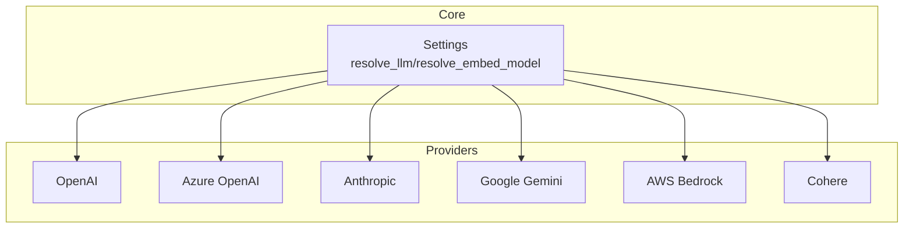
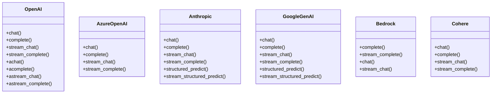
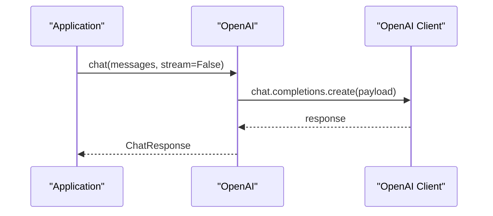
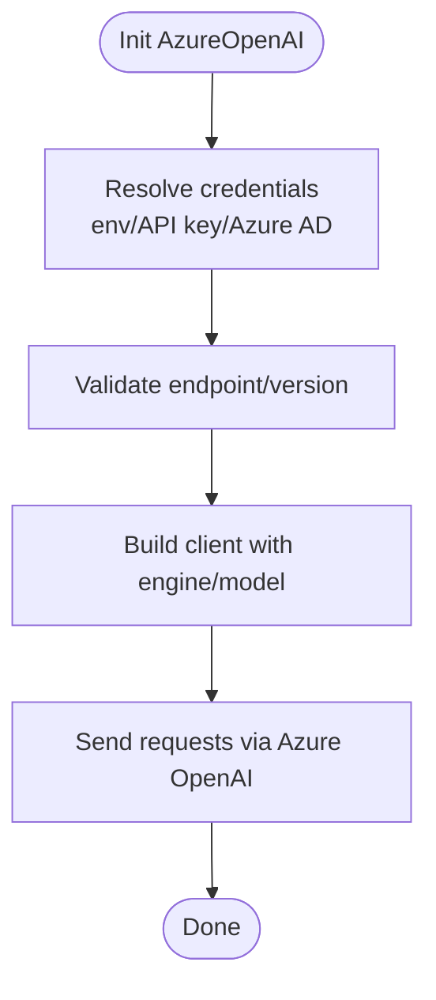
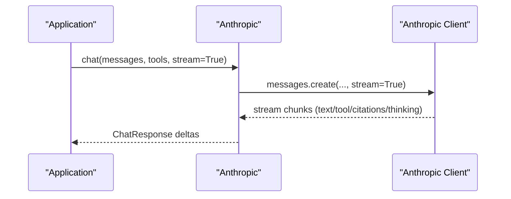
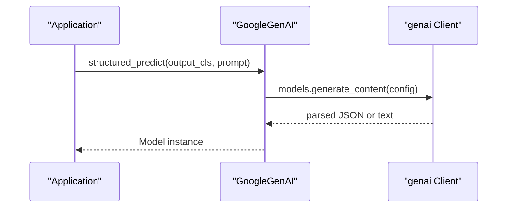
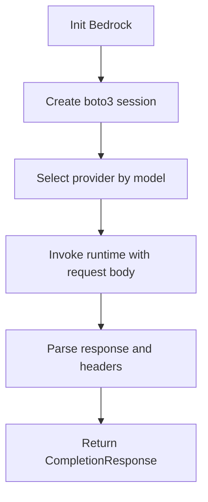
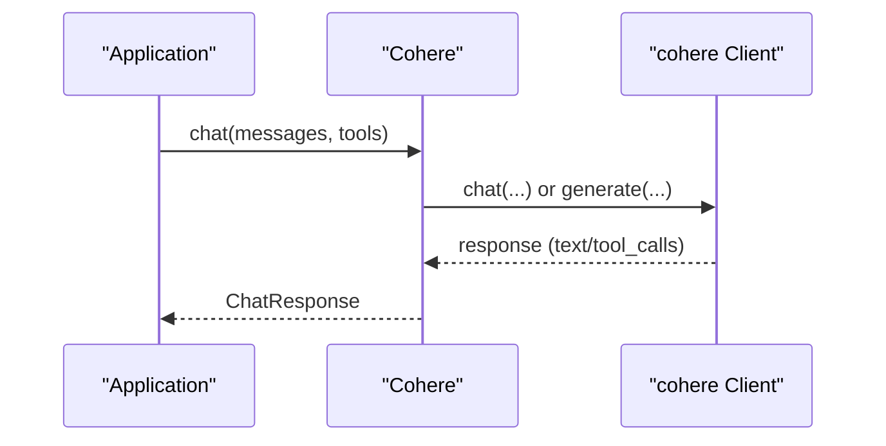
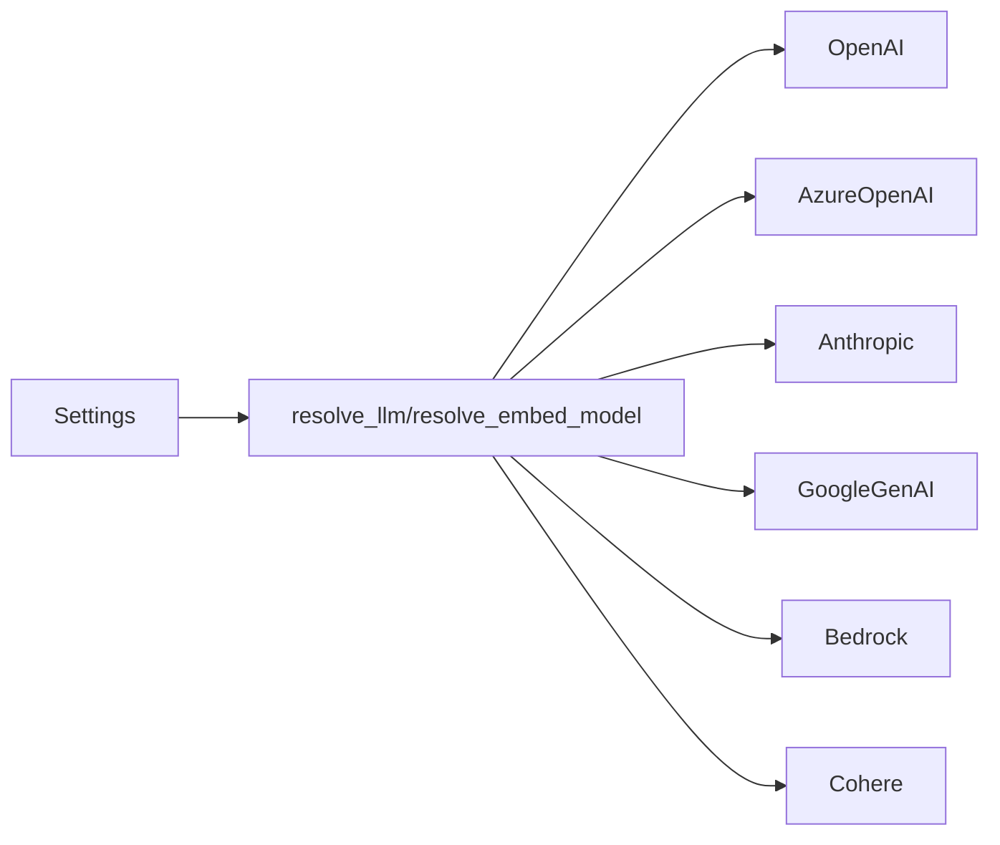

# Cloud LLM Providers

<cite>
**Referenced Files in This Document**
- [settings.py](file://llama-index-core/llama_index/core/settings.py)
- [openai/__init__.py](file://llama-index-integrations/llms/llama-index-llms-openai/llama_index/llms/openai/__init__.py)
- [openai/base.py](file://llama-index-integrations/llms/llama-index-llms-openai/llama_index/llms/openai/base.py)
- [azure_openai/__init__.py](file://llama-index-integrations/llms/llama-index-llms-azure-openai/llama_index/llms/azure_openai/__init__.py)
- [azure_openai/base.py](file://llama-index-integrations/llms/llama-index-llms-azure-openai/llama_index/llms/azure_openai/base.py)
- [anthropic/base.py](file://llama-index-integrations/llms/llama-index-llms-anthropic/llama_index/llms/anthropic/base.py)
- [google_genai/__init__.py](file://llama-index-integrations/llms/llama-index-llms-google-genai/llama_index/llms/google_genai/__init__.py)
- [google_genai/base.py](file://llama-index-integrations/llms/llama-index-llms-google-genai/llama_index/llms/google_genai/base.py)
- [bedrock/__init__.py](file://llama-index-integrations/llms/llama-index-llms-bedrock/llama_index/llms/bedrock/__init__.py)
- [bedrock/base.py](file://llama-index-integrations/llms/llama-index-llms-bedrock/llama_index/llms/bedrock/base.py)
- [cohere/__init__.py](file://llama-index-integrations/llms/llama-index-llms-cohere/llama_index/llms/cohere/__init__.py)
- [cohere/base.py](file://llama-index-integrations/llms/llama-index-llms-cohere/llama_index/llms/cohere/base.py)
</cite>

## Table of Contents
1. [Introduction](#introduction)
2. [Project Structure](#project-structure)
3. [Core Components](#core-components)
4. [Architecture Overview](#architecture-overview)
5. [Detailed Component Analysis](#detailed-component-analysis)
6. [Dependency Analysis](#dependency-analysis)
7. [Performance Considerations](#performance-considerations)
8. [Troubleshooting Guide](#troubleshooting-guide)
9. [Conclusion](#conclusion)
10. [Appendices](#appendices)

## Introduction
This document explains how cloud-hosted LLM providers are integrated in the repository, focusing on unified configuration, authentication, and provider-specific capabilities such as function calling, structured outputs, streaming, and multimodality. It covers OpenAI, Anthropic Claude, Azure OpenAI, Google Gemini, AWS Bedrock, and Cohere, and provides guidance for production-grade deployments, rate-limit handling, retries, cost optimization, regional availability, compliance, and graceful degradation.

## Project Structure
The repository organizes provider integrations under dedicated packages per cloud vendor. Each provider exposes a class that implements a common interface for chat, completion, streaming, and tool/function calling. A central Settings object wires defaults and global behavior.

**Diagram sources**
- [settings.py](file://llama-index-core/llama_index/core/settings.py#L32-L74)
- [openai/__init__.py](file://llama-index-integrations/llms/llama-index-llms-openai/llama_index/llms/openai/__init__.py#L1-L5)
- [azure_openai/__init__.py](file://llama-index-integrations/llms/llama-index-llms-azure-openai/llama_index/llms/azure_openai/__init__.py#L1-L8)
- [anthropic/base.py](file://llama-index-integrations/llms/llama-index-llms-anthropic/llama_index/llms/anthropic/base.py#L116-L328)
- [google_genai/__init__.py](file://llama-index-integrations/llms/llama-index-llms-google-genai/llama_index/llms/google_genai/__init__.py#L1-L4)
- [bedrock/__init__.py](file://llama-index-integrations/llms/llama-index-llms-bedrock/llama_index/llms/bedrock/__init__.py#L1-L14)
- [cohere/__init__.py](file://llama-index-integrations/llms/llama-index-llms-cohere/llama_index/llms/cohere/__init__.py#L1-L20)

**Section sources**
- [settings.py](file://llama-index-core/llama_index/core/settings.py#L17-L74)

## Core Components
- Central Settings: Lazily resolves default LLM/embedding models and injects global callback managers and tokenizers.
- Provider LLMs: Each provider implements a class that encapsulates:
  - Authentication and credential resolution
  - Request construction and streaming
  - Tool/function calling support
  - Structured outputs (where supported)
  - Metadata (context window, function-calling capability)

Key patterns:
- Unified constructor parameters across providers (e.g., temperature, max_tokens, max_retries, timeout).
- Provider-specific credential handling (API keys, base URLs, Azure AD, Vertex AI).
- Streaming via generator/async-generator APIs.
- Tool/function calling via standardized blocks and selection helpers.

**Section sources**
- [settings.py](file://llama-index-core/llama_index/core/settings.py#L32-L74)
- [openai/base.py](file://llama-index-integrations/llms/llama-index-llms-openai/llama_index/llms/openai/base.py#L139-L338)
- [anthropic/base.py](file://llama-index-integrations/llms/llama-index-llms-anthropic/llama_index/llms/anthropic/base.py#L116-L351)
- [google_genai/base.py](file://llama-index-integrations/llms/llama-index-llms-google-genai/llama_index/llms/google_genai/base.py#L101-L270)
- [bedrock/base.py](file://llama-index-integrations/llms/llama-index-llms-bedrock/llama_index/llms/bedrock/base.py#L49-L253)
- [cohere/base.py](file://llama-index-integrations/llms/llama-index-llms-cohere/llama_index/llms/cohere/base.py#L44-L151)

## Architecture Overview
The system composes a unified LLM interface across providers. Each provider’s class handles:
- Credential resolution and client instantiation
- Request payload construction
- Streaming and non-streaming responses
- Tool/function calling normalization
- Structured output parsing

**Diagram sources**
- [openai/base.py](file://llama-index-integrations/llms/llama-index-llms-openai/llama_index/llms/openai/base.py#L394-L751)
- [azure_openai/base.py](file://llama-index-integrations/llms/llama-index-llms-azure-openai/llama_index/llms/azure_openai/base.py#L202-L261)
- [anthropic/base.py](file://llama-index-integrations/llms/llama-index-llms-anthropic/llama_index/llms/anthropic/base.py#L417-L918)
- [google_genai/base.py](file://llama-index-integrations/llms/llama-index-llms-google-genai/llama_index/llms/google_genai/base.py#L362-L774)
- [bedrock/base.py](file://llama-index-integrations/llms/llama-index-llms-bedrock/llama_index/llms/bedrock/base.py#L284-L386)
- [cohere/base.py](file://llama-index-integrations/llms/llama-index-llms-cohere/llama_index/llms/cohere/base.py#L311-L560)

## Detailed Component Analysis

### OpenAI
- Authentication: Supports explicit API key, base URL, and API version. Credentials are resolved centrally.
- Function Calling: Standardized tool blocks and updates across deltas.
- Streaming: Chat and completion streaming with delta accumulation.
- Structured Outputs: Not implemented in the base OpenAI class; use the Responses API or provider-specific alternatives.
- Multimodality: Modalities and audio configuration supported for chat.

**Diagram sources**
- [openai/base.py](file://llama-index-integrations/llms/llama-index-llms-openai/llama_index/llms/openai/base.py#L487-L522)

**Section sources**
- [openai/base.py](file://llama-index-integrations/llms/llama-index-llms-openai/llama_index/llms/openai/base.py#L139-L338)
- [openai/base.py](file://llama-index-integrations/llms/llama-index-llms-openai/llama_index/llms/openai/base.py#L487-L522)
- [openai/base.py](file://llama-index-integrations/llms/llama-index-llms-openai/llama_index/llms/openai/base.py#L525-L592)

### Azure OpenAI
- Authentication: Supports API key or Azure AD token provider. Validates endpoint and API version.
- Deployment: Requires engine/deployment name; maps model to engine for payload.
- Managed Identity: Optional Azure AD token provider for environments with managed identities.

**Diagram sources**
- [azure_openai/base.py](file://llama-index-integrations/llms/llama-index-llms-azure-openai/llama_index/llms/azure_openai/base.py#L187-L200)
- [azure_openai/base.py](file://llama-index-integrations/llms/llama-index-llms-azure-openai/llama_index/llms/azure_openai/base.py#L222-L256)

**Section sources**
- [azure_openai/base.py](file://llama-index-integrations/llms/llama-index-llms-azure-openai/llama_index/llms/azure_openai/base.py#L20-L100)
- [azure_openai/base.py](file://llama-index-integrations/llms/llama-index-llms-azure-openai/llama_index/llms/azure_openai/base.py#L187-L200)
- [azure_openai/base.py](file://llama-index-integrations/llms/llama-index-llms-azure-openai/llama_index/llms/azure_openai/base.py#L222-L256)

### Anthropic Claude
- Authentication: Supports API key, base URL, and region/project for Vertex, or AWS region for Bedrock.
- Function Calling: Tool blocks and tool choice mapping; supports parallel tool use constraints.
- Structured Outputs: Beta structured outputs via “parse” endpoint with JSON schema support.
- Streaming: Rich streaming with text deltas, tool calls, citations, and thinking blocks.
- Prompt Caching: Optional ephemeral cache control for compatible models.

**Diagram sources**
- [anthropic/base.py](file://llama-index-integrations/llms/llama-index-llms-anthropic/llama_index/llms/anthropic/base.py#L452-L653)

**Section sources**
- [anthropic/base.py](file://llama-index-integrations/llms/llama-index-llms-anthropic/llama_index/llms/anthropic/base.py#L116-L351)
- [anthropic/base.py](file://llama-index-integrations/llms/llama-index-llms-anthropic/llama_index/llms/anthropic/base.py#L417-L653)
- [anthropic/base.py](file://llama-index-integrations/llms/llama-index-llms-anthropic/llama_index/llms/anthropic/base.py#L1040-L1104)

### Google Gemini
- Authentication: API key or Vertex AI via environment variables; optional debug and HTTP options.
- Function Calling: Tool declarations and function-calling modes (auto/none/any).
- Structured Outputs: JSON schema-based structured predict and streaming variants.
- Streaming: Streamed chat and structured outputs with flexible model handling.
- Files: Inline, File API, or hybrid modes for multimodal inputs.

**Diagram sources**
- [google_genai/base.py](file://llama-index-integrations/llms/llama-index-llms-google-genai/llama_index/llms/google_genai/base.py#L613-L712)

**Section sources**
- [google_genai/base.py](file://llama-index-integrations/llms/llama-index-llms-google-genai/llama_index/llms/google_genai/base.py#L101-L270)
- [google_genai/base.py](file://llama-index-integrations/llms/llama-index-llms-google-genai/llama_index/llms/google_genai/base.py#L613-L712)
- [google_genai/base.py](file://llama-index-integrations/llms/llama-index-llms-google-genai/llama_index/llms/google_genai/base.py#L715-L774)

### AWS Bedrock
- Authentication: AWS credentials via boto3 session; supports profiles and regions.
- Providers: Delegates to provider-specific handlers for payload construction and response parsing.
- Streaming: Supported for streaming-capable models; otherwise raises errors.
- Guardrails and Tracing: Optional guardrail identifier/version and trace flag.

**Diagram sources**
- [bedrock/base.py](file://llama-index-integrations/llms/llama-index-llms-bedrock/llama_index/llms/bedrock/base.py#L167-L248)
- [bedrock/base.py](file://llama-index-integrations/llms/llama-index-llms-bedrock/llama_index/llms/bedrock/base.py#L292-L309)

**Section sources**
- [bedrock/base.py](file://llama-index-integrations/llms/llama-index-llms-bedrock/llama_index/llms/bedrock/base.py#L49-L253)
- [bedrock/base.py](file://llama-index-integrations/llms/llama-index-llms-bedrock/llama_index/llms/bedrock/base.py#L292-L351)

### Cohere
- Authentication: API key and optional base URL.
- Function Calling: Tool declarations and tool results handling; supports single-step or multi-step conversations.
- Streaming: Chat and completion streaming with incremental text accumulation.
- Constraints: Validates model support for chat and warns on unsupported parameters.

**Diagram sources**
- [cohere/base.py](file://llama-index-integrations/llms/llama-index-llms-cohere/llama_index/llms/cohere/base.py#L311-L345)

**Section sources**
- [cohere/base.py](file://llama-index-integrations/llms/llama-index-llms-cohere/llama_index/llms/cohere/base.py#L44-L151)
- [cohere/base.py](file://llama-index-integrations/llms/llama-index-llms-cohere/llama_index/llms/cohere/base.py#L311-L401)

## Dependency Analysis
- Central Settings depends on resolver utilities to instantiate default LLMs and embeddings.
- Each provider class encapsulates its SDK client and provider-specific credential resolution.
- Shared abstractions (function calling, streaming, metadata) unify behavior across providers.

**Diagram sources**
- [settings.py](file://llama-index-core/llama_index/core/settings.py#L32-L74)

**Section sources**
- [settings.py](file://llama-index-core/llama_index/core/settings.py#L32-L74)

## Performance Considerations
- Retries and timeouts: Providers expose max_retries and timeout parameters; OpenAI and Google Gemini include retry decorators.
- Streaming: Prefer streaming for latency-sensitive applications; ensure generators are consumed promptly.
- Token usage: Providers return usage metadata; track prompt/completion tokens to optimize context windows and reduce cost.
- Concurrency: Reuse clients judiciously; OpenAI supports a reuse_client toggle to balance stability and resource usage.
- Regional endpoints: Choose providers close to users to reduce latency; Azure OpenAI and Google Vertex AI allow regional endpoints.

[No sources needed since this section provides general guidance]

## Troubleshooting Guide
Common issues and remedies:
- Rate limits and quota exhaustion:
  - Implement exponential backoff with max_retries and stop_after_delay_seconds.
  - Monitor usage fields returned by providers and adjust context windows.
- Authentication failures:
  - Verify API keys, base URLs, and environment variables.
  - For Azure OpenAI, confirm endpoint and API version; for Azure AD, ensure token provider is valid.
- Streaming errors:
  - Some models (e.g., Bedrock foundation models) do not support streaming; check provider constraints.
- Function calling mismatches:
  - Ensure tool schemas match provider expectations; Anthropic and Cohere require specific tool declaration formats.
- Structured outputs:
  - Gemini supports JSON schema-based structured outputs; Anthropic uses beta “parse” endpoint with model support checks.

**Section sources**
- [openai/base.py](file://llama-index-integrations/llms/llama-index-llms-openai/llama_index/llms/openai/base.py#L100-L116)
- [google_genai/base.py](file://llama-index-integrations/llms/llama-index-llms-google-genai/llama_index/llms/google_genai/base.py#L82-L98)
- [bedrock/base.py](file://llama-index-integrations/llms/llama-index-llms-bedrock/llama_index/llms/bedrock/base.py#L315-L317)
- [anthropic/base.py](file://llama-index-integrations/llms/llama-index-llms-anthropic/llama_index/llms/anthropic/base.py#L1040-L1070)
- [cohere/base.py](file://llama-index-integrations/llms/llama-index-llms-cohere/llama_index/llms/cohere/base.py#L317-L323)

## Conclusion
The repository provides a consistent abstraction over major cloud LLM providers, enabling unified configuration, robust authentication, and advanced features like function calling, structured outputs, and streaming. Production deployments should leverage retries, monitor usage, select appropriate regional endpoints, and implement graceful fallbacks when providers are unavailable.

[No sources needed since this section summarizes without analyzing specific files]

## Appendices

### Unified Configuration Patterns
- Global defaults: Central Settings resolves default LLM and embeddings.
- Constructor parameters: Temperature, max_tokens, max_retries, timeout, and provider-specific fields.
- Credential resolution: Environment variables and explicit parameters; Azure AD for Azure OpenAI.

**Section sources**
- [settings.py](file://llama-index-core/llama_index/core/settings.py#L32-L74)
- [openai/base.py](file://llama-index-integrations/llms/llama-index-llms-openai/llama_index/llms/openai/base.py#L257-L332)
- [azure_openai/base.py](file://llama-index-integrations/llms/llama-index-llms-azure-openai/llama_index/llms/azure_openai/base.py#L109-L180)
- [google_genai/base.py](file://llama-index-integrations/llms/llama-index-llms-google-genai/llama_index/llms/google_genai/base.py#L155-L235)
- [anthropic/base.py](file://llama-index-integrations/llms/llama-index-llms-anthropic/llama_index/llms/anthropic/base.py#L198-L298)
- [bedrock/base.py](file://llama-index-integrations/llms/llama-index-llms-bedrock/llama_index/llms/bedrock/base.py#L131-L224)
- [cohere/base.py](file://llama-index-integrations/llms/llama-index-llms-cohere/llama_index/llms/cohere/base.py#L78-L118)

### Provider Feature Matrix
- Function Calling: OpenAI, Anthropic, Google Gemini, Cohere
- Structured Outputs: Anthropic (beta), Google Gemini
- Streaming: OpenAI, Anthropic, Google Gemini, Cohere, Bedrock (model-dependent)
- Multimodality: OpenAI (modalities/audio), Google Gemini (files), Anthropic (beta multimodal)

**Section sources**
- [openai/base.py](file://llama-index-integrations/llms/llama-index-llms-openai/llama_index/llms/openai/base.py#L479-L483)
- [anthropic/base.py](file://llama-index-integrations/llms/llama-index-llms-anthropic/llama_index/llms/anthropic/base.py#L1040-L1070)
- [google_genai/base.py](file://llama-index-integrations/llms/llama-index-llms-google-genai/llama_index/llms/google_genai/base.py#L613-L661)
- [cohere/base.py](file://llama-index-integrations/llms/llama-index-llms-cohere/llama_index/llms/cohere/base.py#L317-L323)
- [bedrock/base.py](file://llama-index-integrations/llms/llama-index-llms-bedrock/llama_index/llms/bedrock/base.py#L315-L317)