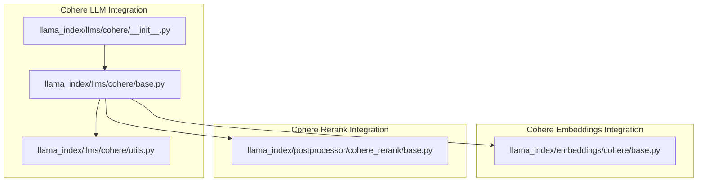
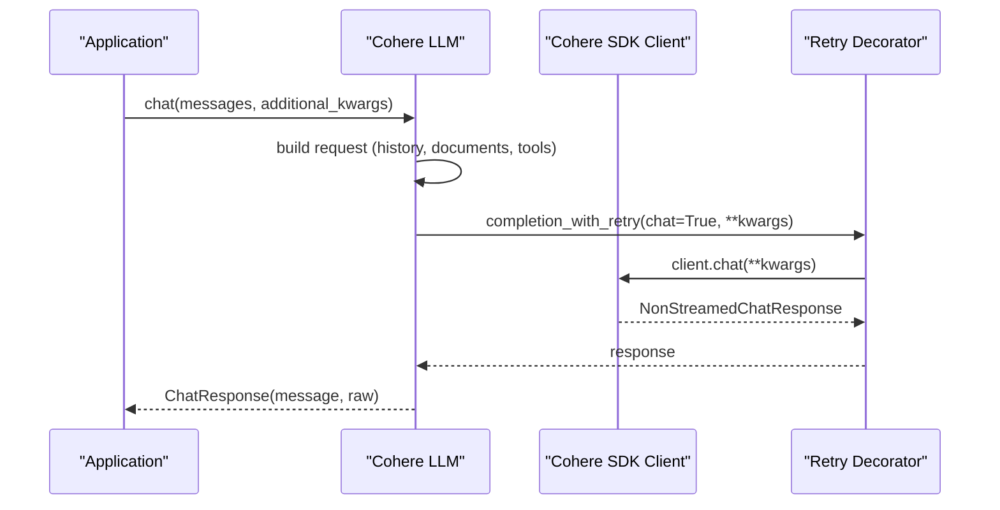
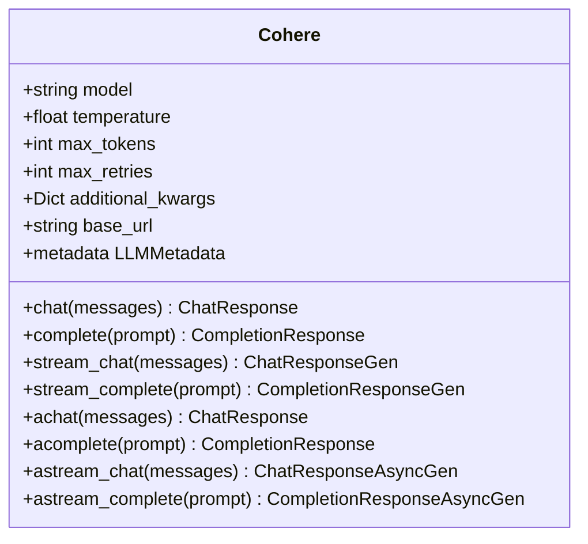
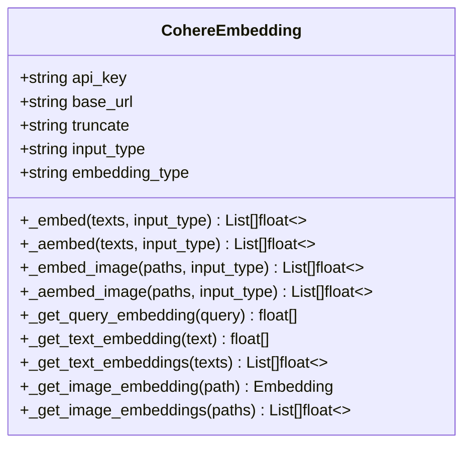
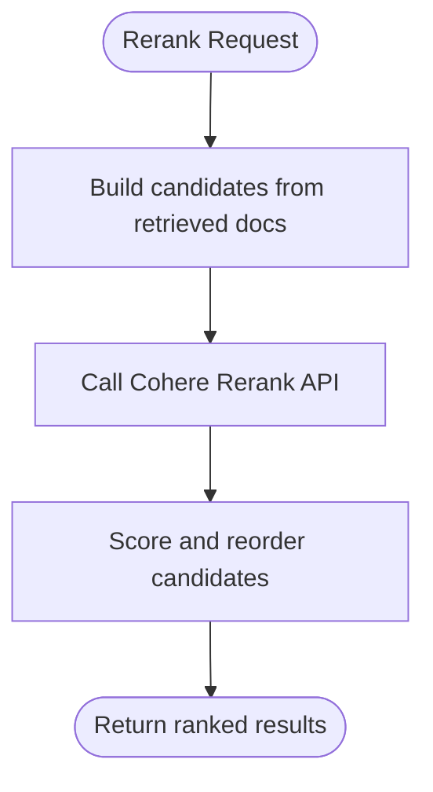
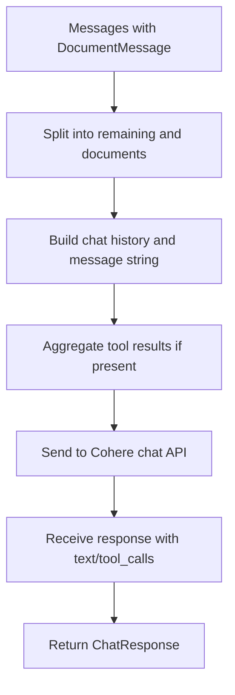
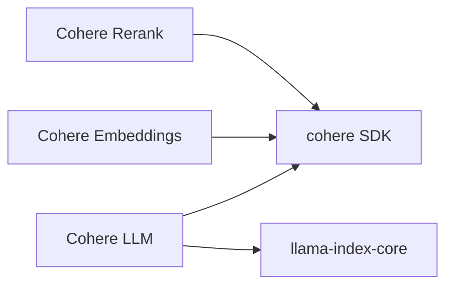

# Cohere Provider

<cite>
**Referenced Files in This Document**
- [README.md](file://llama-index-integrations/llms/llama-index-llms-cohere/README.md)
- [pyproject.toml](file://llama-index-integrations/llms/llama-index-llms-cohere/pyproject.toml)
- [__init__.py](file://llama-index-integrations/llms/llama-index-llms-cohere/llama_index/llms/cohere/__init__.py)
- [base.py](file://llama-index-integrations/llms/llama-index-llms-cohere/llama_index/llms/cohere/base.py)
- [utils.py](file://llama-index-integrations/llms/llama-index-llms-cohere/llama_index/llms/cohere/utils.py)
- [base.py](file://llama-index-integrations/embeddings/llama-index-embeddings-cohere/llama_index/embeddings/cohere/base.py)
- [README.md](file://llama-index-integrations/embeddings/llama-index-embeddings-cohere/README.md)
- [pyproject.toml](file://llama-index-integrations/embeddings/llama-index-embeddings-cohere/pyproject.toml)
- [base.py](file://llama-index-integrations/postprocessor/llama-index-postprocessor-cohere-rerank/llama_index/postprocessor/cohere_rerank/base.py)
- [README.md](file://llama-index-integrations/postprocessor/llama-index-postprocessor-cohere-rerank/README.md)
- [pyproject.toml](file://llama-index-integrations/postprocessor/llama-index-postprocessor-cohere-rerank/pyproject.toml)
- [cohere_reranker.py](file://llama-index-finetuning/llama_index/finetuning/rerankers/cohere_reranker.py)
- [cohere.md](file://docs/api_reference/api_reference/llms/cohere.md)
- [cohere.md](file://docs/api_reference/api_reference/embeddings/cohere.md)
- [cohere_rerank.md](file://docs/api_reference/api_reference/postprocessor/cohere_rerank.md)
- [cohere.ipynb](file://docs/examples/llm/cohere.ipynb)
- [cohereai.ipynb](file://docs/examples/embeddings/cohereai.ipynb)
- [cohere_multi_modal.ipynb](file://docs/examples/multi_modal/cohere_multi_modal.ipynb)
- [cohere_citation_chat.md](file://docs/api_reference/api_reference/packs/cohere_citation_chat.md)
- [cohere_custom_reranker.ipynb](file://docs/examples/finetuning/rerankers/cohere_custom_reranker.ipynb)
</cite>

## Table of Contents
1. [Introduction](#introduction)
2. [Project Structure](#project-structure)
3. [Core Components](#core-components)
4. [Architecture Overview](#architecture-overview)
5. [Detailed Component Analysis](#detailed-component-analysis)
6. [Dependency Analysis](#dependency-analysis)
7. [Performance Considerations](#performance-considerations)
8. [Troubleshooting Guide](#troubleshooting-guide)
9. [Conclusion](#conclusion)
10. [Appendices](#appendices)

## Introduction
This document provides comprehensive documentation for integrating Cohere as an LLM provider within the LlamaIndex ecosystem. It covers API key authentication, model selection for Command and Command R+ variants, and specialized features such as Rerank and Embed. It explains Cohere-specific capabilities including grounding via the documents argument, chat mode, and conversation context management. Advanced features documented include function/tool calling, grounding with documents, and stop sequences. Practical examples are provided for text generation, classification tasks, and retrieval-augmented generation (RAG) workflows. Finally, it outlines performance optimization, rate limiting, and cost management strategies aligned with Cohere’s pricing model.

## Project Structure
The Cohere integration spans three primary areas:
- LLM provider: chat and completion APIs, streaming, async support, function/tool calling, and grounding
- Embeddings: text and image embeddings with model and input-type validation
- Postprocessors: reranking with Cohere’s rerank API

**Diagram sources**
- [__init__.py](file://llama-index-integrations/llms/llama-index-llms-cohere/llama_index/llms/cohere/__init__.py#L1-L20)
- [base.py](file://llama-index-integrations/llms/llama-index-llms-cohere/llama_index/llms/cohere/base.py#L44-L561)
- [utils.py](file://llama-index-integrations/llms/llama-index-llms-cohere/llama_index/llms/cohere/utils.py#L1-L557)
- [base.py](file://llama-index-integrations/embeddings/llama-index-embeddings-cohere/llama_index/embeddings/cohere/base.py#L125-L431)
- [base.py](file://llama-index-integrations/postprocessor/llama-index-postprocessor-cohere-rerank/llama_index/postprocessor/cohere_rerank/base.py)

**Section sources**
- [README.md](file://llama-index-integrations/llms/llama-index-llms-cohere/README.md#L1-L164)
- [pyproject.toml](file://llama-index-integrations/llms/llama-index-llms-cohere/pyproject.toml#L27-L38)

## Core Components
- Cohere LLM: Implements chat, completion, streaming, async, function/tool calling, and grounding via documents
- Cohere Embeddings: Supports text and image embeddings with model/input-type validation and batching
- Cohere Rerank: Provides reranking of candidate documents for retrieval pipelines

Key capabilities:
- Authentication via API key and optional custom base URL
- Model selection for Command and Command R+ variants with context window metadata
- Grounding via DocumentMessage and dedicated prompt templates
- Function/tool calling for tool-use workflows
- Stop sequences and custom parameters passed through additional_kwargs
- Async/streaming variants for improved responsiveness

**Section sources**
- [base.py](file://llama-index-integrations/llms/llama-index-llms-cohere/llama_index/llms/cohere/base.py#L44-L561)
- [utils.py](file://llama-index-integrations/llms/llama-index-llms-cohere/llama_index/llms/cohere/utils.py#L38-L82)
- [base.py](file://llama-index-integrations/embeddings/llama-index-embeddings-cohere/llama_index/embeddings/cohere/base.py#L125-L431)
- [base.py](file://llama-index-integrations/postprocessor/llama-index-postprocessor-cohere-rerank/llama_index/postprocessor/cohere_rerank/base.py)

## Architecture Overview
The Cohere provider integrates with LlamaIndex through a thin wrapper around the official Cohere SDK. The LLM component translates LlamaIndex message formats to Cohere’s chat API, supports streaming and async, and exposes function/tool calling. Embeddings and rerank components integrate with Cohere’s V2 APIs for embeddings and reranking respectively.

**Diagram sources**
- [base.py](file://llama-index-integrations/llms/llama-index-llms-cohere/llama_index/llms/cohere/base.py#L310-L345)
- [utils.py](file://llama-index-integrations/llms/llama-index-llms-cohere/llama_index/llms/cohere/utils.py#L214-L234)

## Detailed Component Analysis

### Cohere LLM
- Authentication and initialization: supports api_key and optional base_url; creates synchronous and asynchronous clients
- Model selection: defaults to a modern Command R variant; metadata exposes context window and function-call capability
- Chat and completion: supports streaming and async variants; warns on misuse of stream parameter
- Function/tool calling: converts BaseTool to Cohere tool specs; extracts tool_calls from responses
- Grounding: removes DocumentMessage entries from conversation history and passes documents via the documents argument
- Additional parameters: forwards additional_kwargs to underlying SDK calls

**Diagram sources**
- [base.py](file://llama-index-integrations/llms/llama-index-llms-cohere/llama_index/llms/cohere/base.py#L44-L561)

**Section sources**
- [base.py](file://llama-index-integrations/llms/llama-index-llms-cohere/llama_index/llms/cohere/base.py#L78-L118)
- [base.py](file://llama-index-integrations/llms/llama-index-llms-cohere/llama_index/llms/cohere/base.py#L125-L134)
- [base.py](file://llama-index-integrations/llms/llama-index-llms-cohere/llama_index/llms/cohere/base.py#L310-L345)
- [base.py](file://llama-index-integrations/llms/llama-index-llms-cohere/llama_index/llms/cohere/base.py#L347-L369)
- [base.py](file://llama-index-integrations/llms/llama-index-llms-cohere/llama_index/llms/cohere/base.py#L371-L401)
- [base.py](file://llama-index-integrations/llms/llama-index-llms-cohere/llama_index/llms/cohere/base.py#L403-L427)
- [base.py](file://llama-index-integrations/llms/llama-index-llms-cohere/llama_index/llms/cohere/base.py#L429-L478)
- [base.py](file://llama-index-integrations/llms/llama-index-llms-cohere/llama_index/llms/cohere/base.py#L480-L502)
- [base.py](file://llama-index-integrations/llms/llama-index-llms-cohere/llama_index/llms/cohere/base.py#L504-L534)
- [base.py](file://llama-index-integrations/llms/llama-index-llms-cohere/llama_index/llms/cohere/base.py#L536-L560)

### Cohere Embeddings
- Model and input-type validation: enforces supported models and input types; validates embedding types and truncation options
- Batch embedding: supports batch sizes up to 96; exposes sync and async embedding methods
- Multimodal embeddings: supports image embeddings for applicable models; converts images to base64 data URLs
- Truncation and embedding types: configurable truncate and embedding_type fields

**Diagram sources**
- [base.py](file://llama-index-integrations/embeddings/llama-index-embeddings-cohere/llama_index/embeddings/cohere/base.py#L125-L431)

**Section sources**
- [base.py](file://llama-index-integrations/embeddings/llama-index-embeddings-cohere/llama_index/embeddings/cohere/base.py#L148-L222)
- [base.py](file://llama-index-integrations/embeddings/llama-index-embeddings-cohere/llama_index/embeddings/cohere/base.py#L278-L300)
- [base.py](file://llama-index-integrations/embeddings/llama-index-embeddings-cohere/llama_index/embeddings/cohere/base.py#L301-L324)
- [base.py](file://llama-index-integrations/embeddings/llama-index-embeddings-cohere/llama_index/embeddings/cohere/base.py#L326-L353)
- [base.py](file://llama-index-integrations/embeddings/llama-index-embeddings-cohere/llama_index/embeddings/cohere/base.py#L355-L386)
- [base.py](file://llama-index-integrations/embeddings/llama-index-embeddings-cohere/llama_index/embeddings/cohere/base.py#L388-L410)
- [base.py](file://llama-index-integrations/embeddings/llama-index-embeddings-cohere/llama_index/embeddings/cohere/base.py#L412-L430)

### Cohere Rerank
- Reranks candidate documents for retrieval pipelines
- Integrates with LlamaIndex postprocessors and finetuning workflows

**Diagram sources**
- [base.py](file://llama-index-integrations/postprocessor/llama-index-postprocessor-cohere-rerank/llama_index/postprocessor/cohere_rerank/base.py)

**Section sources**
- [base.py](file://llama-index-integrations/postprocessor/llama-index-postprocessor-cohere-rerank/llama_index/postprocessor/cohere_rerank/base.py)
- [cohere_reranker.py](file://llama-index-finetuning/llama_index/finetuning/rerankers/cohere_reranker.py)

### Cohere-Specific Capabilities and Workflows

#### API Key Authentication
- Configure via constructor parameters; supports optional custom base_url for enterprise or proxy setups
- Async and sync clients are created with the same credentials

**Section sources**
- [base.py](file://llama-index-integrations/llms/llama-index-llms-cohere/llama_index/llms/cohere/base.py#L113-L118)
- [base.py](file://llama-index-integrations/embeddings/llama-index-embeddings-cohere/llama_index/embeddings/cohere/base.py#L223-L245)
- [README.md](file://llama-index-integrations/llms/llama-index-llms-cohere/README.md#L149-L163)

#### Model Selection for Command and Command R+
- Default model is a modern Command R variant; metadata exposes context window and function-call capability
- Known Command models include variants such as command-r, command-r-plus, and others; generation and representation models are also recognized

**Section sources**
- [base.py](file://llama-index-integrations/llms/llama-index-llms-cohere/llama_index/llms/cohere/base.py#L80-L81)
- [base.py](file://llama-index-integrations/llms/llama-index-llms-cohere/llama_index/llms/cohere/base.py#L127-L133)
- [utils.py](file://llama-index-integrations/llms/llama-index-llms-cohere/llama_index/llms/cohere/utils.py#L38-L82)

#### Grounding, Chat Mode, and Conversation Context Management
- Grounding: DocumentMessage is used to pass retrieved documents to the documents argument; messages are split into chat history and documents
- Chat mode: Dedicated prompt templates for QA, refine, tree summarize, and table context refine leverage DocumentMessage
- Context management: Chat history is constructed from prior messages; tool results are aggregated for multi-turn tool use

**Diagram sources**
- [utils.py](file://llama-index-integrations/llms/llama-index-llms-cohere/llama_index/llms/cohere/utils.py#L278-L310)
- [utils.py](file://llama-index-integrations/llams/llma-index-llms-cohere/llama_index/llms/cohere/utils.py#L313-L320)
- [utils.py](file://llama-index-integrations/llms/llama-index-llms-cohere/llama_index/llms/cohere/utils.py#L323-L352)
- [base.py](file://llama-index-integrations/llms/llama-index-llms-cohere/llama_index/llms/cohere/base.py#L210-L308)

**Section sources**
- [utils.py](file://llama-index-integrations/llms/llama-index-llms-cohere/llama_index/llms/cohere/utils.py#L115-L189)
- [utils.py](file://llama-index-integrations/llms/llama-index-llms-cohere/llama_index/llms/cohere/utils.py#L278-L310)
- [utils.py](file://llama-index-integrations/llms/llama-index-llms-cohere/llama_index/llms/cohere/utils.py#L323-L352)
- [base.py](file://llama-index-integrations/llms/llama-index-llms-cohere/llama_index/llms/cohere/base.py#L210-L308)

#### Function/Tool Calling
- Tools are converted to Cohere tool specs; tool results are attached per chat turn
- Predicted tool calls are extracted from responses and mapped to ToolSelection

**Section sources**
- [utils.py](file://llama-index-integrations/llms/llama-index-llms-cohere/llama_index/llms/cohere/utils.py#L407-L441)
- [utils.py](file://llama-index-integrations/llms/llama-index-llms-cohere/llama_index/llms/cohere/utils.py#L467-L494)
- [base.py](file://llama-index-integrations/llms/llama-index-llms-cohere/llama_index/llms/cohere/base.py#L181-L208)

#### Advanced Features
- Stop sequences: passed via stop_sequences parameter
- Custom parameters: forwarded through additional_kwargs
- Toxicity filtering, relevance scoring, and custom stop sequences are supported by passing parameters via additional_kwargs

**Section sources**
- [base.py](file://llama-index-integrations/llms/llama-index-llms-cohere/llama_index/llms/cohere/base.py#L215-L216)
- [base.py](file://llama-index-integrations/llms/llama-index-llms-cohere/llama_index/llms/cohere/base.py#L147-L151)

#### Examples and Workflows
- Text generation: basic completion and chat usage
- Classification tasks: embeddings with input_type classification
- Retrieval-augmented generation: DocumentMessage-based grounding and dedicated prompt templates

**Section sources**
- [README.md](file://llama-index-integrations/llms/llama-index-llms-cohere/README.md#L11-L127)
- [cohere.ipynb](file://docs/examples/llm/cohere.ipynb)
- [cohereai.ipynb](file://docs/examples/embeddings/cohereai.ipynb)
- [cohere_multi_modal.ipynb](file://docs/examples/multi_modal/cohere_multi_modal.ipynb)
- [cohere_citation_chat.md](file://docs/api_reference/api_reference/packs/cohere_citation_chat.md)

## Dependency Analysis
- Cohere LLM depends on the official Cohere SDK and LlamaIndex core abstractions
- Embeddings and rerank depend on Cohere SDK V2 APIs
- Version constraints and compatibility are declared in pyproject.toml

**Diagram sources**
- [pyproject.toml](file://llama-index-integrations/llms/llama-index-llms-cohere/pyproject.toml#L35-L37)
- [pyproject.toml](file://llama-index-integrations/embeddings/llama-index-embeddings-cohere/pyproject.toml)
- [pyproject.toml](file://llama-index-integrations/postprocessor/llama-index-postprocessor-cohere-rerank/pyproject.toml)

**Section sources**
- [pyproject.toml](file://llama-index-integrations/llms/llama-index-llms-cohere/pyproject.toml#L35-L37)
- [pyproject.toml](file://llama-index-integrations/embeddings/llama-index-embeddings-cohere/pyproject.toml)
- [pyproject.toml](file://llama-index-integrations/postprocessor/llama-index-postprocessor-cohere-rerank/pyproject.toml)

## Performance Considerations
- Streaming and async APIs reduce latency and improve throughput for long generations
- Retry decorator with exponential backoff handles transient errors gracefully
- Embedding batching (up to 96) reduces API overhead; tune embed_batch_size accordingly
- Function/tool calling minimizes round trips by combining tool execution with model reasoning

[No sources needed since this section provides general guidance]

## Troubleshooting Guide
Common issues and resolutions:
- Unknown model name: ensure model is in the supported list; metadata raises explicit errors for invalid models
- Documents provided both as additional kwargs and as DocumentMessage: the integration prevents mixing; use one approach consistently
- Stream parameter misuse: streaming requires stream_chat or stream_complete; regular chat warns and ignores stream
- Rate limiting and service unavailability: retry decorator automatically retries with exponential backoff

**Section sources**
- [utils.py](file://llama-index-integrations/llms/llama-index-llms-cohere/llama_index/llms/cohere/utils.py#L263-L271)
- [base.py](file://llama-index-integrations/llms/llama-index-llms-cohere/llama_index/llms/cohere/base.py#L232-L236)
- [base.py](file://llama-index-integrations/llms/llama-index-llms-cohere/llama_index/llms/cohere/base.py#L319-L323)
- [utils.py](file://llama-index-integrations/llms/llama-index-llms-cohere/llama_index/llms/cohere/utils.py#L192-L211)

## Conclusion
The Cohere integration provides a robust, production-ready interface for LlamaIndex with strong support for grounding, function/tool calling, streaming, and async operations. The embeddings and rerank components complement the LLM with validated model and input-type constraints, enabling reliable RAG and classification workflows. Proper configuration of API keys, model selection, and batching yields optimal performance and cost efficiency aligned with Cohere’s pricing model.

[No sources needed since this section summarizes without analyzing specific files]

## Appendices

### API Reference Highlights
- LLM: chat, complete, stream_chat, stream_complete, achat, acomplete, astream_chat, astream_complete
- Embeddings: text/image embedding methods with input_type and embedding_type controls
- Rerank: reranking pipeline integration

**Section sources**
- [cohere.md](file://docs/api_reference/api_reference/llms/cohere.md)
- [cohere.md](file://docs/api_reference/api_reference/embeddings/cohere.md)
- [cohere_rerank.md](file://docs/api_reference/api_reference/postprocessor/cohere_rerank.md)