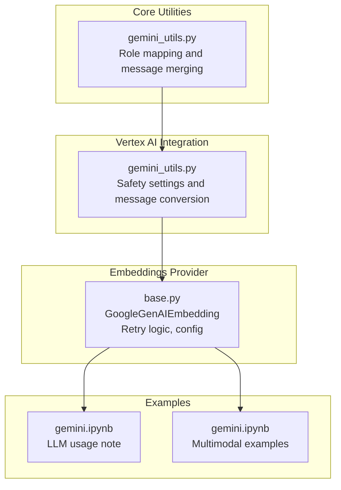
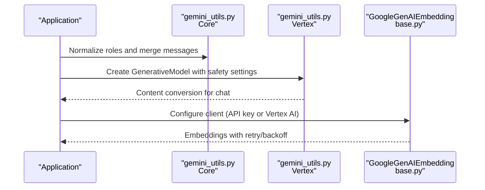
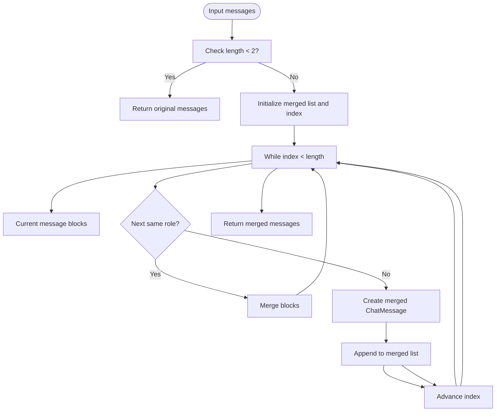
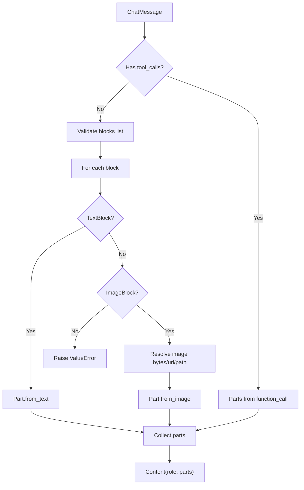
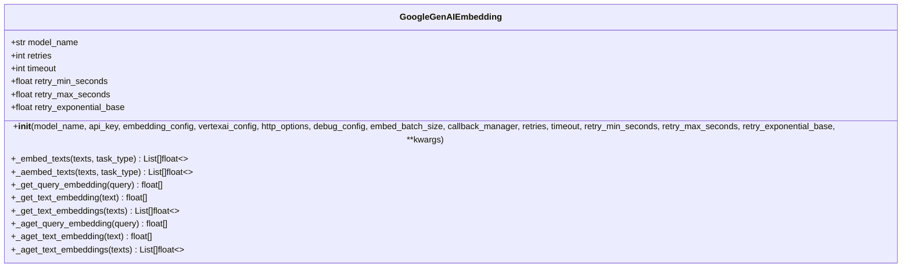
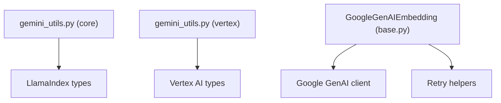

# Google Gemini

<cite>
**Referenced Files in This Document**
- [gemini_utils.py](file://llama-index-core/llama_index/core/utilities/gemini_utils.py)
- [gemini_utils.py](file://llama-index-integrations/llms/llama-index-llms-vertex/llama_index/llms/vertex/gemini_utils.py)
- [base.py](file://llama-index-integrations/embeddings/llama-index-embeddings-google-genai/llama_index/embeddings/google_genai/base.py)
- [gemini.ipynb](file://docs/examples/llm/gemini.ipynb)
- [gemini.ipynb](file://docs/examples/multi_modal/gemini.ipynb)
</cite>

## Table of Contents
1. [Introduction](#introduction)
2. [Project Structure](#project-structure)
3. [Core Components](#core-components)
4. [Architecture Overview](#architecture-overview)
5. [Detailed Component Analysis](#detailed-component-analysis)
6. [Dependency Analysis](#dependency-analysis)
7. [Performance Considerations](#performance-considerations)
8. [Troubleshooting Guide](#troubleshooting-guide)
9. [Conclusion](#conclusion)
10. [Appendices](#appendices)

## Introduction
This document explains how to integrate Google Gemini with the LlamaIndex ecosystem. It covers authentication using Google Cloud credentials, project setup, and API key configuration. It also documents model selection across Gemini Pro, Gemini Pro Vision, and multimodal variants, advanced features such as grounding, safety settings, and content filtering. Practical examples include multimodal inputs (text, image, video), function/tool calling, and streaming responses. Finally, it addresses Google Cloud-specific considerations including billing, quotas, regional endpoints, integration with Google Cloud services, and security best practices.

## Project Structure
The Gemini integration spans multiple packages:
- Core utilities for role mapping and message merging for Gemini chat compatibility.
- Vertex AI utilities for converting chat messages to Gemini Content and managing safety settings.
- Embeddings provider for Google GenAI embeddings with retry logic and configuration for API key or Vertex AI.
- Example notebooks demonstrating LLM usage and multimodal capabilities.

**Diagram sources**
- [gemini_utils.py](file://llama-index-core/llama_index/core/utilities/gemini_utils.py#L1-L66)
- [gemini_utils.py](file://llama-index-integrations/llms/llama-index-llms-vertex/llama_index/llms/vertex/gemini_utils.py#L1-L70)
- [base.py](file://llama-index-integrations/embeddings/llama-index-embeddings-google-genai/llama_index/embeddings/google_genai/base.py#L1-L337)
- [gemini.ipynb](file://docs/examples/llm/gemini.ipynb#L1-L51)
- [gemini.ipynb](file://docs/examples/multi_modal/gemini.ipynb#L1-L137)

**Section sources**
- [gemini_utils.py](file://llama-index-core/llama_index/core/utilities/gemini_utils.py#L1-L66)
- [gemini_utils.py](file://llama-index-integrations/llms/llama-index-llms-vertex/llama_index/llms/vertex/gemini_utils.py#L1-L70)
- [base.py](file://llama-index-integrations/embeddings/llama-index-embeddings-google-genai/llama_index/embeddings/google_genai/base.py#L1-L337)
- [gemini.ipynb](file://docs/examples/llm/gemini.ipynb#L1-L51)
- [gemini.ipynb](file://docs/examples/multi_modal/gemini.ipynb#L1-L137)

## Core Components
- Role mapping and message merging for Gemini chat compatibility ensures proper handling of message sequences and role normalization.
- Vertex AI utilities provide conversion of chat messages to Gemini Content and manage safety settings.
- Google GenAI embeddings support API key or Vertex AI configuration, with retry logic and configurable timeouts.

**Section sources**
- [gemini_utils.py](file://llama-index-core/llama_index/core/utilities/gemini_utils.py#L1-L66)
- [gemini_utils.py](file://llama-index-integrations/llms/llama-index-llms-vertex/llama_index/llms/vertex/gemini_utils.py#L1-L70)
- [base.py](file://llama-index-integrations/embeddings/llama-index-embeddings-google-genai/llama_index/embeddings/google_genai/base.py#L1-L337)

## Architecture Overview
The integration leverages:
- Role normalization and message merging for chat compatibility.
- Vertex AI GenerativeModel creation with safety settings.
- Embeddings client configured for API key or Vertex AI with retry policies.

**Diagram sources**
- [gemini_utils.py](file://llama-index-core/llama_index/core/utilities/gemini_utils.py#L1-L66)
- [gemini_utils.py](file://llama-index-integrations/llms/llama-index-llms-vertex/llama_index/llms/vertex/gemini_utils.py#L1-L70)
- [base.py](file://llama-index-integrations/embeddings/llama-index-embeddings-google-genai/llama_index/embeddings/google_genai/base.py#L1-L337)

## Detailed Component Analysis

### Role Mapping and Message Merging (Core Utilities)
Gemini chat supports only user and model roles. This utility:
- Normalizes roles to Gemini-compatible values.
- Merges adjacent messages of the same role to satisfy Gemini’s constraint.

**Diagram sources**
- [gemini_utils.py](file://llama-index-core/llama_index/core/utilities/gemini_utils.py#L29-L66)

**Section sources**
- [gemini_utils.py](file://llama-index-core/llama_index/core/utilities/gemini_utils.py#L1-L66)

### Vertex AI Safety Settings and Message Conversion
Vertex AI utilities:
- Detect Gemini models by model name prefix.
- Create a GenerativeModel with safety settings.
- Convert ChatMessage blocks to Gemini Content, supporting text and image parts, and function/tool calls.

**Diagram sources**
- [gemini_utils.py](file://llama-index-integrations/llms/llama-index-llms-vertex/llama_index/llms/vertex/gemini_utils.py#L19-L70)

**Section sources**
- [gemini_utils.py](file://llama-index-integrations/llms/llama-index-llms-vertex/llama_index/llms/vertex/gemini_utils.py#L1-L70)

### Google GenAI Embeddings (Provider)
The embeddings provider supports:
- Model selection (e.g., text-embedding-004/005).
- Authentication via API key or Vertex AI configuration.
- Retry logic with exponential backoff and configurable timeouts.
- Task-type-aware embeddings for retrieval queries/documents.

**Diagram sources**
- [base.py](file://llama-index-integrations/embeddings/llama-index-embeddings-google-genai/llama_index/embeddings/google_genai/base.py#L119-L337)

**Section sources**
- [base.py](file://llama-index-integrations/embeddings/llama-index-embeddings-google-genai/llama_index/embeddings/google_genai/base.py#L1-L337)

## Dependency Analysis
- Core utilities depend on LlamaIndex chat message types and role enums.
- Vertex utilities depend on Vertex AI generative models and safety settings types.
- Embeddings provider depends on the Google GenAI client and retry helpers.

**Diagram sources**
- [gemini_utils.py](file://llama-index-core/llama_index/core/utilities/gemini_utils.py#L1-L66)
- [gemini_utils.py](file://llama-index-integrations/llms/llama-index-llms-vertex/llama_index/llms/vertex/gemini_utils.py#L1-L70)
- [base.py](file://llama-index-integrations/embeddings/llama-index-embeddings-google-genai/llama_index/embeddings/google_genai/base.py#L1-L337)

**Section sources**
- [gemini_utils.py](file://llama-index-core/llama_index/core/utilities/gemini_utils.py#L1-L66)
- [gemini_utils.py](file://llama-index-integrations/llms/llama-index-llms-vertex/llama_index/llms/vertex/gemini_utils.py#L1-L70)
- [base.py](file://llama-index-integrations/embeddings/llama-index-embeddings-google-genai/llama_index/embeddings/google_genai/base.py#L1-L337)

## Performance Considerations
- Embeddings batching: Adjust embed_batch_size to balance throughput and latency.
- Retry/backoff: Tune retries and exponential base to handle transient errors efficiently.
- Streaming responses: Prefer streaming APIs for long-running generations to reduce perceived latency.
- Regional endpoints: Select endpoints closest to your deployment region to minimize network latency.

## Troubleshooting Guide
Common issues and resolutions:
- Authentication failures: Ensure GOOGLE_API_KEY is set or configure Vertex AI credentials and project/location.
- Role mismatches: Use the role mapping utility to normalize roles and merge adjacent messages.
- Safety filter blocks: Review and adjust safety settings for content filtering.
- Quota/billing errors: Monitor quotas and enable billing for the selected region.

**Section sources**
- [base.py](file://llama-index-integrations/embeddings/llama-index-embeddings-google-genai/llama_index/embeddings/google_genai/base.py#L198-L244)
- [gemini_utils.py](file://llama-index-integrations/llms/llama-index-llms-vertex/llama_index/llms/vertex/gemini_utils.py#L11-L16)
- [gemini_utils.py](file://llama-index-core/llama_index/core/utilities/gemini_utils.py#L9-L26)

## Conclusion
The Gemini integration in LlamaIndex combines core utilities for role normalization, Vertex AI safety and content conversion, and a robust embeddings provider with retry logic and flexible authentication. By configuring credentials appropriately, selecting suitable models, and leveraging advanced features like safety settings and multimodal inputs, you can build secure, scalable applications on Google Cloud infrastructure.

## Appendices

### Authentication and Setup
- API key: Set GOOGLE_API_KEY or pass api_key to the embeddings client.
- Vertex AI: Provide vertexai_config with project and location, or set environment variables for automatic detection.
- Environment variables: GOOGLE_API_KEY, GOOGLE_CLOUD_PROJECT, GOOGLE_CLOUD_LOCATION.

**Section sources**
- [base.py](file://llama-index-integrations/embeddings/llama-index-embeddings-google-genai/llama_index/embeddings/google_genai/base.py#L198-L244)

### Model Selection
- General-purpose: gemini-pro
- Multimodal: gemini-pro-vision and related variants
- Function/tool calling: Supported via message conversion and safety settings

**Section sources**
- [gemini_utils.py](file://llama-index-integrations/llms/llama-index-llms-vertex/llama_index/llms/vertex/gemini_utils.py#L7-L8)
- [gemini.ipynb](file://docs/examples/multi_modal/gemini.ipynb#L1-L137)

### Advanced Features
- Safety settings: Configure safety settings during model creation.
- Content filtering: Adjust safety settings to control content filtering behavior.
- Grounding: Use retrieval augmentation to ground responses in external knowledge.

**Section sources**
- [gemini_utils.py](file://llama-index-integrations/llms/llama-index-llms-vertex/llama_index/llms/vertex/gemini_utils.py#L11-L16)

### Multimodal Inputs and Streaming
- Multimodal: Combine text and image blocks; function/tool calls supported.
- Streaming: Use streaming APIs for incremental generation feedback.

**Section sources**
- [gemini.ipynb](file://docs/examples/multi_modal/gemini.ipynb#L1-L137)

### Google Cloud Considerations
- Billing: Enable billing for the selected region.
- Quotas: Monitor and increase quotas as needed.
- Regional endpoints: Choose endpoints aligned with your deployment region.
- Security best practices: Store credentials securely, limit permissions, and audit usage.

**Section sources**
- [base.py](file://llama-index-integrations/embeddings/llama-index-embeddings-google-genai/llama_index/embeddings/google_genai/base.py#L198-L244)