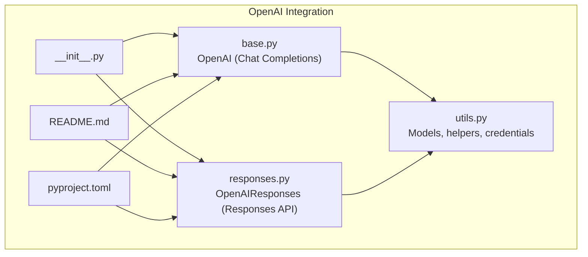
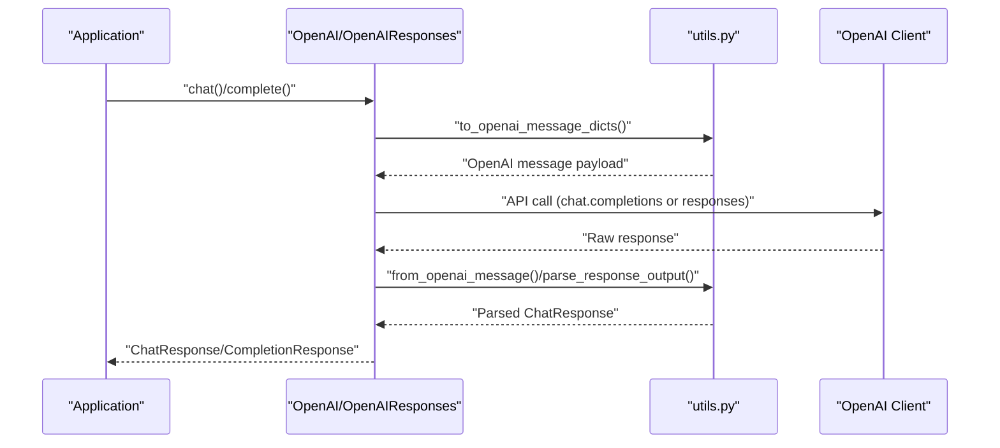
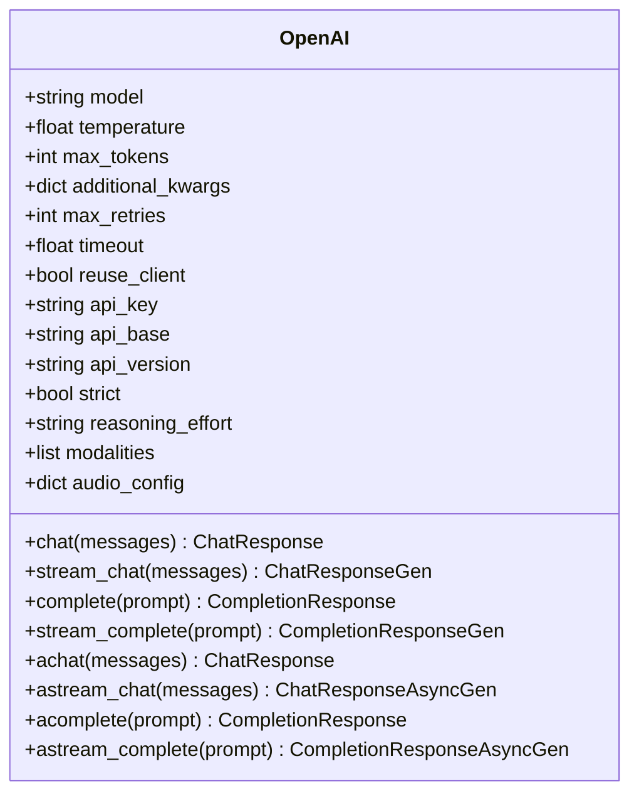
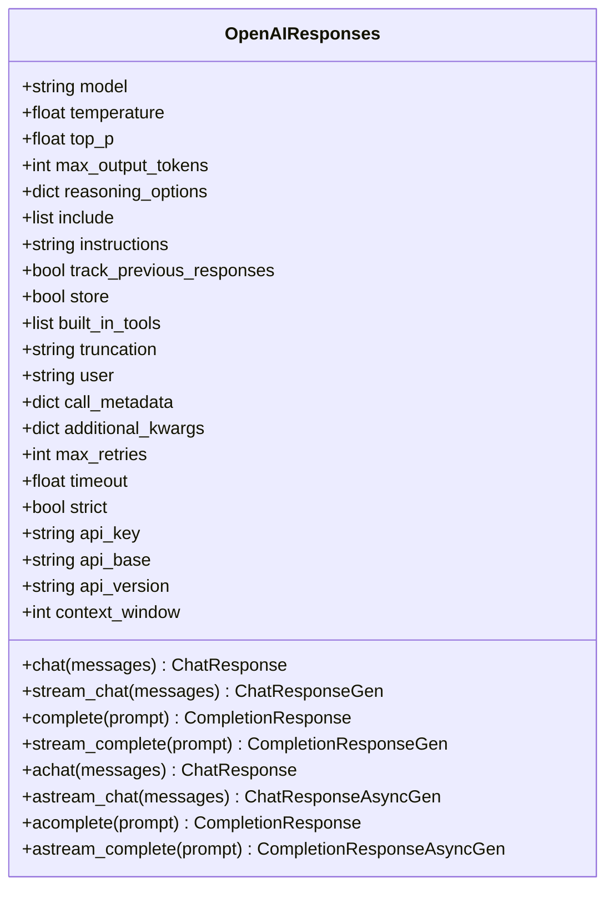
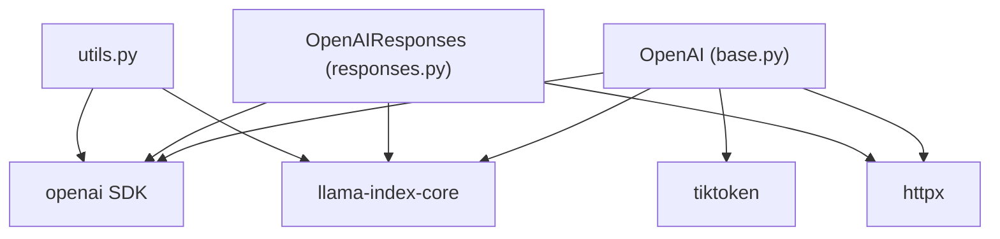

# OpenAI Provider

<cite>
**Referenced Files in This Document**
- [base.py](file://llama-index-integrations/llms/llama-index-llms-openai/llama_index/llms/openai/base.py)
- [responses.py](file://llama-index-integrations/llms/llama-index-llms-openai/llama_index/llms/openai/responses.py)
- [utils.py](file://llama-index-integrations/llms/llama-index-llms-openai/llama_index/llms/openai/utils.py)
- [__init__.py](file://llama-index-integrations/llms/llama-index-llms-openai/llama_index/llms/openai/__init__.py)
- [README.md](file://llama-index-integrations/llms/llama-index-llms-openai/README.md)
- [pyproject.toml](file://llama-index-integrations/llms/llama-index-llms-openai/pyproject.toml)
- [openai.ipynb](file://docs/examples/llm/openai.ipynb)
</cite>

## Table of Contents
1. [Introduction](#introduction)
2. [Project Structure](#project-structure)
3. [Core Components](#core-components)
4. [Architecture Overview](#architecture-overview)
5. [Detailed Component Analysis](#detailed-component-analysis)
6. [Dependency Analysis](#dependency-analysis)
7. [Performance Considerations](#performance-considerations)
8. [Troubleshooting Guide](#troubleshooting-guide)
9. [Conclusion](#conclusion)
10. [Appendices](#appendices)

## Introduction
This document provides comprehensive documentation for the OpenAI LLM provider integration in the LlamaIndex ecosystem. It covers authentication setup via API keys, model configuration for GPT-3.5, GPT-4, and GPT-4o variants, function calling capabilities with tools, structured output parsing, streaming response handling, and cost optimization strategies. It also addresses rate limiting, error handling, fallback mechanisms, regional availability, and data residency considerations.

## Project Structure
The OpenAI provider is implemented as a dedicated integration package that exposes two primary LLM classes:
- OpenAI: Chat Completions API-based LLM supporting chat, completions, streaming, and function/tool calling.
- OpenAIResponses: Responses API-based LLM supporting advanced multimodal outputs, built-in tools, and reasoning options.

Key implementation files:
- LLM classes: base.py, responses.py
- Utilities and model metadata: utils.py
- Package exports and installation: __init__.py, README.md, pyproject.toml
- Usage examples: openai.ipynb

**Diagram sources**
- [__init__.py](file://llama-index-integrations/llms/llama-index-llms-openai/llama_index/llms/openai/__init__.py#L1-L5)
- [base.py](file://llama-index-integrations/llms/llama-index-llms-openai/llama_index/llms/openai/base.py#L1-L1242)
- [responses.py](file://llama-index-integrations/llms/llama-index-llms-openai/llama_index/llms/openai/responses.py#L1-L1037)
- [utils.py](file://llama-index-integrations/llms/llama-index-llms-openai/llama_index/llms/openai/utils.py#L1-L997)
- [README.md](file://llama-index-integrations/llms/llama-index-llms-openai/README.md#L1-L132)
- [pyproject.toml](file://llama-index-integrations/llms/llama-index-llms-openai/pyproject.toml#L1-L67)

**Section sources**
- [__init__.py](file://llama-index-integrations/llms/llama-index-llms-openai/llama_index/llms/openai/__init__.py#L1-L5)
- [README.md](file://llama-index-integrations/llms/llama-index-llms-openai/README.md#L1-L132)
- [pyproject.toml](file://llama-index-integrations/llms/llama-index-llms-openai/pyproject.toml#L1-L67)

## Core Components
- OpenAI (Chat Completions): Supports chat and completion modes, streaming, function/tool calling, audio/text modalities, and token usage reporting.
- OpenAIResponses (Responses API): Supports multimodal outputs, built-in tools, reasoning options, and stateful response tracking.

Key capabilities:
- Authentication via environment variables or constructor parameters
- Model selection and configuration (temperature, max_tokens, reasoning options)
- Structured output parsing and tool call extraction
- Streaming responses for both text and multimodal content
- Retry and exponential backoff for robustness
- Token counting and cost estimation hooks

**Section sources**
- [base.py](file://llama-index-integrations/llms/llama-index-llms-openai/llama_index/llms/openai/base.py#L139-L796)
- [responses.py](file://llama-index-integrations/llms/llama-index-llms-openai/llama_index/llms/openai/responses.py#L147-L800)
- [utils.py](file://llama-index-integrations/llms/llama-index-llms-openai/llama_index/llms/openai/utils.py#L42-L193)

## Architecture Overview
The provider integrates with the OpenAI SDK and LlamaIndex core abstractions. It translates LlamaIndex message blocks and tool calls into OpenAI-compatible payloads and converts OpenAI responses back into LlamaIndex response objects.

**Diagram sources**
- [base.py](file://llama-index-integrations/llms/llama-index-llms-openai/llama_index/llms/openai/base.py#L486-L695)
- [responses.py](file://llama-index-integrations/llms/llama-index-llms-openai/llama_index/llms/openai/responses.py#L532-L560)
- [utils.py](file://llama-index-integrations/llms/llama-index-llms-openai/llama_index/llms/openai/utils.py#L686-L759)

## Detailed Component Analysis

### OpenAI (Chat Completions)
The OpenAI class wraps the OpenAI Chat Completions API, enabling:
- Chat and completion modes
- Streaming for both chat and completion
- Function/tool calling with structured extraction
- Audio/text modalities and token usage reporting
- Model metadata and context window resolution

**Diagram sources**
- [base.py](file://llama-index-integrations/llms/llama-index-llms-openai/llama_index/llms/openai/base.py#L139-L332)

Key implementation highlights:
- Credential resolution and client reuse for stability under heavy async loads
- Automatic context window detection and max_tokens inference for non-chat completions
- Tool call parsing and structured output handling
- Streaming delta handling with content and tool call updates
- Token usage extraction and reporting

**Section sources**
- [base.py](file://llama-index-integrations/llms/llama-index-llms-openai/llama_index/llms/openai/base.py#L139-L796)
- [utils.py](file://llama-index-integrations/llms/llama-index-llms-openai/llama_index/llms/openai/utils.py#L288-L323)

### OpenAIResponses (Responses API)
The OpenAIResponses class targets the OpenAI Responses API, enabling:
- Multimodal outputs (text, images, reasoning)
- Built-in tools and tool call parsing
- Reasoning options and stateful response tracking
- Advanced output parsing and token usage reporting

**Diagram sources**
- [responses.py](file://llama-index-integrations/llms/llama-index-llms-openai/llama_index/llms/openai/responses.py#L147-L343)

Key implementation highlights:
- Responses API-specific message conversion and reasoning block handling
- Built-in tool call extraction and image generation support
- Stateful response tracking via previous_response_id
- Streaming event processing with incremental updates

**Section sources**
- [responses.py](file://llama-index-integrations/llms/llama-index-llms-openai/llama_index/llms/openai/responses.py#L147-L800)
- [utils.py](file://llama-index-integrations/llms/llama-index-llms-openai/llama_index/llms/openai/utils.py#L522-L683)

### Authentication and Setup
- Environment-based API key: OPENAI_API_KEY
- Constructor overrides: api_key, api_base, api_version
- Credential resolution utility ensures proper defaults and validation

Best practices:
- Prefer environment variables for secrets
- Use per-instance api_key for multi-tenant scenarios
- Set api_base for proxy or regional endpoints

**Section sources**
- [README.md](file://llama-index-integrations/llms/llama-index-llms-openai/README.md#L11-L19)
- [utils.py](file://llama-index-integrations/llms/llama-index-llms-openai/llama_index/llms/openai/utils.py#L241-L246)

### Model Configuration and Availability
Supported model families and capabilities:
- GPT-3.5 family: gpt-3.5-turbo, gpt-3.5-turbo-16k, instruct variants
- GPT-4 family: gpt-4, gpt-4-32k, turbo previews, vision variants
- GPT-4o family: gpt-4o, gpt-4o-mini, audio variants
- O1 family: o1, o1-mini, o1-preview, o3, o4-mini, gpt-5 variants
- Context windows and function calling support determined dynamically

Configuration tips:
- Select appropriate model for your use case (speed vs. quality)
- Use gpt-4o or gpt-4o-mini for multimodal tasks
- Use O1 models for reasoning-heavy tasks with reasoning options

**Section sources**
- [utils.py](file://llama-index-integrations/llms/llama-index-llms-openai/llama_index/llms/openai/utils.py#L42-L193)

### Function Calling and Tools
Both classes support function/tool calling:
- Tool call extraction and structured parsing
- Multiple tool calls consolidation
- Strict mode for schema enforcement
- Tool choice resolution and filtering

Usage patterns:
- Define tools with schemas
- Enable function calling via model metadata
- Parse tool call results and handle errors

**Section sources**
- [base.py](file://llama-index-integrations/llms/llama-index-llms-openai/llama_index/llms/openai/base.py#L127-L137)
- [utils.py](file://llama-index-integrations/llms/llama-index-llms-openai/llama_index/llms/openai/utils.py#L329-L346)

### Structured Output Parsing
- Responses API: Parsing of reasoning blocks, tool calls, and multimodal outputs
- Chat Completions: Tool call extraction and structured content blocks
- Token-level logprobs support for both APIs

**Section sources**
- [responses.py](file://llama-index-integrations/llms/llama-index-llms-openai/llama_index/llms/openai/responses.py#L472-L530)
- [base.py](file://llama-index-integrations/llms/llama-index-llms-openai/llama_index/llms/openai/base.py#L728-L759)

### Streaming Response Handling
- Chat streaming: incremental content and tool call updates
- Completion streaming: token-by-token deltas
- Responses API streaming: event-driven updates with reasoning and tool call progress

Implementation details:
- Generator-based streaming for sync operations
- Async generators for async operations
- Delta accumulation and partial updates

**Section sources**
- [base.py](file://llama-index-integrations/llms/llama-index-llms-openai/llama_index/llms/openai/base.py#L524-L592)
- [responses.py](file://llama-index-integrations/llms/llama-index-llms-openai/llama_index/llms/openai/responses.py#L689-L747)

### Cost Optimization Strategies
- Use smaller models (e.g., gpt-4o-mini) for simple tasks
- Optimize context length by trimming prompts and using summarization
- Leverage streaming to reduce latency and memory footprint
- Control max_tokens to limit output length
- Batch requests where feasible and reuse clients for stability

**Section sources**
- [base.py](file://llama-index-integrations/llms/llama-index-llms-openai/llama_index/llms/openai/base.py#L451-L484)
- [responses.py](file://llama-index-integrations/llms/llama-index-llms-openai/llama_index/llms/openai/responses.py#L407-L443)

### Rate Limiting, Error Handling, and Fallbacks
- Built-in retry decorator with exponential backoff
- Automatic handling of connection errors, timeouts, rate limits, and internal server errors
- Configurable max_retries and timeout
- Fallback to alternative models or reduced concurrency when encountering throttling

**Section sources**
- [utils.py](file://llama-index-integrations/llms/llama-index-llms-openai/llama_index/llms/openai/utils.py#L253-L285)
- [base.py](file://llama-index-integrations/llms/llama-index-llms-openai/llama_index/llms/openai/base.py#L100-L116)

### Regional Availability and Data Residency
- api_base allows targeting regional endpoints
- Default base URL configured in utilities
- Consider data residency requirements and compliance when selecting endpoints

**Section sources**
- [utils.py](file://llama-index-integrations/llms/llama-index-llms-openai/llama_index/llms/openai/utils.py#L38-L40)
- [base.py](file://llama-index-integrations/llms/llama-index-llms-openai/llama_index/llms/openai/base.py#L441-L449)

### Examples and Usage Patterns
- Basic chat and completion
- Streaming responses
- Model configuration (e.g., gpt-4o, gpt-4o-mini)
- Image and audio modalities
- Vision models and multimodal prompts

**Section sources**
- [README.md](file://llama-index-integrations/llms/llama-index-llms-openai/README.md#L21-L132)
- [openai.ipynb](file://docs/examples/llm/openai.ipynb#L1-L433)

## Dependency Analysis
External dependencies and integrations:
- openai SDK for API interactions
- llama-index-core for LLM abstractions and utilities
- tiktoken for tokenization
- httpx for HTTP client customization

**Diagram sources**
- [pyproject.toml](file://llama-index-integrations/llms/llama-index-llms-openai/pyproject.toml#L36-L36)
- [base.py](file://llama-index-integrations/llms/llama-index-llms-openai/llama_index/llms/openai/base.py#L84-L85)
- [responses.py](file://llama-index-integrations/llms/llama-index-llms-openai/llama_index/llms/openai/responses.py#L5-L6)
- [utils.py](file://llama-index-integrations/llms/llama-index-llms-openai/llama_index/llms/openai/utils.py#L1-L11)

**Section sources**
- [pyproject.toml](file://llama-index-integrations/llms/llama-index-llms-openai/pyproject.toml#L1-L67)

## Performance Considerations
- Client reuse: reuse_client=True improves stability under high concurrency
- Streaming: reduces latency and memory usage for long responses
- Token estimation: leverage context window and usage reporting for cost control
- Model selection: choose lighter models for frequent or low-latency tasks

[No sources needed since this section provides general guidance]

## Troubleshooting Guide
Common issues and resolutions:
- Missing API key: Ensure OPENAI_API_KEY is set or pass api_key explicitly
- Rate limiting: Increase max_retries and tune timeout; consider model switching
- Streaming failures: Verify stream=True and handle generator lifecycle properly
- Tool call mismatches: Enable strict mode and validate tool schemas

**Section sources**
- [utils.py](file://llama-index-integrations/llms/llama-index-llms-openai/llama_index/llms/openai/utils.py#L241-L246)
- [base.py](file://llama-index-integrations/llms/llama-index-llms-openai/llama_index/llms/openai/base.py#L100-L116)

## Conclusion
The OpenAI provider offers a robust, production-ready integration for both Chat Completions and Responses APIs. It supports modern features like multimodal outputs, structured tool calling, and streaming, while providing reliability through retry logic and client reuse. Proper configuration of models, credentials, and streaming enables efficient and cost-effective deployments aligned with regional and data residency requirements.

[No sources needed since this section summarizes without analyzing specific files]

## Appendices

### Installation and Quick Start
- Install the package and import OpenAI/OpenAIResponses
- Set OPENAI_API_KEY or pass api_key to constructors
- Choose models based on task requirements

**Section sources**
- [README.md](file://llama-index-integrations/llms/llama-index-llms-openai/README.md#L3-L19)
- [pyproject.toml](file://llama-index-integrations/llms/llama-index-llms-openai/pyproject.toml#L28-L36)