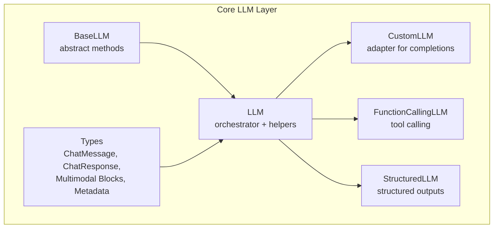
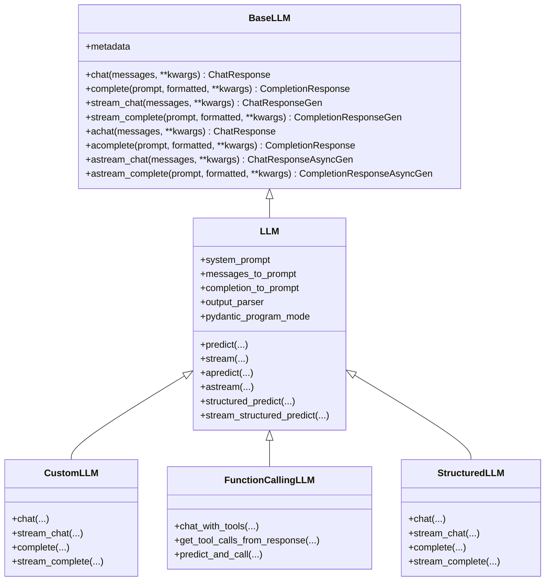
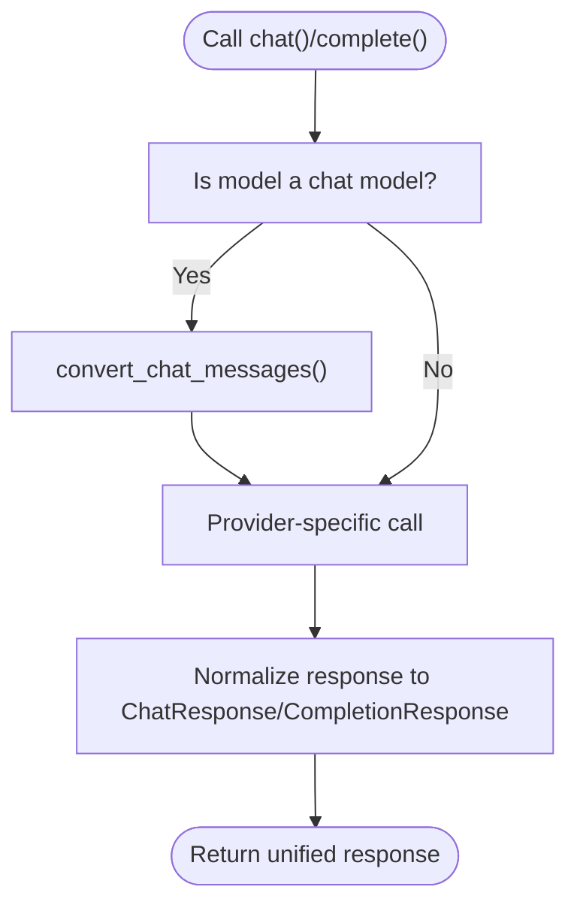
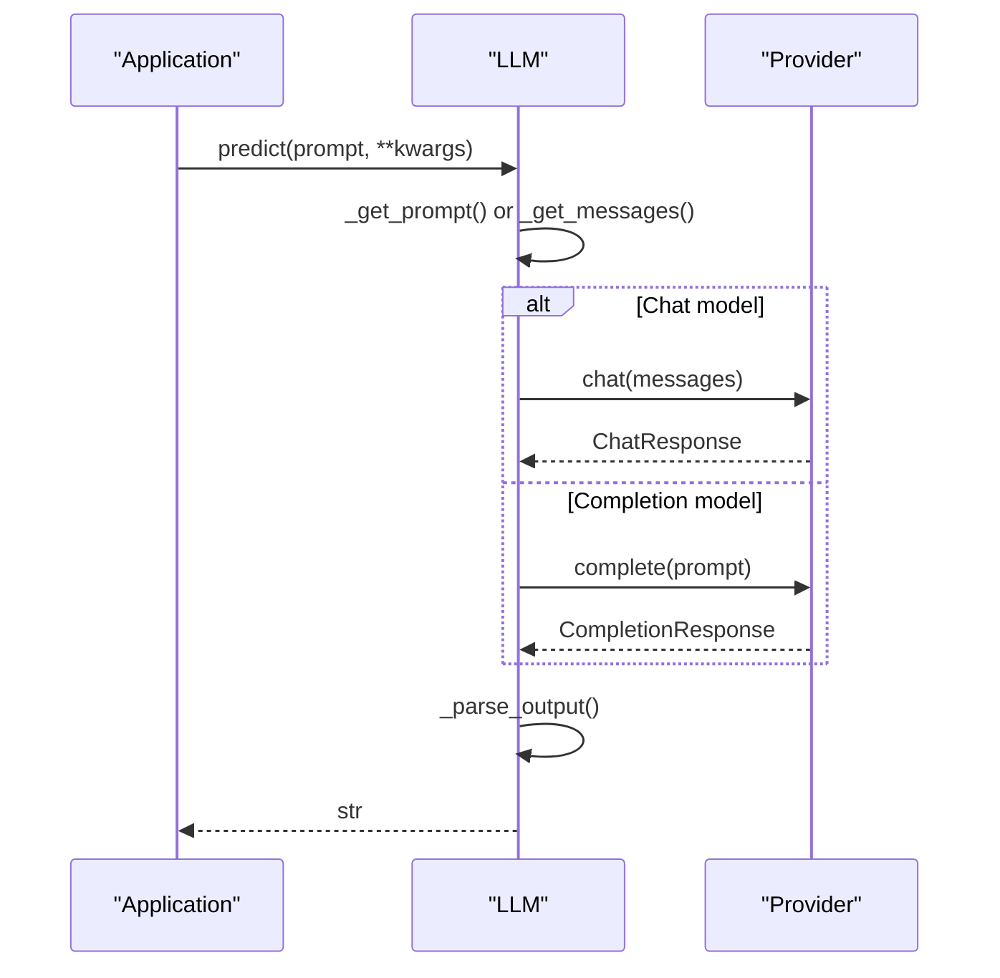
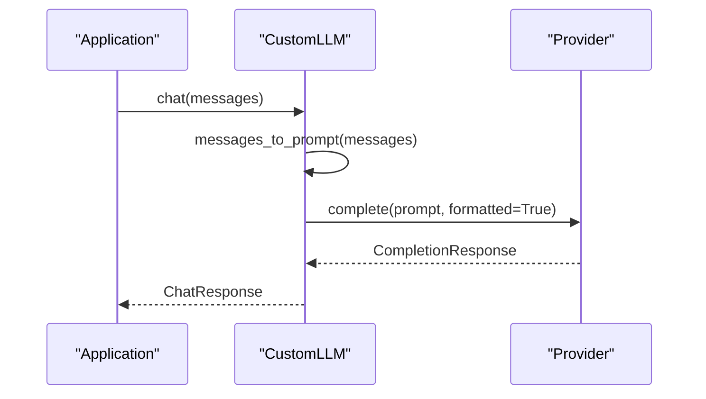
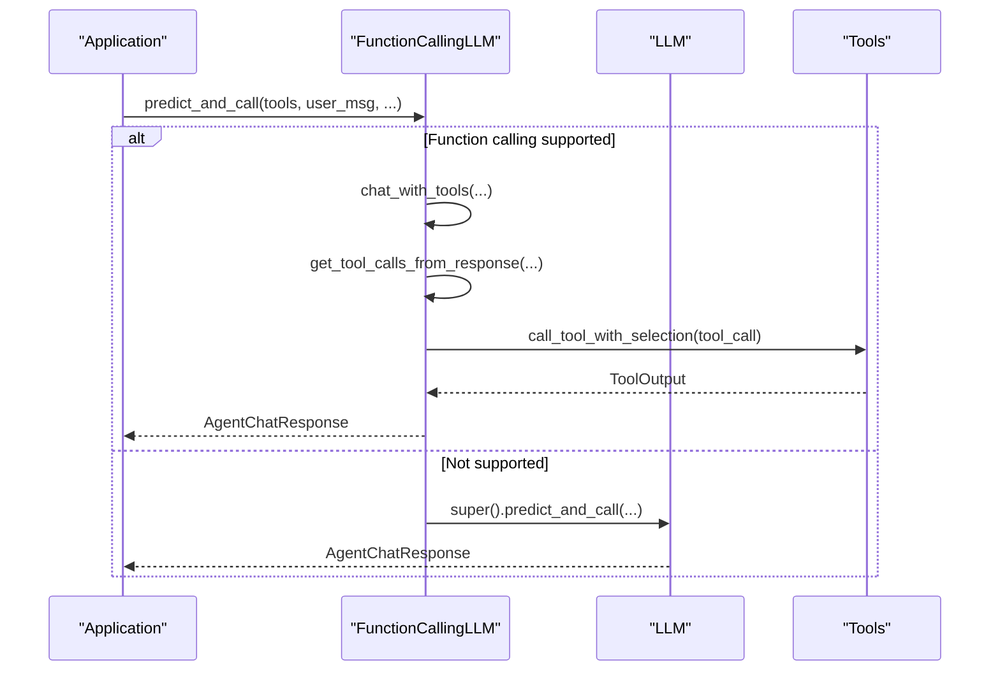
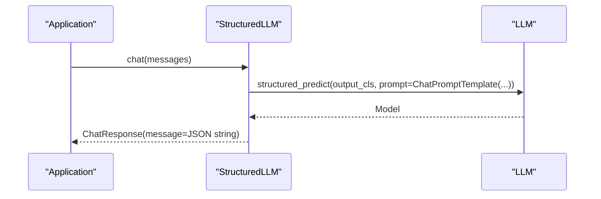
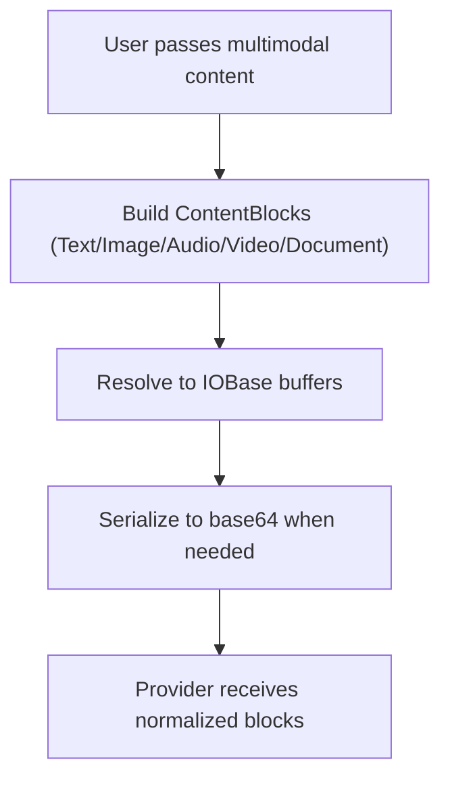
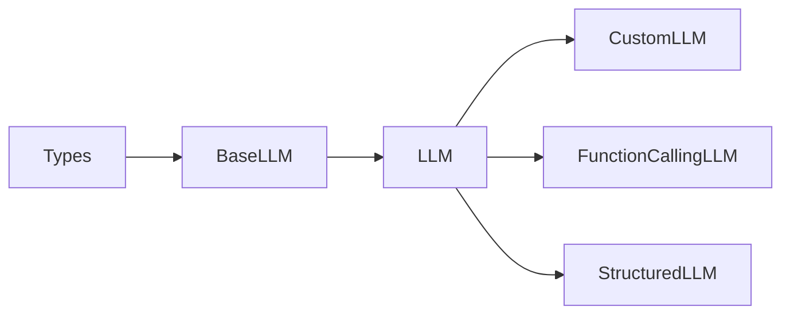

# Custom LLM Integration Development

<cite>
**Referenced Files in This Document**
- [llm.py](file://llama-index-core/llama_index/core/llms/llm.py)
- [base.py](file://llama-index-core/llama_index/core/base/llms/base.py)
- [types.py](file://llama-index-core/llama_index/core/base/llms/types.py)
- [custom.py](file://llama-index-core/llama_index/core/llms/custom.py)
- [function_calling.py](file://llama-index-core/llama_index/core/llms/function_calling.py)
- [structured_llm.py](file://llama-index-core/llama_index/core/llms/structured_llm.py)
- [__init__.py](file://llama-index-core/llama_index/core/llms/__init__.py)
</cite>

## Table of Contents
1. [Introduction](#introduction)
2. [Project Structure](#project-structure)
3. [Core Components](#core-components)
4. [Architecture Overview](#architecture-overview)
5. [Detailed Component Analysis](#detailed-component-analysis)
6. [Dependency Analysis](#dependency-analysis)
7. [Performance Considerations](#performance-considerations)
8. [Troubleshooting Guide](#troubleshooting-guide)
9. [Conclusion](#conclusion)
10. [Appendices](#appendices)

## Introduction
This document explains how to build custom LLM integrations and extend LlamaIndex with proprietary or unsupported LLM providers. It covers the LLM base class interface, abstract method implementations, response normalization, streaming, function calling, structured outputs, multimodal inputs, token counting, caching, testing, performance optimization, and contribution guidelines. Step-by-step examples are provided via file references and diagrams mapped to the actual codebase.

## Project Structure
The LLM integration surface is defined in the core LLM module and its base types. Key files include:
- Base LLM interface and abstract methods
- LLM orchestrator with predict/stream/structured_predict
- Types for messages, responses, multimodal blocks, and metadata
- Adapter patterns for wrapping existing clients and enabling function calling/structured outputs

**Diagram sources**
- [base.py](file://llama-index-core/llama_index/core/base/llms/base.py#L25-L292)
- [llm.py](file://llama-index-core/llama_index/core/llms/llm.py#L163-L931)
- [types.py](file://llama-index-core/llama_index/core/base/llms/types.py#L1-L747)
- [custom.py](file://llama-index-core/llama_index/core/llms/custom.py#L22-L92)
- [function_calling.py](file://llama-index-core/llama_index/core/llms/function_calling.py#L24-L347)
- [structured_llm.py](file://llama-index-core/llama_index/core/llms/structured_llm.py#L32-L164)

**Section sources**
- [__init__.py](file://llama-index-core/llama_index/core/llms/__init__.py#L1-L49)

## Core Components
- BaseLLM: Defines the abstract interface for chat, completion, and streaming endpoints (sync and async). It also provides a default conversion for chat messages to a provider-specific format.
- LLM: The orchestrator that:
  - Normalizes prompts/messages
  - Supports system prompts and query wrappers
  - Provides predict/stream/apredict/astream
  - Implements structured_predict and streaming variants
  - Converts between completion and chat responses for adapters
- Types: Defines message roles, content blocks (text, image, audio, video, document), citations, tool calls, and metadata.
- CustomLLM: Minimal adapter that wraps a completion-style provider behind a chat interface.
- FunctionCallingLLM: Adds tool selection and function calling orchestration.
- StructuredLLM: Wraps an inner LLM to enforce structured outputs via Pydantic models.

Key responsibilities:
- Parameter mapping: LLM normalizes prompts and messages; subclasses map to provider-specific parameters.
- Response normalization: ChatResponse/CompletionResponse unify outputs; adapters convert provider responses.
- Streaming: Token streams are normalized via delta/text fields.
- Multimodal: ContentBlocks represent images/audio/video/documents; resolution and serialization utilities are provided.
- Function calling: Tool selection and validation are handled by specialized adapters.
- Structured outputs: Program-based generation enforces schema compliance.

**Section sources**
- [base.py](file://llama-index-core/llama_index/core/base/llms/base.py#L25-L292)
- [llm.py](file://llama-index-core/llama_index/core/llms/llm.py#L163-L931)
- [types.py](file://llama-index-core/llama_index/core/base/llms/types.py#L39-L747)
- [custom.py](file://llama-index-core/llama_index/core/llms/custom.py#L22-L92)
- [function_calling.py](file://llama-index-core/llama_index/core/llms/function_calling.py#L24-L347)
- [structured_llm.py](file://llama-index-core/llama_index/core/llms/structured_llm.py#L32-L164)

## Architecture Overview
The LlamaIndex LLM stack follows a layered design:
- BaseLLM defines the contract.
- LLM implements orchestration and normalization.
- Adapters (CustomLLM, FunctionCallingLLM, StructuredLLM) extend behavior for specific integration needs.
- Types define the canonical data structures for messages, responses, and multimodal content.

**Diagram sources**
- [base.py](file://llama-index-core/llama_index/core/base/llms/base.py#L25-L292)
- [llm.py](file://llama-index-core/llama_index/core/llms/llm.py#L163-L931)
- [custom.py](file://llama-index-core/llama_index/core/llms/custom.py#L22-L92)
- [function_calling.py](file://llama-index-core/llama_index/core/llms/function_calling.py#L24-L347)
- [structured_llm.py](file://llama-index-core/llama_index/core/llms/structured_llm.py#L32-L164)

## Detailed Component Analysis

### BaseLLM Interface and Abstract Methods
- Responsibilities:
  - Define chat/completion endpoints for both sync and async.
  - Provide streaming variants for incremental token delivery.
  - Offer a default conversion for chat messages to provider-specific formats.
- Implementation notes:
  - The default conversion supports text-only content and raises errors for unsupported content types.
  - Subclasses must implement all abstract methods.

**Diagram sources**
- [base.py](file://llama-index-core/llama_index/core/base/llms/base.py#L50-L68)
- [base.py](file://llama-index-core/llama_index/core/base/llms/base.py#L70-L292)

**Section sources**
- [base.py](file://llama-index-core/llama_index/core/base/llms/base.py#L25-L292)

### LLM Orchestrator: Normalization, Streaming, Structured Outputs
- Responsibilities:
  - System prompt and query wrapper integration.
  - Prompt/message formatting via messages_to_prompt/completion_to_prompt.
  - Output parsing via output_parser.
  - Token stream conversion helpers for chat/completion.
  - Structured prediction using Pydantic programs.
  - Synchronous and asynchronous predict/stream variants.
- Important behaviors:
  - Structured outputs use program-based generation with streaming support.
  - Streaming does not support output parsers (not implemented).

**Diagram sources**
- [llm.py](file://llama-index-core/llama_index/core/llms/llm.py#L588-L631)
- [llm.py](file://llama-index-core/llama_index/core/llms/llm.py#L681-L725)

**Section sources**
- [llm.py](file://llama-index-core/llama_index/core/llms/llm.py#L163-L931)

### CustomLLM Adapter Pattern
- Purpose: Wrap a completion-style provider behind a chat interface.
- Required methods:
  - Implement metadata property.
  - Implement complete() and stream_complete().
  - Optionally override messages_to_prompt/completion_to_prompt if needed.
- Behavior:
  - chat()/stream_chat() convert messages to prompt and delegate to complete()/stream_complete().
  - Responses are normalized via completion_response_to_chat_response.

**Diagram sources**
- [custom.py](file://llama-index-core/llama_index/core/llms/custom.py#L33-L49)

**Section sources**
- [custom.py](file://llama-index-core/llama_index/core/llms/custom.py#L22-L92)

### Function Calling Support
- Extends LLM with tool orchestration:
  - chat_with_tools(), stream_chat_with_tools(), achat_with_tools(), astream_chat_with_tools()
  - get_tool_calls_from_response() must be implemented by the subclass.
  - predict_and_call() integrates tool execution and error handling.
- Compatibility:
  - Uses a cached signature check to detect tool_required support.

**Diagram sources**
- [function_calling.py](file://llama-index-core/llama_index/core/llms/function_calling.py#L202-L266)
- [function_calling.py](file://llama-index-core/llama_index/core/llms/function_calling.py#L268-L334)

**Section sources**
- [function_calling.py](file://llama-index-core/llama_index/core/llms/function_calling.py#L24-L347)

### Structured Output Parsing
- Wraps an inner LLM to enforce schema compliance:
  - chat()/stream_chat() use structured_predict/stream_structured_predict.
  - Responses are serialized to JSON strings and wrapped in ChatMessage.
- Limitations:
  - stream_complete()/astream_complete() are not supported by default.

**Diagram sources**
- [structured_llm.py](file://llama-index-core/llama_index/core/llms/structured_llm.py#L52-L71)
- [structured_llm.py](file://llama-index-core/llama_index/core/llms/structured_llm.py#L104-L125)

**Section sources**
- [structured_llm.py](file://llama-index-core/llama_index/core/llms/structured_llm.py#L32-L164)

### Multimodal Input Handling
- Content blocks:
  - TextBlock, ImageBlock, AudioBlock, VideoBlock, DocumentBlock.
  - Automatic serialization to base64 and mimetype inference.
  - Resolution utilities to obtain readable buffers.
- ChatMessage:
  - Backward-compatible content field plus blocks list.
  - Legacy images handling via additional_kwargs.

**Diagram sources**
- [types.py](file://llama-index-core/llama_index/core/base/llms/types.py#L52-L156)
- [types.py](file://llama-index-core/llama_index/core/base/llms/types.py#L158-L241)
- [types.py](file://llama-index-core/llama_index/core/base/llms/types.py#L244-L335)
- [types.py](file://llama-index-core/llama_index/core/base/llms/types.py#L338-L399)
- [types.py](file://llama-index-core/llama_index/core/base/llms/types.py#L538-L646)

**Section sources**
- [types.py](file://llama-index-core/llama_index/core/base/llms/types.py#L39-L747)

### Caching Mechanisms
- CachePoint and CacheControl enable cache hints for providers that support it.
- Providers may honor cache boundaries; behavior depends on the underlying client.

**Section sources**
- [types.py](file://llama-index-core/llama_index/core/base/llms/types.py#L435-L445)

### Authentication and Environment Setup
- Authentication is provider-specific and configured in the provider client.
- CustomLLM/FunctionCallingLLM/StructuredLLM instances receive credentials via constructor kwargs and forward them to the underlying client.

[No sources needed since this section provides general guidance]

### Step-by-Step Integration Examples

- Implement a CustomLLM (completion-style provider):
  - Implement metadata property and complete()/stream_complete().
  - Optionally override messages_to_prompt/completion_to_prompt.
  - Reference: [custom.py](file://llama-index-core/llama_index/core/llms/custom.py#L22-L92)

- Implement a FunctionCallingLLM:
  - Implement _prepare_chat_with_tools() and get_tool_calls_from_response().
  - Reference: [function_calling.py](file://llama-index-core/llama_index/core/llms/function_calling.py#L137-L190)

- Implement StructuredLLM:
  - Wrap an existing LLM and specify output_cls.
  - Reference: [structured_llm.py](file://llama-index-core/llama_index/core/llms/structured_llm.py#L32-L164)

- Handle Streaming Responses:
  - Use stream_chat()/stream_complete() and convert via provided helpers.
  - Reference: [llm.py](file://llama-index-core/llama_index/core/llms/llm.py#L633-L775)

- Manage Authentication:
  - Pass credentials to the provider client in your subclass.
  - Reference: [custom.py](file://llama-index-core/llama_index/core/llms/custom.py#L30-L32)

- Implement Custom Token Counting:
  - Add a tokenizer and expose token usage via additional_kwargs.
  - Reference: [types.py](file://llama-index-core/llama_index/core/base/llms/types.py#L648-L654)

- Multimodal Inputs:
  - Build ImageBlock/AudioBlock/VideoBlock/DocumentBlock and pass via ChatMessage.blocks.
  - Reference: [types.py](file://llama-index-core/llama_index/core/base/llms/types.py#L52-L156)

- Parameter Mapping Between LlamaIndex and Provider APIs:
  - Map LLM fields (temperature, top_p, max_tokens) to provider-specific keys in your client call.
  - Reference: [llm.py](file://llama-index-core/llama_index/core/llms/llm.py#L181-L230)

- Response Normalization Strategies:
  - Ensure provider responses populate text/delta/raw/logprobs fields consistently.
  - Reference: [types.py](file://llama-index-core/llama_index/core/base/llms/types.py#L657-L699)

## Dependency Analysis
- Coupling:
  - LLM depends on BaseLLM and types for normalization.
  - Adapters depend on LLM for orchestration and on provider clients for execution.
- Cohesion:
  - BaseLLM encapsulates the minimal contract; LLM centralizes orchestration; adapters specialize behavior.
- External dependencies:
  - Provider SDKs (e.g., OpenAI, Anthropic) are integrated via client instantiation inside adapters.

**Diagram sources**
- [base.py](file://llama-index-core/llama_index/core/base/llms/base.py#L25-L292)
- [llm.py](file://llama-index-core/llama_index/core/llms/llm.py#L163-L931)
- [custom.py](file://llama-index-core/llama_index/core/llms/custom.py#L22-L92)
- [function_calling.py](file://llama-index-core/llama_index/core/llms/function_calling.py#L24-L347)
- [structured_llm.py](file://llama-index-core/llama_index/core/llms/structured_llm.py#L32-L164)

**Section sources**
- [__init__.py](file://llama-index-core/llama_index/core/llms/__init__.py#L1-L49)

## Performance Considerations
- Prefer streaming for long responses to reduce latency.
- Minimize repeated prompt formatting by caching formatted prompts when safe.
- Use structured outputs to reduce post-processing overhead.
- Avoid unnecessary conversions between chat and completion modes.
- Tune provider-side parameters (temperature, max tokens) to balance quality and speed.

[No sources needed since this section provides general guidance]

## Troubleshooting Guide
- Streaming with output parsers:
  - Not supported; remove output_parser for streaming predict/stream.
  - Reference: [llm.py](file://llama-index-core/llama_index/core/llms/llm.py#L676-L678)
- Unsupported content types:
  - BaseLLM.convert_chat_messages() raises errors for non-text content; use TextBlock or provider-specific formats.
  - Reference: [base.py](file://llama-index-core/llama_index/core/base/llms/base.py#L50-L68)
- Function calling not supported:
  - If get_tool_calls_from_response() is not implemented, fallback to ReAct agent behavior.
  - Reference: [function_calling.py](file://llama-index-core/llama_index/core/llms/function_calling.py#L191-L200)
- Structured streaming limitations:
  - stream_complete()/astream_complete() are not supported by StructuredLLM.
  - Reference: [structured_llm.py](file://llama-index-core/llama_index/core/llms/structured_llm.py#L102-L103)

**Section sources**
- [llm.py](file://llama-index-core/llama_index/core/llms/llm.py#L676-L678)
- [base.py](file://llama-index-core/llama_index/core/base/llms/base.py#L50-L68)
- [function_calling.py](file://llama-index-core/llama_index/core/llms/function_calling.py#L191-L200)
- [structured_llm.py](file://llama-index-core/llama_index/core/llms/structured_llm.py#L102-L103)

## Conclusion
By adhering to the BaseLLM contract and leveraging LLM’s orchestration, you can integrate any LLM provider. Use CustomLLM for completion-style providers, FunctionCallingLLM for tool-enabled models, and StructuredLLM for schema-enforced outputs. Normalize responses, handle multimodal inputs via ContentBlocks, and implement streaming and caching thoughtfully for optimal performance.

[No sources needed since this section summarizes without analyzing specific files]

## Appendices

### Templates and Boilerplate References
- Minimal CustomLLM adapter:
  - [custom.py](file://llama-index-core/llama_index/core/llms/custom.py#L22-L92)
- Function calling adapter skeleton:
  - [function_calling.py](file://llama-index-core/llama_index/core/llms/function_calling.py#L137-L190)
- Structured output wrapper:
  - [structured_llm.py](file://llama-index-core/llama_index/core/llms/structured_llm.py#L32-L164)
- Message/response types:
  - [types.py](file://llama-index-core/llama_index/core/base/llms/types.py#L538-L699)
- Base interface:
  - [base.py](file://llama-index-core/llama_index/core/base/llms/base.py#L25-L292)

### Testing Strategies
- Unit tests for adapters:
  - Mock provider client responses and assert normalized outputs.
  - Verify streaming deltas and completion text alignment.
- Integration tests:
  - Run predict/stream/structured_predict against a sandboxed provider.
- Edge-case tests:
  - Unsupported content types, empty multimodal blocks, missing credentials.

[No sources needed since this section provides general guidance]

### Contribution Guidelines for Open-Source Adapters
- Follow the adapter pattern: subclass LLM and implement required methods.
- Provide clear parameter mapping and error handling.
- Add tests and documentation for streaming, function calling, and structured outputs.
- Align with existing types and normalization patterns.

[No sources needed since this section provides general guidance]