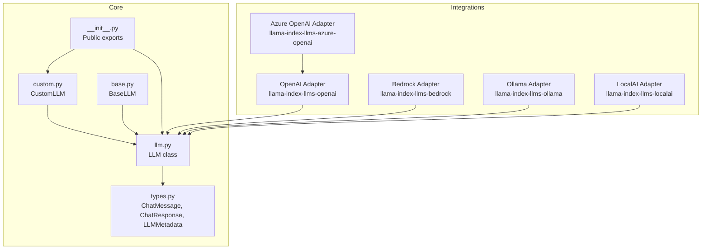
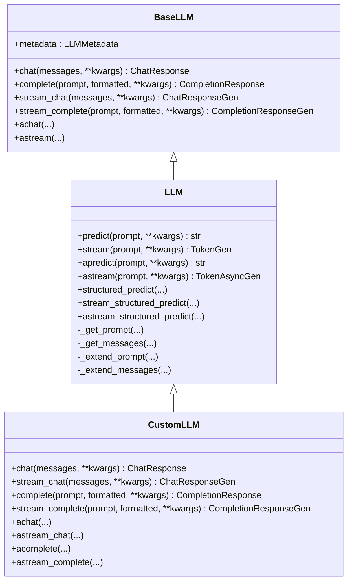
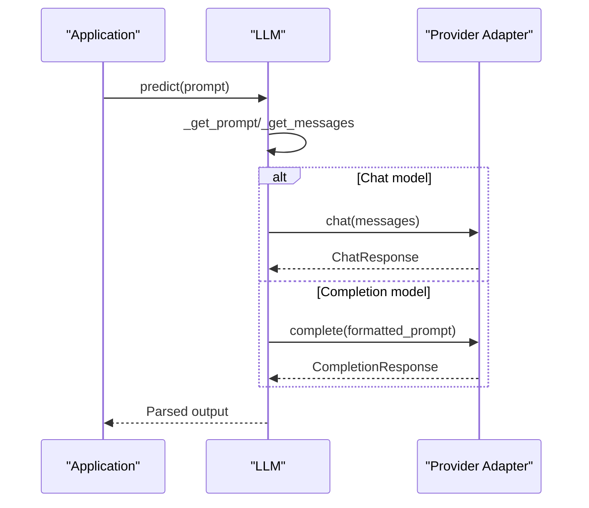
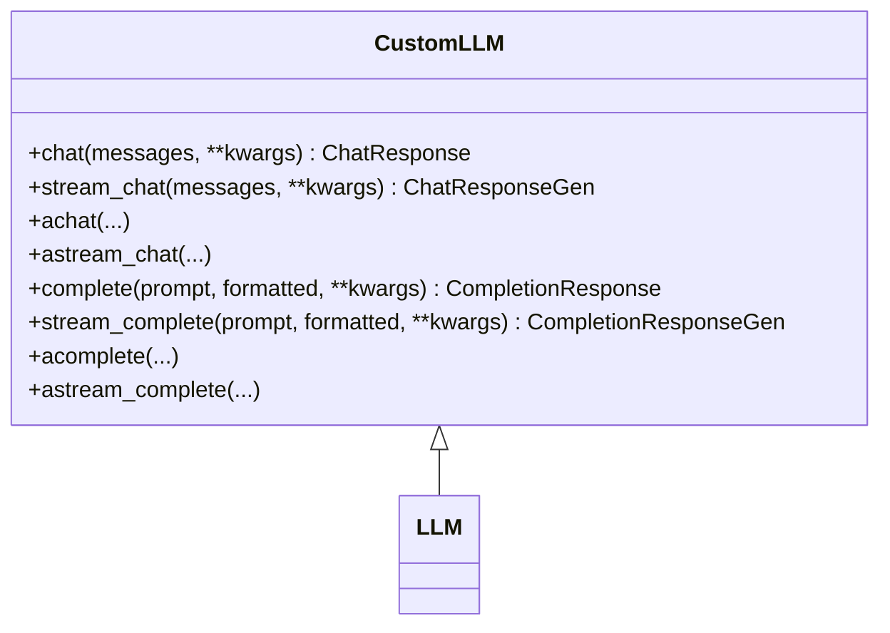
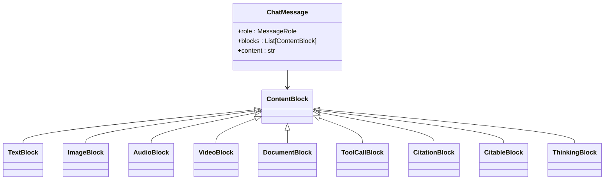
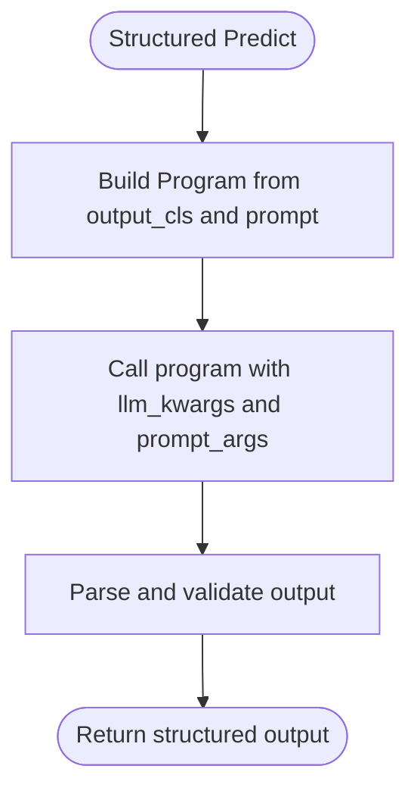
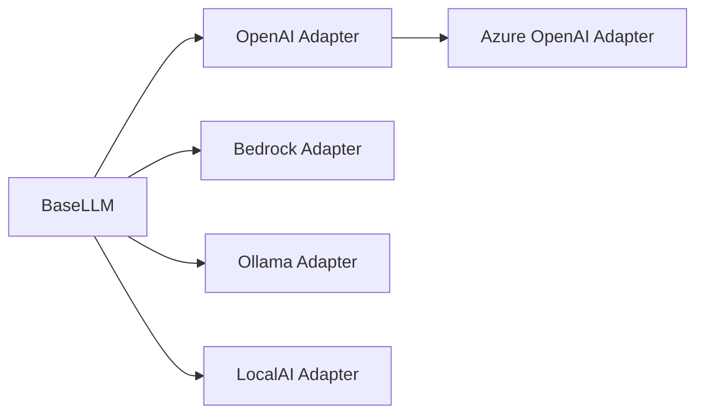
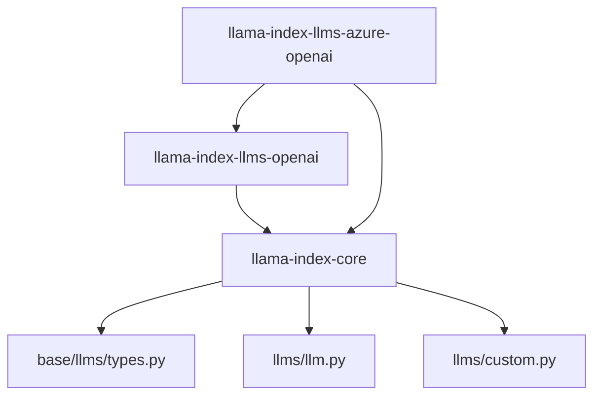

# LLM Provider Integrations

<cite>
**Referenced Files in This Document**
- [llm.py](file://llama-index-core/llama_index/core/llms/llm.py)
- [custom.py](file://llama-index-core/llama_index/core/llms/custom.py)
- [types.py](file://llama-index-core/llama_index/core/base/llms/types.py)
- [base.py](file://llama-index-core/llama_index/core/base/llms/base.py)
- [__init__.py](file://llama-index-core/llama_index/core/llms/__init__.py)
- [pyproject.toml (OpenAI)](file://llama-index-integrations/llms/llama-index-llms-openai/pyproject.toml)
- [pyproject.toml (Azure OpenAI)](file://llama-index-integrations/llms/llama-index-llms-azure-openai/pyproject.toml)
- [test_llms_llama.py](file://llama-index-integrations/llms/llama-index-llms-meta/tests/test_llms_llama.py)
- [test_llms_llama_api.py](file://llama-index-integrations/llms/llama-index-llms-llama-api/tests/test_llms_llama_api.py)
</cite>

## Table of Contents
1. [Introduction](#introduction)
2. [Project Structure](#project-structure)
3. [Core Components](#core-components)
4. [Architecture Overview](#architecture-overview)
5. [Detailed Component Analysis](#detailed-component-analysis)
6. [Dependency Analysis](#dependency-analysis)
7. [Performance Considerations](#performance-considerations)
8. [Troubleshooting Guide](#troubleshooting-guide)
9. [Conclusion](#conclusion)
10. [Appendices](#appendices)

## Introduction
This document explains how LlamaIndex provides a unified Large Language Model (LLM) abstraction to integrate over 100+ providers, including OpenAI, Anthropic, Google Gemini, Azure OpenAI, AWS Bedrock, Ollama, LocalAI, and many others. It covers the common LLM interface, provider-specific adapter patterns, authentication and configuration, parameter mapping, response handling, streaming and structured outputs, rate-limiting and quota strategies, and best practices for cost optimization and performance. It also describes how to build custom adapters and contribute new providers to the ecosystem.

## Project Structure
At the heart of LlamaIndex’s LLM integration is a small, cohesive core in the repository that defines a unified interface and shared types. Provider-specific packages live under the integrations tree and implement adapters that conform to this interface.

Key areas:
- Core LLM interface and implementation: llama-index-core/llama_index/core/llms
- Shared LLM types and message/response models: llama-index-core/llama_index/core/base/llms
- Provider integrations: llama-index-integrations/llms (e.g., OpenAI, Azure OpenAI, Anthropic, Bedrock, Ollama, LocalAI, etc.)

**Diagram sources**
- [llm.py](file://llama-index-core/llama_index/core/llms/llm.py#L163-L931)
- [custom.py](file://llama-index-core/llama_index/core/llms/custom.py#L22-L92)
- [types.py](file://llama-index-core/llama_index/core/base/llms/types.py#L538-L747)
- [base.py](file://llama-index-core/llama_index/core/base/llms/base.py#L25-L124)
- [__init__.py](file://llama-index-core/llama_index/core/llms/__init__.py#L1-L49)
- [pyproject.toml (OpenAI)](file://llama-index-integrations/llms/llama-index-llms-openai/pyproject.toml#L28-L40)
- [pyproject.toml (Azure OpenAI)](file://llama-index-integrations/llms/llama-index-llms-azure-openai/pyproject.toml#L27-L40)

**Section sources**
- [llm.py](file://llama-index-core/llama_index/core/llms/llm.py#L163-L931)
- [types.py](file://llama-index-core/llama_index/core/base/llms/types.py#L538-L747)
- [base.py](file://llama-index-core/llama_index/core/base/llms/base.py#L25-L124)
- [__init__.py](file://llama-index-core/llama_index/core/llms/__init__.py#L1-L49)

## Core Components
- Unified LLM interface: BaseLLM defines the contract for chat, completion, streaming, and metadata.
- LLM class: Implements high-level orchestration for prompts, messages, structured outputs, streaming, and async variants.
- CustomLLM: A convenience base class for building custom adapters that implement minimal required methods.
- Shared types: ChatMessage, ChatResponse, CompletionResponse, LLMMetadata, and multimodal blocks enable consistent input/output across providers.

Key capabilities:
- Predict vs. stream vs. async predict/stream
- Structured outputs via Pydantic programs
- System prompts and message chaining
- Streaming token conversion helpers
- Metadata-driven behavior (chat vs. completion, function calling support)

**Section sources**
- [base.py](file://llama-index-core/llama_index/core/base/llms/base.py#L25-L124)
- [llm.py](file://llama-index-core/llama_index/core/llms/llm.py#L163-L931)
- [custom.py](file://llama-index-core/llama_index/core/llms/custom.py#L22-L92)
- [types.py](file://llama-index-core/llama_index/core/base/llms/types.py#L538-L747)

## Architecture Overview
The unified LLM abstraction allows any provider adapter to plug in seamlessly. Providers implement BaseLLM and expose metadata (e.g., is_chat_model, is_function_calling_model). LlamaIndex’s LLM orchestrates prompt/message formatting, system prompts, structured outputs, and streaming, while delegating actual inference to the adapter.

**Diagram sources**
- [base.py](file://llama-index-core/llama_index/core/base/llms/base.py#L25-L124)
- [llm.py](file://llama-index-core/llama_index/core/llms/llm.py#L163-L931)
- [custom.py](file://llama-index-core/llama_index/core/llms/custom.py#L22-L92)

## Detailed Component Analysis

### Unified LLM Abstraction and Orchestration
- LLM orchestrates:
  - Prompt/message formatting and system prompt injection
  - Chat vs. completion routing based on metadata
  - Structured outputs via Pydantic programs
  - Streaming token extraction and async streaming
- It emits instrumentation events and integrates with callback managers.

**Diagram sources**
- [llm.py](file://llama-index-core/llama_index/core/llms/llm.py#L588-L725)

**Section sources**
- [llm.py](file://llama-index-core/llama_index/core/llms/llm.py#L588-L725)

### Custom Adapter Base
- CustomLLM simplifies building adapters by mapping chat to completion and vice versa, and by providing async stubs that delegate to sync methods.

**Diagram sources**
- [custom.py](file://llama-index-core/llama_index/core/llms/custom.py#L22-L92)

**Section sources**
- [custom.py](file://llama-index-core/llama_index/core/llms/custom.py#L22-L92)

### Message and Response Types
- ChatMessage supports roles, blocks (text, images, audio, video, documents), citations, tool calls, and thinking blocks.
- ChatResponse and CompletionResponse unify streaming and non-streaming outputs, with deltas and additional metadata.

**Diagram sources**
- [types.py](file://llama-index-core/llama_index/core/base/llms/types.py#L538-L747)

**Section sources**
- [types.py](file://llama-index-core/llama_index/core/base/llms/types.py#L538-L747)

### Structured Outputs and Streaming
- LLM offers structured_predict, stream_structured_predict, and async variants using Pydantic programs.
- Streaming token generators convert provider streams into token deltas.

**Diagram sources**
- [llm.py](file://llama-index-core/llama_index/core/llms/llm.py#L306-L584)

**Section sources**
- [llm.py](file://llama-index-core/llama_index/core/llms/llm.py#L306-L584)

### Provider-Specific Adapters and Authentication
- OpenAI adapter depends on the official OpenAI SDK and is declared in its package metadata.
- Azure OpenAI adapter depends on the OpenAI adapter plus Azure identity and HTTPX.
- Tests confirm that adapters subclass BaseLLM, ensuring compatibility with the unified interface.

**Diagram sources**
- [pyproject.toml (OpenAI)](file://llama-index-integrations/llms/llama-index-llms-openai/pyproject.toml#L28-L40)
- [pyproject.toml (Azure OpenAI)](file://llama-index-integrations/llms/llama-index-llms-azure-openai/pyproject.toml#L27-L40)
- [test_llms_llama.py](file://llama-index-integrations/llms/llama-index-llms-meta/tests/test_llms_llama.py#L1-L8)
- [test_llms_llama_api.py](file://llama-index-integrations/llms/llama-index-llms-llama-api/tests/test_llms_llama_api.py#L1-L7)

**Section sources**
- [pyproject.toml (OpenAI)](file://llama-index-integrations/llms/llama-index-llms-openai/pyproject.toml#L28-L40)
- [pyproject.toml (Azure OpenAI)](file://llama-index-integrations/llms/llama-index-llms-azure-openai/pyproject.toml#L27-L40)
- [test_llms_llama.py](file://llama-index-integrations/llms/llama-index-llms-meta/tests/test_llms_llama.py#L1-L8)
- [test_llms_llama_api.py](file://llama-index-integrations/llms/llama-index-llms-llama-api/tests/test_llms_llama_api.py#L1-L7)

## Dependency Analysis
- Core LLM depends on shared types and instrumentation/callbacks.
- Provider adapters depend on their respective SDKs and often on core.
- Azure OpenAI composes the OpenAI adapter, reducing duplication.

**Diagram sources**
- [llm.py](file://llama-index-core/llama_index/core/llms/llm.py#L1-L100)
- [types.py](file://llama-index-core/llama_index/core/base/llms/types.py#L1-L50)
- [custom.py](file://llama-index-core/llama_index/core/llms/custom.py#L1-L30)
- [pyproject.toml (OpenAI)](file://llama-index-integrations/llms/llama-index-llms-openai/pyproject.toml#L28-L40)
- [pyproject.toml (Azure OpenAI)](file://llama-index-integrations/llms/llama-index-llms-azure-openai/pyproject.toml#L27-L40)

**Section sources**
- [pyproject.toml (OpenAI)](file://llama-index-integrations/llms/llama-index-llms-openai/pyproject.toml#L28-L40)
- [pyproject.toml (Azure OpenAI)](file://llama-index-integrations/llms/llama-index-llms-azure-openai/pyproject.toml#L27-L40)

## Performance Considerations
- Prefer streaming for latency-sensitive applications; use token deltas to render progressively.
- Use structured outputs to reduce retries and parsing overhead.
- Tune max tokens and context window via LLMMetadata to avoid truncation and extra calls.
- Batch and cache prompts/messages where supported by the adapter.
- Monitor token usage and costs through provider dashboards and LlamaIndex instrumentation.

## Troubleshooting Guide
Common issues and remedies:
- Rate limits and quotas:
  - Implement retry with exponential backoff.
  - Use provider-side quotas and alerts.
  - Consider fallback adapters or regional endpoints.
- Authentication failures:
  - Verify API keys and environment variables.
  - For Azure OpenAI, ensure proper Azure identity configuration.
- Function calling mismatches:
  - Confirm LLMMetadata.is_function_calling_model matches provider capability.
- Streaming output parser conflicts:
  - Avoid applying output parsers during streaming; apply after completion.

**Section sources**
- [llm.py](file://llama-index-core/llama_index/core/llms/llm.py#L633-L775)
- [types.py](file://llama-index-core/llama_index/core/base/llms/types.py#L702-L747)

## Conclusion
LlamaIndex’s unified LLM abstraction enables seamless integration with a broad ecosystem of providers. By adhering to BaseLLM and LLMMetadata, adapters can expose consistent APIs for chat/completion, streaming, structured outputs, and advanced features like function calling. Provider-specific packages encapsulate authentication and SDK differences, while core utilities handle orchestration, instrumentation, and interoperability.

## Appendices

### Practical Integration Patterns
- Configure API keys and credentials via environment variables or explicit constructor parameters in the adapter.
- Use ServiceContext to centralize LLM configuration across components.
- For function calling, set metadata.is_function_calling_model and format tools according to provider expectations.
- For multimodal inputs, construct ChatMessage with appropriate blocks (ImageBlock, AudioBlock, VideoBlock, DocumentBlock).

### Best Practices
- Cost optimization:
  - Use smaller models for simpler tasks.
  - Apply prompt caching and reuse where supported.
  - Monitor and cap max tokens.
- Performance tuning:
  - Enable streaming for interactive UX.
  - Use batching and parallelism judiciously.
  - Prefer chat models for conversational flows.
- Error handling:
  - Wrap provider calls with timeouts and retries.
  - Normalize exceptions to LlamaIndex error types.
  - Log provider identifiers and request IDs for traceability.

### Developing a Custom LLM Integration
Steps:
1. Subclass CustomLLM or BaseLLM.
2. Implement required methods: metadata, complete, stream_complete (and optionally chat/stream_chat).
3. Add authentication and SDK initialization in __init__.
4. Map provider-specific parameters to LLM fields (e.g., temperature, top_p) via kwargs.
5. Set LLMMetadata appropriately (is_chat_model, is_function_calling_model, model_name, context_window).
6. Add tests verifying BaseLLM compatibility and basic functionality.
7. Publish as a separate package and document installation and configuration.

**Section sources**
- [custom.py](file://llama-index-core/llama_index/core/llms/custom.py#L22-L92)
- [base.py](file://llama-index-core/llama_index/core/base/llms/base.py#L25-L124)
- [types.py](file://llama-index-core/llama_index/core/base/llms/types.py#L702-L747)
- [test_llms_llama.py](file://llama-index-integrations/llms/llama-index-llms-meta/tests/test_llms_llama.py#L1-L8)
- [test_llms_llama_api.py](file://llama-index-integrations/llms/llama-index-llms-llama-api/tests/test_llms_llama_api.py#L1-L7)