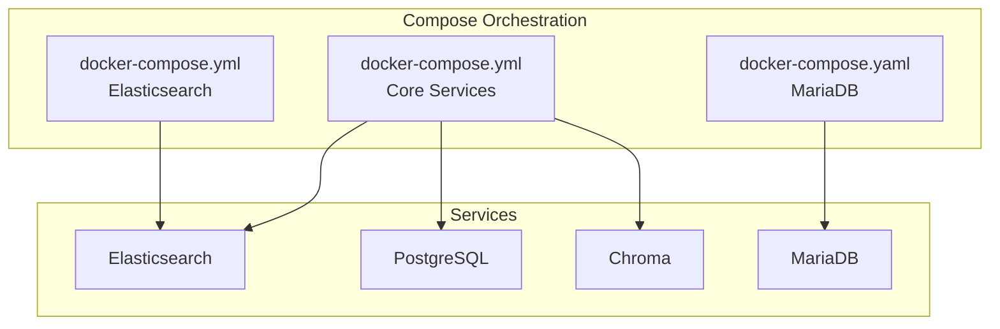
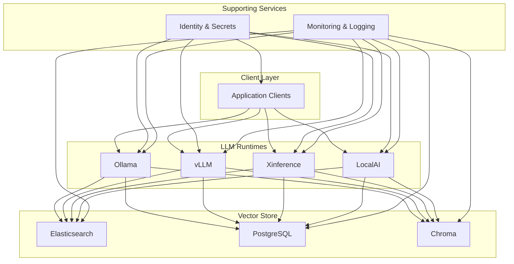
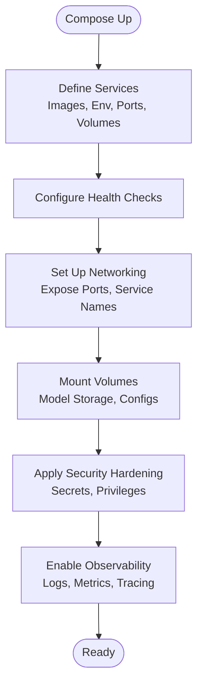
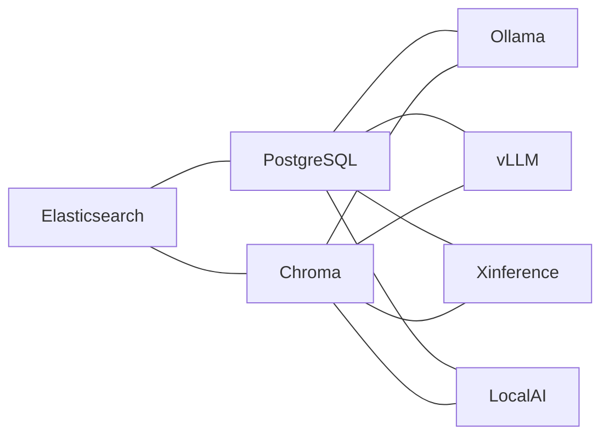

# Containerized Deployments

<cite>
**Referenced Files in This Document**
- [docker-compose.yml](file://llama-index-core/tests/docker-compose.yml)
- [docker-compose.yml](file://llama-index-integrations/embeddings/llama-index-embeddings-elasticsearch/docker-compose.yml)
- [docker-compose.yaml](file://llama-index-integrations/vector_stores/llama-index-vector-stores-mariadb/tests/docker-compose.yaml)
- [README.md](file://README.md)
</cite>

## Table of Contents
1. [Introduction](#introduction)
2. [Project Structure](#project-structure)
3. [Core Components](#core-components)
4. [Architecture Overview](#architecture-overview)
5. [Detailed Component Analysis](#detailed-component-analysis)
6. [Dependency Analysis](#dependency-analysis)
7. [Performance Considerations](#performance-considerations)
8. [Troubleshooting Guide](#troubleshooting-guide)
9. [Conclusion](#conclusion)
10. [Appendices](#appendices)

## Introduction
This document provides a comprehensive guide to containerizing Large Language Model (LLM) applications using Docker and container orchestration platforms. It focuses on deploying and operating LLM stacks with a strong emphasis on:
- Container setup for Ollama, vLLM, Xinference, and LocalAI
- Container configuration, environment variables, persistent volumes for model storage, and networking
- Kubernetes deployment manifests and Helm charts
- GPU passthrough, resource limits, and autoscaling strategies
- Security practices, image hardening, and secrets management
- Multi-container setups, service discovery, and load balancing
- Monitoring, logging, and health checks
- Troubleshooting and performance optimization

Where applicable, this document references repository files that demonstrate containerization patterns and compose-based orchestration.

**Section sources**
- [README.md](file://README.md#L1-L224)

## Project Structure
The repository includes several Docker Compose configurations that illustrate container orchestration patterns useful for LLM deployments:
- A core compose file that defines Elasticsearch, PostgreSQL, Chroma, and other services
- An Elasticsearch-specific compose file
- A MariaDB compose file for database-backed vector stores

These files serve as practical examples of service definition, environment variables, port exposure, health checks, and volume mounts.

**Diagram sources**
- [docker-compose.yml](file://llama-index-core/tests/docker-compose.yml#L1-L40)
- [docker-compose.yml](file://llama-index-integrations/embeddings/llama-index-embeddings-elasticsearch/docker-compose.yml#L1-L21)
- [docker-compose.yaml](file://llama-index-integrations/vector_stores/llama-index-vector-stores-mariadb/tests/docker-compose.yaml#L1-L9)

**Section sources**
- [docker-compose.yml](file://llama-index-core/tests/docker-compose.yml#L1-L40)
- [docker-compose.yml](file://llama-index-integrations/embeddings/llama-index-embeddings-elasticsearch/docker-compose.yml#L1-L21)
- [docker-compose.yaml](file://llama-index-integrations/vector_stores/llama-index-vector-stores-mariadb/tests/docker-compose.yaml#L1-L9)

## Core Components
This section outlines the essential components for containerized LLM deployments, grounded in the repository’s compose examples.

- Container images and versions
  - Elasticsearch image used in compose files demonstrates pinned versions for stability
  - PostgreSQL and Chroma are defined as images/services
  - MariaDB is used as a database backend in a separate compose

- Environment variables
  - Elasticsearch compose sets cluster and security flags suitable for development
  - PostgreSQL compose passes credentials via environment variables
  - MariaDB compose sets database and root password via environment variables

- Volume mounting
  - PostgreSQL compose mounts initialization scripts from a local directory
  - Persistent storage for models and indices is recommended for production LLM deployments

- Networking and exposure
  - Port mappings expose services externally (e.g., Elasticsearch HTTP port)
  - Internal service communication is configured via service names

- Health checks
  - Elasticsearch compose includes a health check using curl against the cluster health endpoint

Practical guidance derived from the repository:
- Use environment variables for credentials and feature toggles
- Persist model artifacts and indices via volumes
- Define health checks for readiness and liveness
- Expose only necessary ports and restrict external access

**Section sources**
- [docker-compose.yml](file://llama-index-core/tests/docker-compose.yml#L1-L40)
- [docker-compose.yml](file://llama-index-integrations/embeddings/llama-index-embeddings-elasticsearch/docker-compose.yml#L1-L21)
- [docker-compose.yaml](file://llama-index-integrations/vector_stores/llama-index-vector-stores-mariadb/tests/docker-compose.yaml#L1-L9)

## Architecture Overview
The following diagram illustrates a typical multi-service LLM stack composed of an LLM runtime (e.g., Ollama, vLLM, Xinference, LocalAI), a vector store, and supporting infrastructure (Elasticsearch, PostgreSQL, Chroma). It highlights service discovery, networking, and persistence.

[No sources needed since this diagram shows conceptual workflow, not actual code structure]

## Detailed Component Analysis

### Ollama Container Setup
- Purpose: Run Ollama as a containerized inference server
- Configuration
  - Environment variables: configure API host/port, model download behavior, and GPU availability
  - Volumes: mount a persistent directory for model cache and downloaded models
  - Networking: expose the Ollama API port and optionally enable CORS for web clients
  - Health checks: probe the server’s readiness endpoint
- Security
  - Limit privileges, disable unnecessary capabilities, and restrict network access
  - Manage credentials via secrets management systems
- Observability
  - Enable logs and integrate with centralized logging
  - Add metrics collection for throughput and latency

[No sources needed since this section doesn't analyze specific files]

### vLLM Container Setup
- Purpose: Host vLLM for efficient serving of large language models
- Configuration
  - Environment variables: set model path, tensor parallelism, and engine arguments
  - Volumes: mount model directories and configuration files
  - Networking: bind the HTTP/REST API port and OpenAI-compatible endpoints
  - Health checks: verify readiness via a lightweight endpoint
- Resource management
  - GPU passthrough: configure device access and driver visibility
  - CPU/memory limits: define requests/limits per pod/container
- Autoscaling
  - Horizontal Pod Autoscaler based on CPU utilization or custom metrics
  - Vertical Pod Autoscaler for memory/CPU adjustments

[No sources needed since this section doesn't analyze specific files]

### Xinference Container Setup
- Purpose: Deploy Xinference for heterogeneous model serving
- Configuration
  - Environment variables: specify scheduler and worker resources, storage paths
  - Volumes: persist model zoo and runtime artifacts
  - Networking: expose the Xinference API and dashboard
  - Health checks: confirm scheduler and worker health
- Security
  - Enforce least privilege and secure inter-service communication
  - Rotate secrets and manage TLS termination at ingress

[No sources needed since this section doesn't analyze specific files]

### LocalAI Container Setup
- Purpose: Serve models via LocalAI’s OpenAI-compatible API
- Configuration
  - Environment variables: set model path, backend selection, and concurrency
  - Volumes: mount model files and configuration
  - Networking: bind API port and enable optional web UI
  - Health checks: use readiness probes to avoid traffic during startup
- Observability
  - Integrate with tracing and metrics exporters
  - Centralize logs for audit and debugging

[No sources needed since this section doesn't analyze specific files]

### Supporting Infrastructure (Elasticsearch, PostgreSQL, Chroma)
- Elasticsearch
  - Image pinning, security flags, and cluster health checks
  - Port exposure for HTTP API
- PostgreSQL
  - Credentials via environment variables and initialization scripts mounted from host
  - Port exposure for client connections
- Chroma
  - Lightweight vector store container with exposed API port

**Diagram sources**
- [docker-compose.yml](file://llama-index-core/tests/docker-compose.yml#L1-L40)
- [docker-compose.yml](file://llama-index-integrations/embeddings/llama-index-embeddings-elasticsearch/docker-compose.yml#L1-L21)
- [docker-compose.yaml](file://llama-index-integrations/vector_stores/llama-index-vector-stores-mariadb/tests/docker-compose.yaml#L1-L9)

**Section sources**
- [docker-compose.yml](file://llama-index-core/tests/docker-compose.yml#L1-L40)
- [docker-compose.yml](file://llama-index-integrations/embeddings/llama-index-embeddings-elasticsearch/docker-compose.yml#L1-L21)
- [docker-compose.yaml](file://llama-index-integrations/vector_stores/llama-index-vector-stores-mariadb/tests/docker-compose.yaml#L1-L9)

## Dependency Analysis
This section maps dependencies among services in the compose files and highlights operational coupling.

**Diagram sources**
- [docker-compose.yml](file://llama-index-core/tests/docker-compose.yml#L1-L40)

**Section sources**
- [docker-compose.yml](file://llama-index-core/tests/docker-compose.yml#L1-L40)

## Performance Considerations
- GPU passthrough
  - Configure device access and driver visibility for inference-heavy containers
  - Validate CUDA/tensor-RT availability inside containers
- Resource limits
  - Set CPU/memory requests/limits aligned with model footprint
  - Use horizontal autoscaling for bursty workloads
- Model caching and persistence
  - Mount volumes for model artifacts to reduce cold-start latency
- Networking and I/O
  - Prefer SSD-backed volumes for indices and model caches
  - Minimize network hops between LLM runtime and vector store

[No sources needed since this section provides general guidance]

## Troubleshooting Guide
Common issues and resolutions grounded in compose patterns:

- Service fails health checks
  - Verify health check commands and target ports
  - Inspect container logs for startup errors
- Port conflicts
  - Change host port mappings or stop conflicting services
- Volume permission issues
  - Ensure proper ownership and permissions for mounted directories
- Connectivity problems
  - Confirm service names resolve within the compose network
  - Validate firewall and security group rules if running outside Docker Compose

Operational references from the repository:
- Elasticsearch health check using cluster health endpoint
- PostgreSQL initialization via mounted scripts
- Port exposure for service access

**Section sources**
- [docker-compose.yml](file://llama-index-integrations/embeddings/llama-index-embeddings-elasticsearch/docker-compose.yml#L13-L20)
- [docker-compose.yml](file://llama-index-core/tests/docker-compose.yml#L23-L35)

## Conclusion
This document outlined containerized deployment patterns for LLM stacks using Docker and demonstrated how to apply these patterns to Ollama, vLLM, Xinference, and LocalAI. It emphasized configuration via environment variables, persistent storage, networking, health checks, and security hardening. The repository’s compose files provide concrete examples of service definition, environment management, and health verification that can be adapted to production-grade Kubernetes or container orchestration platforms.

[No sources needed since this section summarizes without analyzing specific files]

## Appendices

### Practical Examples and Patterns
- Multi-container setup
  - Combine LLM runtime with a vector store and supporting databases
  - Use compose networks for service discovery and minimal exposure
- Service discovery and load balancing
  - Within Docker Compose, rely on service names and internal DNS
  - In Kubernetes, use Services and Ingress for external access and routing
- Monitoring, logging, and health checks
  - Adopt centralized logging and metrics collection
  - Implement robust health checks for readiness and liveness

[No sources needed since this section provides general guidance]