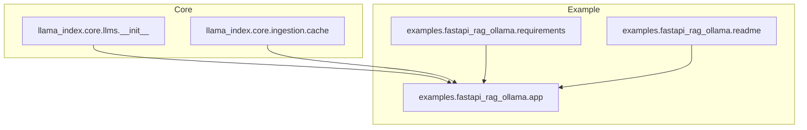
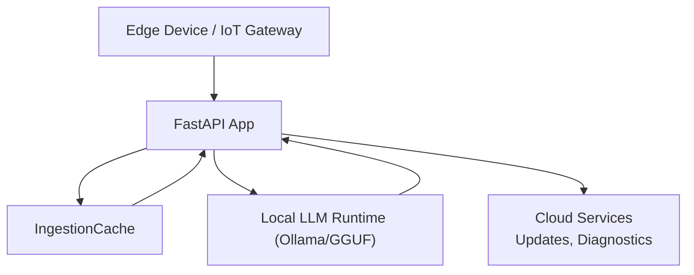
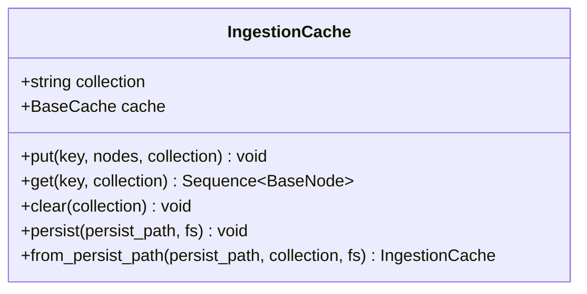
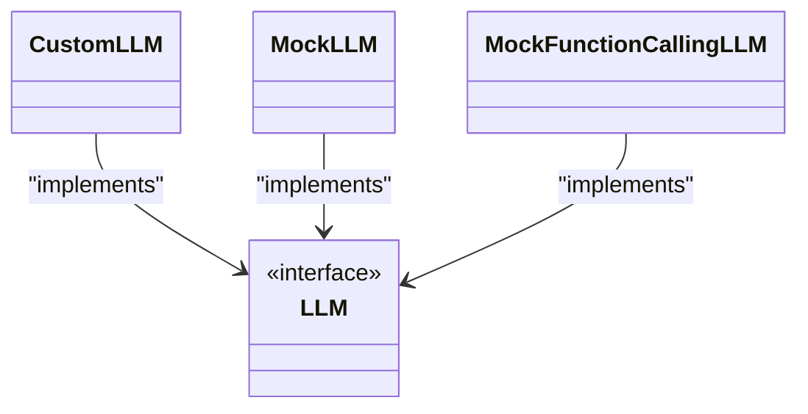
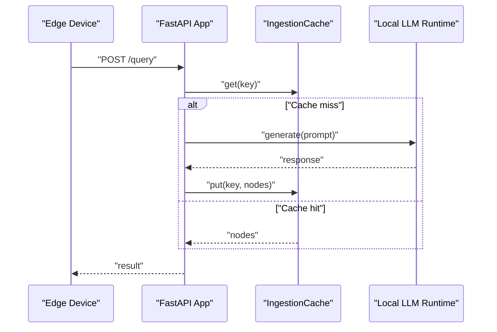
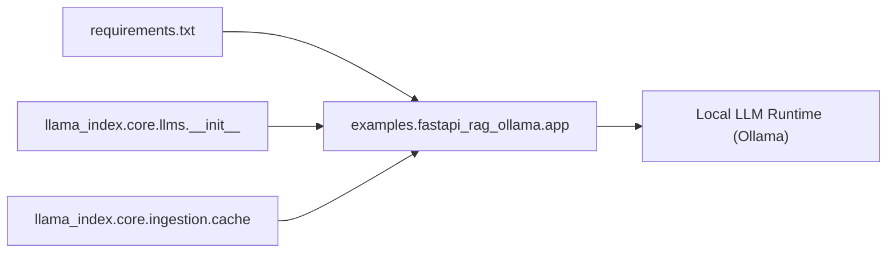

# Edge Computing

<cite>
**Referenced Files in This Document**
- [cache.py](file://llama-index-core/llama_index/core/ingestion/cache.py)
- [__init__.py](file://llama-index-core/llama_index/core/llms/__init__.py)
- [README.md](file://examples/fastapi_rag_ollama/README.md)
- [app.py](file://examples/fastapi_rag_ollama/app.py)
- [requirements.txt](file://examples/fastapi_rag_ollama/requirements.txt)
- [README.md](file://README.md)
</cite>

## Table of Contents
1. [Introduction](#introduction)
2. [Project Structure](#project-structure)
3. [Core Components](#core-components)
4. [Architecture Overview](#architecture-overview)
5. [Detailed Component Analysis](#detailed-component-analysis)
6. [Dependency Analysis](#dependency-analysis)
7. [Performance Considerations](#performance-considerations)
8. [Security Considerations](#security-considerations)
9. [Monitoring and Maintenance](#monitoring-and-maintenance)
10. [Troubleshooting Guide](#troubleshooting-guide)
11. [Conclusion](#conclusion)

## Introduction
This document provides specialized guidance for deploying large language models (LLMs) in edge computing environments. It focuses on resource-constrained devices, distributed deployments, and offline-first architectures. Topics include lightweight model strategies, quantization-friendly integrations, memory-efficient inference patterns, local caching, offline-first design, edge-cloud coordination, security for edge devices, and operational maintenance including over-the-air updates and diagnostics.

## Project Structure
The repository is a multi-package Python project centered around retrieval-augmented generation (RAG) and LLM orchestration. For edge-focused deployments, the most relevant areas are:
- Ingestion and caching primitives for local persistence and reuse
- LLM abstractions enabling flexible backend selection
- Example RAG application using Ollama for local inference

**Diagram sources**
- [__init__.py](file://llama-index-core/llama_index/core/llms/__init__.py#L1-L49)
- [cache.py](file://llama-index-core/llama_index/core/ingestion/cache.py#L1-L79)
- [app.py](file://examples/fastapi_rag_ollama/app.py)
- [requirements.txt](file://examples/fastapi_rag_ollama/requirements.txt)
- [README.md](file://examples/fastapi_rag_ollama/README.md)

**Section sources**
- [__init__.py](file://llama-index-core/llama_index/core/llms/__init__.py#L1-L49)
- [cache.py](file://llama-index-core/llama_index/core/ingestion/cache.py#L1-L79)
- [README.md](file://examples/fastapi_rag_ollama/README.md)
- [app.py](file://examples/fastapi_rag_ollama/app.py)
- [requirements.txt](file://examples/fastapi_rag_ollama/requirements.txt)

## Core Components
- Local caching for ingestion and retrieval to reduce repeated compute and network usage
- LLM abstraction enabling pluggable backends (e.g., local GGUF via llama.cpp or Ollama)
- Example FastAPI RAG application demonstrating a practical edge deployment pattern

Key capabilities:
- IngestionCache persists node sequences locally and supports persistence to disk
- LLM interface exposes metadata and streaming response types suitable for constrained environments
- Example app integrates a local LLM runtime and FastAPI for serving queries

**Section sources**
- [cache.py](file://llama-index-core/llama_index/core/ingestion/cache.py#L17-L75)
- [__init__.py](file://llama-index-core/llama_index/core/llms/__init__.py#L1-L49)
- [README.md](file://examples/fastapi_rag_ollama/README.md)
- [app.py](file://examples/fastapi_rag_ollama/app.py)

## Architecture Overview
The edge deployment architecture centers on:
- Local model runtime (e.g., Ollama) for GGUF-based inference
- FastAPI application exposing a query endpoint
- Local cache for ingestion and retrieval
- Optional cloud coordination for updates and diagnostics

**Diagram sources**
- [app.py](file://examples/fastapi_rag_ollama/app.py)
- [cache.py](file://llama-index-core/llama_index/core/ingestion/cache.py#L17-L75)

## Detailed Component Analysis

### IngestionCache
Purpose:
- Persist node sequences locally to avoid recomputation and re-download
- Support disk-backed persistence for offline-first operation

Key behaviors:
- Put/get nodes keyed by a string identifier
- Clear entire cache collections
- Persist to a filesystem path and reconstruct from persisted state

**Diagram sources**
- [cache.py](file://llama-index-core/llama_index/core/ingestion/cache.py#L17-L75)

**Section sources**
- [cache.py](file://llama-index-core/llama_index/core/ingestion/cache.py#L17-L75)

### LLM Abstraction
Purpose:
- Provide a uniform interface for diverse LLM backends
- Enable switching between local and hosted providers with minimal code changes

Highlights:
- Exposes response types and metadata structures
- Enables streaming and async generation patterns

**Diagram sources**
- [__init__.py](file://llama-index-core/llama_index/core/llms/__init__.py#L21-L39)

**Section sources**
- [__init__.py](file://llama-index-core/llama_index/core/llms/__init__.py#L1-L49)

### FastAPI RAG Application (Edge Pattern)
Purpose:
- Demonstrate a minimal edge deployment serving queries via a local LLM
- Integrate with local cache for efficient retrieval

Key elements:
- Endpoint definition for querying
- Integration with local LLM runtime
- Requirements pinned for reproducible edge deployments

**Diagram sources**
- [app.py](file://examples/fastapi_rag_ollama/app.py)
- [cache.py](file://llama-index-core/llama_index/core/ingestion/cache.py#L27-L46)

**Section sources**
- [README.md](file://examples/fastapi_rag_ollama/README.md)
- [app.py](file://examples/fastapi_rag_ollama/app.py)
- [requirements.txt](file://examples/fastapi_rag_ollama/requirements.txt)

## Dependency Analysis
- The example FastAPI app depends on the LLM abstraction and the ingestion cache
- The cache relies on a key-value store abstraction and JSON serialization of nodes
- The LLM module exports types and classes used by applications

**Diagram sources**
- [requirements.txt](file://examples/fastapi_rag_ollama/requirements.txt)
- [app.py](file://examples/fastapi_rag_ollama/app.py)
- [__init__.py](file://llama-index-core/llama_index/core/llms/__init__.py#L1-L49)
- [cache.py](file://llama-index-core/llama_index/core/ingestion/cache.py#L1-L79)

**Section sources**
- [requirements.txt](file://examples/fastapi_rag_ollama/requirements.txt)
- [app.py](file://examples/fastapi_rag_ollama/app.py)
- [__init__.py](file://llama-index-core/llama_index/core/llms/__init__.py#L1-L49)
- [cache.py](file://llama-index-core/llama_index/core/ingestion/cache.py#L1-L79)

## Performance Considerations
- Prefer GGUF format for smaller footprint and faster load on edge devices
- Use quantized models where supported by the local runtime
- Cache retrieval results and node sequences to minimize repeated computation
- Stream responses when possible to reduce latency and memory pressure
- Keep model sizes small enough to fit within device memory budgets
- Persist cache to disk to enable offline-first operation

[No sources needed since this section provides general guidance]

## Security Considerations
- Store model binaries and sensitive data in encrypted form on-device
- Enforce device authentication and authorization for administrative actions
- Use secure channels for over-the-air updates and telemetry
- Validate and sign model artifacts before deployment
- Limit exposure of internal APIs and restrict access to update endpoints

[No sources needed since this section provides general guidance]

## Monitoring and Maintenance
- Implement health checks and metrics collection for model runtime and cache
- Automate over-the-air updates for models and application code
- Provide diagnostics endpoints for logs and system state
- Plan for graceful degradation when connectivity is limited
- Establish backup and rollback procedures for updates

[No sources needed since this section provides general guidance]

## Troubleshooting Guide
Common edge-specific issues and remedies:
- Intermittent connectivity
  - Use local cache aggressively; design queries to tolerate partial data
  - Batch requests and retry with exponential backoff
- Power management
  - Reduce model size and batch concurrency during low-power periods
  - Implement sleep/wake policies for periodic tasks
- Thermal throttling
  - Lower compute intensity; prefer smaller models or quantization
  - Monitor temperatures and scale down workload proactively
- Disk space constraints
  - Rotate and prune cache entries; archive older data
  - Compress cached artifacts where feasible

[No sources needed since this section provides general guidance]

## Conclusion
By combining a local LLM runtime, a robust caching layer, and a minimal API surface, this repository enables practical edge deployments. The patterns demonstrated here—local-first caching, quantization-friendly backends, and streamlined orchestration—provide a foundation for scalable, resilient edge AI systems.