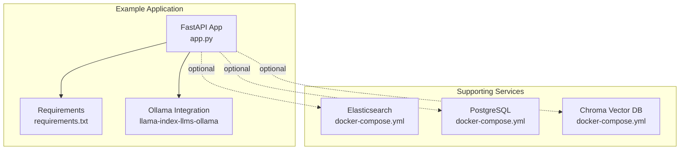
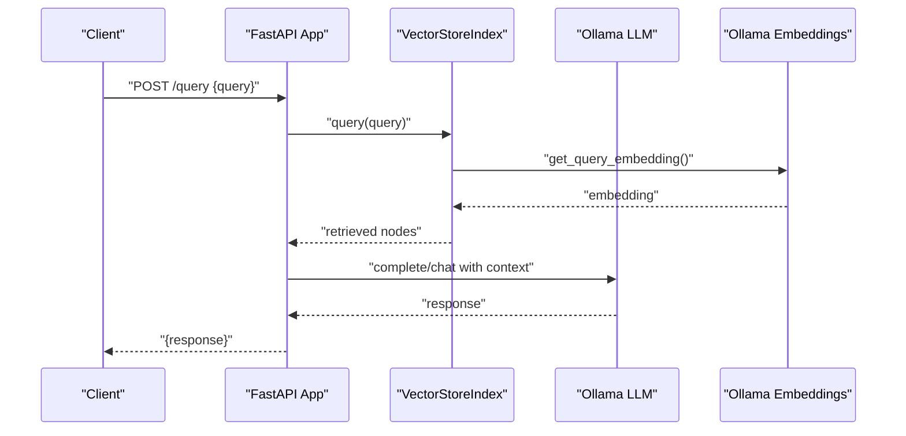
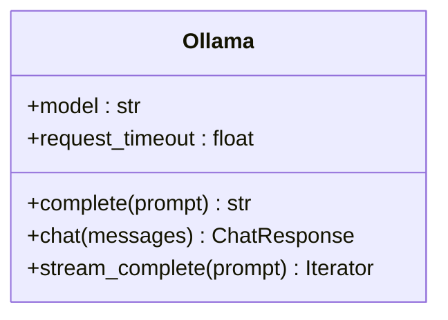
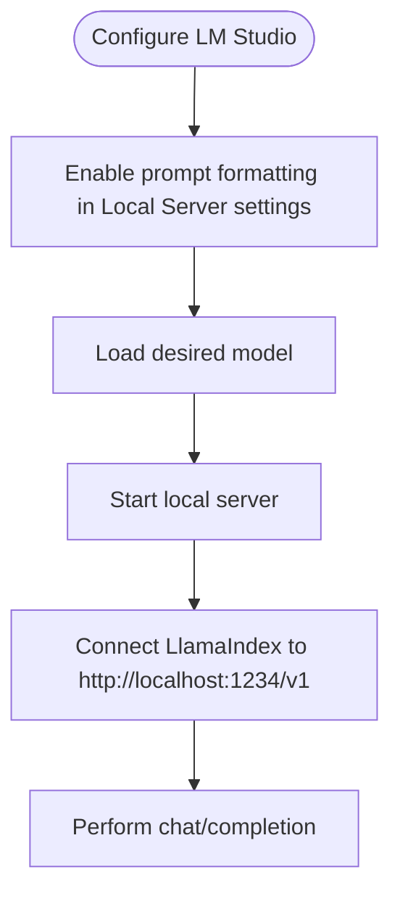
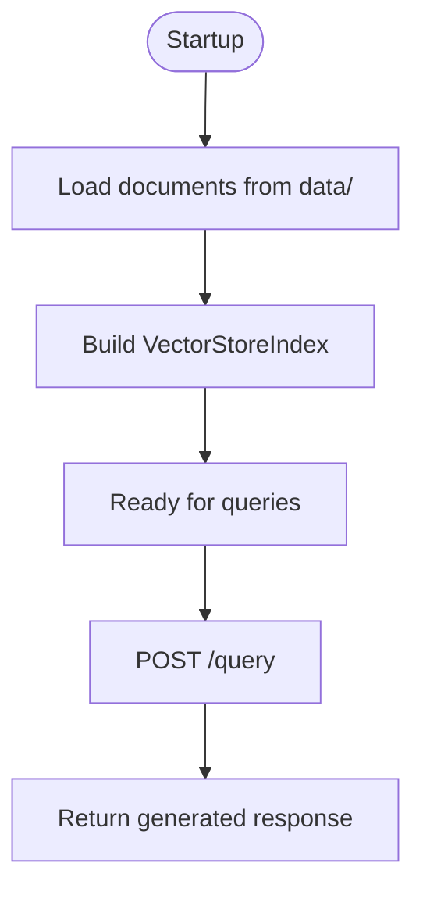
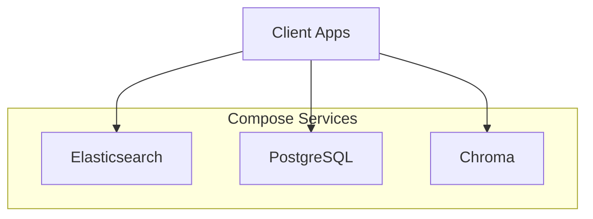
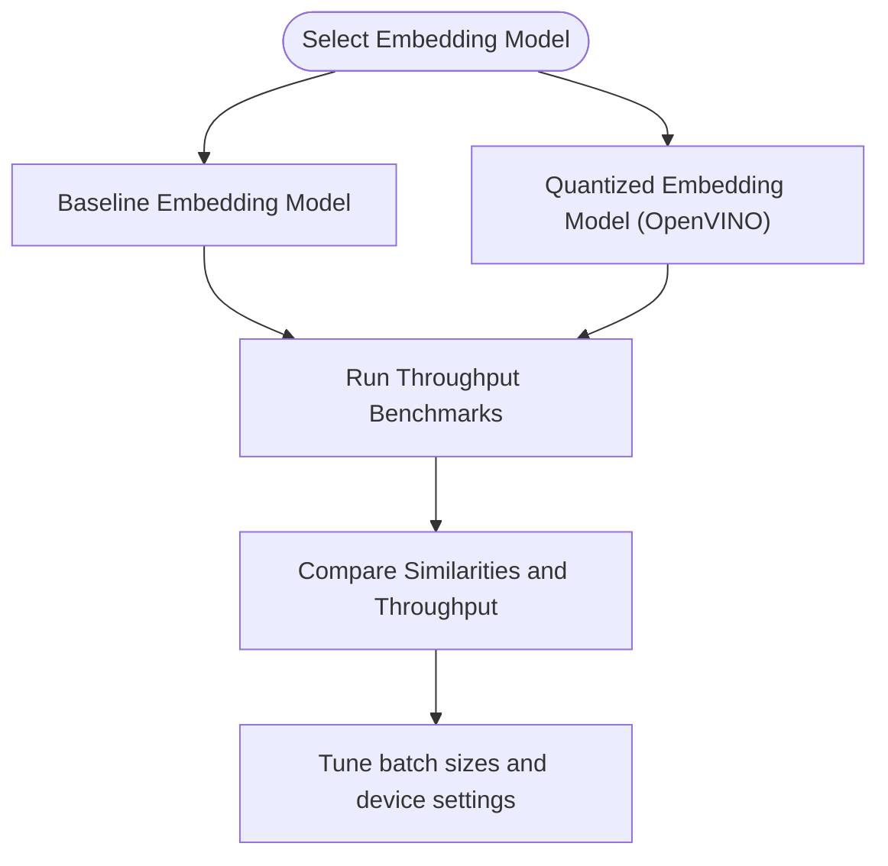
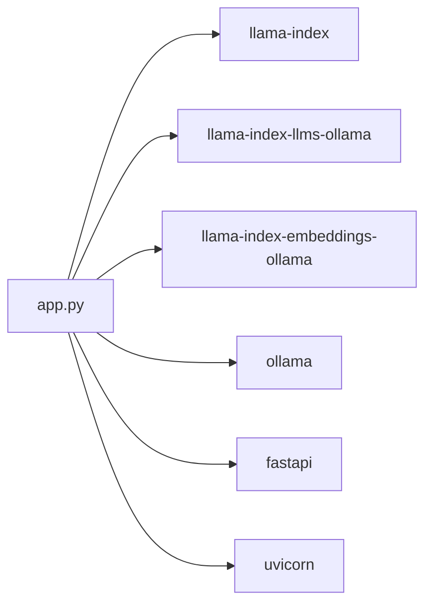

# Local and Edge Deployment

<cite>
**Referenced Files in This Document**
- [README.md](file://README.md)
- [examples/fastapi_rag_ollama/README.md](file://examples/fastapi_rag_ollama/README.md)
- [examples/fastapi_rag_ollama/app.py](file://examples/fastapi_rag_ollama/app.py)
- [examples/fastapi_rag_ollama/requirements.txt](file://examples/fastapi_rag_ollama/requirements.txt)
- [llama-index-core/tests/docker-compose.yml](file://llama-index-core/tests/docker-compose.yml)
- [llama-index-integrations/llms/llama-index-llms-ollama/README.md](file://llama-index-integrations/llms/llama-index-llms-ollama/README.md)
- [llama-index-integrations/llms/llama-index-llms-ollama/llama_index/llms/ollama/base.py](file://llama-index-integrations/llms/llama-index-llms-ollama/llama_index/llms/ollama/base.py)
- [llama-index-integrations/llms/llama-index-llms-lmstudio/README.md](file://llama-index-integrations/llms/llama-index-llms-lmstudio/README.md)
- [docs/src/content/docs/framework/module_guides/models/embeddings.md](file://docs/src/content/docs/framework/module_guides/models/embeddings.md)
- [SECURITY.md](file://SECURITY.md)
</cite>

## Table of Contents
1. [Introduction](#introduction)
2. [Project Structure](#project-structure)
3. [Core Components](#core-components)
4. [Architecture Overview](#architecture-overview)
5. [Detailed Component Analysis](#detailed-component-analysis)
6. [Dependency Analysis](#dependency-analysis)
7. [Performance Considerations](#performance-considerations)
8. [Security Best Practices](#security-best-practices)
9. [Troubleshooting Guide](#troubleshooting-guide)
10. [Conclusion](#conclusion)
11. [Appendices](#appendices)

## Introduction
This document provides a comprehensive guide to deploying and operating Large Language Model (LLM) systems in local and edge environments. It focuses on self-hosted and on-premises solutions, covering containerized deployments with Docker, local model serving via Ollama, desktop applications such as LM Studio, and edge computing scenarios. It also explains hardware requirements, memory optimization, GPU acceleration setup, and model quantization techniques. Practical examples demonstrate deploying popular models (Llama, Mistral, Mixtral), configuring local endpoints, and managing model updates. Performance tuning, resource allocation, and scaling considerations are addressed alongside security best practices for local model management, network isolation, and data privacy.

## Project Structure
The repository includes:
- A ready-to-run FastAPI + LlamaIndex RAG example using a local LLM via Ollama
- Docker Compose configurations for vector stores and supporting services
- LlamaIndex integrations for local LLM providers (Ollama, LM Studio)
- Documentation and examples for model quantization and performance tuning

**Diagram sources**
- [examples/fastapi_rag_ollama/app.py](file://examples/fastapi_rag_ollama/app.py#L1-L30)
- [examples/fastapi_rag_ollama/requirements.txt](file://examples/fastapi_rag_ollama/requirements.txt#L1-L7)
- [llama-index-core/tests/docker-compose.yml](file://llama-index-core/tests/docker-compose.yml#L1-L40)

**Section sources**
- [README.md](file://README.md)
- [examples/fastapi_rag_ollama/README.md](file://examples/fastapi_rag_ollama/README.md#L1-L58)
- [examples/fastapi_rag_ollama/app.py](file://examples/fastapi_rag_ollama/app.py#L1-L30)
- [examples/fastapi_rag_ollama/requirements.txt](file://examples/fastapi_rag_ollama/requirements.txt#L1-L7)
- [llama-index-core/tests/docker-compose.yml](file://llama-index-core/tests/docker-compose.yml#L1-L40)

## Core Components
- Local LLM Serving with Ollama
  - The Ollama integration enables local inference via a local Ollama server. The example app configures an Ollama-backed LLM and embeddings model for retrieval-augmented generation (RAG).
  - Key configuration points include model selection and request timeouts.

- Desktop Applications (LM Studio)
  - LM Studio supports local model serving via a local HTTP API. The integration allows connecting LlamaIndex to LM Studio’s local server for inference.

- Containerized Infrastructure
  - Docker Compose configurations are provided for Elasticsearch, PostgreSQL, and Chroma vector databases, enabling local or edge deployments of supporting infrastructure.

- Model Quantization and Performance Tuning
  - Documentation includes examples of quantizing embeddings using OpenVINO and measuring throughput improvements, offering practical guidance for memory optimization and performance tuning.

**Section sources**
- [examples/fastapi_rag_ollama/README.md](file://examples/fastapi_rag_ollama/README.md#L1-L58)
- [examples/fastapi_rag_ollama/app.py](file://examples/fastapi_rag_ollama/app.py#L11-L18)
- [llama-index-integrations/llms/llama-index-llms-ollama/README.md](file://llama-index-integrations/llms/llama-index-llms-ollama/README.md#L1-L65)
- [llama-index-integrations/llms/llama-index-llms-lmstudio/README.md](file://llama-index-integrations/llms/llama-index-llms-lmstudio/README.md#L1-L37)
- [llama-index-core/tests/docker-compose.yml](file://llama-index-core/tests/docker-compose.yml#L1-L40)
- [docs/src/content/docs/framework/module_guides/models/embeddings.md](file://docs/src/content/docs/framework/module_guides/models/embeddings.md#L201-L267)

## Architecture Overview
The example application demonstrates a typical local RAG pipeline:
- Documents are ingested and indexed at startup
- A local LLM (via Ollama) and local embeddings model (via Ollama) are configured
- An HTTP endpoint serves queries against the indexed corpus

**Diagram sources**
- [examples/fastapi_rag_ollama/app.py](file://examples/fastapi_rag_ollama/app.py#L25-L29)

**Section sources**
- [examples/fastapi_rag_ollama/app.py](file://examples/fastapi_rag_ollama/app.py#L1-L30)

## Detailed Component Analysis

### Ollama Integration
- Purpose: Connect LlamaIndex to a local Ollama server for both text generation and embeddings.
- Configuration highlights:
  - Model selection for the LLM and embeddings
  - Request timeout adjustments for long-running or large responses
  - Automatic model version resolution when specifying a model family

**Diagram sources**
- [llama-index-integrations/llms/llama-index-llms-ollama/llama_index/llms/ollama/base.py](file://llama-index-integrations/llms/llama-index-llms-ollama/llama_index/llms/ollama/base.py#L75-L92)

**Section sources**
- [llama-index-integrations/llms/llama-index-llms-ollama/README.md](file://llama-index-integrations/llms/llama-index-llms-ollama/README.md#L1-L65)
- [llama-index-integrations/llms/llama-index-llms-ollama/llama_index/llms/ollama/base.py](file://llama-index-integrations/llms/llama-index-llms-ollama/llama_index/llms/ollama/base.py#L75-L92)

### LM Studio Integration
- Purpose: Use LM Studio’s local HTTP server as a local LLM provider within LlamaIndex.
- Typical steps:
  - Launch LM Studio, load a model, and start the local server
  - Configure the LM Studio client with the appropriate base URL and model name

**Diagram sources**
- [llama-index-integrations/llms/llama-index-llms-lmstudio/README.md](file://llama-index-integrations/llms/llama-index-llms-lmstudio/README.md#L1-L37)

**Section sources**
- [llama-index-integrations/llms/llama-index-llms-lmstudio/README.md](file://llama-index-integrations/llms/llama-index-llms-lmstudio/README.md#L1-L37)

### FastAPI + Ollama RAG Example
- Purpose: Demonstrate a production-style RAG API using a local LLM and embeddings.
- Highlights:
  - Local-only operation (no external API keys)
  - Document ingestion and indexing at startup
  - Query endpoint returning answers generated by the local LLM

**Diagram sources**
- [examples/fastapi_rag_ollama/app.py](file://examples/fastapi_rag_ollama/app.py#L15-L18)
- [examples/fastapi_rag_ollama/app.py](file://examples/fastapi_rag_ollama/app.py#L25-L29)

**Section sources**
- [examples/fastapi_rag_ollama/README.md](file://examples/fastapi_rag_ollama/README.md#L1-L58)
- [examples/fastapi_rag_ollama/app.py](file://examples/fastapi_rag_ollama/app.py#L1-L30)
- [examples/fastapi_rag_ollama/requirements.txt](file://examples/fastapi_rag_ollama/requirements.txt#L1-L7)

### Supporting Services with Docker Compose
- Purpose: Provide local or edge-ready infrastructure for vector stores and auxiliary services.
- Included services:
  - Elasticsearch
  - PostgreSQL
  - Chroma vector database

**Diagram sources**
- [llama-index-core/tests/docker-compose.yml](file://llama-index-core/tests/docker-compose.yml#L1-L40)

**Section sources**
- [llama-index-core/tests/docker-compose.yml](file://llama-index-core/tests/docker-compose.yml#L1-L40)

### Model Quantization and Performance Tuning
- Purpose: Reduce memory footprint and improve throughput for embedding workloads.
- Example approach:
  - Use OpenVINO backend with quantized models on CPU
  - Benchmark baseline vs. quantized models and compare similarity scores

**Diagram sources**
- [docs/src/content/docs/framework/module_guides/models/embeddings.md](file://docs/src/content/docs/framework/module_guides/models/embeddings.md#L201-L267)

**Section sources**
- [docs/src/content/docs/framework/module_guides/models/embeddings.md](file://docs/src/content/docs/framework/module_guides/models/embeddings.md#L201-L267)

## Dependency Analysis
- Application dependencies for the Ollama RAG example include FastAPI, Uvicorn, LlamaIndex core, Ollama LLM and embeddings integrations, and the Ollama client.
- Integrations for local LLM providers (Ollama, LM Studio) decouple the application from cloud providers, simplifying local deployments.

**Diagram sources**
- [examples/fastapi_rag_ollama/app.py](file://examples/fastapi_rag_ollama/app.py#L1-L30)
- [examples/fastapi_rag_ollama/requirements.txt](file://examples/fastapi_rag_ollama/requirements.txt#L1-L7)

**Section sources**
- [examples/fastapi_rag_ollama/requirements.txt](file://examples/fastapi_rag_ollama/requirements.txt#L1-L7)
- [examples/fastapi_rag_ollama/app.py](file://examples/fastapi_rag_ollama/app.py#L1-L30)

## Performance Considerations
- Memory optimization
  - Use quantized embeddings (e.g., OpenVINO) to reduce memory usage on CPU.
  - Tune batch sizes and device placement for embeddings and LLM inference.
- Throughput tuning
  - Benchmark baseline vs. quantized models to quantify gains.
  - Adjust request timeouts for local LLMs to accommodate larger responses.
- Resource allocation
  - Allocate sufficient RAM for the vector store and model weights.
  - Prefer GPU acceleration when available; otherwise optimize CPU-bound workloads with quantization.
- Scaling
  - Horizontal scaling of supporting services (Elasticsearch, PostgreSQL, Chroma) via Docker Compose.
  - Consider sharding or partitioning strategies for large corpora.

[No sources needed since this section provides general guidance]

## Security Best Practices
- Input validation and sanitization
  - Validate and sanitize all user-supplied input before processing.
- Access control and isolation
  - Restrict exposure of local LLM endpoints to trusted networks.
  - Use reverse proxies or firewalls to limit access.
- Data privacy
  - Keep sensitive data local; avoid transmitting private content to external services.
- Operational hygiene
  - Regularly update local models and runtime components.
  - Monitor logs and apply least-privilege principles to services.

**Section sources**
- [SECURITY.md](file://SECURITY.md#L41-L55)

## Troubleshooting Guide
- Local LLM connectivity
  - Ensure the local LLM server (Ollama/LM Studio) is running and reachable at the configured address/port.
  - Verify model availability and correct model names.
- Timeout issues
  - Increase request timeouts for long-running generations or large prompts.
- Vector store readiness
  - Confirm that supporting services (Elasticsearch, PostgreSQL, Chroma) are healthy and reachable.
- Model updates
  - Rebuild indexes after updating or replacing models to ensure consistency.

**Section sources**
- [llama-index-integrations/llms/llama-index-llms-ollama/README.md](file://llama-index-integrations/llms/llama-index-llms-ollama/README.md#L11-L18)
- [llama-index-core/tests/docker-compose.yml](file://llama-index-core/tests/docker-compose.yml#L13-L21)

## Conclusion
By leveraging local LLM providers such as Ollama and LM Studio, along with containerized infrastructure and quantization techniques, organizations can deploy robust, privacy-preserving, and scalable LLM solutions in on-premises and edge environments. The provided example and integrations offer a practical foundation for building secure, efficient, and maintainable local deployments.

[No sources needed since this section summarizes without analyzing specific files]

## Appendices
- Practical deployment checklist
  - Install and configure local LLM servers
  - Pull and verify model availability
  - Set up supporting services with Docker Compose
  - Build and validate the RAG pipeline
  - Apply quantization and performance tuning
  - Enforce security policies and monitor operations

[No sources needed since this section provides general guidance]