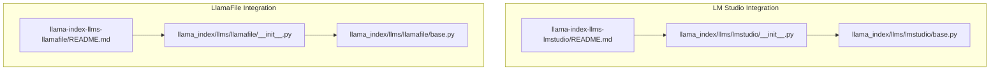
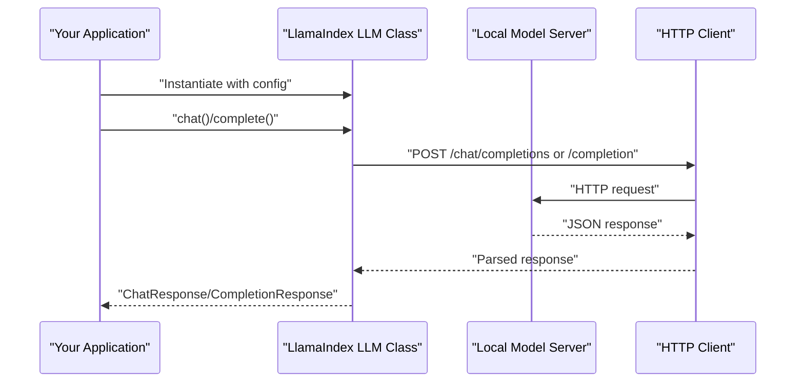
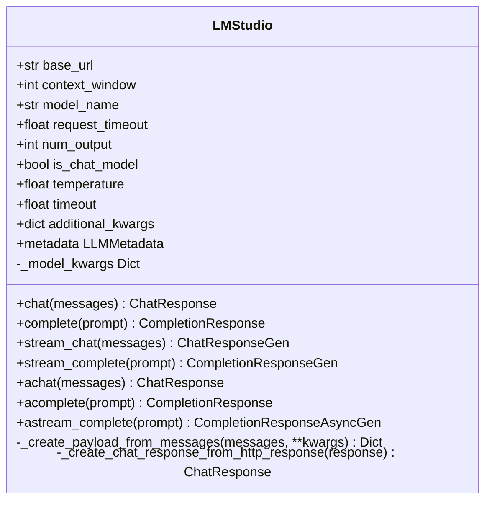
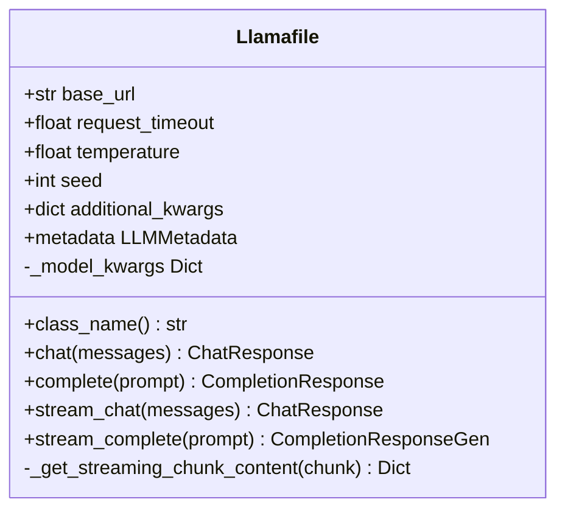
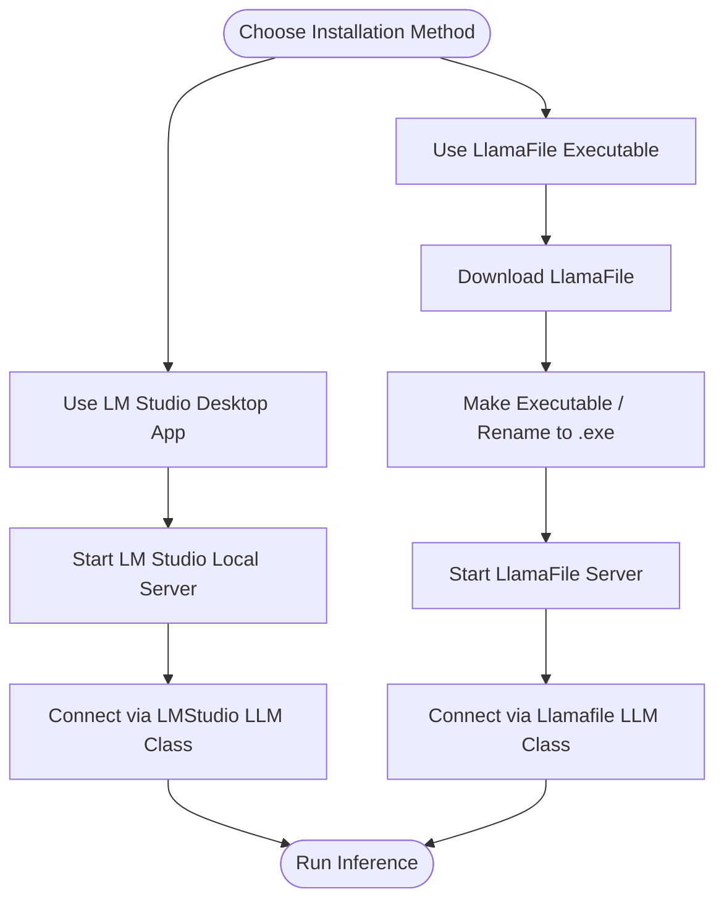
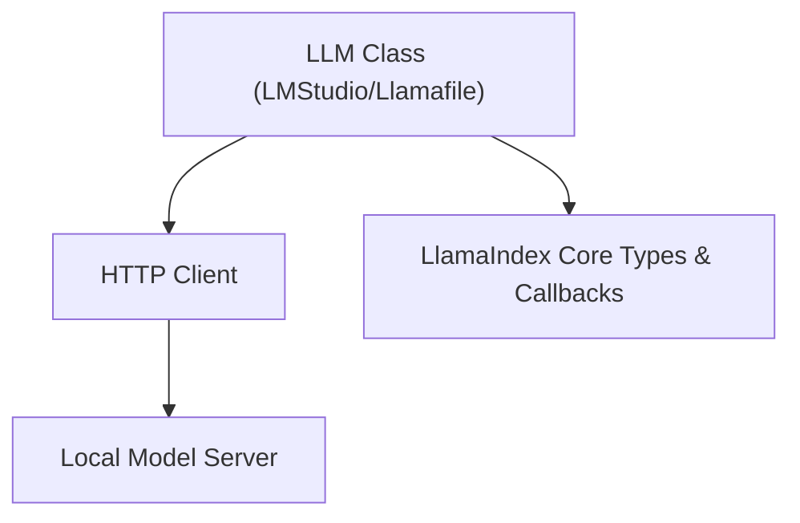

# Native Installations

<cite>
**Referenced Files in This Document**
- [README.md](file://llama-index-integrations/llms/llama-index-llms-lmstudio/README.md)
- [base.py](file://llama-index-integrations/llms/llama-index-llms-lmstudio/llama_index/llms/lmstudio/base.py)
- [__init__.py](file://llama-index-integrations/llms/llama-index-llms-lmstudio/llama_index/llms/lmstudio/__init__.py)
- [README.md](file://llama-index-integrations/llms/llama-index-llms-llamafile/README.md)
- [base.py](file://llama-index-integrations/llms/llama-index-llms-llamafile/llama_index/llms/llamafile/base.py)
- [__init__.py](file://llama-index-integrations/llms/llama-index-llms-llamafile/llama_index/llms/llamafile/__init__.py)
- [lmstudio.md](file://docs/api_reference/api_reference/llms/lmstudio.md)
- [llamafile.md](file://docs/api_reference/api_reference/llms/llamafile.md)
</cite>

## Table of Contents
1. [Introduction](#introduction)
2. [Project Structure](#project-structure)
3. [Core Components](#core-components)
4. [Architecture Overview](#architecture-overview)
5. [Detailed Component Analysis](#detailed-component-analysis)
6. [Dependency Analysis](#dependency-analysis)
7. [Performance Considerations](#performance-considerations)
8. [Troubleshooting Guide](#troubleshooting-guide)
9. [Conclusion](#conclusion)
10. [Appendices](#appendices)

## Introduction
This document explains how to install and run large language models natively on Windows, macOS, and Linux using two primary approaches present in the repository:
- Desktop application setup with LM Studio and the LlamaIndex LM Studio integration
- Standalone executable deployments via LlamaFile and the LlamaIndex LlamaFile integration

It consolidates the repository’s documented steps, implementation details, and API usage patterns to guide native installations, model selection, and runtime configuration. It also provides conceptual guidance for system requirements, platform-specific considerations, and performance tuning.

## Project Structure
The repository provides ready-to-use integrations for LM Studio and LlamaFile. The relevant components are organized as follows:
- LM Studio integration: package installation instructions, usage steps, and Python API surface
- LlamaFile integration: setup steps, model server invocation, and Python API surface
- API reference entries for both integrations

**Diagram sources**
- [README.md](file://llama-index-integrations/llms/llama-index-llms-lmstudio/README.md#L1-L37)
- [__init__.py](file://llama-index-integrations/llms/llama-index-llms-lmstudio/llama_index/llms/lmstudio/__init__.py#L1-L4)
- [base.py](file://llama-index-integrations/llms/llama-index-llms-lmstudio/llama_index/llms/lmstudio/base.py#L1-L246)
- [README.md](file://llama-index-integrations/llms/llama-index-llms-llamafile/README.md#L1-L108)
- [__init__.py](file://llama-index-integrations/llms/llama-index-llms-llamafile/llama_index/llms/llamafile/__init__.py#L1-L4)
- [base.py](file://llama-index-integrations/llms/llama-index-llms-llamafile/llama_index/llms/llamafile/base.py#L1-L279)

**Section sources**
- [README.md](file://llama-index-integrations/llms/llama-index-llms-lmstudio/README.md#L1-L37)
- [README.md](file://llama-index-integrations/llms/llama-index-llms-llamafile/README.md#L1-L108)
- [lmstudio.md](file://docs/api_reference/api_reference/llms/lmstudio.md#L1-L4)
- [llamafile.md](file://docs/api_reference/api_reference/llms/llamafile.md#L1-L4)

## Core Components
- LM Studio integration
  - Provides a Python class that communicates with an LM Studio local server over HTTP(S) using OpenAI-compatible endpoints
  - Supports chat, completions, streaming chat, and streaming completions
  - Exposes configurable parameters such as base URL, model name, timeouts, and sampling options
- LlamaFile integration
  - Provides a Python class that communicates with a LlamaFile server over HTTP(S)
  - Supports chat, completions, streaming chat, and streaming completions
  - Exposes configurable parameters such as base URL, request timeout, and sampling options

Both integrations are thin wrappers around HTTP APIs and rely on external model servers.

**Section sources**
- [base.py](file://llama-index-integrations/llms/llama-index-llms-lmstudio/llama_index/llms/lmstudio/base.py#L44-L246)
- [base.py](file://llama-index-integrations/llms/llama-index-llms-llamafile/llama_index/llms/llamafile/base.py#L29-L279)

## Architecture Overview
The integrations follow a consistent pattern: LlamaIndex applications instantiate an LLM class, which sends HTTP requests to a locally running model server. The servers expose OpenAI-compatible APIs.

**Diagram sources**
- [base.py](file://llama-index-integrations/llms/llama-index-llms-lmstudio/llama_index/llms/lmstudio/base.py#L127-L136)
- [base.py](file://llama-index-integrations/llms/llama-index-llms-llamafile/llama_index/llms/llamafile/base.py#L95-L133)

## Detailed Component Analysis

### LM Studio Integration
- Installation and usage steps are documented in the integration’s README
- The Python class encapsulates:
  - Base URL configuration for the LM Studio local server
  - Model selection and generation parameters
  - Synchronous and asynchronous chat/completion methods
  - Streaming variants for both chat and completions
  - Metadata exposure for context window and model identity

**Diagram sources**
- [base.py](file://llama-index-integrations/llms/llama-index-llms-lmstudio/llama_index/llms/lmstudio/base.py#L44-L246)

**Section sources**
- [README.md](file://llama-index-integrations/llms/llama-index-llms-lmstudio/README.md#L1-L37)
- [base.py](file://llama-index-integrations/llms/llama-index-llms-lmstudio/llama_index/llms/lmstudio/base.py#L44-L246)
- [__init__.py](file://llama-index-integrations/llms/llama-index-llms-lmstudio/llama_index/llms/lmstudio/__init__.py#L1-L4)
- [lmstudio.md](file://docs/api_reference/api_reference/llms/lmstudio.md#L1-L4)

### LlamaFile Integration
- Setup steps include downloading a LlamaFile, making it executable, and starting the model server
- The Python class encapsulates:
  - Base URL configuration for the LlamaFile server
  - Request timeout and sampling parameters
  - Synchronous and streaming chat/completion methods
  - Metadata indicating chat-capable behavior

**Diagram sources**
- [base.py](file://llama-index-integrations/llms/llama-index-llms-llamafile/llama_index/llms/llamafile/base.py#L29-L279)

**Section sources**
- [README.md](file://llama-index-integrations/llms/llama-index-llms-llamafile/README.md#L1-L108)
- [base.py](file://llama-index-integrations/llms/llama-index-llms-llamafile/llama_index/llms/llamafile/base.py#L29-L279)
- [__init__.py](file://llama-index-integrations/llms/llama-index-llms-llamafile/llama_index/llms/llamafile/__init__.py#L1-L4)
- [llamafile.md](file://docs/api_reference/api_reference/llms/llamafile.md#L1-L4)

### Conceptual Overview
- Desktop application setup (LM Studio): Launch the desktop app, configure the local server, load a model, and connect via the documented Python class
- Standalone executable deployment (LlamaFile): Download a single-file model, make it executable, start the server, and connect via the documented Python class

[No sources needed since this diagram shows conceptual workflow, not actual code structure]

## Dependency Analysis
- Both integrations depend on:
  - An HTTP client library for making requests to local servers
  - LlamaIndex core abstractions for LLM interfaces, callbacks, and response types
- The integrations are decoupled from model binaries; they communicate with local servers

**Diagram sources**
- [base.py](file://llama-index-integrations/llms/llama-index-llms-lmstudio/llama_index/llms/lmstudio/base.py#L1-L20)
- [base.py](file://llama-index-integrations/llms/llama-index-llms-llamafile/llama_index/llms/llamafile/base.py#L1-L18)

**Section sources**
- [base.py](file://llama-index-integrations/llms/llama-index-llms-lmstudio/llama_index/llms/lmstudio/base.py#L1-L20)
- [base.py](file://llama-index-integrations/llms/llama-index-llms-llamafile/llama_index/llms/llamafile/base.py#L1-L18)

## Performance Considerations
- Streaming responses reduce latency and improve interactivity
- Adjust sampling parameters (e.g., temperature) and timeouts per workload
- Ensure sufficient RAM/CPU headroom; avoid running heavy workloads while rendering graphics or other compute-intensive tasks
- On mobile devices, prefer lighter models and lower context windows to preserve battery life

[No sources needed since this section provides general guidance]

## Troubleshooting Guide
- LM Studio
  - Verify the local server is running and reachable at the configured base URL
  - Confirm the selected model is loaded and active in the desktop app
  - Check request timeouts and network connectivity
- LlamaFile
  - Ensure the model file is executable (Unix-like systems) or renamed to end with .exe (Windows)
  - Confirm the server is listening on the expected port and responding to requests
  - Validate that streaming responses are handled properly by the client

**Section sources**
- [README.md](file://llama-index-integrations/llms/llama-index-llms-lmstudio/README.md#L1-L37)
- [README.md](file://llama-index-integrations/llms/llama-index-llms-llamafile/README.md#L1-L108)

## Conclusion
The repository provides robust, production-ready integrations for running LLMs natively via LM Studio and LlamaFile. By following the documented setup steps and leveraging the exposed Python classes, you can deploy and run models efficiently on Windows, macOS, and Linux. For advanced scenarios, consider streaming, adjusting generation parameters, and monitoring resource usage.

## Appendices

### Step-by-Step Installation Guides (Conceptual)
- LM Studio desktop setup
  - Install the desktop application
  - Enable prompt formatting in the Local Server tab
  - Load a model and start the server
  - Instantiate the LMStudio LLM class in your application
- LlamaFile standalone deployment
  - Download a LlamaFile from a trusted source
  - Make the file executable (Unix-like) or rename to .exe (Windows)
  - Start the model server in server mode
  - Instantiate the Llamafile LLM class in your application

[No sources needed since this section provides general guidance]

### Model Format Compatibility and Quantization
- The integrations communicate via HTTP APIs compatible with OpenAI-style endpoints
- Quantization and model format are determined by the model server (LM Studio or LlamaFile); select appropriate GGUF or server-native formats supported by the chosen server

[No sources needed since this section provides general guidance]

### Platform-Specific Considerations
- Windows
  - Use the desktop application or rename LlamaFile to .exe
  - Ensure firewall allows local connections to the configured ports
- macOS and Linux
  - Make LlamaFiles executable with chmod
  - Ensure sufficient virtual memory and swap for larger models

[No sources needed since this section provides general guidance]

### Maintenance and Cleanup
- Keep model servers updated to supported versions
- Back up model files and configuration directories as applicable
- Periodically review and prune unused models to save disk space

[No sources needed since this section provides general guidance]