# Middleware and Proxy Solutions

<cite>
**Referenced Files in This Document**
- [README.md](file://llama-index-integrations/llms/llama-index-llms-litellm/README.md)
- [base.py](file://llama-index-integrations/llms/llama-index-llms-litellm/llama_index/llms/litellm/base.py)
- [utils.py](file://llama-index-integrations/llms/llama-index-llms-litellm/llama_index/llms/litellm/utils.py)
- [README.md](file://llama-index-integrations/llms/llama-index-llms-openrouter/README.md)
- [base.py](file://llama-index-integrations/llms/llama-index-llms-openrouter/llama_index/llms/openrouter/base.py)
- [README.md](file://llama-index-integrations/llms/llama-index-llms-portkey/README.md)
- [base.py](file://llama-index-integrations/llms/llama-index-llms-portkey/llama_index/llms/portkey/base.py)
- [utils.py](file://llama-index-integrations/llms/llama-index-llms-portkey/llama_index/llms/portkey/utils.py)
- [README.md](file://llama-index-integrations/llms/llama-index-llms-helicone/README.md)
- [base.py](file://llama-index-integrations/llms/llama-index-llms-helicone/llama_index/llms/helicone/base.py)
- [README.md](file://llama-index-integrations/llms/llama-index-llms-cloudflare-ai-gateway/README.md)
- [base.py](file://llama-index-integrations/llms/llama-index-llms-cloudflare-ai-gateway/llama_index/llms/cloudflare_ai_gateway/base.py)
- [providers.py](file://llama-index-integrations/llms/llama-index-llms-cloudflare-ai-gateway/llama_index/llms/cloudflare_ai_gateway/providers.py)
- [README.md](file://llama-index-integrations/llms/llama-index-llms-vercel-ai-gateway/README.md)
- [base.py](file://llama-index-integrations/llms/llama-index-llms-vercel-ai-gateway/llama_index/llms/vercel_ai_gateway/base.py)
</cite>

## Table of Contents
1. [Introduction](#introduction)
2. [Project Structure](#project-structure)
3. [Core Components](#core-components)
4. [Architecture Overview](#architecture-overview)
5. [Detailed Component Analysis](#detailed-component-analysis)
6. [Dependency Analysis](#dependency-analysis)
7. [Performance Considerations](#performance-considerations)
8. [Troubleshooting Guide](#troubleshooting-guide)
9. [Conclusion](#conclusion)
10. [Appendices](#appendices)

## Introduction
This document explains middleware and proxy LLM integration solutions that provide unified access to multiple providers, enhanced observability, and advanced routing capabilities. It focuses on:
- LiteLLM for provider abstraction and load balancing
- LangChain integration patterns
- Helicone for monitoring and analytics
- OpenRouter for multi-provider routing
- Portkey for provider switching and caching
- Cloudflare and Vercel AI Gateways as cloud gateway solutions

These middleware enable provider-agnostic applications, automatic failover, rate limiting, and cost optimization. Practical guidance is included for routing logic, fallback strategies, monitoring, API key management, request/response transformation, caching, and production best practices.

## Project Structure
The repository organizes middleware integrations under dedicated packages per provider. Each package exposes a thin wrapper around LlamaIndex’s LLM abstractions, adding routing, observability, or gateway features.

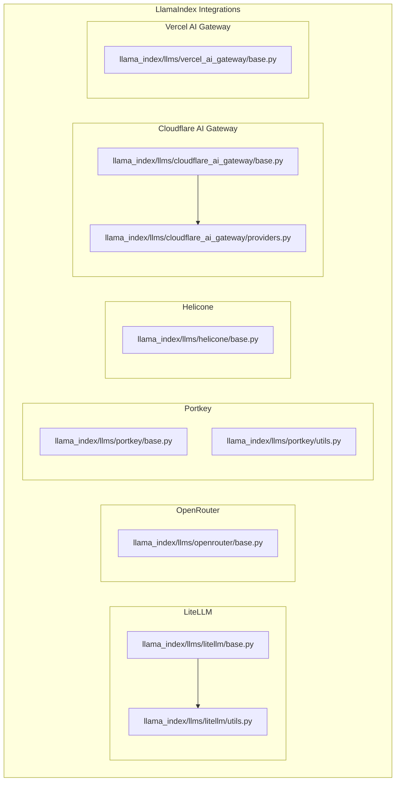

**Diagram sources**
- [base.py](file://llama-index-integrations/llms/llama-index-llms-litellm/llama_index/llms/litellm/base.py#L1-L597)
- [utils.py](file://llama-index-integrations/llms/llama-index-llms-litellm/llama_index/llms/litellm/utils.py)
- [base.py](file://llama-index-integrations/llms/llama-index-llms-openrouter/llama_index/llms/openrouter/base.py#L1-L113)
- [base.py](file://llama-index-integrations/llms/llama-index-llms-portkey/llama_index/llms/portkey/base.py#L1-L361)
- [utils.py](file://llama-index-integrations/llms/llama-index-llms-portkey/llama_index/llms/portkey/utils.py)
- [base.py](file://llama-index-integrations/llms/llama-index-llms-helicone/llama_index/llms/helicone/base.py#L1-L114)
- [base.py](file://llama-index-integrations/llms/llama-index-llms-cloudflare-ai-gateway/llama_index/llms/cloudflare_ai_gateway/base.py#L1-L512)
- [providers.py](file://llama-index-integrations/llms/llama-index-llms-cloudflare-ai-gateway/llama_index/llms/cloudflare_ai_gateway/providers.py)
- [base.py](file://llama-index-integrations/llms/llama-index-llms-vercel-ai-gateway/llama_index/llms/vercel_ai_gateway/base.py#L1-L147)

**Section sources**
- [README.md](file://llama-index-integrations/llms/llama-index-llms-litellm/README.md#L1-L102)
- [README.md](file://llama-index-integrations/llms/llama-index-llms-openrouter/README.md#L1-L101)
- [README.md](file://llama-index-integrations/llms/llama-index-llms-portkey/README.md#L1-L2)
- [README.md](file://llama-index-integrations/llms/llama-index-llms-helicone/README.md#L1-L84)
- [README.md](file://llama-index-integrations/llms/llama-index-llms-cloudflare-ai-gateway/README.md#L1-L72)
- [README.md](file://llama-index-integrations/llms/llama-index-llms-vercel-ai-gateway/README.md#L1-L83)

## Core Components
- LiteLLM: Provider-agnostic LLM wrapper supporting chat, streaming, async, function calling, and retry logic. It normalizes provider APIs and supports local providers.
- OpenRouter: Routes requests across providers with explicit ordering and fallback controls.
- Portkey: Provider switching, virtual keys, and semantic caching with configurable modes.
- Helicone: Observability and analytics via an OpenAI-compatible gateway; requires only a Helicone API key.
- Cloudflare AI Gateway: Intercepts provider SDK calls, routes through Cloudflare, and supports automatic fallback, streaming, async, and caching.
- Vercel AI Gateway: OpenAI-compatible gateway with OIDC or API key auth and customizable headers.

Key capabilities:
- Unified provider abstraction
- Automatic failover and load balancing
- Enhanced observability and analytics
- Request/response transformation
- Caching strategies
- Rate limiting and cost optimization

**Section sources**
- [base.py](file://llama-index-integrations/llms/llama-index-llms-litellm/llama_index/llms/litellm/base.py#L64-L597)
- [base.py](file://llama-index-integrations/llms/llama-index-llms-openrouter/llama_index/llms/openrouter/base.py#L17-L113)
- [base.py](file://llama-index-integrations/llms/llama-index-llms-portkey/llama_index/llms/portkey/base.py#L43-L361)
- [base.py](file://llama-index-integrations/llms/llama-index-llms-helicone/llama_index/llms/helicone/base.py#L17-L114)
- [base.py](file://llama-index-integrations/llms/llama-index-llms-cloudflare-ai-gateway/llama_index/llms/cloudflare_ai_gateway/base.py#L119-L512)
- [base.py](file://llama-index-integrations/llms/llama-index-llms-vercel-ai-gateway/llama_index/llms/vercel_ai_gateway/base.py#L17-L147)

## Architecture Overview
The middleware stack sits between your application and provider SDKs. It intercepts or wraps LLM calls to add routing, observability, and resilience.

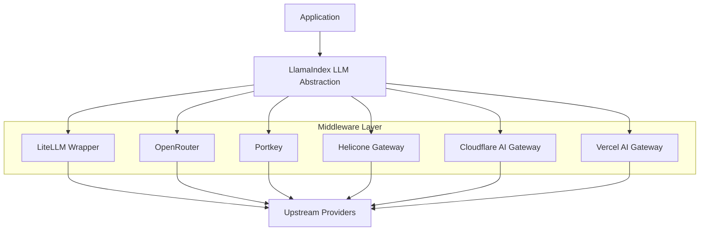

**Diagram sources**
- [base.py](file://llama-index-integrations/llms/llama-index-llms-litellm/llama_index/llms/litellm/base.py#L64-L597)
- [base.py](file://llama-index-integrations/llms/llama-index-llms-openrouter/llama_index/llms/openrouter/base.py#L17-L113)
- [base.py](file://llama-index-integrations/llms/llama-index-llms-portkey/llama_index/llms/portkey/base.py#L43-L361)
- [base.py](file://llama-index-integrations/llms/llama-index-llms-helicone/llama_index/llms/helicone/base.py#L17-L114)
- [base.py](file://llama-index-integrations/llms/llama-index-llms-cloudflare-ai-gateway/llama_index/llms/cloudflare_ai_gateway/base.py#L119-L512)
- [base.py](file://llama-index-integrations/llms/llama-index-llms-vercel-ai-gateway/llama_index/llms/vercel_ai_gateway/base.py#L17-L147)

## Detailed Component Analysis

### LiteLLM Integration
LiteLLM provides a unified interface across providers, with robust streaming, async support, function calling, and retry logic. It validates API keys, converts messages to provider-friendly formats, and normalizes responses.

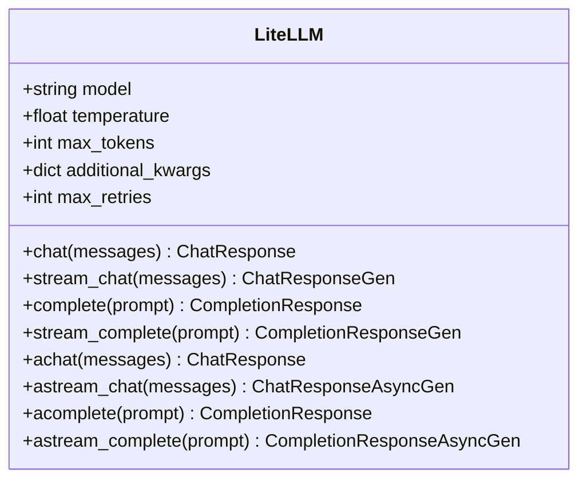

**Diagram sources**
- [base.py](file://llama-index-integrations/llms/llama-index-llms-litellm/llama_index/llms/litellm/base.py#L64-L597)

Key capabilities:
- Provider-agnostic model selection
- Streaming and async endpoints
- Function calling support
- Retry with exponential backoff
- Token usage reporting

Operational flow for chat completion:

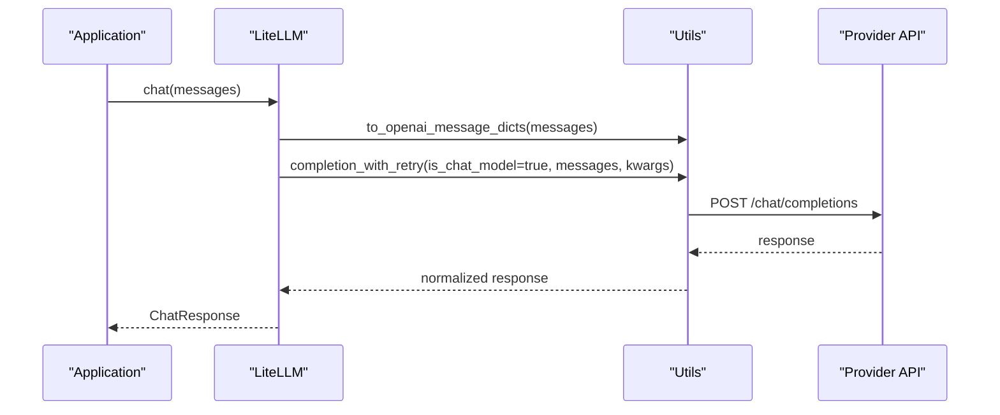

**Diagram sources**
- [base.py](file://llama-index-integrations/llms/llama-index-llms-litellm/llama_index/llms/litellm/base.py#L286-L374)
- [utils.py](file://llama-index-integrations/llms/llama-index-llms-litellm/llama_index/llms/litellm/utils.py)

Best practices:
- Set environment variables for provider keys
- Use streaming for latency-sensitive UX
- Configure max_retries and max_tokens per workload
- Enable function calling for tool-use scenarios

**Section sources**
- [README.md](file://llama-index-integrations/llms/llama-index-llms-litellm/README.md#L12-L102)
- [base.py](file://llama-index-integrations/llms/llama-index-llms-litellm/llama_index/llms/litellm/base.py#L64-L597)

### OpenRouter Integration
OpenRouter enables multi-provider routing with explicit provider ordering and optional fallbacks. It extends an OpenAI-like interface and injects routing hints via additional kwargs.

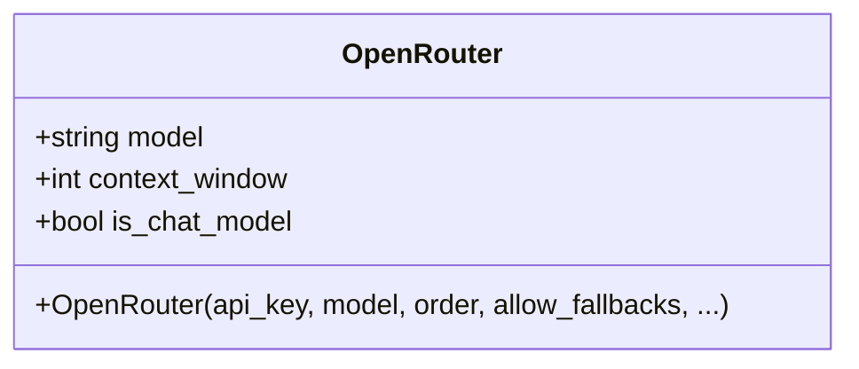

Routing logic:

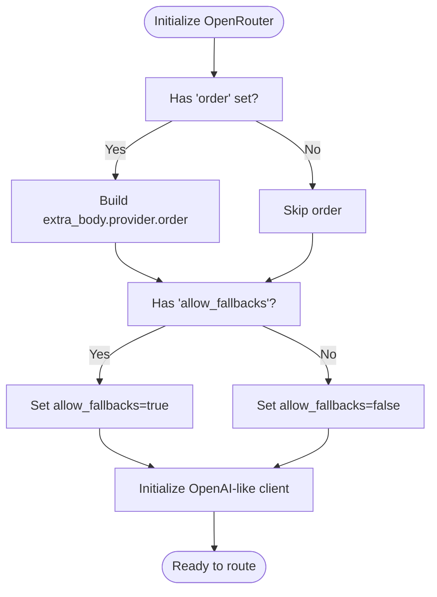

**Diagram sources**
- [base.py](file://llama-index-integrations/llms/llama-index-llms-openrouter/llama_index/llms/openrouter/base.py#L59-L108)

Operational flow:

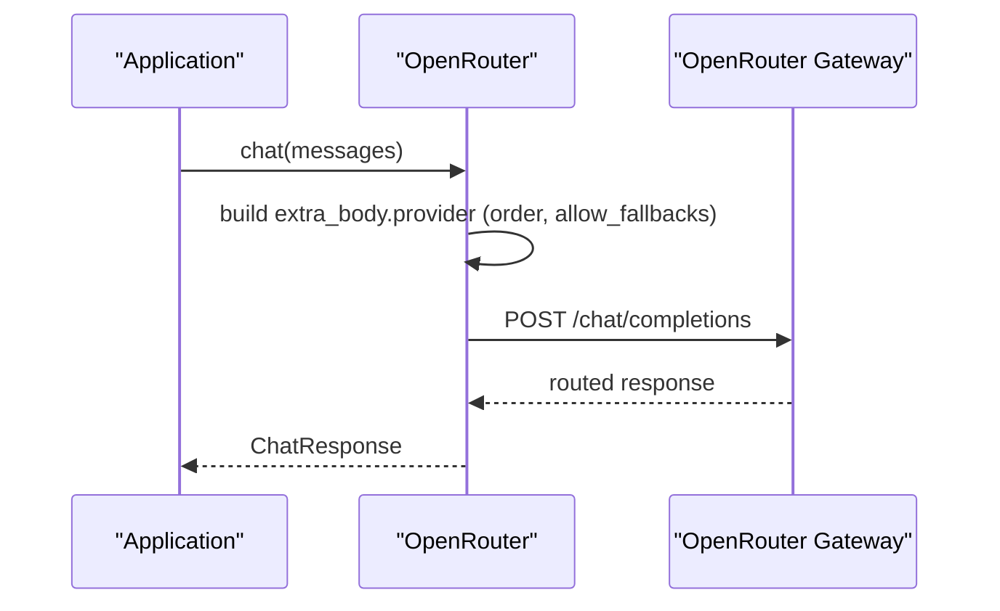

**Diagram sources**
- [base.py](file://llama-index-integrations/llms/llama-index-llms-openrouter/llama_index/llms/openrouter/base.py#L17-L113)

Best practices:
- Explicitly set provider order for deterministic routing
- Enable fallbacks for resilience
- Use model context windows to avoid oversized prompts

**Section sources**
- [README.md](file://llama-index-integrations/llms/llama-index-llms-openrouter/README.md#L80-L96)
- [base.py](file://llama-index-integrations/llms/llama-index-llms-openrouter/llama_index/llms/openrouter/base.py#L17-L113)

### Portkey Integration
Portkey centralizes provider switching, virtual keys, and caching. It supports multiple LLM configurations and exposes streaming and async endpoints.

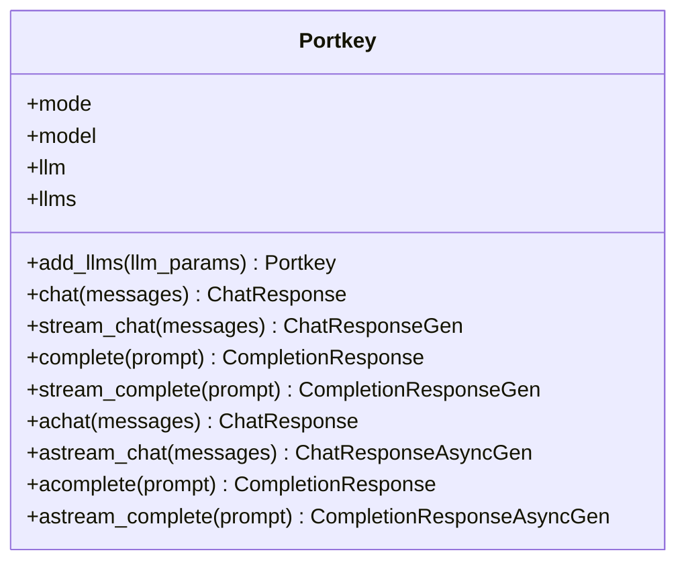

Provider switching and caching flow:

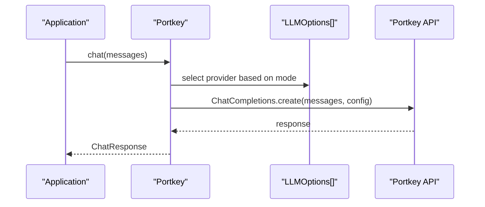

**Diagram sources**
- [base.py](file://llama-index-integrations/llms/llama-index-llms-portkey/llama_index/llms/portkey/base.py#L43-L361)

Best practices:
- Use semantic caching for repetitive queries
- Configure weights and metadata per LLM option
- Employ Modes for deterministic routing vs. load balancing

**Section sources**
- [README.md](file://llama-index-integrations/llms/llama-index-llms-portkey/README.md#L1-L2)
- [base.py](file://llama-index-integrations/llms/llama-index-llms-portkey/llama_index/llms/portkey/base.py#L43-L361)

### Helicone Integration
Helicone acts as an OpenAI-compatible gateway for observability and analytics. It routes requests through a centralized endpoint and requires only a Helicone API key.

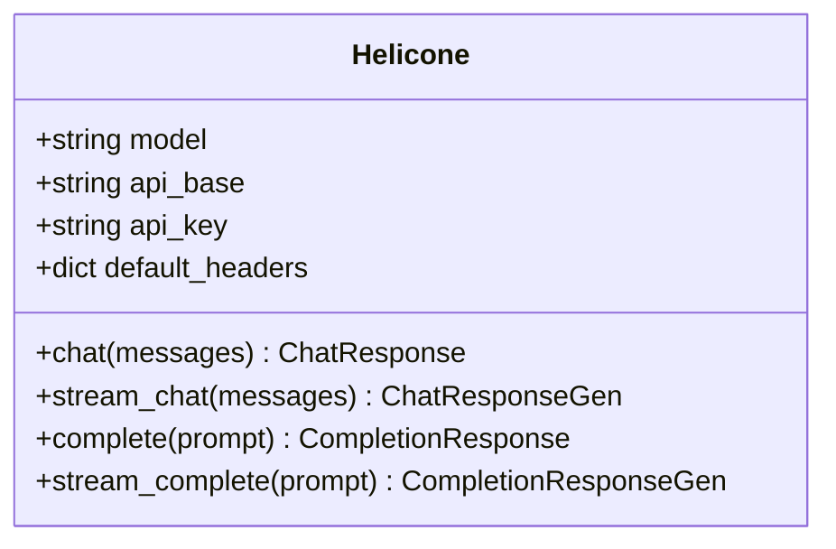

Routing and observability flow:

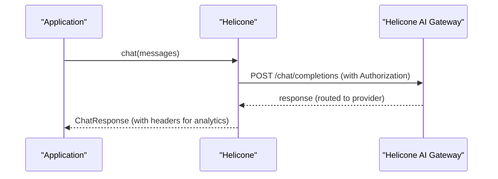

**Diagram sources**
- [base.py](file://llama-index-integrations/llms/llama-index-llms-helicone/llama_index/llms/helicone/base.py#L17-L114)

Best practices:
- Set HELICONE_API_KEY and optional HELICONE_API_BASE
- Use default_headers for custom properties and tags
- Leverage built-in analytics dashboards for latency and cost insights

**Section sources**
- [README.md](file://llama-index-integrations/llms/llama-index-llms-helicone/README.md#L12-L84)
- [base.py](file://llama-index-integrations/llms/llama-index-llms-helicone/llama_index/llms/helicone/base.py#L17-L114)

### Cloudflare AI Gateway Integration
Cloudflare AI Gateway intercepts provider SDK calls, transforms them, and routes through the gateway with automatic fallback across providers. It supports streaming, async, and caching.

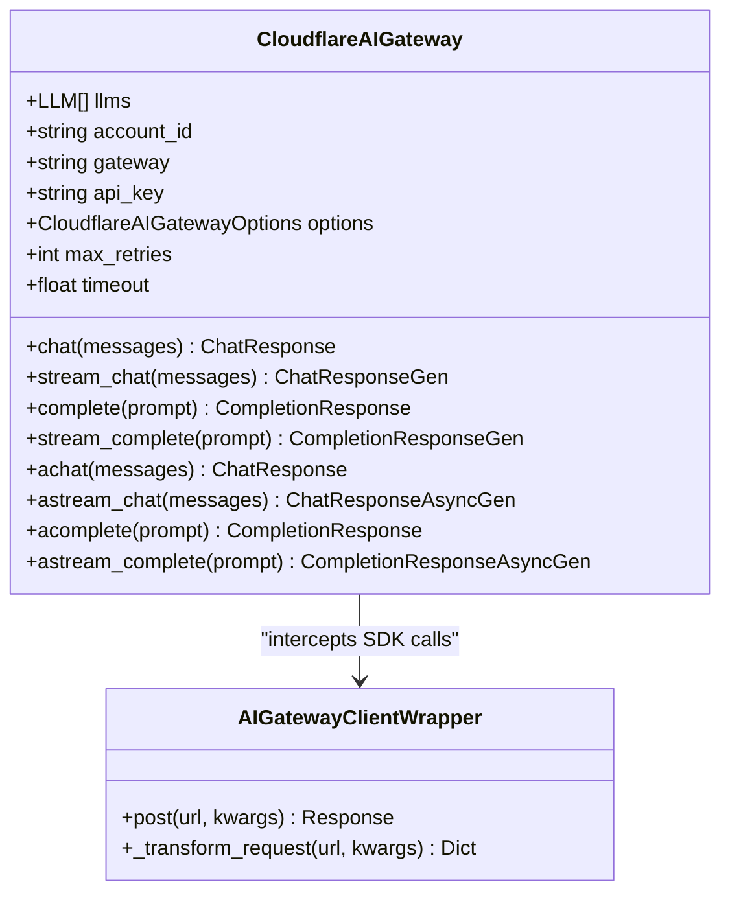

Automatic fallback and caching flow:

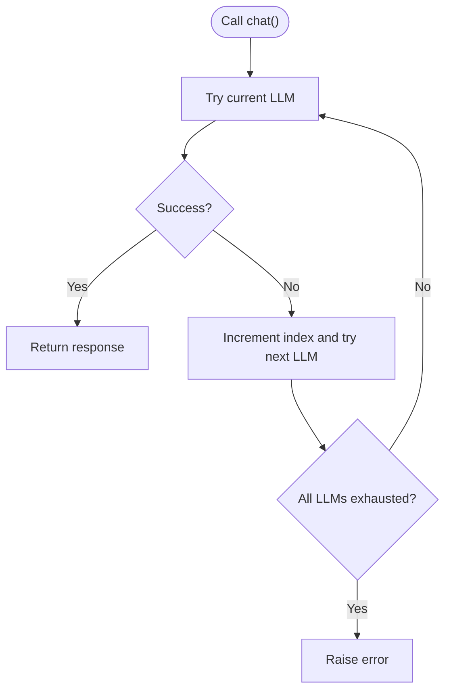

**Diagram sources**
- [base.py](file://llama-index-integrations/llms/llama-index-llms-cloudflare-ai-gateway/llama_index/llms/cloudflare_ai_gateway/base.py#L119-L512)

Implementation highlights:
- Client injection via AIGatewayClientWrapper
- Header-based options parsing (cache TTL, metadata, timeouts)
- Error handling for unauthorized and missing gateways
- Streaming and async support delegated to underlying LLMs

**Section sources**
- [README.md](file://llama-index-integrations/llms/llama-index-llms-cloudflare-ai-gateway/README.md#L1-L72)
- [base.py](file://llama-index-integrations/llms/llama-index-llms-cloudflare-ai-gateway/llama_index/llms/cloudflare_ai_gateway/base.py#L119-L512)
- [providers.py](file://llama-index-integrations/llms/llama-index-llms-cloudflare-ai-gateway/llama_index/llms/cloudflare_ai_gateway/providers.py)

### Vercel AI Gateway Integration
Vercel AI Gateway provides OpenAI-compatible access with OIDC or API key authentication and customizable headers.

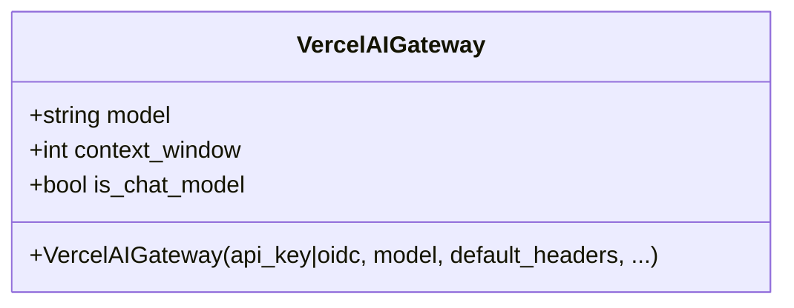

Authentication precedence and request flow:

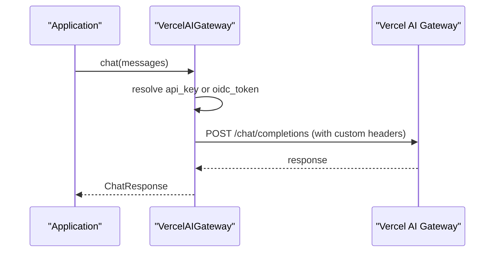

**Diagram sources**
- [base.py](file://llama-index-integrations/llms/llama-index-llms-vercel-ai-gateway/llama_index/llms/vercel_ai_gateway/base.py#L17-L147)

Best practices:
- Prefer OIDC tokens for server-side deployments
- Customize http-referer and x-title headers for attribution
- Use environment variables for credentials

**Section sources**
- [README.md](file://llama-index-integrations/llms/llama-index-llms-vercel-ai-gateway/README.md#L1-L83)
- [base.py](file://llama-index-integrations/llms/llama-index-llms-vercel-ai-gateway/llama_index/llms/vercel_ai_gateway/base.py#L17-L147)

## Dependency Analysis
- LiteLLM depends on provider SDKs and internal utilities for message conversion and retries.
- OpenRouter relies on an OpenAI-like base and injects routing hints via extra_body.
- Portkey depends on the external portkey library and LLMOptions for provider configuration.
- Helicone depends on OpenAI-like base and adds authorization headers.
- Cloudflare AI Gateway wraps provider clients and transforms requests for the gateway.
- Vercel AI Gateway depends on OpenAI-like base and resolves credentials from multiple sources.

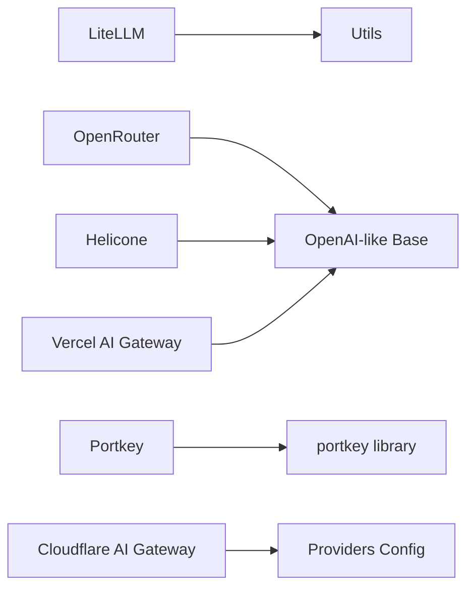

**Diagram sources**
- [base.py](file://llama-index-integrations/llms/llama-index-llms-litellm/llama_index/llms/litellm/base.py#L44-L53)
- [base.py](file://llama-index-integrations/llms/llama-index-llms-openrouter/llama_index/llms/openrouter/base.py#L10-L11)
- [base.py](file://llama-index-integrations/llms/llama-index-llms-portkey/llama_index/llms/portkey/base.py#L25-L30)
- [base.py](file://llama-index-integrations/llms/llama-index-llms-helicone/llama_index/llms/helicone/base.py#L8-L9)
- [base.py](file://llama-index-integrations/llms/llama-index-llms-cloudflare-ai-gateway/llama_index/llms/cloudflare_ai_gateway/base.py#L31)
- [base.py](file://llama-index-integrations/llms/llama-index-llms-vercel-ai-gateway/llama_index/llms/vercel_ai_gateway/base.py#L10-L11)

**Section sources**
- [base.py](file://llama-index-integrations/llms/llama-index-llms-litellm/llama_index/llms/litellm/base.py#L44-L53)
- [base.py](file://llama-index-integrations/llms/llama-index-llms-openrouter/llama_index/llms/openrouter/base.py#L10-L11)
- [base.py](file://llama-index-integrations/llms/llama-index-llms-portkey/llama_index/llms/portkey/base.py#L25-L30)
- [base.py](file://llama-index-integrations/llms/llama-index-llms-helicone/llama_index/llms/helicone/base.py#L8-L9)
- [base.py](file://llama-index-integrations/llms/llama-index-llms-cloudflare-ai-gateway/llama_index/llms/cloudflare_ai_gateway/base.py#L31)
- [base.py](file://llama-index-integrations/llms/llama-index-llms-vercel-ai-gateway/llama_index/llms/vercel_ai_gateway/base.py#L10-L11)

## Performance Considerations
- Streaming reduces perceived latency and enables progressive rendering.
- Async endpoints improve throughput under concurrent loads.
- Caching (semantic, gateway TTL) reduces repeated compute costs.
- Retry with jitter prevents thundering herd effects.
- Context-aware token limits prevent oversized prompts and reduce failures.

[No sources needed since this section provides general guidance]

## Troubleshooting Guide
Common issues and resolutions:
- Unauthorized or invalid gateway credentials
  - Verify API keys and bindings for Cloudflare/Vercel gateways.
  - Confirm OIDC tokens for Vercel when applicable.
- Gateway does not exist or misconfigured
  - Check account_id and gateway name; ensure correct base URL.
- Provider-specific errors
  - Inspect wrapped responses for provider error codes.
  - Use fallback chains to mitigate transient provider outages.
- Streaming interruptions
  - Re-establish streams; ensure network stability and timeouts.
- Cost spikes
  - Enable caching and monitor token usage via observability dashboards.

**Section sources**
- [base.py](file://llama-index-integrations/llms/llama-index-llms-cloudflare-ai-gateway/llama_index/llms/cloudflare_ai_gateway/base.py#L332-L367)
- [base.py](file://llama-index-integrations/llms/llama-index-llms-vercel-ai-gateway/llama_index/llms/vercel_ai_gateway/base.py#L109-L122)

## Conclusion
By leveraging these middleware and proxy solutions, applications gain:
- Provider-agnostic LLM access
- Automatic failover and load balancing
- Rich observability and analytics
- Advanced routing and caching
- Security and compliance controls

Adopt the appropriate middleware based on your needs—LiteLLM for broad provider coverage, OpenRouter for explicit routing, Portkey for virtual keys and caching, Helicone for observability, and Cloudflare/Vercel gateways for cloud-native routing and resilience.

[No sources needed since this section summarizes without analyzing specific files]

## Appendices

### Practical Setup Examples
- LiteLLM
  - Initialize with environment variables and call chat/complete/stream endpoints.
  - Reference: [README.md](file://llama-index-integrations/llms/llama-index-llms-litellm/README.md#L12-L102)
- OpenRouter
  - Configure order and allow_fallbacks for deterministic routing.
  - Reference: [README.md](file://llama-index-integrations/llms/llama-index-llms-openrouter/README.md#L80-L96)
- Portkey
  - Add multiple LLMOptions and configure caching and weights.
  - Reference: [base.py](file://llama-index-integrations/llms/llama-index-llms-portkey/llama_index/llms/portkey/base.py#L156-L196)
- Helicone
  - Set HELICONE_API_KEY and use model routing through the gateway.
  - Reference: [README.md](file://llama-index-integrations/llms/llama-index-llms-helicone/README.md#L12-L84)
- Cloudflare AI Gateway
  - Provide multiple LLMs and configure account_id, gateway, and api_key.
  - Reference: [README.md](file://llama-index-integrations/llms/llama-index-llms-cloudflare-ai-gateway/README.md#L19-L45)
- Vercel AI Gateway
  - Choose OIDC or API key; customize headers for attribution.
  - Reference: [README.md](file://llama-index-integrations/llms/llama-index-llms-vercel-ai-gateway/README.md#L12-L83)

### Best Practices for Production
- Security
  - Store API keys in environment variables or secret managers.
  - Prefer OIDC tokens for serverless environments.
- Resilience
  - Use automatic fallback chains and bounded retries.
  - Monitor provider health and adjust routing policies.
- Observability
  - Enable telemetry and analytics via Helicone or provider dashboards.
  - Tag requests with custom properties for cost attribution.
- Performance
  - Enable streaming and async endpoints.
  - Apply caching strategies (semantic and gateway TTL).
  - Right-size max_tokens and context windows.

[No sources needed since this section provides general guidance]