# Specialized and Emerging Providers

<cite>
**Referenced Files in This Document**
- [base.py](file://llama-index-integrations/llms/llama-index-llms-mistralai/llama_index/llms/mistralai/base.py)
- [base.py](file://llama-index-integrations/llms/llama-index-llms-together/llama_index/llms/together/base.py)
- [base.py](file://llama-index-integrations/llms/llama-index-llms-fireworks/llama_index/llms/fireworks/base.py)
- [base.py](file://llama-index-integrations/llms/llama-index-llms-deepseek/llama_index/llms/deepseek/base.py)
- [base.py](file://llama-index-integrations/llms/llama-index-llms-vertex/llama_index/llms/vertex/base.py)
- [base.py](file://llama-index-integrations/llms/llama-index-llms-modelscope/llama_index/llms/modelscope/base.py)
- [base.py](file://llama-index-integrations/llms/llama-index-llms-qianfan/llama_index/llms/qianfan/base.py)
- [base.py](file://llama-index-integrations/llms/llama-index-llms-zhipuai/llama_index/llms/zhipuai/base.py)
- [providers.py](file://llama-index-integrations/llms/llama-index-llms-cloudflare-ai-gateway/llama_index/llms/cloudflare_ai_gateway/providers.py)
- [base.py](file://llama-index-integrations/llms/llama-index-llms-siliconflow/llama_index/llms/siliconflow/base.py)
</cite>

## Table of Contents
1. [Introduction](#introduction)
2. [Project Structure](#project-structure)
3. [Core Components](#core-components)
4. [Architecture Overview](#architecture-overview)
5. [Detailed Component Analysis](#detailed-component-analysis)
6. [Dependency Analysis](#dependency-analysis)
7. [Performance Considerations](#performance-considerations)
8. [Troubleshooting Guide](#troubleshooting-guide)
9. [Conclusion](#conclusion)
10. [Appendices](#appendices)

## Introduction
This document focuses on specialized and emerging Large Language Model (LLM) provider integrations within the repository. It covers niche providers, regional services, and innovative deployment methods, including Mistral AI, Together AI, Fireworks AI, DeepSeek, IBM watsonx, Oracle AI, Google Vertex AI, ModelScope, Baidu Qianfan, and Zhipuai. For each provider, we explain strengths, target markets, and unique features, and provide configuration guidance for enterprise-grade deployments, hybrid cloud scenarios, and regional compliance. We also outline integration patterns for multi-region deployments, disaster recovery, and regulatory compliance, along with evaluation criteria, migration strategies, and cost optimization techniques tailored to specialized workloads.

## Project Structure
The repository organizes provider integrations under dedicated packages per LLM provider. Each integration exposes a provider-specific LLM class that adheres to the LlamaIndex LLM interface, enabling drop-in replacement and consistent behavior across providers. The structure supports:
- Provider-specific LLM classes with standardized methods for chat, completion, streaming, and asynchronous operations
- Environment-based configuration via API keys and endpoints
- Function calling and tool invocation support where applicable
- Metadata reporting for context windows and model capabilities

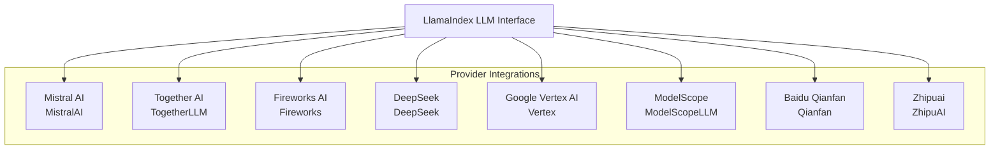

**Diagram sources**
- [base.py](file://llama-index-integrations/llms/llama-index-llms-mistralai/llama_index/llms/mistralai/base.py#L178-L301)
- [base.py](file://llama-index-integrations/llms/llama-index-llms-together/llama_index/llms/together/base.py#L7-L52)
- [base.py](file://llama-index-integrations/llms/llama-index-llms-fireworks/llama_index/llms/fireworks/base.py#L18-L97)
- [base.py](file://llama-index-integrations/llms/llama-index-llms-deepseek/llama_index/llms/deepseek/base.py#L8-L56)
- [base.py](file://llama-index-integrations/llms/llama-index-llms-vertex/llama_index/llms/vertex/base.py#L57-L188)
- [base.py](file://llama-index-integrations/llms/llama-index-llms-modelscope/llama_index/llms/modelscope/base.py#L49-L154)
- [base.py](file://llama-index-integrations/llms/llama-index-llms-qianfan/llama_index/llms/qianfan/base.py#L148-L278)
- [base.py](file://llama-index-integrations/llms/llama-index-llms-zhipuai/llama_index/llms/zhipuai/base.py#L74-L145)

**Section sources**
- [base.py](file://llama-index-integrations/llms/llama-index-llms-mistralai/llama_index/llms/mistralai/base.py#L178-L301)
- [base.py](file://llama-index-integrations/llms/llama-index-llms-together/llama_index/llms/together/base.py#L7-L52)
- [base.py](file://llama-index-integrations/llms/llama-index-llms-fireworks/llama_index/llms/fireworks/base.py#L18-L97)
- [base.py](file://llama-index-integrations/llms/llama-index-llms-deepseek/llama_index/llms/deepseek/base.py#L8-L56)
- [base.py](file://llama-index-integrations/llams/llama-index-llms-vertex/llama_index/llms/vertex/base.py#L57-L188)
- [base.py](file://llama-index-integrations/llms/llama-index-llms-modelscope/llama_index/llms/modelscope/base.py#L49-L154)
- [base.py](file://llama-index-integrations/llms/llama-index-llms-qianfan/llama_index/llms/qianfan/base.py#L148-L278)
- [base.py](file://llama-index-integrations/llms/llama-index-llms-zhipuai/llama_index/llms/zhipuai/base.py#L74-L145)

## Core Components
Each provider integration exposes:
- An LLM class implementing chat, complete, stream_chat, stream_complete, achat, acomplete, astream_chat, and astream_complete
- Environment-based configuration for API keys and endpoints
- Metadata reporting for context windows and function calling capability
- Optional tool/function calling support with provider-specific handling

Key shared capabilities:
- Streaming and asynchronous APIs for responsive deployments
- Tool selection and function calling for agent-driven workflows
- Configurable timeouts and retry policies for reliability

**Section sources**
- [base.py](file://llama-index-integrations/llms/llama-index-llms-mistralai/llama_index/llms/mistralai/base.py#L358-L498)
- [base.py](file://llama-index-integrations/llms/llama-index-llms-fireworks/llama_index/llms/fireworks/base.py#L18-L97)
- [base.py](file://llama-index-integrations/llms/llama-index-llms-deepseek/llama_index/llms/deepseek/base.py#L8-L56)
- [base.py](file://llama-index-integrations/llms/llama-index-llms-vertex/llama_index/llms/vertex/base.py#L230-L375)
- [base.py](file://llama-index-integrations/llms/llama-index-llms-modelscope/llama_index/llms/modelscope/base.py#L165-L184)
- [base.py](file://llama-index-integrations/llms/llama-index-llms-qianfan/llama_index/llms/qianfan/base.py#L288-L432)
- [base.py](file://llama-index-integrations/llms/llama-index-llms-zhipuai/llama_index/llms/zhipuai/base.py#L242-L400)

## Architecture Overview
The integrations follow a consistent pattern:
- Provider-specific LLM classes wrap provider SDKs or HTTP clients
- LlamaIndex LLM interface ensures uniform method signatures and behavior
- Environment variables supply credentials and endpoints
- Metadata and tool/function calling are adapted to provider capabilities

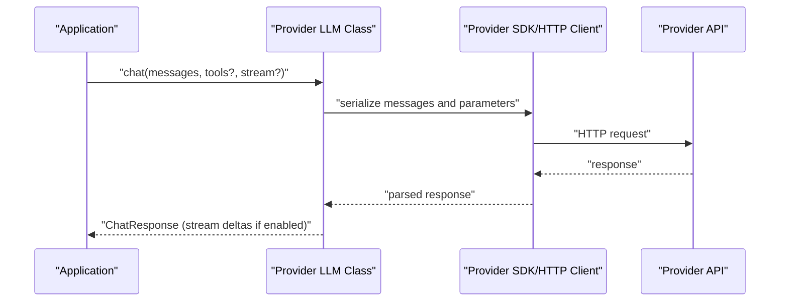

**Diagram sources**
- [base.py](file://llama-index-integrations/llms/llama-index-llms-mistralai/llama_index/llms/mistralai/base.py#L358-L412)
- [base.py](file://llama-index-integrations/llms/llama-index-llms-zhipuai/llama_index/llms/zhipuai/base.py#L242-L298)

## Detailed Component Analysis

### Mistral AI
- Strengths: Strong reasoning models, thinking block support, function calling, and multimodal capabilities
- Target markets: Enterprise AI assistants, reasoning-heavy tasks, and developer tooling
- Unique features: Dedicated reasoning models with thinking block parsing and optional display
- Configuration: API key and optional custom endpoint; environment variables supported
- Enterprise guidance: Use reasoning models for explainable AI; configure timeouts and retries for production stability

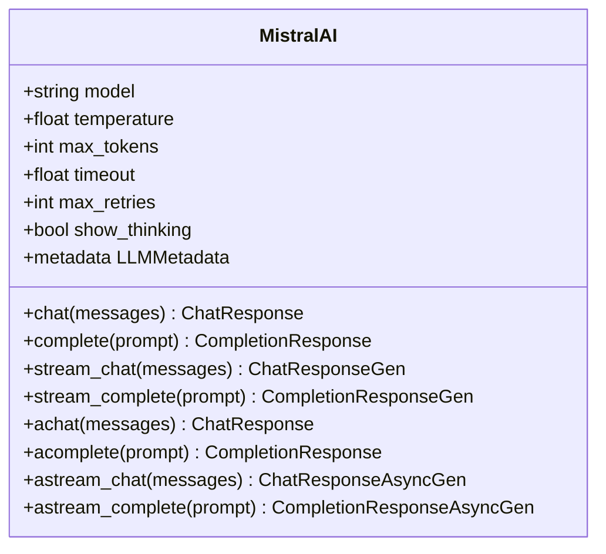

**Diagram sources**
- [base.py](file://llama-index-integrations/llms/llama-index-llms-mistralai/llama_index/llms/mistralai/base.py#L178-L301)

**Section sources**
- [base.py](file://llama-index-integrations/llms/llama-index-llms-mistralai/llama_index/llms/mistralai/base.py#L178-L301)
- [base.py](file://llama-index-integrations/llms/llama-index-llms-mistralai/llama_index/llms/mistralai/base.py#L358-L498)

### Together AI
- Strengths: Aggregates diverse open-source models behind a unified OpenAI-like interface
- Target markets: Cost-sensitive deployments leveraging open weights; multi-model experimentation
- Unique features: Unified API with OpenAI-like compatibility; supports various model families
- Configuration: API key via environment or constructor; default base URL configured
- Enterprise guidance: Use model selection to balance cost and quality; enable retries for robustness

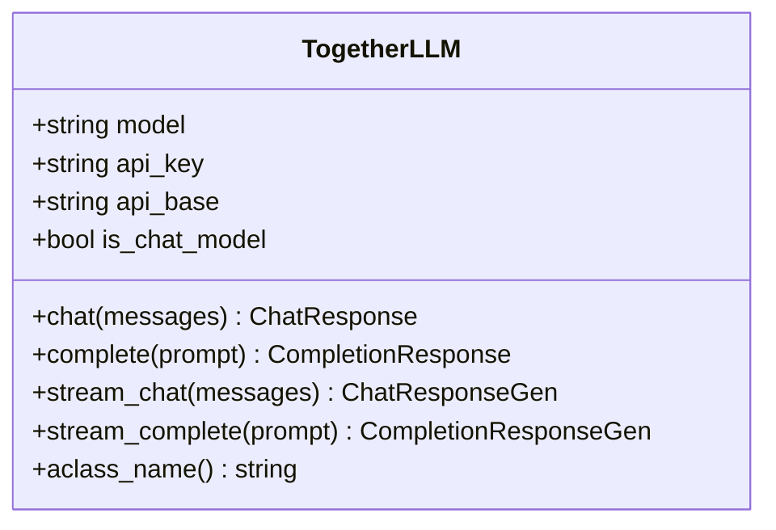

**Diagram sources**
- [base.py](file://llama-index-integrations/llms/llama-index-llms-together/llama_index/llms/together/base.py#L7-L52)

**Section sources**
- [base.py](file://llama-index-integrations/llms/llama-index-llms-together/llama_index/llms/together/base.py#L7-L52)

### Fireworks AI
- Strengths: Custom model support, flexible context windows, function calling detection
- Target markets: Organizations with proprietary or fine-tuned models; performance-sensitive workloads
- Unique features: Custom context window and function calling flags; OpenAI-like interface
- Configuration: API base and key via environment or constructor; optional custom context window
- Enterprise guidance: Tune context window and function calling flags per model; monitor retries and timeouts

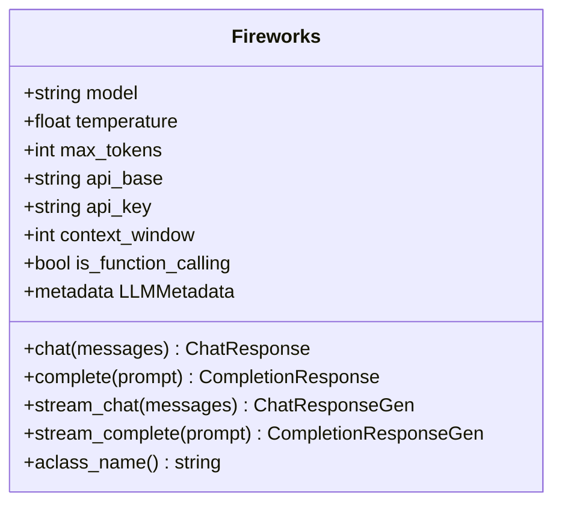

**Diagram sources**
- [base.py](file://llama-index-integrations/llms/llama-index-llms-fireworks/llama_index/llms/fireworks/base.py#L18-L97)

**Section sources**
- [base.py](file://llama-index-integrations/llms/llama-index-llms-fireworks/llama_index/llms/fireworks/base.py#L18-L97)

### DeepSeek
- Strengths: Open-weight models with strong chat and instruction-following capabilities
- Target markets: Developer tooling, code assistance, and cost-conscious deployments
- Unique features: OpenAI-like interface; function calling detection based on model name
- Configuration: API base and key via environment or constructor; context window derived from model
- Enterprise guidance: Select function-calling-capable models; configure timeouts for long responses

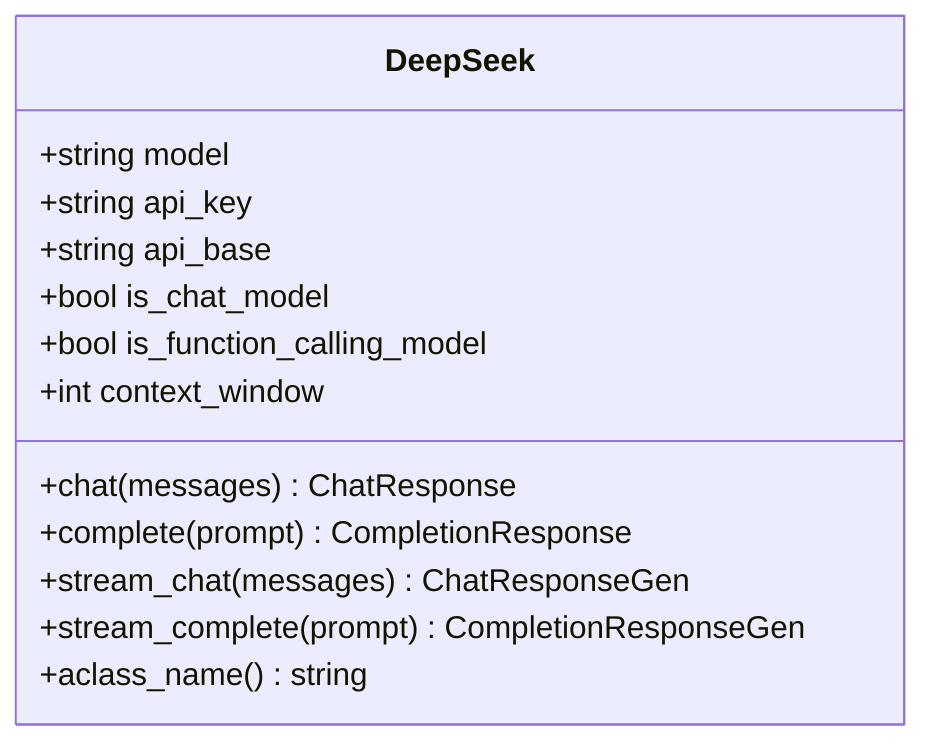

**Diagram sources**
- [base.py](file://llama-index-integrations/llms/llama-index-llms-deepseek/llama_index/llms/deepseek/base.py#L8-L56)

**Section sources**
- [base.py](file://llama-index-integrations/llms/llama-index-llms-deepseek/llama_index/llms/deepseek/base.py#L8-L56)

### Google Vertex AI
- Strengths: Unified Google AI stack, Gemini models, and enterprise-grade controls
- Target markets: Enterprises leveraging Google Cloud; multimodal and code models
- Unique features: Gemini function calling, safety settings, and model-specific capabilities
- Configuration: Project, location, and credentials; model selection determines client type
- Enterprise guidance: Use Gemini for advanced function calling; configure safety settings; manage retries carefully

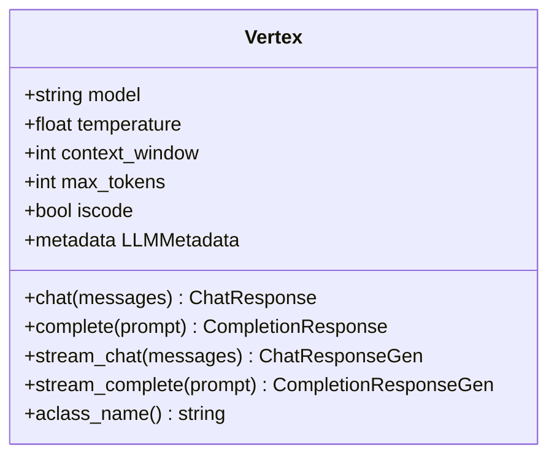

**Diagram sources**
- [base.py](file://llama-index-integrations/llms/llama-index-llms-vertex/llama_index/llms/vertex/base.py#L57-L188)

**Section sources**
- [base.py](file://llama-index-integrations/llms/llama-index-llms-vertex/llama_index/llms/vertex/base.py#L57-L188)

### ModelScope
- Strengths: Local-first and edge-friendly deployments via ModelScope pipelines
- Target markets: Regions with data sovereignty concerns; offline or constrained environments
- Unique features: Local pipeline execution; configurable dtype and device mapping
- Configuration: Model name, revision, task, dtype, device_map, tokenizer and model kwargs
- Enterprise guidance: Use appropriate dtype for hardware; tune generate kwargs for latency

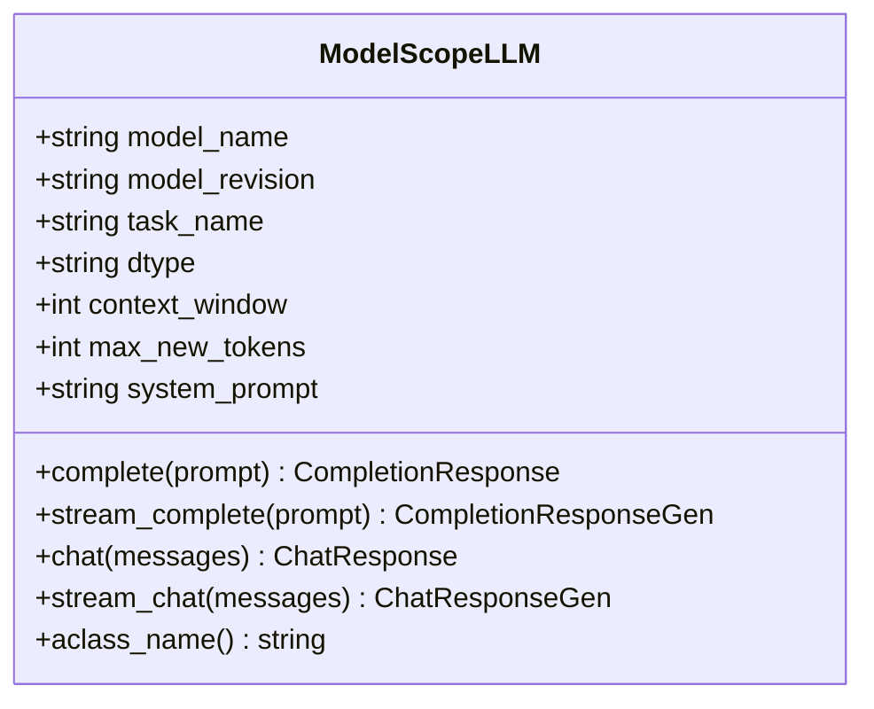

**Diagram sources**
- [base.py](file://llama-index-integrations/llms/llama-index-llms-modelscope/llama_index/llms/modelscope/base.py#L49-L154)

**Section sources**
- [base.py](file://llama-index-integrations/llms/llama-index-llms-modelscope/llama_index/llms/modelscope/base.py#L49-L154)

### Baidu Qianfan
- Strengths: Regional focus in China; integrated with Baidu’s ecosystem
- Target markets: Chinese enterprises and applications requiring domestic compliance
- Unique features: Custom client with streaming and async support; chat-only interface
- Configuration: Access key, secret key, model name, endpoint URL, and context window
- Enterprise guidance: Use model discovery to select endpoints; handle streaming deltas incrementally

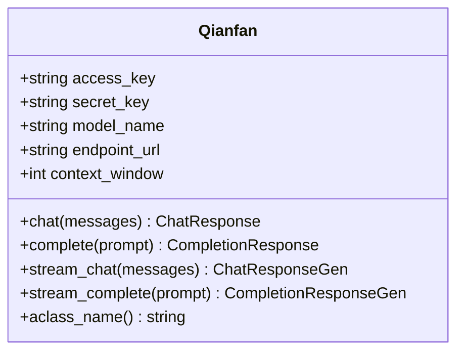

**Diagram sources**
- [base.py](file://llama-index-integrations/llms/llama-index-llms-qianfan/llama_index/llms/qianfan/base.py#L148-L278)

**Section sources**
- [base.py](file://llama-index-integrations/llms/llama-index-llms-qianfan/llama_index/llms/qianfan/base.py#L148-L278)

### Zhipuai
- Strengths: Multimodal and tool-rich models; strong in Chinese-language tasks
- Target markets: Chinese enterprises and creative industries
- Unique features: Tool/function calling; async task polling; long-context models
- Configuration: API key, model selection, temperature, max tokens, and timeout
- Enterprise guidance: Prefer function-calling models for agents; handle async task retrieval; limit parallel tool calls

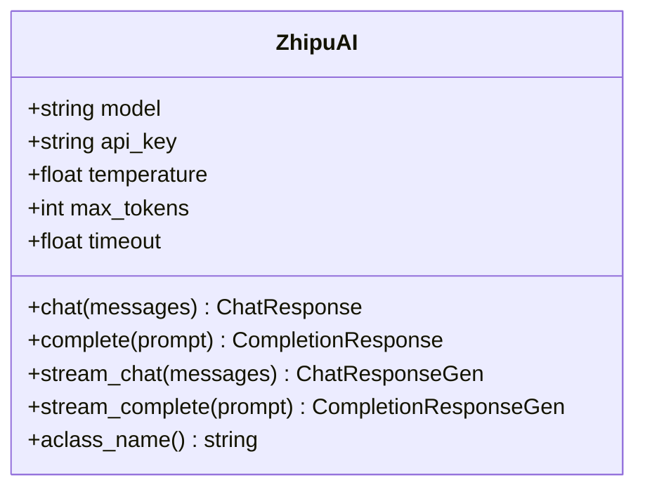

**Diagram sources**
- [base.py](file://llama-index-integrations/llms/llama-index-llms-zhipuai/llama_index/llms/zhipuai/base.py#L74-L145)

**Section sources**
- [base.py](file://llama-index-integrations/llms/llama-index-llms-zhipuai/llama_index/llms/zhipuai/base.py#L74-L145)

### Additional Emerging Providers
- Cloudflare AI Gateway: Provider resolution logic includes several specialized providers, including Mistral, Groq, DeepSeek, Perplexity, Replicate, and others.
- SiliconFlow: Supports a wide range of model options including DeepSeek and Qwen variants.

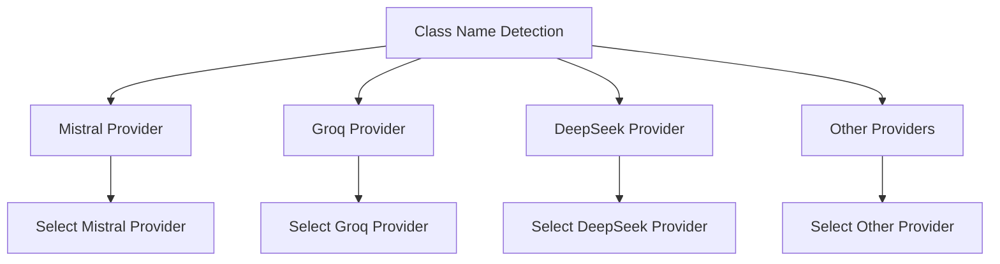

**Diagram sources**
- [providers.py](file://llama-index-integrations/llms/llama-index-llms-cloudflare-ai-gateway/llama_index/llms/cloudflare_ai_gateway/providers.py#L148-L162)

**Section sources**
- [providers.py](file://llama-index-integrations/llms/llama-index-llms-cloudflare-ai-gateway/llama_index/llms/cloudflare_ai_gateway/providers.py#L148-L162)
- [base.py](file://llama-index-integrations/llms/llama-index-llms-siliconflow/llama_index/llms/siliconflow/base.py#L45-L84)

## Dependency Analysis
Provider integrations depend on:
- LlamaIndex core LLM interface and utilities for callbacks, metadata, and function calling
- Provider SDKs or HTTP clients for API communication
- Environment variables for credentials and endpoints

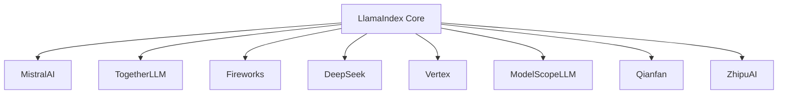

**Diagram sources**
- [base.py](file://llama-index-integrations/llms/llama-index-llms-mistralai/llama_index/llms/mistralai/base.py#L178-L301)
- [base.py](file://llama-index-integrations/llms/llama-index-llms-together/llama_index/llms/together/base.py#L7-L52)
- [base.py](file://llama-index-integrations/llms/llama-index-llms-fireworks/llama_index/llms/fireworks/base.py#L18-L97)
- [base.py](file://llama-index-integrations/llms/llama-index-llms-deepseek/llama_index/llms/deepseek/base.py#L8-L56)
- [base.py](file://llama-index-integrations/llms/llama-index-llms-vertex/llama_index/llms/vertex/base.py#L57-L188)
- [base.py](file://llama-index-integrations/llms/llama-index-llms-modelscope/llama_index/llms/modelscope/base.py#L49-L154)
- [base.py](file://llama-index-integrations/llms/llama-index-llms-qianfan/llama_index/llms/qianfan/base.py#L148-L278)
- [base.py](file://llama-index-integrations/llms/llama-index-llms-zhipuai/llama_index/llms/zhipuai/base.py#L74-L145)

**Section sources**
- [base.py](file://llama-index-integrations/llms/llama-index-llms-mistralai/llama_index/llms/mistralai/base.py#L178-L301)
- [base.py](file://llama-index-integrations/llms/llama-index-llms-together/llama_index/llms/together/base.py#L7-L52)
- [base.py](file://llama-index-integrations/llms/llama-index-llms-fireworks/llama_index/llms/fireworks/base.py#L18-L97)
- [base.py](file://llama-index-integrations/llms/llama-index-llms-deepseek/llama_index/llms/deepseek/base.py#L8-L56)
- [base.py](file://llama-index-integrations/llms/llama-index-llms-vertex/llama_index/llms/vertex/base.py#L57-L188)
- [base.py](file://llama-index-integrations/llms/llama-index-llms-modelscope/llama_index/llms/modelscope/base.py#L49-L154)
- [base.py](file://llama-index-integrations/llms/llama-index-llms-qianfan/llama_index/llms/qianfan/base.py#L148-L278)
- [base.py](file://llama-index-integrations/llms/llama-index-llms-zhipuai/llama_index/llms/zhipuai/base.py#L74-L145)

## Performance Considerations
- Streaming and async APIs reduce latency and improve throughput for interactive applications
- Function calling reduces round trips by embedding tool invocations directly in model responses
- Context window sizing impacts memory footprint; tune per workload
- Retries and timeouts should be configured to balance reliability and latency
- For local deployments (ModelScope), dtype and device mapping influence inference speed and memory usage

[No sources needed since this section provides general guidance]

## Troubleshooting Guide
Common issues and remedies:
- Missing API keys or incorrect endpoints: Ensure environment variables are set or passed explicitly
- Function calling failures: Verify model supports function calling; check tool specs and provider-specific constraints
- Streaming errors: Confirm provider supports streaming; handle incremental deltas carefully
- Long-running tasks (Zhipuai): Poll task status until completion; respect timeouts
- Multi-region and compliance: Use regional endpoints and data residency settings where available

**Section sources**
- [base.py](file://llama-index-integrations/llms/llama-index-llms-mistralai/llama_index/llms/mistralai/base.py#L262-L296)
- [base.py](file://llama-index-integrations/llms/llama-index-llms-zhipuai/llama_index/llms/zhipuai/base.py#L282-L298)
- [base.py](file://llama-index-integrations/llms/llama-index-llms-qianfan/llama_index/llms/qianfan/base.py#L335-L343)

## Conclusion
These specialized and emerging provider integrations offer diverse capabilities to meet varied enterprise needs. By leveraging provider-specific strengths—reasoning models (Mistral AI), open-weight aggregation (Together AI), custom models (Fireworks AI), regional ecosystems (Qianfan, Zhipuai), and multimodal AI (Vertex)—organizations can optimize for performance, cost, compliance, and functionality. The consistent LlamaIndex interface simplifies evaluation, migration, and operational management across providers.

[No sources needed since this section summarizes without analyzing specific files]

## Appendices

### Configuration Examples and Best Practices
- Environment variables:
  - Mistral AI: MISTRAL_API_KEY, optional MISTRAL_ENDPOINT
  - Together AI: TOGETHER_API_KEY
  - Fireworks AI: FIREWORKS_API_KEY, optional FIREWORKS_API_BASE
  - DeepSeek: DEEPSEEK_API_KEY
  - Vertex AI: Google Cloud project, location, and credentials
  - ModelScope: No explicit environment variables; pass parameters directly
  - Qianfan: Access Key and Secret Key
  - Zhipuai: API key
- Enterprise-grade deployment tips:
  - Enable retries and timeouts
  - Use function calling to minimize round trips
  - Monitor context windows and adjust for workload
  - For hybrid cloud, select providers with regional endpoints and data residency controls
- Migration strategies:
  - Evaluate function calling and streaming support across providers
  - Normalize prompts and tool schemas to reduce provider lock-in
  - Use environment-based configuration for easy switching
- Cost optimization:
  - Choose smaller models for simple tasks
  - Use streaming to reduce perceived latency without increasing cost
  - Leverage open-weight providers for experimentation and cost control

[No sources needed since this section provides general guidance]