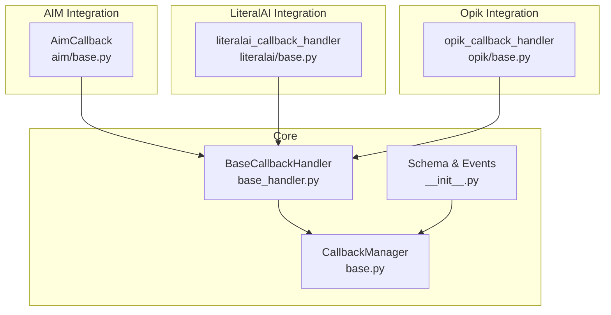
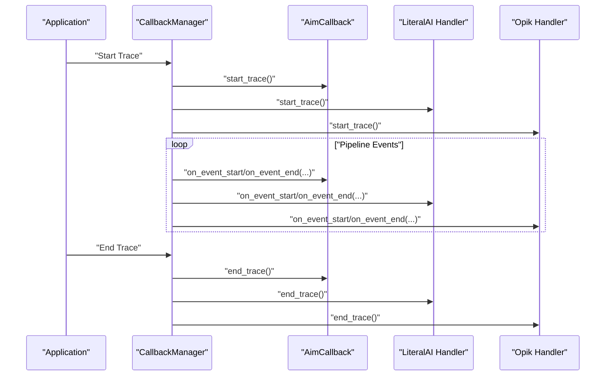
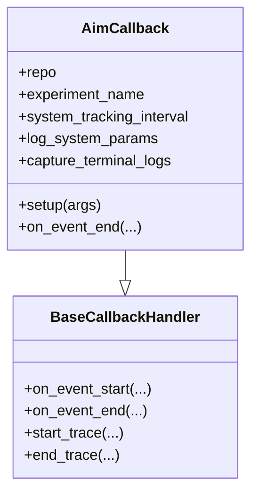
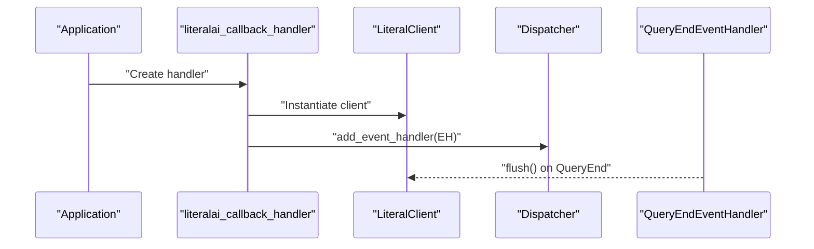
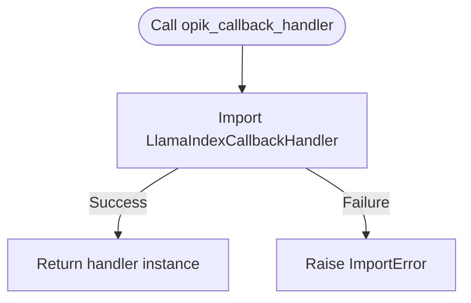
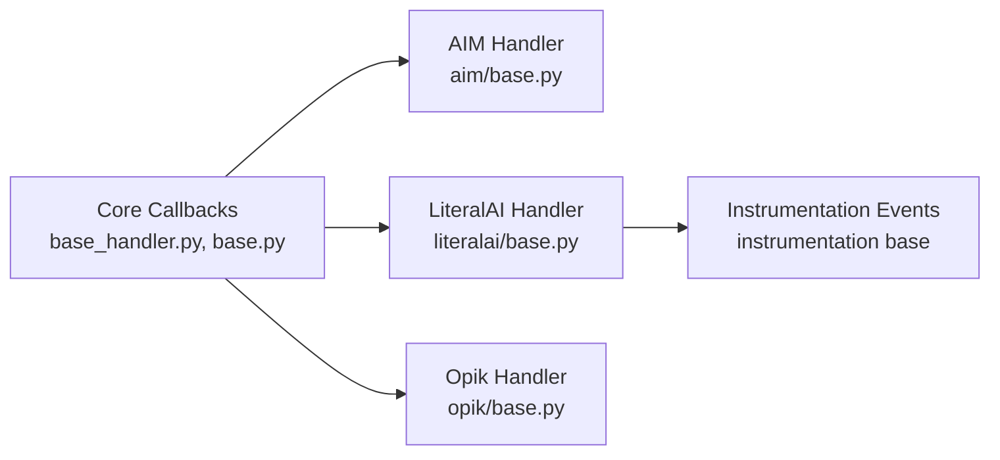

# Experiment Tracking

<cite>
**Referenced Files in This Document**
- [base_handler.py](file://llama-index-core/llama_index/core/callbacks/base_handler.py)
- [base.py](file://llama-index-core/llama_index/core/callbacks/base.py)
- [__init__.py](file://llama-index-core/llama_index/core/callbacks/__init__.py)
- [base.py](file://llama-index-integrations/callbacks/llama-index-callbacks-aim/llama_index/callbacks/aim/base.py)
- [__init__.py](file://llama-index-integrations/callbacks/llama-index-callbacks-aim/llama_index/callbacks/aim/__init__.py)
- [base.py](file://llama-index-integrations/callbacks/llama-index-callbacks-literalai/llama_index/callbacks/literalai/base.py)
- [__init__.py](file://llama-index-integrations/callbacks/llama-index-callbacks-literalai/llama_index/callbacks/literalai/__init__.py)
- [literalai_example.py](file://llama-index-integrations/callbacks/llama-index-callbacks-literalai/examples/literalai_example.py)
- [base.py](file://llama-index-integrations/callbacks/llama-index-callbacks-opik/llama_index/callbacks/opik/base.py)
- [__init__.py](file://llama-index-integrations/callbacks/llama-index-callbacks-opik/llama_index/callbacks/opik/__init__.py)
- [opik_example.py](file://llama-index-integrations/callbacks/llama-index-callbacks-opik/examples/opik_example.py)
- [base.py](file://llama-index-instrumentation/src/llama_index_instrumentation/base/event.py)
- [base.py](file://llama-index-instrumentation/src/llama_index_instrumentation/base/handler.py)
</cite>

## Table of Contents
1. [Introduction](#introduction)
2. [Project Structure](#project-structure)
3. [Core Components](#core-components)
4. [Architecture Overview](#architecture-overview)
5. [Detailed Component Analysis](#detailed-component-analysis)
6. [Dependency Analysis](#dependency-analysis)
7. [Performance Considerations](#performance-considerations)
8. [Troubleshooting Guide](#troubleshooting-guide)
9. [Conclusion](#conclusion)
10. [Appendices](#appendices)

## Introduction
This document explains how to integrate experiment tracking with AIM, LiteralAI, and Opik in LlamaIndex. It covers the callback system architecture, parameter and result logging, and how to compare model configurations across experiments. It also documents setup, practical examples, and best practices for reproducible experimentation and result visualization.

## Project Structure
The experiment tracking integrations live under the callbacks directory of the integrations package. Each provider exposes a handler or callback factory that plugs into LlamaIndex’s callback system. The core callback infrastructure resides in the core package.

**Diagram sources**
- [base_handler.py](file://llama-index-core/llama_index/core/callbacks/base_handler.py#L12-L56)
- [base.py](file://llama-index-core/llama_index/core/callbacks/base.py#L57-L120)
- [__init__.py](file://llama-index-core/llama_index/core/callbacks/__init__.py#L1-L18)
- [base.py](file://llama-index-integrations/callbacks/llama-index-callbacks-aim/llama_index/callbacks/aim/base.py#L13-L192)
- [base.py](file://llama-index-integrations/callbacks/llama-index-callbacks-literalai/llama_index/callbacks/literalai/base.py#L11-L59)
- [base.py](file://llama-index-integrations/callbacks/llama-index-callbacks-opik/llama_index/callbacks/opik/base.py#L6-L16)

**Section sources**
- [base_handler.py](file://llama-index-core/llama_index/core/callbacks/base_handler.py#L1-L56)
- [base.py](file://llama-index-core/llama_index/core/callbacks/base.py#L57-L120)
- [__init__.py](file://llama-index-core/llama_index/core/callbacks/__init__.py#L1-L18)

## Core Components
- BaseCallbackHandler: Defines the interface for event lifecycle hooks (start/end) and trace hooks.
- CallbackManager: Central orchestrator that dispatches events to registered handlers and manages traces.
- Handler Factories/Classes:
  - AIM: AimCallback logs LLM prompts/responses and chunked text to AIM runs.
  - LiteralAI: literalai_callback_handler instruments LlamaIndex and flushes per-query.
  - Opik: opik_callback_handler returns a LlamaIndexCallbackHandler from the Opik SDK.

These components enable parameter tracking, result aggregation, and experiment comparison across runs.

**Section sources**
- [base_handler.py](file://llama-index-core/llama_index/core/callbacks/base_handler.py#L12-L56)
- [base.py](file://llama-index-core/llama_index/core/callbacks/base.py#L57-L120)
- [base.py](file://llama-index-integrations/callbacks/llama-index-callbacks-aim/llama_index/callbacks/aim/base.py#L13-L192)
- [base.py](file://llama-index-integrations/callbacks/llama-index-callbacks-literalai/llama_index/callbacks/literalai/base.py#L11-L59)
- [base.py](file://llama-index-integrations/callbacks/llama-index-callbacks-opik/llama_index/callbacks/opik/base.py#L6-L16)

## Architecture Overview
The callback system emits typed events during pipeline execution. Handlers receive start/end notifications and can record parameters, inputs, outputs, and metrics. Providers like AIM, LiteralAI, and Opik translate these events into experiment records and dashboards.

**Diagram sources**
- [base.py](file://llama-index-core/llama_index/core/callbacks/base.py#L88-L140)
- [base_handler.py](file://llama-index-core/llama_index/core/callbacks/base_handler.py#L24-L55)
- [base.py](file://llama-index-integrations/callbacks/llama-index-callbacks-aim/llama_index/callbacks/aim/base.py#L77-L192)
- [base.py](file://llama-index-integrations/callbacks/llama-index-callbacks-literalai/llama_index/callbacks/literalai/base.py#L11-L59)
- [base.py](file://llama-index-integrations/callbacks/llama-index-callbacks-opik/llama_index/callbacks/opik/base.py#L6-L16)

## Detailed Component Analysis

### AIM Integration
AIM tracks prompts, responses, and chunks as text sequences within a Run. It supports configuring system metrics capture, terminal logs, and experiment names. Parameters can be logged via setup.

Key behaviors:
- Logs LLM prompt/response pairs and chunked text.
- Tracks steps per LLM response to maintain ordering.
- Supports experiment naming and run persistence.

**Diagram sources**
- [base_handler.py](file://llama-index-core/llama_index/core/callbacks/base_handler.py#L12-L56)
- [base.py](file://llama-index-integrations/callbacks/llama-index-callbacks-aim/llama_index/callbacks/aim/base.py#L13-L192)

Setup and usage:
- Initialize AimCallback with optional repo/experiment/system flags.
- Call setup with run parameters to tag configuration.
- The handler listens to LLM and CHUNKING events to record inputs and chunks.

Parameter logging:
- Use setup(args) to persist configuration keys/values to the run.

Result aggregation:
- Use AIM’s experiment/experiment versioning to compare runs and versions.

**Section sources**
- [base.py](file://llama-index-integrations/callbacks/llama-index-callbacks-aim/llama_index/callbacks/aim/base.py#L13-L192)
- [__init__.py](file://llama-index-integrations/callbacks/llama-index-callbacks-aim/llama_index/callbacks/aim/__init__.py#L1-L3)

### LiteralAI Integration
LiteralAI integrates by instrumenting LlamaIndex and flushing client caches at query boundaries. It supports batching and environment configuration.

Key behaviors:
- Creates a LiteralClient with configurable batch size, API key, URL, and environment.
- Instruments LlamaIndex and registers a QueryEndEventHandler to flush after each query.

**Diagram sources**
- [base.py](file://llama-index-integrations/callbacks/llama-index-callbacks-literalai/llama_index/callbacks/literalai/base.py#L11-L59)

Practical example:
- Use set_global_handler with the "literalai" key and optional parameters.
- Run queries; the handler flushes results after each query.

Real-time collaboration:
- LiteralAI enables team visibility and collaboration on experiment insights.

**Section sources**
- [base.py](file://llama-index-integrations/callbacks/llama-index-callbacks-literalai/llama_index/callbacks/literalai/base.py#L11-L59)
- [__init__.py](file://llama-index-integrations/callbacks/llama-index-callbacks-literalai/llama_index/callbacks/literalai/__init__.py#L1-L3)
- [literalai_example.py](file://llama-index-integrations/callbacks/llama-index-callbacks-literalai/examples/literalai_example.py#L1-L28)

### Opik Integration
Opik provides a LlamaIndexCallbackHandler via a factory that wraps the upstream SDK. It supports environment variable configuration for API key and workspace.

Key behaviors:
- Factory function returns a LlamaIndexCallbackHandler from the Opik SDK.
- Raises an ImportError if the SDK is missing.

**Diagram sources**
- [base.py](file://llama-index-integrations/callbacks/llama-index-callbacks-opik/llama_index/callbacks/opik/base.py#L6-L16)

Practical example:
- Use set_global_handler with the "opik" key.
- Alternatively, construct a handler and attach it to Settings.callback_manager.

Automated experiment management:
- Opik automates experiment creation and metadata collection for RAG pipelines.

**Section sources**
- [base.py](file://llama-index-integrations/callbacks/llama-index-callbacks-opik/llama_index/callbacks/opik/base.py#L6-L16)
- [__init__.py](file://llama-index-integrations/callbacks/llama-index-callbacks-opik/llama_index/callbacks/opik/__init__.py#L1-L3)
- [opik_example.py](file://llama-index-integrations/callbacks/llama-index-callbacks-opik/examples/opik_example.py#L1-L23)

## Dependency Analysis
The integrations depend on the core callback system and optionally on instrumentation for advanced scenarios.

**Diagram sources**
- [base_handler.py](file://llama-index-core/llama_index/core/callbacks/base_handler.py#L1-L56)
- [base.py](file://llama-index-core/llama_index/core/callbacks/base.py#L57-L120)
- [base.py](file://llama-index-integrations/callbacks/llama-index-callbacks-aim/llama_index/callbacks/aim/base.py#L1-L192)
- [base.py](file://llama-index-integrations/callbacks/llama-index-callbacks-literalai/llama_index/callbacks/literalai/base.py#L1-L59)
- [base.py](file://llama-index-integrations/callbacks/llama-index-callbacks-opik/llama_index/callbacks/opik/base.py#L1-L16)
- [base.py](file://llama-index-instrumentation/src/llama_index_instrumentation/base/event.py#L1-L200)
- [base.py](file://llama-index-instrumentation/src/llama_index_instrumentation/base/handler.py#L1-L200)

**Section sources**
- [base_handler.py](file://llama-index-core/llama_index/core/callbacks/base_handler.py#L1-L56)
- [base.py](file://llama-index-core/llama_index/core/callbacks/base.py#L57-L120)
- [base.py](file://llama-index-integrations/callbacks/llama-index-callbacks-literalai/llama_index/callbacks/literalai/base.py#L11-L59)

## Performance Considerations
- Batch writes: LiteralAI supports batch_size to reduce network overhead.
- Event filtering: Use event_starts_to_ignore and event_ends_to_ignore to minimize noise.
- System metrics: AIM’s system_tracking_interval controls resource telemetry frequency.
- Flush timing: LiteralAI flushes on query completion; ensure adequate batch sizes to balance latency and throughput.

[No sources needed since this section provides general guidance]

## Troubleshooting Guide
Common issues and resolutions:
- Missing SDK: AIM and Opik raise ImportErrors if their SDKs are not installed. Install the required packages before using the handlers.
- Global handler conflicts: Adding multiple handlers of the same type to CallbackManager raises a ValueError. Ensure only one handler per type is present.
- Environment variables: Opik expects OPIK_API_KEY and OPIK_WORKSPACE; LiteralAI requires LITERAL_API_KEY and LITERAL_API_URL if not configured otherwise.

**Section sources**
- [base.py](file://llama-index-integrations/callbacks/llama-index-callbacks-aim/llama_index/callbacks/aim/base.py#L51-L54)
- [base.py](file://llama-index-integrations/callbacks/llama-index-callbacks-opik/llama_index/callbacks/opik/base.py#L12-L15)
- [base.py](file://llama-index-core/llama_index/core/callbacks/base.py#L66-L74)
- [README.md](file://llama-index-integrations/callbacks/llama-index-callbacks-opik/README.md#L17-L20)
- [literalai_example.py](file://llama-index-integrations/callbacks/llama-index-callbacks-literalai/examples/literalai_example.py#L3-L12)

## Conclusion
By integrating AIM, LiteralAI, and Opik through LlamaIndex’s callback system, teams can build reproducible experiments, track parameters and results, and compare model configurations. Choose AIM for experiment versioning, LiteralAI for real-time collaboration, and Opik for automated experiment management. Follow the setup patterns and best practices outlined here to achieve robust experiment tracking and insight sharing.

[No sources needed since this section summarizes without analyzing specific files]

## Appendices

### Setup Procedures and Examples
- AIM
  - Initialize AimCallback and call setup with run parameters to tag configuration.
  - The handler automatically logs LLM prompts/responses and chunked text.

- LiteralAI
  - Use set_global_handler with the "literalai" key and optional parameters.
  - Example usage demonstrates instrumenting a basic query engine and iterating over questions.

- Opik
  - Use set_global_handler with the "opik" key.
  - Example usage shows instrumenting a basic query engine and iterating over questions.

**Section sources**
- [base.py](file://llama-index-integrations/callbacks/llama-index-callbacks-aim/llama_index/callbacks/aim/base.py#L151-L178)
- [literalai_example.py](file://llama-index-integrations/callbacks/llama-index-callbacks-literalai/examples/literalai_example.py#L1-L28)
- [opik_example.py](file://llama-index-integrations/callbacks/llama-index-callbacks-opik/examples/opik_example.py#L1-L23)

### Best Practices for Experiment Design
- Define clear hypotheses and parameter sets per experiment.
- Tag configuration parameters at run initialization for reproducibility.
- Use experiment names and versioning to organize runs.
- Track inputs, outputs, and metrics consistently across runs.
- Apply statistical significance testing when comparing model outputs.

[No sources needed since this section provides general guidance]