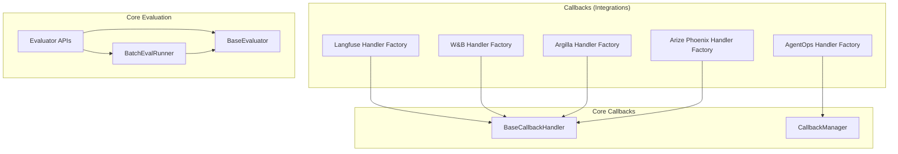
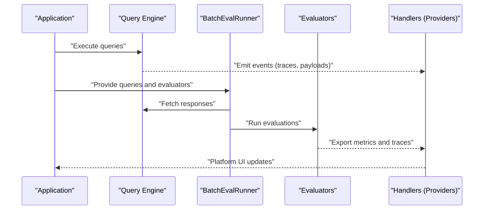
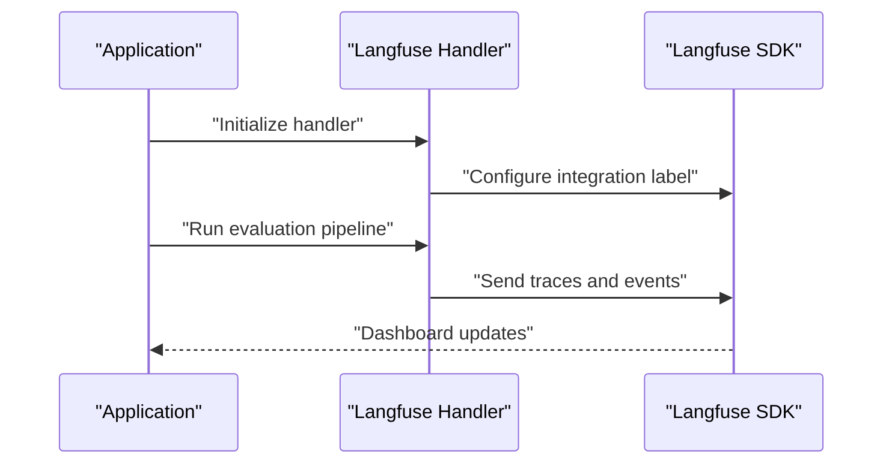
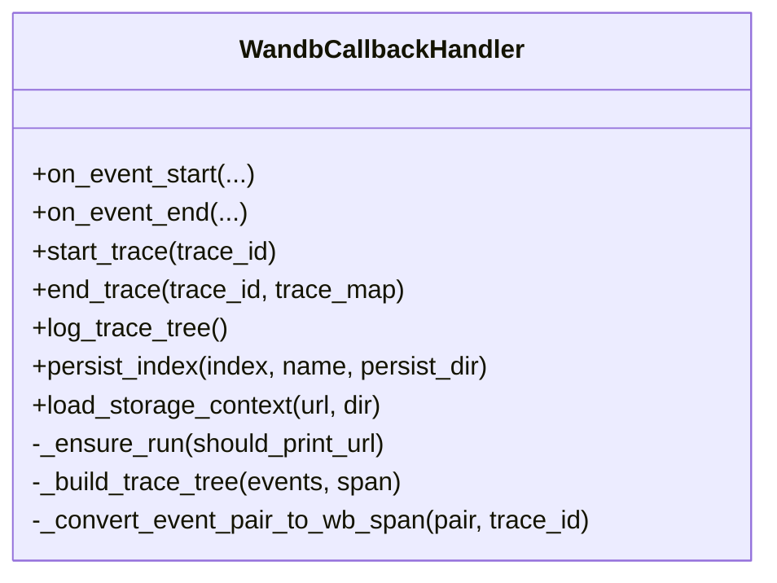
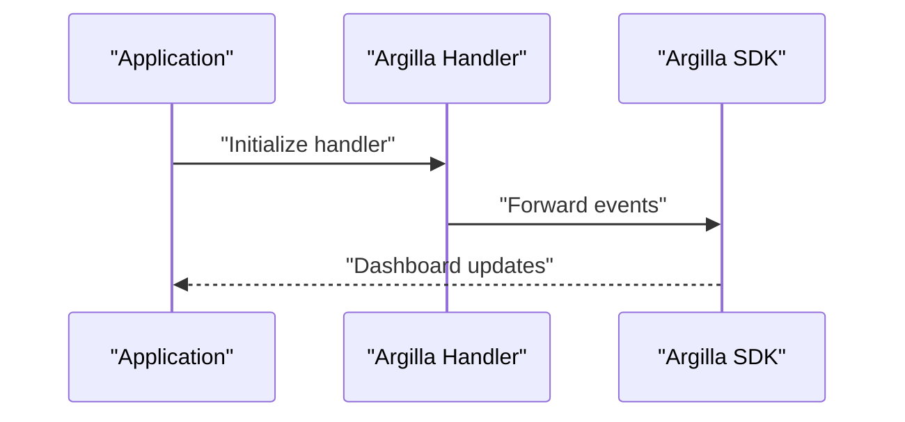
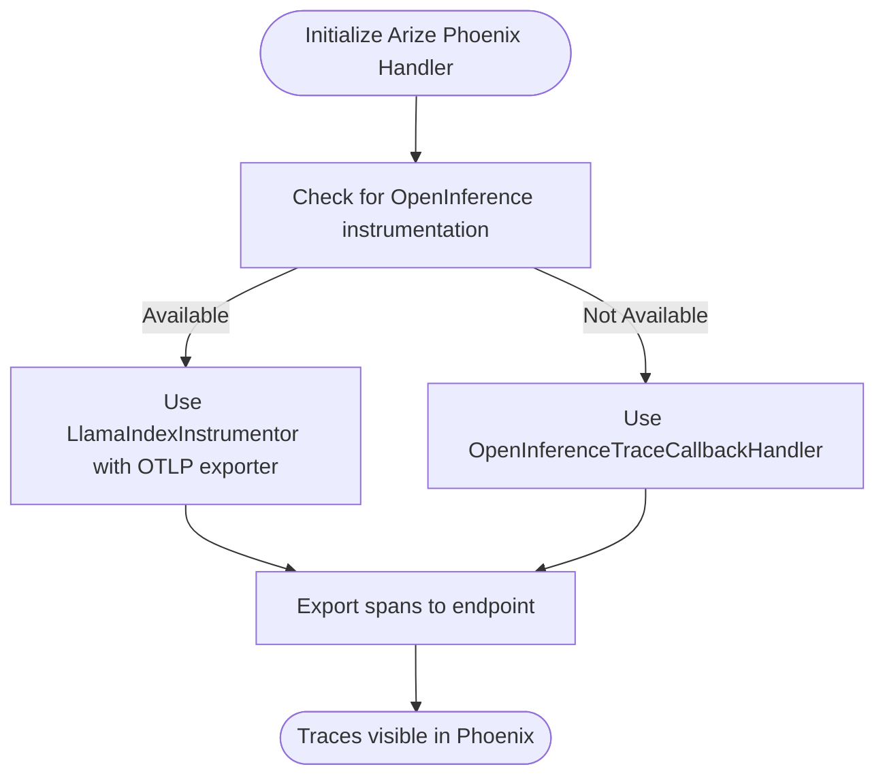
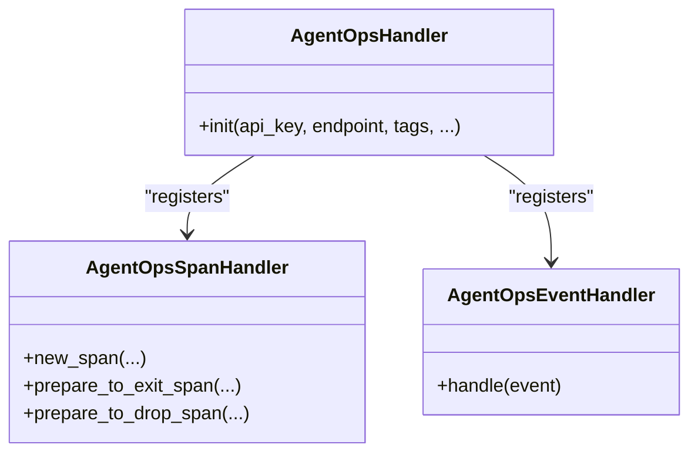
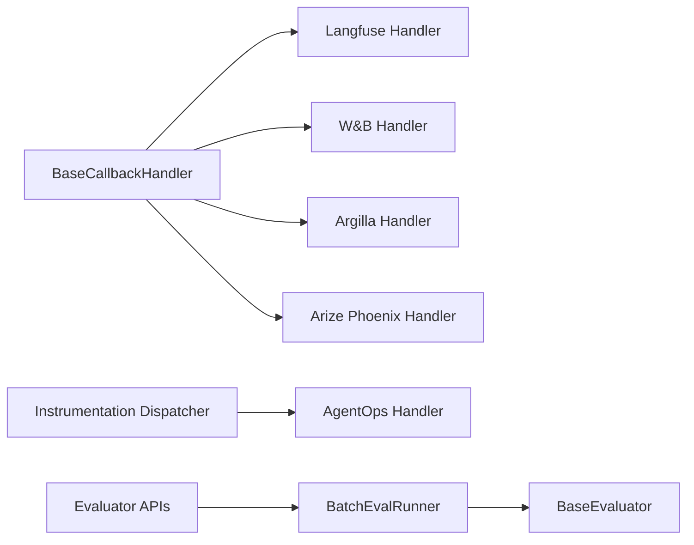

# Model Evaluation Platforms

<cite>
**Referenced Files in This Document**
- [base.py](file://llama-index-integrations/callbacks/llama-index-callbacks-langfuse/llama_index/callbacks/langfuse/base.py)
- [base.py](file://llama-index-integrations/callbacks/llama-index-callbacks-wandb/llama_index/callbacks/wandb/base.py)
- [base.py](file://llama-index-integrations/callbacks/llama-index-callbacks-argilla/llama_index/callbacks/argilla/base.py)
- [base.py](file://llama-index-integrations/callbacks/llama-index-callbacks-arize-phoenix/llama_index/callbacks/arize_phoenix/base.py)
- [base.py](file://llama-index-integrations/callbacks/llama-index-callbacks-agentops/llama_index/callbacks/agentops/base.py)
- [__init__.py](file://llama-index-core/llama_index/core/evaluation/__init__.py)
- [base.py](file://llama-index-core/llama_index/core/evaluation/base.py)
- [batch_runner.py](file://llama-index-core/llama_index/core/evaluation/batch_runner.py)
- [__init__.py](file://llama-index-core/llama_index/core/callbacks/__init__.py)
- [BeirEvaluation.ipynb](file://docs/examples/evaluation/BeirEvaluation.ipynb)
- [Deepeval.ipynb](file://docs/examples/evaluation/Deepeval.ipynb)
</cite>

## Table of Contents
1. [Introduction](#introduction)
2. [Project Structure](#project-structure)
3. [Core Components](#core-components)
4. [Architecture Overview](#architecture-overview)
5. [Detailed Component Analysis](#detailed-component-analysis)
6. [Dependency Analysis](#dependency-analysis)
7. [Performance Considerations](#performance-considerations)
8. [Troubleshooting Guide](#troubleshooting-guide)
9. [Conclusion](#conclusion)
10. [Appendices](#appendices)

## Introduction
This document explains how to integrate model evaluation and experimentation tracking with external platforms using callback handlers in the LlamaIndex ecosystem. It focuses on five providers: Langfuse, Weights & Biases (W&B), Argilla, Arize Phoenix, and AgentOps. For each, we describe the callback interface pattern, authentication setup, and data export mechanisms. We also explain how to configure evaluation metrics, experiment tracking, and model performance monitoring, and provide practical examples for building evaluation pipelines, dataset comparisons, and automated workflows.

## Project Structure
The integration points for model evaluation platforms live primarily in the callbacks modules under the integrations package. Each provider exposes a factory function that returns a handler implementing the BaseCallbackHandler interface. Evaluation capabilities are provided by the core evaluation module, including evaluators, batch runners, and utilities.

**Diagram sources**
- [base.py](file://llama-index-integrations/callbacks/llama-index-callbacks-langfuse/llama_index/callbacks/langfuse/base.py#L8-L12)
- [base.py](file://llama-index-integrations/callbacks/llama-index-callbacks-wandb/llama_index/callbacks/wandb/base.py#L87-L177)
- [base.py](file://llama-index-integrations/callbacks/llama-index-callbacks-argilla/llama_index/callbacks/argilla/base.py#L6-L13)
- [base.py](file://llama-index-integrations/callbacks/llama-index-callbacks-arize-phoenix/llama_index/callbacks/arize_phoenix/base.py#L6-L40)
- [base.py](file://llama-index-integrations/callbacks/llama-index-callbacks-agentops/llama_index/callbacks/agentops/base.py#L226-L266)
- [__init__.py](file://llama-index-core/llama_index/core/evaluation/__init__.py#L3-L86)
- [batch_runner.py](file://llama-index-core/llama_index/core/evaluation/batch_runner.py#L75-L98)
- [base.py](file://llama-index-core/llama_index/core/evaluation/base.py#L46-L92)
- [__init__.py](file://llama-index-core/llama_index/core/callbacks/__init__.py#L1-L18)

**Section sources**
- [__init__.py](file://llama-index-core/llama_index/core/evaluation/__init__.py#L3-L86)
- [batch_runner.py](file://llama-index-core/llama_index/core/evaluation/batch_runner.py#L75-L98)
- [base.py](file://llama-index-core/llama_index/core/evaluation/base.py#L46-L92)
- [__init__.py](file://llama-index-core/llama_index/core/callbacks/__init__.py#L1-L18)

## Core Components
- Callback Handlers: Provider-specific factories return handlers compatible with the BaseCallbackHandler interface. These capture events, traces, and payloads during pipeline execution and export them to the respective platforms.
- Evaluation APIs: Core evaluators and BatchEvalRunner orchestrate evaluation workflows, supporting both raw strings and Response objects, and enabling parallel execution with retries.
- Instrumentation: AgentOps integrates via the instrumentation subsystem, capturing LLM and tool events and forwarding them to AgentOps.

Key responsibilities:
- Langfuse: Wraps a LlamaIndex callback handler from the Langfuse SDK and sets an integration label.
- W&B: Implements a comprehensive trace tree logging handler, supports index persistence/loading as artifacts, and token counting.
- Argilla: Returns an Argilla callback handler via a lazy import wrapper.
- Arize Phoenix: Uses OpenInference instrumentation for modern versions and falls back to Phoenix’s callback handler for older versions.
- AgentOps: Provides instrumentation handlers for LLM and tool events, maintaining shared state across spans and recording events.

**Section sources**
- [base.py](file://llama-index-integrations/callbacks/llama-index-callbacks-langfuse/llama_index/callbacks/langfuse/base.py#L8-L12)
- [base.py](file://llama-index-integrations/callbacks/llama-index-callbacks-wandb/llama_index/callbacks/wandb/base.py#L87-L177)
- [base.py](file://llama-index-integrations/callbacks/llama-index-callbacks-argilla/llama_index/callbacks/argilla/base.py#L6-L13)
- [base.py](file://llama-index-integrations/callbacks/llama-index-callbacks-arize-phoenix/llama_index/callbacks/arize_phoenix/base.py#L6-L40)
- [base.py](file://llama-index-integrations/callbacks/llama-index-callbacks-agentops/llama_index/callbacks/agentops/base.py#L226-L266)
- [__init__.py](file://llama-index-core/llama_index/core/evaluation/__init__.py#L3-L86)
- [batch_runner.py](file://llama-index-core/llama_index/core/evaluation/batch_runner.py#L75-L98)
- [base.py](file://llama-index-core/llama_index/core/evaluation/base.py#L46-L92)

## Architecture Overview
The evaluation and experiment tracking architecture centers on callback handlers that intercept lifecycle events from LlamaIndex components. These handlers serialize and transmit telemetry to external platforms. For evaluation, BatchEvalRunner coordinates query execution and evaluator tasks, aggregating results for downstream analysis or uploads.

**Diagram sources**
- [batch_runner.py](file://llama-index-core/llama_index/core/evaluation/batch_runner.py#L319-L348)
- [base.py](file://llama-index-integrations/callbacks/llama-index-callbacks-wandb/llama_index/callbacks/wandb/base.py#L178-L239)
- [base.py](file://llama-index-integrations/callbacks/llama-index-callbacks-langfuse/llama_index/callbacks/langfuse/base.py#L8-L12)

## Detailed Component Analysis

### Langfuse Integration
- Purpose: Capture LlamaIndex traces and payloads and export them to Langfuse.
- Implementation pattern: Factory function returns a LlamaIndex callback handler from the Langfuse SDK, configured with an integration label.
- Authentication: Managed by the Langfuse SDK; ensure credentials are configured in the environment or passed to the handler.
- Data export: Events and spans are sent to Langfuse for visualization and analytics.

**Diagram sources**
- [base.py](file://llama-index-integrations/callbacks/llama-index-callbacks-langfuse/llama_index/callbacks/langfuse/base.py#L8-L12)

**Section sources**
- [base.py](file://llama-index-integrations/callbacks/llama-index-callbacks-langfuse/llama_index/callbacks/langfuse/base.py#L8-L12)

### Weights & Biases (W&B) Integration
- Purpose: Log trace trees, payloads, and index artifacts to W&B for experiment tracking and reproducibility.
- Implementation pattern: A handler class extends BaseCallbackHandler, manages run initialization, builds trace trees, and logs artifacts.
- Authentication: Requires W&B login or environment configuration; the handler ensures a run is initialized and can print the run URL.
- Data export: Trace trees, token usage, and index artifacts are exported to W&B.
- Index persistence: Supports persisting indices as artifacts and loading them back via artifact URLs.

**Diagram sources**
- [base.py](file://llama-index-integrations/callbacks/llama-index-callbacks-wandb/llama_index/callbacks/wandb/base.py#L87-L177)
- [base.py](file://llama-index-integrations/callbacks/llama-index-callbacks-wandb/llama_index/callbacks/wandb/base.py#L266-L330)
- [base.py](file://llama-index-integrations/callbacks/llama-index-callbacks-wandb/llama_index/callbacks/wandb/base.py#L536-L579)

**Section sources**
- [base.py](file://llama-index-integrations/callbacks/llama-index-callbacks-wandb/llama_index/callbacks/wandb/base.py#L87-L177)
- [base.py](file://llama-index-integrations/callbacks/llama-index-callbacks-wandb/llama_index/callbacks/wandb/base.py#L266-L330)
- [base.py](file://llama-index-integrations/callbacks/llama-index-callbacks-wandb/llama_index/callbacks/wandb/base.py#L536-L579)

### Argilla Integration
- Purpose: Capture and forward evaluation-related events to Argilla for human-in-the-loop labeling and quality assessment.
- Implementation pattern: Factory function performs a lazy import of the Argilla callback handler and returns it.
- Authentication: Managed by the Argilla SDK; ensure credentials are configured.
- Data export: Exports events and spans to Argilla for review and annotation.

**Diagram sources**
- [base.py](file://llama-index-integrations/callbacks/llama-index-callbacks-argilla/llama_index/callbacks/argilla/base.py#L6-L13)

**Section sources**
- [base.py](file://llama-index-integrations/callbacks/llama-index-callbacks-argilla/llama_index/callbacks/argilla/base.py#L6-L13)

### Arize Phoenix Integration
- Purpose: Export LlamaIndex traces to Arize Phoenix for observability and model performance monitoring.
- Implementation pattern: Factory function attempts OpenInference instrumentation for newer versions and falls back to Phoenix’s callback handler for older versions.
- Authentication: Endpoint configuration is supported; ensure the endpoint is reachable.
- Data export: Spans are exported via OTLP or Phoenix callback handler depending on version.

**Diagram sources**
- [base.py](file://llama-index-integrations/callbacks/llama-index-callbacks-arize-phoenix/llama_index/callbacks/arize_phoenix/base.py#L6-L40)

**Section sources**
- [base.py](file://llama-index-integrations/callbacks/llama-index-callbacks-arize-phoenix/llama_index/callbacks/arize_phoenix/base.py#L6-L40)

### AgentOps Integration
- Purpose: Record LLM and tool events for session-based analysis and automated quality assessment.
- Implementation pattern: Initializes AgentOps client and registers instrumentation handlers for spans and events. Maintains shared state across spans to correlate agent chat events.
- Authentication: Requires API key configuration; supports endpoint, queue sizes, and tags.
- Data export: Records LLM events and tool events, associating them with sessions and spans.

**Diagram sources**
- [base.py](file://llama-index-integrations/callbacks/llama-index-callbacks-agentops/llama_index/callbacks/agentops/base.py#L226-L266)
- [base.py](file://llama-index-integrations/callbacks/llama-index-callbacks-agentops/llama_index/callbacks/agentops/base.py#L80-L150)
- [base.py](file://llama-index-integrations/callbacks/llama-index-callbacks-agentops/llama_index/callbacks/agentops/base.py#L151-L225)

**Section sources**
- [base.py](file://llama-index-integrations/callbacks/llama-index-callbacks-agentops/llama_index/callbacks/agentops/base.py#L226-L266)
- [base.py](file://llama-index-integrations/callbacks/llama-index-callbacks-agentops/llama_index/callbacks/agentops/base.py#L80-L150)
- [base.py](file://llama-index-integrations/callbacks/llama-index-callbacks-agentops/llama_index/callbacks/agentops/base.py#L151-L225)

## Dependency Analysis
- Callbacks depend on the BaseCallbackHandler interface to standardize event emission and payload handling.
- W&B handler depends on the W&B SDK and internal LlamaIndex index types for persistence.
- AgentOps integrates with the instrumentation subsystem, registering span and event handlers.
- Evaluation APIs depend on BaseEvaluator and BatchEvalRunner for orchestration.

**Diagram sources**
- [__init__.py](file://llama-index-core/llama_index/core/callbacks/__init__.py#L1-L18)
- [base.py](file://llama-index-integrations/callbacks/llama-index-callbacks-wandb/llama_index/callbacks/wandb/base.py#L134-L156)
- [base.py](file://llama-index-integrations/callbacks/llama-index-callbacks-agentops/llama_index/callbacks/agentops/base.py#L256-L266)
- [__init__.py](file://llama-index-core/llama_index/core/evaluation/__init__.py#L3-L86)
- [batch_runner.py](file://llama-index-core/llama_index/core/evaluation/batch_runner.py#L75-L98)
- [base.py](file://llama-index-core/llama_index/core/evaluation/base.py#L46-L92)

**Section sources**
- [__init__.py](file://llama-index-core/llama_index/core/callbacks/__init__.py#L1-L18)
- [base.py](file://llama-index-integrations/callbacks/llama-index-callbacks-wandb/llama_index/callbacks/wandb/base.py#L134-L156)
- [base.py](file://llama-index-integrations/callbacks/llama-index-callbacks-agentops/llama_index/callbacks/agentops/base.py#L256-L266)
- [__init__.py](file://llama-index-core/llama_index/core/evaluation/__init__.py#L3-L86)
- [batch_runner.py](file://llama-index-core/llama_index/core/evaluation/batch_runner.py#L75-L98)
- [base.py](file://llama-index-core/llama_index/core/evaluation/base.py#L46-L92)

## Performance Considerations
- Parallelism: BatchEvalRunner uses semaphores and asyncio to parallelize evaluations and reduce total latency.
- Retries: Built-in retry decorators with exponential backoff improve resilience for transient failures.
- Token accounting: W&B handler computes token usage for LLM spans to inform cost-aware monitoring.
- Artifact persistence: W&B handler supports saving/loading indices as artifacts to avoid repeated computation and enable reproducible experiments.

[No sources needed since this section provides general guidance]

## Troubleshooting Guide
- Missing dependencies: Lazy imports raise explicit errors when required SDKs are not installed. Install the provider SDKs as indicated by the error messages.
- Run initialization: W&B handler initializes a run automatically; if no run is active, it prints the run URL for easy access.
- Artifact upload failures: W&B handler gracefully handles upload errors and prints informative messages.
- Import issues: Arize Phoenix handler gracefully falls back between versions; ensure the correct installation for your desired version.

**Section sources**
- [base.py](file://llama-index-integrations/callbacks/llama-index-callbacks-argilla/llama_index/callbacks/argilla/base.py#L6-L13)
- [base.py](file://llama-index-integrations/callbacks/llama-index-callbacks-wandb/llama_index/callbacks/wandb/base.py#L122-L133)
- [base.py](file://llama-index-integrations/callbacks/llama-index-callbacks-wandb/llama_index/callbacks/wandb/base.py#L536-L579)
- [base.py](file://llama-index-integrations/callbacks/llama-index-callbacks-arize-phoenix/llama_index/callbacks/arize_phoenix/base.py#L28-L39)

## Conclusion
By integrating provider-specific callback handlers, LlamaIndex applications can seamlessly export traces, events, and artifacts to Langfuse, W&B, Argilla, Arize Phoenix, and AgentOps. Combined with the core evaluation APIs and BatchEvalRunner, teams can build robust evaluation pipelines, compare datasets, and automate quality assessments while maintaining strong observability and reproducibility.

[No sources needed since this section summarizes without analyzing specific files]

## Appendices

### Practical Setup Examples
- W&B trace tree logging and index artifacts:
  - Initialize the handler and ensure a run is started.
  - Build and log trace trees for spans.
  - Persist indices as artifacts and load them later for reproducibility.
- Langfuse integration:
  - Use the factory to obtain a handler configured with an integration label.
- Argilla integration:
  - Use the factory to obtain a handler; ensure Argilla SDK is installed.
- Arize Phoenix integration:
  - Use the factory; it selects the appropriate instrumentation path based on version.
- AgentOps integration:
  - Initialize the handler with API key and optional parameters; it registers instrumentation handlers.

**Section sources**
- [base.py](file://llama-index-integrations/callbacks/llama-index-callbacks-wandb/llama_index/callbacks/wandb/base.py#L178-L239)
- [base.py](file://llama-index-integrations/callbacks/llama-index-callbacks-wandb/llama_index/callbacks/wandb/base.py#L266-L330)
- [base.py](file://llama-index-integrations/callbacks/llama-index-callbacks-langfuse/llama_index/callbacks/langfuse/base.py#L8-L12)
- [base.py](file://llama-index-integrations/callbacks/llama-index-callbacks-argilla/llama_index/callbacks/argilla/base.py#L6-L13)
- [base.py](file://llama-index-integrations/callbacks/llama-index-callbacks-arize-phoenix/llama_index/callbacks/arize_phoenix/base.py#L6-L40)
- [base.py](file://llama-index-integrations/callbacks/llama-index-callbacks-agentops/llama_index/callbacks/agentops/base.py#L226-L266)

### Example Workflows
- End-to-end evaluation with W&B:
  - Configure W&B handler, run queries, and observe trace trees and artifacts in the W&B UI.
- BEIR retrieval benchmarking:
  - Use the provided notebook to evaluate retrievers on standard datasets and interpret metrics.
- DeepEval integration:
  - Follow the notebook to instrument agents and evaluate them with DeepEval metrics.

**Section sources**
- [BeirEvaluation.ipynb](file://docs/examples/evaluation/BeirEvaluation.ipynb#L125-L142)
- [Deepeval.ipynb](file://docs/examples/evaluation/Deepeval.ipynb#L74-L113)