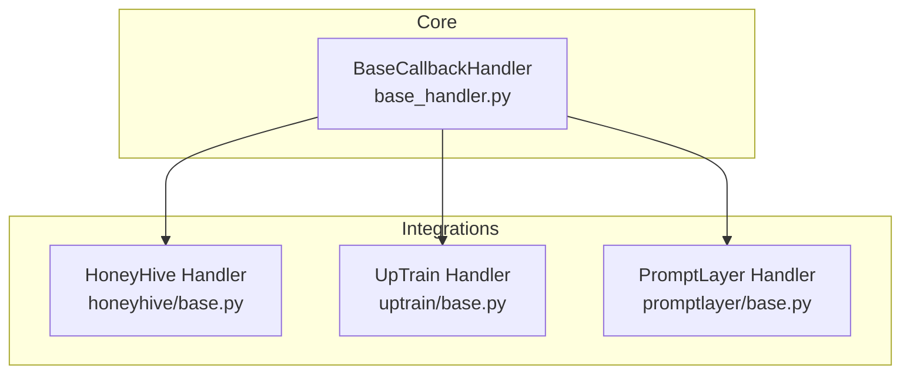
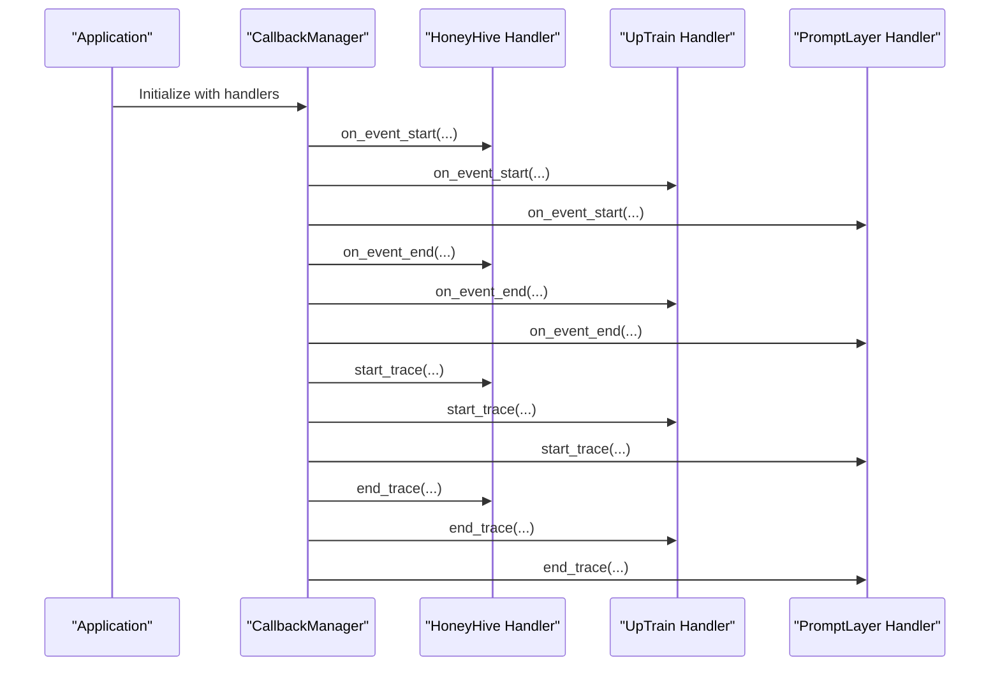
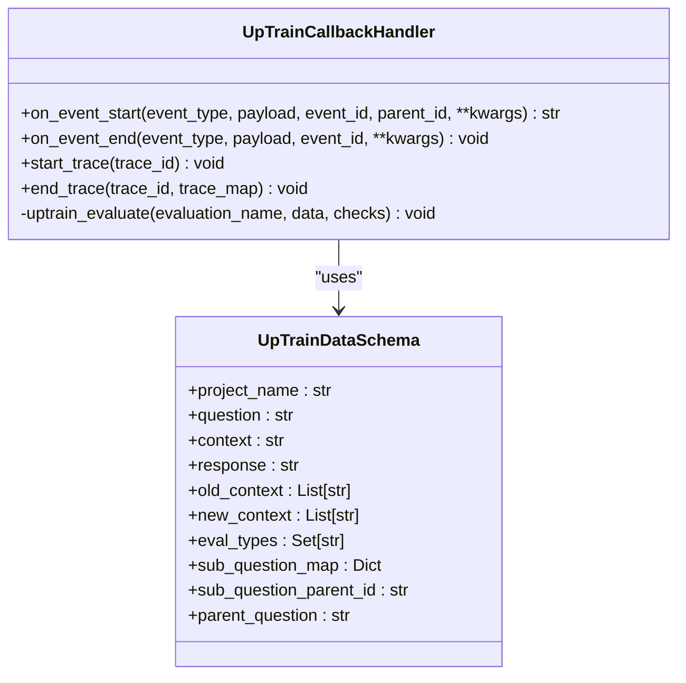
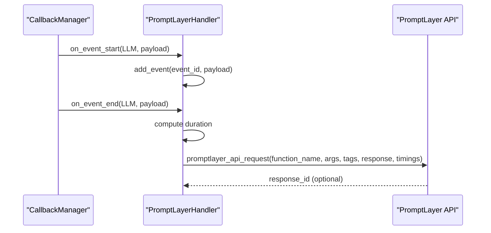
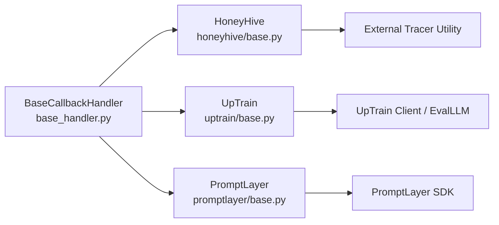

# Monitoring Solutions

<cite>
**Referenced Files in This Document**
- [base_handler.py](file://llama-index-core/llama_index/core/callbacks/base_handler.py)
- [base.py](file://llama-index-integrations/callbacks/llama-index-callbacks-honeyhive/llama_index/callbacks/honeyhive/base.py)
- [__init__.py](file://llama-index-integrations/callbacks/llama-index-callbacks-honeyhive/llama_index/callbacks/honeyhive/__init__.py)
- [base.py](file://llama-index-integrations/callbacks/llama-index-callbacks-uptrain/llama_index/callbacks/uptrain/base.py)
- [__init__.py](file://llama-index-integrations/callbacks/llama-index-callbacks-uptrain/llama_index/callbacks/uptrain/__init__.py)
- [base.py](file://llama-index-integrations/callbacks/llama-index-callbacks-promptlayer/llama_index/callbacks/promptlayer/base.py)
- [__init__.py](file://llama-index-integrations/callbacks/llama-index-callbacks-promptlayer/llama_index/callbacks/promptlayer/__init__.py)
- [README.md](file://llama-index-integrations/callbacks/llama-index-callbacks-uptrain/README.md)
- [HoneyHiveLlamaIndexTracer.ipynb](file://docs/examples/observability/HoneyHiveLlamaIndexTracer.ipynb)
- [test_uptrain_callback.py](file://llama-index-integrations/callbacks/llama-index-callbacks-uptrain/tests/test_uptrain_callback.py)
- [test_promptlayer_callback.py](file://llama-index-integrations/callbacks/llama-index-callbacks-promptlayer/tests/test_promptlayer_callback.py)
</cite>

## Table of Contents
1. [Introduction](#introduction)
2. [Project Structure](#project-structure)
3. [Core Components](#core-components)
4. [Architecture Overview](#architecture-overview)
5. [Detailed Component Analysis](#detailed-component-analysis)
6. [Dependency Analysis](#dependency-analysis)
7. [Performance Considerations](#performance-considerations)
8. [Troubleshooting Guide](#troubleshooting-guide)
9. [Conclusion](#conclusion)
10. [Appendices](#appendices)

## Introduction
This document explains how to integrate production-grade monitoring and quality assurance for LlamaIndex pipelines using three callback integrations: HoneyHive, UpTrain, and PromptLayer. These integrations enable continuous monitoring, alerting, and automated quality assessment in production environments. They support real-time trace collection, historical trend analysis, and integration with external incident management systems.

- HoneyHive: Provides end-to-end session and trace capture for production monitoring and automated evaluation workflows.
- UpTrain: Delivers automated quality scoring across multiple evaluation dimensions (context relevance, factual accuracy, response completeness, reranking, sub-query completeness) with built-in checks and trace correlation.
- PromptLayer: Sends LLM request/response telemetry to PromptLayer for analytics, token usage tracking, and prompt engineering insights.

## Project Structure
The monitoring integrations are implemented as callback handlers that extend the BaseCallbackHandler interface. Each integration exposes a factory or handler class that can be attached to LlamaIndex’s CallbackManager.

**Diagram sources**
- [base_handler.py](file://llama-index-core/llama_index/core/callbacks/base_handler.py#L12-L56)
- [base.py](file://llama-index-integrations/callbacks/llama-index-callbacks-honeyhive/llama_index/callbacks/honeyhive/base.py#L8-L9)
- [base.py](file://llama-index-integrations/callbacks/llama-index-callbacks-uptrain/llama_index/callbacks/uptrain/base.py#L44-L84)
- [base.py](file://llama-index-integrations/callbacks/llama-index-callbacks-promptlayer/llama_index/callbacks/promptlayer/base.py#L13-L31)

**Section sources**
- [base_handler.py](file://llama-index-core/llama_index/core/callbacks/base_handler.py#L12-L56)
- [base.py](file://llama-index-integrations/callbacks/llama-index-callbacks-honeyhive/llama_index/callbacks/honeyhive/base.py#L8-L9)
- [base.py](file://llama-index-integrations/callbacks/llama-index-callbacks-uptrain/llama_index/callbacks/uptrain/base.py#L44-L84)
- [base.py](file://llama-index-integrations/callbacks/llama-index-callbacks-promptlayer/llama_index/callbacks/promptlayer/base.py#L13-L31)

## Core Components
- BaseCallbackHandler: Defines the contract for event lifecycle hooks (start/end of events, start/end of traces) and is extended by each integration.
- HoneyHive: Exposes a factory function that returns a HoneyHiveLlamaIndexTracer instance compatible with BaseCallbackHandler.
- UpTrain: Implements UpTrainCallbackHandler with evaluation orchestration for synthesis, reranking, and sub-question workflows.
- PromptLayer: Implements PromptLayerHandler to capture LLM events and forward telemetry to PromptLayer.

Key capabilities:
- Continuous monitoring: Captures LLM requests/responses, indexing, retrieval, and synthesis stages.
- Automated quality assessment: Runs predefined evaluations and prints scores per event.
- Real-time and historical analytics: Integrates with external platforms for dashboards and alerts.
- Trace correlation: Builds trace maps to connect related events across pipeline stages.

**Section sources**
- [base_handler.py](file://llama-index-core/llama_index/core/callbacks/base_handler.py#L24-L55)
- [base.py](file://llama-index-integrations/callbacks/llama-index-callbacks-honeyhive/llama_index/callbacks/honeyhive/base.py#L8-L9)
- [base.py](file://llama-index-integrations/callbacks/llama-index-callbacks-uptrain/llama_index/callbacks/uptrain/base.py#L44-L132)
- [base.py](file://llama-index-integrations/callbacks/llama-index-callbacks-promptlayer/llama_index/callbacks/promptlayer/base.py#L13-L139)

## Architecture Overview
The monitoring pipeline integrates with LlamaIndex through the CallbackManager. Handlers listen to lifecycle events and either forward telemetry to external services or compute quality metrics locally.

**Diagram sources**
- [base_handler.py](file://llama-index-core/llama_index/core/callbacks/base_handler.py#L24-L55)
- [base.py](file://llama-index-integrations/callbacks/llama-index-callbacks-honeyhive/llama_index/callbacks/honeyhive/base.py#L8-L9)
- [base.py](file://llama-index-integrations/callbacks/llama-index-callbacks-uptrain/llama_index/callbacks/uptrain/base.py#L133-L178)
- [base.py](file://llama-index-integrations/callbacks/llama-index-callbacks-promptlayer/llama_index/callbacks/promptlayer/base.py#L57-L139)

## Detailed Component Analysis

### HoneyHive Integration
HoneyHive enables production monitoring by capturing sessions and traces. It integrates via a factory function that returns a HoneyHiveLlamaIndexTracer compatible with BaseCallbackHandler. The integration supports global handler registration and manual callback manager configuration.

- Factory and export: The integration exports a single factory function for convenience.
- Tracing behavior: HoneyHiveLlamaIndexTracer captures pipeline stages and forwards them to the HoneyHive platform for analysis and alerting.
- Example usage: The notebook demonstrates two approaches—setting a global handler and manually attaching to a CallbackManager alongside a debug handler.

Implementation highlights:
- Handler creation: Returns a HoneyHiveLlamaIndexTracer instance.
- Integration points: Works with global handler registration and CallbackManager composition.

Best practices:
- Use global handler for quick setup; use explicit CallbackManager for fine-grained control.
- Pair with a debug handler during development for visibility.
- Ensure API keys are securely configured.

**Section sources**
- [__init__.py](file://llama-index-integrations/callbacks/llama-index-callbacks-honeyhive/llama_index/callbacks/honeyhive/__init__.py#L1-L3)
- [base.py](file://llama-index-integrations/callbacks/llama-index-callbacks-honeyhive/llama_index/callbacks/honeyhive/base.py#L8-L9)
- [HoneyHiveLlamaIndexTracer.ipynb](file://docs/examples/observability/HoneyHiveLlamaIndexTracer.ipynb#L177-L227)

### UpTrain Integration
UpTrain provides automated quality assessment across multiple evaluation dimensions. The UpTrainCallbackHandler orchestrates evaluations for synthesis, reranking, and sub-question workflows, printing scores and results.

Key capabilities:
- Evaluation orchestration: Automatically detects event types (QUERY, TEMPLATING, SYNTHESIZE, RERANKING, SUB_QUESTION) and triggers appropriate evaluations.
- Supported checks:
  - Context Relevance
  - Factual Accuracy
  - Response Completeness
  - Sub Query Completeness
  - Context Reranking
  - Context Conciseness
- Trace correlation: Builds trace maps to connect parent and child events for sub-question evaluations.

Implementation highlights:
- Event handling: on_event_start/on_event_end capture contextual data and trigger evaluations.
- Evaluation execution: Uses UpTrain client or EvalLLM depending on key type.
- Results aggregation: Stores evaluation results per project name.

**Diagram sources**
- [base.py](file://llama-index-integrations/callbacks/llama-index-callbacks-uptrain/llama_index/callbacks/uptrain/base.py#L44-L84)
- [base.py](file://llama-index-integrations/callbacks/llama-index-callbacks-uptrain/llama_index/callbacks/uptrain/base.py#L13-L42)

**Section sources**
- [base.py](file://llama-index-integrations/callbacks/llama-index-callbacks-uptrain/llama_index/callbacks/uptrain/base.py#L44-L132)
- [README.md](file://llama-index-integrations/callbacks/llama-index-callbacks-uptrain/README.md#L1-L36)

### PromptLayer Integration
PromptLayer captures LLM events and forwards telemetry to PromptLayer for analytics and prompt engineering insights. It handles both chat and completion invocations, extracting messages, usage, and tool calls.

Key capabilities:
- Event capture: Listens to LLM events and stores request metadata.
- Telemetry forwarding: Sends prompt, completion, messages, and usage to PromptLayer.
- Tool call handling: Normalizes tool_calls for compatibility.

Implementation highlights:
- Event lifecycle: on_event_start stores serialized payload; on_event_end computes timing and sends telemetry.
- Usage extraction: Parses token counts from response raw usage.
- Function naming: Uses standardized function names for chat and completion.

**Diagram sources**
- [base.py](file://llama-index-integrations/callbacks/llama-index-callbacks-promptlayer/llama_index/callbacks/promptlayer/base.py#L57-L139)

**Section sources**
- [base.py](file://llama-index-integrations/callbacks/llama-index-callbacks-promptlayer/llama_index/callbacks/promptlayer/base.py#L13-L139)

## Dependency Analysis
- BaseCallbackHandler defines the interface implemented by all handlers.
- HoneyHive depends on an external tracer utility and integrates via a factory function.
- UpTrain depends on the UpTrain client or EvalLLM and evaluates based on event types.
- PromptLayer depends on the PromptLayer SDK and forwards LLM telemetry.

**Diagram sources**
- [base_handler.py](file://llama-index-core/llama_index/core/callbacks/base_handler.py#L12-L56)
- [base.py](file://llama-index-integrations/callbacks/llama-index-callbacks-honeyhive/llama_index/callbacks/honeyhive/base.py#L5-L9)
- [base.py](file://llama-index-integrations/callbacks/llama-index-callbacks-uptrain/llama_index/callbacks/uptrain/base.py#L60-L84)
- [base.py](file://llama-index-integrations/callbacks/llama-index-callbacks-promptlayer/llama_index/callbacks/promptlayer/base.py#L20-L28)

**Section sources**
- [base_handler.py](file://llama-index-core/llama_index/core/callbacks/base_handler.py#L12-L56)
- [base.py](file://llama-index-integrations/callbacks/llama-index-callbacks-honeyhive/llama_index/callbacks/honeyhive/base.py#L5-L9)
- [base.py](file://llama-index-integrations/callbacks/llama-index-callbacks-uptrain/llama_index/callbacks/uptrain/base.py#L60-L84)
- [base.py](file://llama-index-integrations/callbacks/llama-index-callbacks-promptlayer/llama_index/callbacks/promptlayer/base.py#L20-L28)

## Performance Considerations
- Asynchronous evaluation: UpTrain applies asynchronous patching to avoid blocking the main thread.
- Minimal overhead: Handlers primarily forward data or compute lightweight metrics; avoid heavy computations in hot paths.
- Batch-friendly design: UpTrain supports batch evaluation submission for multiple sub-questions.
- Token usage parsing: PromptLayer extracts usage efficiently from response payloads.

Best practices:
- Use global handler for minimal setup; prefer explicit CallbackManager for production deployments requiring multiple handlers.
- Filter noisy events: Utilize ignore lists in BaseCallbackHandler initialization to reduce overhead.
- Monitor external dependencies: Ensure UpTrain and PromptLayer clients are configured with appropriate timeouts and retry policies.

**Section sources**
- [base.py](file://llama-index-integrations/callbacks/llama-index-callbacks-uptrain/llama_index/callbacks/uptrain/base.py#L66-L66)
- [base.py](file://llama-index-integrations/callbacks/llama-index-callbacks-promptlayer/llama_index/callbacks/promptlayer/base.py#L94-L112)

## Troubleshooting Guide
Common issues and resolutions:
- Missing dependencies:
  - UpTrain: Install the UpTrain package; the handler raises an ImportError if missing.
  - PromptLayer: Install the PromptLayer package; the handler raises an ImportError if missing.
- Invalid key type:
  - UpTrain: Only “uptrain” or “openai” are accepted; otherwise raises a ValueError.
- Event handling mismatches:
  - Verify that LLM events are captured and that payloads contain expected fields (messages, response, usage).
- Trace correlation:
  - Confirm that parent-child relationships are recorded for sub-question evaluations.

Validation:
- Tests confirm that handlers inherit from BaseCallbackHandler and thus satisfy the interface contract.

**Section sources**
- [base.py](file://llama-index-integrations/callbacks/llama-index-callbacks-uptrain/llama_index/callbacks/uptrain/base.py#L61-L84)
- [base.py](file://llama-index-integrations/callbacks/llama-index-callbacks-promptlayer/llama_index/callbacks/promptlayer/base.py#L25-L28)
- [test_uptrain_callback.py](file://llama-index-integrations/callbacks/llama-index-callbacks-uptrain/tests/test_uptrain_callback.py#L5-L8)
- [test_promptlayer_callback.py](file://llama-index-integrations/callbacks/llama-index-callbacks-promptlayer/tests/test_promptlayer_callback.py#L5-L8)

## Conclusion
By integrating HoneyHive, UpTrain, and PromptLayer callbacks into LlamaIndex, teams can achieve comprehensive monitoring, automated quality assessment, and actionable analytics in production. HoneyHive delivers session-level trace capture, UpTrain provides multi-dimensional quality scoring and trace correlation, and PromptLayer offers prompt analytics and token usage insights. Together, these integrations support real-time monitoring, historical trend analysis, and seamless integration with incident management systems.

## Appendices

### Setup Procedures and Examples
- HoneyHive:
  - Option 1: Set a global handler for quick deployment.
  - Option 2: Manually configure a CallbackManager and attach the HoneyHive tracer alongside a debug handler.
  - Reference: [HoneyHiveLlamaIndexTracer.ipynb](file://docs/examples/observability/HoneyHiveLlamaIndexTracer.ipynb#L177-L227)

- UpTrain:
  - Add UpTrainCallbackHandler to your CallbackManager.
  - Supported evaluations include context relevance, factual accuracy, response completeness, sub-query completeness, context reranking, and context conciseness.
  - Reference: [README.md](file://llama-index-integrations/callbacks/llama-index-callbacks-uptrain/README.md#L1-L36)

- PromptLayer:
  - Attach PromptLayerHandler to capture LLM events and forward telemetry.
  - Ensure PromptLayer SDK is installed and API key is configured.
  - Reference: [base.py](file://llama-index-integrations/callbacks/llama-index-callbacks-promptlayer/llama_index/callbacks/promptlayer/base.py#L20-L28)

### Production Monitoring Workflows
- Continuous monitoring:
  - Attach handlers to CallbackManager to capture all pipeline stages.
- Quality gates:
  - Use UpTrain’s evaluation scores to gate deployments (e.g., require minimum factual accuracy).
- Automated remediation:
  - Trigger alerts or rollbacks when scores fall below thresholds; integrate with external incident systems via webhooks or logs.

### Real-Time and Historical Analytics
- Real-time:
  - HoneyHive and PromptLayer stream telemetry live; UpTrain evaluates and prints results immediately.
- Historical:
  - Use platform dashboards to analyze trends over time; correlate trace IDs across services.

### Best Practices
- Data collection:
  - Capture only necessary payloads to minimize overhead.
- Noise filtering:
  - Ignore non-essential events via BaseCallbackHandler initialization.
- Reliability:
  - Apply timeouts and retries for external API calls; monitor handler health separately.