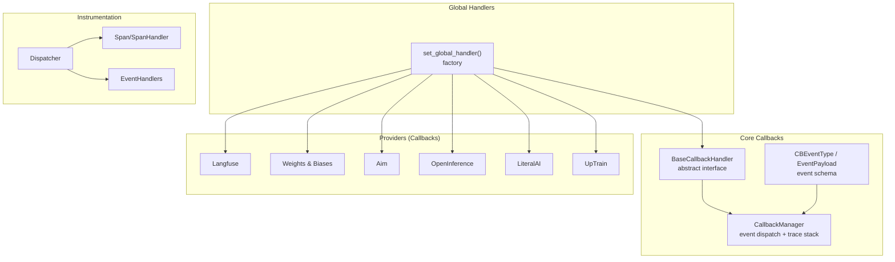
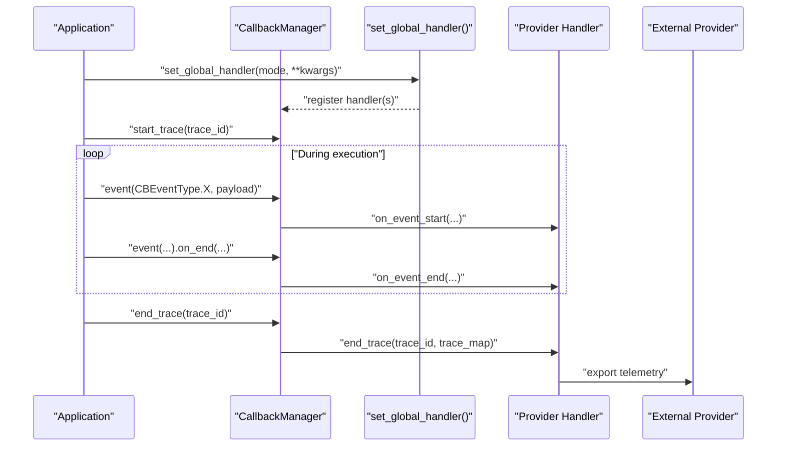
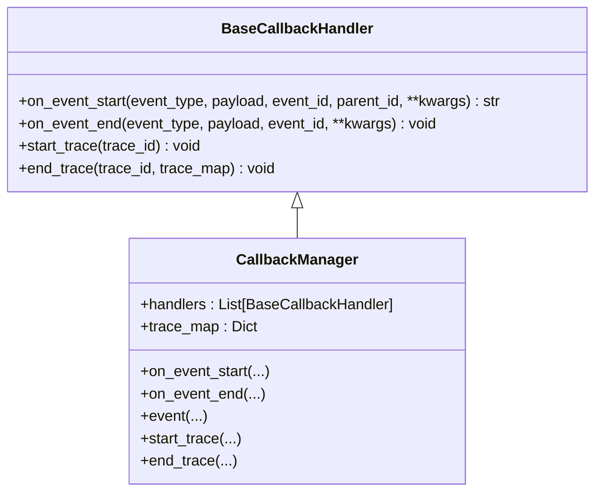
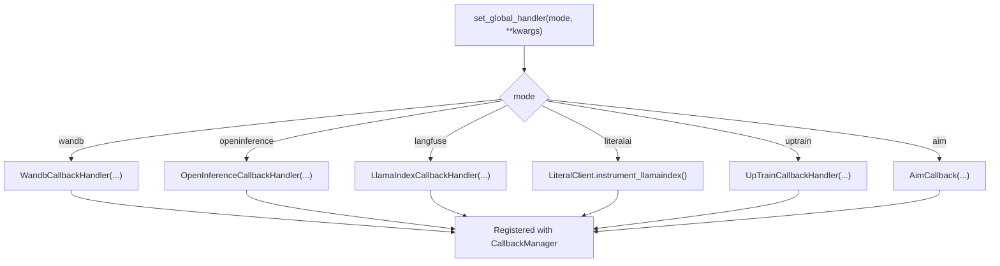

# Observability Integrations

<cite>
**Referenced Files in This Document**
- [base.py](file://llama-index-core/llama_index/core/callbacks/base.py)
- [base_handler.py](file://llama-index-core/llama_index/core/callbacks/base_handler.py)
- [schema.py](file://llama-index-core/llama_index/core/callbacks/schema.py)
- [global_handlers.py](file://llama-index-core/llama_index/core/callbacks/global_handlers.py)
- [base.py](file://llama-index-integrations/callbacks/llama-index-callbacks-langfuse/llama_index/callbacks/langfuse/base.py)
- [base.py](file://llama-index-integrations/callbacks/llama-index-callbacks-wandb/llama_index/callbacks/wandb/base.py)
- [base.py](file://llama-index-integrations/callbacks/llama-index-callbacks-aim/llama_index/callbacks/aim/base.py)
- [base.py](file://llama-index-integrations/callbacks/llama-index-callbacks-openinference/llama_index/callbacks/openinference/base.py)
- [base.py](file://llama-index-integrations/callbacks/llama-index-callbacks-literalai/llama_index/callbacks/literalai/base.py)
- [base.py](file://llama-index-integrations/callbacks/llama-index-callbacks-uptrain/llama_index/callbacks/uptrain/base.py)
- [dispatcher.py](file://llama-index-instrumentation/src/llama_index_instrumentation/dispatcher.py)
- [index.md](file://docs/src/content/docs/framework/module_guides/observability/index.md)
- [instrumentation.md](file://docs/src/content/docs/framework/module_guides/observability/instrumentation.md)
</cite>

## Table of Contents
1. [Introduction](#introduction)
2. [Project Structure](#project-structure)
3. [Core Components](#core-components)
4. [Architecture Overview](#architecture-overview)
5. [Detailed Component Analysis](#detailed-component-analysis)
6. [Dependency Analysis](#dependency-analysis)
7. [Performance Considerations](#performance-considerations)
8. [Troubleshooting Guide](#troubleshooting-guide)
9. [Conclusion](#conclusion)
10. [Appendices](#appendices)

## Introduction
This document explains how LlamaIndex supports observability across monitoring, tracing, and logging through a unified callback system and the newer instrumentation module. It covers the common callback interface, provider-specific adapters for Langfuse, Weights & Biases, Aim, HoneyHive, LiteralAI, OpenInference, UpTrain, and OpenTelemetry, and outlines configuration patterns, data export mechanisms, and best practices for secure, efficient, and extensible observability integrations.

## Project Structure
The observability system centers around:
- Core callback infrastructure: event types, payloads, and the callback manager
- Global handler registration for one-click activation of providers
- Provider-specific callback handlers that implement BaseCallbackHandler
- Instrumentation module for advanced tracing and span handling

**Diagram sources**
- [base_handler.py](file://llama-index-core/llama_index/core/callbacks/base_handler.py#L12-L56)
- [base.py](file://llama-index-core/llama_index/core/callbacks/base.py#L28-L303)
- [schema.py](file://llama-index-core/llama_index/core/callbacks/schema.py#L16-L102)
- [global_handlers.py](file://llama-index-core/llama_index/core/callbacks/global_handlers.py#L6-L150)
- [base.py](file://llama-index-integrations/callbacks/llama-index-callbacks-langfuse/llama_index/callbacks/langfuse/base.py#L8-L12)
- [base.py](file://llama-index-integrations/callbacks/llama-index-callbacks-wandb/llama_index/callbacks/wandb/base.py#L87-L579)
- [base.py](file://llama-index-integrations/callbacks/llama-index-callbacks-aim/llama_index/callbacks/aim/base.py#L13-L192)
- [base.py](file://llama-index-integrations/callbacks/llama-index-callbacks-openinference/llama_index/callbacks/openinference/base.py#L165-L301)
- [base.py](file://llama-index-integrations/callbacks/llama-index-callbacks-literalai/llama_index/callbacks/literalai/base.py#L11-L59)
- [base.py](file://llama-index-integrations/callbacks/llama-index-callbacks-uptrain/llama_index/callbacks/uptrain/base.py#L44-L336)
- [dispatcher.py](file://llama-index-instrumentation/src/llama_index_instrumentation/dispatcher.py)

**Section sources**
- [index.md](file://docs/src/content/docs/framework/module_guides/observability/index.md#L1-L38)
- [instrumentation.md](file://docs/src/content/docs/framework/module_guides/observability/instrumentation.md#L29-L40)

## Core Components
- BaseCallbackHandler defines the abstract interface for event lifecycle hooks and trace lifecycle hooks.
- CallbackManager orchestrates event dispatch, maintains trace stacks, and coordinates handler execution.
- CBEventType and EventPayload define standardized event categories and payload keys for consistent telemetry across providers.
- set_global_handler provides a one-click activation mechanism to register a provider’s callback handler globally.

Key responsibilities:
- Event tracking: on_event_start/on_event_end per event type
- Trace tracking: start_trace/end_trace with hierarchical trace maps
- Payload extraction: standardized keys for prompts, messages, responses, embeddings, nodes, etc.

**Section sources**
- [base_handler.py](file://llama-index-core/llama_index/core/callbacks/base_handler.py#L12-L56)
- [base.py](file://llama-index-core/llama_index/core/callbacks/base.py#L28-L303)
- [schema.py](file://llama-index-core/llama_index/core/callbacks/schema.py#L16-L102)
- [global_handlers.py](file://llama-index-core/llama_index/core/callbacks/global_handlers.py#L6-L150)

## Architecture Overview
The observability pipeline integrates with LlamaIndex execution in two primary ways:
- Legacy callback system: set_global_handler registers a provider handler that receives on_event_start/on_event_end and trace lifecycle callbacks.
- Instrumentation module: dispatcher-based spans and event handlers enable advanced tracing and span export to providers like OpenTelemetry.

**Diagram sources**
- [global_handlers.py](file://llama-index-core/llama_index/core/callbacks/global_handlers.py#L6-L150)
- [base.py](file://llama-index-core/llama_index/core/callbacks/base.py#L28-L303)
- [base_handler.py](file://llama-index-core/llama_index/core/callbacks/base_handler.py#L12-L56)

## Detailed Component Analysis

### Common Callback Interface Patterns
- Event lifecycle: on_event_start and on_event_end receive event_type, payload, event_id, parent_id, and optional kwargs. Handlers decide whether to record inputs, outputs, tokens, or artifacts.
- Trace lifecycle: start_trace initializes trace context; end_trace receives the trace_map for hierarchical correlation.
- Ignoring events: event_starts_to_ignore and event_ends_to_ignore allow selective filtering of noisy or irrelevant events.

**Diagram sources**
- [base_handler.py](file://llama-index-core/llama_index/core/callbacks/base_handler.py#L12-L56)
- [base.py](file://llama-index-core/llama_index/core/callbacks/base.py#L28-L303)

**Section sources**
- [base_handler.py](file://llama-index-core/llama_index/core/callbacks/base_handler.py#L12-L56)
- [base.py](file://llama-index-core/llama_index/core/callbacks/base.py#L88-L243)

### Langfuse Adapter
- Provides a LlamaIndexCallbackHandler from the external langfuse.llama_index SDK.
- Exposes a factory function returning a handler configured with an integration label.

Configuration pattern:
- Install the dedicated package and call the factory to obtain a handler compatible with CallbackManager.

**Section sources**
- [base.py](file://llama-index-integrations/callbacks/llama-index-callbacks-langfuse/llama_index/callbacks/langfuse/base.py#L8-L12)

### Weights & Biases (W&B) Adapter
- Implements a comprehensive WandbCallbackHandler that:
  - Tracks event pairs and builds a trace tree
  - Logs LLM prompts/messages and completions/responses
  - Computes token usage via token counters
  - Supports persisting/loading indices as W&B artifacts
  - Manages W&B run lifecycle and settings

Usage highlights:
- Initialize with run_args for project/entity/group/tags
- Optionally supply a custom tokenizer
- Uses W&B trace_tree for hierarchical visualization

**Section sources**
- [base.py](file://llama-index-integrations/callbacks/llama-index-callbacks-wandb/llama_index/callbacks/wandb/base.py#L87-L579)

### Aim Adapter
- Implements AimCallback that:
  - Tracks LLM prompts and responses as text sequences
  - Logs chunked text during chunking events
  - Manages Aim Run lifecycle and experiment context
  - Ignores event start/end for non-LLM events by default

Configuration pattern:
- Provide repo/experiment_name/system tracking parameters
- Optionally pass run_params to log configuration

**Section sources**
- [base.py](file://llama-index-integrations/callbacks/llama-index-callbacks-aim/llama_index/callbacks/aim/base.py#L13-L192)

### OpenInference Adapter
- Implements OpenInferenceCallbackHandler that:
  - Collects query and node data in OpenInference-compatible structures
  - Buffers data and flushes via a callback upon trace completion
  - Extracts standardized fields like query_text, llm_prompt, llm_messages, response_text, node_ids, scores, and query_embedding

Data export:
- Use the provided callback to persist or log buffered QueryData and NodeData entries.

**Section sources**
- [base.py](file://llama-index-integrations/callbacks/llama-index-callbacks-openinference/llama_index/callbacks/openinference/base.py#L165-L301)

### LiteralAI Adapter
- Provides a factory that instruments LlamaIndex with a LiteralClient and attaches a QueryEndEventHandler to flush cached spans at the end of each query.
- Accepts batch_size, api_key, url, environment, and disabled flags.

Integration pattern:
- Call the factory with credentials/environment settings
- The internal handler ensures timely export of spans

**Section sources**
- [base.py](file://llama-index-integrations/callbacks/llama-index-callbacks-literalai/llama_index/callbacks/literalai/base.py#L11-L59)

### UpTrain Adapter
- Implements UpTrainCallbackHandler that:
  - Maintains an UpTrainDataSchema to collect question/context/response for evaluation
  - Performs evaluations for question answering, sub-query completeness, context reranking, and context conciseness
  - Supports UpTrain API client or OpenAI-backed EvalLLM depending on key type
  - Builds trace maps and evaluates at appropriate event boundaries

Evaluation flow:
- Evaluations are triggered on specific events (SYNTHESIZE, RERANKING, SUB_QUESTION)
- Results are printed and stored in schema buffers

**Section sources**
- [base.py](file://llama-index-integrations/callbacks/llama-index-callbacks-uptrain/llama_index/callbacks/uptrain/base.py#L44-L336)

### OpenTelemetry (via Instrumentation)
- The instrumentation module introduces a dispatcher-based approach for spans and event handlers.
- This enables exporting spans to OpenTelemetry backends and integrating with broader tracing ecosystems.

High-level steps:
- Define a dispatcher
- Attach EventHandler(s) and SpanHandler(s) to the dispatcher
- Receive spans/events and export to OpenTelemetry

**Section sources**
- [instrumentation.md](file://docs/src/content/docs/framework/module_guides/observability/instrumentation.md#L29-L40)
- [dispatcher.py](file://llama-index-instrumentation/src/llama_index_instrumentation/dispatcher.py)

## Dependency Analysis
Provider selection and initialization depend on the global handler registry. The registry maps human-friendly modes to provider-specific factories or handlers.

**Diagram sources**
- [global_handlers.py](file://llama-index-core/llama_index/core/callbacks/global_handlers.py#L6-L150)
- [base.py](file://llama-index-integrations/callbacks/llama-index-callbacks-langfuse/llama_index/callbacks/langfuse/base.py#L8-L12)
- [base.py](file://llama-index-integrations/callbacks/llama-index-callbacks-wandb/llama_index/callbacks/wandb/base.py#L87-L579)
- [base.py](file://llama-index-integrations/callbacks/llama-index-callbacks-aim/llama_index/callbacks/aim/base.py#L13-L192)
- [base.py](file://llama-index-integrations/callbacks/llama-index-callbacks-openinference/llama_index/callbacks/openinference/base.py#L165-L301)
- [base.py](file://llama-index-integrations/callbacks/llama-index-callbacks-literalai/llama_index/callbacks/literalai/base.py#L11-L59)
- [base.py](file://llama-index-integrations/callbacks/llama-index-callbacks-uptrain/llama_index/callbacks/uptrain/base.py#L44-L336)

**Section sources**
- [global_handlers.py](file://llama-index-core/llama_index/core/callbacks/global_handlers.py#L6-L150)

## Performance Considerations
- Event volume: Some providers log detailed payloads (e.g., W&B node/chunk counts, OpenInference embedding vectors). Consider filtering with event_starts_to_ignore/event_ends_to_ignore to reduce overhead.
- Token counting: W&B computes token usage; ensure tokenizer alignment and avoid repeated counter initialization.
- Artifact persistence: Persisting indices to W&B adds I/O overhead; use selectively for reproducibility needs.
- Batch exports: LiteralAI supports batch_size tuning to balance latency and throughput.
- Async/IO loops: UpTrain uses nest_asyncio; ensure compatibility in async environments.

[No sources needed since this section provides general guidance]

## Troubleshooting Guide
Common issues and remedies:
- Missing provider dependency: Factory raises ImportError with installation guidance. Ensure the provider package is installed.
- Silent failures: Some handlers catch exceptions and log warnings (e.g., W&B index upload failures). Review printed messages and run URLs.
- Duplicate handler types: CallbackManager enforces uniqueness of handler types when adding global handlers; avoid registering multiple instances of the same handler.
- Token mismatch: Verify tokenizer consistency when computing token usage for LLM calls.

**Section sources**
- [global_handlers.py](file://llama-index-core/llama_index/core/callbacks/global_handlers.py#L20-L147)
- [base.py](file://llama-index-integrations/callbacks/llama-index-callbacks-wandb/llama_index/callbacks/wandb/base.py#L128-L132)
- [base.py](file://llama-index-integrations/callbacks/llama-index-callbacks-uptrain/llama_index/callbacks/uptrain/base.py#L59-L84)

## Conclusion
LlamaIndex offers a robust, extensible observability framework:
- A unified callback interface for event and trace lifecycle
- One-click global handler registration for popular providers
- Provider-specific adapters optimized for monitoring, tracing, and evaluation
- An instrumentation module enabling advanced tracing and OpenTelemetry integration

Adopt the recommended configuration patterns, tune performance-sensitive settings, and leverage provider-specific features to build reliable, observable LLM applications.

[No sources needed since this section summarizes without analyzing specific files]

## Appendices

### Practical Setup Examples (by provider)
- Weights & Biases
  - Initialize with run_args for project/entity/group/tags
  - Optionally supply tokenizer and configure silent mode
  - Persist indices as artifacts and load them back for reproducibility
- Aim
  - Configure repo/experiment_name and system tracking interval
  - Track prompts and responses as text sequences
- OpenInference
  - Provide a callback to persist buffered QueryData/NodeData
  - Use standardized fields for downstream analytics
- LiteralAI
  - Provide api_key/url/environment/batch_size
  - Rely on automatic flushing at query end
- UpTrain
  - Supply api_key and key_type ("uptrain" or "openai")
  - Evaluate question answering, sub-query completeness, reranking, and conciseness
- Langfuse
  - Use the provided factory to obtain a handler integrated with the Langfuse SDK
- OpenTelemetry
  - Use the instrumentation dispatcher to attach span handlers and export spans

[No sources needed since this section provides general guidance]

### Best Practices
- Privacy and data minimization
  - Filter sensitive payloads; avoid logging raw prompts/responses in public contexts
  - Use provider-specific redaction features and environment controls
- Cost optimization
  - Reduce payload verbosity; disable system metrics where unnecessary
  - Tune batch sizes and sampling rates for exporters
- Reliability
  - Wrap handler initialization in try/except blocks
  - Validate credentials and network connectivity before long-running runs
- Extensibility
  - Implement BaseCallbackHandler subclasses for custom providers
  - Integrate with the instrumentation dispatcher for advanced tracing scenarios

[No sources needed since this section provides general guidance]