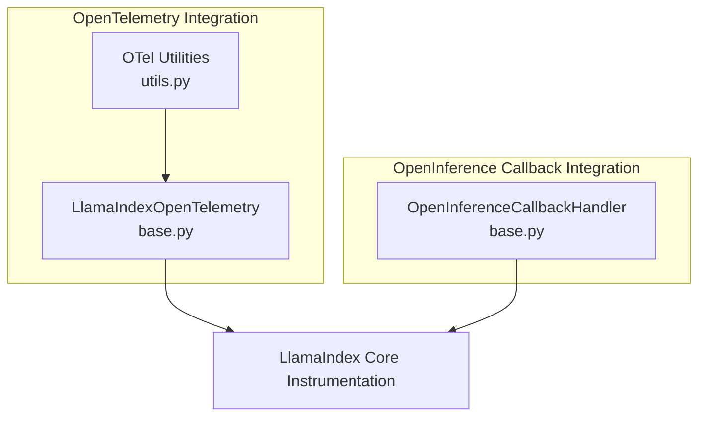
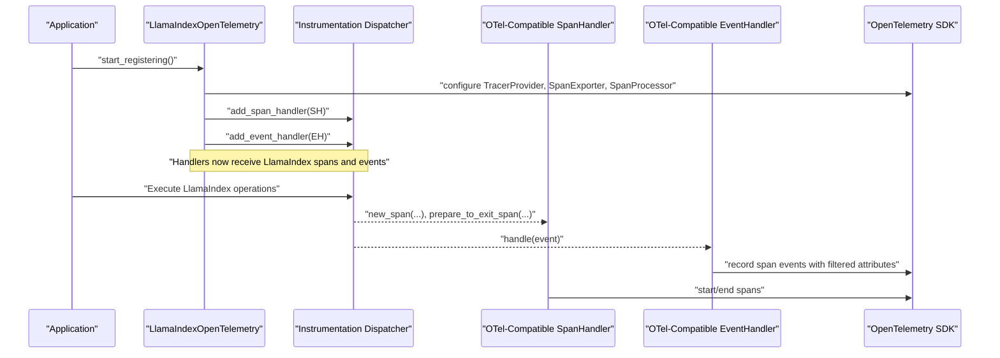
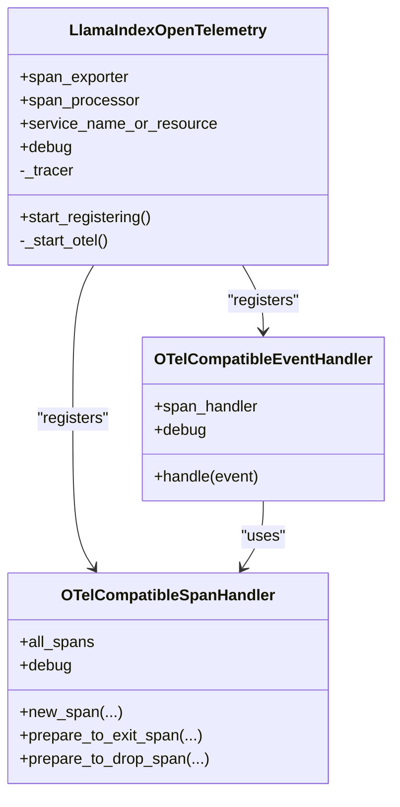
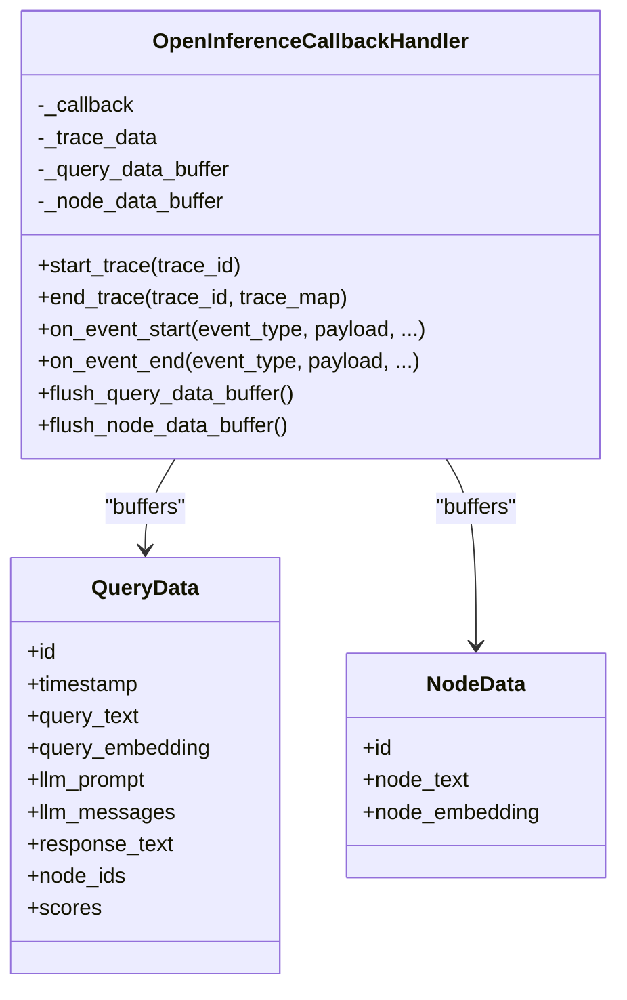
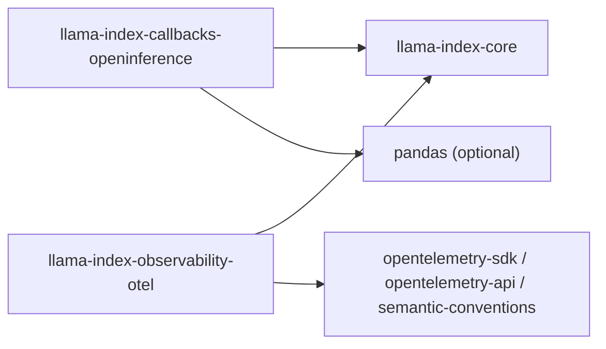

# Standards-Based Solutions

<cite>
**Referenced Files in This Document**
- [README.md](file://llama-index-integrations/observability/llama-index-observability-otel/README.md)
- [base.py](file://llama-index-integrations/observability/llama-index-observability-otel/llama_index/observability/otel/base.py)
- [utils.py](file://llama-index-integrations/observability/llama-index-observability-otel/llama_index/observability/otel/utils.py)
- [pyproject.toml](file://llama-index-integrations/observability/llama-index-observability-otel/pyproject.toml)
- [test_initialization.py](file://llama-index-integrations/observability/llama-index-observability-otel/tests/test_initialization.py)
- [README.md](file://llama-index-integrations/callbacks/llama-index-callbacks-openinference/README.md)
- [base.py](file://llama-index-integrations/callbacks/llama-index-callbacks-openinference/llama_index/callbacks/openinference/base.py)
- [pyproject.toml](file://llama-index-integrations/callbacks/llama-index-callbacks-openinference/pyproject.toml)
- [test_openinference_callback.py](file://llama-index-integrations/callbacks/llama-index-callbacks-openinference/tests/test_openinference_callback.py)
- [openinference.md](file://docs/api_reference/api_reference/callbacks/openinference.md)
</cite>

## Table of Contents
1. [Introduction](#introduction)
2. [Project Structure](#project-structure)
3. [Core Components](#core-components)
4. [Architecture Overview](#architecture-overview)
5. [Detailed Component Analysis](#detailed-component-analysis)
6. [Dependency Analysis](#dependency-analysis)
7. [Performance Considerations](#performance-considerations)
8. [Troubleshooting Guide](#troubleshooting-guide)
9. [Conclusion](#conclusion)
10. [Appendices](#appendices)

## Introduction
This document explains how to integrate standards-based observability into LlamaIndex applications using two complementary mechanisms:
- OpenInference callback integration for standardized telemetry data collection and trace correlation
- OpenTelemetry integration for vendor-neutral tracing and metrics export

It covers the callback interface implementation, trace attributes, span correlation patterns, exporter configuration for popular backends, and best practices for migrating from proprietary solutions to standards-based observability.

## Project Structure
The observability integrations are implemented as separate packages:
- OpenTelemetry integration: Provides a configuration class that registers OpenTelemetry-compatible span and event handlers into LlamaIndex’s instrumentation dispatcher.
- OpenInference callback integration: Provides a callback handler that captures query and node-level data in a vendor-neutral, standardized schema aligned with the OpenInference specification.

**Diagram sources**
- [base.py](file://llama-index-integrations/observability/llama-index-observability-otel/llama_index/observability/otel/base.py#L209-L269)
- [utils.py](file://llama-index-integrations/observability/llama-index-observability-otel/llama_index/observability/otel/utils.py#L1-L26)
- [base.py](file://llama-index-integrations/callbacks/llama-index-callbacks-openinference/llama_index/callbacks/openinference/base.py#L165-L301)

**Section sources**
- [README.md](file://llama-index-integrations/observability/llama-index-observability-otel/README.md#L1-L76)
- [README.md](file://llama-index-integrations/callbacks/llama-index-callbacks-openinference/README.md#L1-L2)

## Core Components
- OpenTelemetry integration
  - LlamaIndexOpenTelemetry: A configuration class that sets up an OpenTelemetry TracerProvider, attaches a SpanExporter and SpanProcessor, and registers OTel-compatible span and event handlers into LlamaIndex’s instrumentation dispatcher.
  - OTel-compatible span handler: Creates OpenTelemetry spans for LlamaIndex operations and records events captured from LlamaIndex events.
  - OTel-compatible event handler: Bridges LlamaIndex event payloads into OpenTelemetry span events with filtered attributes.
  - Utilities: Filter model fields to supported OpenTelemetry attribute types.

- OpenInference callback integration
  - OpenInferenceCallbackHandler: A callback handler that collects standardized query and node data during LlamaIndex operations and exposes buffers for downstream consumption (e.g., persistence or export to observability platforms).

**Section sources**
- [base.py](file://llama-index-integrations/observability/llama-index-observability-otel/llama_index/observability/otel/base.py#L209-L269)
- [base.py](file://llama-index-integrations/observability/llama-index-observability-otel/llama_index/observability/otel/base.py#L44-L160)
- [utils.py](file://llama-index-integrations/observability/llama-index-observability-otel/llama_index/observability/otel/utils.py#L1-L26)
- [base.py](file://llama-index-integrations/callbacks/llama-index-callbacks-openinference/llama_index/callbacks/openinference/base.py#L165-L301)

## Architecture Overview
The integrations work together to provide standardized telemetry:
- OpenTelemetry handles distributed tracing and event export to backends.
- OpenInference callback captures structured, spec-aligned data for queries and retrieved nodes.

**Diagram sources**
- [base.py](file://llama-index-integrations/observability/llama-index-observability-otel/llama_index/observability/otel/base.py#L209-L269)
- [base.py](file://llama-index-integrations/observability/llama-index-observability-otel/llama_index/observability/otel/base.py#L162-L207)
- [utils.py](file://llama-index-integrations/observability/llama-index-observability-otel/llama_index/observability/otel/utils.py#L19-L26)

## Detailed Component Analysis

### OpenTelemetry Integration
- Purpose: Provide vendor-neutral tracing and event export via OpenTelemetry.
- Key capabilities:
  - Configure TracerProvider with a Resource (service name or full Resource).
  - Choose between SimpleSpanProcessor and BatchSpanProcessor.
  - Attach a SpanExporter (e.g., console, OTLP HTTP/GRPC).
  - Register OTel-compatible span and event handlers into LlamaIndex instrumentation dispatcher.
  - Debug mode prints span lifecycle and event recording.

**Diagram sources**
- [base.py](file://llama-index-integrations/observability/llama-index-observability-otel/llama_index/observability/otel/base.py#L209-L269)
- [base.py](file://llama-index-integrations/observability/llama-index-observability-otel/llama_index/observability/otel/base.py#L44-L160)
- [base.py](file://llama-index-integrations/observability/llama-index-observability-otel/llama_index/observability/otel/base.py#L162-L207)

Implementation highlights:
- Span creation and correlation: Spans are started with parent context propagation to maintain trace continuity across LlamaIndex operations.
- Event recording: Events are buffered per-span and attached to the OpenTelemetry span upon completion or drop.
- Attribute filtering: Only OpenTelemetry-supported scalar and homogeneous sequence types are exported.

**Section sources**
- [base.py](file://llama-index-integrations/observability/llama-index-observability-otel/llama_index/observability/otel/base.py#L44-L160)
- [base.py](file://llama-index-integrations/observability/llama-index-observability-otel/llama_index/observability/otel/base.py#L162-L207)
- [base.py](file://llama-index-integrations/observability/llama-index-observability-otel/llama_index/observability/otel/base.py#L209-L269)
- [utils.py](file://llama-index-integrations/observability/llama-index-observability-otel/llama_index/observability/otel/utils.py#L1-L26)

### OpenInference Callback Integration
- Purpose: Capture standardized query and node data aligned with the OpenInference specification for interoperable observability.
- Key capabilities:
  - Collect query-level attributes (text, prompt, messages, embedding, response, timestamps).
  - Track retrieved node IDs and scores.
  - Buffer query and node datasets for downstream use (e.g., export to Arize, Phoenix, or custom sinks).
  - Expose flush methods to retrieve and clear buffers.

**Diagram sources**
- [base.py](file://llama-index-integrations/callbacks/llama-index-callbacks-openinference/llama_index/callbacks/openinference/base.py#L165-L301)

Trace attributes and correlation patterns:
- Trace identity: Per-query or per-chat trace with a generated ID and ISO timestamp.
- Query attributes: Query text, LLM prompt/messages, response text, and query embedding.
- Retrieval correlation: Retrieved node IDs and scores are recorded alongside the query.
- Node-level data: Retrieved node IDs and texts are captured for downstream analysis.

**Section sources**
- [base.py](file://llama-index-integrations/callbacks/llama-index-callbacks-openinference/llama_index/callbacks/openinference/base.py#L51-L142)
- [base.py](file://llama-index-integrations/callbacks/llama-index-callbacks-openinference/llama_index/callbacks/openinference/base.py#L165-L301)

### Practical Setup Procedures

#### OpenTelemetry exporter configuration
- Install the integration package.
- Instantiate the configuration class and call the registration method to attach OTel handlers.
- Customize service name/resource, span processor type, and exporter as needed.

Example references:
- Basic usage and customization examples are provided in the integration README.
- Exporter examples show OTLP HTTP exporter configuration.

**Section sources**
- [README.md](file://llama-index-integrations/observability/llama-index-observability-otel/README.md#L1-L76)
- [base.py](file://llama-index-integrations/observability/llama-index-observability-otel/llama_index/observability/otel/base.py#L209-L269)

#### OpenInference trace format compliance
- Add the OpenInference callback handler to capture standardized telemetry.
- Use the provided buffers to export or log query/node data aligned with the OpenInference specification.

**Section sources**
- [README.md](file://llama-index-integrations/callbacks/llama-index-callbacks-openinference/README.md#L1-L2)
- [base.py](file://llama-index-integrations/callbacks/llama-index-callbacks-openinference/llama_index/callbacks/openinference/base.py#L165-L301)

### Integration Strategies and Best Practices
- Vendor-neutral observability:
  - Prefer OpenTelemetry exporters and OpenInference callbacks to avoid vendor lock-in.
  - Use standardized attributes and trace correlation patterns for portability.
- Interoperability:
  - OpenInference data can be consumed by multiple observability platforms designed for the specification.
  - OpenTelemetry exporters enable integration with backends like Jaeger, Zipkin, Prometheus, and others.
- Migration from proprietary solutions:
  - Replace platform-specific instrumentation with OpenTelemetry configuration and OpenInference callbacks.
  - Preserve trace semantics and attribute names to maintain dashboards and alerts.

[No sources needed since this section provides general guidance]

## Dependency Analysis
External dependencies and relationships:
- OpenTelemetry integration depends on OpenTelemetry SDK packages and registers into LlamaIndex core instrumentation.
- OpenInference callback integration depends on LlamaIndex core and optionally pandas for data export.

**Diagram sources**
- [pyproject.toml](file://llama-index-integrations/observability/llama-index-observability-otel/pyproject.toml#L35-L41)
- [pyproject.toml](file://llama-index-integrations/callbacks/llama-index-callbacks-openinference/pyproject.toml#L35-L35)

**Section sources**
- [pyproject.toml](file://llama-index-integrations/observability/llama-index-observability-otel/pyproject.toml#L35-L41)
- [pyproject.toml](file://llama-index-integrations/callbacks/llama-index-callbacks-openinference/pyproject.toml#L35-L35)

## Performance Considerations
- Span processor selection:
  - Use BatchSpanProcessor for production to reduce overhead and improve throughput.
  - SimpleSpanProcessor is suitable for debugging or lightweight environments.
- Attribute filtering:
  - The event handler filters attributes to supported OpenTelemetry types, avoiding serialization overhead and unsupported types.
- Buffer management:
  - OpenInference callback buffers should be periodically flushed to prevent memory growth.

[No sources needed since this section provides general guidance]

## Troubleshooting Guide
- Initialization verification:
  - Tests confirm default service name, exporter type, processor type, and debug flag behavior.
- Handler registration:
  - Ensure the registration method is called after initializing exporters and before executing LlamaIndex operations.
- Attribute export issues:
  - Verify that event payloads contain serializable, supported types; otherwise, the handler falls back to string representation.

**Section sources**
- [test_initialization.py](file://llama-index-integrations/observability/llama-index-observability-otel/tests/test_initialization.py#L1-L31)
- [base.py](file://llama-index-integrations/observability/llama-index-observability-otel/llama_index/observability/otel/base.py#L178-L207)
- [utils.py](file://llama-index-integrations/observability/llama-index-observability-otel/llama_index/observability/otel/utils.py#L19-L26)

## Conclusion
By combining OpenTelemetry integration and OpenInference callback integration, LlamaIndex applications gain:
- Distributed tracing and event export with vendor-neutral OpenTelemetry exporters
- Standardized, spec-aligned telemetry data for queries and nodes via OpenInference

These integrations support interoperability, enable migration away from proprietary solutions, and provide robust observability across diverse monitoring stacks.

[No sources needed since this section summarizes without analyzing specific files]

## Appendices

### API Reference Links
- OpenInference callback handler API reference
  - [openinference.md](file://docs/api_reference/api_reference/callbacks/openinference.md#L1-L4)

**Section sources**
- [openinference.md](file://docs/api_reference/api_reference/callbacks/openinference.md#L1-L4)