# Cloud-Hosted Vector Stores

<cite>
**Referenced Files in This Document**
- [vector_stores.md](file://docs/src/content/docs/framework/module_guides/storing/vector_stores.md)
- [index.md](file://docs/examples/index.md)
- [README.md](file://llama-index-integrations/vector_stores/llama-index-vector-stores-weaviate/README.md)
- [README.md](file://llama-index-integrations/vector_stores/llama-index-vector-stores-pinecone/README.md)
- [README.md](file://llama-index-integrations/vector_stores/llama-index-vector-stores-qdrant/README.md)
- [README.md](file://llama-index-integrations/vector_stores/llama-index-vector-stores-azureaisearch/README.md)
- [README.md](file://llama-index-integrations/vector_stores/llama-index-vector-stores-mongodb/README.md)
- [README.md](file://llama-index-integrations/vector_stores/llama-index-vector-stores-vertexaivectorsearch/README.md)
- [README.md](file://llama-index-integrations/vector_stores/llama-index-vector-stores-dynamodb/README.md)
- [README.md](file://llama-index-integrations/vector_stores/llama-index-vector-stores-azurecosmosmongo/README.md)
- [vectoraivectorsearch.md](file://docs/api_reference/api_reference/storage/vector_store/vertexaivectorsearch.md)
- [azurecosmosmongo.md](file://docs/api_reference/api_reference/storage/vector_store/azurecosmosmongo.md)
- [azureaisearch.md](file://docs/api_reference/api_reference/storage/vector_store/azureaisearch.md)
- [pinecone.md](file://docs/api_reference/api_reference/storage/vector_store/pinecone.md)
- [qdrant.md](file://docs/api_reference/api_reference/storage/vector_store/qdrant.md)
- [weaviate.md](file://docs/api_reference/api_reference/storage/vector_store/weaviate.md)
- [vector_stores.md](file://docs/src/content/docs/framework/module_guides/storing/vector_stores.md)
</cite>

## Table of Contents
1. [Introduction](#introduction)
2. [Project Structure](#project-structure)
3. [Core Components](#core-components)
4. [Architecture Overview](#architecture-overview)
5. [Detailed Component Analysis](#detailed-component-analysis)
6. [Dependency Analysis](#dependency-analysis)
7. [Performance Considerations](#performance-considerations)
8. [Troubleshooting Guide](#troubleshooting-guide)
9. [Conclusion](#conclusion)
10. [Appendices](#appendices)

## Introduction
This document provides a comprehensive overview of cloud-hosted vector store integrations in the repository, focusing on major SaaS and cloud-native providers. It covers setup, configuration, schema/indexing concepts, query modes, and operational considerations for:
- Weaviate (graph-based querying, schema management, GraphQL-like API)
- Pinecone (namespaces, metric types, serverless options)
- Qdrant (sharding, replication, hybrid search)
- Azure AI Search (enterprise search with cognitive services)
- MongoDB Atlas Vector Search (aggregation pipelines, text search)
- Google Vertex AI Vector Search (GCP deployments)
- AWS DynamoDB vector search (on-demand capacity, global tables)
- Azure Cosmos DB vector search (multi-master replication)

Where applicable, the document references provider-specific READMEs and API reference pages included in the repository.

## Project Structure
The repository organizes vector store integrations primarily under:
- Integration packages: llama-index-integrations/vector_stores/<provider>
- Documentation examples and feature matrices: docs/examples and docs/src/content/docs/framework/module_guides/storing/vector_stores.md
- API reference pages for vector stores: docs/api_reference/api_reference/storage/vector_store/*.md

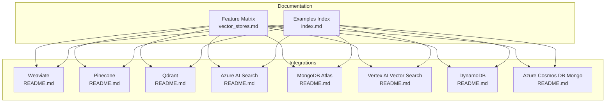

**Diagram sources**
- [vector_stores.md](file://docs/src/content/docs/framework/module_guides/storing/vector_stores.md#L13-L71)
- [index.md](file://docs/examples/index.md#L54-L68)
- [README.md](file://llama-index-integrations/vector_stores/llama-index-vector-stores-weaviate/README.md#L1-L2)
- [README.md](file://llama-index-integrations/vector_stores/llama-index-vector-stores-pinecone/README.md#L1-L2)
- [README.md](file://llama-index-integrations/vector_stores/llama-index-vector-stores-qdrant/README.md#L1-L2)
- [README.md](file://llama-index-integrations/vector_stores/llama-index-vector-stores-azureaisearch/README.md#L1-L2)
- [README.md](file://llama-index-integrations/vector_stores/llama-index-vector-stores-mongodb/README.md#L1-L134)
- [README.md](file://llama-index-integrations/vector_stores/llama-index-vector-stores-vertexaivectorsearch/README.md#L1-L210)
- [README.md](file://llama-index-integrations/vector_stores/llama-index-vector-stores-dynamodb/README.md#L1-L2)
- [README.md](file://llama-index-integrations/vector_stores/llama-index-vector-stores-azurecosmosmongo/README.md#L1-L2)

**Section sources**
- [vector_stores.md](file://docs/src/content/docs/framework/module_guides/storing/vector_stores.md#L13-L71)
- [index.md](file://docs/examples/index.md#L54-L68)

## Core Components
- Feature matrix and provider support: The feature matrix enumerates provider categories, capabilities (metadata filtering, hybrid search, delete, store documents, async), and indicates whether providers are cloud/self-hosted/aggregator.
- Provider-specific READMEs: Each integration package includes a concise README that outlines installation, quick start, and usage notes for the respective provider.
- API reference pages: API reference pages document parameters, query modes, and capabilities for each vector store.

Key takeaways:
- Providers covered include Weaviate, Pinecone, Qdrant, Azure AI Search, MongoDB Atlas, Vertex AI Vector Search, DynamoDB, and Azure Cosmos DB Mongo.
- Feature coverage varies by provider; hybrid search, metadata filtering, and delete operations are highlighted in the matrix.

**Section sources**
- [vector_stores.md](file://docs/src/content/docs/framework/module_guides/storing/vector_stores.md#L13-L71)

## Architecture Overview
The integrations follow a consistent pattern:
- Initialize a provider-specific vector store client using credentials and configuration parameters.
- Create a StorageContext with the vector store.
- Build a VectorStoreIndex from documents and use it via a query engine.

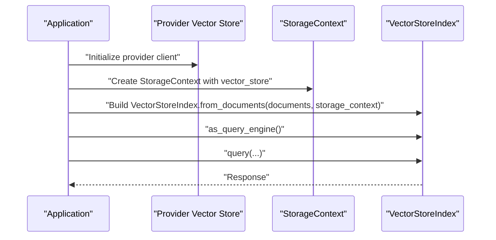

[No sources needed since this diagram shows conceptual workflow, not actual code structure]

## Detailed Component Analysis

### Weaviate Integration
- Purpose: Graph-based vector search with schema management and a GraphQL-like API.
- Capabilities: Supports metadata filtering, hybrid search, delete, store documents, and async operations.
- Documentation pointers:
  - Provider README: [README.md](file://llama-index-integrations/vector_stores/llama-index-vector-stores-weaviate/README.md#L1-L2)
  - API reference: [weaviate.md](file://docs/api_reference/api_reference/storage/vector_store/weaviate.md)
  - Examples index: [index.md](file://docs/examples/index.md#L54-L68)

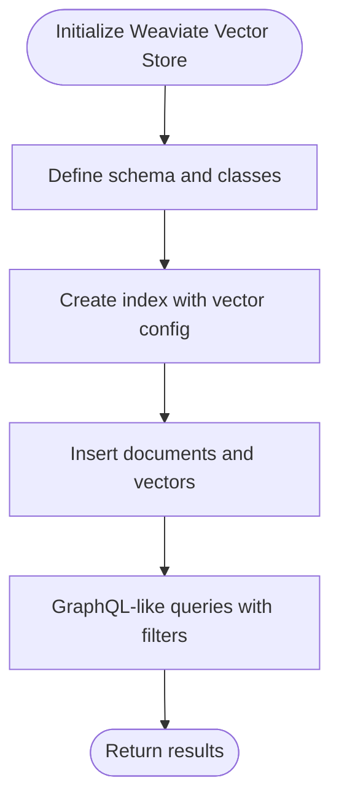

**Diagram sources**
- [README.md](file://llama-index-integrations/vector_stores/llama-index-vector-stores-weaviate/README.md#L1-L2)
- [weaviate.md](file://docs/api_reference/api_reference/storage/vector_store/weaviate.md)

**Section sources**
- [vector_stores.md](file://docs/src/content/docs/framework/module_guides/storing/vector_stores.md#L13-L71)
- [README.md](file://llama-index-integrations/vector_stores/llama-index-vector-stores-weaviate/README.md#L1-L2)
- [weaviate.md](file://docs/api_reference/api_reference/storage/vector_store/weaviate.md)
- [index.md](file://docs/examples/index.md#L54-L68)

### Pinecone Integration
- Purpose: Managed vector database with namespaces, metric types, and serverless options.
- Capabilities: Supports metadata filtering, hybrid search, delete, store documents, and async operations.
- Documentation pointers:
  - Provider README: [README.md](file://llama-index-integrations/vector_stores/llama-index-vector-stores-pinecone/README.md#L1-L2)
  - API reference: [pinecone.md](file://docs/api_reference/api_reference/storage/vector_store/pinecone.md)
  - Examples index: [index.md](file://docs/examples/index.md#L54-L68)

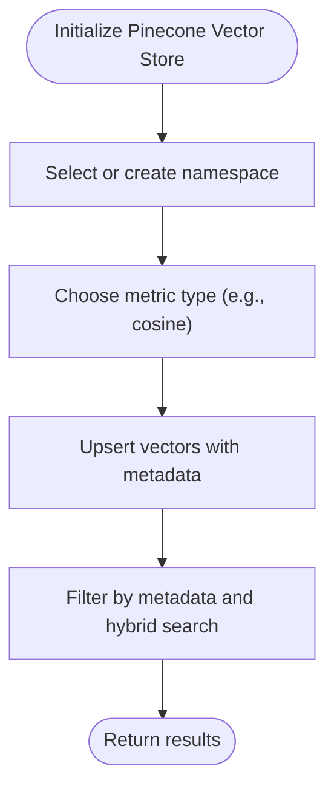

**Diagram sources**
- [README.md](file://llama-index-integrations/vector_stores/llama-index-vector-stores-pinecone/README.md#L1-L2)
- [pinecone.md](file://docs/api_reference/api_reference/storage/vector_store/pinecone.md)

**Section sources**
- [vector_stores.md](file://docs/src/content/docs/framework/module_guides/storing/vector_stores.md#L13-L71)
- [README.md](file://llama-index-integrations/vector_stores/llama-index-vector-stores-pinecone/README.md#L1-L2)
- [pinecone.md](file://docs/api_reference/api_reference/storage/vector_store/pinecone.md)
- [index.md](file://docs/examples/index.md#L54-L68)

### Qdrant Integration
- Purpose: Self-hosted/cloud vector database supporting sharding, replication, and hybrid search.
- Capabilities: Supports metadata filtering, hybrid search, delete, store documents, and async operations.
- Documentation pointers:
  - Provider README: [README.md](file://llama-index-integrations/vector_stores/llama-index-vector-stores-qdrant/README.md#L1-L2)
  - API reference: [qdrant.md](file://docs/api_reference/api_reference/storage/vector_store/qdrant.md)
  - Examples index: [index.md](file://docs/examples/index.md#L54-L68)

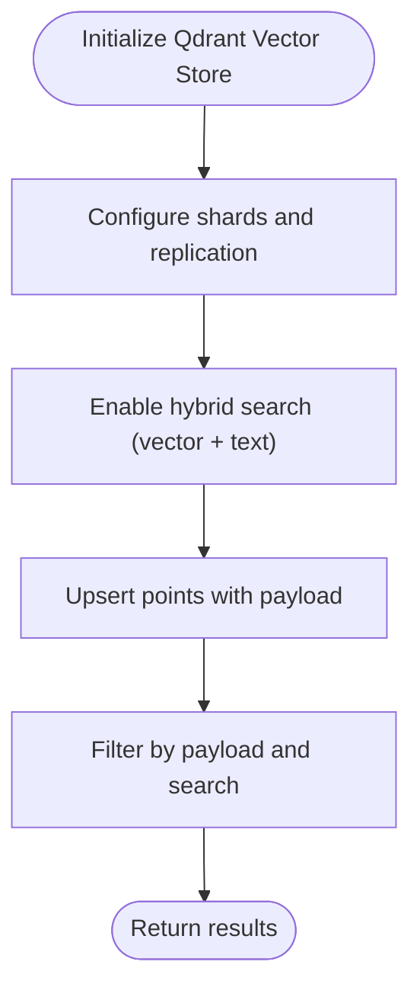

**Diagram sources**
- [README.md](file://llama-index-integrations/vector_stores/llama-index-vector-stores-qdrant/README.md#L1-L2)
- [qdrant.md](file://docs/api_reference/api_reference/storage/vector_store/qdrant.md)

**Section sources**
- [vector_stores.md](file://docs/src/content/docs/framework/module_guides/storing/vector_stores.md#L13-L71)
- [README.md](file://llama-index-integrations/vector_stores/llama-index-vector-stores-qdrant/README.md#L1-L2)
- [qdrant.md](file://docs/api_reference/api_reference/storage/vector_store/qdrant.md)
- [index.md](file://docs/examples/index.md#L54-L68)

### Azure AI Search Integration
- Purpose: Enterprise search scenarios leveraging Azure Cognitive Services.
- Capabilities: Supports metadata filtering, hybrid search, delete, store documents, and async operations.
- Documentation pointers:
  - Provider README: [README.md](file://llama-index-integrations/vector_stores/llama-index-vector-stores-azureaisearch/README.md#L1-L2)
  - API reference: [azureaisearch.md](file://docs/api_reference/api_reference/storage/vector_store/azureaisearch.md)
  - Examples index: [index.md](file://docs/examples/index.md#L54-L68)

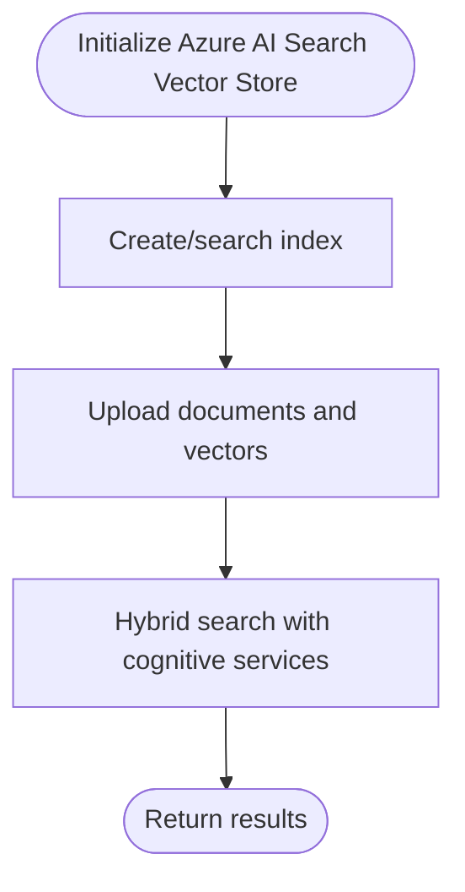

**Diagram sources**
- [README.md](file://llama-index-integrations/vector_stores/llama-index-vector-stores-azureaisearch/README.md#L1-L2)
- [azureaisearch.md](file://docs/api_reference/api_reference/storage/vector_store/azureaisearch.md)

**Section sources**
- [vector_stores.md](file://docs/src/content/docs/framework/module_guides/storing/vector_stores.md#L13-L71)
- [README.md](file://llama-index-integrations/vector_stores/llama-index-vector-stores-azureaisearch/README.md#L1-L2)
- [azureaisearch.md](file://docs/api_reference/api_reference/storage/vector_store/azureaisearch.md)
- [index.md](file://docs/examples/index.md#L54-L68)

### MongoDB Atlas Vector Search
- Purpose: Aggregation pipelines and text search alongside vector similarity.
- Capabilities: Supports metadata filtering, hybrid search, delete, store documents, and async operations.
- Documentation pointers:
  - Provider README: [README.md](file://llama-index-integrations/vector_stores/llama-index-vector-stores-mongodb/README.md#L1-L134)
  - Examples index: [index.md](file://docs/examples/index.md#L54-L68)

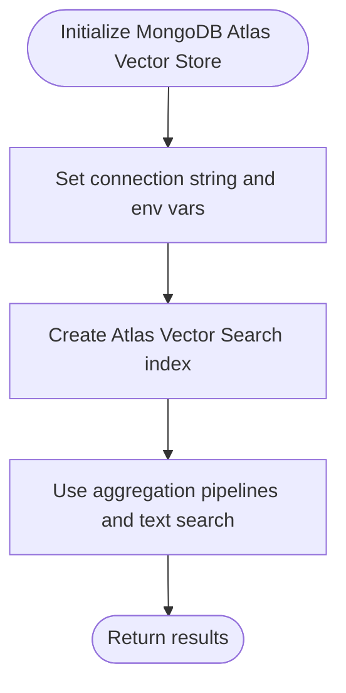

**Diagram sources**
- [README.md](file://llama-index-integrations/vector_stores/llama-index-vector-stores-mongodb/README.md#L1-L134)

**Section sources**
- [vector_stores.md](file://docs/src/content/docs/framework/module_guides/storing/vector_stores.md#L13-L71)
- [README.md](file://llama-index-integrations/vector_stores/llama-index-vector-stores-mongodb/README.md#L1-L134)
- [index.md](file://docs/examples/index.md#L54-L68)

### Google Vertex AI Vector Search
- Purpose: Fully managed, scalable vector similarity search on Google Cloud.
- Capabilities: Supports metadata filtering, hybrid search (v2), delete, store documents, and async operations.
- Documentation pointers:
  - Provider README: [README.md](file://llama-index-integrations/vector_stores/llama-index-vector-stores-vertexaivectorsearch/README.md#L1-L210)
  - API reference: [vectoraivectorsearch.md](file://docs/api_reference/api_reference/storage/vector_store/vertexaivectorsearch.md)
  - Examples index: [index.md](file://docs/examples/index.md#L54-L68)

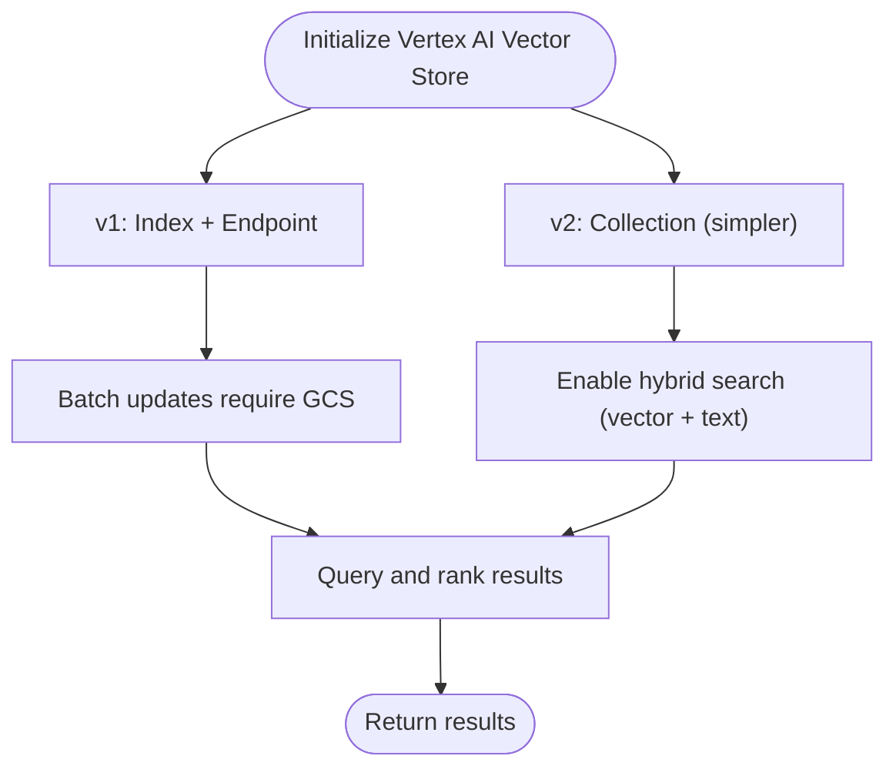

**Diagram sources**
- [README.md](file://llama-index-integrations/vector_stores/llama-index-vector-stores-vertexaivectorsearch/README.md#L1-L210)
- [vectoraivectorsearch.md](file://docs/api_reference/api_reference/storage/vector_store/vertexaivectorsearch.md)

**Section sources**
- [vector_stores.md](file://docs/src/content/docs/framework/module_guides/storing/vector_stores.md#L13-L71)
- [README.md](file://llama-index-integrations/vector_stores/llama-index-vector-stores-vertexaivectorsearch/README.md#L1-L210)
- [vectoraivectorsearch.md](file://docs/api_reference/api_reference/storage/vector_store/vertexaivectorsearch.md)
- [index.md](file://docs/examples/index.md#L54-L68)

### AWS DynamoDB Vector Search
- Purpose: On-demand capacity and global tables for vector workloads.
- Capabilities: Supports metadata filtering, delete, store documents, and async operations.
- Documentation pointers:
  - Provider README: [README.md](file://llama-index-integrations/vector_stores/llama-index-vector-stores-dynamodb/README.md#L1-L2)
  - Examples index: [index.md](file://docs/examples/index.md#L54-L68)

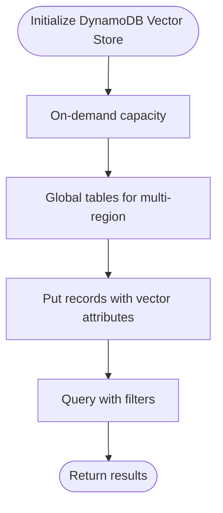

**Diagram sources**
- [README.md](file://llama-index-integrations/vector_stores/llama-index-vector-stores-dynamodb/README.md#L1-L2)

**Section sources**
- [vector_stores.md](file://docs/src/content/docs/framework/module_guides/storing/vector_stores.md#L13-L71)
- [README.md](file://llama-index-integrations/vector_stores/llama-index-vector-stores-dynamodb/README.md#L1-L2)
- [index.md](file://docs/examples/index.md#L54-L68)

### Azure Cosmos DB Vector Search
- Purpose: Multi-master replication for globally distributed vector workloads.
- Capabilities: Supports metadata filtering, delete, store documents, and async operations.
- Documentation pointers:
  - Provider README: [README.md](file://llama-index-integrations/vector_stores/llama-index-vector-stores-azurecosmosmongo/README.md#L1-L2)
  - API reference: [azurecosmosmongo.md](file://docs/api_reference/api_reference/storage/vector_store/azurecosmosmongo.md)
  - Examples index: [index.md](file://docs/examples/index.md#L54-L68)

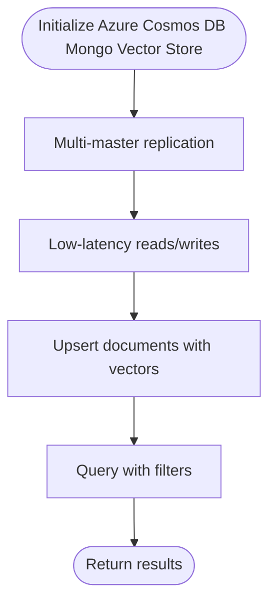

**Diagram sources**
- [README.md](file://llama-index-integrations/vector_stores/llama-index-vector-stores-azurecosmosmongo/README.md#L1-L2)
- [azurecosmosmongo.md](file://docs/api_reference/api_reference/storage/vector_store/azurecosmosmongo.md)

**Section sources**
- [vector_stores.md](file://docs/src/content/docs/framework/module_guides/storing/vector_stores.md#L13-L71)
- [README.md](file://llama-index-integrations/vector_stores/llama-index-vector-stores-azurecosmosmongo/README.md#L1-L2)
- [azurecosmosmongo.md](file://docs/api_reference/api_reference/storage/vector_store/azurecosmosmongo.md)
- [index.md](file://docs/examples/index.md#L54-L68)

## Dependency Analysis
- Provider categorization: The feature matrix classifies providers as cloud/self-hosted/aggregator and lists capability support per provider.
- Cross-reference to examples: The examples index links to provider-specific notebooks and demos.

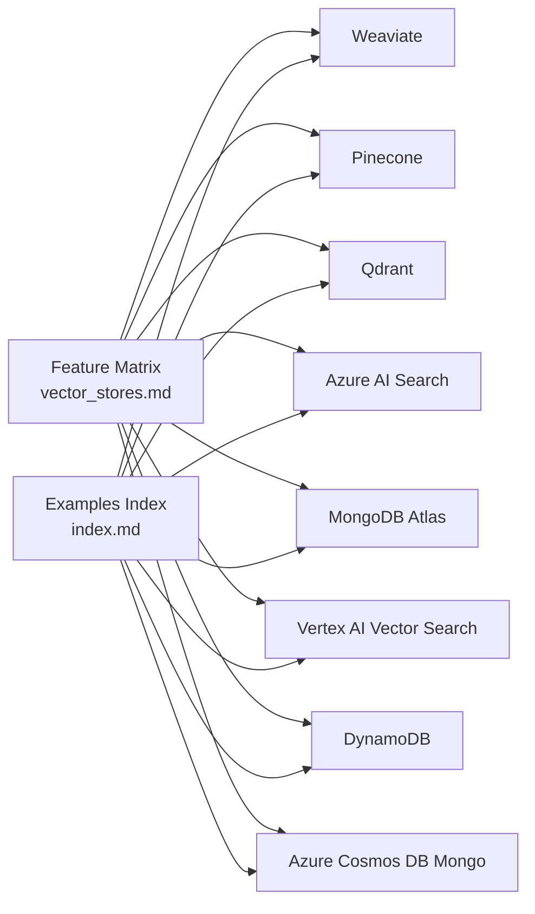

**Diagram sources**
- [vector_stores.md](file://docs/src/content/docs/framework/module_guides/storing/vector_stores.md#L13-L71)
- [index.md](file://docs/examples/index.md#L54-L68)

**Section sources**
- [vector_stores.md](file://docs/src/content/docs/framework/module_guides/storing/vector_stores.md#L13-L71)
- [index.md](file://docs/examples/index.md#L54-L68)

## Performance Considerations
- Provider capabilities: The feature matrix highlights which providers support hybrid search, metadata filtering, delete, store documents, and async operations. These capabilities influence performance characteristics and operational patterns.
- Query modes and hybrid search: Providers like Vertex AI Vector Search and Qdrant offer hybrid search modes that combine vector and text-based retrieval, potentially improving recall and relevance.

[No sources needed since this section provides general guidance]

## Troubleshooting Guide
- MongoDB Atlas: The provider README includes troubleshooting tips such as verifying the connection string, ensuring database access credentials, and whitelisting IPs.
- General provider setup: Refer to each provider’s README for environment variables, authentication, and configuration steps.

**Section sources**
- [README.md](file://llama-index-integrations/vector_stores/llama-index-vector-stores-mongodb/README.md#L60-L68)

## Conclusion
The repository provides robust, provider-specific integrations for cloud-hosted vector stores, each with tailored configuration, query modes, and operational considerations. The feature matrix and API references help align capabilities with use cases, while provider READMEs offer practical setup guidance.

[No sources needed since this section summarizes without analyzing specific files]

## Appendices
- Additional provider references:
  - Vertex AI Vector Search API reference: [vectoraivectorsearch.md](file://docs/api_reference/api_reference/storage/vector_store/vertexaivectorsearch.md)
  - Azure Cosmos DB Mongo API reference: [azurecosmosmongo.md](file://docs/api_reference/api_reference/storage/vector_store/azurecosmosmongo.md)
  - Azure AI Search API reference: [azureaisearch.md](file://docs/api_reference/api_reference/storage/vector_store/azureaisearch.md)
  - Pinecone API reference: [pinecone.md](file://docs/api_reference/api_reference/storage/vector_store/pinecone.md)
  - Qdrant API reference: [qdrant.md](file://docs/api_reference/api_reference/storage/vector_store/qdrant.md)
  - Weaviate API reference: [weaviate.md](file://docs/api_reference/api_reference/storage/vector_store/weaviate.md)

[No sources needed since this section aggregates references without analyzing specific files]