# Database Integrations

<cite>
**Referenced Files in This Document**
- [vector_stores.md](file://docs/src/content/docs/framework/community/integrations/vector_stores.md)
- [postgres/base.py](file://llama-index-integrations/vector_stores/llama-index-vector-stores-postgres/llama_index/vector_stores/postgres/base.py)
- [mongodb/base.py](file://llama-index-integrations/vector_stores/llama-index-vector-stores-mongodb/llama_index/vector_stores/mongodb/base.py)
- [redis/base.py](file://llama-index-integrations/vector_stores/llama-index-vector-stores-redis/llama_index/vector_stores/redis/base.py)
- [cassandra/base.py](file://llama-index-integrations/vector_stores/llama-index-vector-stores-cassandra/llama_index/vector_stores/cassandra/base.py)
- [clickhouse/base.py](file://llama-index-integrations/vector_stores/llama-index-vector-stores-clickhouse/llama_index/vector_stores/clickhouse/base.py)
- [mariadb/base.py](file://llama-index-integrations/vector_stores/llama-index-vector-stores-mariadb/llama_index/vector_stores/mariadb/base.py)
- [singlestoredb/base.py](file://llama-index-integrations/vector_stores/llama-index-vector-stores-singlestoredb/llama_index/vector_stores/singlestoredb/base.py)
- [oracledb/base.py](file://llama-index-integrations/vector_stores/llama-index-vector-stores-oracledb/llama_index/vector_stores/oracledb/base.py)
- [bigquery/base.py](file://llama-index-integrations/vector_stores/llama-index-vector-stores-bigquery/llama_index/vector_stores/bigquery/base.py)
- [supabase/base.py](file://llama-index-integrations/vector_stores/llama-index-vector-stores-supabase/llama_index/vector_stores/supabase/base.py)
</cite>

## Table of Contents
1. [Introduction](#introduction)
2. [Project Structure](#project-structure)
3. [Core Components](#core-components)
4. [Architecture Overview](#architecture-overview)
5. [Detailed Component Analysis](#detailed-component-analysis)
6. [Dependency Analysis](#dependency-analysis)
7. [Performance Considerations](#performance-considerations)
8. [Troubleshooting Guide](#troubleshooting-guide)
9. [Conclusion](#conclusion)

## Introduction
This document explains how the LlamaIndex repository integrates with traditional databases enhanced by vector search capabilities. It covers PostgreSQL/pgvector, MongoDB Atlas Vector Search, Redis with RediSearch, Cassandra with wide-column modeling, ClickHouse for analytical workloads, MariaDB and MySQL alternatives, SingleStoreDB for HTAP, Oracle Database vector search, BigQuery Vector Search, and Supabase Vector. For each database, we describe setup, indexing strategies, query flows, and operational guidance including connection pooling and scaling.

## Project Structure
The repository organizes vector store integrations under dedicated packages per database. Each package exposes a vector store class implementing a common interface and often includes helpers for connection management, indexing, and query building.

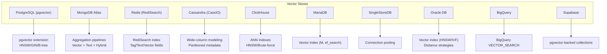

**Diagram sources**
- [postgres/base.py](file://llama-index-integrations/vector_stores/llama-index-vector-stores-postgres/llama_index/vector_stores/postgres/base.py#L1-L226)
- [mongodb/base.py](file://llama-index-integrations/vector_stores/llama-index-vector-stores-mongodb/llama_index/vector_stores/mongodb/base.py#L1-L120)
- [redis/base.py](file://llama-index-integrations/vector_stores/llama-index-vector-stores-redis/llama_index/vector_stores/redis/base.py#L81-L150)
- [cassandra/base.py](file://llama-index-integrations/vector_stores/llama-index-vector-stores-cassandra/llama_index/vector_stores/cassandra/base.py#L50-L106)
- [clickhouse/base.py](file://llama-index-integrations/vector_stores/llama-index-vector-stores-clickhouse/llama_index/vector_stores/clickhouse/base.py#L120-L180)
- [mariadb/base.py](file://llama-index-integrations/vector_stores/llama-index-vector-stores-mariadb/llama_index/vector_stores/mariadb/base.py#L37-L120)
- [singlestoredb/base.py](file://llama-index-integrations/vector_stores/llama-index-vector-stores-singlestoredb/llama_index/vector_stores/singlestoredb/base.py#L23-L120)
- [oracledb/base.py](file://llama-index-integrations/vector_stores/llama-index-vector-stores-oracledb/llama_index/vector_stores/oracledb/base.py#L405-L480)
- [bigquery/base.py](file://llama-index-integrations/vector_stores/llama-index-vector-stores-bigquery/llama_index/vector_stores/bigquery/base.py#L50-L130)
- [supabase/base.py](file://llama-index-integrations/vector_stores/llama-index-vector-stores-supabase/llama_index/vector_stores/supabase/base.py#L27-L84)

**Section sources**
- [vector_stores.md](file://docs/src/content/docs/framework/community/integrations/vector_stores.md#L10-L740)

## Core Components
- PostgreSQL/pgvector: Dynamic table creation, vector/HNSW indexing, hybrid search with GIN TSVector, metadata indexing, and SQL-based filters.
- MongoDB Atlas: Aggregation pipelines supporting vector search, full-text search, and hybrid fusion; index lifecycle utilities.
- Redis/RediSearch: Index schema-driven design, vector queries, tag/text filters, and persistence controls.
- Cassandra/CassIO: Partitioned metadata vector table, ANN search, and MMR prefetch tuning.
- ClickHouse: MergeTree table with vector similarity index (HNSW), SQL distance functions, and hybrid text search.
- MariaDB: Vector index with configurable HNSW parameters (M, ef_search), JSON metadata filtering, and SQL queries.
- SingleStoreDB: Connection pooling, dot product similarity, JSON metadata extraction, and parameterized queries.
- Oracle DB: Vector index creation (HNSW/IVF), distance strategies, JSON metadata filters, and batched operations.
- BigQuery: VECTOR_SEARCH with pre/post-filtering, JSON metadata, and normalized similarity scoring.
- Supabase: pgvector-backed collections via vecs client, upsert/query/delete operations.

**Section sources**
- [postgres/base.py](file://llama-index-integrations/vector_stores/llama-index-vector-stores-postgres/llama_index/vector_stores/postgres/base.py#L229-L620)
- [mongodb/base.py](file://llama-index-integrations/vector_stores/llama-index-vector-stores-mongodb/llama_index/vector_stores/mongodb/base.py#L52-L200)
- [redis/base.py](file://llama-index-integrations/vector_stores/llama-index-vector-stores-redis/llama_index/vector_stores/redis/base.py#L81-L200)
- [cassandra/base.py](file://llama-index-integrations/vector_stores/llama-index-vector-stores-cassandra/llama_index/vector_stores/cassandra/base.py#L50-L120)
- [clickhouse/base.py](file://llama-index-integrations/vector_stores/llama-index-vector-stores-clickhouse/llama_index/vector_stores/clickhouse/base.py#L120-L220)
- [mariadb/base.py](file://llama-index-integrations/vector_stores/llama-index-vector-stores-mariadb/llama_index/vector_stores/mariadb/base.py#L37-L120)
- [singlestoredb/base.py](file://llama-index-integrations/vector_stores/llama-index-vector-stores-singlestoredb/llama_index/vector_stores/singlestoredb/base.py#L23-L120)
- [oracledb/base.py](file://llama-index-integrations/vector_stores/llama-index-vector-stores-oracledb/llama_index/vector_stores/oracledb/base.py#L405-L480)
- [bigquery/base.py](file://llama-index-integrations/vector_stores/llama-index-vector-stores-bigquery/llama_index/vector_stores/bigquery/base.py#L50-L130)
- [supabase/base.py](file://llama-index-integrations/vector_stores/llama-index-vector-stores-supabase/llama_index/vector_stores/supabase/base.py#L27-L84)

## Architecture Overview
The vector stores share a common pattern: initialize client/connection, optionally create schema/indexes, ingest embeddings and metadata, and execute queries with filters and similarity thresholds. Some integrations support hybrid search combining vector and text.

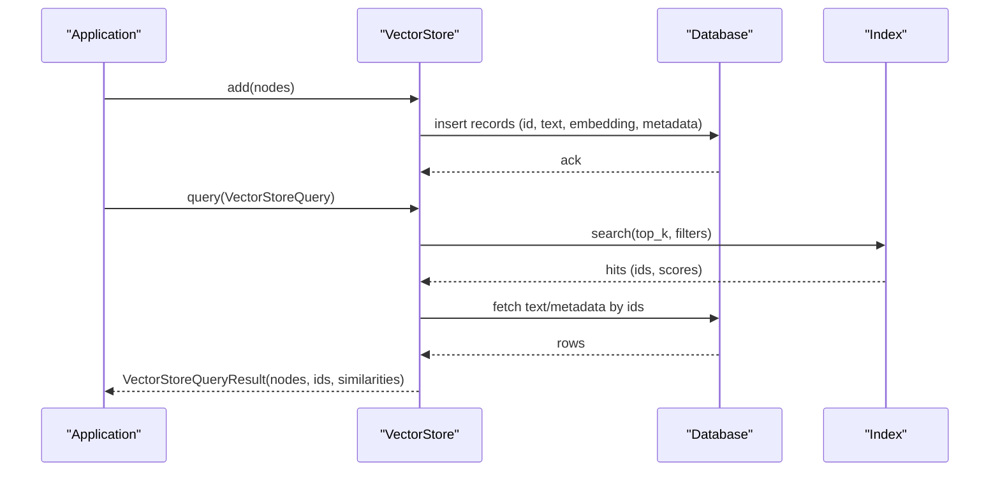

**Diagram sources**
- [postgres/base.py](file://llama-index-integrations/vector_stores/llama-index-vector-stores-postgres/llama_index/vector_stores/postgres/base.py#L631-L651)
- [redis/base.py](file://llama-index-integrations/vector_stores/llama-index-vector-stores-redis/llama_index/vector_stores/redis/base.py#L665-L702)
- [cassandra/base.py](file://llama-index-integrations/vector_stores/llama-index-vector-stores-cassandra/llama_index/vector_stores/cassandra/base.py#L221-L337)
- [clickhouse/base.py](file://llama-index-integrations/vector_stores/llama-index-vector-stores-clickhouse/llama_index/vector_stores/clickhouse/base.py#L444-L537)
- [mariadb/base.py](file://llama-index-integrations/vector_stores/llama-index-vector-stores-mariadb/llama_index/vector_stores/mariadb/base.py#L398-L437)
- [singlestoredb/base.py](file://llama-index-integrations/vector_stores/llama-index-vector-stores-singlestoredb/llama_index/vector_stores/singlestoredb/base.py#L230-L319)
- [oracledb/base.py](file://llama-index-integrations/vector_stores/llama-index-vector-stores-oracledb/llama_index/vector_stores/oracledb/base.py#L675-L766)
- [bigquery/base.py](file://llama-index-integrations/vector_stores/llama-index-vector-stores-bigquery/llama_index/vector_stores/bigquery/base.py#L341-L439)
- [supabase/base.py](file://llama-index-integrations/vector_stores/llama-index-vector-stores-supabase/llama_index/vector_stores/supabase/base.py#L108-L220)

## Detailed Component Analysis

### PostgreSQL with pgvector
- Setup and indexing
  - Creates schema/table dynamically with vector column and optional JSON/JSONB metadata.
  - Supports HNSW index creation with configurable distance operator and construction parameters.
  - Hybrid search with GIN TSVector index and computed text search vector.
  - Metadata indexing via B-tree and GIN for arrays.
- Querying
  - SQL-based filters with operator mapping and JSON path extraction.
  - Vector similarity using vector distance functions; optional hybrid ranking.
- Operational notes
  - Extension “vector” must be enabled.
  - Half-precision vectors supported via HALFVEC.

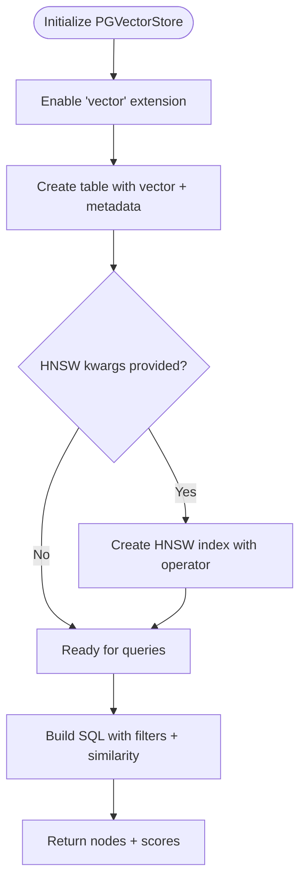

**Diagram sources**
- [postgres/base.py](file://llama-index-integrations/vector_stores/llama-index-vector-stores-postgres/llama_index/vector_stores/postgres/base.py#L543-L617)
- [postgres/base.py](file://llama-index-integrations/vector_stores/llama-index-vector-stores-postgres/llama_index/vector_stores/postgres/base.py#L792-L800)
- [postgres/base.py](file://llama-index-integrations/vector_stores/llama-index-vector-stores-postgres/llama_index/vector_stores/postgres/base.py#L653-L750)

**Section sources**
- [postgres/base.py](file://llama-index-integrations/vector_stores/llama-index-vector-stores-postgres/llama_index/vector_stores/postgres/base.py#L229-L620)

### MongoDB Atlas Vector Search
- Pipeline-based search
  - Vector search stage, full-text search stage, and hybrid reciprocal rank fusion.
  - Index lifecycle helpers for vector and full-text indexes.
- Query modes
  - DEFAULT: vector search with optional filters.
  - TEXT_SEARCH: full-text search.
  - HYBRID: combine both with fused ranking.
- Metadata filtering
  - Converts filters to MQL expressions for aggregation.

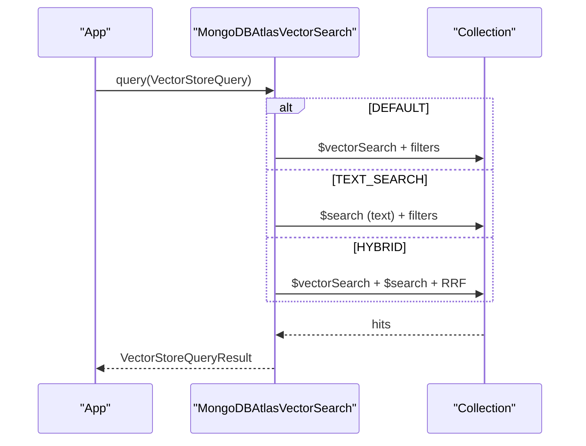

**Diagram sources**
- [mongodb/base.py](file://llama-index-integrations/vector_stores/llama-index-vector-stores-mongodb/llama_index/vector_stores/mongodb/base.py#L419-L514)
- [mongodb/base.py](file://llama-index-integrations/vector_stores/llama-index-vector-stores-mongodb/llama_index/vector_stores/mongodb/base.py#L516-L591)

**Section sources**
- [mongodb/base.py](file://llama-index-integrations/vector_stores/llama-index-vector-stores-mongodb/llama_index/vector_stores/mongodb/base.py#L52-L200)

### Redis with RediSearch
- Index schema
  - Requires core fields (id, doc_id, text, vector) and optional metadata fields.
  - Supports custom index name, key prefix, and vector index algorithm selection.
- Querying
  - Vector queries with optional metadata filters; fallback to filter-only queries.
  - Token escaping for text filters; supports Tag-based expressions.
- Persistence
  - Background or foreground save to disk.

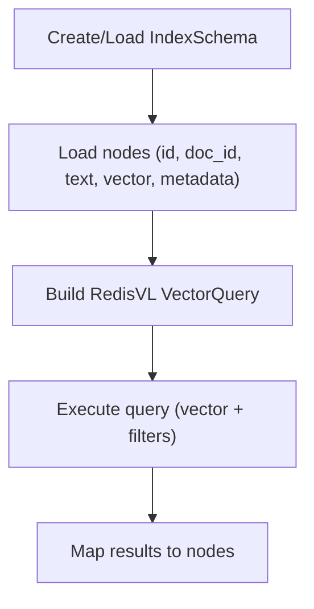

**Diagram sources**
- [redis/base.py](file://llama-index-integrations/vector_stores/llama-index-vector-stores-redis/llama_index/vector_stores/redis/base.py#L301-L358)
- [redis/base.py](file://llama-index-integrations/vector_stores/llama-index-vector-stores-redis/llama_index/vector_stores/redis/base.py#L605-L702)

**Section sources**
- [redis/base.py](file://llama-index-integrations/vector_stores/llama-index-vector-stores-redis/llama_index/vector_stores/redis/base.py#L81-L200)

### Cassandra with wide-column modeling
- Table abstraction
  - Uses ClusteredMetadataVectorCassandraTable with partitioned metadata and vector column.
  - Configurable TTL and batched inserts.
- Querying
  - ANN search with cosine distance and optional exact-match metadata filters.
  - MMR support with prefetch factor/k tuning.

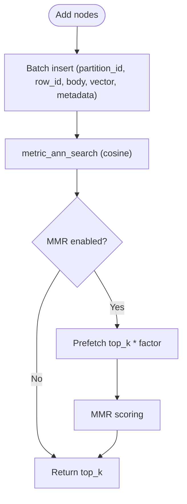

**Diagram sources**
- [cassandra/base.py](file://llama-index-integrations/vector_stores/llama-index-vector-stores-cassandra/llama_index/vector_stores/cassandra/base.py#L139-L193)
- [cassandra/base.py](file://llama-index-integrations/vector_stores/llama-index-vector-stores-cassandra/llama_index/vector_stores/cassandra/base.py#L221-L337)

**Section sources**
- [cassandra/base.py](file://llama-index-integrations/vector_stores/llama-index-vector-stores-cassandra/llama_index/vector_stores/cassandra/base.py#L50-L120)

### ClickHouse for analytical vector workloads
- Table and index
  - MergeTree table with vector column and optional HNSW vector_similarity index.
  - Constraints enforce vector dimension.
- Querying
  - SQL distance functions (L2/cosine) with WHERE filters and LIMIT.
  - Hybrid search amplifies candidate set and ranks by text match and BM25-like signals.
- Scaling
  - Batched inserts via client; consider sharding/partitioning for large datasets.

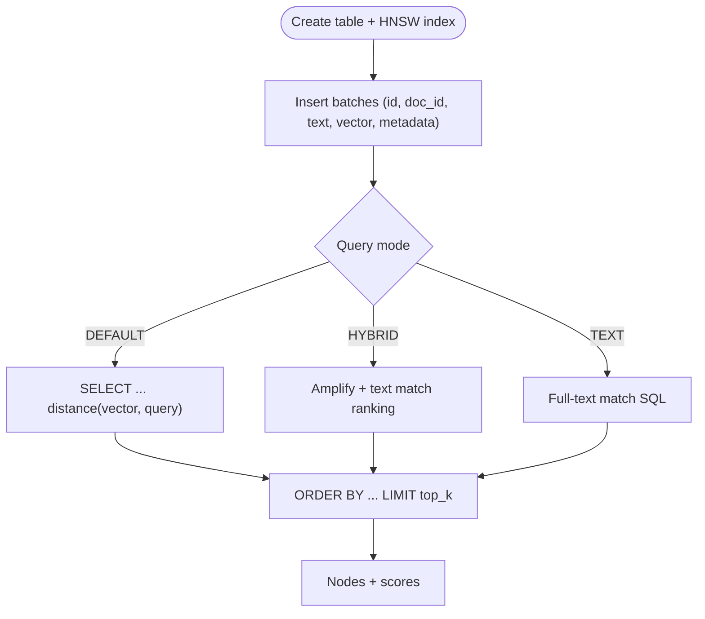

**Diagram sources**
- [clickhouse/base.py](file://llama-index-integrations/vector_stores/llama-index-vector-stores-clickhouse/llama_index/vector_stores/clickhouse/base.py#L277-L333)
- [clickhouse/base.py](file://llama-index-integrations/vector_stores/llama-index-vector-stores-clickhouse/llama_index/vector_stores/clickhouse/base.py#L444-L537)

**Section sources**
- [clickhouse/base.py](file://llama-index-integrations/vector_stores/llama-index-vector-stores-clickhouse/llama_index/vector_stores/clickhouse/base.py#L120-L220)

### MariaDB and MySQL alternatives
- MariaDB
  - Validates server version, creates table with vector column and vector index.
  - Uses HNSW parameters (M, ef_search) via SET STATEMENT.
  - Filters via JSON_VALUE/JSON_EXTRACT with operator mapping.
- MySQL
  - The repository includes a MariaDB vector store; MySQL usage would mirror the same SQL constructs and JSON metadata handling.

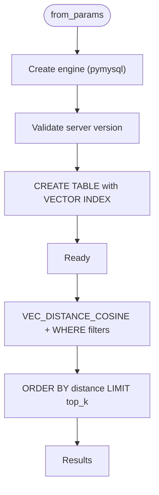

**Diagram sources**
- [mariadb/base.py](file://llama-index-integrations/vector_stores/llama-index-vector-stores-mariadb/llama_index/vector_stores/mariadb/base.py#L132-L191)
- [mariadb/base.py](file://llama-index-integrations/vector_stores/llama-index-vector-stores-mariadb/llama_index/vector_stores/mariadb/base.py#L235-L241)
- [mariadb/base.py](file://llama-index-integrations/vector_stores/llama-index-vector-stores-mariadb/llama_index/vector_stores/mariadb/base.py#L398-L437)

**Section sources**
- [mariadb/base.py](file://llama-index-integrations/vector_stores/llama-index-vector-stores-mariadb/llama_index/vector_stores/mariadb/base.py#L37-L120)

### SingleStoreDB for HTAP
- Connection pooling
  - QueuePool configured with pool_size, max_overflow, and timeout.
- Querying
  - Dot product similarity with JSON metadata extraction.
  - Parameterized queries and iterative deletes.

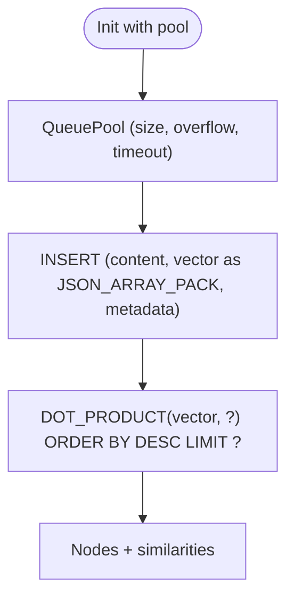

**Diagram sources**
- [singlestoredb/base.py](file://llama-index-integrations/vector_stores/llama-index-vector-stores-singlestoredb/llama_index/vector_stores/singlestoredb/base.py#L95-L123)
- [singlestoredb/base.py](file://llama-index-integrations/vector_stores/llama-index-vector-stores-singlestoredb/llama_index/vector_stores/singlestoredb/base.py#L230-L319)

**Section sources**
- [singlestoredb/base.py](file://llama-index-integrations/vector_stores/llama-index-vector-stores-singlestoredb/llama_index/vector_stores/singlestoredb/base.py#L23-L120)

### Oracle Database vector search
- Index creation
  - HNSW or IVF vector indexes with distance strategy selection.
- Querying
  - vector_distance function with optional metadata filters using JSON operators.
  - Batched inserts and approximate first-row fetching.

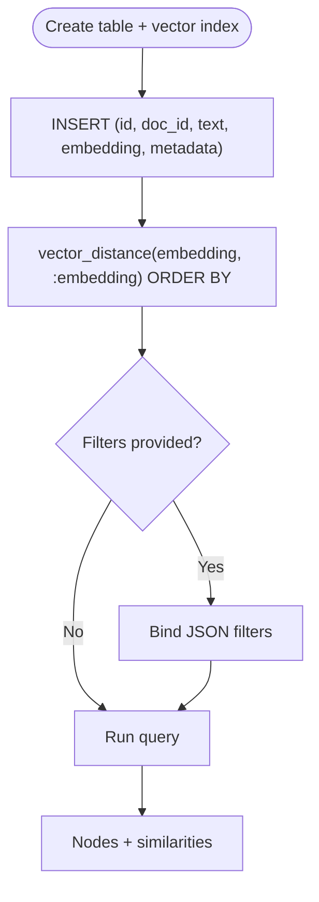

**Diagram sources**
- [oracledb/base.py](file://llama-index-integrations/vector_stores/llama-index-vector-stores-oracledb/llama_index/vector_stores/oracledb/base.py#L277-L379)
- [oracledb/base.py](file://llama-index-integrations/vector_stores/llama-index-vector-stores-oracledb/llama_index/vector_stores/oracledb/base.py#L675-L766)

**Section sources**
- [oracledb/base.py](file://llama-index-integrations/vector_stores/llama-index-vector-stores-oracledb/llama_index/vector_stores/oracledb/base.py#L405-L480)

### BigQuery Vector Search
- Table and schema
  - STRING id, STRING text, JSON metadata, FLOAT repeated embedding.
- Querying
  - VECTOR_SEARCH with pre/post-filtering; supports EUCLIDEAN/COSINE/DOT_PRODUCT.
  - Normalized similarity scoring and parameterized queries.

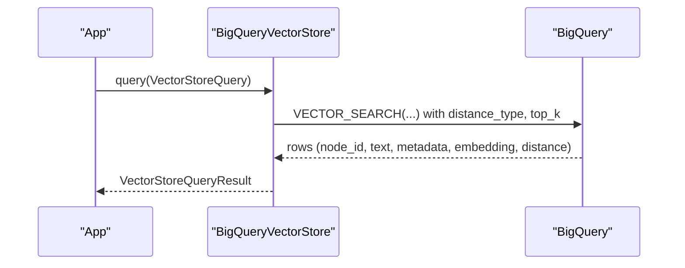

**Diagram sources**
- [bigquery/base.py](file://llama-index-integrations/vector_stores/llama-index-vector-stores-bigquery/llama_index/vector_stores/bigquery/base.py#L341-L439)

**Section sources**
- [bigquery/base.py](file://llama-index-integrations/vector_stores/llama-index-vector-stores-bigquery/llama_index/vector_stores/bigquery/base.py#L50-L130)

### Supabase Vector
- Backend
  - Uses pgvector-backed vecs collections; wraps client operations.
- Querying
  - Upsert/query/delete via vecs; filters use equality operator.

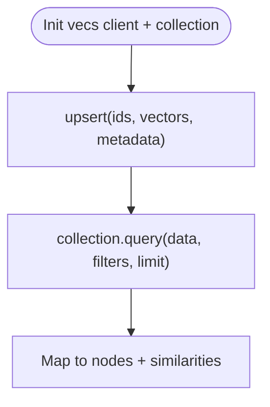

**Diagram sources**
- [supabase/base.py](file://llama-index-integrations/vector_stores/llama-index-vector-stores-supabase/llama_index/vector_stores/supabase/base.py#L108-L134)
- [supabase/base.py](file://llama-index-integrations/vector_stores/llama-index-vector-stores-supabase/llama_index/vector_stores/supabase/base.py#L169-L220)

**Section sources**
- [supabase/base.py](file://llama-index-integrations/vector_stores/llama-index-vector-stores-supabase/llama_index/vector_stores/supabase/base.py#L27-L84)

## Dependency Analysis
- Common abstractions
  - All vector stores inherit from a base Pydantic vector store interface, ensuring consistent add/query/delete semantics.
- External dependencies
  - PostgreSQL: SQLAlchemy, asyncpg/pgvector, TSVector.
  - MongoDB: pymongo, aggregation stages.
  - Redis: redis-py, redisvl, IndexSchema.
  - Cassandra: cassio.
  - ClickHouse: clickhouse_connect.
  - MariaDB: SQLAlchemy, pymysql.
  - SingleStoreDB: singlestoredb, QueuePool.
  - Oracle: oracledb.
  - BigQuery: google-cloud-bigquery.
  - Supabase: vecs.

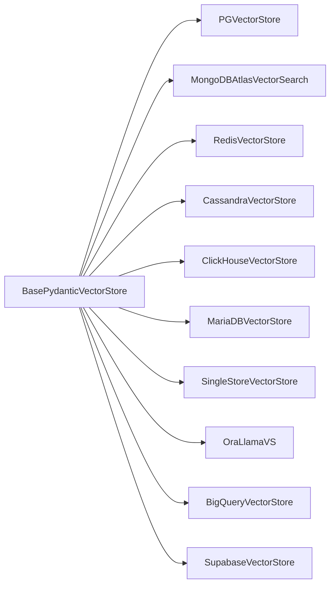

**Diagram sources**
- [postgres/base.py](file://llama-index-integrations/vector_stores/llama-index-vector-stores-postgres/llama_index/vector_stores/postgres/base.py#L229-L285)
- [mongodb/base.py](file://llama-index-integrations/vector_stores/llama-index-vector-stores-mongodb/llama_index/vector_stores/mongodb/base.py#L52-L120)
- [redis/base.py](file://llama-index-integrations/vector_stores/llama-index-vector-stores-redis/llama_index/vector_stores/redis/base.py#L81-L150)
- [cassandra/base.py](file://llama-index-integrations/vector_stores/llama-index-vector-stores-cassandra/llama_index/vector_stores/cassandra/base.py#L50-L106)
- [clickhouse/base.py](file://llama-index-integrations/vector_stores/llama-index-vector-stores-clickhouse/llama_index/vector_stores/clickhouse/base.py#L120-L180)
- [mariadb/base.py](file://llama-index-integrations/vector_stores/llama-index-vector-stores-mariadb/llama_index/vector_stores/mariadb/base.py#L37-L100)
- [singlestoredb/base.py](file://llama-index-integrations/vector_stores/llama-index-vector-stores-singlestoredb/llama_index/vector_stores/singlestoredb/base.py#L23-L94)
- [oracledb/base.py](file://llama-index-integrations/vector_stores/llama-index-vector-stores-oracledb/llama_index/vector_stores/oracledb/base.py#L405-L435)
- [bigquery/base.py](file://llama-index-integrations/vector_stores/llama-index-vector-stores-bigquery/llama_index/vector_stores/bigquery/base.py#L50-L96)
- [supabase/base.py](file://llama-index-integrations/vector_stores/llama-index-vector-stores-supabase/llama_index/vector_stores/supabase/base.py#L27-L70)

**Section sources**
- [postgres/base.py](file://llama-index-integrations/vector_stores/llama-index-vector-stores-postgres/llama_index/vector_stores/postgres/base.py#L229-L310)
- [mongodb/base.py](file://llama-index-integrations/vector_stores/llama-index-vector-stores-mongodb/llama_index/vector_stores/mongodb/base.py#L52-L120)
- [redis/base.py](file://llama-index-integrations/vector_stores/llama-index-vector-stores-redis/llama_index/vector_stores/redis/base.py#L81-L150)
- [cassandra/base.py](file://llama-index-integrations/vector_stores/llama-index-vector-stores-cassandra/llama_index/vector_stores/cassandra/base.py#L50-L106)
- [clickhouse/base.py](file://llama-index-integrations/vector_stores/llama-index-vector-stores-clickhouse/llama_index/vector_stores/clickhouse/base.py#L120-L180)
- [mariadb/base.py](file://llama-index-integrations/vector_stores/llama-index-vector-stores-mariadb/llama_index/vector_stores/mariadb/base.py#L37-L100)
- [singlestoredb/base.py](file://llama-index-integrations/vector_stores/llama-index-vector-stores-singlestoredb/llama_index/vector_stores/singlestoredb/base.py#L23-L94)
- [oracledb/base.py](file://llama-index-integrations/vector_stores/llama-index-vector-stores-oracledb/llama_index/vector_stores/oracledb/base.py#L405-L435)
- [bigquery/base.py](file://llama-index-integrations/vector_stores/llama-index-vector-stores-bigquery/llama_index/vector_stores/bigquery/base.py#L50-L96)
- [supabase/base.py](file://llama-index-integrations/vector_stores/llama-index-vector-stores-supabase/llama_index/vector_stores/supabase/base.py#L27-L70)

## Performance Considerations
- Indexing
  - PostgreSQL: HNSW with tuned ef_construction/M and distance operator; GIN for text arrays; B-tree for scalars.
  - MongoDB: Vector and full-text indexes; hybrid fusion weights.
  - Redis: Tune vector index algorithm and dimensions; ensure proper field specs.
  - Cassandra: Partition metadata for efficient filtering; adjust MMR prefetch factor.
  - ClickHouse: HNSW with quantization and construction parameters; merge tree ordering.
  - MariaDB: HNSW parameters M and ef_search; ensure vector index alignment with distance.
  - SingleStoreDB: Pool sizing and parameterized queries reduce overhead.
  - Oracle: HNSW/IVF with distance strategy; approximate fetch for large top_k.
  - BigQuery: Pre-filtering on indexed columns; consider increasing top_k for post-filtering.
  - Supabase: Collections with dimension alignment; efficient upsert/query.
- Query optimization
  - Use filters to reduce candidate sets; leverage indexes.
  - Hybrid search amplification factors for ClickHouse; reciprocal rank fusion for MongoDB.
  - Normalize embeddings when needed (BigQuery scoring).
- Scaling
  - Connection pooling (SingleStoreDB).
  - Batched inserts (Cassandra, ClickHouse, BigQuery).
  - Sharding/partitioning for large-scale deployments (ClickHouse, Oracle).

[No sources needed since this section provides general guidance]

## Troubleshooting Guide
- PostgreSQL
  - Ensure “vector” extension is enabled; verify HNSW parameters and distance operator.
  - Check metadata indexing types and operators.
- MongoDB
  - Confirm vector/full-text indexes exist; verify pipeline stages and filter expressions.
- Redis
  - Validate IndexSchema fields; ensure embedding dimensions match schema.
  - Check token escaping for text filters.
- Cassandra
  - Verify partition keys and metadata indexing; tune MMR prefetch.
- ClickHouse
  - Confirm vector_similarity index creation and constraints; verify SQL statements.
- MariaDB
  - Validate server version; ensure vector index parameters match distance.
- SingleStoreDB
  - Adjust pool size and timeouts; verify parameterized queries.
- Oracle
  - Confirm vector index creation and distance strategy; handle JSON filters carefully.
- BigQuery
  - Ensure IAM permissions; verify VECTOR_SEARCH parameters and pre/post-filtering.
- Supabase
  - Confirm collection dimension and upsert/query filters.

**Section sources**
- [postgres/base.py](file://llama-index-integrations/vector_stores/llama-index-vector-stores-postgres/llama_index/vector_stores/postgres/base.py#L543-L617)
- [mongodb/base.py](file://llama-index-integrations/vector_stores/llama-index-vector-stores-mongodb/llama_index/vector_stores/mongodb/base.py#L671-L758)
- [redis/base.py](file://llama-index-integrations/vector_stores/llama-index-vector-stores-redis/llama_index/vector_stores/redis/base.py#L280-L300)
- [cassandra/base.py](file://llama-index-integrations/vector_stores/llama-index-vector-stores-cassandra/llama_index/vector_stores/cassandra/base.py#L139-L193)
- [clickhouse/base.py](file://llama-index-integrations/vector_stores/llama-index-vector-stores-clickhouse/llama_index/vector_stores/clickhouse/base.py#L277-L333)
- [mariadb/base.py](file://llama-index-integrations/vector_stores/llama-index-vector-stores-mariadb/llama_index/vector_stores/mariadb/base.py#L204-L241)
- [singlestoredb/base.py](file://llama-index-integrations/vector_stores/llama-index-vector-stores-singlestoredb/llama_index/vector_stores/singlestoredb/base.py#L116-L123)
- [oracledb/base.py](file://llama-index-integrations/vector_stores/llama-index-vector-stores-oracledb/llama_index/vector_stores/oracledb/base.py#L277-L379)
- [bigquery/base.py](file://llama-index-integrations/vector_stores/llama-index-vector-stores-bigquery/llama_index/vector_stores/bigquery/base.py#L341-L439)
- [supabase/base.py](file://llama-index-integrations/vector_stores/llama-index-vector-stores-supabase/llama_index/vector_stores/supabase/base.py#L108-L134)

## Conclusion
The LlamaIndex vector store integrations provide robust, production-ready pathways to add vector search to traditional databases. Each integration balances database-specific strengths—SQL, document, key-value, wide-column, and analytical engines—with consistent APIs, flexible indexing, and scalable query patterns. For production deployments, choose the integration aligned with your data model and workload characteristics, and tune indexing and pooling parameters accordingly.

[No sources needed since this section summarizes without analyzing specific files]