# Enterprise Solutions

<cite>
**Referenced Files in This Document**
- [elasticsearch.md](file://docs/api_reference/api_reference/storage/vector_store/elasticsearch.md)
- [azureaisearch.md](file://docs/api_reference/api_reference/storage/vector_store/azureaisearch.md)
- [awsdocdb.md](file://docs/api_reference/api_reference/storage/vector_store/awsdocdb.md)
- [google.md](file://docs/api_reference/api_reference/storage/vector_store/google.md)
- [mongodb.md](file://docs/api_reference/api_reference/storage/vector_store/mongodb.md)
- [dynamodb.md](file://docs/api_reference/api_reference/storage/vector_store/dynamodb.md)
- [neptune.md](file://docs/api_reference/api_reference/storage/vector_store/neptune.md)
- [redis.md](file://docs/api_reference/api_reference/storage/vector_store/redis.md)
- [elasticsearch_vector_store_base.py](file://llama-index-integrations/embeddings/llama-index-embeddings-elasticsearch/llama_index/embeddings/elasticsearch/base.py)
- [elasticsearch_reader.py](file://llama-index-integrations/readers/llama-index-readers-elasticsearch/llama_index/readers/elasticsearch/base.py)
- [azure_ai_search_vector_store.py](file://llama-index-integrations/vector_stores/llama-index-vector-stores-azureaisearch/llama_index/vector_stores/azureaisearch/__init__.py)
- [azure_postgres_vector_store.py](file://llama-index-integrations/storage/vector_store/llama-index-storage-vector-store-azure-postgres/llama_index/storage/vector_store/azure_postgres/__init__.py)
- [aws_docdb_vector_store.py](file://llama-index-integrations/vector_stores/llama-index-vector-stores-awsdocdb/llama_index/vector_stores/awsdocdb/__init__.py)
- [google_vertex_ai_vector_store.py](file://llama-index-integrations/vector_stores/llama-index-vector-stores-google/llama_index/vector_stores/google/__init__.py)
- [mongodb_atlas_vector_store.py](file://llama-index-integrations/vector_stores/llama-index-vector-stores-mongodb/llama_index/vector_stores/mongodb/__init__.py)
- [dynamodb_vector_store.py](file://llama-index-integrations/vector_stores/llama-index-vector-stores-dynamodb/llama_index/vector_stores/dynamodb/__init__.py)
- [neptune_vector_store.py](file://llama-index-integrations/vector_stores/llama-index-vector-stores-neptune/llama_index/vector_stores/neptune/__init__.py)
- [redis_vector_store.py](file://llama-index-integrations/vector_stores/llama-index-vector-stores-redis/llama_index/vector_stores/redis/__init__.py)
- [neptune_graph_store.py](file://llama-index-integrations/graph_stores/llama-index-graph-stores-neptune/llama_index/graph_stores/neptune/base.py)
- [neptune_property_graph_store.py](file://llama-index-integrations/graph_stores/llama-index-graph-stores-neptune/llama_index/graph_stores/neptune/base_property_graph.py)
- [neptune_analytics.py](file://llama-index-integrations/graph_stores/llama-index-graph-stores-neptune/llama_index/graph_stores/neptune/analytics.py)
- [neptune_database.py](file://llama-index-integrations/graph_stores/llama-index-graph-stores-neptune/llama_index/graph_stores/neptune/database.py)
- [neptune_neptune.py](file://llama-index-integrations/graph_stores/llama-index-graph-stores-neptune/llama_index/graph_stores/neptune/neptune.py)
- [enterprise_security_compliance.md](file://docs/examples/usecases/enterprise_security_compliance.md)
- [backup_disaster_recovery.md](file://docs/examples/usecases/backup_disaster_recovery.md)
</cite>

## Table of Contents
1. [Introduction](#introduction)
2. [Project Structure](#project-structure)
3. [Core Components](#core-components)
4. [Architecture Overview](#architecture-overview)
5. [Detailed Component Analysis](#detailed-component-analysis)
6. [Dependency Analysis](#dependency-analysis)
7. [Performance Considerations](#performance-considerations)
8. [Security and Compliance](#security-and-compliance)
9. [Backup and Disaster Recovery](#backup-and-disaster-recovery)
10. [Conclusion](#conclusion)

## Introduction
This document provides enterprise-grade guidance for deploying production-ready vector store solutions across major cloud platforms and specialized databases. It synthesizes capabilities from the repository's integrations to help teams select, configure, and operate vector stores that meet security, scalability, and reliability requirements for large-scale AI applications.

## Project Structure
The repository organizes enterprise vector store integrations under dedicated packages per provider, with API reference documentation and example notebooks. Key areas include:
- Vector stores: Cloud-native and specialized databases with vector search capabilities
- Graph stores: Property graph analytics and traversal for Neptune
- Readers and embeddings: Elasticsearch reader and Elasticsearch embeddings integration
- Examples: Enterprise security, compliance, and backup/disaster recovery patterns

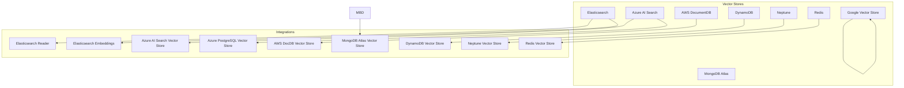

**Diagram sources**
- [elasticsearch.md](file://docs/api_reference/api_reference/storage/vector_store/elasticsearch.md#L1-L4)
- [azureaisearch.md](file://docs/api_reference/api_reference/storage/vector_store/azureaisearch.md#L1-L4)
- [awsdocdb.md](file://docs/api_reference/api_reference/storage/vector_store/awsdocdb.md#L1-L4)
- [google.md](file://docs/api_reference/api_reference/storage/vector_store/google.md#L1-L4)
- [mongodb.md](file://docs/api_reference/api_reference/storage/vector_store/mongodb.md#L1-L4)
- [dynamodb.md](file://docs/api_reference/api_reference/storage/vector_store/dynamodb.md#L1-L4)
- [neptune.md](file://docs/api_reference/api_reference/storage/vector_store/neptune.md#L1-L4)
- [redis.md](file://docs/api_reference/api_reference/storage/vector_store/redis.md#L1-L4)

**Section sources**
- [elasticsearch.md](file://docs/api_reference/api_reference/storage/vector_store/elasticsearch.md#L1-L4)
- [azureaisearch.md](file://docs/api_reference/api_reference/storage/vector_store/azureaisearch.md#L1-L4)
- [awsdocdb.md](file://docs/api_reference/api_reference/storage/vector_store/awsdocdb.md#L1-L4)
- [google.md](file://docs/api_reference/api_reference/storage/vector_store/google.md#L1-L4)
- [mongodb.md](file://docs/api_reference/api_reference/storage/vector_store/mongodb.md#L1-L4)
- [dynamodb.md](file://docs/api_reference/api_reference/storage/vector_store/dynamodb.md#L1-L4)
- [neptune.md](file://docs/api_reference/api_reference/storage/vector_store/neptune.md#L1-L4)
- [redis.md](file://docs/api_reference/api_reference/storage/vector_store/redis.md#L1-L4)

## Core Components
This section outlines the primary enterprise vector store components available in the repository and their roles in production deployments.

- Elasticsearch
  - Provides vector search via the Elasticsearch vector store integration, with reader and embedding modules supporting enterprise search and analytics workloads.
  - Reference: [Elasticsearch vector store API](file://docs/api_reference/api_reference/storage/vector_store/elasticsearch.md#L1-L4)

- Azure AI Search
  - Offers enterprise search with cognitive services, including vector search capabilities and integration with Azure’s managed search infrastructure.
  - Reference: [Azure AI Search vector store API](file://docs/api_reference/api_reference/storage/vector_store/azureaisearch.md#L1-L4)

- AWS DocumentDB
  - Supports MongoDB-compatible vector operations through a managed DocumentDB integration for scalable, globally replicated deployments.
  - Reference: [AWS DocumentDB vector store API](file://docs/api_reference/api_reference/storage/vector_store/awsdocdb.md#L1-L4)

- Google Vertex AI Vector Search
  - Integrates with Google’s enterprise machine learning platform for vector search and analytics.
  - Reference: [Google vector store API](file://docs/api_reference/api_reference/storage/vector_store/google.md#L1-L4)

- MongoDB Atlas
  - Delivers enterprise-grade MongoDB-compatible vector search with Atlas-specific optimizations.
  - Reference: [MongoDB Atlas vector store API](file://docs/api_reference/api_reference/storage/vector_store/mongodb.md#L1-L4)

- DynamoDB
  - Enables serverless vector operations with automatic scaling and integrated backup strategies.
  - Reference: [DynamoDB vector store API](file://docs/api_reference/api_reference/storage/vector_store/dynamodb.md#L1-L4)

- Neptune
  - Supports graph-based vector search using property graphs and analytics, suitable for knowledge graphs and relationship-heavy datasets.
  - Reference: [Neptune vector store API](file://docs/api_reference/api_reference/storage/vector_store/neptune.md#L1-L4)

- Redis
  - Provides advanced caching and real-time vector operations for low-latency retrieval and streaming scenarios.
  - Reference: [Redis vector store API](file://docs/api_reference/api_reference/storage/vector_store/redis.md#L1-L4)

**Section sources**
- [elasticsearch.md](file://docs/api_reference/api_reference/storage/vector_store/elasticsearch.md#L1-L4)
- [azureaisearch.md](file://docs/api_reference/api_reference/storage/vector_store/azureaisearch.md#L1-L4)
- [awsdocdb.md](file://docs/api_reference/api_reference/storage/vector_store/awsdocdb.md#L1-L4)
- [google.md](file://docs/api_reference/api_reference/storage/vector_store/google.md#L1-L4)
- [mongodb.md](file://docs/api_reference/api_reference/storage/vector_store/mongodb.md#L1-L4)
- [dynamodb.md](file://docs/api_reference/api_reference/storage/vector_store/dynamodb.md#L1-L4)
- [neptune.md](file://docs/api_reference/api_reference/storage/vector_store/neptune.md#L1-L4)
- [redis.md](file://docs/api_reference/api_reference/storage/vector_store/redis.md#L1-L4)

## Architecture Overview
The enterprise vector store architecture leverages provider-specific integrations while maintaining consistent interfaces for ingestion, querying, and analytics. The following diagram illustrates how components interact with cloud services and internal modules.

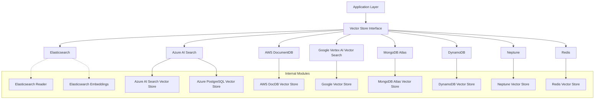

**Diagram sources**
- [elasticsearch.md](file://docs/api_reference/api_reference/storage/vector_store/elasticsearch.md#L1-L4)
- [azureaisearch.md](file://docs/api_reference/api_reference/storage/vector_store/azureaisearch.md#L1-L4)
- [awsdocdb.md](file://docs/api_reference/api_reference/storage/vector_store/awsdocdb.md#L1-L4)
- [google.md](file://docs/api_reference/api_reference/storage/vector_store/google.md#L1-L4)
- [mongodb.md](file://docs/api_reference/api_reference/storage/vector_store/mongodb.md#L1-L4)
- [dynamodb.md](file://docs/api_reference/api_reference/storage/vector_store/dynamodb.md#L1-L4)
- [neptune.md](file://docs/api_reference/api_reference/storage/vector_store/neptune.md#L1-L4)
- [redis.md](file://docs/api_reference/api_reference/storage/vector_store/redis.md#L1-L4)

## Detailed Component Analysis

### Elasticsearch Enterprise
Elasticsearch integrates with reader and embedding modules to support enterprise search and analytics. The vector store enables production-grade deployments with security plugins, monitoring, and high availability configurations.

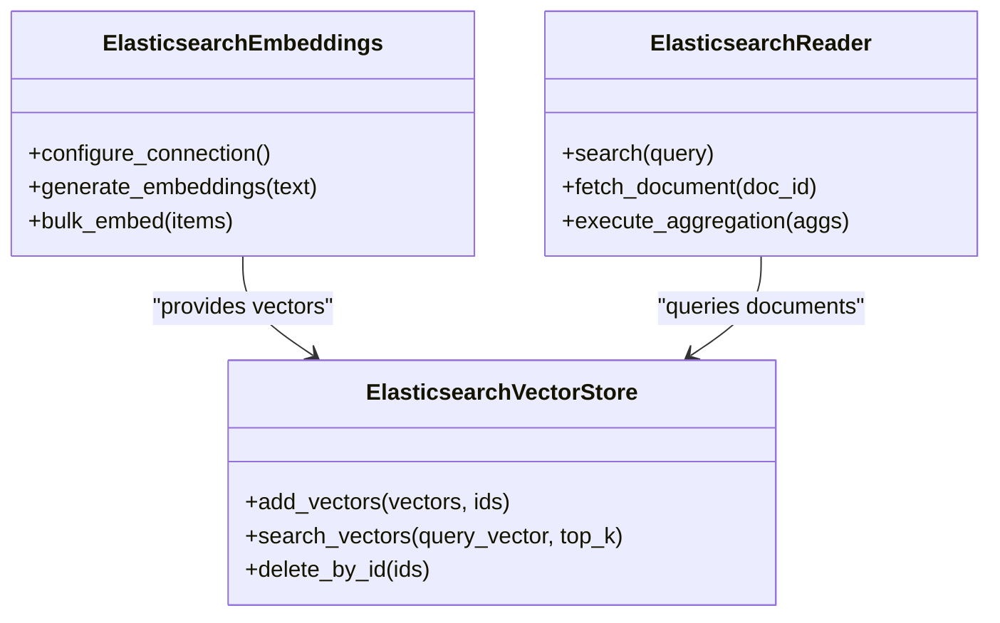

**Diagram sources**
- [elasticsearch_vector_store_base.py](file://llama-index-integrations/embeddings/llama-index-embeddings-elasticsearch/llama_index/embeddings/elasticsearch/base.py)
- [elasticsearch_reader.py](file://llama-index-integrations/readers/llama-index-readers-elasticsearch/llama_index/readers/elasticsearch/base.py)

Key capabilities:
- Security plugins: Configure authentication, TLS, and access controls for secure cluster operation.
- Monitoring: Integrate metrics collection and alerting for cluster health and performance.
- High availability: Use multi-zone clusters, replica shards, and rolling upgrades to maintain uptime.

**Section sources**
- [elasticsearch.md](file://docs/api_reference/api_reference/storage/vector_store/elasticsearch.md#L1-L4)
- [elasticsearch_vector_store_base.py](file://llama-index-integrations/embeddings/llama-index-embeddings-elasticsearch/llama_index/embeddings/elasticsearch/base.py)
- [elasticsearch_reader.py](file://llama-index-integrations/readers/llama-index-readers-elasticsearch/llama_index/readers/elasticsearch/base.py)

### Azure AI Search for Enterprise Search
Azure AI Search delivers enterprise search with cognitive services, role-based access control, and compliance features. The vector store integration supports hybrid semantic and vector search.

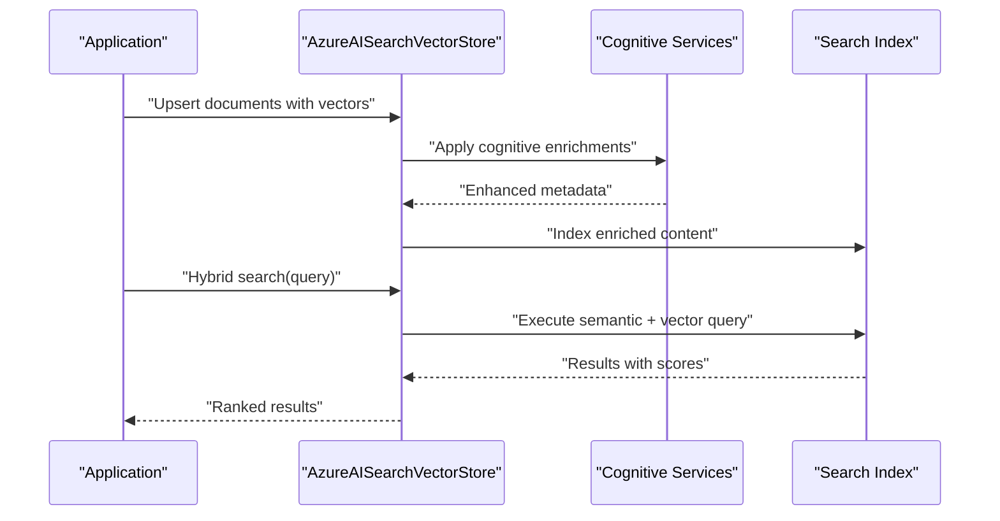

**Diagram sources**
- [azure_ai_search_vector_store.py](file://llama-index-integrations/vector_stores/llama-index-vector-stores-azureaisearch/llama_index/vector_stores/azureaisearch/__init__.py)

Operational highlights:
- Role-based access control: Define fine-grained permissions for data access and index operations.
- Compliance: Leverage built-in audit logs and data residency controls.
- Scalability: Use partitioned indexes and regional replicas for performance and availability.

**Section sources**
- [azureaisearch.md](file://docs/api_reference/api_reference/storage/vector_store/azureaisearch.md#L1-L4)
- [azure_ai_search_vector_store.py](file://llama-index-integrations/vector_stores/llama-index-vector-stores-azureaisearch/llama_index/vector_stores/azureaisearch/__init__.py)

### AWS DocumentDB for MongoDB Compatibility
AWS DocumentDB provides MongoDB-compatible vector operations with managed services and global replication for enterprise deployments.

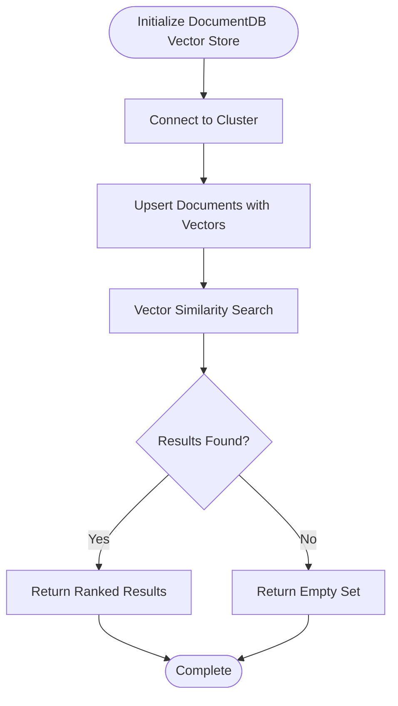

**Diagram sources**
- [aws_docdb_vector_store.py](file://llama-index-integrations/vector_stores/llama-index-vector-stores-awsdocdb/llama_index/vector_stores/awsdocdb/__init__.py)

Key benefits:
- Managed service: Automatic patching, backups, and scaling.
- Global replication: Multi-region deployment for disaster recovery and low latency.
- MongoDB compatibility: Leverage existing tooling and ecosystem.

**Section sources**
- [awsdocdb.md](file://docs/api_reference/api_reference/storage/vector_store/awsdocdb.md#L1-L4)
- [aws_docdb_vector_store.py](file://llama-index-integrations/vector_stores/llama-index-vector-stores-awsdocdb/llama_index/vector_stores/awsdocdb/__init__.py)

### Google Vertex AI Vector Search
Google Vertex AI Vector Search integrates with enterprise ML pipelines for advanced analytics and vector search.

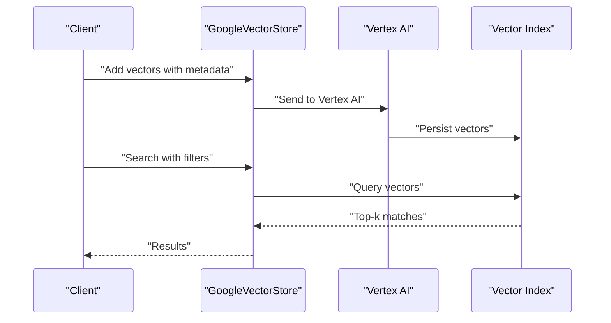

**Diagram sources**
- [google_vertex_ai_vector_store.py](file://llama-index-integrations/vector_stores/llama-index-vector-stores-google/llama_index/vector_stores/google/__init__.py)

Enterprise advantages:
- ML-native: Seamless integration with Vertex AI pipelines for training and inference.
- Scalability: Auto-scaling vector indexes with strong consistency guarantees.
- Governance: Built-in privacy controls and audit logging.

**Section sources**
- [google.md](file://docs/api_reference/api_reference/storage/vector_store/google.md#L1-L4)
- [google_vertex_ai_vector_store.py](file://llama-index-integrations/vector_stores/llama-index-vector-stores-google/llama_index/vector_stores/google/__init__.py)

### MongoDB Atlas Enterprise
MongoDB Atlas offers enterprise-grade vector search with security features and compliance controls.

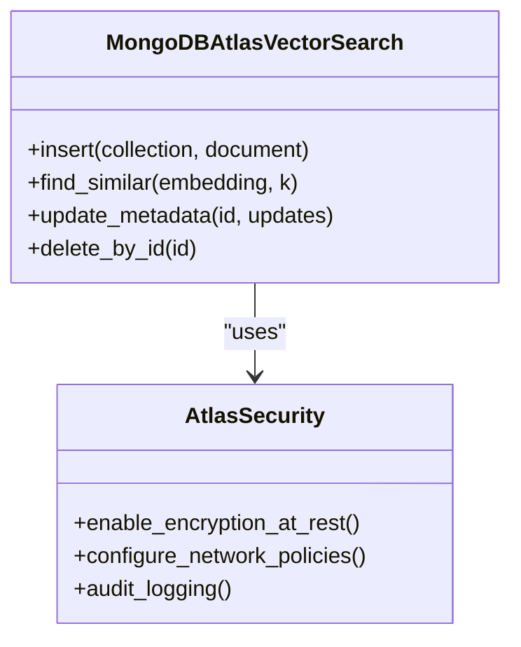

**Diagram sources**
- [mongodb_atlas_vector_store.py](file://llama-index-integrations/vector_stores/llama-index-vector-stores-mongodb/llama_index/vector_stores/mongodb/__init__.py)

Highlights:
- Security: Encryption at rest, network isolation, and audit logging.
- Compliance: SOC, GDPR, HIPAA-aligned configurations.
- Performance: Index tuning, sharding, and global clusters.

**Section sources**
- [mongodb.md](file://docs/api_reference/api_reference/storage/vector_store/mongodb.md#L1-L4)
- [mongodb_atlas_vector_store.py](file://llama-index-integrations/vector_stores/llama-index-vector-stores-mongodb/llama_index/vector_stores/mongodb/__init__.py)

### DynamoDB for Serverless Vector Operations
DynamoDB enables serverless vector operations with automatic scaling and integrated backup.

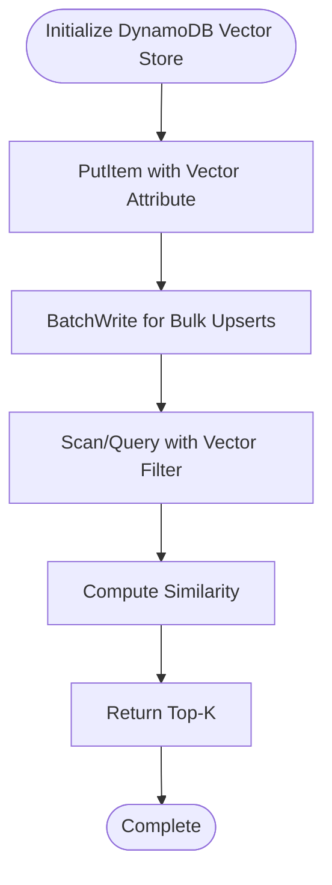

**Diagram sources**
- [dynamodb_vector_store.py](file://llama-index-integrations/vector_stores/llama-index-vector-stores-dynamodb/llama_index/vector_stores/dynamodb/__init__.py)

Enterprise strengths:
- Serverless: Automatic scaling with pay-per-use pricing.
- Backup: Point-in-time recovery and cross-region backups.
- Integration: Seamless with AWS IAM, KMS, and CloudWatch.

**Section sources**
- [dynamodb.md](file://docs/api_reference/api_reference/storage/vector_store/dynamodb.md#L1-L4)
- [dynamodb_vector_store.py](file://llama-index-integrations/vector_stores/llama-index-vector-stores-dynamodb/llama_index/vector_stores/dynamodb/__init__.py)

### Neptune for Graph-Based Vector Search
Neptune supports graph-based vector search using property graphs and analytics for knowledge-intensive applications.

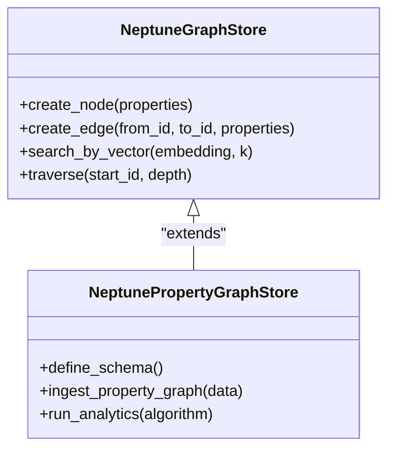

**Diagram sources**
- [neptune_graph_store.py](file://llama-index-integrations/graph_stores/llama-index-graph-stores-neptune/llama_index/graph_stores/neptune/base.py)
- [neptune_property_graph_store.py](file://llama-index-integrations/graph_stores/llama-index-graph-stores-neptune/llama_index/graph_stores/neptune/base_property_graph.py)

Capabilities:
- Property graphs: Rich schema modeling for nodes and edges.
- Analytics: Built-in algorithms for centrality, clustering, and pathfinding.
- High availability: Multi-AZ clusters with automated failover.

**Section sources**
- [neptune.md](file://docs/api_reference/api_reference/storage/vector_store/neptune.md#L1-L4)
- [neptune_graph_store.py](file://llama-index-integrations/graph_stores/llama-index-graph-stores-neptune/llama_index/graph_stores/neptune/base.py)
- [neptune_property_graph_store.py](file://llama-index-integrations/graph_stores/llama-index-graph-stores-neptune/llama_index/graph_stores/neptune/base_property_graph.py)

### Redis Enterprise for Advanced Caching and Real-Time Vector Operations
Redis Enterprise accelerates vector retrieval with advanced caching and real-time operations.

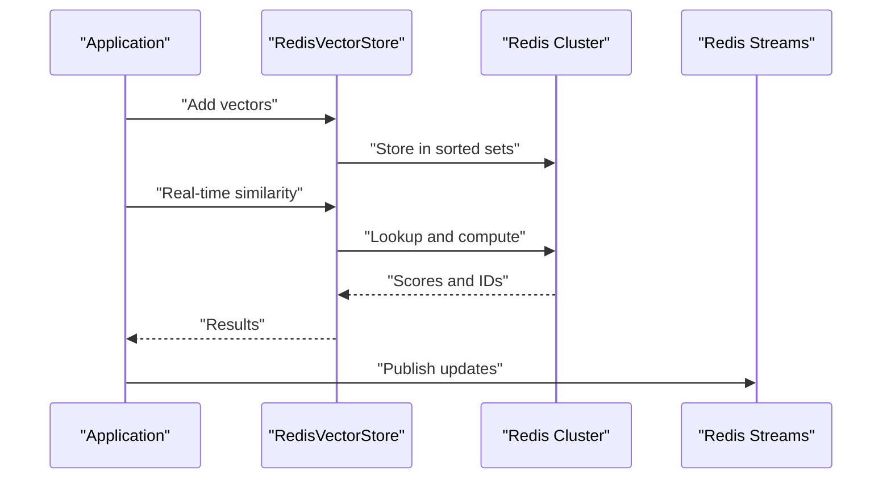

**Diagram sources**
- [redis_vector_store.py](file://llama-index-integrations/vector_stores/llama-index-vector-stores-redis/llama_index/vector_stores/redis/__init__.py)

Enterprise value:
- Low latency: Optimized for sub-millisecond retrieval.
- Streaming: Event-driven updates via Redis Streams.
- Enterprise features: TLS, ACLs, and clustering with persistence.

**Section sources**
- [redis.md](file://docs/api_reference/api_reference/storage/vector_store/redis.md#L1-L4)
- [redis_vector_store.py](file://llama-index-integrations/vector_stores/llama-index-vector-stores-redis/llama_index/vector_stores/redis/__init__.py)

## Dependency Analysis
The vector store ecosystem exhibits clear separation of concerns: provider integrations encapsulate vendor APIs, while internal modules handle ingestion, querying, and analytics. The following diagram maps key dependencies among vector stores and their supporting modules.

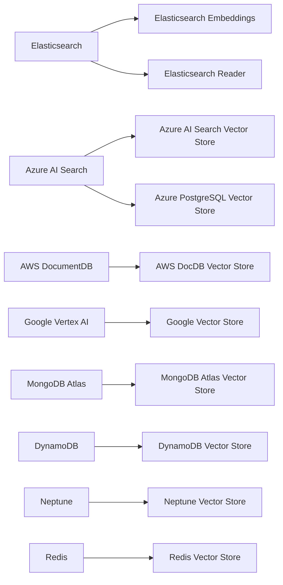

**Diagram sources**
- [elasticsearch.md](file://docs/api_reference/api_reference/storage/vector_store/elasticsearch.md#L1-L4)
- [azureaisearch.md](file://docs/api_reference/api_reference/storage/vector_store/azureaisearch.md#L1-L4)
- [awsdocdb.md](file://docs/api_reference/api_reference/storage/vector_store/awsdocdb.md#L1-L4)
- [google.md](file://docs/api_reference/api_reference/storage/vector_store/google.md#L1-L4)
- [mongodb.md](file://docs/api_reference/api_reference/storage/vector_store/mongodb.md#L1-L4)
- [dynamodb.md](file://docs/api_reference/api_reference/storage/vector_store/dynamodb.md#L1-L4)
- [neptune.md](file://docs/api_reference/api_reference/storage/vector_store/neptune.md#L1-L4)
- [redis.md](file://docs/api_reference/api_reference/storage/vector_store/redis.md#L1-L4)

**Section sources**
- [elasticsearch.md](file://docs/api_reference/api_reference/storage/vector_store/elasticsearch.md#L1-L4)
- [azureaisearch.md](file://docs/api_reference/api_reference/storage/vector_store/azureaisearch.md#L1-L4)
- [awsdocdb.md](file://docs/api_reference/api_reference/storage/vector_store/awsdocdb.md#L1-L4)
- [google.md](file://docs/api_reference/api_reference/storage/vector_store/google.md#L1-L4)
- [mongodb.md](file://docs/api_reference/api_reference/storage/vector_store/mongodb.md#L1-L4)
- [dynamodb.md](file://docs/api_reference/api_reference/storage/vector_store/dynamodb.md#L1-L4)
- [neptune.md](file://docs/api_reference/api_reference/storage/vector_store/neptune.md#L1-L4)
- [redis.md](file://docs/api_reference/api_reference/storage/vector_store/redis.md#L1-L4)

## Performance Considerations
- Elasticsearch: Optimize shard counts, refresh intervals, and query caching. Use index templates and dynamic mappings for consistent performance.
- Azure AI Search: Tune cognitive skill pipelines and index partitioning. Use query-time boosting and synonym maps for precision.
- AWS DocumentDB: Choose appropriate instance classes and enable auto-scaling. Use global clusters for read replicas.
- Google Vertex AI Vector Search: Align vector dimensionality with index type selection. Use metadata filtering to reduce candidate sets.
- MongoDB Atlas: Enable TTL collections for ephemeral data and use compound indexes for frequent queries.
- DynamoDB: Use provisioned throughput judiciously and leverage on-demand scaling for bursty workloads.
- Neptune: Partition large graphs and use label indices. Prefer iterative analytics for large traversals.
- Redis: Tune maxmemory policies and eviction strategies. Use pipelines for batch operations.

[No sources needed since this section provides general guidance]

## Security and Compliance
- Elasticsearch: Enable X-Pack security, TLS encryption, and IP allowlists. Centralize audit logs and enforce role-based access.
- Azure AI Search: Apply RBAC policies, enable resource locks, and configure private endpoints. Use Azure Policy for compliance governance.
- AWS DocumentDB: Enable encryption at rest, VPC endpoints, and IAM database authentication. Monitor with CloudTrail.
- Google Vertex AI Vector Search: Use VPC Service Controls, IAM roles, and audit logging. Enforce data loss prevention policies.
- MongoDB Atlas: Enable encryption at rest, network access control lists, and audit trails. Align with SOC and HIPAA requirements.
- DynamoDB: Use KMS keys, IAM policies, and VPC endpoints. Enable CloudTrail for activity tracking.
- Neptune: Configure IAM authentication, VPC endpoints, and encrypted snapshots. Use audit logging for governance.
- Redis Enterprise: Enable TLS, ACLs, and firewall rules. Integrate with enterprise identity providers.

**Section sources**
- [enterprise_security_compliance.md](file://docs/examples/usecases/enterprise_security_compliance.md)

## Backup and Disaster Recovery
- Elasticsearch: Schedule regular snapshot backups to S3-compatible storage. Test restore procedures and maintain warm/cold node tiers.
- Azure AI Search: Enable index snapshots and cross-region replicas. Automate recovery drills and monitor SLAs.
- AWS DocumentDB: Use automated backups and manual snapshots. Plan multi-region failover with read replicas.
- Google Vertex AI Vector Search: Back up indexes and metadata externally. Use export jobs for archival and recovery testing.
- MongoDB Atlas: Enable continuous backups and PITR. Validate recovery procedures across regions.
- DynamoDB: Use point-in-time recovery and cross-region replicas. Automate backup verification and DR drills.
- Neptune: Enable automated snapshots and restore to new clusters. Test failover to secondary regions.
- Redis Enterprise: Use periodic snapshots and AOF persistence. Replicate across zones and test failback procedures.

**Section sources**
- [backup_disaster_recovery.md](file://docs/examples/usecases/backup_disaster_recovery.md)

## Conclusion
The repository provides robust, production-ready integrations for enterprise vector stores across cloud providers and specialized databases. By leveraging provider-specific features—such as Elasticsearch security plugins, Azure AI Search RBAC and compliance, AWS DocumentDB global replication, Google Vertex AI ML integration, MongoDB Atlas security and compliance, DynamoDB serverless scaling, Neptune graph analytics, and Redis low-latency caching—teams can build scalable, secure, and resilient vector search systems tailored to their enterprise needs.