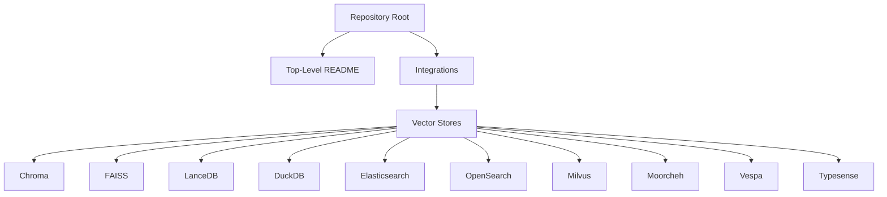
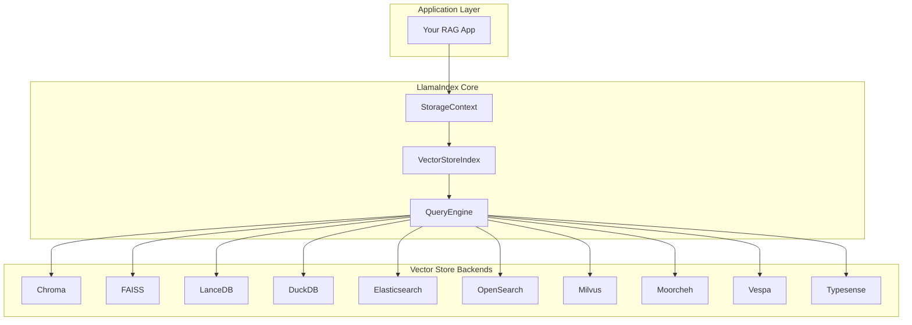
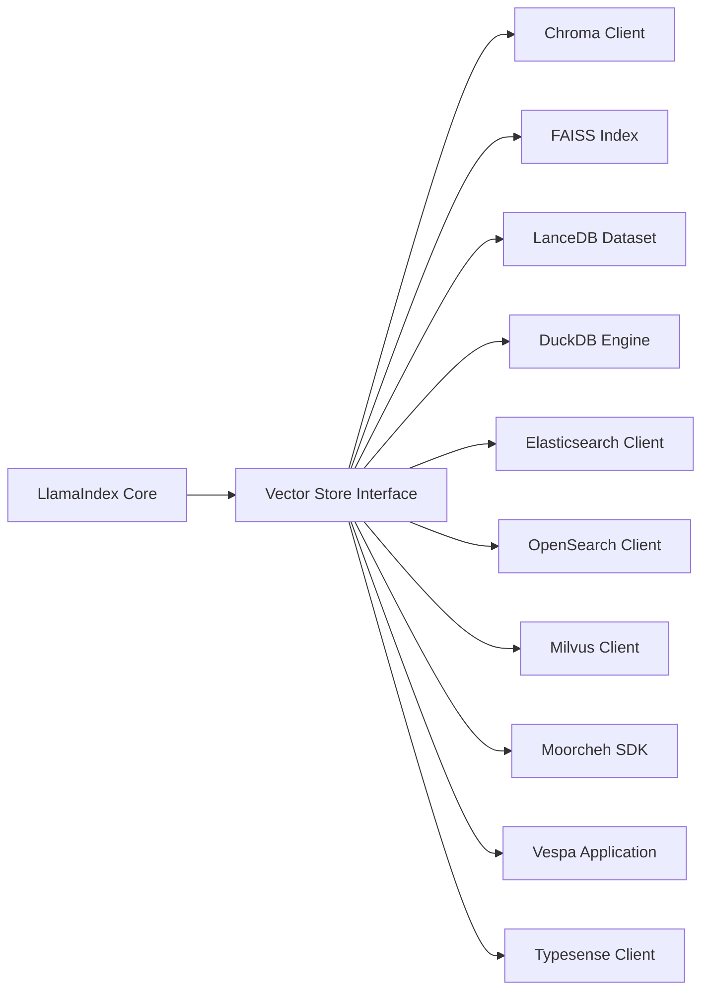

# Open-Source Vector Stores

<cite>
**Referenced Files in This Document**
- [README.md](file://README.md)
- [Chroma README](file://llama-index-integrations/vector_stores/llama-index-vector-stores-chroma/README.md)
- [FAISS README](file://llama-index-integrations/vector_stores/llama-index-vector-stores-faiss/README.md)
- [LanceDB README](file://llama-index-integrations/vector_stores/llama-index-vector-stores-lancedb/README.md)
- [DuckDB README](file://llama-index-integrations/vector_stores/llama-index-vector-stores-duckdb/README.md)
- [Elasticsearch README](file://llama-index-integrations/vector_stores/llama-index-vector-stores-elasticsearch/README.md)
- [OpenSearch README](file://llama-index-integrations/vector_stores/llama-index-vector-stores-opensearch/README.md)
- [Milvus README](file://llama-index-integrations/vector_stores/llama-index-vector-stores-milvus/README.md)
- [Moorcheh README](file://llama-index-integrations/vector_stores/llama-index-vector-stores-moorcheh/README.md)
- [Vespa README](file://llama-index-integrations/vector_stores/llama-index-vector-stores-vespa/README.md)
- [Typesense README](file://llama-index-integrations/vector_stores/llama-index-vector-stores-typesense/README.md)
</cite>

## Table of Contents
1. [Introduction](#introduction)
2. [Project Structure](#project-structure)
3. [Core Components](#core-components)
4. [Architecture Overview](#architecture-overview)
5. [Detailed Component Analysis](#detailed-component-analysis)
6. [Dependency Analysis](#dependency-analysis)
7. [Performance Considerations](#performance-considerations)
8. [Troubleshooting Guide](#troubleshooting-guide)
9. [Conclusion](#conclusion)
10. [Appendices](#appendices)

## Introduction
This document provides a comprehensive guide to open-source vector store integrations for self-hosted and community-driven vector databases. It focuses on practical setup, configuration, and operational guidance for deploying and running vector stores with LlamaIndex. The covered systems include ChromaDB, FAISS, LanceDB, DuckDB, Elasticsearch, OpenSearch, Milvus, Moorcheh, Vespa, and Typesense. For each system, we outline installation prerequisites, configuration options, backup strategies, performance optimization techniques, containerization, Kubernetes deployment, and monitoring setup.

## Project Structure
The repository organizes vector store integrations under a dedicated integrations tree. Each vector store has its own package with a README that documents usage and setup. The top-level README provides an overview of the ecosystem and basic persistence patterns.

**Section sources**
- [README.md](file://README.md#L1-L224)

## Core Components
- Vector store abstraction: LlamaIndex defines a standard vector store interface that all integrations implement. This allows swapping backends without changing application logic.
- Persistence: By default, data is held in memory. To persist to disk, use the storage context’s persistence mechanism.
- Index creation and querying: Integrations enable constructing VectorStoreIndex from documents and executing query engines against the configured backend.

Key references:
- Default in-memory behavior and persistence reload patterns are documented in the top-level README.
- Each vector store integration README provides usage notes and example snippets.

**Section sources**
- [README.md](file://README.md#L161-L177)

## Architecture Overview
The typical LlamaIndex vector search pipeline connects data ingestion, embedding generation, index construction, and query execution through a vector store backend. Integrations plug into the standard storage and index layers.

[No sources needed since this diagram shows conceptual workflow, not actual code structure]

## Detailed Component Analysis

### ChromaDB
- Purpose: Self-hosted vector database with a focus on simplicity and developer experience.
- Modes:
  - Local file storage: Persist collections to disk for durability across restarts.
  - In-memory mode: Fast ephemeral usage for testing and development.
  - Docker deployment: Containerized setup for local or cloud environments.
- Setup guidance:
  - Local file storage: Configure the Chroma client to use a persistent directory path.
  - In-memory mode: Initialize Chroma without specifying a persistent path.
  - Docker: Run the official Chroma container and connect via the client SDK.
- Configuration options:
  - Collection-level settings (e.g., metadata filters).
  - Embedding model selection and dimensionality.
- Backup strategies:
  - Back up the Chroma data directory regularly.
  - Use snapshots or export/import for incremental backups.
- Performance optimization:
  - Tune HNSW index parameters (e.g., efConstruction, M).
  - Use appropriate distance metrics for embedding spaces.
  - Scale horizontally by sharding collections across replicas.
- Containerization and Kubernetes:
  - Deploy Chroma as a stateful service with persistent volumes.
  - Use readiness/liveness probes and resource limits.
- Monitoring:
  - Track latency, throughput, and collection sizes.
  - Monitor disk usage and index rebuild progress.

**Section sources**
- [Chroma README](file://llama-index-integrations/vector_stores/llama-index-vector-stores-chroma/README.md#L1-L2)

### FAISS (Facebook AI Similarity Search)
- Purpose: Efficient similarity search and clustering of dense vectors.
- Index types:
  - Flat: Brute-force exact search; suitable for small datasets.
  - IVF (Inverted File): Approximate nearest neighbors with coarse quantization.
  - HNSW: Hierarchical navigable small world for approximate search.
  - PQ (Product Quantization): Compress vectors for memory savings.
- Quantization:
  - FP32 to FP16 or uint8 quantization reduces memory footprint.
  - PQ with IDMap wrapper for exact IDs after coarse selection.
- GPU acceleration:
  - Use GPU-enabled FAISS builds and move indexes to CUDA-capable devices.
  - Enable multi-GPU for larger indexes and improved throughput.
- Configuration options:
  - Index factory strings for automatic index construction.
  - Metric types (inner product, L2).
- Backup strategies:
  - Serialize and persist the trained index to disk.
  - Version control index metadata and training data.
- Performance optimization:
  - Tune nlist and nprobe for IVF; adjust efConstruction and efSearch for HNSW.
  - Pre-normalize vectors for inner product metrics.
- Containerization and Kubernetes:
  - Package FAISS binaries and Python bindings in a minimal container.
  - Mount persistent volumes for serialized indexes.
- Monitoring:
  - Track recall@k, latency distributions, and memory usage.

**Section sources**
- [FAISS README](file://llama-index-integrations/vector_stores/llama-index-vector-stores-faiss/README.md#L1-L2)

### LanceDB
- Purpose: Columnar vector store optimized for analytics and machine learning workflows.
- Data lake integration:
  - Stores vectors alongside metadata in Parquet format.
  - Leverages columnar storage for efficient filtering and analytics.
- Configuration options:
  - Table schema design with vector and metadata columns.
  - Index types (IVF-PQ, diskANN) for scalable similarity search.
- Backup strategies:
  - Back up the underlying object storage or filesystem path.
  - Use versioned datasets for rollbacks.
- Performance optimization:
  - Optimize Parquet row groups and column statistics.
  - Use appropriate index parameters for dataset scale.
- Containerization and Kubernetes:
  - Run as a serverless or stateful service depending on workload.
  - Use object storage for durability and scalability.
- Monitoring:
  - Observe query latency, scan rates, and I/O throughput.

**Section sources**
- [LanceDB README](file://llama-index-integrations/vector_stores/llama-index-vector-stores-lancedb/README.md#L1-L2)

### DuckDB
- Purpose: SQL-first analytical database with vector search extensions.
- Capabilities:
  - SQL-like queries over vector embeddings.
  - Seamless integration with analytical workloads and tabular data.
- Configuration options:
  - Define vector dimensions and similarity metrics in SQL.
  - Combine vector search with WHERE clauses and aggregations.
- Backup strategies:
  - Snapshot the DuckDB file or export/import for migration.
- Performance optimization:
  - Use indexes tailored to query patterns.
  - Partition data to reduce scan windows.
- Containerization and Kubernetes:
  - Stateless DuckDB instances for read-heavy workloads.
  - Persistent volumes for embedded mode deployments.
- Monitoring:
  - Track query execution plans and I/O metrics.

**Section sources**
- [DuckDB README](file://llama-index-integrations/vector_stores/llama-index-vector-stores-duckdb/README.md#L1-L2)

### Elasticsearch
- Purpose: Distributed search engine with strong full-text search and aggregation capabilities.
- Integration highlights:
  - Rich text analysis, faceting, and aggregations.
  - Horizontal scaling across nodes.
- Configuration options:
  - Index templates for vector fields and mappings.
  - KNN index settings and shard allocation.
- Backup strategies:
  - Use snapshot repositories for point-in-time recovery.
- Performance optimization:
  - Tune refresh intervals, translog settings, and merge policies.
  - Use index aliasing for zero-downtime reindexing.
- Containerization and Kubernetes:
  - Deploy Elasticsearch clusters with persistent volumes.
  - Enforce resource quotas and pod anti-affinity.
- Monitoring:
  - Track cluster health, shard allocation, and query performance.

**Section sources**
- [Elasticsearch README](file://llama-index-integrations/vector_stores/llama-index-vector-stores-elasticsearch/README.md#L1-L2)

### OpenSearch
- Purpose: Open-source fork of Elasticsearch with enterprise-grade features.
- Integration highlights:
  - Drop-in replacement for Elasticsearch with additional plugins.
  - Security plugins, alerting, and observability integrations.
- Configuration options:
  - Similar to Elasticsearch with OpenSearch-specific plugin settings.
- Backup strategies:
  - Use built-in snapshot and restore mechanisms.
- Performance optimization:
  - Apply OpenSearch tuning guidelines for search and indexing.
- Containerization and Kubernetes:
  - Use official OpenSearch Docker images with security enabled.
- Monitoring:
  - Utilize OpenSearch Dashboards and APM integrations.

**Section sources**
- [OpenSearch README](file://llama-index-integrations/vector_stores/llama-index-vector-stores-opensearch/README.md#L1-L2)

### Milvus
- Purpose: Large-scale vector search platform designed for high-dimensional embeddings.
- Features:
  - Clustering and partitioning for multi-tenant and large datasets.
  - Flexible index types (IVF, HNSW, ANNOY) and dynamic partitions.
- Configuration options:
  - Collection schemas with vector fields and metadata.
  - Index parameters tuned per dataset characteristics.
- Backup strategies:
  - Use Milvus snapshots and external object storage for durability.
- Performance optimization:
  - Balance between recall and latency via index parameters.
  - Use resource groups and placement groups for isolation.
- Containerization and Kubernetes:
  - Deploy Milvus cluster with etcd, Pulsar, and MinIO for production.
- Monitoring:
  - Track query latency, segment sizes, and resource utilization.

**Section sources**
- [Milvus README](file://llama-index-integrations/vector_stores/llama-index-vector-stores-milvus/README.md#L1-L2)

### Moorcheh
- Purpose: Semantic vector database with hybrid scoring and generative answering.
- Setup procedure:
  - Install LlamaIndex and the Moorcheh SDK.
  - Initialize the vector store with API key, namespace, and optional vector dimension.
  - Build an index from documents and query via the query engine.
- Configuration options:
  - Namespace types (text or vector) and batch size.
  - Sparse vector inclusion for hybrid retrieval.
- Backup strategies:
  - Export and import namespaces as needed.
- Performance optimization:
  - Tune batch size and namespace sizing for throughput.
- Containerization and Kubernetes:
  - Use the Moorcheh SDK in application containers.
- Monitoring:
  - Track query counts, latency, and namespace sizes.

**Section sources**
- [Moorcheh README](file://llama-index-integrations/vector_stores/llama-index-vector-stores-moorcheh/README.md#L1-L48)

### Vespa
- Purpose: Open-source big data serving engine optimized for low-latency retrieval.
- Integration highlights:
  - Built-in embedding inference eliminates external services.
  - Hybrid search combining BM25 and semantic signals.
- Setup procedure:
  - Use the provided application package template to define schema, fields, and rank profiles.
  - Deploy the application to Vespa Cloud or a self-hosted instance.
- Configuration options:
  - Embedding model selection and tokenizer configuration.
  - Rank profiles for BM25, semantic, and fusion.
- Backup strategies:
  - Use Vespa’s built-in snapshot and restore mechanisms.
- Performance optimization:
  - Adjust HNSW parameters and rerank counts.
  - Use multivector indexing and advanced ranking models.
- Containerization and Kubernetes:
  - Deploy the application package using Vespa CLI or cloud service.
- Monitoring:
  - Observe query latency, throughput, and model inference times.

**Section sources**
- [Vespa README](file://llama-index-integrations/vector_stores/llama-index-vector-stores-vespa/README.md#L1-L144)

### Typesense
- Purpose: High-performance, typo-tolerant search engine with vector search capabilities.
- Setup procedure:
  - Install Typesense and configure the server.
  - Define collections with vector fields and schema mappings.
  - Index documents and execute hybrid queries.
- Configuration options:
  - Collection-level vector settings and similarity metrics.
- Backup strategies:
  - Back up the data directory or use export/import.
- Performance optimization:
  - Tune collection settings and replica counts.
- Containerization and Kubernetes:
  - Run Typesense in a container with persistent storage.
- Monitoring:
  - Track indexing throughput, query latency, and cluster health.

**Section sources**
- [Typesense README](file://llama-index-integrations/vector_stores/llama-index-vector-stores-typesense/README.md#L1-L2)

## Dependency Analysis
Vector store integrations depend on:
- LlamaIndex core abstractions (storage context, vector store index, query engine).
- Backend-specific clients or libraries (e.g., FAISS, Elasticsearch, Milvus).
- Optional embedding and model inference services (e.g., Vespa embedder).

[No sources needed since this diagram shows conceptual relationships, not specific code structure]

## Performance Considerations
- Index selection: Choose index types aligned with dataset size and accuracy requirements (exact vs. approximate).
- Quantization: Reduce memory and I/O costs with FP16 or product quantization where acceptable.
- Hardware acceleration: Use GPUs for FAISS and Milvus to improve throughput.
- Scaling: Employ sharding, clustering, and partitioning for large datasets.
- I/O optimization: Persist indexes and metadata efficiently; leverage columnar formats for analytics.
- Latency: Tune search parameters (nprobe, efSearch, efConstruction) and monitor query distributions.

[No sources needed since this section provides general guidance]

## Troubleshooting Guide
- Persistence issues:
  - Verify the storage context persists to the intended directory.
  - Confirm read/write permissions for the persistence location.
- Index corruption:
  - Rebuild indexes from source embeddings.
  - Validate index parameters and data dimensions.
- Performance regressions:
  - Profile query latency and adjust index parameters.
  - Check hardware utilization and network bottlenecks.
- Backend connectivity:
  - Validate endpoint URLs, credentials, and firewall rules.
  - Review logs for authentication and authorization errors.
- Backup restoration:
  - Test restore procedures in staging before production.
  - Ensure schema compatibility during migrations.

**Section sources**
- [README.md](file://README.md#L161-L177)

## Conclusion
Self-hosted and community-driven vector databases offer flexible, cost-effective alternatives to managed services. By leveraging LlamaIndex integrations, teams can deploy ChromaDB, FAISS, LanceDB, DuckDB, Elasticsearch, OpenSearch, Milvus, Moorcheh, Vespa, and Typesense with robust persistence, scaling, and monitoring strategies. Selecting the right backend and tuning its configuration are key to achieving reliable performance and operability at scale.

[No sources needed since this section summarizes without analyzing specific files]

## Appendices
- Installation quick reference:
  - Install LlamaIndex core and desired vector store integration packages.
  - Ensure embedding and LLM dependencies are compatible with your environment.
- Configuration checklist:
  - Define storage context and vector store parameters.
  - Set up persistence and backup schedules.
  - Configure monitoring and alerting thresholds.
- Deployment checklist:
  - Containerize applications with proper resource limits.
  - Use persistent volumes for durable data.
  - Plan for horizontal scaling and disaster recovery.

[No sources needed since this section provides general guidance]