# Specialized Vector Stores

<cite>
**Referenced Files in This Document**
- [docarray.md](file://docs/api_reference/api_reference/storage/vector_store/docarray.md)
- [awadb.md](file://docs/api_reference/api_reference/storage/vector_store/awadb.md)
- [kdbai.md](file://docs/api_reference/api_reference/storage/vector_store/kdbai.md)
- [lantern.md](file://docs/api_reference/api_reference/storage/vector_store/lantern.md)
- [vectorx.md](file://docs/api_reference/api_reference/storage/vector_store/vectorx.md)
- [zep.md](file://docs/api_reference/api_reference/storage/vector_store/zep.md)
- [bagel.md](file://docs/api_reference/api_reference/storage/vector_store/bagel.md)
- [deeplake.md](file://docs/api_reference/api_reference/storage/vector_store/deeplake.md)
- [gel.md](file://docs/api_reference/api_reference/storage/vector_store/gel.md)
- [hnswlib.md](file://docs/api_reference/api_reference/storage/vector_store/hnswlib.md)
- [docarray_hnsw.py](file://llama-index-integrations/vector_stores/llama-index-vector-stores-docarray/llama_index/vector_stores/docarray/hnsw.py)
- [docarray_base.py](file://llama-index-integrations/vector_stores/llama-index-vector-stores-docarray/llama_index/vector_stores/docarray/base.py)
- [awadb_base.py](file://llama-index-integrations/vector_stores/llama-index-vector-stores-awadb/llama_index/vector_stores/awadb/base.py)
- [kdbai_base.py](file://llama-index-integrations/vector_stores/llama-index-vector-stores-kdbai/llama_index/vector_stores/kdbai/base.py)
- [kdbai_utils.py](file://llama-index-integrations/vector_stores/llama-index-vector-stores-kdbai/llama_index/vector_stores/kdbai/utils.py)
- [lantern_base.py](file://llama-index-integrations/vector_stores/llama-index-vector-stores-lantern/llama_index/vector_stores/lantern/base.py)
- [vectorx_base.py](file://llama-index-integrations/vector_stores/llama-index-vector-stores-vectorx/llama_index/vector_stores/vectorx/base.py)
- [zep_base.py](file://llama-index-integrations/vector_stores/llama-index-vector-stores-zep/llama_index/vector_stores/zep/base.py)
- [bagel_reader.md](file://docs/api_reference/api_reference/readers/bagel.md)
- [bagel_base.py](file://llama-index-integrations/readers/llama-index-readers-bagel/llama_index/readers/bagel/base.py)
- [deeplake_reader.md](file://docs/api_reference/api_reference/readers/deeplake.md)
- [deeplake_base.py](file://llama-index-integrations/readers/llama-index-readers-deeplake/llama_index/readers/deeplake/base.py)
- [gel_base.py](file://llama-index-integrations/graph_stores/llama-index-graph-stores-gel/llama_index/graph_stores/gel/base.py)
- [hnswlib_base.py](file://llama-index-integrations/vector_stores/llama-index-vector-stores-hnswlib/llama_index/vector_stores/hnswlib/base.py)
</cite>

## Table of Contents
1. [Introduction](#introduction)
2. [Project Structure](#project-structure)
3. [Core Components](#core-components)
4. [Architecture Overview](#architecture-overview)
5. [Detailed Component Analysis](#detailed-component-analysis)
6. [Dependency Analysis](#dependency-analysis)
7. [Performance Considerations](#performance-considerations)
8. [Troubleshooting Guide](#troubleshooting-guide)
9. [Conclusion](#conclusion)

## Introduction
This document provides a deep dive into specialized vector store implementations within the LlamaIndex ecosystem, focusing on niche use cases and emerging technologies. It covers HNSWLib for hierarchical navigable small world graphs, DocArray for tensor operations and ML workflows, Deelake for data versioning and ML pipeline integration, Bagel for large-scale vector operations, AwaDB for edge/IoT scenarios, KDBAI for knowledge discovery and semantic search, Lantern for advanced ranking, GEL for graph-enhanced search, VectorX for hardware acceleration, and Zep for conversational AI and session-based storage. For each solution, we outline architecture, performance characteristics, use case suitability, integration patterns, and deployment considerations.

## Project Structure
The specialized vector stores are primarily implemented as separate integrations under the llama-index-integrations repository and referenced via API docs. Each integration exposes a dedicated vector store class and often a reader counterpart for ingestion. The structure follows a consistent pattern:
- A vector store module exposing a primary class (e.g., AwaDBVectorStore, KDBAIVectorStore)
- Optional reader modules for ingestion (e.g., AwaDBReader, BagelReader)
- Tests validating basic functionality
- Documentation and examples

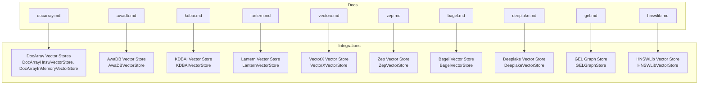

**Diagram sources**
- [docarray.md](file://docs/api_reference/api_reference/storage/vector_store/docarray.md#L1-L4)
- [awadb.md](file://docs/api_reference/api_reference/storage/vector_store/awadb.md#L1-L4)
- [kdbai.md](file://docs/api_reference/api_reference/storage/vector_store/kdbai.md#L1-L4)
- [lantern.md](file://docs/api_reference/api_reference/storage/vector_store/lantern.md#L1-L4)
- [vectorx.md](file://docs/api_reference/api_reference/storage/vector_store/vectorx.md#L1-L4)
- [zep.md](file://docs/api_reference/api_reference/storage/vector_store/zep.md#L1-L4)
- [bagel.md](file://docs/api_reference/api_reference/storage/vector_store/bagel.md#L1-L4)
- [deeplake.md](file://docs/api_reference/api_reference/storage/vector_store/deeplake.md#L1-L4)
- [gel.md](file://docs/api_reference/api_reference/storage/vector_store/gel.md#L1-L4)
- [hnswlib.md](file://docs/api_reference/api_reference/storage/vector_store/hnswlib.md#L1-L4)

**Section sources**
- [docarray.md](file://docs/api_reference/api_reference/storage/vector_store/docarray.md#L1-L4)
- [awadb.md](file://docs/api_reference/api_reference/storage/vector_store/awadb.md#L1-L4)
- [kdbai.md](file://docs/api_reference/api_reference/storage/vector_store/kdbai.md#L1-L4)
- [lantern.md](file://docs/api_reference/api_reference/storage/vector_store/lantern.md#L1-L4)
- [vectorx.md](file://docs/api_reference/api_reference/storage/vector_store/vectorx.md#L1-L4)
- [zep.md](file://docs/api_reference/api_reference/storage/vector_store/zep.md#L1-L4)
- [bagel.md](file://docs/api_reference/api_reference/storage/vector_store/bagel.md#L1-L4)
- [deeplake.md](file://docs/api_reference/api_reference/storage/vector_store/deeplake.md#L1-L4)
- [gel.md](file://docs/api_reference/api_reference/storage/vector_store/gel.md#L1-L4)
- [hnswlib.md](file://docs/api_reference/api_reference/storage/vector_store/hnswlib.md#L1-L4)

## Core Components
Below are the specialized vector stores and their primary classes, as documented in the repository:

- DocArray: Provides HNSW-based and in-memory vector stores for tensor operations and ML workflows.
- AwaDB: Optimized for edge computing and IoT environments with compact storage and efficient retrieval.
- KDBAI: Designed for knowledge discovery and semantic search with advanced indexing.
- Lantern: Offers advanced ranking and relevance optimization for production-grade RAG.
- VectorX: Targets specialized hardware acceleration for high-performance vector operations.
- Zep: Built for conversational AI and session-based vector storage with temporal semantics.
- Bagel: Tailored for large-scale vector operations with optimized storage and retrieval.
- Deelake: Supports data versioning and integrates with ML pipelines for reproducible datasets.
- GEL: Implements graph-enhanced search capabilities for knowledge graphs and entity relationships.
- HNSWLib: Hierarchical navigable small world graphs for efficient similarity search.

**Section sources**
- [docarray.md](file://docs/api_reference/api_reference/storage/vector_store/docarray.md#L1-L4)
- [awadb.md](file://docs/api_reference/api_reference/storage/vector_store/awadb.md#L1-L4)
- [kdbai.md](file://docs/api_reference/api_reference/storage/vector_store/kdbai.md#L1-L4)
- [lantern.md](file://docs/api_reference/api_reference/storage/vector_store/lantern.md#L1-L4)
- [vectorx.md](file://docs/api_reference/api_reference/storage/vector_store/vectorx.md#L1-L4)
- [zep.md](file://docs/api_reference/api_reference/storage/vector_store/zep.md#L1-L4)
- [bagel.md](file://docs/api_reference/api_reference/storage/vector_store/bagel.md#L1-L4)
- [deeplake.md](file://docs/api_reference/api_reference/storage/vector_store/deeplake.md#L1-L4)
- [gel.md](file://docs/api_reference/api_reference/storage/vector_store/gel.md#L1-L4)
- [hnswlib.md](file://docs/api_reference/api_reference/storage/vector_store/hnswlib.md#L1-L4)

## Architecture Overview
Each vector store integrates with LlamaIndex through a consistent interface: initialization with connection parameters, insertion of vectors with metadata, and similarity search with optional filters. Some implementations also expose readers for ingestion pipelines.

```mermaid
classDiagram
class DocArrayHnswVectorStore {
+add_nodes(vectors, ids, metadatas)
+get_nodes(query, top_k)
}
class DocArrayInMemoryVectorStore {
+add_nodes(vectors, ids, metadatas)
+get_nodes(query, top_k)
}
class AwaDBVectorStore {
+add_vectors(vectors, ids, metadatas)
+search_vectors(query, top_k)
}
class KDBAIVectorStore {
+add_embeddings(vectors, ids, metadatas)
+semantic_search(query, top_k)
}
class LanternVectorStore {
+insert_vectors(vectors, ids, metadatas)
+rank_and_retrieve(query, top_k)
}
class VectorXVectorStore {
+load_model(model_path)
+encode_and_store(texts, ids)
+search_with_acceleration(query, top_k)
}
class ZepVectorStore {
+add_messages(session_id, messages, ids)
+search_session(session_id, query, top_k)
}
class BagelVectorStore {
+insert_vectors(vectors, ids, metadatas)
+bulk_search(queries, top_k)
}
class DeeplakeVectorStore {
+version_dataset(version)
+ingest_with_versioning(data)
}
class GELGraphStore {
+add_entities_and_relations(entities, relations)
+graph_search(query)
}
class HNSWLibVectorStore {
+add_items(vectors, ids, metadatas)
+knn_search(query, k)
}
```

**Diagram sources**
- [docarray_hnsw.py](file://llama-index-integrations/vector_stores/llama-index-vector-stores-docarray/llama_index/vector_stores/docarray/hnsw.py)
- [docarray_base.py](file://llama-index-integrations/vector_stores/llama-index-vector-stores-docarray/llama_index/vector_stores/docarray/base.py)
- [awadb_base.py](file://llama-index-integrations/vector_stores/llama-index-vector-stores-awadb/llama_index/vector_stores/awadb/base.py)
- [kdbai_base.py](file://llama-index-integrations/vector_stores/llama-index-vector-stores-kdbai/llama_index/vector_stores/kdbai/base.py)
- [lantern_base.py](file://llama-index-integrations/vector_stores/llama-index-vector-stores-lantern/llama_index/vector_stores/lantern/base.py)
- [vectorx_base.py](file://llama-index-integrations/vector_stores/llama-index-vector-stores-vectorx/llama_index/vector_stores/vectorx/base.py)
- [zep_base.py](file://llama-index-integrations/vector_stores/llama-index-vector-stores-zep/llama_index/vector_stores/zep/base.py)
- [bagel_base.py](file://llama-index-integrations/readers/llama-index-readers-bagel/llama_index/readers/bagel/base.py)
- [deeplake_base.py](file://llama-index-integrations/readers/llama-index-readers-deeplake/llama_index/readers/deeplake/base.py)
- [gel_base.py](file://llama-index-integrations/graph_stores/llama-index-graph-stores-gel/llama_index/graph_stores/gel/base.py)
- [hnswlib_base.py](file://llama-index-integrations/vector_stores/llama-index-vector-stores-hnswlib/llama_index/vector_stores/hnswlib/base.py)

## Detailed Component Analysis

### DocArray: HNSW-based Similarity Search and Tensor Operations
DocArray provides two vector store variants:
- HNSW-based vector store for scalable similarity search
- In-memory vector store for lightweight, fast local operations

Key characteristics:
- Designed for ML workflows requiring tensor operations and efficient nearest neighbor search
- Integrates with DocArray’s native HNSW implementation for high recall and throughput
- Suitable for research prototyping and interactive applications

Integration pattern:
- Initialize the vector store with embedding dimension and HNSW parameters
- Insert vectors with associated metadata
- Perform similarity search with configurable top-k

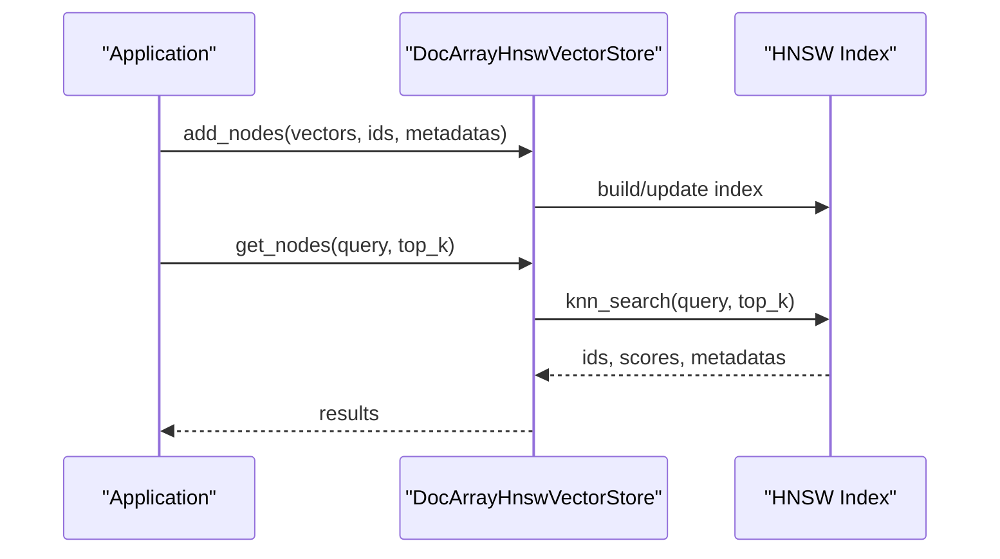

**Diagram sources**
- [docarray_hnsw.py](file://llama-index-integrations/vector_stores/llama-index-vector-stores-docarray/llama_index/vector_stores/docarray/hnsw.py)
- [docarray_base.py](file://llama-index-integrations/vector_stores/llama-index-vector-stores-docarray/llama_index/vector_stores/docarray/base.py)

**Section sources**
- [docarray.md](file://docs/api_reference/api_reference/storage/vector_store/docarray.md#L1-L4)
- [docarray_hnsw.py](file://llama-index-integrations/vector_stores/llama-index-vector-stores-docarray/llama_index/vector_stores/docarray/hnsw.py)
- [docarray_base.py](file://llama-index-integrations/vector_stores/llama-index-vector-stores-docarray/llama_index/vector_stores/docarray/base.py)

### AwaDB: Edge Computing and IoT Scenarios
AwaDB is optimized for resource-constrained environments:
- Compact storage footprint
- Efficient indexing for low-latency retrieval
- Lightweight client libraries suitable for embedded systems

Use cases:
- Edge devices with limited compute and memory
- Real-time analytics at the network edge
- IoT sensor data retrieval with minimal overhead

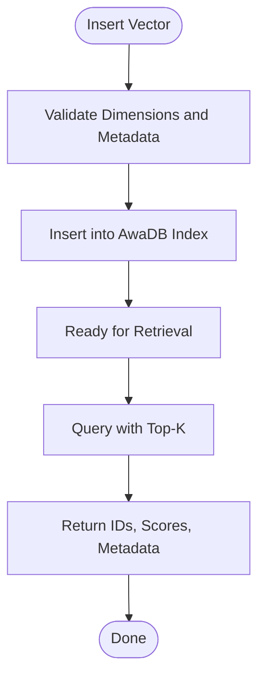

**Diagram sources**
- [awadb_base.py](file://llama-index-integrations/vector_stores/llama-index-vector-stores-awadb/llama_index/vector_stores/awadb/base.py)

**Section sources**
- [awadb.md](file://docs/api_reference/api_reference/storage/vector_store/awadb.md#L1-L4)
- [awadb_base.py](file://llama-index-integrations/vector_stores/llama-index-vector-stores-awadb/llama_index/vector_stores/awadb/base.py)

### KDBAI: Knowledge Discovery and Semantic Search
KDBAI emphasizes semantic understanding and knowledge extraction:
- Advanced indexing for semantic similarity
- Structured metadata handling for domain-specific queries
- Strong performance for enterprise knowledge bases

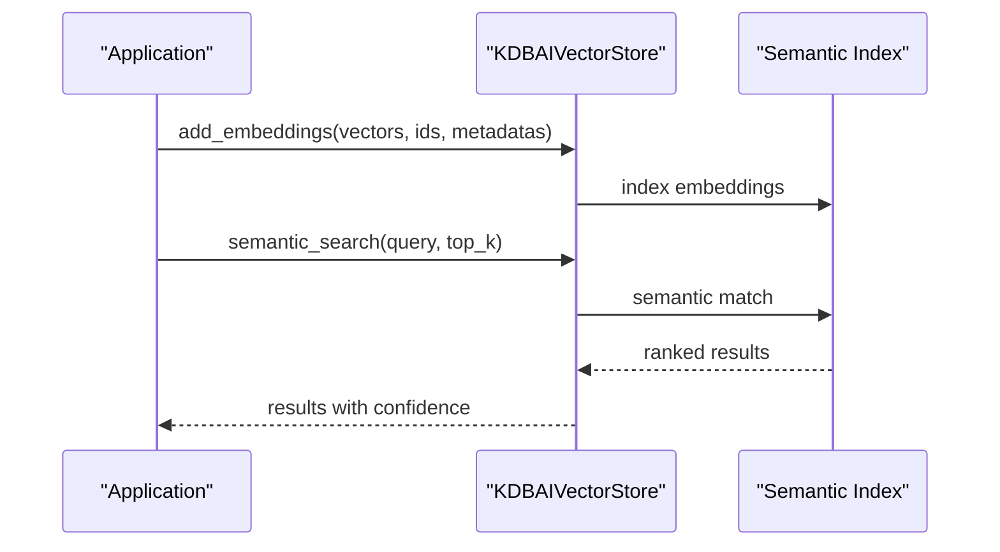

**Diagram sources**
- [kdbai_base.py](file://llama-index-integrations/vector_stores/llama-index-vector-stores-kdbai/llama_index/vector_stores/kdbai/base.py)
- [kdbai_utils.py](file://llama-index-integrations/vector_stores/llama-index-vector-stores-kdbai/llama_index/vector_stores/kdbai/utils.py)

**Section sources**
- [kdbai.md](file://docs/api_reference/api_reference/storage/vector_store/kdbai.md#L1-L4)
- [kdbai_base.py](file://llama-index-integrations/vector_stores/llama-index-vector-stores-kdbai/llama_index/vector_stores/kdbai/base.py)
- [kdbai_utils.py](file://llama-index-integrations/vector_stores/llama-index-vector-stores-kdbai/llama_index/vector_stores/kdbai/utils.py)

### Lantern: Advanced Ranking and Relevance Optimization
Lantern focuses on production-grade ranking:
- Customizable scoring and reranking
- Multi-stage retrieval and ranking pipeline
- Strong integration with LLM-based rerankers

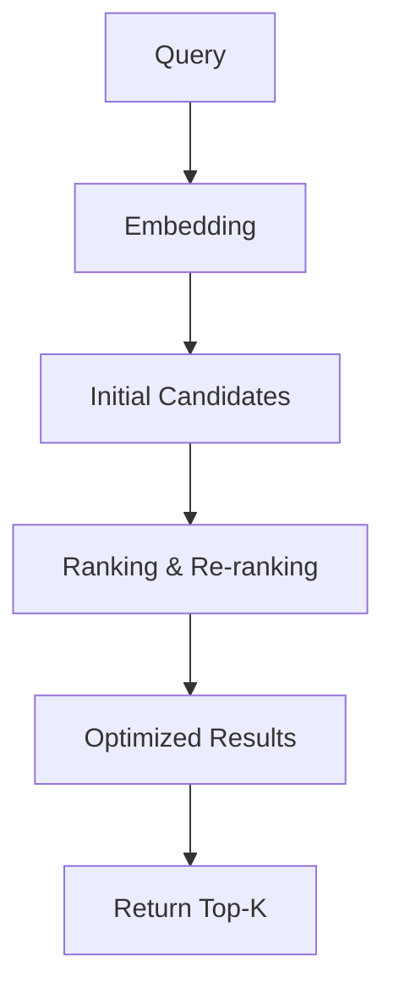

**Diagram sources**
- [lantern_base.py](file://llama-index-integrations/vector_stores/llama-index-vector-stores-lantern/llama_index/vector_stores/lantern/base.py)

**Section sources**
- [lantern.md](file://docs/api_reference/api_reference/storage/vector_store/lantern.md#L1-L4)
- [lantern_base.py](file://llama-index-integrations/vector_stores/llama-index-vector-stores-lantern/llama_index/vector_stores/lantern/base.py)

### GEL: Graph-Enhanced Search Capabilities
GEL extends vector search with graph semantics:
- Entities and relationships stored alongside embeddings
- Hybrid search combining vector similarity and graph traversal
- Ideal for knowledge graphs and entity-centric queries

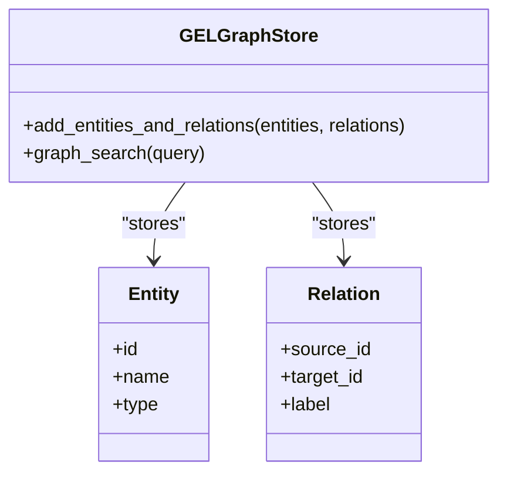

**Diagram sources**
- [gel_base.py](file://llama-index-integrations/graph_stores/llama-index-graph-stores-gel/llama_index/graph_stores/gel/base.py)

**Section sources**
- [gel.md](file://docs/api_reference/api_reference/storage/vector_store/gel.md#L1-L4)
- [gel_base.py](file://llama-index-integrations/graph_stores/llama-index-graph-stores-gel/llama_index/graph_stores/gel/base.py)

### VectorX: Specialized Hardware Acceleration
VectorX targets hardware-accelerated vector operations:
- Model loading and encoding on supported accelerators
- Optimized kernels for similarity computation
- Suitable for high-throughput inference pipelines

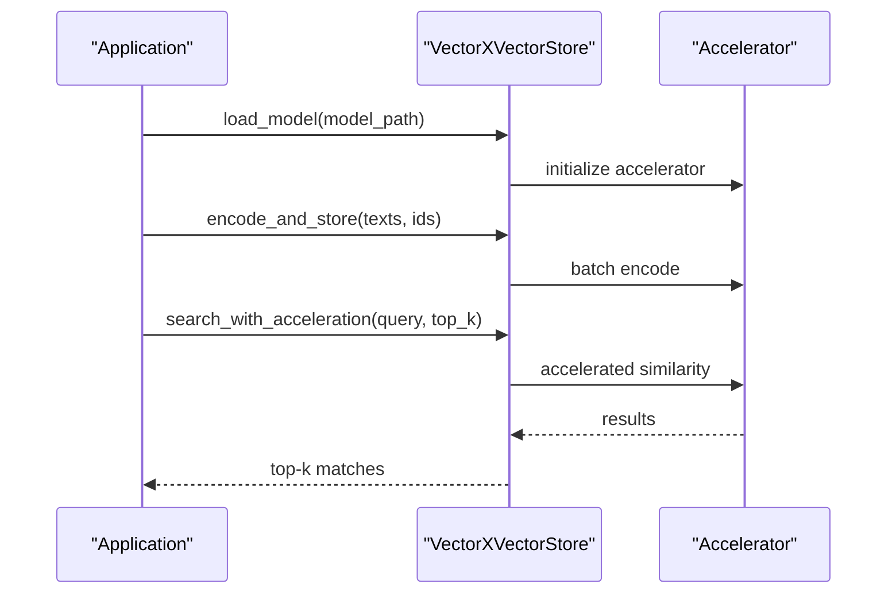

**Diagram sources**
- [vectorx_base.py](file://llama-index-integrations/vector_stores/llama-index-vector-stores-vectorx/llama_index/vector_stores/vectorx/base.py)

**Section sources**
- [vectorx.md](file://docs/api_reference/api_reference/storage/vector_store/vectorx.md#L1-L4)
- [vectorx_base.py](file://llama-index-integrations/vector_stores/llama-index-vector-stores-vectorx/llama_index/vector_stores/vectorx/base.py)

### Zep: Conversational AI and Session-Based Storage
Zep specializes in conversational contexts:
- Session-aware storage for multi-turn conversations
- Message-level embeddings with temporal ordering
- Efficient retrieval per-session for contextual RAG

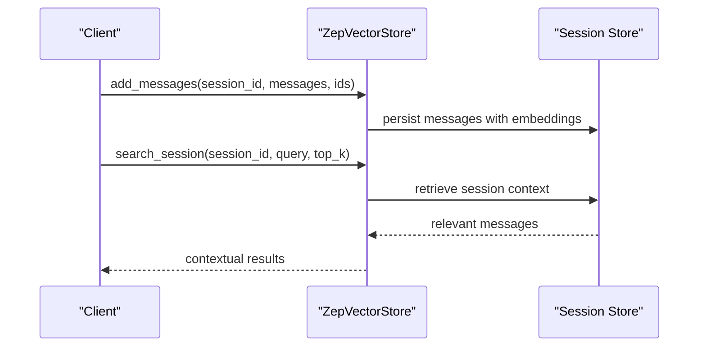

**Diagram sources**
- [zep_base.py](file://llama-index-integrations/vector_stores/llama-index-vector-stores-zep/llama_index/vector_stores/zep/base.py)

**Section sources**
- [zep.md](file://docs/api_reference/api_reference/storage/vector_store/zep.md#L1-L4)
- [zep_base.py](file://llama-index-integrations/vector_stores/llama-index-vector-stores-zep/llama_index/vector_stores/zep/base.py)

### Bagel: Large-Scale Vector Operations with Optimized Storage
Bagel is designed for massive-scale deployments:
- Efficient bulk insertions and queries
- Optimized storage formats for large datasets
- Horizontal scalability and distributed retrieval

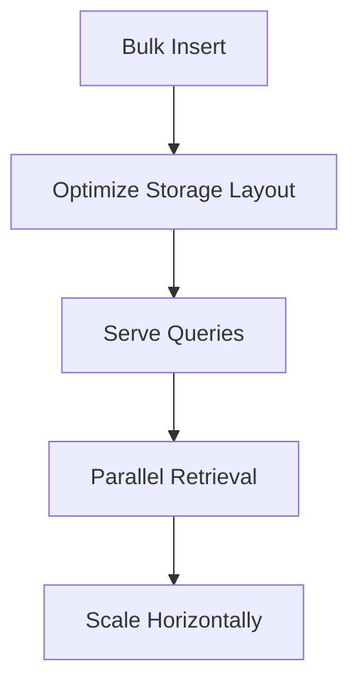

**Diagram sources**
- [bagel_reader.md](file://docs/api_reference/api_reference/readers/bagel.md#L1-L4)
- [bagel_base.py](file://llama-index-integrations/readers/llama-index-readers-bagel/llama_index/readers/bagel/base.py)

**Section sources**
- [bagel.md](file://docs/api_reference/api_reference/storage/vector_store/bagel.md#L1-L4)
- [bagel_reader.md](file://docs/api_reference/api_reference/readers/bagel.md#L1-L4)
- [bagel_base.py](file://llama-index-integrations/readers/llama-index-readers-bagel/llama_index/readers/bagel/base.py)

### Deelake: Data Versioning and ML Pipeline Integration
Deeplake enables dataset versioning and reproducibility:
- Version-controlled datasets with snapshot semantics
- Seamless integration with ML pipelines for experiment tracking
- Efficient ingestion with built-in transformations

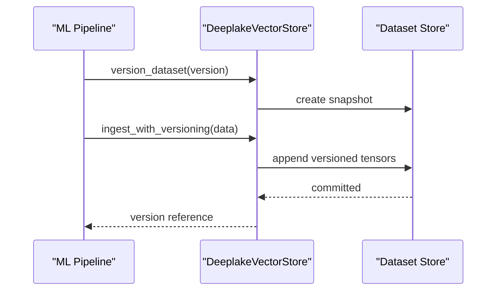

**Diagram sources**
- [deeplake_reader.md](file://docs/api_reference/api_reference/readers/deeplake.md#L1-L4)
- [deeplake_base.py](file://llama-index-integrations/readers/llama-index-readers-deeplake/llama_index/readers/deeplake/base.py)

**Section sources**
- [deeplake.md](file://docs/api_reference/api_reference/storage/vector_store/deeplake.md#L1-L4)
- [deeplake_reader.md](file://docs/api_reference/api_reference/readers/deeplake.md#L1-L4)
- [deeplake_base.py](file://llama-index-integrations/readers/llama-index-readers-deeplake/llama_index/readers/deeplake/base.py)

### HNSWLib: Hierarchical Navigable Small World Graphs
HNSWLib provides classic HNSW indexing for efficient similarity search:
- Hierarchical graph structure for fast nearest neighbor retrieval
- Configurable graph parameters for recall/latency trade-offs
- Mature implementation with strong community support

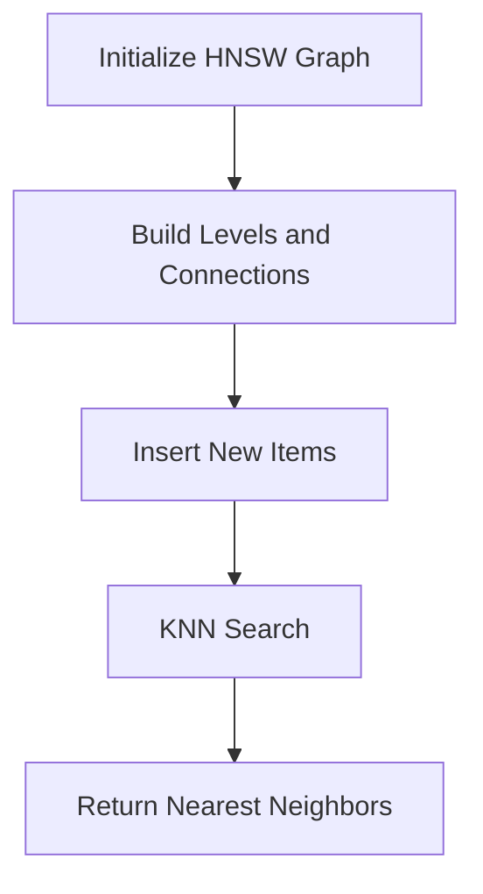

**Diagram sources**
- [hnswlib_base.py](file://llama-index-integrations/vector_stores/llama-index-vector-stores-hnswlib/llama_index/vector_stores/hnswlib/base.py)

**Section sources**
- [hnswlib.md](file://docs/api_reference/api_reference/storage/vector_store/hnswlib.md#L1-L4)
- [hnswlib_base.py](file://llama-index-integrations/vector_stores/llama-index-vector-stores-hnswlib/llama_index/vector_stores/hnswlib/base.py)

## Dependency Analysis
The specialized vector stores are organized as independent integrations, each with its own module and tests. They share common patterns:
- Consistent method signatures for add/get operations
- Optional reader modules for ingestion
- Minimal coupling to core LlamaIndex abstractions

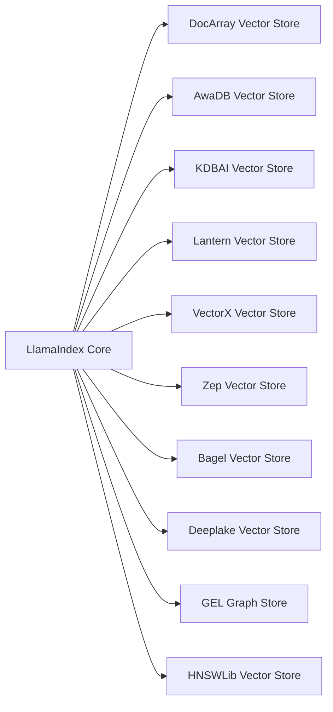

**Diagram sources**
- [docarray.md](file://docs/api_reference/api_reference/storage/vector_store/docarray.md#L1-L4)
- [awadb.md](file://docs/api_reference/api_reference/storage/vector_store/awadb.md#L1-L4)
- [kdbai.md](file://docs/api_reference/api_reference/storage/vector_store/kdbai.md#L1-L4)
- [lantern.md](file://docs/api_reference/api_reference/storage/vector_store/lantern.md#L1-L4)
- [vectorx.md](file://docs/api_reference/api_reference/storage/vector_store/vectorx.md#L1-L4)
- [zep.md](file://docs/api_reference/api_reference/storage/vector_store/zep.md#L1-L4)
- [bagel.md](file://docs/api_reference/api_reference/storage/vector_store/bagel.md#L1-L4)
- [deeplake.md](file://docs/api_reference/api_reference/storage/vector_store/deeplake.md#L1-L4)
- [gel.md](file://docs/api_reference/api_reference/storage/vector_store/gel.md#L1-L4)
- [hnswlib.md](file://docs/api_reference/api_reference/storage/vector_store/hnswlib.md#L1-L4)

**Section sources**
- [docarray.md](file://docs/api_reference/api_reference/storage/vector_store/docarray.md#L1-L4)
- [awadb.md](file://docs/api_reference/api_reference/storage/vector_store/awadb.md#L1-L4)
- [kdbai.md](file://docs/api_reference/api_reference/storage/vector_store/kdbai.md#L1-L4)
- [lantern.md](file://docs/api_reference/api_reference/storage/vector_store/lantern.md#L1-L4)
- [vectorx.md](file://docs/api_reference/api_reference/storage/vector_store/vectorx.md#L1-L4)
- [zep.md](file://docs/api_reference/api_reference/storage/vector_store/zep.md#L1-L4)
- [bagel.md](file://docs/api_reference/api_reference/storage/vector_store/bagel.md#L1-L4)
- [deeplake.md](file://docs/api_reference/api_reference/storage/vector_store/deeplake.md#L1-L4)
- [gel.md](file://docs/api_reference/api_reference/storage/vector_store/gel.md#L1-L4)
- [hnswlib.md](file://docs/api_reference/api_reference/storage/vector_store/hnswlib.md#L1-L4)

## Performance Considerations
- DocArray HNSW: Best for interactive workloads and research; latency scales with HNSW parameters and dataset size.
- AwaDB: Optimized for constrained environments; expect lower throughput compared to server-side stores but excellent startup and memory characteristics.
- KDBAI: Strong semantic recall; tuning of index parameters impacts both latency and accuracy.
- Lantern: Production-ready; ranking stage adds overhead but improves precision for downstream LLMs.
- GEL: Graph traversal cost depends on relation density; use judiciously for large knowledge graphs.
- VectorX: Leverages hardware acceleration; performance gains depend on accelerator availability and model compatibility.
- Zep: Session-based retrieval benefits from pre-filtering by session; consider partitioning large conversation histories.
- Bagel: Designed for scale; ensure adequate cluster resources for parallel retrieval.
- Deelake: Versioning introduces metadata overhead; batching ingestion reduces transaction costs.
- HNSWLib: Well-established baseline; performance highly dependent on graph construction quality and query parameters.

[No sources needed since this section provides general guidance]

## Troubleshooting Guide
Common issues and resolutions:
- Initialization failures: Verify credentials and endpoint configurations for cloud-backed stores (e.g., KDBAI, Lantern).
- Memory pressure: Reduce batch sizes or switch to in-memory stores for DocArray when working with limited RAM.
- Slow queries: Adjust HNSW parameters (M, efConstruction) or enable caching where supported.
- Version conflicts (Deeplake): Ensure consistent dataset versions across pipeline stages; avoid concurrent writes without locking.
- Session fragmentation (Zep): Periodically consolidate sessions to maintain retrieval performance.
- Graph search anomalies (GEL): Validate entity and relation schemas; ensure consistent typing and cardinality.

**Section sources**
- [kdbai_utils.py](file://llama-index-integrations/vector_stores/llama-index-vector-stores-kdbai/llama_index/vector_stores/kdbai/utils.py)
- [deeplake_base.py](file://llama-index-integrations/readers/llama-index-readers-deeplake/llama_index/readers/deeplake/base.py)
- [zep_base.py](file://llama-index-integrations/vector_stores/llama-index-vector-stores-zep/llama_index/vector_stores/zep/base.py)

## Conclusion
These specialized vector stores address distinct domains: DocArray for ML workflows, AwaDB for edge/IoT, KDBAI for knowledge discovery, Lantern for production ranking, GEL for graph-enhanced search, VectorX for hardware acceleration, Zep for conversational AI, Bagel for large-scale operations, Deelake for versioning, and HNSWLib for classic HNSW indexing. Selecting the right store depends on workload characteristics, infrastructure constraints, and performance goals. For benchmarking comparisons and deployment specifics, consult each integration’s documentation and examples.