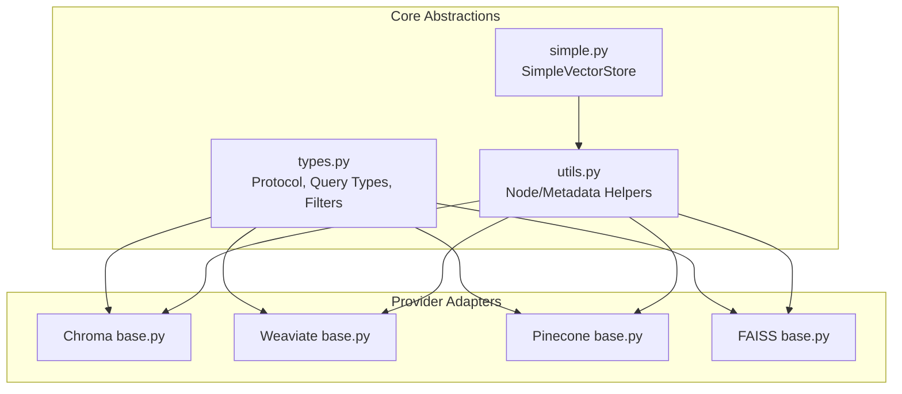
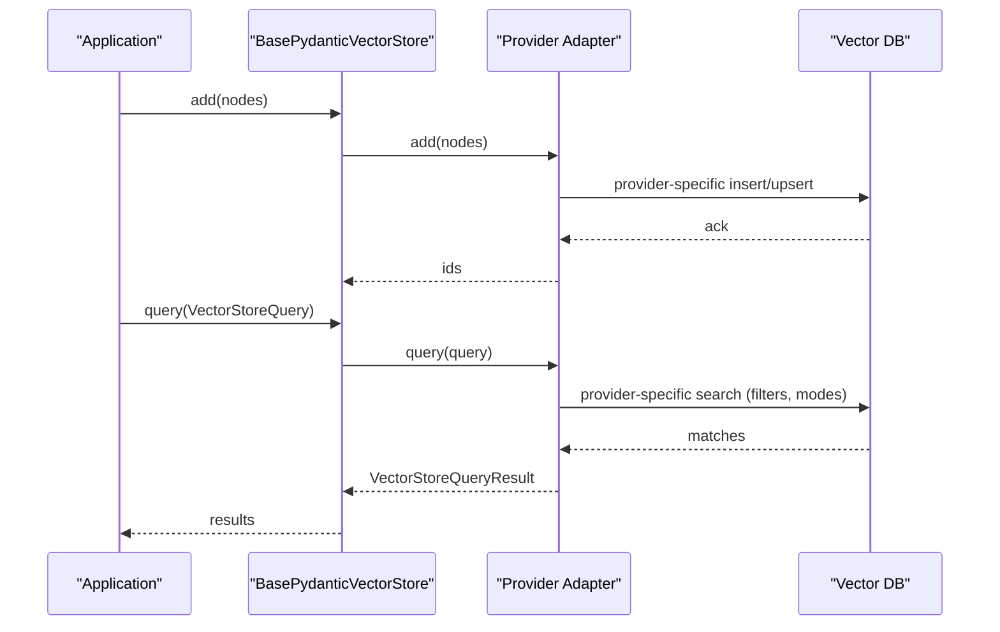
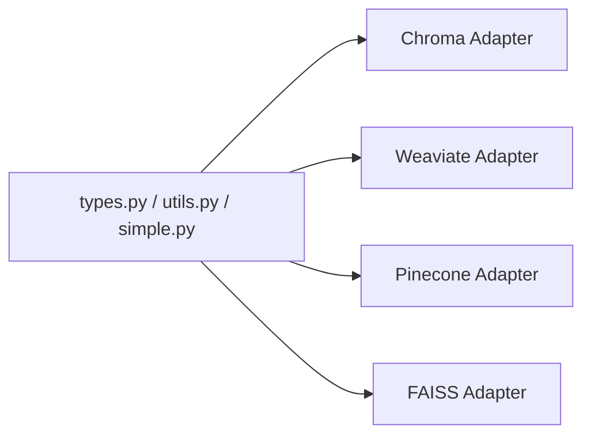

# Vector Store Integrations

<cite>
**Referenced Files in This Document**
- [types.py](file://llama-index-core/llama_index/core/vector_stores/types.py)
- [simple.py](file://llama-index-core/llama_index/core/vector_stores/simple.py)
- [utils.py](file://llama-index-core/llama_index/core/vector_stores/utils.py)
- [base.py (Chroma)](file://llama-index-integrations/vector_stores/llama-index-vector-stores-chroma/llama_index/vector_stores/chroma/base.py)
- [base.py (Weaviate)](file://llama-index-integrations/vector_stores/llama-index-vector-stores-weaviate/llama_index/vector_stores/weaviate/base.py)
- [base.py (Pinecone)](file://llama-index-integrations/vector_stores/llama-index-vector-stores-pinecone/llama_index/vector_stores/pinecone/base.py)
- [base.py (FAISS)](file://llama-index-integrations/vector_stores/llama-index-vector-stores-faiss/llama_index/vector_stores/faiss/base.py)
- [__init__.py (vector_stores)](file://llama-index-core/llama_index/core/vector_stores/__init__.py)
- [vector_stores.md (docs)](file://docs/src/content/docs/framework/module_guides/storing/vector_stores.md)
- [index.md (examples index)](file://docs/examples/index.md)
- [vector_stores.md (community integrations)](file://docs/src/content/docs/framework/community/integrations/vector_stores.md)
</cite>

## Table of Contents
1. [Introduction](#introduction)
2. [Project Structure](#project-structure)
3. [Core Components](#core-components)
4. [Architecture Overview](#architecture-overview)
5. [Detailed Component Analysis](#detailed-component-analysis)
6. [Dependency Analysis](#dependency-analysis)
7. [Performance Considerations](#performance-considerations)
8. [Troubleshooting Guide](#troubleshooting-guide)
9. [Conclusion](#conclusion)
10. [Appendices](#appendices)

## Introduction
This document explains the unified vector store abstraction in LlamaIndex and how it enables seamless integration with 77+ vector databases and similarity search providers. It covers the common interface, provider-specific adapter implementations, connection patterns, configuration options, and advanced features such as hybrid search and full-text search. Practical guidance is included for setup, authentication, index lifecycle management, performance tuning, scaling, backup/recovery, and cost optimization. Finally, it outlines how to develop custom vector store integrations and contribute new provider adapters to the ecosystem.

## Project Structure
LlamaIndex organizes vector store abstractions under the core module and provider-specific adapters under the integrations package. The core defines the protocol and shared utilities; integrations implement provider-specific adapters that translate the unified interface into provider-native operations.

**Diagram sources**
- [types.py](file://llama-index-core/llama_index/core/vector_stores/types.py#L268-L439)
- [simple.py](file://llama-index-core/llama_index/core/vector_stores/simple.py#L64-L355)
- [utils.py](file://llama-index-core/llama_index/core/vector_stores/utils.py#L1-L235)
- [base.py (Chroma)](file://llama-index-integrations/vector_stores/llama-index-vector-stores-chroma/llama_index/vector_stores/chroma/base.py#L120-L709)
- [base.py (Weaviate)](file://llama-index-integrations/vector_stores/llama-index-vector-stores-weaviate/llama_index/vector_stores/weaviate/base.py#L113-L556)
- [base.py (Pinecone)](file://llama-index-integrations/vector_stores/llama-index-vector-stores-pinecone/llama_index/vector_stores/pinecone/base.py#L114-L552)
- [base.py (FAISS)](file://llama-index-integrations/vector_stores/llama-index-vector-stores-faiss/llama_index/vector_stores/faiss/base.py#L33-L223)

**Section sources**
- [types.py](file://llama-index-core/llama_index/core/vector_stores/types.py#L1-L439)
- [simple.py](file://llama-index-core/llama_index/core/vector_stores/simple.py#L1-L355)
- [utils.py](file://llama-index-core/llama_index/core/vector_stores/utils.py#L1-L235)
- [base.py (Chroma)](file://llama-index-integrations/vector_stores/llama-index-vector-stores-chroma/llama_index/vector_stores/chroma/base.py#L1-L709)
- [base.py (Weaviate)](file://llama-index-integrations/vector_stores/llama-index-vector-stores-weaviate/llama_index/vector_stores/weaviate/base.py#L1-L556)
- [base.py (Pinecone)](file://llama-index-integrations/vector_stores/llama-index-vector-stores-pinecone/llama_index/vector_stores/pinecone/base.py#L1-L552)
- [base.py (FAISS)](file://llama-index-integrations/vector_stores/llama-index-vector-stores-faiss/llama_index/vector_stores/faiss/base.py#L1-L223)

## Core Components
- Unified Protocol and Query Model
  - The BasePydanticVectorStore protocol defines the canonical interface for vector insertion, deletion, querying, and persistence. It standardizes operations across providers while allowing provider-specific extensions.
  - VectorStoreQuery encapsulates query semantics: embedding, text, filters, modes (DEFAULT, SPARSE, HYBRID, TEXT_SEARCH, MMR), and top-k selection.
  - MetadataFilters and FilterOperator define a rich, composable filtering language supporting equality, comparison, membership, containment, and full-text matching.

- Shared Utilities
  - node_to_metadata_dict and metadata_dict_to_node normalize how node content and metadata are serialized/deserialized across providers.
  - build_metadata_filter_fn converts standardized filters into provider-specific filter expressions.

- Simple Vector Store
  - An in-memory implementation demonstrating the protocol’s capabilities and serving as a reference for minimal adapters.

**Section sources**
- [types.py](file://llama-index-core/llama_index/core/vector_stores/types.py#L268-L439)
- [types.py](file://llama-index-core/llama_index/core/vector_stores/types.py#L240-L267)
- [types.py](file://llama-index-core/llama_index/core/vector_stores/types.py#L94-L186)
- [utils.py](file://llama-index-core/llama_index/core/vector_stores/utils.py#L40-L99)
- [utils.py](file://llama-index-core/llama_index/core/vector_stores/utils.py#L101-L176)
- [simple.py](file://llama-index-core/llama_index/core/vector_stores/simple.py#L64-L355)

## Architecture Overview
The unified abstraction ensures that all vector store adapters implement the same contract. Provider adapters translate the unified query model into provider-specific APIs, handle authentication/connection, and manage provider-specific features such as hybrid search, full-text search, and advanced filtering.

**Diagram sources**
- [types.py](file://llama-index-core/llama_index/core/vector_stores/types.py#L334-L439)
- [base.py (Chroma)](file://llama-index-integrations/vector_stores/llama-index-vector-stores-chroma/llama_index/vector_stores/chroma/base.py#L284-L325)
- [base.py (Weaviate)](file://llama-index-integrations/vector_stores/llama-index-vector-stores-weaviate/llama_index/vector_stores/weaviate/base.py#L259-L284)
- [base.py (Pinecone)](file://llama-index-integrations/vector_stores/llama-index-vector-stores-pinecone/llama_index/vector_stores/pinecone/base.py#L294-L351)

## Detailed Component Analysis

### Unified Protocol and Query Model
- Protocol Contract
  - Provides add, delete, query, persist, and async variants with consistent signatures.
  - Enables provider-specific attributes (e.g., client) and optional features (e.g., get_nodes).

- Query Semantics
  - VectorStoreQuery supports embedding-based similarity search, sparse vectors, hybrid modes, full-text search, and MMR.
  - MetadataFilters allow complex, nested filtering with logical conditions.

- Filtering Translation
  - Providers implement translation helpers to convert standardized filters into provider-specific query DSLs.

**Section sources**
- [types.py](file://llama-index-core/llama_index/core/vector_stores/types.py#L268-L439)
- [types.py](file://llama-index-core/llama_index/core/vector_stores/types.py#L240-L267)
- [types.py](file://llama-index-core/llama_index/core/vector_stores/types.py#L94-L186)
- [utils.py](file://llama-index-core/llama_index/core/vector_stores/utils.py#L101-L176)

### Chroma Adapter
- Capabilities
  - Stores embeddings, text, and metadata in a Chroma collection.
  - Supports MMR search with configurable prefetch factor and threshold.
  - Translates standardized filters to Chroma’s $and/$or/$in/$nin/$ne/$eq/$gt/$gte/$lt/$lte operators.

- Connection Patterns
  - Ephemeral in-memory, persistent filesystem-backed, or remote HTTP client.
  - Accepts collection kwargs for index configuration.

- Configuration Options
  - Host/port/SSL/headers for remote instances.
  - Persist directory for local persistence.
  - Chunked batch inserts with a max chunk size.

- Practical Notes
  - Uses node_to_metadata_dict with flat metadata and removes text from metadata for storage.
  - Exposes where and where_document for advanced Chroma queries.

**Section sources**
- [base.py (Chroma)](file://llama-index-integrations/vector_stores/llama-index-vector-stores-chroma/llama_index/vector_stores/chroma/base.py#L120-L709)
- [utils.py](file://llama-index-core/llama_index/core/vector_stores/utils.py#L40-L76)

### Weaviate Adapter
- Capabilities
  - Stores embeddings and text in Weaviate classes with automatic schema creation.
  - Supports hybrid search with configurable alpha blending between vector and text.
  - Robust filter translation to Weaviate’s Filter API with logical combinations.

- Connection Patterns
  - Accepts WeaviateClient or WeaviateAsyncClient; supports auth via API key or resource owner password.
  - Lazy initialization for async clients.

- Configuration Options
  - Index/class name, text key, auth config, client kwargs, custom batch wrapper.
  - Automatic schema creation and cleanup methods.

- Practical Notes
  - Uses get_data_object to map nodes to Weaviate properties and vectors.
  - Supports dynamic and fixed-size batching for efficient inserts.

**Section sources**
- [base.py (Weaviate)](file://llama-index-integrations/vector_stores/llama-index-vector-stores-weaviate/llama_index/vector_stores/weaviate/base.py#L113-L556)
- [utils.py](file://llama-index-core/llama_index/core/vector_stores/utils.py#L40-L76)

### Pinecone Adapter
- Capabilities
  - Upserts dense vectors and optional sparse vectors for hybrid search.
  - Supports SPARSE and HYBRID modes with configurable alpha blending.
  - Translates filters to Pinecone’s $and/$or/$in/$nin/$ne/$eq/$gt/$gte/$lt/$lte operators.

- Connection Patterns
  - Initializes via provided index or creates a client with API key and index name.
  - Supports namespaces for multi-tenant or multi-collection organization.

- Configuration Options
  - Insert kwargs, batch size, text key, remove_text_from_metadata flag, optional sparse embedding model.
  - Default empty query vector for text-only queries.

- Practical Notes
  - Requires a query vector; falls back to zero vector when none is provided.
  - Supports delete by filter and delete by prefix for serverless environments.

**Section sources**
- [base.py (Pinecone)](file://llama-index-integrations/vector_stores/llama-index-vector-stores-pinecone/llama_index/vector_stores/pinecone/base.py#L114-L552)
- [utils.py](file://llama-index-core/llama_index/core/vector_stores/utils.py#L40-L76)

### FAISS Adapter
- Capabilities
  - Stores dense vectors in FAISS indexes; does not store text.
  - Performs similarity search and returns indices mapped to node IDs.

- Limitations
  - Does not support metadata filters or delete operations.
  - Persists via local filesystem; fsspec not supported.

- Practical Notes
  - Converts embeddings to float32 arrays and uses FAISS index search.
  - Useful for CPU-based, offline, or embedded scenarios.

**Section sources**
- [base.py (FAISS)](file://llama-index-integrations/vector_stores/llama-index-vector-stores-faiss/llama_index/vector_stores/faiss/base.py#L33-L223)

### Simple Vector Store
- Purpose
  - Demonstrates the protocol with an in-memory dictionary of embeddings and metadata.
  - Supports MMR, learner modes, and filtering via metadata.

- Practical Notes
  - Ideal for testing, prototyping, and environments where persistence is not required.
  - Persists to JSON with configurable namespace and directory.

**Section sources**
- [simple.py](file://llama-index-core/llama_index/core/vector_stores/simple.py#L64-L355)

### Provider-Specific Features
- Hybrid Search
  - Weaviate and Pinecone support alpha-blended hybrid search combining vector and text scores.
  - Pinecone optionally adds sparse vectors for sparse/dense fusion.

- Full-Text Search
  - Weaviate exposes text-based search integrated with vector search.
  - Pinecone supports sparse vectors for lexical matching.

- Advanced Filtering
  - Rich operator set (EQ, NE, GT, GTE, LT, LTE, IN, NIN, CONTAINS, TEXT_MATCH, IS_EMPTY) with AND/OR/NOT composition.
  - Providers translate filters to their native query languages.

**Section sources**
- [types.py](file://llama-index-core/llama_index/core/vector_stores/types.py#L63-L83)
- [types.py](file://llama-index-core/llama_index/core/vector_stores/types.py#L85-L92)
- [base.py (Weaviate)](file://llama-index-integrations/vector_stores/llama-index-vector-stores-weaviate/llama_index/vector_stores/weaviate/base.py#L473-L496)
- [base.py (Pinecone)](file://llama-index-integrations/vector_stores/llama-index-vector-stores-pinecone/llama_index/vector_stores/pinecone/base.py#L460-L482)

### Common Interface Patterns
- Vector Insertion
  - All adapters implement add(nodes) and return node IDs.
  - Some support async_add and batch operations.

- Similarity Search
  - All adapters implement query(VectorStoreQuery) returning VectorStoreQueryResult with nodes, similarities, and ids.

- Metadata Filtering
  - Standardized via MetadataFilters; adapters translate to provider-specific filters.

- Batch Operations
  - Chroma and FAISS use chunked inserts; Weaviate supports dynamic/fixed-size batching; Pinecone supports batch sizes.

**Section sources**
- [types.py](file://llama-index-core/llama_index/core/vector_stores/types.py#L268-L439)
- [base.py (Chroma)](file://llama-index-integrations/vector_stores/llama-index-vector-stores-chroma/llama_index/vector_stores/chroma/base.py#L284-L325)
- [base.py (Weaviate)](file://llama-index-integrations/vector_stores/llama-index-vector-stores-weaviate/llama_index/vector_stores/weaviate/base.py#L259-L284)
- [base.py (Pinecone)](file://llama-index-integrations/vector_stores/llama-index-vector-stores-pinecone/llama_index/vector_stores/pinecone/base.py#L294-L351)
- [base.py (FAISS)](file://llama-index-integrations/vector_stores/llama-index-vector-stores-faiss/llama_index/vector_stores/faiss/base.py#L119-L141)

### Practical Setup and Configuration
- Authentication and Credentials
  - Chroma: HTTP client with optional SSL and headers; local persistent client supported.
  - Weaviate: API key or resource owner password; supports custom batch wrappers.
  - Pinecone: API key and index name; supports namespaces.
  - FAISS: no authentication; local filesystem persistence.

- Index Creation and Management
  - Chroma: create collection via client; supports chunked add.
  - Weaviate: automatic schema creation; supports delete_index and clear.
  - Pinecone: initialize via provided index or create client; supports delete_all and namespace isolation.
  - FAISS: construct index externally; add vectors and persist to disk.

- Optimizing Search Performance
  - Use appropriate index types and metrics for FAISS and external vector DBs.
  - Tune top_k and alpha for hybrid search.
  - Enable MMR where supported for diversity.
  - Use metadata filters to pre-filter large datasets.

**Section sources**
- [base.py (Chroma)](file://llama-index-integrations/vector_stores/llama-index-vector-stores-chroma/llama_index/vector_stores/chroma/base.py#L172-L251)
- [base.py (Weaviate)](file://llama-index-integrations/vector_stores/llama-index-vector-stores-weaviate/llama_index/vector_stores/weaviate/base.py#L165-L236)
- [base.py (Pinecone)](file://llama-index-integrations/vector_stores/llama-index-vector-stores-pinecone/llama_index/vector_stores/pinecone/base.py#L181-L288)
- [base.py (FAISS)](file://llama-index-integrations/vector_stores/llama-index-vector-stores-faiss/llama_index/vector_stores/faiss/base.py#L65-L118)

### Developing Custom Vector Store Integrations
- Steps
  - Implement BasePydanticVectorStore with add, delete, query, and optional get_nodes/delete_nodes/clear.
  - Translate VectorStoreQuery to provider-native operations (filters, modes, top_k).
  - Provide a client property and any provider-specific configuration.
  - Add tests validating add/query/filtering and persistence behavior.

- Best Practices
  - Normalize metadata using node_to_metadata_dict and handle legacy formats.
  - Support async operations where the underlying provider allows.
  - Respect provider constraints (e.g., FAISS lacks delete and filters).
  - Provide clear error messages and guardrails for unsupported features.

**Section sources**
- [types.py](file://llama-index-core/llama_index/core/vector_stores/types.py#L334-L439)
- [utils.py](file://llama-index-core/llama_index/core/vector_stores/utils.py#L40-L99)

## Dependency Analysis
The core vector store types and utilities are consumed by all provider adapters. Each adapter depends on its respective provider SDK and translates the unified interface into provider-specific calls.

**Diagram sources**
- [types.py](file://llama-index-core/llama_index/core/vector_stores/types.py#L1-L439)
- [utils.py](file://llama-index-core/llama_index/core/vector_stores/utils.py#L1-L235)
- [simple.py](file://llama-index-core/llama_index/core/vector_stores/simple.py#L1-L355)
- [base.py (Chroma)](file://llama-index-integrations/vector_stores/llama-index-vector-stores-chroma/llama_index/vector_stores/chroma/base.py#L1-L709)
- [base.py (Weaviate)](file://llama-index-integrations/vector_stores/llama-index-vector-stores-weaviate/llama_index/vector_stores/weaviate/base.py#L1-L556)
- [base.py (Pinecone)](file://llama-index-integrations/vector_stores/llama-index-vector-stores-pinecone/llama_index/vector_stores/pinecone/base.py#L1-L552)
- [base.py (FAISS)](file://llama-index-integrations/vector_stores/llama-index-vector-stores-faiss/llama_index/vector_stores/faiss/base.py#L1-L223)

**Section sources**
- [types.py](file://llama-index-core/llama_index/core/vector_stores/types.py#L1-L439)
- [utils.py](file://llama-index-core/llama_index/core/vector_stores/utils.py#L1-L235)
- [simple.py](file://llama-index-core/llama_index/core/vector_stores/simple.py#L1-L355)
- [base.py (Chroma)](file://llama-index-integrations/vector_stores/llama-index-vector-stores-chroma/llama_index/vector_stores/chroma/base.py#L1-L709)
- [base.py (Weaviate)](file://llama-index-integrations/vector_stores/llama-index-vector-stores-weaviate/llama_index/vector_stores/weaviate/base.py#L1-L556)
- [base.py (Pinecone)](file://llama-index-integrations/vector_stores/llama-index-vector-stores-pinecone/llama_index/vector_stores/pinecone/base.py#L1-L552)
- [base.py (FAISS)](file://llama-index-integrations/vector_stores/llama-index-vector-stores-faiss/llama_index/vector_stores/faiss/base.py#L1-L223)

## Performance Considerations
- Index Selection and Metrics
  - Choose appropriate index types (e.g., Flat, IVF, HNSW) and metrics (L2, IP, COSINE) per provider.
- Batch Size Tuning
  - Adjust batch sizes for inserts to balance throughput and memory usage (e.g., FAISS chunking, Weaviate dynamic batches, Pinecone batch_size).
- Hybrid Search Alpha
  - Tune alpha to balance lexical and semantic signals (Weaviate/Pinecone).
- MMR and Diversity
  - Use MMR for diverse results; tune threshold and prefetch factors (Chroma).
- Filtering Preprocessing
  - Apply filters early to reduce candidate sets before similarity computation.
- Persistence and I/O
  - Prefer local filesystem for FAISS; use provider-native persistence for cloud vector DBs.

[No sources needed since this section provides general guidance]

## Troubleshooting Guide
- Unsupported Features
  - FAISS does not support delete or metadata filters; expect NotImplementedError or ValueError.
- Filter Conflicts
  - Some adapters reject simultaneous use of generic filters and provider-specific where clauses.
- Authentication Failures
  - Verify API keys, URLs, and auth configs for Weaviate and Pinecone.
- Hybrid Search Requirements
  - Pinecone requires either a query embedding or a sparse vector; ensure proper mode and alpha configuration.

**Section sources**
- [base.py (FAISS)](file://llama-index-integrations/vector_stores/llama-index-vector-stores-faiss/llama_index/vector_stores/faiss/base.py#L173-L200)
- [base.py (Chroma)](file://llama-index-integrations/vector_stores/llama-index-vector-stores-chroma/llama_index/vector_stores/chroma/base.py#L401-L411)
- [base.py (Weaviate)](file://llama-index-integrations/vector_stores/llama-index-vector-stores-weaviate/llama_index/vector_stores/weaviate/base.py#L521-L533)
- [base.py (Pinecone)](file://llama-index-integrations/vector_stores/llama-index-vector-stores-pinecone/llama_index/vector_stores/pinecone/base.py#L460-L482)

## Conclusion
LlamaIndex’s unified vector store abstraction provides a consistent developer experience across 77+ providers. By adhering to the BasePydanticVectorStore protocol and leveraging shared utilities, providers implement robust adapters that support advanced features like hybrid search, full-text search, and rich filtering. With clear connection patterns, configuration options, and best practices for performance and reliability, teams can confidently integrate and scale vector search in production.

[No sources needed since this section summarizes without analyzing specific files]

## Appendices

### Provider Feature Matrix (Selected)
- Chroma: MMR, filters, hybrid search, text storage, chunked inserts
- Weaviate: hybrid search, filters, schema creation, batching, async support
- Pinecone: sparse/dense hybrid, filters, namespaces, batch upsert
- FAISS: CPU-friendly, no text storage, no delete/filters, local persistence

**Section sources**
- [base.py (Chroma)](file://llama-index-integrations/vector_stores/llama-index-vector-stores-chroma/llama_index/vector_stores/chroma/base.py#L120-L709)
- [base.py (Weaviate)](file://llama-index-integrations/vector_stores/llama-index-vector-stores-weaviate/llama_index/vector_stores/weaviate/base.py#L113-L556)
- [base.py (Pinecone)](file://llama-index-integrations/vector_stores/llama-index-vector-stores-pinecone/llama_index/vector_stores/pinecone/base.py#L114-L552)
- [base.py (FAISS)](file://llama-index-integrations/vector_stores/llama-index-vector-stores-faiss/llama_index/vector_stores/faiss/base.py#L33-L223)

### Example References
- Vector store examples and guides are available in the documentation site, covering Chroma, Weaviate, Pinecone, Qdrant, FAISS, Redis, MongoDB Atlas, and more.

**Section sources**
- [vector_stores.md (docs)](file://docs/src/content/docs/framework/module_guides/storing/vector_stores.md#L75-L135)
- [index.md (examples index)](file://docs/examples/index.md#L54-L68)
- [vector_stores.md (community integrations)](file://docs/src/content/docs/framework/community/integrations/vector_stores.md#L1209-L1259)