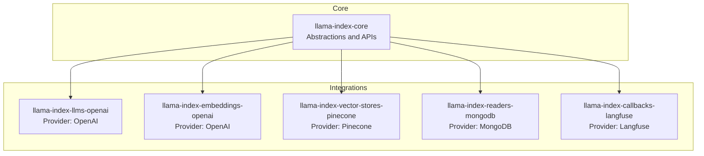
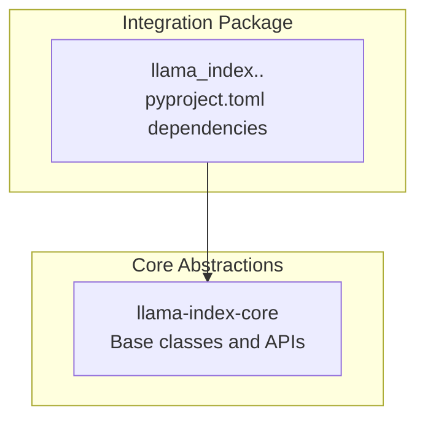
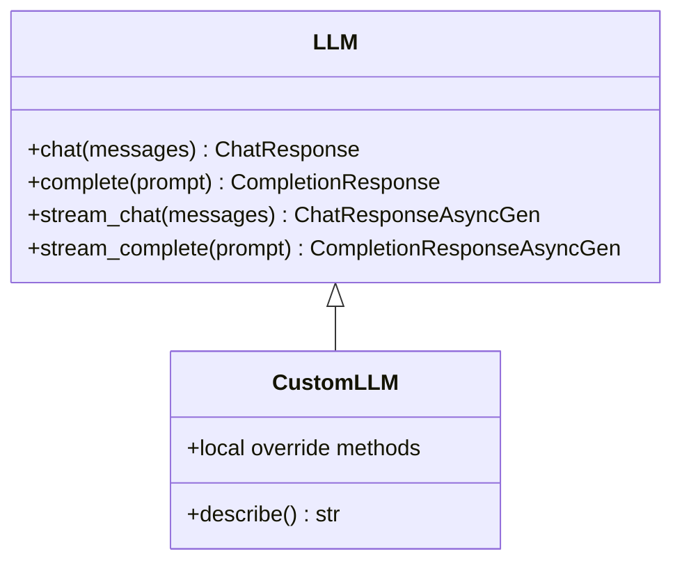
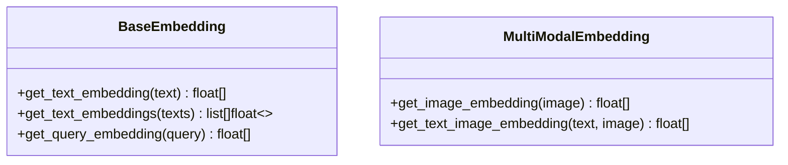
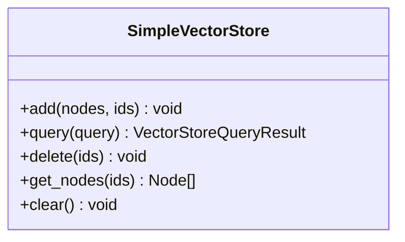
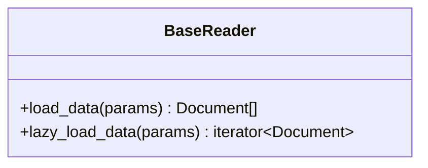
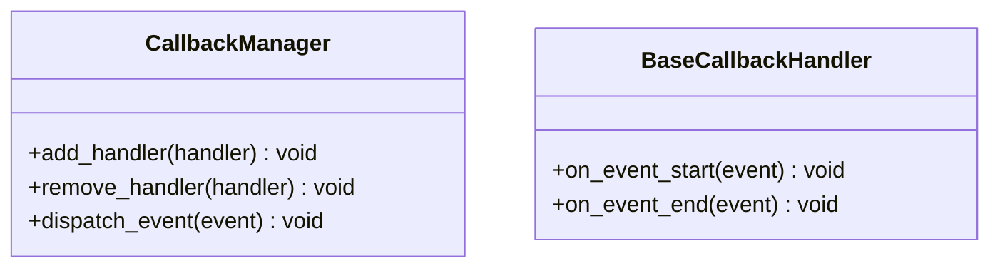
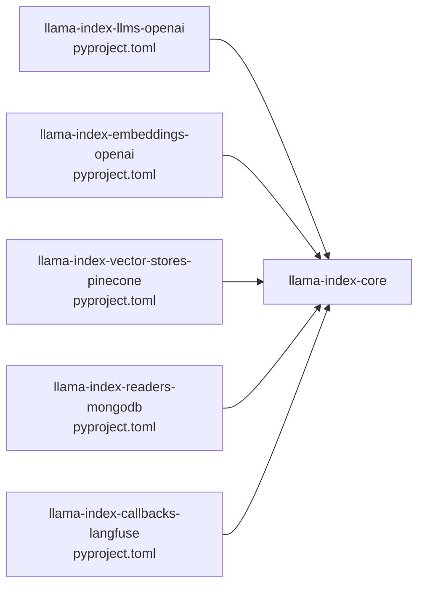

# Custom Integration Development

<cite>
**Referenced Files in This Document**
- [README.md](file://README.md)
- [CONTRIBUTING.md](file://CONTRIBUTING.md)
- [pyproject.toml](file://llama-index-core/pyproject.toml)
- [llms/__init__.py](file://llama-index-core/llama_index/core/llms/__init__.py)
- [embeddings/__init__.py](file://llama-index-core/llama_index/core/embeddings/__init__.py)
- [vector_stores/__init__.py](file://llama-index-core/llama_index/core/vector_stores/__init__.py)
- [readers/__init__.py](file://llama-index-core/llama_index/core/readers/__init__.py)
- [callbacks/__init__.py](file://llama-index-core/llama_index/core/callbacks/__init__.py)
- [llama-index-llms-openai/pyproject.toml](file://llama-index-integrations/llms/llama-index-llms-openai/pyproject.toml)
- [llama-index-embeddings-openai/pyproject.toml](file://llama-index-integrations/embeddings/llama-index-embeddings-openai/pyproject.toml)
- [llama-index-vector-stores-pinecone/pyproject.toml](file://llama-index-integrations/vector_stores/llama-index-vector-stores-pinecone/pyproject.toml)
- [llama-index-readers-mongodb/pyproject.toml](file://llama-index-integrations/readers/llama-index-readers-mongodb/pyproject.toml)
- [llama-index-callbacks-langfuse/pyproject.toml](file://llama-index-integrations/callbacks/llama-index-callbacks-langfuse/pyproject.toml)
- [integration_health_check.py](file://scripts/integration_health_check.py)
- [publish_packages.sh](file://scripts/publish_packages.sh)
</cite>

## Table of Contents
1. [Introduction](#introduction)
2. [Project Structure](#project-structure)
3. [Core Components](#core-components)
4. [Architecture Overview](#architecture-overview)
5. [Detailed Component Analysis](#detailed-component-analysis)
6. [Dependency Analysis](#dependency-analysis)
7. [Performance Considerations](#performance-considerations)
8. [Troubleshooting Guide](#troubleshooting-guide)
9. [Conclusion](#conclusion)
10. [Appendices](#appendices)

## Introduction
This document explains how to develop custom integrations for LlamaIndex. It covers naming conventions, project structure, interface contracts, testing requirements, and publishing practices. It also provides step-by-step tutorials for building custom LLM providers, embedding services, vector stores, readers, and callback handlers, along with best practices for error handling, logging, performance optimization, and backward compatibility.

## Project Structure
LlamaIndex is organized as a monorepo with:
- Core package: llama-index-core containing foundational abstractions and APIs
- Integrations: numerous packages under llama-index-integrations grouped by domain (llms, embeddings, vector_stores, readers, callbacks, etc.)
- CLI and developer utilities: llama-index-cli and scripts for health checks and publishing

Key conventions:
- Package naming follows llama-index-<domain>-<provider>, e.g., llama-index-llms-openai, llama-index-embeddings-openai, llama-index-vector-stores-pinecone
- Each integration package depends on llama-index-core and the target provider SDK
- Integration packages expose a module path under llama_index.<domain>.<provider>

**Diagram sources**
- [pyproject.toml](file://llama-index-core/pyproject.toml#L1-L50)
- [llama-index-llms-openai/pyproject.toml](file://llama-index-integrations/llms/llama-index-llms-openai/pyproject.toml#L28-L38)
- [llama-index-embeddings-openai/pyproject.toml](file://llama-index-integrations/embeddings/llama-index-embeddings-openai/pyproject.toml#L27-L38)
- [llama-index-vector-stores-pinecone/pyproject.toml](file://llama-index-integrations/vector_stores/llama-index-vector-stores-pinecone/pyproject.toml#L27-L38)
- [llama-index-readers-mongodb/pyproject.toml](file://llama-index-integrations/readers/llama-index-readers-mongodb/pyproject.toml#L27-L38)
- [llama-index-callbacks-langfuse/pyproject.toml](file://llama-index-integrations/callbacks/llama-index-callbacks-langfuse/pyproject.toml#L28-L39)

**Section sources**
- [README.md](file://README.md#L11-L35)
- [CONTRIBUTING.md](file://CONTRIBUTING.md#L195-L203)

## Core Components
LlamaIndex defines abstract base classes and public APIs for each integration domain. Integrations must implement these contracts to be compatible with core.

- LLMs
  - Exposed via llama_index.core.llms.__init__.py
  - Key exports include LLM, CustomLLM, and response/message types
  - Reference: [llms/__init__.py](file://llama-index-core/llama_index/core/llms/__init__.py#L1-L49)

- Embeddings
  - Exposed via llama_index.core.embeddings.__init__.py
  - Key exports include BaseEmbedding, MultiModalEmbedding, Pooling, and helpers
  - Reference: [embeddings/__init__.py](file://llama-index-core/llama_index/core/embeddings/__init__.py#L1-L16)

- Vector Stores
  - Exposed via llama_index.core.vector_stores.__init__.py
  - Key exports include SimpleVectorStore and query/result types
  - Reference: [vector_stores/__init__.py](file://llama-index-core/llama_index/core/vector_stores/__init__.py#L1-L28)

- Readers
  - Exposed via llama_index.core.readers.__init__.py
  - Key exports include BaseReader-related utilities and Document
  - Reference: [readers/__init__.py](file://llama-index-core/llama_index/core/readers/__init__.py#L1-L33)

- Callbacks
  - Exposed via llama_index.core.callbacks.__init__.py
  - Key exports include CallbackManager, handler classes, and tracing utilities
  - Reference: [callbacks/__init__.py](file://llama-index-core/llama_index/core/callbacks/__init__.py#L1-L18)

**Section sources**
- [llms/__init__.py](file://llama-index-core/llama_index/core/llms/__init__.py#L1-L49)
- [embeddings/__init__.py](file://llama-index-core/llama_index/core/embeddings/__init__.py#L1-L16)
- [vector_stores/__init__.py](file://llama-index-core/llama_index/core/vector_stores/__init__.py#L1-L28)
- [readers/__init__.py](file://llama-index-core/llama_index/core/readers/__init__.py#L1-L33)
- [callbacks/__init__.py](file://llama-index-core/llama_index/core/callbacks/__init__.py#L1-L18)

## Architecture Overview
The integration architecture centers on core abstractions and provider-specific implementations. Integrations are packaged separately and depend on core, enabling modular selection of providers.

**Diagram sources**
- [llama-index-llms-openai/pyproject.toml](file://llama-index-integrations/llms/llama-index-llms-openai/pyproject.toml#L36-L36)
- [llama-index-embeddings-openai/pyproject.toml](file://llama-index-integrations/embeddings/llama-index-embeddings-openai/pyproject.toml#L35-L38)
- [llama-index-vector-stores-pinecone/pyproject.toml](file://llama-index-integrations/vector_stores/llama-index-vector-stores-pinecone/pyproject.toml#L35-L38)
- [llama-index-readers-mongodb/pyproject.toml](file://llama-index-integrations/readers/llama-index-readers-mongodb/pyproject.toml#L35-L38)
- [llama-index-callbacks-langfuse/pyproject.toml](file://llama-index-integrations/callbacks/llama-index-callbacks-langfuse/pyproject.toml#L36-L39)

## Detailed Component Analysis

### LLM Providers
- Purpose: Provide language model inference with streaming and non-streaming responses
- Contract: Implement core LLM abstractions and expose a class consumable via llama_index.llms.<provider>
- Example integration: llama-index-llms-openai
  - Dependencies: openai SDK and llama-index-core
  - Import path configured for LlamaHub
  - Reference: [llama-index-llms-openai/pyproject.toml](file://llama-index-integrations/llms/llama-index-llms-openai/pyproject.toml#L28-L56)

**Diagram sources**
- [llms/__init__.py](file://llama-index-core/llama_index/core/llms/__init__.py#L21-L23)

**Section sources**
- [llms/__init__.py](file://llama-index-core/llama_index/core/llms/__init__.py#L1-L49)
- [llama-index-llms-openai/pyproject.toml](file://llama-index-integrations/llms/llama-index-llms-openai/pyproject.toml#L28-L56)

### Embedding Services
- Purpose: Produce embeddings for text and multimodal inputs
- Contract: Implement BaseEmbedding or MultiModalEmbedding and expose a class consumable via llama_index.embeddings.<provider>
- Example integration: llama-index-embeddings-openai
  - Dependencies: openai SDK and llama-index-core
  - Import path configured for LlamaHub
  - Reference: [llama-index-embeddings-openai/pyproject.toml](file://llama-index-integrations/embeddings/llama-index-embeddings-openai/pyproject.toml#L27-L55)

**Diagram sources**
- [embeddings/__init__.py](file://llama-index-core/llama_index/core/embeddings/__init__.py#L1-L6)

**Section sources**
- [embeddings/__init__.py](file://llama-index-core/llama_index/core/embeddings/__init__.py#L1-L16)
- [llama-index-embeddings-openai/pyproject.toml](file://llama-index-integrations/embeddings/llama-index-embeddings-openai/pyproject.toml#L27-L55)

### Vector Stores
- Purpose: Persist and retrieve vector embeddings with filtering and metadata support
- Contract: Implement core vector store abstractions and expose a class consumable via llama_index.vector_stores.<provider>
- Example integration: llama-index-vector-stores-pinecone
  - Dependencies: pinecone SDK and llama-index-core
  - Import path configured for LlamaHub
  - Reference: [llama-index-vector-stores-pinecone/pyproject.toml](file://llama-index-integrations/vector_stores/llama-index-vector-stores-pinecone/pyproject.toml#L27-L55)

**Diagram sources**
- [vector_stores/__init__.py](file://llama-index-core/llama_index/core/vector_stores/__init__.py#L3-L14)

**Section sources**
- [vector_stores/__init__.py](file://llama-index-core/llama_index/core/vector_stores/__init__.py#L1-L28)
- [llama-index-vector-stores-pinecone/pyproject.toml](file://llama-index-integrations/vector_stores/llama-index-vector-stores-pinecone/pyproject.toml#L27-L55)

### Readers
- Purpose: Load data from external sources into LlamaIndex Document objects
- Contract: Implement reader interfaces and expose a class consumable via llama_index.readers.<provider>
- Example integration: llama-index-readers-mongodb
  - Dependencies: pymongo and llama-index-core
  - Import path configured for LlamaHub
  - Reference: [llama-index-readers-mongodb/pyproject.toml](file://llama-index-integrations/readers/llama-index-readers-mongodb/pyproject.toml#L27-L56)

**Diagram sources**
- [readers/__init__.py](file://llama-index-core/llama_index/core/readers/__init__.py#L14-L23)

**Section sources**
- [readers/__init__.py](file://llama-index-core/llama_index/core/readers/__init__.py#L1-L33)
- [llama-index-readers-mongodb/pyproject.toml](file://llama-index-integrations/readers/llama-index-readers-mongodb/pyproject.toml#L27-L56)

### Callback Handlers
- Purpose: Instrument and observe LlamaIndex workflows via callback events
- Contract: Implement core callback abstractions and expose a handler consumable via llama_index.callbacks.<provider>
- Example integration: llama-index-callbacks-langfuse
  - Dependencies: langfuse SDK and llama-index-core
  - Import path configured for LlamaHub
  - Reference: [llama-index-callbacks-langfuse/pyproject.toml](file://llama-index-integrations/callbacks/llama-index-callbacks-langfuse/pyproject.toml#L28-L57)

**Diagram sources**
- [callbacks/__init__.py](file://llama-index-core/llama_index/core/callbacks/__init__.py#L1-L6)

**Section sources**
- [callbacks/__init__.py](file://llama-index-core/llama_index/core/callbacks/__init__.py#L1-L18)
- [llama-index-callbacks-langfuse/pyproject.toml](file://llama-index-integrations/callbacks/llama-index-callbacks-langfuse/pyproject.toml#L28-L57)

## Dependency Analysis
Each integration package declares:
- Name and version
- Author/maintainer metadata
- Python version constraints
- Dependencies on provider SDKs and llama-index-core
- Packaging configuration for sdist/wheel
- LlamaHub import path and class authors

**Diagram sources**
- [llama-index-llms-openai/pyproject.toml](file://llama-index-integrations/llms/llama-index-llms-openai/pyproject.toml#L28-L38)
- [llama-index-embeddings-openai/pyproject.toml](file://llama-index-integrations/embeddings/llama-index-embeddings-openai/pyproject.toml#L27-L38)
- [llama-index-vector-stores-pinecone/pyproject.toml](file://llama-index-integrations/vector_stores/llama-index-vector-stores-pinecone/pyproject.toml#L27-L38)
- [llama-index-readers-mongodb/pyproject.toml](file://llama-index-integrations/readers/llama-index-readers-mongodb/pyproject.toml#L27-L38)
- [llama-index-callbacks-langfuse/pyproject.toml](file://llama-index-integrations/callbacks/llama-index-callbacks-langfuse/pyproject.toml#L28-L39)

**Section sources**
- [llama-index-llms-openai/pyproject.toml](file://llama-index-integrations/llms/llama-index-llms-openai/pyproject.toml#L28-L56)
- [llama-index-embeddings-openai/pyproject.toml](file://llama-index-integrations/embeddings/llama-index-embeddings-openai/pyproject.toml#L27-L55)
- [llama-index-vector-stores-pinecone/pyproject.toml](file://llama-index-integrations/vector_stores/llama-index-vector-stores-pinecone/pyproject.toml#L27-L55)
- [llama-index-readers-mongodb/pyproject.toml](file://llama-index-integrations/readers/llama-index-readers-mongodb/pyproject.toml#L27-L56)
- [llama-index-callbacks-langfuse/pyproject.toml](file://llama-index-integrations/callbacks/llama-index-callbacks-langfuse/pyproject.toml#L28-L57)

## Performance Considerations
- Prefer lazy loading for large datasets (e.g., lazy_load_data) to reduce memory overhead
- Batch embedding requests when possible to minimize network latency
- Use streaming responses for long-running LLM calls to improve perceived performance
- Cache frequently accessed metadata and embeddings
- Monitor token usage with built-in token counting handlers
- Keep provider SDK versions aligned with integration constraints to avoid regressions

[No sources needed since this section provides general guidance]

## Troubleshooting Guide
Common issues and resolutions:
- Authentication failures
  - Verify environment variables and credentials are set before initializing integrations
  - Ensure provider SDKs are installed per integration dependencies
- Version conflicts
  - Align provider SDK versions with integration constraints
  - Reinstall core and integration packages to refresh dependency resolution
- Test coverage and CI
  - Integrate unit tests for all new integrations; aim for broad coverage
  - Use mocking for external services during tests
- Health checks
  - Run integration health checks to validate packaging and imports
  - Reference: [integration_health_check.py](file://scripts/integration_health_check.py)

**Section sources**
- [CONTRIBUTING.md](file://CONTRIBUTING.md#L204-L214)
- [integration_health_check.py](file://scripts/integration_health_check.py)

## Conclusion
Building custom integrations for LlamaIndex involves implementing core abstractions, packaging with standardized metadata, and adhering to naming and dependency conventions. Following the steps and best practices outlined here will ensure your integrations are robust, testable, and compatible with the broader ecosystem.

[No sources needed since this section summarizes without analyzing specific files]

## Appendices

### Step-by-Step Tutorial: Creating a Custom LLM Provider
1. Choose a provider SDK and define a class that implements the LLM contract
2. Create a new integration package named llama-index-llms-<provider>
3. Configure pyproject.toml with:
   - name, version, author, license
   - requires-python, dependencies (provider SDK + llama-index-core)
   - tool.llamahub.import_path pointing to llama_index.llms.<provider>
4. Implement authentication via environment variables or explicit parameters
5. Add unit tests and mock external calls
6. Publish and document usage

References:
- [llama-index-llms-openai/pyproject.toml](file://llama-index-integrations/llms/llama-index-llms-openai/pyproject.toml#L28-L56)
- [llms/__init__.py](file://llama-index-core/llama_index/core/llms/__init__.py#L21-L23)

**Section sources**
- [llama-index-llms-openai/pyproject.toml](file://llama-index-integrations/llms/llama-index-llms-openai/pyproject.toml#L28-L56)
- [llms/__init__.py](file://llama-index-core/llama_index/core/llms/__init__.py#L1-L49)

### Step-by-Step Tutorial: Creating a Custom Embedding Service
1. Implement BaseEmbedding or MultiModalEmbedding
2. Package as llama-index-embeddings-<provider>
3. Configure pyproject.toml with provider SDK and llama-index-core
4. Set tool.llamahub.import_path to llama_index.embeddings.<provider>
5. Add tests and benchmark performance
6. Publish and document

References:
- [llama-index-embeddings-openai/pyproject.toml](file://llama-index-integrations/embeddings/llama-index-embeddings-openai/pyproject.toml#L27-L55)
- [embeddings/__init__.py](file://llama-index-core/llama_index/core/embeddings/__init__.py#L1-L6)

**Section sources**
- [llama-index-embeddings-openai/pyproject.toml](file://llama-index-integrations/embeddings/llama-index-embeddings-openai/pyproject.toml#L27-L55)
- [embeddings/__init__.py](file://llama-index-core/llama_index/core/embeddings/__init__.py#L1-L16)

### Step-by-Step Tutorial: Creating a Custom Vector Store
1. Implement core vector store abstractions
2. Package as llama-index-vector-stores-<provider>
3. Configure pyproject.toml with provider SDK and llama-index-core
4. Set tool.llamahub.import_path to llama_index.vector_stores.<provider>
5. Add tests for add/query/delete operations
6. Publish and document

References:
- [llama-index-vector-stores-pinecone/pyproject.toml](file://llama-index-integrations/vector_stores/llama-index-vector-stores-pinecone/pyproject.toml#L27-L55)
- [vector_stores/__init__.py](file://llama-index-core/llama_index/core/vector_stores/__init__.py#L3-L14)

**Section sources**
- [llama-index-vector-stores-pinecone/pyproject.toml](file://llama-index-integrations/vector_stores/llama-index-vector-stores-pinecone/pyproject.toml#L27-L55)
- [vector_stores/__init__.py](file://llama-index-core/llama_index/core/vector_stores/__init__.py#L1-L28)

### Step-by-Step Tutorial: Creating a Custom Reader
1. Implement reader interfaces to produce Document objects
2. Package as llama-index-readers-<provider>
3. Configure pyproject.toml with provider SDK and llama-index-core
4. Set tool.llamahub.import_path to llama_index.readers.<provider>
5. Add tests for load/lazy_load and edge cases
6. Publish and document

References:
- [llama-index-readers-mongodb/pyproject.toml](file://llama-index-integrations/readers/llama-index-readers-mongodb/pyproject.toml#L27-L56)
- [readers/__init__.py](file://llama-index-core/llama_index/core/readers/__init__.py#L14-L23)

**Section sources**
- [llama-index-readers-mongodb/pyproject.toml](file://llama-index-integrations/readers/llama-index-readers-mongodb/pyproject.toml#L27-L56)
- [readers/__init__.py](file://llama-index-core/llama_index/core/readers/__init__.py#L1-L33)

### Step-by-Step Tutorial: Creating a Custom Callback Handler
1. Implement callback handler interfaces
2. Package as llama-index-callbacks-<provider>
3. Configure pyproject.toml with provider SDK and llama-index-core
4. Set tool.llamahub.import_path to llama_index.callbacks.<provider>
5. Add tests for event dispatching and payload handling
6. Publish and document

References:
- [llama-index-callbacks-langfuse/pyproject.toml](file://llama-index-integrations/callbacks/llama-index-callbacks-langfuse/pyproject.toml#L28-L57)
- [callbacks/__init__.py](file://llama-index-core/llama_index/core/callbacks/__init__.py#L1-L6)

**Section sources**
- [llama-index-callbacks-langfuse/pyproject.toml](file://llama-index-integrations/callbacks/llama-index-callbacks-langfuse/pyproject.toml#L28-L57)
- [callbacks/__init__.py](file://llama-index-core/llama_index/core/callbacks/__init__.py#L1-L18)

### Testing Strategy
- Unit tests for all integration logic
- Mock external provider calls to avoid flaky tests
- Coverage targets and linting enforced per CONTRIBUTING guidelines
- Reference: [CONTRIBUTING.md](file://CONTRIBUTING.md#L204-L214)

**Section sources**
- [CONTRIBUTING.md](file://CONTRIBUTING.md#L204-L214)

### Publishing Packages
- Use the provided scripts to validate and publish
  - Integration health check: [integration_health_check.py](file://scripts/integration_health_check.py)
  - Publish script: [publish_packages.sh](file://scripts/publish_packages.sh)
- Ensure pyproject.toml metadata is accurate and consistent with naming conventions

**Section sources**
- [integration_health_check.py](file://scripts/integration_health_check.py)
- [publish_packages.sh](file://scripts/publish_packages.sh)

### Best Practices
- Error handling
  - Wrap provider exceptions and re-raise with LlamaIndex-compatible errors
  - Log meaningful context for debugging
- Logging
  - Use standard logging with contextual info (operation, provider, identifiers)
- Backward compatibility
  - Follow semantic versioning and keep API signatures stable
  - Provide deprecation notices for breaking changes
- Reference: [CONTRIBUTING.md](file://CONTRIBUTING.md#L195-L203)

**Section sources**
- [CONTRIBUTING.md](file://CONTRIBUTING.md#L195-L203)