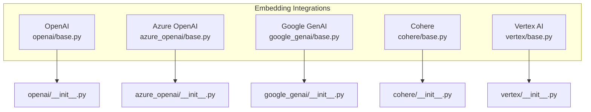
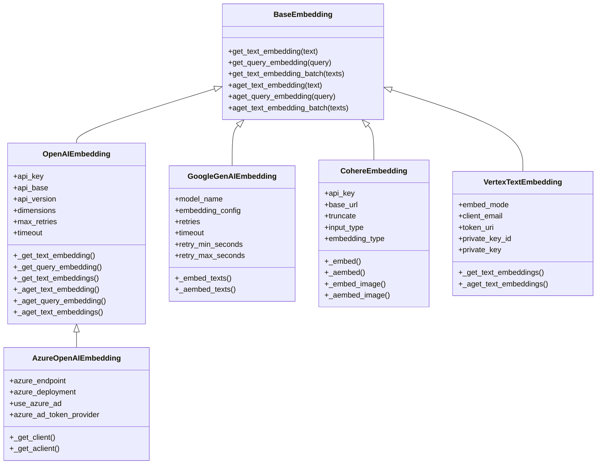
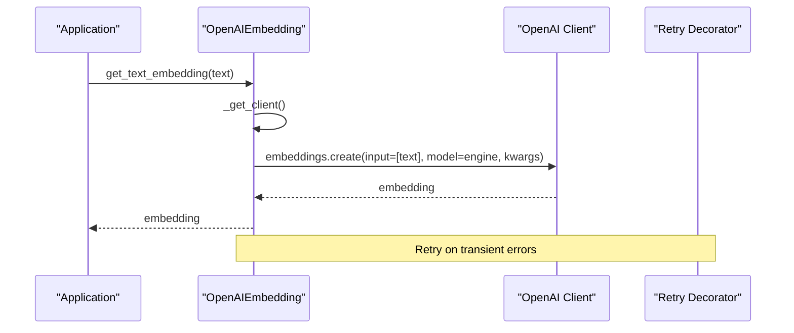
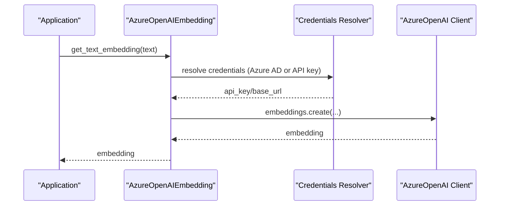
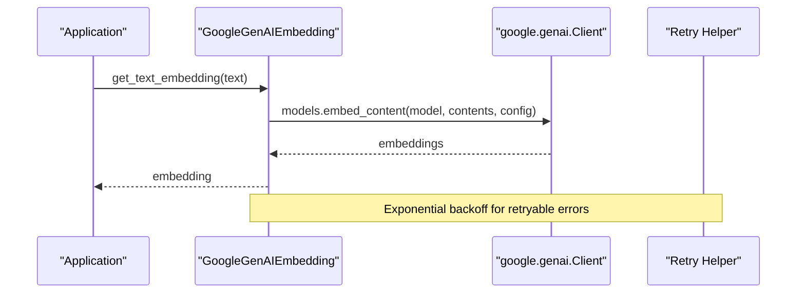
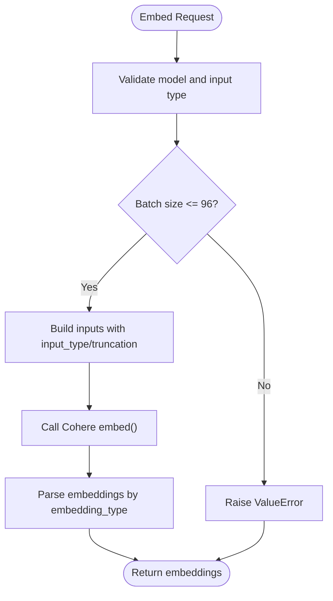
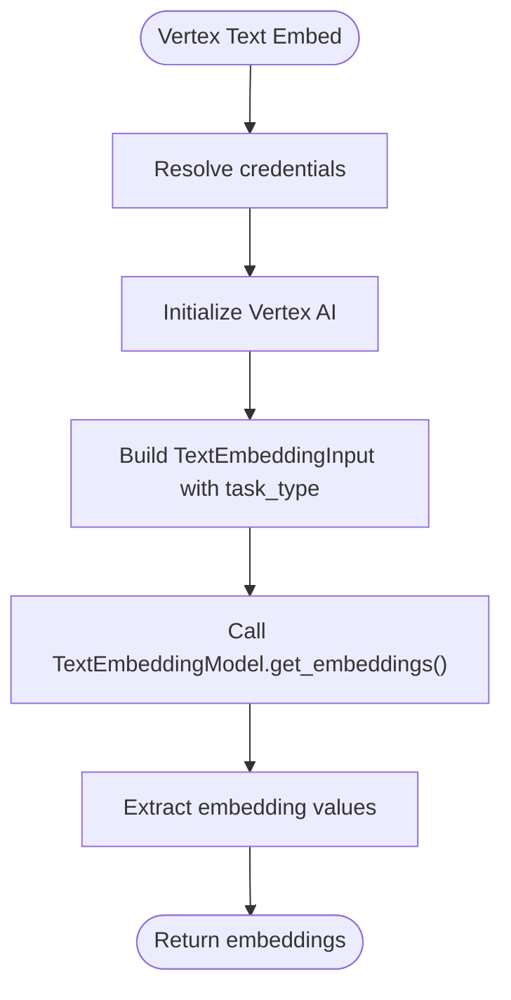
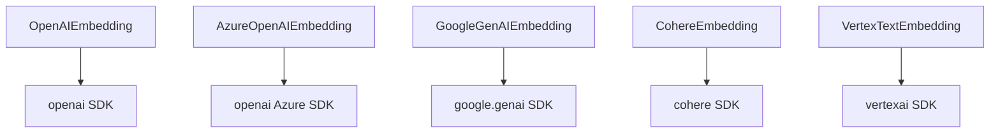

# Cloud Embedding Providers

<cite>
**Referenced Files in This Document**
- [OpenAI base.py](file://llama-index-integrations/embeddings/llama-index-embeddings-openai/llama_index/embeddings/openai/base.py)
- [OpenAI __init__.py](file://llama-index-integrations/embeddings/llama-index-embeddings-openai/llama_index/embeddings/openai/__init__.py)
- [Azure OpenAI base.py](file://llama-index-integrations/embeddings/llama-index-embeddings-azure-openai/llama_index/embeddings/azure_openai/base.py)
- [Azure OpenAI __init__.py](file://llama-index-integrations/embeddings/llama-index-embeddings-azure-openai/llama_index/embeddings/azure_openai/__init__.py)
- [Google GenAI base.py](file://llama-index-integrations/embeddings/llama-index-embeddings-google-genai/llama_index/embeddings/google_genai/base.py)
- [Google GenAI __init__.py](file://llama-index-integrations/embeddings/llama-index-embeddings-google-genai/llama_index/embeddings/google_genai/__init__.py)
- [Cohere base.py](file://llama-index-integrations/embeddings/llama-index-embeddings-cohere/llama_index/embeddings/cohere/base.py)
- [Cohere __init__.py](file://llama-index-integrations/embeddings/llama-index-embeddings-cohere/llama_index/embeddings/cohere/__init__.py)
- [Vertex base.py](file://llama-index-integrations/embeddings/llama-index-embeddings-vertex/llama_index/embeddings/vertex/base.py)
- [Vertex __init__.py](file://llama-index-integrations/embeddings/llama-index-embeddings-vertex/llama_index/embeddings/vertex/__init__.py)
- [OpenAI example notebook](file://docs/examples/embeddings/OpenAI.ipynb)
- [Google GenAI example notebook](file://docs/examples/embeddings/google_genai.ipynb)
</cite>

## Table of Contents
1. [Introduction](#introduction)
2. [Project Structure](#project-structure)
3. [Core Components](#core-components)
4. [Architecture Overview](#architecture-overview)
5. [Detailed Component Analysis](#detailed-component-analysis)
6. [Dependency Analysis](#dependency-analysis)
7. [Performance Considerations](#performance-considerations)
8. [Troubleshooting Guide](#troubleshooting-guide)
9. [Conclusion](#conclusion)
10. [Appendices](#appendices)

## Introduction
This document provides comprehensive guidance for using cloud-based embedding providers in LlamaIndex. It focuses on five major providers: OpenAI, Azure OpenAI, Google GenAI, Cohere, and Vertex AI. For each provider, we explain configuration parameters, authentication methods, model selection, batch processing, rate limiting, error handling, and practical setup examples. We also cover provider-specific capabilities such as similarity scoring, normalization options, and regional availability, along with migration guidance and production best practices.

## Project Structure
The repository organizes cloud embedding integrations under dedicated packages per provider. Each provider exposes a primary embedding class and a public module initializer. Example notebooks demonstrate practical usage patterns.

**Diagram sources**
- [OpenAI base.py](file://llama-index-integrations/embeddings/llama-index-embeddings-openai/llama_index/embeddings/openai/base.py#L1-L489)
- [Azure OpenAI base.py](file://llama-index-integrations/embeddings/llama-index-embeddings-azure-openai/llama_index/embeddings/azure_openai/base.py#L1-L195)
- [Google GenAI base.py](file://llama-index-integrations/embeddings/llama-index-embeddings-google-genai/llama_index/embeddings/google_genai/base.py#L1-L337)
- [Cohere base.py](file://llama-index-integrations/embeddings/llama-index-embeddings-cohere/llama_index/embeddings/cohere/base.py#L1-L431)
- [Vertex base.py](file://llama-index-integrations/embeddings/llama-index-embeddings-vertex/llama_index/embeddings/vertex/base.py#L1-L303)

**Section sources**
- [OpenAI base.py](file://llama-index-integrations/embeddings/llama-index-embeddings-openai/llama_index/embeddings/openai/base.py#L1-L489)
- [Azure OpenAI base.py](file://llama-index-integrations/embeddings/llama-index-embeddings-azure-openai/llama_index/embeddings/azure_openai/base.py#L1-L195)
- [Google GenAI base.py](file://llama-index-integrations/embeddings/llama-index-embeddings-google-genai/llama_index/embeddings/google_genai/base.py#L1-L337)
- [Cohere base.py](file://llama-index-integrations/embeddings/llama-index-embeddings-cohere/llama_index/embeddings/cohere/base.py#L1-L431)
- [Vertex base.py](file://llama-index-integrations/embeddings/llama-index-embeddings-vertex/llama_index/embeddings/vertex/base.py#L1-L303)

## Core Components
Each provider’s embedding class encapsulates:
- Authentication and credential resolution
- Model selection and mode configuration
- Batch embedding and async support
- Retry/backoff and timeout controls
- Provider-specific parameters (e.g., dimensions, task types, input types)

Key capabilities:
- OpenAI: Mode selection (similarity/text search), model families, dimensions, batch sizes, and retries
- Azure OpenAI: Azure endpoint and deployment, Azure AD token support, and compatibility with OpenAI base
- Google GenAI: Task-type-aware embeddings (query/document), Vertex AI or API key auth, configurable retries
- Cohere: Model families, input types, truncation, embedding types, multimodal support, and strict batch limits
- Vertex AI: Legacy Vertex text and multimodal embeddings with task-type mapping and credentials

**Section sources**
- [OpenAI base.py](file://llama-index-integrations/embeddings/llama-index-embeddings-openai/llama_index/embeddings/openai/base.py#L20-L489)
- [Azure OpenAI base.py](file://llama-index-integrations/embeddings/llama-index-embeddings-azure-openai/llama_index/embeddings/azure_openai/base.py#L34-L195)
- [Google GenAI base.py](file://llama-index-integrations/embeddings/llama-index-embeddings-google-genai/llama_index/embeddings/google_genai/base.py#L119-L337)
- [Cohere base.py](file://llama-index-integrations/embeddings/llama-index-embeddings-cohere/llama_index/embeddings/cohere/base.py#L125-L431)
- [Vertex base.py](file://llama-index-integrations/embeddings/llama-index-embeddings-vertex/llama_index/embeddings/vertex/base.py#L105-L303)

## Architecture Overview
The embedding providers follow a consistent pattern: a provider-specific class extends a shared base embedding interface, manages credentials and clients, and exposes synchronous and asynchronous embedding methods. They integrate with provider SDKs and handle retries and timeouts.

**Diagram sources**
- [OpenAI base.py](file://llama-index-integrations/embeddings/llama-index-embeddings-openai/llama_index/embeddings/openai/base.py#L214-L489)
- [Azure OpenAI base.py](file://llama-index-integrations/embeddings/llama-index-embeddings-azure-openai/llama_index/embeddings/azure_openai/base.py#L34-L195)
- [Google GenAI base.py](file://llama-index-integrations/embeddings/llama-index-embeddings-google-genai/llama_index/embeddings/google_genai/base.py#L119-L337)
- [Cohere base.py](file://llama-index-integrations/embeddings/llama-index-embeddings-cohere/llama_index/embeddings/cohere/base.py#L125-L431)
- [Vertex base.py](file://llama-index-integrations/embeddings/llama-index-embeddings-vertex/llama_index/embeddings/vertex/base.py#L105-L303)

## Detailed Component Analysis

### OpenAI Embeddings
- Configuration parameters:
  - Mode: similarity or text search
  - Model family: legacy davinci/curie/babbage/ada or modern text-embedding-3*
  - Dimensions: supported for v3 models
  - Batch size: default and enforced upper limit
  - Retries and timeout
  - Additional kwargs passed to provider
- Authentication:
  - API key via constructor/environment
  - Optional base URL and version
- Batch and async:
  - Synchronous and asynchronous batch embedding
  - Built-in retry decorator with exponential backoff
- Practical example:
  - Notebook demonstrates setting API key, selecting models, and adjusting dimensions

**Diagram sources**
- [OpenAI base.py](file://llama-index-integrations/embeddings/llama-index-embeddings-openai/llama_index/embeddings/openai/base.py#L388-L402)
- [OpenAI base.py](file://llama-index-integrations/embeddings/llama-index-embeddings-openai/llama_index/embeddings/openai/base.py#L452-L489)

**Section sources**
- [OpenAI base.py](file://llama-index-integrations/embeddings/llama-index-embeddings-openai/llama_index/embeddings/openai/base.py#L20-L489)
- [OpenAI __init__.py](file://llama-index-integrations/embeddings/llama-index-embeddings-openai/llama_index/embeddings/openai/__init__.py#L1-L14)
- [OpenAI example notebook](file://docs/examples/embeddings/OpenAI.ipynb#L49-L196)

### Azure OpenAI Embeddings
- Configuration parameters:
  - Azure endpoint and deployment
  - API version and base URL
  - Azure AD token provider or API key
  - Reuse client toggle
- Authentication:
  - Supports Azure AD tokens or API key
  - Environment variable resolution for endpoint and key
- Batch and async:
  - Inherits OpenAI batching and retry logic
  - Client creation tailored to Azure SDK
- Practical example:
  - Use endpoint and deployment; configure Azure AD or API key

**Diagram sources**
- [Azure OpenAI base.py](file://llama-index-integrations/embeddings/llama-index-embeddings-azure-openai/llama_index/embeddings/azure_openai/base.py#L168-L190)

**Section sources**
- [Azure OpenAI base.py](file://llama-index-integrations/embeddings/llama-index-embeddings-azure-openai/llama_index/embeddings/azure_openai/base.py#L34-L195)
- [Azure OpenAI __init__.py](file://llama-index-integrations/embeddings/llama-index-embeddings-azure-openai/llama_index/embeddings/azure_openai/__init__.py#L1-L8)

### Google GenAI Embeddings
- Configuration parameters:
  - Model name (e.g., text-embedding-004)
  - Embedding config (task type, etc.)
  - Vertex AI or API key auth
  - Retries and timeouts
- Authentication:
  - API key or Vertex AI credentials
  - Optional debug and HTTP options
- Batch and async:
  - Sync and async embedding with retry helpers
  - Task-type-aware embeddings (query/document)
- Practical example:
  - Notebook shows API key usage and Vertex AI configuration

**Diagram sources**
- [Google GenAI base.py](file://llama-index-integrations/embeddings/llama-index-embeddings-google-genai/llama_index/embeddings/google_genai/base.py#L250-L337)

**Section sources**
- [Google GenAI base.py](file://llama-index-integrations/embeddings/llama-index-embeddings-google-genai/llama_index/embeddings/google_genai/base.py#L119-L337)
- [Google GenAI __init__.py](file://llama-index-integrations/embeddings/llama-index-embeddings-google-genai/llama_index/embeddings/google_genai/__init__.py#L1-L4)
- [Google GenAI example notebook](file://docs/examples/embeddings/google_genai.ipynb#L41-L238)

### Cohere Embeddings
- Configuration parameters:
  - Model family (v2/v3/v4)
  - Input type (search query/document/classification/clustering)
  - Truncation (start/end/none)
  - Embedding type (float/int8/uint8/binary/ubinary)
  - Base URL and timeout
- Authentication:
  - API key via constructor/environment
- Batch and async:
  - Strict batch size limit enforced
  - Multimodal support for v3/v4 models
- Practical notes:
  - v4 models accept input type; v3 requires input type
  - Image embeddings supported for multimodal models

**Diagram sources**
- [Cohere base.py](file://llama-index-integrations/embeddings/llama-index-embeddings-cohere/llama_index/embeddings/cohere/base.py#L148-L246)
- [Cohere base.py](file://llama-index-integrations/embeddings/llama-index-embeddings-cohere/llama_index/embeddings/cohere/base.py#L278-L324)

**Section sources**
- [Cohere base.py](file://llama-index-integrations/embeddings/llama-index-embeddings-cohere/llama_index/embeddings/cohere/base.py#L125-L431)
- [Cohere __init__.py](file://llama-index-integrations/embeddings/llama-index-embeddings-cohere/llama_index/embeddings/cohere/__init__.py#L1-L4)

### Vertex AI Embeddings
- Configuration parameters:
  - Text embedding mode (classification/clustering/similarity/retrieval/default)
  - Credentials (service account JSON fields or environment)
  - Model name and batch size
- Authentication:
  - Service account credentials or environment-provided credentials
- Batch and async:
  - Text embeddings with task-type mapping
  - Multimodal embeddings with fixed dimensions
- Notes:
  - Vertex class is marked deprecated in favor of Google GenAI unified SDK

**Diagram sources**
- [Vertex base.py](file://llama-index-integrations/embeddings/llama-index-embeddings-vertex/llama_index/embeddings/vertex/base.py#L86-L102)
- [Vertex base.py](file://llama-index-integrations/embeddings/llama-index-embeddings-vertex/llama_index/embeddings/vertex/base.py#L186-L234)

**Section sources**
- [Vertex base.py](file://llama-index-integrations/embeddings/llama-index-embeddings-vertex/llama_index/embeddings/vertex/base.py#L105-L303)
- [Vertex __init__.py](file://llama-index-integrations/embeddings/llama-index-embeddings-vertex/llama_index/embeddings/vertex/__init__.py#L1-L8)

## Dependency Analysis
Provider-specific dependencies and relationships:
- OpenAI/Azure OpenAI: depend on OpenAI SDK; Azure variant adds Azure-specific client and token handling
- Google GenAI: depends on google.genai client; supports Vertex AI or API key auth
- Cohere: depends on cohere client; enforces model/input type constraints
- Vertex AI: depends on Vertex AI SDK; credentials supplied via service account fields

**Diagram sources**
- [OpenAI base.py](file://llama-index-integrations/embeddings/llama-index-embeddings-openai/llama_index/embeddings/openai/base.py#L17-L17)
- [Azure OpenAI base.py](file://llama-index-integrations/embeddings/llama-index-embeddings-azure-openai/llama_index/embeddings/azure_openai/base.py#L23-L24)
- [Google GenAI base.py](file://llama-index-integrations/embeddings/llama-index-embeddings-google-genai/llama_index/embeddings/google_genai/base.py#L22-L25)
- [Cohere base.py](file://llama-index-integrations/embeddings/llama-index-embeddings-cohere/llama_index/embeddings/cohere/base.py#L8-L8)
- [Vertex base.py](file://llama-index-integrations/embeddings/llama-index-embeddings-vertex/llama_index/embeddings/vertex/base.py#L13-L14)

**Section sources**
- [OpenAI base.py](file://llama-index-integrations/embeddings/llama-index-embeddings-openai/llama_index/embeddings/openai/base.py#L1-L489)
- [Azure OpenAI base.py](file://llama-index-integrations/embeddings/llama-index-embeddings-azure-openai/llama_index/embeddings/azure_openai/base.py#L1-L195)
- [Google GenAI base.py](file://llama-index-integrations/embeddings/llama-index-embeddings-google-genai/llama_index/embeddings/google_genai/base.py#L1-L337)
- [Cohere base.py](file://llama-index-integrations/embeddings/llama-index-embeddings-cohere/llama_index/embeddings/cohere/base.py#L1-L431)
- [Vertex base.py](file://llama-index-integrations/embeddings/llama-index-embeddings-vertex/llama_index/embeddings/vertex/base.py#L1-L303)

## Performance Considerations
- Batch sizing:
  - OpenAI: default batch size; enforce maximum per provider
  - Cohere: strict maximum batch size enforced
- Dimensions:
  - OpenAI v3 models support dynamic dimensions
- Retries and timeouts:
  - OpenAI/Azure: configurable retries and timeouts
  - Google GenAI: configurable retry attempts and exponential backoff
- Concurrency:
  - Prefer async APIs for high throughput
  - Consider client reuse for stability under heavy async loads

[No sources needed since this section provides general guidance]

## Troubleshooting Guide
Common issues and resolutions:
- OpenAI/Azure:
  - Validate mode/model combinations and ensure correct base URL/version
  - Adjust retries and timeouts for transient failures
- Google GenAI:
  - Verify API key or Vertex AI credentials; ensure task types are set appropriately
  - Use retryable error handling for rate limits and network errors
- Cohere:
  - Respect maximum batch size and validate model/input type combinations
  - Confirm embedding type compatibility with selected model
- Vertex AI:
  - Supply complete service account fields or rely on environment credentials
  - Migrate to Google GenAI unified SDK for ongoing support

**Section sources**
- [OpenAI base.py](file://llama-index-integrations/embeddings/llama-index-embeddings-openai/llama_index/embeddings/openai/base.py#L364-L372)
- [Google GenAI base.py](file://llama-index-integrations/embeddings/llama-index-embeddings-google-genai/llama_index/embeddings/google_genai/base.py#L38-L46)
- [Cohere base.py](file://llama-index-integrations/embeddings/llama-index-embeddings-cohere/llama_index/embeddings/cohere/base.py#L197-L201)
- [Vertex base.py](file://llama-index-integrations/embeddings/llama-index-embeddings-vertex/llama_index/embeddings/vertex/base.py#L144-L158)

## Conclusion
Cloud embedding providers in LlamaIndex offer robust, configurable, and production-ready solutions. Choose providers based on model capabilities, authentication preferences, and deployment environments. Use the documented parameters, batch strategies, and retry mechanisms to optimize performance and reliability. Prefer the unified Google GenAI SDK for Vertex AI workloads and adhere to provider-specific constraints for best results.

[No sources needed since this section summarizes without analyzing specific files]

## Appendices

### Provider-Specific Configuration Quick Reference
- OpenAI
  - Key parameters: mode, model, dimensions, embed_batch_size, max_retries, timeout
  - Authentication: API key, base URL, version
  - Capabilities: similarity scoring, dimensions, batch and async
- Azure OpenAI
  - Key parameters: azure_endpoint, azure_deployment, use_azure_ad, azure_ad_token_provider
  - Authentication: Azure AD token or API key
  - Capabilities: inherits OpenAI features with Azure endpoints
- Google GenAI
  - Key parameters: model_name, embedding_config, retries, timeout, vertexai_config
  - Authentication: API key or Vertex AI credentials
  - Capabilities: task-type-aware embeddings, async support
- Cohere
  - Key parameters: model_name, input_type, truncate, embedding_type, embed_batch_size
  - Authentication: API key
  - Capabilities: multimodal support for v3/v4, strict batch limits
- Vertex AI
  - Key parameters: embed_mode, credentials, model_name
  - Authentication: service account fields or environment credentials
  - Capabilities: task-type mapping, multimodal embeddings

**Section sources**
- [OpenAI base.py](file://llama-index-integrations/embeddings/llama-index-embeddings-openai/llama_index/embeddings/openai/base.py#L238-L268)
- [Azure OpenAI base.py](file://llama-index-integrations/embeddings/llama-index-embeddings-azure-openai/llama_index/embeddings/azure_openai/base.py#L34-L61)
- [Google GenAI base.py](file://llama-index-integrations/embeddings/llama-index-embeddings-google-genai/llama_index/embeddings/google_genai/base.py#L153-L166)
- [Cohere base.py](file://llama-index-integrations/embeddings/llama-index-embeddings-cohere/llama_index/embeddings/cohere/base.py#L129-L140)
- [Vertex base.py](file://llama-index-integrations/embeddings/llama-index-embeddings-vertex/llama_index/embeddings/vertex/base.py#L106-L125)

### Migration Guidance
- From Vertex AI to Google GenAI:
  - Replace Vertex embedding classes with Google GenAI embedding class
  - Switch from service account credentials to Vertex AI configuration or API key
  - Update model names and task-type parameters accordingly

**Section sources**
- [Vertex base.py](file://llama-index-integrations/embeddings/llama-index-embeddings-vertex/llama_index/embeddings/vertex/base.py#L19-L24)
- [Google GenAI base.py](file://llama-index-integrations/embeddings/llama-index-embeddings-google-genai/llama_index/embeddings/google_genai/base.py#L200-L224)

### Practical Setup Examples
- OpenAI:
  - Set API key and instantiate embedding model; adjust model and dimensions as needed
- Google GenAI:
  - Configure API key or Vertex AI credentials; select model and embedding config

**Section sources**
- [OpenAI example notebook](file://docs/examples/embeddings/OpenAI.ipynb#L49-L196)
- [Google GenAI example notebook](file://docs/examples/embeddings/google_genai.ipynb#L41-L238)