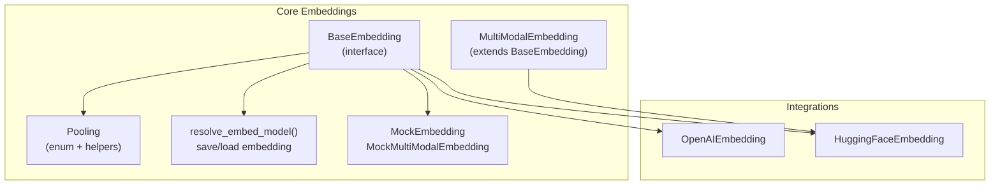
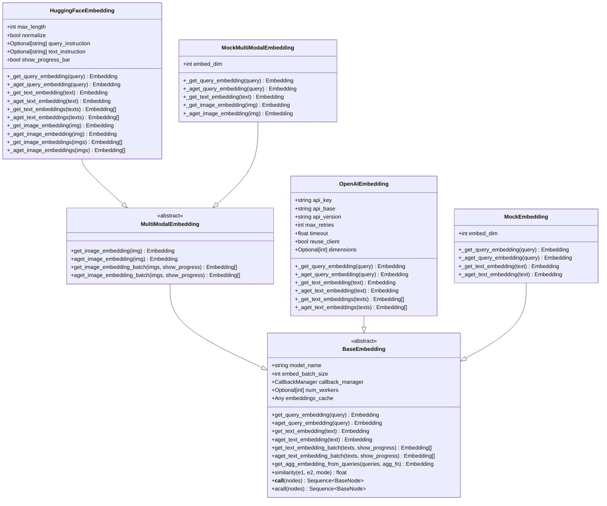
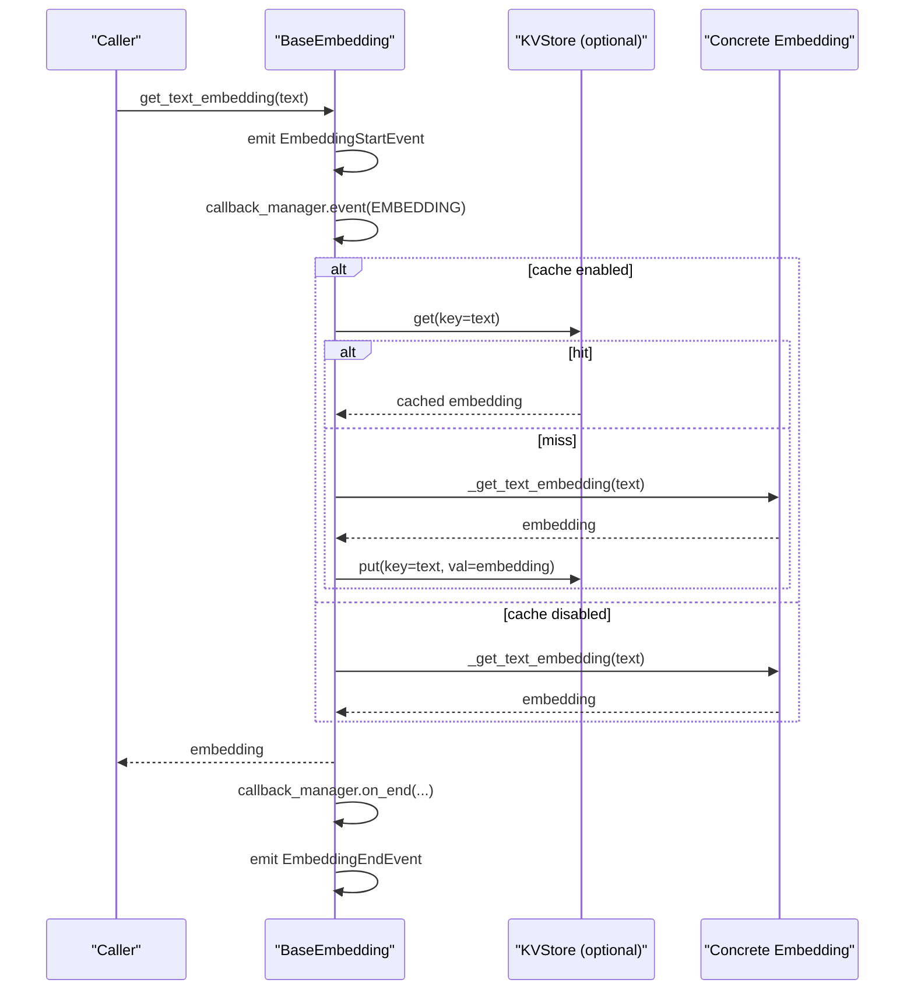
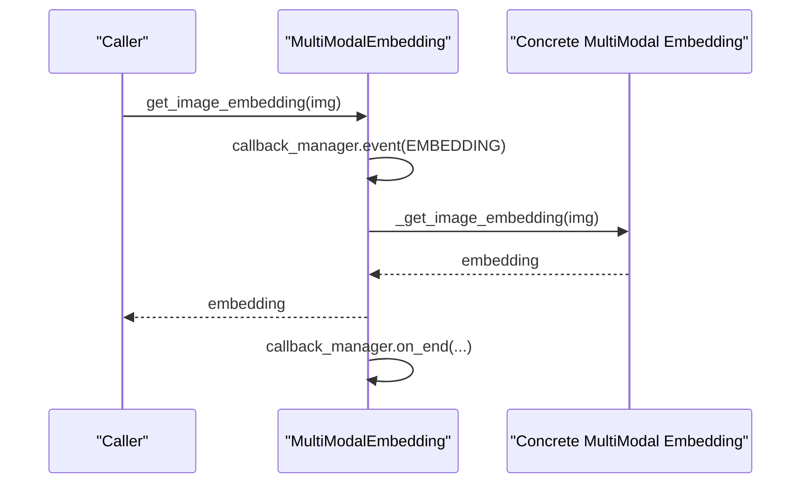
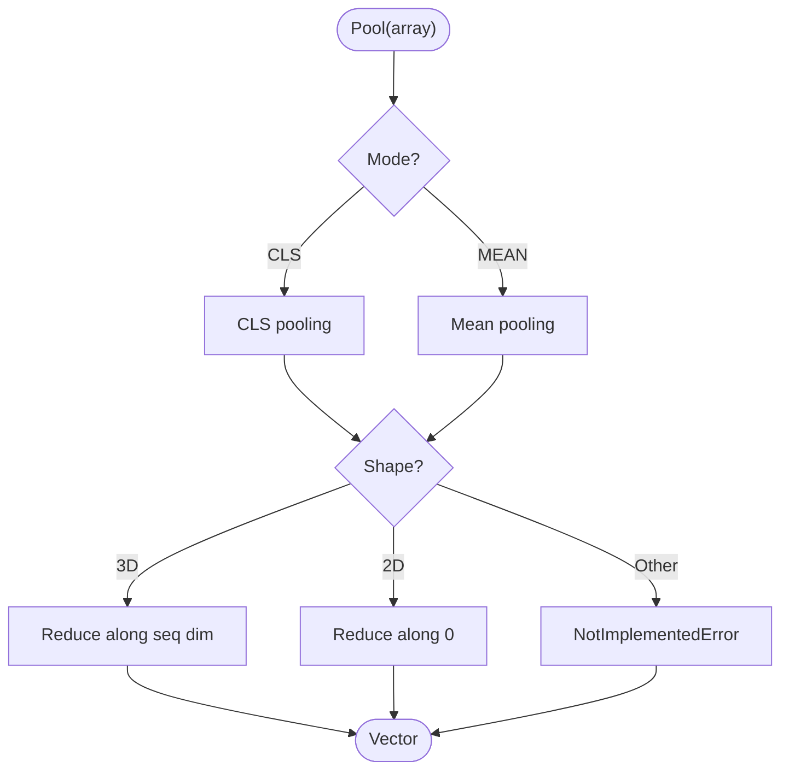
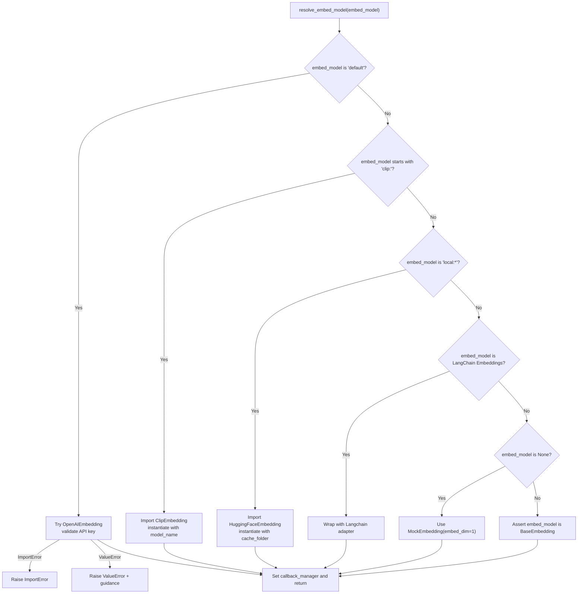
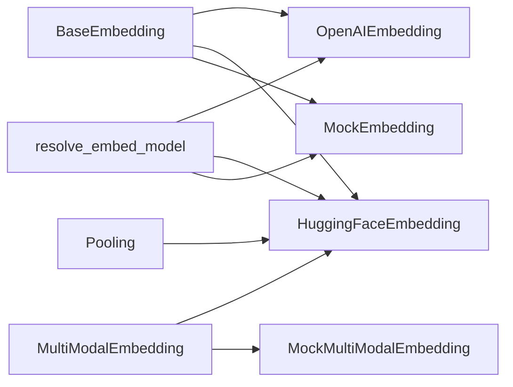

# Custom Embedding Development

<cite>
**Referenced Files in This Document**
- [base.py](file://llama-index-core/llama_index/core/base/embeddings/base.py)
- [multi_modal_base.py](file://llama-index-core/llama_index/core/embeddings/multi_modal_base.py)
- [pooling.py](file://llama-index-core/llama_index/core/embeddings/pooling.py)
- [utils.py](file://llama-index-core/llama_index/core/embeddings/utils.py)
- [mock_embed_model.py](file://llama-index-core/llama_index/core/embeddings/mock_embed_model.py)
- [__init__.py](file://llama-index-core/llama_index/core/embeddings/__init__.py)
- [base.py](file://llama-index-integrations/embeddings/llama-index-embeddings-openai/llama_index/embeddings/openai/base.py)
- [base.py](file://llama-index-integrations/embeddings/llama-index-embeddings-huggingface/llama_index/embeddings/huggingface/base.py)
</cite>

## Table of Contents
1. [Introduction](#introduction)
2. [Project Structure](#project-structure)
3. [Core Components](#core-components)
4. [Architecture Overview](#architecture-overview)
5. [Detailed Component Analysis](#detailed-component-analysis)
6. [Dependency Analysis](#dependency-analysis)
7. [Performance Considerations](#performance-considerations)
8. [Troubleshooting Guide](#troubleshooting-guide)
9. [Conclusion](#conclusion)
10. [Appendices](#appendices)

## Introduction
This document explains how to develop custom embedding implementations that integrate seamlessly with the LlamaIndex ecosystem. It covers the embedding interface abstraction, base classes, and implementation requirements. You will learn the embedding interface contract, method signatures, expected behaviors, and how to implement custom embeddings for text and images. It also details multi-modal support, pooling strategies, normalization techniques, testing, validation, integration with existing pipelines, packaging, documentation standards, contribution guidelines, troubleshooting, and production best practices.

## Project Structure
The embedding subsystem is organized around a core interface and shared utilities, with optional multi-modal extensions and concrete integrations:

- Core interface and utilities live under the core package.
- Multi-modal base extends the core interface for image embeddings.
- Pooling utilities provide standard pooling strategies.
- Utilities include model resolution helpers and mock implementations for testing.
- Integrations demonstrate how to implement real-world embeddings (e.g., OpenAI, HuggingFace).

**Diagram sources**
- [base.py](file://llama-index-core/llama_index/core/base/embeddings/base.py#L72-L619)
- [multi_modal_base.py](file://llama-index-core/llama_index/core/embeddings/multi_modal_base.py#L16-L187)
- [pooling.py](file://llama-index-core/llama_index/core/embeddings/pooling.py#L10-L49)
- [utils.py](file://llama-index-core/llama_index/core/embeddings/utils.py#L31-L141)
- [mock_embed_model.py](file://llama-index-core/llama_index/core/embeddings/mock_embed_model.py#L10-L84)
- [base.py](file://llama-index-integrations/embeddings/llama-index-embeddings-openai/llama_index/embeddings/openai/base.py#L214-L489)
- [base.py](file://llama-index-integrations/embeddings/llama-index-embeddings-huggingface/llama_index/embeddings/huggingface/base.py#L38-L360)

**Section sources**
- [__init__.py](file://llama-index-core/llama_index/core/embeddings/__init__.py#L1-L16)

## Core Components
This section outlines the embedding interface contract and the base classes you must implement or extend.

- BaseEmbedding defines the core embedding interface for text and query embeddings, including synchronous and asynchronous methods, batching, caching, similarity utilities, and instrumentation.
- MultiModalEmbedding extends BaseEmbedding to support image embeddings with similar patterns.
- Pooling provides standard pooling strategies (CLS, MEAN) compatible with NumPy arrays and PyTorch tensors.
- resolve_embed_model resolves a concrete embedding model from various inputs (strings, LangChain embeddings, defaults).
- MockEmbedding and MockMultiModalEmbedding provide deterministic, test-friendly embeddings.

Key responsibilities:
- Implement synchronous and asynchronous embedding methods for text and queries.
- Support batching via internal batching loops and optional cache-backed retrieval.
- Provide multi-modal support by extending MultiModalEmbedding and implementing image embedding methods.
- Respect configuration fields such as embed_batch_size, num_workers, and callback_manager.
- Emit instrumentation and callback events for observability.

**Section sources**
- [base.py](file://llama-index-core/llama_index/core/base/embeddings/base.py#L72-L619)
- [multi_modal_base.py](file://llama-index-core/llama_index/core/embeddings/multi_modal_base.py#L16-L187)
- [pooling.py](file://llama-index-core/llama_index/core/embeddings/pooling.py#L10-L49)
- [utils.py](file://llama-index-core/llama_index/core/embeddings/utils.py#L31-L141)
- [mock_embed_model.py](file://llama-index-core/llama_index/core/embeddings/mock_embed_model.py#L10-L84)

## Architecture Overview
The embedding architecture centers on BaseEmbedding, with MultiModalEmbedding adding image capabilities. Integrations plug in by subclassing these base classes and implementing the required abstract methods. Utilities assist in model resolution and persistence.

**Diagram sources**
- [base.py](file://llama-index-core/llama_index/core/base/embeddings/base.py#L72-L619)
- [multi_modal_base.py](file://llama-index-core/llama_index/core/embeddings/multi_modal_base.py#L16-L187)
- [base.py](file://llama-index-integrations/embeddings/llama-index-embeddings-openai/llama_index/embeddings/openai/base.py#L214-L489)
- [base.py](file://llama-index-integrations/embeddings/llama-index-embeddings-huggingface/llama_index/embeddings/huggingface/base.py#L38-L360)
- [mock_embed_model.py](file://llama-index-core/llama_index/core/embeddings/mock_embed_model.py#L10-L84)

## Detailed Component Analysis

### BaseEmbedding Interface Contract
BaseEmbedding defines the canonical embedding interface. Implementations must provide:
- Synchronous and asynchronous methods for query and text embeddings.
- Optional batch methods for improved throughput.
- Optional cache-backed retrieval for deduplication and performance.
- Instrumentation and callback hooks for observability.
- Aggregation helpers and similarity utilities.

Implementation requirements:
- Define abstract methods for query and text embeddings.
- Optionally override batch methods to support efficient batching.
- Optionally support caching via embeddings_cache (must be a KV store).
- Respect embed_batch_size and num_workers for async concurrency.
- Emit instrumentation and callback events around embedding operations.

**Diagram sources**
- [base.py](file://llama-index-core/llama_index/core/base/embeddings/base.py#L350-L443)

**Section sources**
- [base.py](file://llama-index-core/llama_index/core/base/embeddings/base.py#L72-L619)

### MultiModalEmbedding Extension
MultiModalEmbedding extends BaseEmbedding to support image embeddings. Implementations must provide:
- Synchronous and asynchronous image embedding methods.
- Optional batch methods for images.
- Consistent callback and instrumentation behavior.

**Diagram sources**
- [multi_modal_base.py](file://llama-index-core/llama_index/core/embeddings/multi_modal_base.py#L37-L67)

**Section sources**
- [multi_modal_base.py](file://llama-index-core/llama_index/core/embeddings/multi_modal_base.py#L16-L187)

### Pooling Strategies
Pooling provides standard strategies for converting token-level embeddings into fixed-size vectors:
- CLS: Take the first token’s hidden state.
- MEAN: Average token embeddings along the sequence axis.

These helpers accept both NumPy arrays and PyTorch tensors and raise errors for unsupported shapes.

**Diagram sources**
- [pooling.py](file://llama-index-core/llama_index/core/embeddings/pooling.py#L16-L48)

**Section sources**
- [pooling.py](file://llama-index-core/llama_index/core/embeddings/pooling.py#L10-L49)

### Model Resolution and Utilities
resolve_embed_model supports flexible model instantiation:
- "default" selects an OpenAI embedding when available; otherwise falls back to a mock embedding in testing contexts.
- "clip:<model>" selects a CLIP-based embedding.
- "local:<model>" selects a local HuggingFace embedding.
- LangChain Embeddings are bridged via a Langchain adapter.
- None disables embeddings and uses a minimal mock.

Utilities also include saving and loading embeddings to/from files.

**Diagram sources**
- [utils.py](file://llama-index-core/llama_index/core/embeddings/utils.py#L31-L141)

**Section sources**
- [utils.py](file://llama-index-core/llama_index/core/embeddings/utils.py#L31-L141)

### Practical Implementation Patterns
To implement a custom embedding:
- Choose BaseEmbedding for text-only or MultiModalEmbedding for text plus images.
- Implement the required abstract methods (_get_*_embedding and optionally *_embeddings for batching).
- Configure embed_batch_size, num_workers, and callback_manager appropriately.
- Integrate caching via embeddings_cache if supported by your backend.
- Emit instrumentation and callbacks consistently with the base class pattern.
- Add pooling and normalization where applicable (e.g., for transformer outputs).

Examples of concrete implementations:
- OpenAIEmbedding demonstrates HTTP client reuse, retry decorators, and batch limits.
- HuggingFaceEmbedding demonstrates SentenceTransformer integration, optional multi-processing, and image embedding support.

**Section sources**
- [base.py](file://llama-index-integrations/embeddings/llama-index-embeddings-openai/llama_index/embeddings/openai/base.py#L214-L489)
- [base.py](file://llama-index-integrations/embeddings/llama-index-embeddings-huggingface/llama_index/embeddings/huggingface/base.py#L38-L360)

### Handling Different Input Types
- Text: Standard string inputs for query and document embeddings.
- Images: ImageType inputs for image embeddings; HuggingFaceEmbedding supports file paths and binary streams.
- Instructions: Some models prepend instructions to improve retrieval quality; see query_instruction and text_instruction fields in HuggingFaceEmbedding.

Normalization:
- Enable normalize in HuggingFaceEmbedding to L2-normalize vectors.
- Use Pooling strategies to reduce sequences to fixed-size vectors.

Batching:
- Use get_text_embedding_batch and get_image_embedding_batch to process multiple inputs efficiently.
- Leverage embed_batch_size and num_workers for concurrency.

**Section sources**
- [base.py](file://llama-index-integrations/embeddings/llama-index-embeddings-huggingface/llama_index/embeddings/huggingface/base.py#L102-L122)
- [multi_modal_base.py](file://llama-index-core/llama_index/core/embeddings/multi_modal_base.py#L95-L129)

### Integration with Existing Pipelines
- Use resolve_embed_model to configure embeddings across the system.
- Leverage Settings.callback_manager for unified observability.
- Integrate embeddings into node processing via __call__ and acall to attach embeddings to nodes.

**Section sources**
- [utils.py](file://llama-index-core/llama_index/core/embeddings/utils.py#L31-L141)
- [base.py](file://llama-index-core/llama_index/core/base/embeddings/base.py#L596-L619)

## Dependency Analysis
Embedding components depend on:
- Core base classes for interface contracts.
- Optional integrations for external providers.
- Utilities for model resolution and persistence.
- Instrumentation and callback systems for observability.

**Diagram sources**
- [base.py](file://llama-index-core/llama_index/core/base/embeddings/base.py#L72-L619)
- [multi_modal_base.py](file://llama-index-core/llama_index/core/embeddings/multi_modal_base.py#L16-L187)
- [pooling.py](file://llama-index-core/llama_index/core/embeddings/pooling.py#L10-L49)
- [utils.py](file://llama-index-core/llama_index/core/embeddings/utils.py#L31-L141)
- [mock_embed_model.py](file://llama-index-core/llama_index/core/embeddings/mock_embed_model.py#L10-L84)
- [base.py](file://llama-index-integrations/embeddings/llama-index-embeddings-openai/llama_index/embeddings/openai/base.py#L214-L489)
- [base.py](file://llama-index-integrations/embeddings/llama-index-embeddings-huggingface/llama_index/embeddings/huggingface/base.py#L38-L360)

**Section sources**
- [__init__.py](file://llama-index-core/llama_index/core/embeddings/__init__.py#L1-L16)

## Performance Considerations
- Batch size: Tune embed_batch_size to balance throughput and memory usage.
- Concurrency: Use num_workers for async embedding batches to overlap I/O.
- Caching: Enable embeddings_cache to avoid recomputation for repeated inputs.
- Device placement: For local models, select optimal devices (CPU/GPU) to maximize throughput.
- Parallel processing: HuggingFaceEmbedding supports multi-process encoding for large-scale workloads.
- Retry and timeouts: Configure max_retries and timeout for robustness against transient failures.

[No sources needed since this section provides general guidance]

## Troubleshooting Guide
Common issues and resolutions:
- Missing provider packages: resolve_embed_model raises ImportErrors when required integration packages are missing. Install the appropriate llama-index-embeddings-* package.
- Invalid credentials/API keys: OpenAIEmbedding validates keys and raises ValueErrors with guidance; ensure proper configuration.
- Unsupported shapes in pooling: Pooling.cls_pooling and mean_pooling raise NotImplementedError for unexpected tensor shapes; ensure inputs match expected dimensions.
- Testing environments: resolve_embed_model returns a small MockEmbedding in testing contexts; verify embed_dim and behavior in unit tests.
- Progress bars and async: Some integrations rely on tqdm/tqdm_asyncio; install optional dependencies if progress reporting is needed.

**Section sources**
- [utils.py](file://llama-index-core/llama_index/core/embeddings/utils.py#L43-L91)
- [pooling.py](file://llama-index-core/llama_index/core/embeddings/pooling.py#L36-L40)
- [base.py](file://llama-index-integrations/embeddings/llama-index-embeddings-openai/llama_index/embeddings/openai/base.py#L340-L346)

## Conclusion
By adhering to the BaseEmbedding and MultiModalEmbedding contracts, you can build custom embeddings that integrate cleanly with LlamaIndex. Use batching, caching, instrumentation, and pooling to optimize performance and reliability. Follow the provided patterns from OpenAIEmbedding and HuggingFaceEmbedding to implement robust, production-ready solutions.

[No sources needed since this section summarizes without analyzing specific files]

## Appendices

### Packaging and Contribution Guidelines
- Package your custom embedding as a separate Python package and expose it via the embeddings namespace.
- Provide clear installation instructions and dependency declarations.
- Include comprehensive tests using MockEmbedding for deterministic behavior.
- Document configuration options, environment variables, and performance tuning tips.
- Follow the existing code style and include instrumentation and callback usage consistent with the base classes.

[No sources needed since this section provides general guidance]