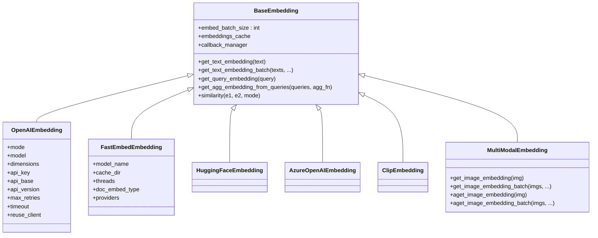

# Embedding Services

<cite>
**Referenced Files in This Document**
- [base.py](file://llama-index-core/llama_index/core/base/embeddings/base.py)
- [multi_modal_base.py](file://llama-index-core/llama_index/core/embeddings/multi_modal_base.py)
- [utils.py](file://llama-index-core/llama_index/core/embeddings/utils.py)
- [loading.py](file://llama-index-core/llama_index/core/embeddings/loading.py)
- [openai/base.py](file://llama-index-integrations/embeddings/llama-index-embeddings-openai/llama_index/embeddings/openai/base.py)
- [openai/__init__.py](file://llama-index-integrations/embeddings/llama-index-embeddings-openai/llama_index/embeddings/openai/__init__.py)
- [fastembed/base.py](file://llama-index-integrations/embeddings/llama-index-embeddings-fastembed/llama_index/embeddings/fastembed/base.py)
- [fastembed/__init__.py](file://llama-index-integrations/embeddings/llama-index-embeddings-fastembed/llama_index/embeddings/fastembed/__init__.py)
- [huggingface/__init__.py](file://llama-index-integrations/embeddings/llama-index-embeddings-huggingface/llama_index/embeddings/huggingface/__init__.py)
- [azure_openai/__init__.py](file://llama-index-integrations/embeddings/llama-index-embeddings-azure-openai/llama_index/embeddings/azure_openai/__init__.py)
- [clip/__init__.py](file://llama-index-integrations/embeddings/llama-index-embeddings-clip/llama_index/embeddings/clip/__init__.py)
- [sparse_fastembed/__init__.py](file://llama-index-integrations/sparse_embeddings/llama-index-sparse-embeddings-fastembed/llama_index/sparse_embeddings/fastembed/__init__.py)
</cite>

## Table of Contents
1. [Introduction](#introduction)
2. [Project Structure](#project-structure)
3. [Core Components](#core-components)
4. [Architecture Overview](#architecture-overview)
5. [Detailed Component Analysis](#detailed-component-analysis)
6. [Dependency Analysis](#dependency-analysis)
7. [Performance Considerations](#performance-considerations)
8. [Troubleshooting Guide](#troubleshooting-guide)
9. [Conclusion](#conclusion)
10. [Appendices](#appendices)

## Introduction
This document explains how embedding services are integrated in LlamaIndex. It covers the unified embedding interface that abstracts provider differences, the breadth of supported providers (including OpenAI, Hugging Face, Google Vertex AI, Azure OpenAI, and specialized services like FastEmbed), and how to configure and optimize embeddings for different use cases. It also details provider-specific configuration (model selection, dimensionality, normalization, batch processing), multi-modal and sparse embedding support, and guidance for migrating between providers.

## Project Structure
LlamaIndex organizes embedding functionality across:
- Core abstractions and utilities under the core package
- Provider-specific implementations in the integrations package
- Sparse embedding support in a dedicated sparse_embeddings module

**Diagram sources**
- [base.py](file://llama-index-core/llama_index/core/base/embeddings/base.py#L72-L619)
- [multi_modal_base.py](file://llama-index-core/llama_index/core/embeddings/multi_modal_base.py#L16-L187)
- [utils.py](file://llama-index-core/llama_index/core/embeddings/utils.py#L31-L141)
- [loading.py](file://llama-index-core/llama_index/core/embeddings/loading.py#L6-L50)
- [openai/base.py](file://llama-index-integrations/embeddings/llama-index-embeddings-openai/llama_index/embeddings/openai/base.py#L214-L489)
- [fastembed/base.py](file://llama-index-integrations/embeddings/llama-index-embeddings-fastembed/llama_index/embeddings/fastembed/base.py#L12-L126)
- [huggingface/__init__.py](file://llama-index-integrations/embeddings/llama-index-embeddings-huggingface/llama_index/embeddings/huggingface/__init__.py#L1-L12)
- [azure_openai/__init__.py](file://llama-index-integrations/embeddings/llama-index-embeddings-azure-openai/llama_index/embeddings/azure_openai/__init__.py#L1-L8)
- [clip/__init__.py](file://llama-index-integrations/embeddings/llama-index-embeddings-clip/llama_index/embeddings/clip/__init__.py#L1-L4)
- [sparse_fastembed/__init__.py](file://llama-index-integrations/sparse_embeddings/llama-index-sparse-embeddings-fastembed/llama_index/sparse_embeddings/fastembed/__init__.py#L1-L4)

**Section sources**
- [base.py](file://llama-index-core/llama_index/core/base/embeddings/base.py#L72-L619)
- [multi_modal_base.py](file://llama-index-core/llama_index/core/embeddings/multi_modal_base.py#L16-L187)
- [utils.py](file://llama-index-core/llama_index/core/embeddings/utils.py#L31-L141)
- [loading.py](file://llama-index-core/llama_index/core/embeddings/loading.py#L6-L50)

## Core Components
- Unified embedding interface: BaseEmbedding defines synchronous and asynchronous methods for text and query embeddings, batching, caching, similarity computation, and instrumentation. It standardizes the contract across providers.
- Multi-modal embeddings: MultiModalEmbedding extends BaseEmbedding to handle image inputs alongside text, with batched image embedding APIs.
- Provider resolution and loading: resolve_embed_model selects defaults, parses string specs (e.g., local, clip), bridges LangChain embeddings, and wires callback managers. load_embed_model maps class names to provider classes.

Key responsibilities:
- BaseEmbedding: embedding lifecycle, batching, caching, async orchestration, similarity modes, and node transformation.
- MultiModalEmbedding: image embedding variants and batched image processing.
- Utils: default selection, string-based model spec parsing, LangChain bridging, and persistence helpers.
- Loading: dynamic provider registration and deserialization.

**Section sources**
- [base.py](file://llama-index-core/llama_index/core/base/embeddings/base.py#L72-L619)
- [multi_modal_base.py](file://llama-index-core/llama_index/core/embeddings/multi_modal_base.py#L16-L187)
- [utils.py](file://llama-index-core/llama_index/core/embeddings/utils.py#L31-L141)
- [loading.py](file://llama-index-core/llama_index/core/embeddings/loading.py#L6-L50)

## Architecture Overview
The embedding subsystem follows a layered design:
- Abstraction layer: BaseEmbedding and MultiModalEmbedding define the interface.
- Provider layer: Concrete implementations encapsulate provider-specific logic (OpenAI, FastEmbed, HuggingFace, Azure OpenAI, CLIP).
- Utilities layer: resolve_embed_model and load_embed_model unify configuration and instantiation.
- Instrumentation and caching: BaseEmbedding integrates callbacks, spans, and optional KV caching.

**Diagram sources**
- [base.py](file://llama-index-core/llama_index/core/base/embeddings/base.py#L72-L619)
- [multi_modal_base.py](file://llama-index-core/llama_index/core/embeddings/multi_modal_base.py#L16-L187)
- [openai/base.py](file://llama-index-integrations/embeddings/llama-index-embeddings-openai/llama_index/embeddings/openai/base.py#L214-L489)
- [fastembed/base.py](file://llama-index-integrations/embeddings/llama-index-embeddings-fastembed/llama_index/embeddings/fastembed/base.py#L12-L126)
- [huggingface/__init__.py](file://llama-index-integrations/embeddings/llama-index-embeddings-huggingface/llama_index/embeddings/huggingface/__init__.py#L1-L12)
- [azure_openai/__init__.py](file://llama-index-integrations/embeddings/llama-index-embeddings-azure-openai/llama_index/embeddings/azure_openai/__init__.py#L1-L8)
- [clip/__init__.py](file://llama-index-integrations/embeddings/llama-index-embeddings-clip/llama_index/embeddings/clip/__init__.py#L1-L4)

## Detailed Component Analysis

### Unified Embedding Interface (BaseEmbedding)
- Methods:
  - Text/query embedding: synchronous and asynchronous variants
  - Batch embedding: with progress reporting and configurable batch size
  - Aggregation: mean aggregation across multiple queries
  - Similarity: cosine, dot product, Euclidean
  - Caching: optional KV-backed cache for embeddings
  - Instrumentation: spans and callback events
- Fields:
  - model_name, embed_batch_size, callback_manager, num_workers, embeddings_cache
- Behavior:
  - Honors embed_batch_size and caches when configured
  - Emits instrumentation and callback events for tracing
  - Supports node transformation via __call__/acall

**Diagram sources**
- [base.py](file://llama-index-core/llama_index/core/base/embeddings/base.py#L131-L179)
- [base.py](file://llama-index-core/llama_index/core/base/embeddings/base.py#L351-L399)
- [base.py](file://llama-index-core/llama_index/core/base/embeddings/base.py#L446-L494)

**Section sources**
- [base.py](file://llama-index-core/llama_index/core/base/embeddings/base.py#L72-L619)

### Multi-Modal Embeddings (MultiModalEmbedding)
- Extends BaseEmbedding to support images
- Provides synchronous and asynchronous image embedding methods
- Implements batched image embedding with progress and batching
- Integrates with callback manager and instrumentation

**Diagram sources**
- [multi_modal_base.py](file://llama-index-core/llama_index/core/embeddings/multi_modal_base.py#L95-L129)
- [multi_modal_base.py](file://llama-index-core/llama_index/core/embeddings/multi_modal_base.py#L131-L187)

**Section sources**
- [multi_modal_base.py](file://llama-index-core/llama_index/core/embeddings/multi_modal_base.py#L16-L187)

### Provider Resolution and Loading
- resolve_embed_model:
  - default: attempts OpenAI if available; otherwise falls back to a mock embedding
  - clip: instantiates CLIP image embeddings
  - local: instantiates local HuggingFace embeddings with a cache folder
  - LangChain bridge: wraps LangChain Embeddings
  - None: returns a minimal mock embedding
- load_embed_model:
  - Registers recognized providers dynamically
  - Deserializes embeddings from dict using class_name

**Diagram sources**
- [utils.py](file://llama-index-core/llama_index/core/embeddings/utils.py#L31-L141)
- [loading.py](file://llama-index-core/llama_index/core/embeddings/loading.py#L39-L50)

**Section sources**
- [utils.py](file://llama-index-core/llama_index/core/embeddings/utils.py#L31-L141)
- [loading.py](file://llama-index-core/llama_index/core/embeddings/loading.py#L6-L50)

### OpenAI Embeddings
- Capabilities:
  - Modes: similarity and text search
  - Models: legacy davinci/curie/babbage/ada and modern text-embedding family
  - Dimensions: configurable for v3 models
  - Retry and timeout controls
  - Reuse client option for stability/scalability
- Configuration highlights:
  - mode, model, embed_batch_size, dimensions, additional_kwargs
  - api_key, api_base, api_version
  - max_retries, timeout, reuse_client, default_headers
- Batch limits:
  - Enforced at 2048 per batch for batch operations

**Diagram sources**
- [openai/base.py](file://llama-index-integrations/embeddings/llama-index-embeddings-openai/llama_index/embeddings/openai/base.py#L214-L489)
- [openai/base.py](file://llama-index-integrations/embeddings/llama-index-embeddings-openai/llama_index/embeddings/openai/base.py#L115-L199)

**Section sources**
- [openai/base.py](file://llama-index-integrations/embeddings/llama-index-embeddings-openai/llama_index/embeddings/openai/base.py#L214-L489)

### FastEmbed Embeddings
- Capabilities:
  - Local, fast, lightweight embeddings via ONNX
  - Supports passage vs default embedding types
  - Threads, cache_dir, providers configuration
- Configuration highlights:
  - model_name, cache_dir, threads, doc_embed_type, providers
- Batch and async:
  - Uses to_thread for async compatibility

**Diagram sources**
- [fastembed/base.py](file://llama-index-integrations/embeddings/llama-index-embeddings-fastembed/llama_index/embeddings/fastembed/base.py#L12-L126)

**Section sources**
- [fastembed/base.py](file://llama-index-integrations/embeddings/llama-index-embeddings-fastembed/llama_index/embeddings/fastembed/base.py#L12-L126)

### Hugging Face Embeddings
- Capabilities:
  - Local and inference API variants
  - String-based model specification for local models
- Integration:
  - Exposed via huggingface/__init__.py exports

**Section sources**
- [huggingface/__init__.py](file://llama-index-integrations/embeddings/llama-index-embeddings-huggingface/llama_index/embeddings/huggingface/__init__.py#L1-L12)

### Azure OpenAI Embeddings
- Integration:
  - Exposed via azure_openai/__init__.py exports

**Section sources**
- [azure_openai/__init__.py](file://llama-index-integrations/embeddings/llama-index-embeddings-azure-openai/llama_index/embeddings/azure_openai/__init__.py#L1-L8)

### CLIP (Image) Embeddings
- Integration:
  - Exposed via clip/__init__.py exports

**Section sources**
- [clip/__init__.py](file://llama-index-integrations/embeddings/llama-index-embeddings-clip/llama_index/embeddings/clip/__init__.py#L1-L4)

### Sparse Embeddings (FastEmbed)
- Integration:
  - Exposed via sparse_fastembed/__init__.py exports

**Section sources**
- [sparse_fastembed/__init__.py](file://llama-index-integrations/sparse_embeddings/llama-index-sparse-embeddings-fastembed/llama_index/sparse_embeddings/fastembed/__init__.py#L1-L4)

## Dependency Analysis
- Core depends on provider packages at runtime:
  - OpenAI: resolved by utils and loading
  - FastEmbed: resolved by utils and instantiated locally
  - HuggingFace: resolved by utils for local models
  - Azure OpenAI: resolved by loading
  - CLIP: resolved by utils for image modalities
- MultiModalEmbedding depends on image types and progress utilities
- BaseEmbedding integrates callbacks, spans, and optional KV cache

**Diagram sources**
- [utils.py](file://llama-index-core/llama_index/core/embeddings/utils.py#L31-L141)
- [loading.py](file://llama-index-core/llama_index/core/embeddings/loading.py#L6-L50)
- [base.py](file://llama-index-core/llama_index/core/base/embeddings/base.py#L72-L619)
- [multi_modal_base.py](file://llama-index-core/llama_index/core/embeddings/multi_modal_base.py#L16-L187)
- [openai/base.py](file://llama-index-integrations/embeddings/llama-index-embeddings-openai/llama_index/embeddings/openai/base.py#L214-L489)
- [fastembed/base.py](file://llama-index-integrations/embeddings/llama-index-embeddings-fastembed/llama_index/embeddings/fastembed/base.py#L12-L126)
- [huggingface/__init__.py](file://llama-index-integrations/embeddings/llama-index-embeddings-huggingface/llama_index/embeddings/huggingface/__init__.py#L1-L12)
- [azure_openai/__init__.py](file://llama-index-integrations/embeddings/llama-index-embeddings-azure-openai/llama_index/embeddings/azure_openai/__init__.py#L1-L8)
- [clip/__init__.py](file://llama-index-integrations/embeddings/llama-index-embeddings-clip/llama_index/embeddings/clip/__init__.py#L1-L4)

**Section sources**
- [utils.py](file://llama-index-core/llama_index/core/embeddings/utils.py#L31-L141)
- [loading.py](file://llama-index-core/llama_index/core/embeddings/loading.py#L6-L50)
- [base.py](file://llama-index-core/llama_index/core/base/embeddings/base.py#L72-L619)

## Performance Considerations
- Batch size tuning:
  - Adjust embed_batch_size to balance throughput and latency; provider-specific constraints apply (e.g., OpenAI enforces a maximum batch size).
- Concurrency:
  - Use num_workers for async orchestration when supported by the provider implementation.
- Caching:
  - Enable embeddings_cache to avoid recomputation for repeated texts/queries.
- Client reuse:
  - For cloud providers, reuse clients judiciously; disabling reuse can improve stability under heavy async loads.
- Dimensionality:
  - For providers that support it (e.g., OpenAI v3), set dimensions to reduce vector size and storage costs.
- Local inference:
  - FastEmbed and local HuggingFace models reduce network overhead and latency for controlled environments.

[No sources needed since this section provides general guidance]

## Troubleshooting Guide
- Missing provider package:
  - resolve_embed_model raises import errors when required packages are not installed (e.g., OpenAI, FastEmbed, HuggingFace, LangChain).
- Invalid configuration:
  - OpenAI validation ensures API keys are present; missing keys lead to explicit errors with guidance.
- Unsupported model combinations:
  - OpenAI mode/model combinations are validated; invalid pairs raise errors.
- Batch size violations:
  - OpenAI enforces a maximum batch size; exceeding it triggers assertion errors.

**Section sources**
- [utils.py](file://llama-index-core/llama_index/core/embeddings/utils.py#L65-L77)
- [openai/base.py](file://llama-index-integrations/embeddings/llama-index-embeddings-openai/llama_index/embeddings/openai/base.py#L168-L199)

## Conclusion
LlamaIndex’s embedding system provides a robust, unified interface that abstracts provider differences while enabling high-performance, configurable embeddings across a wide variety of providers. With standardized batching, caching, instrumentation, and multi-modal/image support, users can select the optimal provider for their use case, tune performance and cost, and migrate between providers with minimal code changes.

[No sources needed since this section summarizes without analyzing specific files]

## Appendices

### Practical Configuration Examples (by reference)
- Configure default embeddings:
  - Use the default resolver path; it attempts OpenAI and falls back to a mock if unavailable.
  - Reference: [utils.py](file://llama-index-core/llama_index/core/embeddings/utils.py#L43-L77)
- Configure CLIP image embeddings:
  - Use a string prefix to select CLIP; optionally specify model name.
  - Reference: [utils.py](file://llama-index-core/llama_index/core/embeddings/utils.py#L79-L91)
- Configure local Hugging Face embeddings:
  - Use a string prefix indicating a local model; cache is placed under a cache directory.
  - Reference: [utils.py](file://llama-index-core/llama_index/core/embeddings/utils.py#L93-L117)
- Configure OpenAI embeddings:
  - Set mode, model, dimensions, and credentials; adjust batch size and retries.
  - Reference: [openai/base.py](file://llama-index-integrations/embeddings/llama-index-embeddings-openai/llama_index/embeddings/openai/base.py#L214-L331)
- Configure FastEmbed embeddings:
  - Choose model_name, cache_dir, threads, doc_embed_type, providers.
  - Reference: [fastembed/base.py](file://llama-index-integrations/embeddings/llama-index-embeddings-fastembed/llama_index/embeddings/fastembed/base.py#L64-L97)

### Choosing the Right Provider
- Cost-sensitive local workloads: FastEmbed or local HuggingFace
- Cloud-scale retrieval: OpenAI or Azure OpenAI with v3 models and configurable dimensions
- Multi-modal scenarios: CLIP for images; combine with text embeddings
- Sparse retrieval: FastEmbed sparse embeddings
- Migration strategy:
  - Keep the same BaseEmbedding interface
  - Swap provider instantiation and credentials
  - Retain batching, caching, and instrumentation configurations

[No sources needed since this section provides general guidance]