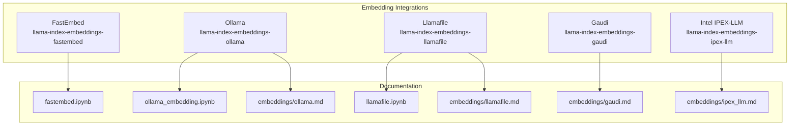
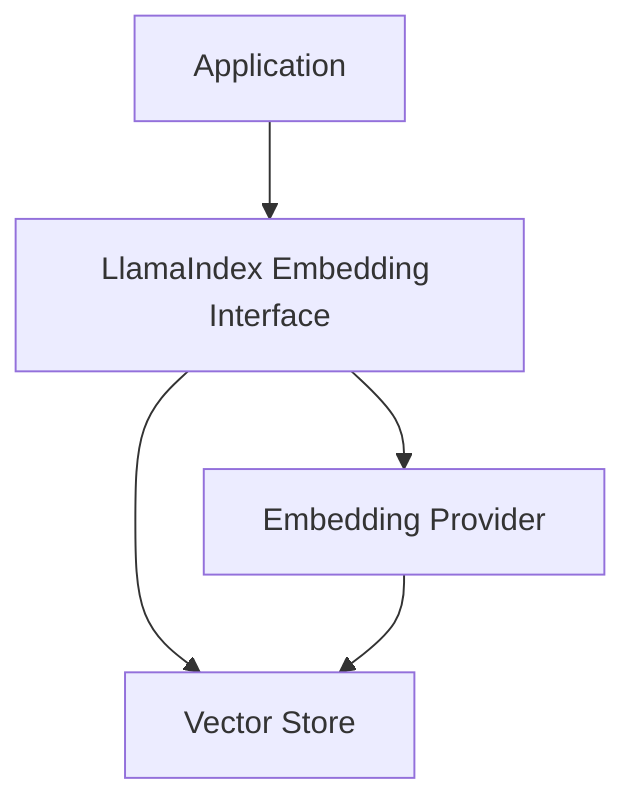
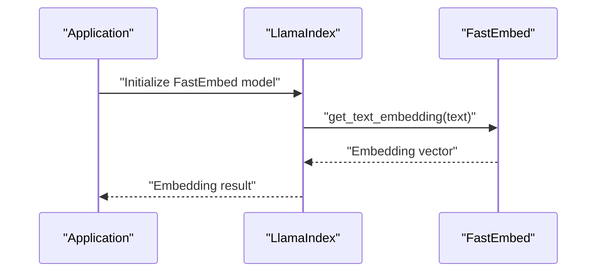
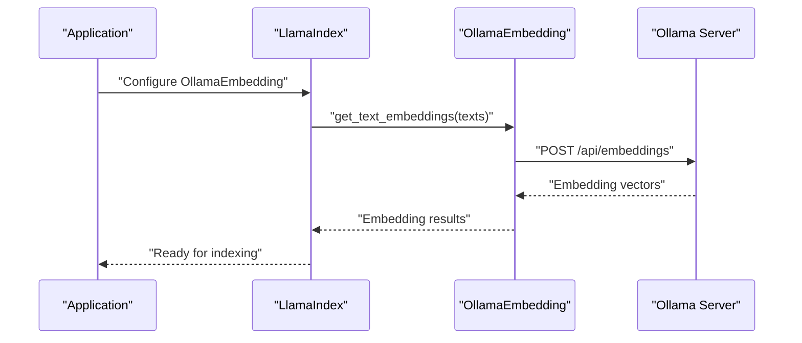
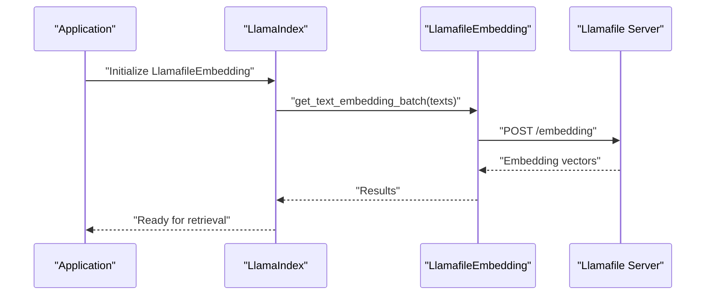
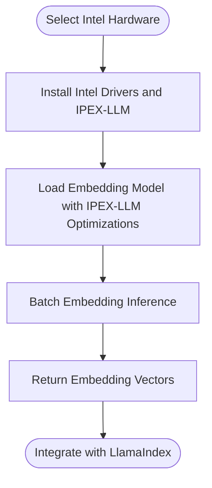
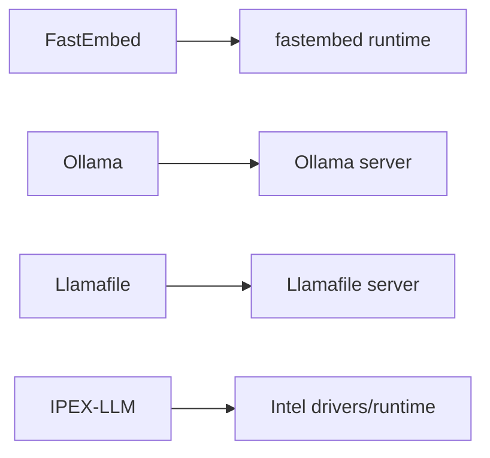

# Local and Edge Embeddings

<cite>
**Referenced Files in This Document**
- [README.md](file://examples/fastapi_rag_ollama/README.md)
- [ollama.md](file://docs/api_reference/api_reference/embeddings/ollama.md)
- [ollama_embedding.ipynb](file://docs/examples/embeddings/ollama_embedding.ipynb)
- [ollama.py](file://llama-index-integrations/embeddings/llama-index-embeddings-ollama/llama_index/embeddings/ollama/__init__.py)
- [ollama_test.py](file://llama-index-integrations/embeddings/llama-index-embeddings-ollama/tests/test_embeddings_ollama.py)
- [ollama_readme.md](file://llama-index-integrations/embeddings/llama-index-embeddings-ollama/README.md)
- [fastembed.ipynb](file://docs/examples/embeddings/fastembed.ipynb)
- [fastembed.py](file://llama-index-integrations/embeddings/llama-index-embeddings-fastembed/llama_index/embeddings/fastembed/__init__.py)
- [fastembed_test.py](file://llama-index-integrations/embeddings/llama-index-embeddings-fastembed/tests/test_embeddings_fastembed.py)
- [llamafile.md](file://docs/api_reference/api_reference/embeddings/llamafile.md)
- [llamafile.ipynb](file://docs/examples/embeddings/llamafile.ipynb)
- [llamafile.py](file://llama-index-integrations/embeddings/llama-index-embeddings-llamafile/llama_index/embeddings/llamafile/__init__.py)
- [llamafile_test.py](file://llama-index-integrations/embeddings/llama-index-embeddings-llamafile/tests/test_embeddings_llamafile.py)
- [gaudi.md](file://docs/api_reference/api_reference/embeddings/gaudi.md)
- [ipex_llm.md](file://docs/api_reference/api_reference/embeddings/ipex_llm.md)
- [ipex_llm.py](file://llama-index-integrations/embeddings/llama-index-embeddings-ipex-llm/llama_index/embeddings/ipex_llm/__init__.py)
- [ipex_llm_test.py](file://llama-index-integrations/embeddings/llama-index-embeddings-ipex-llm/tests/test_embeddings_ipex_llm.py)
</cite>

## Table of Contents
1. [Introduction](#introduction)
2. [Project Structure](#project-structure)
3. [Core Components](#core-components)
4. [Architecture Overview](#architecture-overview)
5. [Detailed Component Analysis](#detailed-component-analysis)
6. [Dependency Analysis](#dependency-analysis)
7. [Performance Considerations](#performance-considerations)
8. [Troubleshooting Guide](#troubleshooting-guide)
9. [Conclusion](#conclusion)
10. [Appendices](#appendices)

## Introduction
This document provides comprehensive guidance for deploying local and edge embedding solutions in LlamaIndex. It focuses on four primary approaches:
- FastEmbed: a fast and efficient native embedding provider suitable for CPU and edge devices
- Ollama: a local inference server that serves both LLMs and embedding models
- Llamafile: a single-file, portable inference server with an embedded embedding endpoint
- Intel Gaudi and Intel Extension for PyTorch (IPEX-LLM): hardware-accelerated and optimized embedding runtimes for Intel CPUs/GPUs

The guide covers installation prerequisites, hardware considerations, model loading strategies, memory management, batch processing, security and offline usage, and practical deployment examples. It also includes troubleshooting tips and selection guidance for different use cases.

## Project Structure
The repository organizes embedding integrations by provider under the integrations directory, with dedicated packages per embedding backend. Example notebooks and API reference documentation demonstrate usage and configuration.

**Diagram sources**
- [fastembed.ipynb](file://docs/examples/embeddings/fastembed.ipynb#L1-L130)
- [ollama_embedding.ipynb](file://docs/examples/embeddings/ollama_embedding.ipynb#L1-L176)
- [llamafile.ipynb](file://docs/examples/embeddings/llamafile.ipynb#L1-L106)
- [ollama.md](file://docs/api_reference/api_reference/embeddings/ollama.md)
- [llamafile.md](file://docs/api_reference/api_reference/embeddings/llamafile.md)
- [gaudi.md](file://docs/api_reference/api_reference/embeddings/gaudi.md)
- [ipex_llm.md](file://docs/api_reference/api_reference/embeddings/ipex_llm.md)

**Section sources**
- [fastembed.ipynb](file://docs/examples/embeddings/fastembed.ipynb#L1-L130)
- [ollama_embedding.ipynb](file://docs/examples/embeddings/ollama_embedding.ipynb#L1-L176)
- [llamafile.ipynb](file://docs/examples/embeddings/llamafile.ipynb#L1-L106)

## Core Components
- FastEmbed: Provides native, high-performance embedding generation with minimal overhead. Suitable for CPU-only environments and edge devices.
- Ollama: Serves both LLMs and embedding models locally via a simple HTTP interface. Supports batch operations and async APIs.
- Llamafile: Single-file inference server with an embedded HTTP API for embeddings and generation, ideal for portable, zero-dependency deployments.
- Intel Gaudi and IPEX-LLM: Optimized runtimes for Intel hardware enabling efficient inference on CPUs and GPUs.

Key capabilities across providers:
- Text and query embedding generation
- Batch embedding support
- Async APIs for improved throughput
- Configurable model selection and runtime parameters

**Section sources**
- [ollama_readme.md](file://llama-index-integrations/embeddings/llama-index-embeddings-ollama/README.md#L1-L242)
- [ollama.py](file://llama-index-integrations/embeddings/llama-index-embeddings-ollama/llama_index/embeddings/ollama/__init__.py)
- [ollama_test.py](file://llama-index-integrations/embeddings/llama-index-embeddings-ollama/tests/test_embeddings_ollama.py)
- [fastembed.py](file://llama-index-integrations/embeddings/llama-index-embeddings-fastembed/llama_index/embeddings/fastembed/__init__.py)
- [fastembed_test.py](file://llama-index-integrations/embeddings/llama-index-embeddings-fastembed/tests/test_embeddings_fastembed.py)
- [llamafile.py](file://llama-index-integrations/embeddings/llama-index-embeddings-llamafile/llama_index/embeddings/llamafile/__init__.py)
- [llamafile_test.py](file://llama-index-integrations/embeddings/llama-index-embeddings-llamafile/tests/test_embeddings_llamafile.py)
- [ipex_llm.py](file://llama-index-integrations/embeddings/llama-index-embeddings-ipex-llm/llama_index/embeddings/ipex_llm/__init__.py)
- [ipex_llm_test.py](file://llama-index-integrations/embeddings/llama-index-embeddings-ipex-llm/tests/test_embeddings_ipex_llm.py)

## Architecture Overview
The local embedding stack typically consists of:
- An embedding provider (FastEmbed, Ollama, Llamafile, or Intel IPEX-LLM)
- LlamaIndex’s embedding interface and vector store integration
- Optional async or batch processing layers

[No sources needed since this diagram shows conceptual workflow, not actual code structure]

## Detailed Component Analysis

### FastEmbed
FastEmbed offers a lightweight, native embedding solution ideal for CPU and edge deployments. It supports a curated set of models and provides efficient inference with minimal resource overhead.

- Installation and usage are demonstrated in the example notebook.
- The integration exposes standard embedding methods for single and batch operations.
- Model selection and performance characteristics are documented in the example notebook.

**Diagram sources**
- [fastembed.ipynb](file://docs/examples/embeddings/fastembed.ipynb#L70-L106)
- [fastembed.py](file://llama-index-integrations/embeddings/llama-index-embeddings-fastembed/llama_index/embeddings/fastembed/__init__.py)

Practical guidance:
- Choose a model aligned with your workload (size vs. quality trade-offs).
- Use batch operations for throughput improvements.
- Monitor memory usage on constrained devices.

**Section sources**
- [fastembed.ipynb](file://docs/examples/embeddings/fastembed.ipynb#L1-L130)
- [fastembed.py](file://llama-index-integrations/embeddings/llama-index-embeddings-fastembed/llama_index/embeddings/fastembed/__init__.py)
- [fastembed_test.py](file://llama-index-integrations/embeddings/llama-index-embeddings-fastembed/tests/test_embeddings_fastembed.py)

### Ollama
Ollama provides a local inference server for both LLMs and embeddings. It supports pulling models, running them locally, and exposing a simple HTTP API for embedding generation.

- Installation and basic usage are documented in the provider README.
- The example notebook demonstrates embedding generation via the Ollama provider.
- The integration supports batch and async operations and allows instruction tuning for retrieval quality.

**Diagram sources**
- [ollama_readme.md](file://llama-index-integrations/embeddings/llama-index-embeddings-ollama/README.md#L30-L91)
- [ollama_embedding.ipynb](file://docs/examples/embeddings/ollama_embedding.ipynb#L34-L106)
- [ollama.py](file://llama-index-integrations/embeddings/llama-index-embeddings-ollama/llama_index/embeddings/ollama/__init__.py)

Operational highlights:
- Configure base URL and model name; ensure the model is pulled and available.
- Use batch sizes appropriate for your hardware and latency targets.
- Leverage query/text instructions to improve retrieval quality.

**Section sources**
- [ollama_readme.md](file://llama-index-integrations/embeddings/llama-index-embeddings-ollama/README.md#L1-L242)
- [ollama_embedding.ipynb](file://docs/examples/embeddings/ollama_embedding.ipynb#L1-L176)
- [ollama.py](file://llama-index-integrations/embeddings/llama-index-embeddings-ollama/llama_index/embeddings/ollama/__init__.py)
- [ollama_test.py](file://llama-index-integrations/embeddings/llama-index-embeddings-ollama/tests/test_embeddings_ollama.py)

### Llamafile
Llamafile bundles model weights and a specialized inference server into a single executable, providing an embedded HTTP API for embeddings and generation.

- The example notebook demonstrates setting up and querying the Llamafile server.
- The integration supports batch and async embedding operations.

**Diagram sources**
- [llamafile.ipynb](file://docs/examples/embeddings/llamafile.ipynb#L64-L82)
- [llamafile.py](file://llama-index-integrations/embeddings/llama-index-embeddings-llamafile/llama_index/embeddings/llamafile/__init__.py)

Deployment tips:
- Ensure the server is started with the embedding endpoint enabled.
- Use appropriate model sizes for your device’s memory and compute budget.

**Section sources**
- [llamafile.ipynb](file://docs/examples/embeddings/llamafile.ipynb#L1-L106)
- [llamafile.py](file://llama-index-integrations/embeddings/llama-index-embeddings-llamafile/llama_index/embeddings/llamafile/__init__.py)
- [llamafile_test.py](file://llama-index-integrations/embeddings/llama-index-embeddings-llamafile/tests/test_embeddings_llamafile.py)

### Intel Gaudi and IPEX-LLM
Intel Gaudi and IPEX-LLM enable optimized inference on Intel hardware. The IPEX-LLM integration allows loading embedding models with Intel-specific optimizations for CPU and GPU.

- The integration README describes IPEX-LLM’s purpose and supported devices.
- API reference documentation provides configuration guidance.

**Diagram sources**
- [ipex_llm.md](file://docs/api_reference/api_reference/embeddings/ipex_llm.md)
- [ipex_llm.py](file://llama-index-integrations/embeddings/llama-index-embeddings-ipex-llm/llama_index/embeddings/ipex_llm/__init__.py)

Best practices:
- Verify driver and runtime compatibility for your Intel platform.
- Use appropriate model sizes and batch configurations for your hardware.

**Section sources**
- [ipex_llm.md](file://docs/api_reference/api_reference/embeddings/ipex_llm.md)
- [ipex_llm.py](file://llama-index-integrations/embeddings/llama-index-embeddings-ipex-llm/llama_index/embeddings/ipex_llm/__init__.py)
- [ipex_llm_test.py](file://llama-index-integrations/embeddings/llama-index-embeddings-ipex-llm/tests/test_embeddings_ipex_llm.py)

## Dependency Analysis
Provider-specific dependencies and integration points:
- FastEmbed: depends on the underlying fastembed runtime and model files
- Ollama: depends on a running Ollama server and a pulled embedding model
- Llamafile: depends on a running Llamafile server with embedding enabled
- Intel IPEX-LLM: depends on Intel drivers and IPEX-LLM runtime

**Diagram sources**
- [fastembed.ipynb](file://docs/examples/embeddings/fastembed.ipynb#L50-L86)
- [ollama_readme.md](file://llama-index-integrations/embeddings/llama-index-embeddings-ollama/README.md#L15-L28)
- [llamafile.ipynb](file://docs/examples/embeddings/llamafile.ipynb#L25-L38)
- [ipex_llm.md](file://docs/api_reference/api_reference/embeddings/ipex_llm.md)

**Section sources**
- [fastembed.ipynb](file://docs/examples/embeddings/fastembed.ipynb#L50-L86)
- [ollama_readme.md](file://llama-index-integrations/embeddings/llama-index-embeddings-ollama/README.md#L15-L28)
- [llamafile.ipynb](file://docs/examples/embeddings/llamafile.ipynb#L25-L38)
- [ipex_llm.md](file://docs/api_reference/api_reference/embeddings/ipex_llm.md)

## Performance Considerations
- Batch processing: Prefer batch APIs to reduce overhead and increase throughput.
- Model selection: Choose smaller models for constrained devices; larger models for higher accuracy.
- Memory management: Monitor memory usage during model loading and inference; adjust batch sizes accordingly.
- Async operations: Use async APIs to overlap I/O and computation.
- Hardware acceleration: Utilize Intel IPEX-LLM and Gaudi runtimes for optimized performance on compatible hardware.

[No sources needed since this section provides general guidance]

## Troubleshooting Guide
Common issues and resolutions:
- Ollama connectivity: Ensure the Ollama server is running and reachable at the configured base URL; confirm the model is pulled.
- Model availability: Verify the model exists and the name matches exactly.
- Llamafile server: Confirm the server is started with the embedding endpoint enabled and listening on the expected port.
- Intel runtime: Ensure drivers and IPEX-LLM runtime are installed and compatible with your hardware.

**Section sources**
- [ollama_readme.md](file://llama-index-integrations/embeddings/llama-index-embeddings-ollama/README.md#L221-L239)
- [llamafile.ipynb](file://docs/examples/embeddings/llamafile.ipynb#L25-L38)

## Conclusion
For local and edge embedding in LlamaIndex, choose the provider that best aligns with your hardware, performance, and deployment constraints:
- FastEmbed for CPU-centric, low-latency, and portable setups
- Ollama for flexible, model-driven local inference with strong ecosystem support
- Llamafile for zero-dependency, single-file deployments
- Intel IPEX-LLM and Gaudi for optimized performance on Intel platforms

Combine these providers with LlamaIndex’s embedding interface and vector stores to build secure, offline-capable retrieval systems tailored to your use case.

[No sources needed since this section summarizes without analyzing specific files]

## Appendices

### Practical Deployment Examples
- FastAPI + LlamaIndex RAG with Ollama: Demonstrates a production-style API using a local LLM and embeddings via Ollama.
- Ollama embeddings notebook: Shows embedding generation and batch operations.
- Llamafile embeddings notebook: Demonstrates embedding generation via the Llamafile server.

**Section sources**
- [README.md](file://examples/fastapi_rag_ollama/README.md#L1-L58)
- [ollama_embedding.ipynb](file://docs/examples/embeddings/ollama_embedding.ipynb#L1-L176)
- [llamafile.ipynb](file://docs/examples/embeddings/llamafile.ipynb#L1-L106)