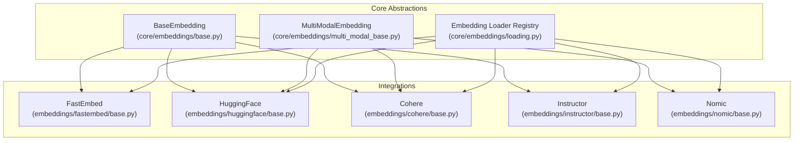
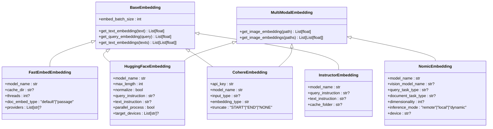
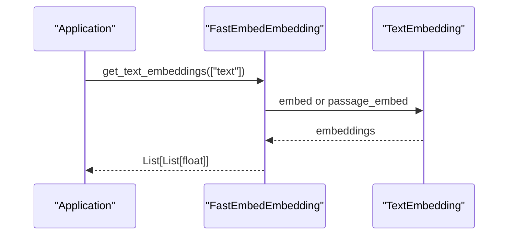
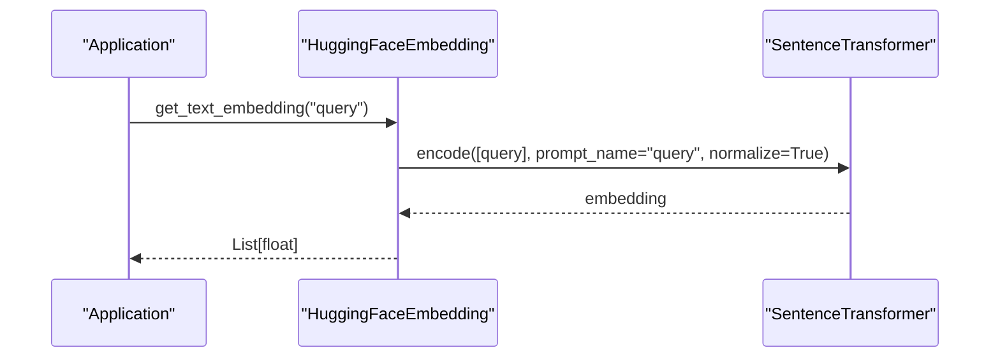
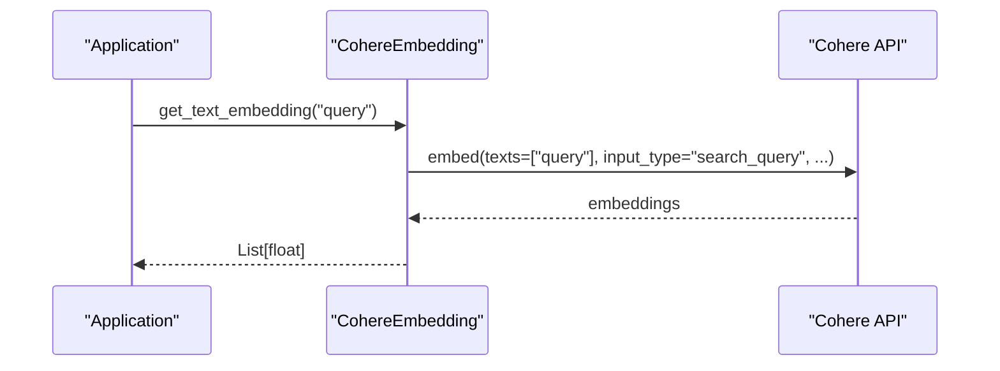
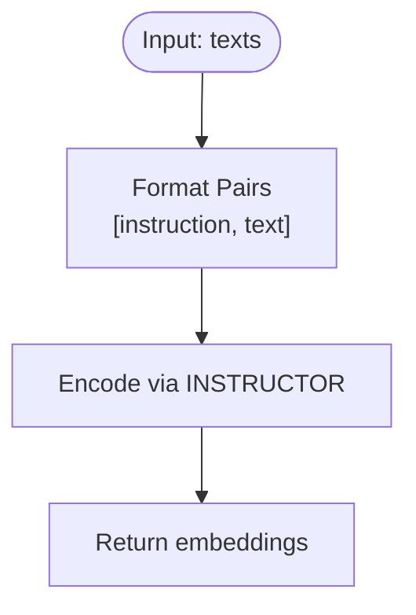
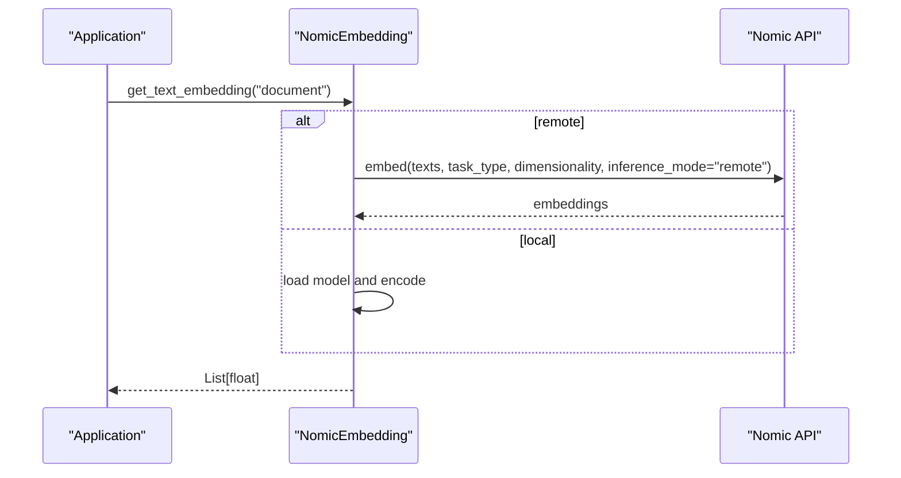
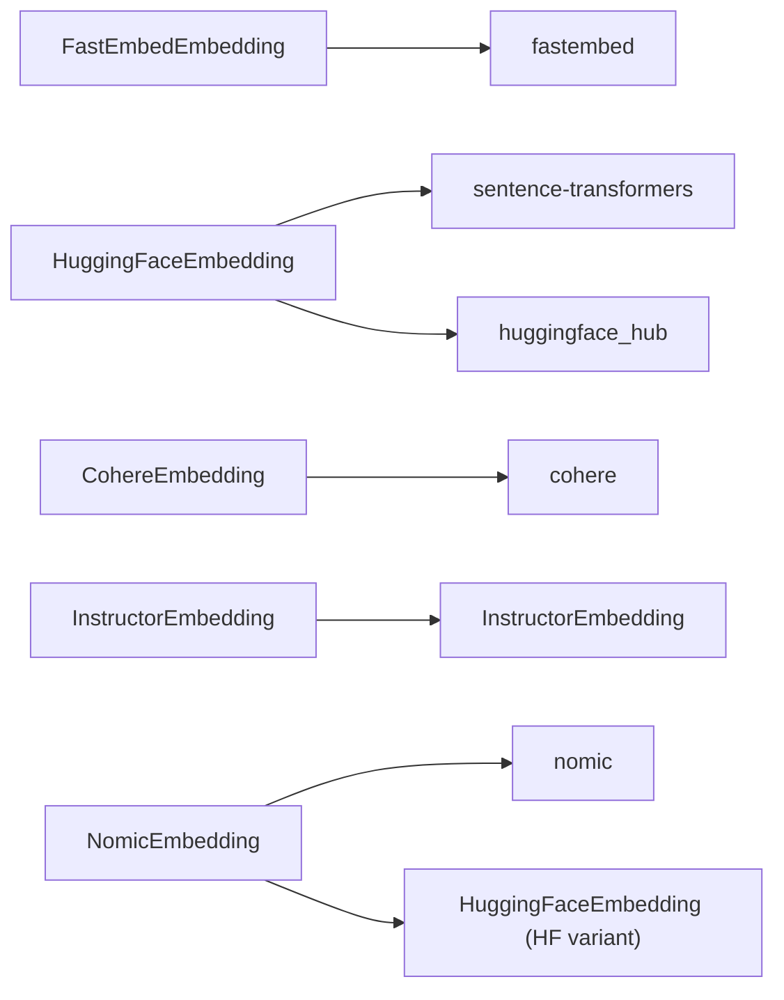

# Specialized Embedding Models

<cite>
**Referenced Files in This Document**
- [base.py](file://llama-index-core/llama_index/core/embeddings/base.py)
- [loading.py](file://llama-index-core/llama_index/core/embeddings/loading.py)
- [multi_modal_base.py](file://llama-index-core/llama_index/core/embeddings/multi_modal_base.py)
- [base.py](file://llama-index-integrations/embeddings/llama-index-embeddings-fastembed/llama_index/embeddings/fastembed/base.py)
- [base.py](file://llama-index-integrations/embeddings/llama-index-embeddings-instructor/llama_index/embeddings/instructor/base.py)
- [base.py](file://llama-index-integrations/embeddings/llama-index-embeddings-nomic/llama_index/embeddings/nomic/base.py)
- [base.py](file://llama-index-integrations/embeddings/llama-index-embeddings-huggingface/llama_index/embeddings/huggingface/base.py)
- [base.py](file://llama-index-integrations/embeddings/llama-index-embeddings-cohere/llama_index/embeddings/cohere/base.py)
- [fastembed.md](file://docs/api_reference/api_reference/embeddings/fastembed.md)
- [instructor.md](file://docs/api_reference/api_reference/embeddings/instructor.md)
- [nomic.md](file://docs/api_reference/api_reference/embeddings/nomic.md)
- [fastembed.ipynb](file://docs/examples/embeddings/fastembed.ipynb)
- [nomic.ipynb](file://docs/examples/embeddings/nomic.ipynb)
- [multi_modal_rag_nomic.ipynb](file://docs/examples/multi_modal/multi_modal_rag_nomic.ipynb)
- [test_embeddings_fastembed.py](file://llama-index-integrations/embeddings/llama-index-embeddings-fastembed/tests/test_embeddings_fastembed.py)
- [test_embeddings_nomic.py](file://llama-index-integrations/embeddings/llama-index-embeddings-nomic/tests/test_embeddings_nomic.py)
</cite>

## Table of Contents
1. [Introduction](#introduction)
2. [Project Structure](#project-structure)
3. [Core Components](#core-components)
4. [Architecture Overview](#architecture-overview)
5. [Detailed Component Analysis](#detailed-component-analysis)
6. [Dependency Analysis](#dependency-analysis)
7. [Performance Considerations](#performance-considerations)
8. [Troubleshooting Guide](#troubleshooting-guide)
9. [Conclusion](#conclusion)
10. [Appendices](#appendices)

## Introduction
This document explains specialized embedding models and frameworks integrated into LlamaIndex, focusing on FastEmbed, Sentence Transformers, BGE (Beijing University of Posts and Telecommunications), Instructor embeddings, and Nomic embeddings. It covers model architectures, training methodologies, domain specializations, configuration options, selection criteria, performance characteristics, and practical integration examples. Guidance is also provided for handling dense, sparse, and multi-modal embeddings, optimizing for use cases, compatibility, model sizes, inference speed comparisons, fine-tuning and adaptation strategies, and migrating between frameworks.

## Project Structure
LlamaIndex organizes embedding integrations under dedicated packages per provider, while core abstractions reside in the core module. The specialized embedding implementations are thin wrappers around external libraries or APIs, exposing a unified BaseEmbedding interface.

**Diagram sources**
- [base.py](file://llama-index-core/llama_index/core/embeddings/base.py)
- [multi_modal_base.py](file://llama-index-core/llama_index/core/embeddings/multi_modal_base.py)
- [loading.py](file://llama-index-core/llama_index/core/embeddings/loading.py)
- [base.py](file://llama-index-integrations/embeddings/llama-index-embeddings-fastembed/llama_index/embeddings/fastembed/base.py)
- [base.py](file://llama-index-integrations/embeddings/llama-index-embeddings-huggingface/llama_index/embeddings/huggingface/base.py)
- [base.py](file://llama-index-integrations/embeddings/llama-index-embeddings-cohere/llama_index/embeddings/cohere/base.py)
- [base.py](file://llama-index-integrations/embeddings/llama-index-embeddings-instructor/llama_index/embeddings/instructor/base.py)
- [base.py](file://llama-index-integrations/embeddings/llama-index-embeddings-nomic/llama_index/embeddings/nomic/base.py)

**Section sources**
- [base.py](file://llama-index-core/llama_index/core/embeddings/base.py)
- [multi_modal_base.py](file://llama-index-core/llama_index/core/embeddings/multi_modal_base.py)
- [loading.py](file://llama-index-core/llama_index/core/embeddings/loading.py)

## Core Components
- BaseEmbedding: Defines the minimal interface for all embeddings, including synchronous and asynchronous text and query embedding methods, plus batching controls.
- MultiModalEmbedding: Extends BaseEmbedding to support images and multi-modal inputs.
- Embedding Loader Registry: Provides a registry of recognized embedding classes and a loader to instantiate them from serialized configuration.

Key responsibilities:
- Unified interface across providers
- Async-friendly embedding generation
- Batch sizing and throughput tuning
- Multi-modal support for images and hybrid modalities

**Section sources**
- [base.py](file://llama-index-core/llama_index/core/embeddings/base.py)
- [multi_modal_base.py](file://llama-index-core/llama_index/core/embeddings/multi_modal_base.py)
- [loading.py](file://llama-index-core/llama_index/core/embeddings/loading.py)

## Architecture Overview
The embedding subsystem composes a provider-specific adapter over a shared interface. Providers encapsulate:
- Model selection and initialization
- Prompting and instruction strategies
- Batch processing and device selection
- Optional multi-modal capabilities

**Diagram sources**
- [base.py](file://llama-index-core/llama_index/core/embeddings/base.py)
- [multi_modal_base.py](file://llama-index-core/llama_index/core/embeddings/multi_modal_base.py)
- [base.py](file://llama-index-integrations/embeddings/llama-index-embeddings-fastembed/llama_index/embeddings/fastembed/base.py)
- [base.py](file://llama-index-integrations/embeddings/llama-index-embeddings-huggingface/llama_index/embeddings/huggingface/base.py)
- [base.py](file://llama-index-integrations/embeddings/llama-index-embeddings-cohere/llama_index/embeddings/cohere/base.py)
- [base.py](file://llama-index-integrations/embeddings/llama-index-embeddings-instructor/llama_index/embeddings/instructor/base.py)
- [base.py](file://llama-index-integrations/embeddings/llama-index-embeddings-nomic/llama_index/embeddings/nomic/base.py)

## Detailed Component Analysis

### FastEmbed
FastEmbed is a lightweight, fast library for ONNX-based embeddings. It supports passage and default embedding modes and integrates with ONNX Runtime providers.

Key configuration:
- model_name: Select the underlying model identifier
- cache_dir: Local cache directory for model artifacts
- threads: Threads per ONNX session
- doc_embed_type: "default" or "passage"
- providers: ONNX providers (e.g., CPU, CUDA)

Processing logic:
- Embedding generation uses either TextEmbedding.embed or TextEmbedding.passage_embed depending on mode
- Asynchronous calls are executed via thread pools

**Diagram sources**
- [base.py](file://llama-index-integrations/embeddings/llama-index-embeddings-fastembed/llama_index/embeddings/fastembed/base.py)

Practical notes:
- Install fastembed and optionally fastembed-gpu for acceleration
- Choose doc_embed_type based on whether you want passage-specific semantics
- Tune threads and providers for hardware acceleration

**Section sources**
- [base.py](file://llama-index-integrations/embeddings/llama-index-embeddings-fastembed/llama_index/embeddings/fastembed/base.py)
- [fastembed.md](file://docs/api_reference/api_reference/embeddings/fastembed.md)
- [fastembed.ipynb](file://docs/examples/embeddings/fastembed.ipynb)
- [test_embeddings_fastembed.py](file://llama-index-integrations/embeddings/llama-index-embeddings-fastembed/tests/test_embeddings_fastembed.py)

### HuggingFace (Sentence Transformers)
HuggingFace embeddings wrap SentenceTransformer, supporting local models, remote models, and multi-modal inputs. It includes robust retry logic and optional multi-processing.

Key configuration:
- model_name: Local path or Hugging Face model identifier
- max_length: Sequence length
- normalize: Normalize vectors
- query_instruction/text_instruction: Prompt templates for query/text
- parallel_process/target_devices: Multi-process encoding
- device/cache_folder/trust_remote_code: Device and caching controls

Processing logic:
- Uses SentenceTransformer.encode with prompt_name and normalization
- Supports images via image paths
- Retry with exponential backoff for robustness

**Diagram sources**
- [base.py](file://llama-index-integrations/embeddings/llama-index-embeddings-huggingface/llama_index/embeddings/huggingface/base.py)

Practical notes:
- Use prompts to specialize embeddings for retrieval tasks
- Enable parallel_process for large-scale batches
- Normalize embeddings when downstream metrics rely on unit vectors

**Section sources**
- [base.py](file://llama-index-integrations/embeddings/llama-index-embeddings-huggingface/llama_index/embeddings/huggingface/base.py)
- [instructor.md](file://docs/api_reference/api_reference/embeddings/instructor.md)

### Cohere
Cohere embeddings support multiple models and embedding types, with optional input types for v3/v4 models. They also support image embeddings for supported models.

Key configuration:
- api_key: Authentication
- model_name: One of the supported Cohere models
- input_type: search_query/search_document/classification/clustering (per model)
- embedding_type: float/int8/uint8/binary/ubinary (per model)
- truncate: START/END/NONE
- base_url/timeout/httpx clients: Endpoint and transport controls

Processing logic:
- Validates model, input_type, embedding_type, and batch size against constraints
- Converts images to base64 data URLs for supported models
- Embeds text and images via the Cohere client

**Diagram sources**
- [base.py](file://llama-index-integrations/embeddings/llama-index-embeddings-cohere/llama_index/embeddings/cohere/base.py)

Practical notes:
- Respect maximum batch size limits
- Choose embedding_type to balance precision and storage
- Use input_type to align with downstream ranking tasks

**Section sources**
- [base.py](file://llama-index-integrations/embeddings/llama-index-embeddings-cohere/llama_index/embeddings/cohere/base.py)
- [nomic.md](file://docs/api_reference/api_reference/embeddings/nomic.md)

### Instructor Embeddings
Instructor embeddings prepend explicit instructions to queries and texts, enabling strong task-specific semantics. The class manages instruction formatting and batch encoding.

Key configuration:
- model_name: Instructor model identifier
- query_instruction/text_instruction: Explicit instructions
- cache_folder/device: Model caching and device selection

Processing logic:
- Formats pairs as [instruction, text] and encodes via INSTRUCTOR
- Supports batch embedding for lists

**Diagram sources**
- [base.py](file://llama-index-integrations/embeddings/llama-index-embeddings-instructor/llama_index/embeddings/instructor/base.py)

Practical notes:
- Provide explicit instructions to improve retrieval quality for specialized domains
- Use batch encoding for throughput

**Section sources**
- [base.py](file://llama-index-integrations/embeddings/llama-index-embeddings-instructor/llama_index/embeddings/instructor/base.py)
- [instructor.md](file://docs/api_reference/api_reference/embeddings/instructor.md)

### Nomic Embeddings
Nomic offers both remote and local inference modes, with optional multi-modal capabilities. It includes a HuggingFace-backed variant for fine-grained control.

Key configuration:
- model_name: Text model identifier
- vision_model_name: Vision model for images
- query_task_type/document_task_type: Task-specific embedding modes
- dimensionality: Dimension reduction for Matryoshka-style embeddings
- inference_mode: remote/local/dynamic
- device: Local device for inference

Processing logic:
- Remote mode: Calls nomic.embed APIs
- Local mode: Loads models and performs inference on device
- Multi-modal: Supports text and image embeddings

**Diagram sources**
- [base.py](file://llama-index-integrations/embeddings/llama-index-embeddings-nomic/llama_index/embeddings/nomic/base.py)

Practical notes:
- Use dimensionality to reduce storage and improve recall for large corpora
- Prefer remote inference for ease of deployment; use local for latency-sensitive scenarios
- Combine with multi-modal capabilities for hybrid RAG

**Section sources**
- [base.py](file://llama-index-integrations/embeddings/llama-index-embeddings-nomic/llama_index/embeddings/nomic/base.py)
- [nomic.md](file://docs/api_reference/api_reference/embeddings/nomic.md)
- [nomic.ipynb](file://docs/examples/embeddings/nomic.ipynb)
- [multi_modal_rag_nomic.ipynb](file://docs/examples/multi_modal/multi_modal_rag_nomic.ipynb)
- [test_embeddings_nomic.py](file://llama-index-integrations/embeddings/llama-index-embeddings-nomic/tests/test_embeddings_nomic.py)

## Dependency Analysis
Provider-specific dependencies and integration points:
- FastEmbed: Depends on fastembed and ONNX Runtime providers
- HuggingFace: Depends on sentence-transformers and huggingface_hub
- Cohere: Depends on cohere SDK
- Instructor: Depends on InstructorEmbedding library
- Nomic: Depends on nomic and optionally HuggingFace transformers for local variants

**Diagram sources**
- [base.py](file://llama-index-integrations/embeddings/llama-index-embeddings-fastembed/llama_index/embeddings/fastembed/base.py)
- [base.py](file://llama-index-integrations/embeddings/llama-index-embeddings-huggingface/llama_index/embeddings/huggingface/base.py)
- [base.py](file://llama-index-integrations/embeddings/llama-index-embeddings-cohere/llama_index/embeddings/cohere/base.py)
- [base.py](file://llama-index-integrations/embeddings/llama-index-embeddings-instructor/llama_index/embeddings/instructor/base.py)
- [base.py](file://llama-index-integrations/embeddings/llama-index-embeddings-nomic/llama_index/embeddings/nomic/base.py)

**Section sources**
- [base.py](file://llama-index-integrations/embeddings/llama-index-embeddings-fastembed/llama_index/embeddings/fastembed/base.py)
- [base.py](file://llama-index-integrations/embeddings/llama-index-embeddings-huggingface/llama_index/embeddings/huggingface/base.py)
- [base.py](file://llama-index-integrations/embeddings/llama-index-embeddings-cohere/llama_index/embeddings/cohere/base.py)
- [base.py](file://llama-index-integrations/embeddings/llama-index-embeddings-instructor/llama_index/embeddings/instructor/base.py)
- [base.py](file://llama-index-integrations/embeddings/llama-index-embeddings-nomic/llama_index/embeddings/nomic/base.py)

## Performance Considerations
- Throughput and latency:
  - FastEmbed leverages ONNX Runtime; tune threads and providers for hardware acceleration
  - HuggingFace supports multi-process encoding for large batches
  - Cohere enforces a maximum batch size; batch externally for higher throughput
- Vector size and storage:
  - Reduce dimensionality with Nomic’s dimensionality parameter for storage savings
  - Use appropriate embedding_type (e.g., int8/binary) with Cohere to trade off precision
- Normalization:
  - Normalize embeddings when using cosine similarity or dot-product indexing
- Multi-modal:
  - Offload image preprocessing to providers that support native image inputs (Cohere, Nomic)
- Async:
  - Prefer async embedding APIs where supported to overlap I/O and compute

[No sources needed since this section provides general guidance]

## Troubleshooting Guide
Common issues and resolutions:
- Missing provider dependencies:
  - Install fastembed or fastembed-gpu for FastEmbed
  - Install sentence-transformers and huggingface_hub for HuggingFace
  - Install cohere for Cohere
  - Install InstructorEmbedding for Instructor
  - Install nomic for Nomic
- Batch size limits:
  - Cohere enforces a maximum batch size; split inputs accordingly
- Model availability:
  - Verify model names and supported input types for Cohere
- Device allocation:
  - Ensure device strings match your runtime (e.g., cuda vs mps)
- Retry failures:
  - HuggingFace embeddings include retry logic; monitor logs for transient errors

**Section sources**
- [base.py](file://llama-index-integrations/embeddings/llama-index-embeddings-fastembed/llama_index/embeddings/fastembed/base.py)
- [base.py](file://llama-index-integrations/embeddings/llama-index-embeddings-huggingface/llama_index/embeddings/huggingface/base.py)
- [base.py](file://llama-index-integrations/embeddings/llama-index-embeddings-cohere/llama_index/embeddings/cohere/base.py)
- [base.py](file://llama-index-integrations/embeddings/llama-index-embeddings-instructor/llama_index/embeddings/instructor/base.py)
- [base.py](file://llama-index-integrations/embeddings/llama-index-embeddings-nomic/llama_index/embeddings/nomic/base.py)

## Conclusion
LlamaIndex provides a unified abstraction for diverse embedding providers, enabling seamless integration of FastEmbed, Sentence Transformers, BGE-aligned models, Instructor embeddings, and Nomic embeddings. By leveraging provider-specific strengths—ONNX acceleration, flexible prompting, multi-modal support, and dimensionality control—you can optimize for accuracy, speed, and storage. Use the guidance here to select the right model for your use case, configure it appropriately, and migrate between frameworks with minimal code changes.

[No sources needed since this section summarizes without analyzing specific files]

## Appendices

### Model Selection Criteria
- Accuracy vs. speed:
  - Larger models generally yield higher recall but increase latency and cost
  - Quantized or sparse embeddings can accelerate inference at the cost of precision
- Domain specialization:
  - Use task-specific prompts (Instructor, HuggingFace) for retrieval
  - Choose multilingual or English-focused models based on language needs
- Multi-modality:
  - Use Cohere or Nomic for image-text retrieval
- Storage and compute:
  - Reduce dimensionality or use quantized embeddings to fit resource constraints

[No sources needed since this section provides general guidance]

### Practical Integration Examples
- FastEmbed:
  - Instantiate and embed text or queries
  - Configure doc_embed_type and providers for performance
- HuggingFace:
  - Set prompts for query and text to align with retrieval tasks
  - Enable parallel_process for large batches
- Cohere:
  - Select model and embedding_type based on downstream metrics
  - Respect batch size limits
- Instructor:
  - Provide explicit instructions to improve task alignment
- Nomic:
  - Choose inference_mode and dimensionality for your workload
  - Use multi-modal capabilities for hybrid RAG

**Section sources**
- [fastembed.ipynb](file://docs/examples/embeddings/fastembed.ipynb)
- [nomic.ipynb](file://docs/examples/embeddings/nomic.ipynb)
- [multi_modal_rag_nomic.ipynb](file://docs/examples/multi_modal/multi_modal_rag_nomic.ipynb)