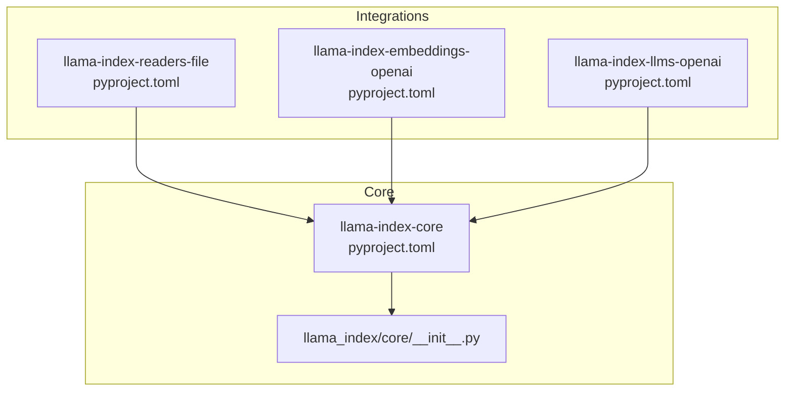
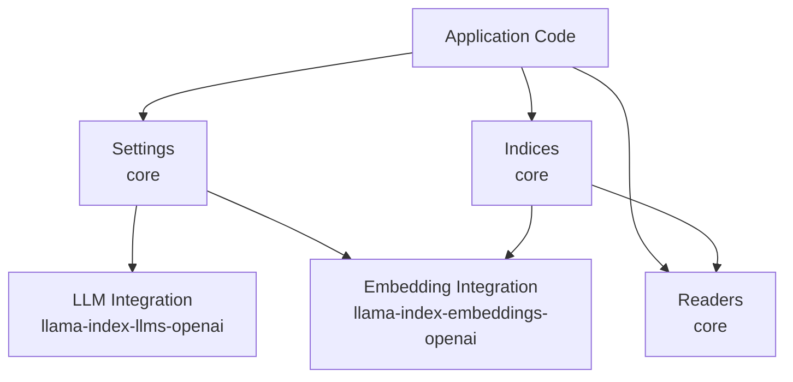
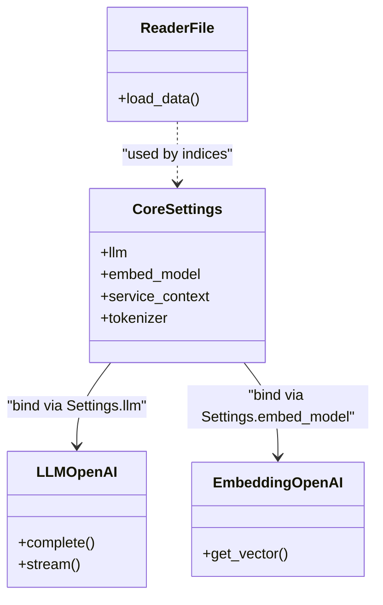
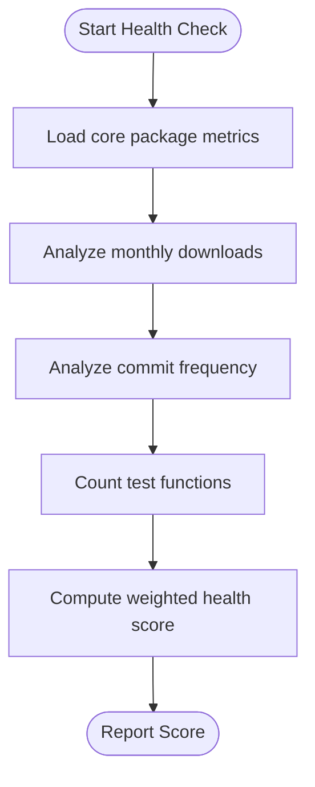
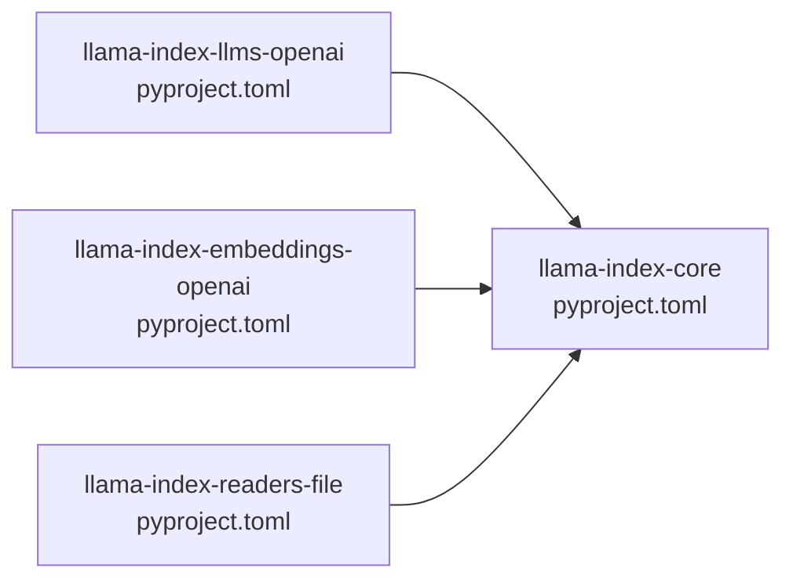

# Integration Layer

<cite>
**Referenced Files in This Document**
- [README.md](file://README.md)
- [llama-index-integrations/README.md](file://llama-index-integrations/README.md)
- [llama-index-core/pyproject.toml](file://llama-index-core/pyproject.toml)
- [llama-index-core/llama_index/core/__init__.py](file://llama-index-core/llama_index/core/__init__.py)
- [llama-index-integrations/llms/llama-index-llms-openai/pyproject.toml](file://llama-index-integrations/llms/llama-index-llms-openai/pyproject.toml)
- [llama-index-integrations/embeddings/llama-index-embeddings-openai/pyproject.toml](file://llama-index-integrations/embeddings/llama-index-embeddings-openai/pyproject.toml)
- [llama-index-integrations/readers/llama-index-readers-file/pyproject.toml](file://llama-index-integrations/readers/llama-index-readers-file/pyproject.toml)
- [llama-index-integrations/readers/llama-index-readers-file/llama_index/readers/file/__init__.py](file://llama-index-integrations/readers/llama-index-readers-file/llama_index/readers/file/__init__.py)
- [scripts/integration_health_check.py](file://scripts/integration_health_check.py)
</cite>

## Table of Contents
1. [Introduction](#introduction)
2. [Project Structure](#project-structure)
3. [Core Components](#core-components)
4. [Architecture Overview](#architecture-overview)
5. [Detailed Component Analysis](#detailed-component-analysis)
6. [Dependency Analysis](#dependency-analysis)
7. [Performance Considerations](#performance-considerations)
8. [Troubleshooting Guide](#troubleshooting-guide)
9. [Conclusion](#conclusion)
10. [Appendices](#appendices)

## Introduction
This document explains the LlamaIndex integration layer that powers a plugin-based architecture enabling seamless connections to external services, providers, and tools. The integration system is designed around a core package (llama-index-core) and a rich ecosystem of optional integration packages (named llama-index-xxx) that extend capabilities such as LLM providers, embedding services, vector stores, readers, and observability tools. Together, these form a flexible, modular framework supporting both beginner-friendly quick-start usage and advanced customization.

Key goals:
- Clarify the plugin-based design and how integrations plug into core.
- Describe naming conventions (llama-index-xxx) and categorization (llms, embeddings, readers, etc.).
- Explain the relationship between core and integrations, and how they compose in real-world usage.
- Provide practical examples for installation, configuration, and usage.
- Outline the ecosystem scale (300+ integrations) and how to evaluate integration health.

## Project Structure
The integration layer is organized as a monorepo of independently published Python packages under a shared namespace. The core package (llama-index-core) defines foundational APIs and abstractions. Integration packages (llama-index-xxx) implement provider-specific logic and expose classes that conform to core interfaces.

**Diagram sources**
- [llama-index-core/pyproject.toml](file://llama-index-core/pyproject.toml#L33-L84)
- [llama-index-core/llama_index/core/__init__.py](file://llama-index-core/llama_index/core/__init__.py#L1-L162)
- [llama-index-integrations/readers/llama-index-readers-file/pyproject.toml](file://llama-index-integrations/readers/llama-index-readers-file/pyproject.toml#L29-L79)
- [llama-index-integrations/embeddings/llama-index-embeddings-openai/pyproject.toml](file://llama-index-integrations/embeddings/llama-index-embeddings-openai/pyproject.toml#L27-L38)
- [llama-index-integrations/llms/llama-index-llms-openai/pyproject.toml](file://llama-index-integrations/llms/llama-index-llms-openai/pyproject.toml#L28-L36)

**Section sources**
- [README.md](file://README.md#L11-L35)
- [llama-index-integrations/README.md](file://llama-index-integrations/README.md#L1-L5)

## Core Components
- Core package (llama-index-core): Provides foundational indices, readers, service context, settings, and top-level imports. It defines the contract that integrations implement against.
- Integration packages (llama-index-xxx): Provide concrete implementations for specific providers and services. They declare a dependency on llama-index-core and export classes under the llama_index.<category>.<provider> namespace.

Design principles:
- Separation of concerns: core handles orchestration and abstractions; integrations handle provider specifics.
- Namespace consistency: imports from llama_index.core refer to core; imports from llama_index.xxx.yyy refer to integrations.
- Extensibility: new providers can be added as new packages without modifying core.

**Section sources**
- [llama-index-core/llama_index/core/__init__.py](file://llama-index-core/llama_index/core/__init__.py#L16-L162)
- [llama-index-core/pyproject.toml](file://llama-index-core/pyproject.toml#L33-L84)
- [README.md](file://README.md#L21-L35)

## Architecture Overview
The integration architecture follows a layered pattern:
- Top-level imports and settings live in core.
- Integrations depend on core and expose provider-specific classes.
- Users configure Settings (e.g., Settings.llm, Settings.embed_model) to bind integrations to the core runtime.

**Diagram sources**
- [llama-index-core/llama_index/core/__init__.py](file://llama-index-core/llama_index/core/__init__.py#L72-L87)
- [llama-index-integrations/llms/llama-index-llms-openai/pyproject.toml](file://llama-index-integrations/llms/llama-index-llms-openai/pyproject.toml#L28-L36)
- [llama-index-integrations/embeddings/llama-index-embeddings-openai/pyproject.toml](file://llama-index-integrations/embeddings/llama-index-embeddings-openai/pyproject.toml#L27-L38)

## Detailed Component Analysis

### Plugin-based Design and Naming Conventions
- Plugin identity: Each integration is a separate Python package named llama-index-<category>-<provider>, e.g., llama-index-llms-openai, llama-index-embeddings-openai, llama-index-readers-file.
- Category grouping: Integrations are grouped by functional category (llms, embeddings, readers, vector_stores, retrievers, etc.) under llama-index-integrations/.
- Import convention: Imports from llama_index.core.xxx indicate core usage; imports from llama_index.xxx.yyy indicate integration usage.

Practical example pattern:
- Install core plus selected integrations.
- Configure Settings to bind integration classes to core abstractions.
- Use core indices and readers with configured providers.

**Section sources**
- [README.md](file://README.md#L14-L35)
- [llama-index-integrations/README.md](file://llama-index-integrations/README.md#L3-L5)

### Core and Integrations Relationship
- Core defines the public API surface and global settings that integrations implement against.
- Integrations depend on core and register their classes under the llama_index.<category>.<provider> namespace.
- Users import from either core or integration namespaces depending on whether they want core defaults or provider-specific behavior.

**Diagram sources**
- [llama-index-core/llama_index/core/__init__.py](file://llama-index-core/llama_index/core/__init__.py#L72-L87)
- [llama-index-integrations/readers/llama-index-readers-file/llama_index/readers/file/__init__.py](file://llama-index-integrations/readers/llama-index-readers-file/llama_index/readers/file/__init__.py#L1-L50)
- [llama-index-integrations/embeddings/llama-index-embeddings-openai/pyproject.toml](file://llama-index-integrations/embeddings/llama-index-embeddings-openai/pyproject.toml#L27-L38)
- [llama-index-integrations/llms/llama-index-llms-openai/pyproject.toml](file://llama-index-integrations/llms/llama-index-llms-openai/pyproject.toml#L28-L36)

### Practical Examples: Installation, Configuration, and Usage
Installation:
- Choose the starter package (includes core and a curated set of integrations) or install core separately and add only the integrations you need.
- Example: pip install llama-index-core, then pip install llama-index-llms-openai, llama-index-embeddings-openai, llama-index-readers-file.

Configuration:
- Set global providers via Settings (e.g., Settings.llm, Settings.embed_model).
- Bind tokenizers and service contexts as needed.

Usage:
- Load documents using readers.
- Build indices with configured embeddings.
- Query using configured LLMs.

These patterns are demonstrated in the repository’s top-level README and examples.

**Section sources**
- [README.md](file://README.md#L93-L177)

### Integration Ecosystem Scale and Health
- The ecosystem includes hundreds of integrations spanning LLM providers, embeddings, readers, vector stores, retrievers, and observability tools.
- A health-check script evaluates integration packages relative to core using metrics like downloads, commit activity, and test coverage.

**Diagram sources**
- [scripts/integration_health_check.py](file://scripts/integration_health_check.py#L264-L341)

**Section sources**
- [README.md](file://README.md#L17-L19)
- [scripts/integration_health_check.py](file://scripts/integration_health_check.py#L1-L463)

## Dependency Analysis
- Core package dependencies define the foundational libraries used across the framework.
- Integration packages depend on core and on provider SDKs or services.
- Readers, embeddings, and LLM integrations declare explicit dependencies on provider libraries and on llama-index-core.

**Diagram sources**
- [llama-index-core/pyproject.toml](file://llama-index-core/pyproject.toml#L55-L84)
- [llama-index-integrations/llms/llama-index-llms-openai/pyproject.toml](file://llama-index-integrations/llms/llama-index-llms-openai/pyproject.toml#L36)
- [llama-index-integrations/embeddings/llama-index-embeddings-openai/pyproject.toml](file://llama-index-integrations/embeddings/llama-index-embeddings-openai/pyproject.toml#L35-L38)
- [llama-index-integrations/readers/llama-index-readers-file/pyproject.toml](file://llama-index-integrations/readers/llama-index-readers-file/pyproject.toml#L72-L79)

**Section sources**
- [llama-index-core/pyproject.toml](file://llama-index-core/pyproject.toml#L55-L84)
- [llama-index-integrations/llms/llama-index-llms-openai/pyproject.toml](file://llama-index-integrations/llms/llama-index-llms-openai/pyproject.toml#L36)
- [llama-index-integrations/embeddings/llama-index-embeddings-openai/pyproject.toml](file://llama-index-integrations/embeddings/llama-index-embeddings-openai/pyproject.toml#L35-L38)
- [llama-index-integrations/readers/llama-index-readers-file/pyproject.toml](file://llama-index-integrations/readers/llama-index-readers-file/pyproject.toml#L72-L79)

## Performance Considerations
- Choose lightweight integrations when performance is critical; reduce unnecessary provider overhead.
- Use appropriate batching and caching strategies exposed by integrations where supported.
- Persist indices and embeddings to disk to avoid recomputation across runs.

[No sources needed since this section provides general guidance]

## Troubleshooting Guide
Common issues and remedies:
- Provider authentication failures: Ensure environment variables and tokens are set before importing provider classes.
- Version mismatches: Align integration versions with core (per integration pyproject.toml constraints).
- Missing dependencies: Install optional extras for readers (e.g., PDF parsing libraries) as needed.

**Section sources**
- [README.md](file://README.md#L93-L177)
- [llama-index-integrations/readers/llama-index-readers-file/pyproject.toml](file://llama-index-integrations/readers/llama-index-readers-file/pyproject.toml#L81-L82)

## Conclusion
LlamaIndex’s integration layer is a robust, extensible plugin system that separates core functionality from provider-specific implementations. By following the llama-index-xxx naming convention and leveraging Settings to bind integrations, developers can rapidly assemble production-ready RAG applications while retaining full control over providers and tooling. With hundreds of integrations and built-in health metrics, the ecosystem supports both rapid prototyping and long-term maintenance.

[No sources needed since this section summarizes without analyzing specific files]

## Appendices

### Quick Reference: Categories and Examples
- LLMs: llama-index-llms-openai, llama-index-llms-replicate
- Embeddings: llama-index-embeddings-openai, llama-index-embeddings-huggingface
- Readers: llama-index-readers-file, llama-index-readers-web
- Vector Stores: llama-index-vector-stores-chroma, llama-index-vector-stores-weaviate
- Observability: llama-index-observability-otel, llama-index-callbacks-langfuse

**Section sources**
- [README.md](file://README.md#L96-L101)