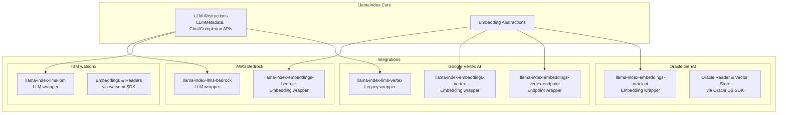
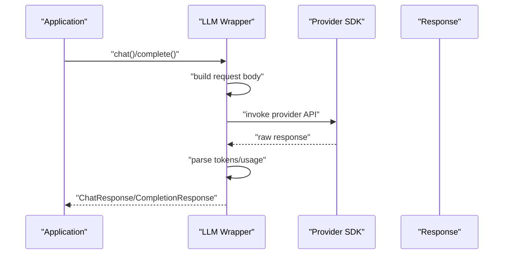
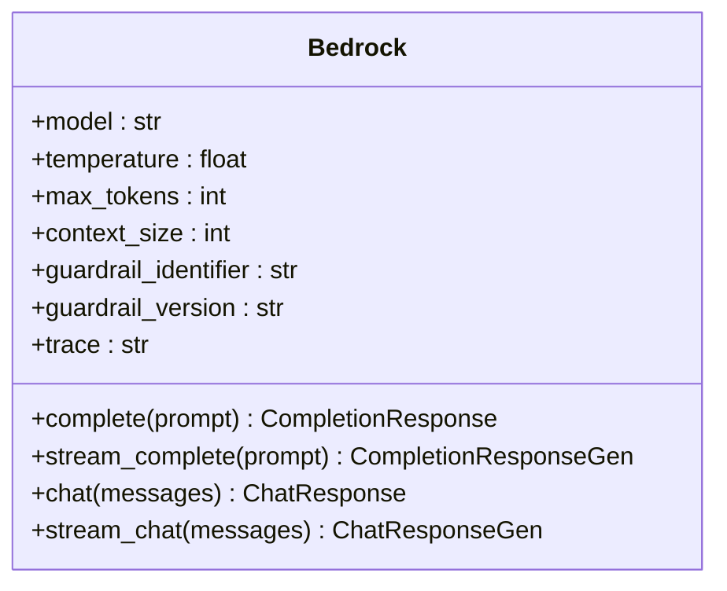
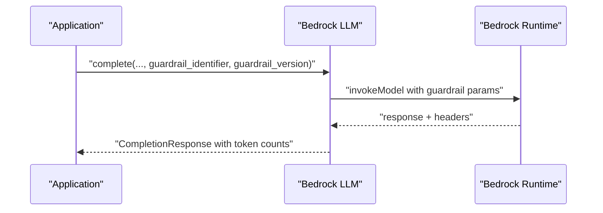
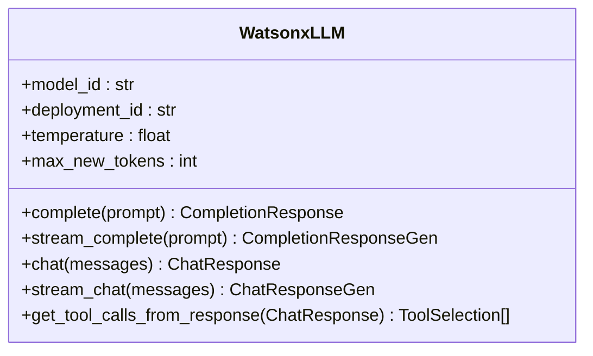
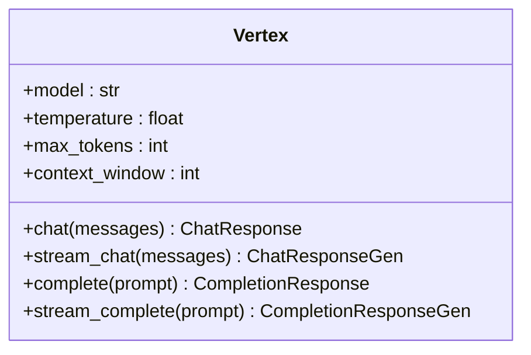
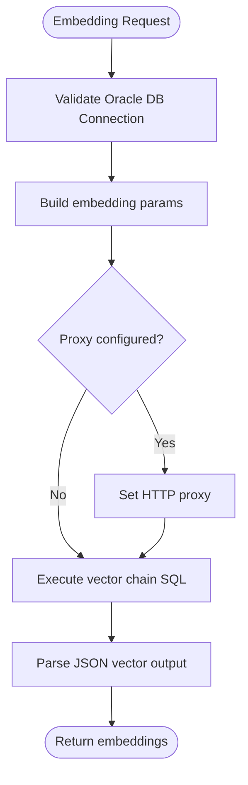
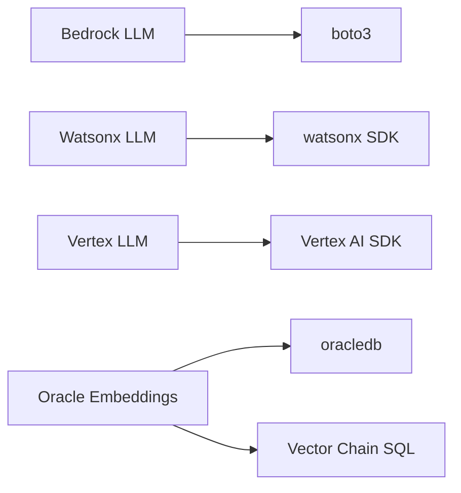

# Cloud AI Platform Providers

<cite>
**Referenced Files in This Document**
- [llama-index-llms-bedrock base.py](file://llama-index-integrations/llms/llama-index-llms-bedrock/llama_index/llms/bedrock/base.py)
- [llama-index-llms-bedrock __init__.py](file://llama-index-integrations/llms/llama-index-llms-bedrock/llama_index/llms/bedrock/__init__.py)
- [llama-index-llms-ibm base.py](file://llama-index-integrations/llms/llama-index-llms-ibm/llama_index/llms/ibm/base.py)
- [llama-index-llms-vertex base.py](file://llama-index-integrations/llms/llama-index-llms-vertex/llama_index/llms/vertex/base.py)
- [llama-index-embeddings-oracleai base.py](file://llama-index-integrations/embeddings/llama-index-embeddings-oracleai/llama_index/embeddings/oracleai/base.py)
- [bedrock.md](file://docs/api_reference/api_reference/llms/bedrock.md)
- [bedrock_converse.md](file://docs/api_reference/api_reference/llms/bedrock_converse.md)
- [vertex.md](file://docs/api_reference/api_reference/llms/vertex.md)
- [vertex_endpoint.md](file://docs/api_reference/api_reference/embeddings/vertex_endpoint.md)
- [oracleai.md](file://docs/api_reference/api_reference/embeddings/oracleai.md)
- [ibm_watsonx.ipynb](file://docs/examples/llm/ibm_watsonx.ipynb)
- [vertex_embedding_endpoint.ipynb](file://docs/examples/embeddings/vertex_embedding_endpoint.ipynb)
- [oracleai_demo.ipynb](file://docs/examples/cookbooks/oracleai_demo.ipynb)
</cite>

## Table of Contents
1. [Introduction](#introduction)
2. [Project Structure](#project-structure)
3. [Core Components](#core-components)
4. [Architecture Overview](#architecture-overview)
5. [Detailed Component Analysis](#detailed-component-analysis)
6. [Dependency Analysis](#dependency-analysis)
7. [Performance Considerations](#performance-considerations)
8. [Troubleshooting Guide](#troubleshooting-guide)
9. [Conclusion](#conclusion)
10. [Appendices](#appendices)

## Introduction
This document explains how LlamaIndex integrates with major cloud AI platform providers: AWS Bedrock, IBM watsonx, Oracle GenAI, and Google Vertex AI. It covers authentication, role-based access control, cross-region deployment, model selection, function/tool calling, and provider-specific features such as guardrails (Bedrock), enterprise-grade controls (IBM), and multimodal capabilities (Vertex AI). It also provides guidance on cost management via reserved capacity, model optimization, and batch processing, along with handling provider limitations, availability, and regional compliance.

## Project Structure
LlamaIndex organizes provider integrations under dedicated packages per cloud vendor. Each package exposes a thin wrapper around the provider’s SDK, exposing a unified LLM/embedding interface compatible with LlamaIndex abstractions.

**Diagram sources**
- [llama-index-llms-bedrock base.py](file://llama-index-integrations/llms/llama-index-llms-bedrock/llama_index/llms/bedrock/base.py#L49-L400)
- [llama-index-llms-ibm base.py](file://llama-index-integrations/llms/llama-index-llms-ibm/llama_index/llms/ibm/base.py#L57-L685)
- [llama-index-llms-vertex base.py](file://llama-index-integrations/llms/llama-index-llms-vertex/llama_index/llms/vertex/base.py#L57-L548)
- [llama-index-embeddings-oracleai base.py](file://llama-index-integrations/embeddings/llama-index-embeddings-oracleai/llama_index/embeddings/oracleai/base.py#L25-L209)

**Section sources**
- [llama-index-llms-bedrock base.py](file://llama-index-integrations/llms/llama-index-llms-bedrock/llama_index/llms/bedrock/base.py#L1-L400)
- [llama-index-llms-ibm base.py](file://llama-index-integrations/llms/llama-index-llms-ibm/llama_index/llms/ibm/base.py#L1-L685)
- [llama-index-llms-vertex base.py](file://llama-index-integrations/llms/llama-index-llms-vertex/llama_index/llms/vertex/base.py#L1-L548)
- [llama-index-embeddings-oracleai base.py](file://llama-index-integrations/embeddings/llama-index-embeddings-oracleai/llama_index/embeddings/oracleai/base.py#L1-L209)

## Core Components
- AWS Bedrock LLM: Provides a unified LLM interface backed by Bedrock runtime, supporting completion/chat, streaming, retries, and guardrails.
- IBM watsonx LLM: Wraps watsonx.ai SDK for text and chat generation, function/tool calling, and token usage reporting.
- Google Vertex LLM: Legacy Vertex wrapper with model categorization and safety settings; note deprecation in favor of Google GenAI.
- Oracle GenAI Embeddings: Embedding provider backed by Oracle DB and vector chain, enabling custom model loading and batched embeddings.

Key capabilities:
- Authentication: Provider-specific credential handling (IAM for Bedrock, API keys/tokens for IBM/Vertex, database credentials for Oracle).
- Role-based access control: Managed via provider IAM roles and service accounts; LlamaIndex passes credentials without storing secrets.
- Cross-region deployment: Provider clients initialized with region/project/location; model availability varies by region.
- Model selection: Provider-specific model lists and categories; LlamaIndex validates and routes requests accordingly.
- Fine-tuning/custom models: Supported via provider endpoints or deployments; LlamaIndex delegates to provider SDKs.
- Cost management: Token usage reporting, retry/backoff, and batch embedding APIs reduce cost and latency.

**Section sources**
- [llama-index-llms-bedrock base.py](file://llama-index-integrations/llms/llama-index-llms-bedrock/llama_index/llms/bedrock/base.py#L108-L122)
- [llama-index-llms-ibm base.py](file://llama-index-integrations/llms/llama-index-llms-ibm/llama_index/llms/ibm/base.py#L107-L142)
- [llama-index-llms-vertex base.py](file://llama-index-integrations/llms/llama-index-llms-vertex/llama_index/llms/vertex/base.py#L110-L184)
- [llama-index-embeddings-oracleai base.py](file://llama-index-integrations/embeddings/llama-index-embeddings-oracleai/llama_index/embeddings/oracleai/base.py#L32-L43)

## Architecture Overview
The integration architecture follows a consistent pattern: LlamaIndex core abstractions call provider wrappers, which translate inputs to provider SDK calls and return standardized responses.

**Diagram sources**
- [llama-index-llms-bedrock base.py](file://llama-index-integrations/llms/llama-index-llms-bedrock/llama_index/llms/bedrock/base.py#L283-L309)
- [llama-index-llms-ibm base.py](file://llama-index-integrations/llms/llama-index-llms-ibm/llama_index/llms/ibm/base.py#L372-L388)
- [llama-index-llms-vertex base.py](file://llama-index-integrations/llms/llama-index-llms-vertex/llama_index/llms/vertex/base.py#L230-L277)

## Detailed Component Analysis

### AWS Bedrock Integration
- Authentication and regions: Initializes boto3 session with optional profile/region/session/token; selects runtime client.
- Guardrails: Supports guardrail_identifier and guardrail_version; trace flag for Bedrock traces.
- Streaming and retries: Validates streaming support per model; applies retry/backoff.
- Model selection: Uses provider-specific prompt formatting and token limits; supports completion/chat.

**Diagram sources**
- [llama-index-llms-bedrock base.py](file://llama-index-integrations/llms/llama-index-llms-bedrock/llama_index/llms/bedrock/base.py#L49-L400)

**Section sources**
- [llama-index-llms-bedrock base.py](file://llama-index-integrations/llms/llama-index-llms-bedrock/llama_index/llms/bedrock/base.py#L131-L248)
- [bedrock.md](file://docs/api_reference/api_reference/llms/bedrock.md#L1-L200)

#### Bedrock Guardrails Workflow

**Diagram sources**
- [llama-index-llms-bedrock base.py](file://llama-index-integrations/llms/llama-index-llms-bedrock/llama_index/llms/bedrock/base.py#L292-L309)

### IBM watsonx Integration
- Authentication: Accepts URL/API key/token/password/username/version; resolves credentials and initializes APIClient.
- Function/tool calling: Supports tool_choice and tool parsing; returns tool_calls in additional_kwargs.
- Generation parameters: Splits text/chat params against provider meta names; supports streaming and async variants.
- Token usage: Parses usage fields from provider responses.

**Diagram sources**
- [llama-index-llms-ibm base.py](file://llama-index-integrations/llms/llama-index-llms-ibm/llama_index/llms/ibm/base.py#L57-L685)

**Section sources**
- [llama-index-llms-ibm base.py](file://llama-index-integrations/llms/llama-index-llms-ibm/llama_index/llms/ibm/base.py#L179-L278)
- [ibm_watsonx.ipynb](file://docs/examples/llm/ibm_watsonx.ipynb#L1-L200)

### Google Vertex AI Integration
- Legacy Vertex wrapper: Supports text/code/chat models; merges adjacent messages for Gemini; enforces model constraints.
- Safety settings: Accepts safety settings for Gemini models.
- Function/tool calling: Gemini supports function calling; validation ensures single tool call when disabled.

**Diagram sources**
- [llama-index-llms-vertex base.py](file://llama-index-integrations/llms/llama-index-llms-vertex/llama_index/llms/vertex/base.py#L57-L548)

**Section sources**
- [llama-index-llms-vertex base.py](file://llama-index-integrations/llms/llama-index-llms-vertex/llama_index/llms/vertex/base.py#L110-L184)
- [vertex.md](file://docs/api_reference/api_reference/llms/vertex.md#L1-L200)

### Oracle GenAI Embeddings
- Database-backed embeddings: Uses Oracle DB connection and vector chain to compute embeddings.
- Custom model loading: Loads ONNX models into Oracle DB for vector operations.
- Batch processing: Supports batch embedding computation via vector arrays.

**Diagram sources**
- [llama-index-embeddings-oracleai base.py](file://llama-index-integrations/embeddings/llama-index-embeddings-oracleai/llama_index/embeddings/oracleai/base.py#L85-L190)

**Section sources**
- [llama-index-embeddings-oracleai base.py](file://llama-index-integrations/embeddings/llama-index-embeddings-oracleai/llama_index/embeddings/oracleai/base.py#L32-L43)
- [oracleai.md](file://docs/api_reference/api_reference/embeddings/oracleai.md#L1-L200)

## Dependency Analysis
- Bedrock: Depends on boto3 and provider runtime; guardrails and retries handled internally.
- IBM: Depends on watsonx SDK; credentials resolved and validated; supports function/tool calling.
- Vertex: Depends on Vertex AI SDK; legacy wrapper; Gemini-specific handling.
- Oracle: Depends on oracledb and vector chain; supports custom model loading.

**Diagram sources**
- [llama-index-llms-bedrock base.py](file://llama-index-integrations/llms/llama-index-llms-bedrock/llama_index/llms/bedrock/base.py#L177-L194)
- [llama-index-llms-ibm base.py](file://llama-index-integrations/llms/llama-index-llms-ibm/llama_index/llms/ibm/base.py#L3-L7)
- [llama-index-llms-vertex base.py](file://llama-index-integrations/llms/llama-index-llms-vertex/llama_index/llms/vertex/base.py#L30-L43)
- [llama-index-embeddings-oracleai base.py](file://llama-index-integrations/embeddings/llama-index-embeddings-oracleai/llama_index/embeddings/oracleai/base.py#L87-L92)

**Section sources**
- [llama-index-llms-bedrock base.py](file://llama-index-integrations/llms/llama-index-llms-bedrock/llama_index/llms/bedrock/base.py#L177-L194)
- [llama-index-llms-ibm base.py](file://llama-index-integrations/llms/llama-index-llms-ibm/llama_index/llms/ibm/base.py#L3-L7)
- [llama-index-llms-vertex base.py](file://llama-index-integrations/llms/llama-index-llms-vertex/llama_index/llms/vertex/base.py#L30-L43)
- [llama-index-embeddings-oracleai base.py](file://llama-index-integrations/embeddings/llama-index-embeddings-oracleai/llama_index/embeddings/oracleai/base.py#L87-L92)

## Performance Considerations
- Retries and timeouts: Configure max_retries and timeout to balance reliability and latency.
- Streaming: Prefer streaming for long responses to reduce perceived latency.
- Batch embeddings: Use batch embedding APIs (Oracle) to reduce round trips.
- Token usage: Monitor prompt/completion tokens to optimize context windows and reduce cost.
- Model selection: Choose smaller models for routine tasks; reserve larger models for complex reasoning.

[No sources needed since this section provides general guidance]

## Troubleshooting Guide
- Bedrock guardrails: Ensure guardrail_identifier and guardrail_version are set correctly; verify IAM permissions for guardrail access.
- IBM credentials: Validate URL/API key/token; confirm project/space IDs; check SSL verify settings.
- Vertex model errors: Verify model name exists in supported lists; avoid unsupported parameters for specific model families.
- Oracle embeddings: Confirm Oracle DB connectivity and vector chain availability; ensure HTTP proxy settings if behind corporate firewall.

**Section sources**
- [llama-index-llms-bedrock base.py](file://llama-index-integrations/llms/llama-index-llms-bedrock/llama_index/llms/bedrock/base.py#L108-L122)
- [llama-index-llms-ibm base.py](file://llama-index-integrations/llms/llama-index-llms-ibm/llama_index/llms/ibm/base.py#L207-L217)
- [llama-index-llms-vertex base.py](file://llama-index-integrations/llms/llama-index-llms-vertex/llama_index/llms/vertex/base.py#L182-L183)
- [llama-index-embeddings-oracleai base.py](file://llama-index-integrations/embeddings/llama-index-embeddings-oracleai/llama_index/embeddings/oracleai/base.py#L88-L92)

## Conclusion
LlamaIndex provides robust, unified integrations with AWS Bedrock, IBM watsonx, Oracle GenAI, and Google Vertex AI. These wrappers expose consistent LLM and embedding interfaces while leveraging provider-specific capabilities such as guardrails, enterprise controls, and multimodal models. By combining provider SDKs with LlamaIndex abstractions, teams can build portable RAG applications with strong controls, performance, and cost management.

[No sources needed since this section summarizes without analyzing specific files]

## Appendices

### Provider-Specific Feature Highlights
- Bedrock: Guardrails, IAM authentication, cross-region runtime, streaming support.
- IBM: Enterprise-grade security, function/tool calling, token usage reporting, persistent connections.
- Vertex: Multimodal support via Gemini, safety settings, function calling, legacy model families.
- Oracle: Database-native embeddings, custom model loading, batch processing, vector chain SQL.

**Section sources**
- [bedrock.md](file://docs/api_reference/api_reference/llms/bedrock.md#L1-L200)
- [bedrock_converse.md](file://docs/api_reference/api_reference/llms/bedrock_converse.md#L1-L200)
- [vertex.md](file://docs/api_reference/api_reference/llms/vertex.md#L1-L200)
- [vertex_endpoint.md](file://docs/api_reference/api_reference/embeddings/vertex_endpoint.md#L1-L200)
- [oracleai.md](file://docs/api_reference/api_reference/embeddings/oracleai.md#L1-L200)
- [ibm_watsonx.ipynb](file://docs/examples/llm/ibm_watsonx.ipynb#L1-L200)
- [vertex_embedding_endpoint.ipynb](file://docs/examples/embeddings/vertex_embedding_endpoint.ipynb#L1-L200)
- [oracleai_demo.ipynb](file://docs/examples/cookbooks/oracleai_demo.ipynb#L1-L200)