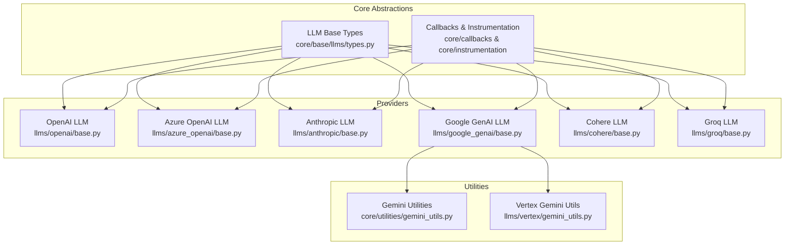
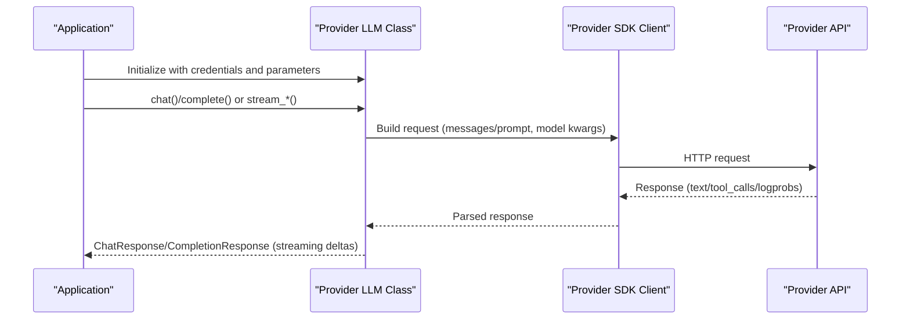
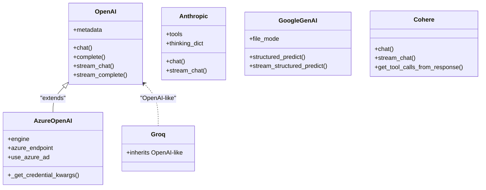

# Cloud LLM Providers

<cite>
**Referenced Files in This Document**
- [base.py](file://llama-index-integrations/llms/llama-index-llms-openai/llama_index/llms/openai/base.py)
- [base.py](file://llama-index-integrations/llms/llama-index-llms-anthropic/llama_index/llms/anthropic/base.py)
- [base.py](file://llama-index-integrations/llms/llama-index-llms-google-genai/llama_index/llms/google_genai/base.py)
- [base.py](file://llama-index-integrations/llms/llama-index-llms-azure-openai/llama_index/llms/azure_openai/base.py)
- [base.py](file://llama-index-integrations/llms/llama-index-llms-cohere/llama_index/llms/cohere/base.py)
- [base.py](file://llama-index-integrations/llms/llama-index-llms-groq/llama_index/llms/groq/base.py)
- [utils.py](file://llama-index-core/llama_index/core/utilities/gemini_utils.py)
- [gemini_utils.py](file://llama-index-integrations/llms/llama-index-llms-vertex/llama_index/llms/vertex/gemini_utils.py)
- [test_llms_openai.py](file://llama-index-integrations/llms/llama-index-llms-openai/tests/test_llms_openai.py)
- [test_llms_anthropic.py](file://llama-index-integrations/llms/llama-index-llms-anthropic/tests/test_llms_anthropic.py)
- [test_gemini_utils.py](file://llama-index-integrations/llms/llama-index-llms-vertex/tests/test_gemini_utils.py)
- [test_llms_azure_openai.py](file://llama-index-integrations/llms/llama-index-llms-azure-openai/tests/test_llms_azure_openai.py)
- [test_llms_cohere.py](file://llama-index-integrations/llms/llama-index-llms-cohere/tests/test_llms_cohere.py)
- [test_llms_groq.py](file://llama-index-integrations/llms/llama-index-llms-groq/tests/test_llms_groq.py)
</cite>

## Table of Contents
1. [Introduction](#introduction)
2. [Project Structure](#project-structure)
3. [Core Components](#core-components)
4. [Architecture Overview](#architecture-overview)
5. [Detailed Component Analysis](#detailed-component-analysis)
6. [Dependency Analysis](#dependency-analysis)
7. [Performance Considerations](#performance-considerations)
8. [Troubleshooting Guide](#troubleshooting-guide)
9. [Conclusion](#conclusion)

## Introduction
This document provides a comprehensive guide to configuring and using cloud-based Large Language Model (LLM) providers in LlamaIndex. It focuses on major providers: OpenAI (GPT-3.5/4), Anthropic Claude, Google Gemini, Azure OpenAI, Cohere, and Groq. For each provider, you will find:
- Authentication methods and environment variable setup
- Regional availability and service-specific configuration
- Streaming support, function calling, and response formatting
- Provider-specific features such as multimodality and structured outputs
- Pricing and rate limiting considerations, plus cost optimization tips
- Troubleshooting common API errors and connection issues

## Project Structure
The LlamaIndex integrations for cloud LLM providers are organized under dedicated packages. Each provider’s implementation resides in its own module and exposes a primary LLM class that inherits from LlamaIndex’s generic LLM abstractions. Shared utilities and metadata helpers are located in the core and provider-specific directories.

**Diagram sources**
- [base.py](file://llama-index-integrations/llms/llama-index-llms-openai/llama_index/llms/openai/base.py#L139-L696)
- [base.py](file://llama-index-integrations/llms/llama-index-llms-azure-openai/llama_index/llms/azure_openai/base.py#L20-L266)
- [base.py](file://llama-index-integrations/llms/llama-index-llms-anthropic/llama_index/llms/anthropic/base.py#L116-L800)
- [base.py](file://llama-index-integrations/llms/llama-index-llms-google-genai/llama_index/llms/google_genai/base.py#L101-L837)
- [base.py](file://llama-index-integrations/llms/llama-index-llms-cohere/llama_index/llms/cohere/base.py#L44-L561)
- [base.py](file://llama-index-integrations/llms/llama-index-llms-groq/llama_index/llms/groq/base.py#L7-L51)
- [gemini_utils.py](file://llama-index-core/llama_index/core/utilities/gemini_utils.py)
- [gemini_utils.py](file://llama-index-integrations/llms/llama-index-llms-vertex/llama_index/llms/vertex/gemini_utils.py)

**Section sources**
- [base.py](file://llama-index-integrations/llms/llama-index-llms-openai/llama_index/llms/openai/base.py#L1-L1242)
- [base.py](file://llama-index-integrations/llms/llama-index-llms-azure-openai/llama_index/llms/azure_openai/base.py#L1-L266)
- [base.py](file://llama-index-integrations/llms/llama-index-llms-anthropic/llama_index/llms/anthropic/base.py#L1-L1186)
- [base.py](file://llama-index-integrations/llms/llama-index-llms-google-genai/llama_index/llms/google_genai/base.py#L1-L837)
- [base.py](file://llama-index-integrations/llms/llama-index-llms-cohere/llama_index/llms/cohere/base.py#L1-L561)
- [base.py](file://llama-index-integrations/llms/llama-index-llms-groq/llama_index/llms/groq/base.py#L1-L51)

## Core Components
- OpenAI: Supports chat and completion endpoints, streaming, function/tool calling, token counting, and advanced modalities (audio). It auto-resolves credentials and supports both sync and async clients.
- Azure OpenAI: Inherits OpenAI behavior but enforces engine/deployment identification, supports Azure AD token providers, and validates environment variables.
- Anthropic: Provides chat and streaming with tool/function calling, citations, thinking blocks, and MCP server integration. Supports Vertex and Bedrock backends.
- Google Gemini: Offers chat, streaming, file handling modes (inline/fileapi/hybrid), function/tool calling, and structured outputs via JSON schema.
- Cohere: Implements chat and streaming with tool/function calling, supports single-step tool invocation, and integrates with Cohere’s SDK.
- Groq: Uses an OpenAI-compatible interface with a fixed base URL and chat/model flags.

Key shared capabilities across providers include:
- Streaming and non-streaming chat/completion
- Function/tool calling with standardized response blocks
- Retry decorators and configurable timeouts/retries
- Metadata reporting (context window, tokens)

**Section sources**
- [base.py](file://llama-index-integrations/llms/llama-index-llms-openai/llama_index/llms/openai/base.py#L139-L696)
- [base.py](file://llama-index-integrations/llms/llama-index-llms-azure-openai/llama_index/llms/azure_openai/base.py#L20-L266)
- [base.py](file://llama-index-integrations/llms/llama-index-llms-anthropic/llama_index/llms/anthropic/base.py#L116-L800)
- [base.py](file://llama-index-integrations/llms/llama-index-llms-google-genai/llama_index/llms/google_genai/base.py#L101-L837)
- [base.py](file://llama-index-integrations/llms/llama-index-llms-cohere/llama_index/llms/cohere/base.py#L44-L561)
- [base.py](file://llama-index-integrations/llms/llama-index-llms-groq/llama_index/llms/groq/base.py#L7-L51)

## Architecture Overview
The provider implementations share a common LLM abstraction and rely on provider SDKs. They expose synchronous and asynchronous chat/completion methods, streaming generators, and standardized response types. Utilities and metadata helpers are used to normalize provider-specific formats.

**Diagram sources**
- [base.py](file://llama-index-integrations/llms/llama-index-llms-openai/llama_index/llms/openai/base.py#L394-L653)
- [base.py](file://llama-index-integrations/llms/llama-index-llms-anthropic/llama_index/llms/anthropic/base.py#L417-L666)
- [base.py](file://llama-index-integrations/llms/llama-index-llms-google-genai/llama_index/llms/google_genai/base.py#L320-L468)
- [base.py](file://llama-index-integrations/llms/llama-index-llms-cohere/llama_index/llms/cohere/base.py#L311-L560)
- [base.py](file://llama-index-integrations/llms/llama-index-llms-groq/llama_index/llms/groq/base.py#L7-L51)

## Detailed Component Analysis

### OpenAI (GPT-3.5/4)
- Authentication: Supports environment variables and explicit API key injection. Credentials resolution is centralized.
- Environment variables: OPENAI_API_KEY (and optionally OPENAI_BASE_URL, OPENAI_API_VERSION for Azure OpenAI variants).
- Regional availability: Global; endpoint defaults handled internally.
- Streaming: Full support for chat and completion streaming; tool/function call deltas supported.
- Function calling: Native function/tool calling with structured tool call blocks.
- Vision/audio: Modalities support including audio; chat completions preferred for audio.
- Pricing/Rate limits: Determined by provider; configure timeouts and retries; monitor usage fields in responses.
- Cost optimization: Tune temperature, reduce max_tokens, reuse clients, avoid unnecessary streaming.

Configuration example outline:
- Environment: Set OPENAI_API_KEY and optional OPENAI_BASE_URL.
- Initialization: Pass model, temperature, max_tokens, and optional api_key/api_base.
- Parameter tuning: additional_kwargs for provider-specific options; reuse_client for concurrency stability.

Response formatting:
- Non-streaming returns ChatResponse/CompletionResponse with message blocks and optional logprobs.
- Streaming yields incremental ChatResponse with delta updates and tool call blocks.

**Section sources**
- [base.py](file://llama-index-integrations/llms/llama-index-llms-openai/llama_index/llms/openai/base.py#L139-L696)
- [test_llms_openai.py](file://llama-index-integrations/llms/llama-index-llms-openai/tests/test_llms_openai.py)

### Azure OpenAI
- Authentication: Requires AZURE_OPENAI_ENDPOINT and OPENAI_API_VERSION; supports API key or Azure AD token provider.
- Environment variables: AZURE_OPENAI_API_KEY, AZURE_OPENAI_ENDPOINT, OPENAI_API_VERSION; or use Azure AD token provider.
- Regional availability: Depends on Azure region where the deployment is hosted.
- Engine/deployment: Must specify engine (deployment name); validated at construction.
- Streaming and function calling: Inherits OpenAI behavior; streaming not supported for audio modalities.
- Cost optimization: Use appropriate deployment sizes and scale policies; monitor throttling.

Configuration example outline:
- Environment: Set AZURE_OPENAI_API_KEY, AZURE_OPENAI_ENDPOINT, OPENAI_API_VERSION.
- Initialization: Provide engine, model, api_key, azure_endpoint, api_version; optionally use Azure AD token provider.

**Section sources**
- [base.py](file://llama-index-integrations/llms/llama-index-llms-azure-openai/llama_index/llms/azure_openai/base.py#L20-L266)
- [test_llms_azure_openai.py](file://llama-index-integrations/llms/llama-index-llms-azure-openai/tests/test_llms_azure_openai.py)

### Anthropic Claude
- Authentication: Supports API key, Vertex AI, or AWS Bedrock backends; environment variables for credentials.
- Environment variables: ANTHROPIC_API_KEY; Vertex: GOOGLE_CLOUD_PROJECT/LOCATION; Bedrock: AWS credentials.
- Regional availability: Global; Vertex and Bedrock backends selectable at runtime.
- Streaming: Rich streaming with text deltas, tool calls, citations, and thinking blocks.
- Function calling: ToolUse blocks and partial JSON parsing; supports MCP servers.
- Safety/thinking: Optional thinking configuration and cache control per message.

Configuration example outline:
- Environment: Set ANTHROPIC_API_KEY; optionally Vertex or Bedrock parameters.
- Initialization: Provide model, temperature, max_tokens, tools/mcp_servers, thinking configuration.

**Section sources**
- [base.py](file://llama-index-integrations/llms/llama-index-llms-anthropic/llama_index/llms/anthropic/base.py#L116-L800)
- [test_llms_anthropic.py](file://llama-index-integrations/llms/llama-index-llms-anthropic/tests/test_llms_anthropic.py)

### Google Gemini
- Authentication: Supports API key or Vertex AI; environment detection for GOOGLE_API_KEY and Vertex project/location.
- Environment variables: GOOGLE_API_KEY; GOOGLE_GENAI_USE_VERTEXAI, GOOGLE_CLOUD_PROJECT, GOOGLE_CLOUD_LOCATION.
- File handling: Inline-only, FileAPI-only, or hybrid modes; uploads and cleanup handled automatically.
- Structured outputs: JSON schema-based structured predict and streaming variants.
- Streaming: Streamed text deltas; supports thought signatures and tool/function calling.
- Pricing/Rate limits: Managed by Google; configure max_retries and timeouts.

Configuration example outline:
- Environment: Set GOOGLE_API_KEY or enable Vertex AI via environment flags.
- Initialization: Provide model, temperature, max_tokens, file_mode, generation_config, built_in_tool.

**Section sources**
- [base.py](file://llama-index-integrations/llms/llama-index-llms-google-genai/llama_index/llms/google_genai/base.py#L101-L837)
- [gemini_utils.py](file://llama-index-core/llama_index/core/utilities/gemini_utils.py)
- [gemini_utils.py](file://llama-index-integrations/llms/llama-index-llms-vertex/llama_index/llms/vertex/gemini_utils.py)
- [test_gemini_utils.py](file://llama-index-integrations/llms/llama-index-llms-vertex/tests/test_gemini_utils.py)

### Cohere
- Authentication: API key-based; supports base_url override for enterprise/self-hosted endpoints.
- Environment variables: COHERE_API_KEY (via constructor or environment).
- Function calling: Tool/function calling with tool results aggregation; single-step invocation by default.
- Streaming: Chat and completion streaming; tool calls surfaced in response metadata.
- Pricing/Rate limits: Managed by Cohere; tune max_tokens and temperature to control costs.

Configuration example outline:
- Environment: Set COHERE_API_KEY.
- Initialization: Provide model, temperature, max_tokens, base_url.

**Section sources**
- [base.py](file://llama-index-integrations/llms/llama-index-llms-cohere/llama_index/llms/cohere/base.py#L44-L561)
- [test_llms_cohere.py](file://llama-index-integrations/llms/llama-index-llms-cohere/tests/test_llms_cohere.py)

### Groq
- Authentication: API key-based; uses OpenAI-compatible base URL.
- Environment variables: GROQ_API_KEY.
- Function calling: Inherits OpenAI-like function calling support.
- Streaming: Compatible with OpenAI-like streaming semantics.

Configuration example outline:
- Environment: Set GROQ_API_KEY.
- Initialization: Provide model and api_key; api_base is preconfigured.

**Section sources**
- [base.py](file://llama-index-integrations/llms/llama-index-llms-groq/llama_index/llms/groq/base.py#L7-L51)
- [test_llms_groq.py](file://llama-index-integrations/llms/llama-index-llms-groq/tests/test_llms_groq.py)

## Dependency Analysis
Provider implementations depend on:
- Core LLM abstractions and response types
- Provider SDK clients (OpenAI, Anthropic, Google GenAI, Cohere, Groq)
- Utility modules for message conversion, token counting, and metadata

**Diagram sources**
- [base.py](file://llama-index-integrations/llms/llama-index-llms-openai/llama_index/llms/openai/base.py#L139-L696)
- [base.py](file://llama-index-integrations/llms/llama-index-llms-azure-openai/llama_index/llms/azure_openai/base.py#L20-L266)
- [base.py](file://llama-index-integrations/llms/llama-index-llms-anthropic/llama_index/llms/anthropic/base.py#L116-L800)
- [base.py](file://llama-index-integrations/llms/llama-index-llms-google-genai/llama_index/llms/google_genai/base.py#L101-L837)
- [base.py](file://llama-index-integrations/llms/llama-index-llms-cohere/llama_index/llms/cohere/base.py#L44-L561)
- [base.py](file://llama-index-integrations/llms/llama-index-llms-groq/llama_index/llms/groq/base.py#L7-L51)

**Section sources**
- [base.py](file://llama-index-integrations/llms/llama-index-llms-openai/llama_index/llms/openai/base.py#L1-L1242)
- [base.py](file://llama-index-integrations/llms/llama-index-llms-azure-openai/llama_index/llms/azure_openai/base.py#L1-L266)
- [base.py](file://llama-index-integrations/llms/llama-index-llms-anthropic/llama_index/llms/anthropic/base.py#L1-L1186)
- [base.py](file://llama-index-integrations/llms/llama-index-llms-google-genai/llama_index/llms/google_genai/base.py#L1-L837)
- [base.py](file://llama-index-integrations/llms/llama-index-llms-cohere/llama_index/llms/cohere/base.py#L1-L561)
- [base.py](file://llama-index-integrations/llms/llama-index-llms-groq/llama_index/llms/groq/base.py#L1-L51)

## Performance Considerations
- Concurrency and client reuse: Enable reuse_client for high-volume async workloads to improve stability.
- Streaming vs. non-streaming: Prefer streaming for interactive experiences; disable for batch jobs to reduce overhead.
- Token budgeting: Use context window metadata and adjust max_tokens to fit prompts; leverage tokenizer utilities when available.
- Retries and timeouts: Configure max_retries and timeouts per provider; monitor usage fields to estimate costs.
- Regional endpoints: Choose nearest regions for lower latency; for Vertex/AWS backends, select appropriate regions.

[No sources needed since this section provides general guidance]

## Troubleshooting Guide
Common issues and resolutions:
- Missing credentials:
  - OpenAI/Azure OpenAI: Ensure OPENAI_API_KEY is set; for Azure OpenAI, also set AZURE_OPENAI_ENDPOINT and OPENAI_API_VERSION.
  - Anthropic: Set ANTHROPIC_API_KEY; for Vertex/Bedrock, set project/location or AWS credentials.
  - Gemini: Set GOOGLE_API_KEY or enable Vertex AI via environment flags.
  - Cohere: Set COHERE_API_KEY.
  - Groq: Set GROQ_API_KEY.
- Invalid model/engine:
  - OpenAI: Some models require Responses API; use OpenAIResponses for those models.
  - Azure OpenAI: Must specify engine (deployment name); validation occurs at construction.
  - Cohere: Ensure model is in supported chat models list.
- Streaming restrictions:
  - OpenAI: Audio modalities are not supported for chat streaming.
  - Anthropic: Tool calls are parsed incrementally; ensure tool_choice alignment.
- Rate limiting/throttling:
  - Reduce concurrency, increase timeouts, implement exponential backoff via max_retries.
- Function/tool calling mismatches:
  - Verify tool definitions and function schemas; ensure provider supports function calling for the selected model.

**Section sources**
- [base.py](file://llama-index-integrations/llms/llama-index-llms-openai/llama_index/llms/openai/base.py#L294-L308)
- [base.py](file://llama-index-integrations/llms/llama-index-llms-azure-openai/llama_index/llms/azure_openai/base.py#L186-L200)
- [base.py](file://llama-index-integrations/llms/llama-index-llms-cohere/llama_index/llms/cohere/base.py#L316-L318)

## Conclusion
LlamaIndex provides robust, provider-agnostic integrations for leading cloud LLMs. By leveraging standardized LLM abstractions, each provider’s implementation offers consistent streaming, function/tool calling, and response formatting while accommodating provider-specific features such as multimodality, structured outputs, and backend selection. Proper environment configuration, careful tuning of parameters, and awareness of provider limitations will help you build efficient, reliable applications.