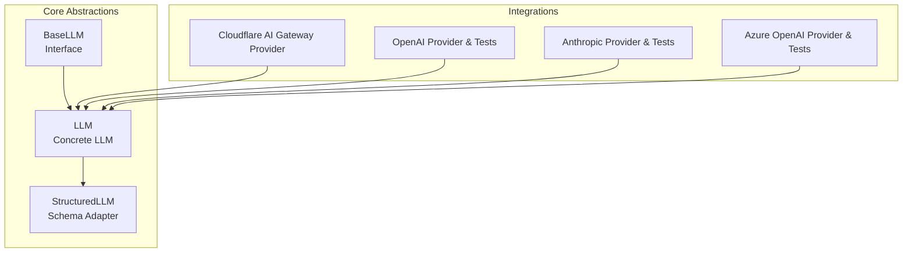
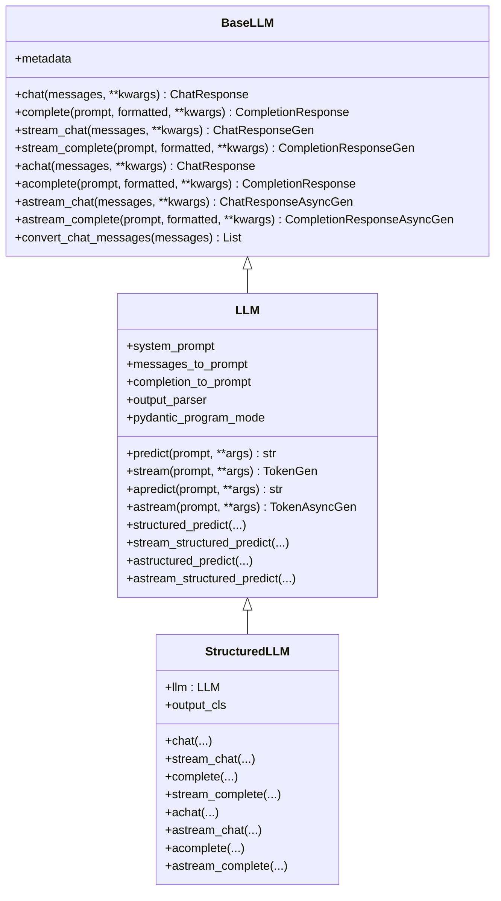
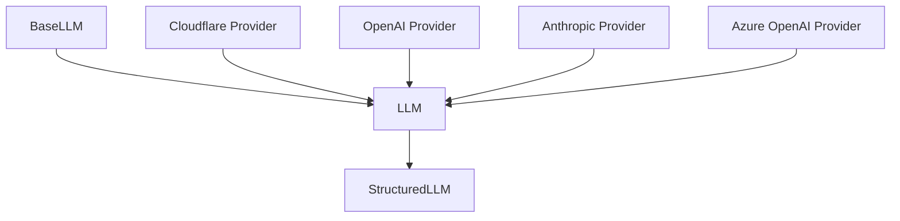
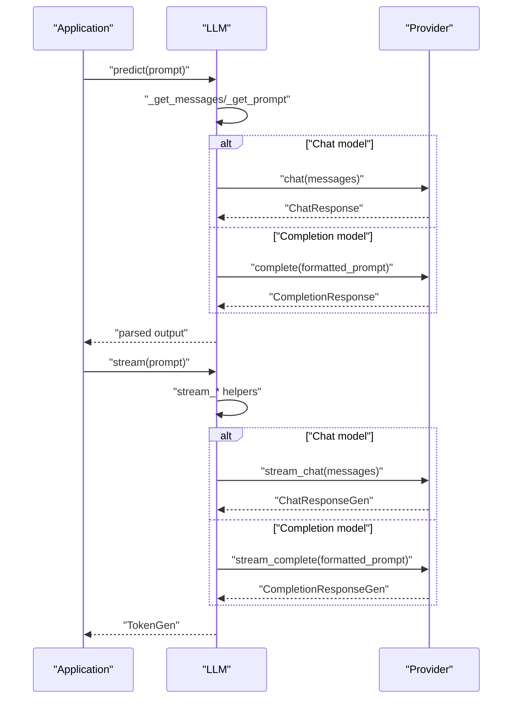
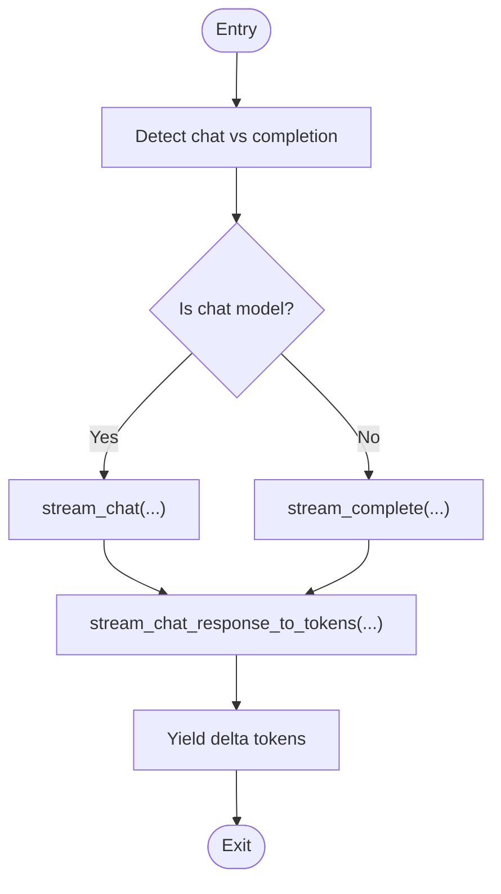

# Custom Provider Development

<cite>
**Referenced Files in This Document**
- [base.py](file://llama-index-core/llama_index/core/base/llms/base.py)
- [llm.py](file://llama-index-core/llama_index/core/llms/llm.py)
- [structured_llm.py](file://llama-index-core/llama_index/core/llms/structured_llm.py)
- [providers.py](file://llama-index-integrations/llms/llama-index-llms-cloudflare-ai-gateway/llama_index/llms/cloudflare_ai_gateway/providers.py)
- [test_llms_openai.py](file://llama-index-integrations/llms/llama-index-llms-openai/tests/test_llms_openai.py)
- [test_llms_anthropic.py](file://llama-index-integrations/llms/llama-index-llms-anthropic/tests/test_llms_anthropic.py)
- [test_azure_openai.py](file://llama-index-integrations/llms/llama-index-llms-azure-openai/tests/test_azure_openai.py)
- [test_anthropic_utils.py](file://llama-index-integrations/llms/llama-index-llms-anthropic/tests/test_anthropic_utils.py)
- [test_openai.py](file://llama-index-integrations/llms/llama-index-llms-openai/tests/test_openai.py)
- [test_openai_responses.py](file://llama-index-integrations/llms/llama-index-llms-openai/tests/test_openai_responses.py)
- [test_openai_utils.py](file://llama-index-integrations/llms/llama-index-llms-openai/tests/test_openai_utils.py)
</cite>

## Table of Contents
1. [Introduction](#introduction)
2. [Project Structure](#project-structure)
3. [Core Components](#core-components)
4. [Architecture Overview](#architecture-overview)
5. [Detailed Component Analysis](#detailed-component-analysis)
6. [Dependency Analysis](#dependency-analysis)
7. [Performance Considerations](#performance-considerations)
8. [Troubleshooting Guide](#troubleshooting-guide)
9. [Conclusion](#conclusion)
10. [Appendices](#appendices)

## Introduction
This document explains how to build custom Large Language Model (LLM) providers in LlamaIndex. It focuses on the BaseLLM interface, the LLM class that implements common behaviors, and the StructuredLLM adapter for function-calling-style outputs. You will learn the provider interface contract, how to implement synchronous and asynchronous endpoints, how to integrate authentication and request/response transformations, and how to register and configure providers. The guide also covers testing strategies, mocking, and integration verification using real-world integration packages as examples.

## Project Structure
The relevant parts of the repository for custom provider development are organized around the core LLM abstractions and integration examples:

- Core LLM abstractions live under the core module:
  - BaseLLM defines the provider interface contract
  - LLM adds convenience methods, structured outputs, and streaming helpers
  - StructuredLLM adapts any LLM to enforce a fixed output schema
- Integration examples demonstrate how third-party providers are implemented and tested:
  - Cloudflare AI Gateway provider
  - OpenAI provider and tests
  - Anthropic provider and tests
  - Azure OpenAI provider and tests

**Diagram sources**
- [base.py](file://llama-index-core/llama_index/core/base/llms/base.py#L25-L292)
- [llm.py](file://llama-index-core/llama_index/core/llms/llm.py#L163-L931)
- [structured_llm.py](file://llama-index-core/llama_index/core/llms/structured_llm.py#L32-L164)
- [providers.py](file://llama-index-integrations/llms/llama-index-llms-cloudflare-ai-gateway/llama_index/llms/cloudflare_ai_gateway/providers.py)

**Section sources**
- [base.py](file://llama-index-core/llama_index/core/base/llms/base.py#L1-L292)
- [llm.py](file://llama-index-core/llama_index/core/llms/llm.py#L1-L931)
- [structured_llm.py](file://llama-index-core/llama_index/core/llms/structured_llm.py#L1-L164)

## Core Components
This section documents the provider interface contract and the primary components you will extend or compose when building custom providers.

- BaseLLM
  - Defines the provider interface with metadata, chat/completion endpoints, and streaming variants (sync and async).
  - Provides a default message conversion helper for chat messages.
  - Requires subclasses to implement all abstract methods.

- LLM
  - Extends BaseLLM and adds:
    - Prompt/message formatting hooks (system prompt, messages_to_prompt, completion_to_prompt)
    - Structured prediction capabilities via pydantic programs
    - Convenience methods: predict, stream, apredict, astream
    - Streaming token extraction helpers for chat and completion
  - Handles output parsing and prompt extension.

- StructuredLLM
  - Wraps an LLM to force all outputs to match a fixed pydantic model.
  - Implements chat/stream_chat and chat-to-completion adapters for completion endpoints.
  - Exposes metadata from the underlying LLM.

Key implementation references:
- BaseLLM abstract methods and message conversion: [base.py](file://llama-index-core/llama_index/core/base/llms/base.py#L25-L292)
- LLM structured prediction and streaming helpers: [llm.py](file://llama-index-core/llama_index/core/llms/llm.py#L163-L931)
- StructuredLLM adapter: [structured_llm.py](file://llama-index-core/llama_index/core/llms/structured_llm.py#L32-L164)

**Section sources**
- [base.py](file://llama-index-core/llama_index/core/base/llms/base.py#L25-L292)
- [llm.py](file://llama-index-core/llama_index/core/llms/llm.py#L163-L931)
- [structured_llm.py](file://llama-index-core/llama_index/core/llms/structured_llm.py#L32-L164)

## Architecture Overview
The provider architecture centers on BaseLLM as the contract, LLM as the feature-rich implementation, and StructuredLLM as an adapter for schema-enforced outputs. Integrations plug into this stack by subclassing BaseLLM or composing with LLM.

**Diagram sources**
- [base.py](file://llama-index-core/llama_index/core/base/llms/base.py#L25-L292)
- [llm.py](file://llama-index-core/llama_index/core/llms/llm.py#L163-L931)
- [structured_llm.py](file://llama-index-core/llama_index/core/llms/structured_llm.py#L32-L164)

## Detailed Component Analysis

### BaseLLM Contract and Implementation Requirements
- Metadata property
  - Required to expose model capabilities (e.g., whether it is a chat model).
  - Used by higher-level components to route predict/stream calls appropriately.

- Endpoint methods
  - chat/messages: synchronous and async chat endpoints
  - complete/prompt: synchronous and async completion endpoints
  - stream_chat/stream_complete: streaming variants for both chat and completion
  - convert_chat_messages: default converter for message content normalization

- Authentication and configuration
  - Providers typically initialize credentials in __init__ and apply them to outgoing requests.
  - Environment variables and configuration objects are commonly used to supply keys and endpoints.

- Request/response transformation
  - Implementers often transform LlamaIndex’s ChatMessage or plain prompts into the provider’s native request format.
  - Responses are normalized into LlamaIndex’s ChatResponse or CompletionResponse types.

- Error handling
  - Wrap provider-specific exceptions into LlamaIndex-compatible errors.
  - Respect timeouts and retry policies where applicable.

References:
- [base.py](file://llama-index-core/llama_index/core/base/llms/base.py#L25-L292)

**Section sources**
- [base.py](file://llama-index-core/llama_index/core/base/llms/base.py#L25-L292)

### LLM: Common Behaviors and Helpers
- Prompt/message formatting
  - system_prompt: prepends a system message to chat conversations
  - messages_to_prompt/completion_to_prompt: convert messages/prompts to provider-specific formats
  - output_parser: optional post-processing of raw outputs

- Structured outputs
  - structured_predict, stream_structured_predict, astructured_predict, astream_structured_predict
  - Uses pydantic programs to constrain outputs to a schema

- Streaming
  - stream and astream wrap chat/completion endpoints and convert responses to token streams
  - stream_chat_response_to_tokens and stream_completion_response_to_tokens helpers

References:
- [llm.py](file://llama-index-core/llama_index/core/llms/llm.py#L163-L931)

**Section sources**
- [llm.py](file://llama-index-core/llama_index/core/llms/llm.py#L163-L931)

### StructuredLLM: Enforcing Output Schema
- Purpose
  - Forces all outputs to conform to a fixed pydantic model
  - Delegates to underlying LLM’s structured_predict methods

- Behavior
  - chat/stream_chat: wraps input messages into a ChatPromptTemplate and calls structured_predict
  - complete/stream_complete: uses chat-to-completion decorators to reuse chat logic
  - async variants mirror sync counterparts

References:
- [structured_llm.py](file://llama-index-core/llama_index/core/llms/structured_llm.py#L32-L164)

**Section sources**
- [structured_llm.py](file://llama-index-core/llama_index/core/llms/structured_llm.py#L32-L164)

### Step-by-Step: Implementing Custom Providers

- Option A: Subclass BaseLLM
  - Implement metadata, chat, complete, stream_chat, stream_complete, and their async counterparts.
  - Optionally override convert_chat_messages if your provider expects a different message shape.
  - Add authentication in __init__ and apply it to requests.
  - Normalize provider responses to LlamaIndex response types.

- Option B: Compose with LLM
  - Extend LLM and implement only the minimal provider-specific logic (e.g., a single chat method).
  - Rely on LLM’s built-in prompt formatting, structured outputs, and streaming helpers.
  - Set system_prompt and messages_to_prompt/completion_to_prompt to translate between LlamaIndex and provider formats.

- Option C: Use StructuredLLM
  - Wrap an existing LLM instance and specify output_cls to enforce schema compliance.
  - Leverage StructuredLLM’s chat/stream_chat adapters for function-calling-style outputs.

References:
- [base.py](file://llama-index-core/llama_index/core/base/llms/base.py#L25-L292)
- [llm.py](file://llama-index-core/llama_index/core/llms/llm.py#L163-L931)
- [structured_llm.py](file://llama-index-core/llama_index/core/llms/structured_llm.py#L32-L164)

**Section sources**
- [base.py](file://llama-index-core/llama_index/core/base/llms/base.py#L25-L292)
- [llm.py](file://llama-index-core/llama_index/core/llms/llm.py#L163-L931)
- [structured_llm.py](file://llama-index-core/llama_index/core/llms/structured_llm.py#L32-L164)

### Example Providers and Patterns
- Cloudflare AI Gateway provider
  - Demonstrates how to encapsulate authentication, request shaping, and response normalization within a provider class.
  - References: [providers.py](file://llama-index-integrations/llms/llama-index-llms-cloudflare-ai-gateway/llama_index/llms/cloudflare_ai_gateway/providers.py)

- OpenAI provider and tests
  - Showcases typical patterns for API key handling, endpoint routing, and response parsing.
  - References: [test_llms_openai.py](file://llama-index-integrations/llms/llama-index-llms-openai/tests/test_llms_openai.py), [test_openai.py](file://llama-index-integrations/llms/llama-index-llms-openai/tests/test_openai.py), [test_openai_responses.py](file://llama-index-integrations/llms/llama-index-llms-openai/tests/test_openai_responses.py), [test_openai_utils.py](file://llama-index-integrations/llms/llama-index-llms-openai/tests/test_openai_utils.py)

- Anthropic provider and tests
  - Illustrates differences in message roles and response fields.
  - References: [test_llms_anthropic.py](file://llama-index-integrations/llms/llama-index-llms-anthropic/tests/test_llms_anthropic.py), [test_anthropic_utils.py](file://llama-index-integrations/llms/llama-index-llms-anthropic/tests/test_anthropic_utils.py)

- Azure OpenAI provider and tests
  - Highlights differences in endpoint URL construction and authentication.
  - References: [test_azure_openai.py](file://llama-index-integrations/llms/llama-index-llms-azure-openai/tests/test_azure_openai.py)

These examples show how to:
- Initialize credentials and client configuration
- Transform LlamaIndex messages/prompts to provider-native formats
- Parse provider responses into LlamaIndex response objects
- Handle streaming and structured outputs

**Section sources**
- [providers.py](file://llama-index-integrations/llms/llama-index-llms-cloudflare-ai-gateway/llama_index/llms/cloudflare_ai_gateway/providers.py)
- [test_llms_openai.py](file://llama-index-integrations/llms/llama-index-llms-openai/tests/test_llms_openai.py)
- [test_openai.py](file://llama-index-integrations/llms/llama-index-llms-openai/tests/test_openai.py)
- [test_openai_responses.py](file://llama-index-integrations/llms/llama-index-llms-openai/tests/test_openai_responses.py)
- [test_openai_utils.py](file://llama-index-integrations/llms/llama-index-llms-openai/tests/test_openai_utils.py)
- [test_llms_anthropic.py](file://llama-index-integrations/llms/llama-index-llms-anthropic/tests/test_llms_anthropic.py)
- [test_anthropic_utils.py](file://llama-index-integrations/llms/llama-index-llms-anthropic/tests/test_anthropic_utils.py)
- [test_azure_openai.py](file://llama-index-integrations/llms/llama-index-llms-azure-openai/tests/test_azure_openai.py)

### Function Calling Support
- ReAct-style tool calling
  - LLM.predict_and_call orchestrates a ReAct agent when function calling is not natively supported by the provider.
  - References: [llm.py](file://llama-index-core/llama_index/core/llms/llm.py#L778-L800)

- StructuredLLM for schema-enforced outputs
  - StructuredLLM.chat delegates to structured_predict, ensuring outputs match a pydantic schema.
  - References: [structured_llm.py](file://llama-index-core/llama_index/core/llms/structured_llm.py#L52-L71)

**Section sources**
- [llm.py](file://llama-index-core/llama_index/core/llms/llm.py#L778-L800)
- [structured_llm.py](file://llama-index-core/llama_index/core/llms/structured_llm.py#L52-L71)

### Authentication Integration
- Typical patterns observed in integrations:
  - Load API keys from environment variables or configuration objects
  - Initialize provider clients with credentials
  - Apply headers or authentication schemes per request
- Example references:
  - [test_llms_openai.py](file://llama-index-integrations/llms/llama-index-llms-openai/tests/test_llms_openai.py)
  - [test_llms_anthropic.py](file://llama-index-integrations/llms/llama-index-llms-anthropic/tests/test_llms_anthropic.py)
  - [test_azure_openai.py](file://llama-index-integrations/llms/llama-index-llms-azure-openai/tests/test_azure_openai.py)

**Section sources**
- [test_llms_openai.py](file://llama-index-integrations/llms/llama-index-llms-openai/tests/test_llms_openai.py)
- [test_llms_anthropic.py](file://llama-index-integrations/llms/llama-index-llms-anthropic/tests/test_llms_anthropic.py)
- [test_azure_openai.py](file://llama-index-integrations/llms/llama-index-llms-azure-openai/tests/test_azure_openai.py)

### Request/Response Transformation and Error Handling
- Transformation
  - Convert LlamaIndex ChatMessage lists to provider-native formats using messages_to_prompt or custom logic.
  - Normalize provider responses into ChatResponse or CompletionResponse.
- Error handling
  - Catch provider-specific exceptions and re-raise as LlamaIndex-compatible errors.
  - Respect timeouts and implement retries where appropriate.

References:
- [llm.py](file://llama-index-core/llama_index/core/llms/llm.py#L163-L931)
- [structured_llm.py](file://llama-index-core/llama_index/core/llms/structured_llm.py#L32-L164)

**Section sources**
- [llm.py](file://llama-index-core/llama_index/core/llms/llm.py#L163-L931)
- [structured_llm.py](file://llama-index-core/llama_index/core/llms/structured_llm.py#L32-L164)

### Provider Registration, Configuration Loading, and Dynamic Instantiation
- Registration patterns
  - Many integrations define a provider class and expose it via package entry points or factory functions.
  - Configuration is commonly loaded from environment variables or a configuration object.
- Dynamic instantiation
  - Use a factory or registry to instantiate providers based on configuration keys.
- Example references:
  - [providers.py](file://llama-index-integrations/llms/llama-index-llms-cloudflare-ai-gateway/llama_index/llms/cloudflare_ai_gateway/providers.py)

**Section sources**
- [providers.py](file://llama-index-integrations/llms/llama-index-llms-cloudflare-ai-gateway/llama_index/llms/cloudflare_ai_gateway/providers.py)

### Best Practices: Logging, Rate Limiting, and Graceful Degradation
- Logging
  - Emit structured logs for request/response spans and template rendering.
  - Use LlamaIndex’s callback manager and instrumentation events where available.
- Rate limiting
  - Implement client-side throttling and backoff strategies.
  - Respect provider rate limits and handle 429/5xx gracefully.
- Graceful degradation
  - Fall back to ReAct-style tool calling when function calling is unsupported.
  - Provide sensible defaults for missing metadata fields.

References:
- [llm.py](file://llama-index-core/llama_index/core/llms/llm.py#L163-L931)
- [structured_llm.py](file://llama-index-core/llama_index/core/llms/structured_llm.py#L32-L164)

**Section sources**
- [llm.py](file://llama-index-core/llama_index/core/llms/llm.py#L163-L931)
- [structured_llm.py](file://llama-index-core/llama_index/core/llms/structured_llm.py#L32-L164)

### Testing Strategies, Mocking, and Integration Verification
- Unit tests
  - Mock provider clients and assert request shapes and response parsing.
  - Verify streaming token extraction and structured output parsing.
- Integration tests
  - Run against real provider endpoints with configured credentials.
  - Validate end-to-end flows for chat, completion, streaming, and structured outputs.
- Example references:
  - [test_llms_openai.py](file://llama-index-integrations/llms/llama-index-llms-openai/tests/test_llms_openai.py)
  - [test_openai.py](file://llama-index-integrations/llms/llama-index-llms-openai/tests/test_openai.py)
  - [test_openai_responses.py](file://llama-index-integrations/llms/llama-index-llms-openai/tests/test_openai_responses.py)
  - [test_openai_utils.py](file://llama-index-integrations/llms/llama-index-llms-openai/tests/test_openai_utils.py)
  - [test_llms_anthropic.py](file://llama-index-integrations/llms/llama-index-llms-anthropic/tests/test_llms_anthropic.py)
  - [test_anthropic_utils.py](file://llama-index-integrations/llms/llama-index-llms-anthropic/tests/test_anthropic_utils.py)
  - [test_azure_openai.py](file://llama-index-integrations/llms/llama-index-llms-azure-openai/tests/test_azure_openai.py)

**Section sources**
- [test_llms_openai.py](file://llama-index-integrations/llms/llama-index-llms-openai/tests/test_llms_openai.py)
- [test_openai.py](file://llama-index-integrations/llms/llama-index-llms-openai/tests/test_openai.py)
- [test_openai_responses.py](file://llama-index-integrations/llms/llama-index-llms-openai/tests/test_openai_responses.py)
- [test_openai_utils.py](file://llama-index-integrations/llms/llama-index-llms-openai/tests/test_openai_utils.py)
- [test_llms_anthropic.py](file://llama-index-integrations/llms/llama-index-llms-anthropic/tests/test_llms_anthropic.py)
- [test_anthropic_utils.py](file://llama-index-integrations/llms/llama-index-llms-anthropic/tests/test_anthropic_utils.py)
- [test_azure_openai.py](file://llama-index-integrations/llms/llama-index-llms-azure-openai/tests/test_azure_openai.py)

## Dependency Analysis
The following diagram shows how core abstractions relate to integration examples:

**Diagram sources**
- [base.py](file://llama-index-core/llama_index/core/base/llms/base.py#L25-L292)
- [llm.py](file://llama-index-core/llama_index/core/llms/llm.py#L163-L931)
- [structured_llm.py](file://llama-index-core/llama_index/core/llms/structured_llm.py#L32-L164)
- [providers.py](file://llama-index-integrations/llms/llama-index-llms-cloudflare-ai-gateway/llama_index/llms/cloudflare_ai_gateway/providers.py)

**Section sources**
- [base.py](file://llama-index-core/llama_index/core/base/llms/base.py#L25-L292)
- [llm.py](file://llama-index-core/llama_index/core/llms/llm.py#L163-L931)
- [structured_llm.py](file://llama-index-core/llama_index/core/llms/structured_llm.py#L32-L164)
- [providers.py](file://llama-index-integrations/llms/llama-index-llms-cloudflare-ai-gateway/llama_index/llms/cloudflare_ai_gateway/providers.py)

## Performance Considerations
- Prefer streaming endpoints when available to reduce latency and improve UX.
- Implement efficient token extraction and avoid unnecessary intermediate allocations.
- Use structured outputs to minimize post-processing overhead.
- Apply connection pooling and request reuse in provider clients.

[No sources needed since this section provides general guidance]

## Troubleshooting Guide
- Symptom: Unexpected message content type
  - Cause: Non-string content blocks not handled by convert_chat_messages
  - Fix: Override convert_chat_messages or ensure content is normalized to strings
  - Reference: [base.py](file://llama-index-core/llama_index/core/base/llms/base.py#L50-L68)

- Symptom: Structured output parsing fails
  - Cause: Provider response does not match expected schema
  - Fix: Adjust messages_to_prompt or output parser; validate schema compatibility
  - Reference: [llm.py](file://llama-index-core/llama_index/core/llms/llm.py#L306-L425)

- Symptom: Streaming not supported
  - Cause: Provider lacks streaming capability
  - Fix: Fall back to non-streaming predict; consider structured streaming if supported
  - Reference: [structured_llm.py](file://llama-index-core/llama_index/core/llms/structured_llm.py#L102-L103)

**Section sources**
- [base.py](file://llama-index-core/llama_index/core/base/llms/base.py#L50-L68)
- [llm.py](file://llama-index-core/llama_index/core/llms/llm.py#L306-L425)
- [structured_llm.py](file://llama-index-core/llama_index/core/llms/structured_llm.py#L102-L103)

## Conclusion
By adhering to the BaseLLM interface and leveraging LLM’s built-in features—prompt formatting, structured outputs, and streaming—you can implement robust custom providers. Use StructuredLLM to enforce schema compliance and fall back to ReAct-style tool calling when function calling is unavailable. Follow the testing and integration patterns demonstrated by official providers to ensure reliability and maintainability.

[No sources needed since this section summarizes without analyzing specific files]

## Appendices

### API Workflow: Predict and Stream

**Diagram sources**
- [llm.py](file://llama-index-core/llama_index/core/llms/llm.py#L588-L775)

### Algorithm: Streaming Token Extraction

**Diagram sources**
- [llm.py](file://llama-index-core/llama_index/core/llms/llm.py#L634-L775)