# LLM Providers

<cite>
**Referenced Files in This Document**
- [llm.py](file://llama-index-core/llama_index/core/llms/llm.py)
- [__init__.py](file://llama-index-core/llama_index/core/llms/__init__.py)
- [custom.py](file://llama-index-core/llama_index/core/llms/custom.py)
- [function_calling.py](file://llama-index-core/llama_index/core/llms/function_calling.py)
- [base.py](file://llama-index-integrations/llms/llama-index-llms-openai/llama_index/llms/openai/base.py)
- [base.py](file://llama-index-integrations/llms/llama-index-llms-azure-openai/llama_index/llms/azure_openai/base.py)
- [__init__.py](file://llama-index-integrations/llms/llama-index-llms-openai/llama_index/llms/openai/__init__.py)
- [__init__.py](file://llama-index-integrations/llms/llama-index-llms-azure-openai/llama_index/llms/azure_openai/__init__.py)
- [__init__.py](file://llama-index-integrations/llms/llama-index-llms-ollama/llama_index/llms/ollama/__init__.py)
</cite>

## Table of Contents
1. [Introduction](#introduction)
2. [Project Structure](#project-structure)
3. [Core Components](#core-components)
4. [Architecture Overview](#architecture-overview)
5. [Detailed Component Analysis](#detailed-component-analysis)
6. [Dependency Analysis](#dependency-analysis)
7. [Performance Considerations](#performance-considerations)
8. [Troubleshooting Guide](#troubleshooting-guide)
9. [Conclusion](#conclusion)
10. [Appendices](#appendices)

## Introduction
This document explains LLM provider integrations in LlamaIndex with a focus on the unified interface design that enables seamless switching among many providers while preserving consistent functionality. It covers the core LLM abstractions, provider-specific configuration and authentication, streaming and structured outputs, function calling, and operational best practices. The ecosystem includes dozens of providers such as OpenAI, Azure OpenAI, Anthropic, Google Gemini, AWS Bedrock, Ollama, and many others, each integrated via dedicated packages that implement the shared LLM protocol.

## Project Structure
At the center of the unified design is a small set of core LLM abstractions in the core library, with provider-specific implementations living in separate integration packages. The core defines:
- A base LLM class with predict/stream/structured_predict and streaming token conversion helpers
- A FunctionCallingLLM subclass for providers that support function/tool calling
- A CustomLLM adapter for wrapping external clients into the LlamaIndex interface

Provider packages (e.g., OpenAI, Azure OpenAI, Ollama) implement these abstractions and expose provider-specific configuration and authentication options.

**Diagram sources**
- [llm.py](file://llama-index-core/llama_index/core/llms/llm.py#L163-L800)
- [custom.py](file://llama-index-core/llama_index/core/llms/custom.py#L22-L92)
- [function_calling.py](file://llama-index-core/llama_index/core/llms/function_calling.py#L24-L347)
- [base.py](file://llama-index-integrations/llms/llama-index-llms-openai/llama_index/llms/openai/base.py#L139-L200)
- [base.py](file://llama-index-integrations/llms/llama-index-llms-azure-openai/llama_index/llms/azure_openai/base.py#L20-L200)
- [__init__.py](file://llama-index-integrations/llms/llama-index-llms-ollama/llama_index/llms/ollama/__init__.py#L1-L4)

**Section sources**
- [llm.py](file://llama-index-core/llama_index/core/llms/llm.py#L163-L800)
- [__init__.py](file://llama-index-core/llama_index/core/llms/__init__.py#L1-L49)
- [custom.py](file://llama-index-core/llama_index/core/llms/custom.py#L22-L92)
- [function_calling.py](file://llama-index-core/llama_index/core/llms/function_calling.py#L24-L347)
- [base.py](file://llama-index-integrations/llms/llama-index-llms-openai/llama_index/llms/openai/base.py#L139-L200)
- [base.py](file://llama-index-integrations/llms/llama-index-llms-azure-openai/llama_index/llms/azure_openai/base.py#L20-L200)
- [__init__.py](file://llama-index-integrations/llms/llama-index-llms-openai/llama_index/llms/openai/__init__.py#L1-L5)
- [__init__.py](file://llama-index-integrations/llms/llama-index-llms-azure-openai/llama_index/llms/azure_openai/__init__.py#L1-L8)
- [__init__.py](file://llama-index-integrations/llms/llama-index-llms-ollama/llama_index/llms/ollama/__init__.py#L1-L4)

## Core Components
- LLM: The primary interface offering predict, stream, apredict, astream, structured_predict, and streaming token conversion utilities. It supports system prompts, output parsers, and prompt wrappers.
- FunctionCallingLLM: Extends LLM to support function/tool calling with chat_with_tools, achat_with_tools, and related streaming variants. Includes compatibility checks for optional parameters.
- CustomLLM: A convenience adapter that lets you wrap existing clients by implementing completion/chat and metadata, delegating chat/stream conversions to the core.

Key behaviors:
- Unified predict/stream paths route through either chat or completion depending on model metadata.
- Streaming converts underlying response streams to token generators.
- Structured outputs integrate with Pydantic programs and emit instrumentation events.

**Section sources**
- [llm.py](file://llama-index-core/llama_index/core/llms/llm.py#L163-L800)
- [function_calling.py](file://llama-index-core/llama_index/core/llms/function_calling.py#L24-L347)
- [custom.py](file://llama-index-core/llama_index/core/llms/custom.py#L22-L92)

## Architecture Overview
The unified interface ensures that regardless of provider, the same method signatures and semantics apply. Provider packages implement the abstract methods and metadata, then plug into the core’s predict/stream/structured_predict pipeline.

```mermaid
classDiagram
class LLM {
+predict(prompt, **kwargs) str
+stream(prompt, **kwargs) TokenGen
+apredict(prompt, **kwargs) str
+astream(prompt, **kwargs) TokenAsyncGen
+structured_predict(output_cls, prompt, llm_kwargs, **prompt_args) Model
+stream_structured_predict(output_cls, prompt, llm_kwargs, **prompt_args) Generator
}
class FunctionCallingLLM {
+chat_with_tools(tools, user_msg, chat_history, verbose, allow_parallel_tool_calls, tool_required, **kwargs) ChatResponse
+achat_with_tools(...)
+stream_chat_with_tools(...)
+astream_chat_with_tools(...)
+predict_and_call(tools, user_msg, chat_history, verbose, allow_parallel_tool_calls, error_on_no_tool_call, error_on_tool_error, **kwargs) AgentChatResponse
}
class CustomLLM {
+chat(messages, **kwargs) ChatResponse
+stream_chat(messages, **kwargs) ChatResponseGen
+complete(prompt, formatted, **kwargs) CompletionResponse
+stream_complete(prompt, formatted, **kwargs) CompletionResponseGen
}
class OpenAI
class AzureOpenAI
class Ollama
FunctionCallingLLM --|> LLM
CustomLLM --|> LLM
OpenAI --|> FunctionCallingLLM
AzureOpenAI --|> OpenAI
Ollama --|> LLM
```

**Diagram sources**
- [llm.py](file://llama-index-core/llama_index/core/llms/llm.py#L163-L800)
- [function_calling.py](file://llama-index-core/llama_index/core/llms/function_calling.py#L24-L347)
- [custom.py](file://llama-index-core/llama_index/core/llms/custom.py#L22-L92)
- [base.py](file://llama-index-integrations/llms/llama-index-llms-openai/llama_index/llms/openai/base.py#L139-L200)
- [base.py](file://llama-index-integrations/llms/llama-index-llms-azure-openai/llama_index/llms/azure_openai/base.py#L20-L200)
- [__init__.py](file://llama-index-integrations/llms/llama-index-llms-ollama/llama_index/llms/ollama/__init__.py#L1-L4)

## Detailed Component Analysis

### Unified LLM Interface (LLM)
- Predict and streaming:
  - predict/apredict choose chat or completion based on model metadata.
  - stream/astream convert response streams to token streams.
- Structured outputs:
  - structured_predict and streaming variants integrate with Pydantic programs and emit instrumentation events.
- Prompting:
  - Supports system prompts, output parsers, and prompt wrappers.

**Diagram sources**
- [llm.py](file://llama-index-core/llama_index/core/llms/llm.py#L588-L725)

**Section sources**
- [llm.py](file://llama-index-core/llama_index/core/llms/llm.py#L163-L800)

### Function Calling LLM (FunctionCallingLLM)
- Adds tool orchestration APIs:
  - chat_with_tools, achat_with_tools, stream_chat_with_tools, astream_chat_with_tools
  - predict_and_call and apredict_and_call for end-to-end tool invocation
- Compatibility:
  - Uses signature inspection to detect optional parameters like tool_required and logs warnings when unsupported.

**Diagram sources**
- [function_calling.py](file://llama-index-core/llama_index/core/llms/function_calling.py#L202-L334)

**Section sources**
- [function_calling.py](file://llama-index-core/llama_index/core/llms/function_calling.py#L24-L347)

### CustomLLM Adapter
- Wraps external clients by implementing:
  - complete/stream_complete
  - metadata
- Delegates chat/stream_chat to completion-based equivalents using built-in decorators.

**Section sources**
- [custom.py](file://llama-index-core/llama_index/core/llms/custom.py#L22-L92)

### OpenAI Provider
- Implements FunctionCallingLLM with:
  - Model selection, temperature, max_tokens, logprobs, top_logprobs
  - Retry decorator and timeout controls
  - Rich metadata and function calling support
- Exposes OpenAI, SyncOpenAI, AsyncOpenAI, Tokenizer, and response utilities.

**Diagram sources**
- [base.py](file://llama-index-integrations/llms/llama-index-llms-openai/llama_index/llms/openai/base.py#L139-L200)
- [function_calling.py](file://llama-index-core/llama_index/core/llms/function_calling.py#L137-L180)

**Section sources**
- [base.py](file://llama-index-integrations/llms/llama-index-llms-openai/llama_index/llms/openai/base.py#L139-L200)
- [__init__.py](file://llama-index-integrations/llms/llama-index-llms-openai/llama_index/llms/openai/__init__.py#L1-L5)

### Azure OpenAI Provider
- Inherits OpenAI’s FunctionCallingLLM and adds Azure-specific fields:
  - engine, azure_endpoint, azure_deployment, use_azure_ad, azure_ad_token_provider, api_base
- Validates environment and endpoint configuration and supports Azure AD token providers.

**Diagram sources**
- [base.py](file://llama-index-integrations/llms/llama-index-llms-azure-openai/llama_index/llms/azure_openai/base.py#L109-L200)

**Section sources**
- [base.py](file://llama-index-integrations/llms/llama-index-llms-azure-openai/llama_index/llms/azure_openai/base.py#L20-L200)
- [__init__.py](file://llama-index-integrations/llms/llama-index-llms-azure-openai/llama_index/llms/azure_openai/__init__.py#L1-L8)

### Ollama Provider
- Exposed via ollama/__init__.py as Ollama, inheriting the LLM interface for local inference.

**Section sources**
- [__init__.py](file://llama-index-integrations/llms/llama-index-llms-ollama/llama_index/llms/ollama/__init__.py#L1-L4)

## Dependency Analysis
- Core LLM depends on:
  - Base types and response streams
  - Instrumentation and callback dispatchers
  - Prompt templates and output parsers
- Provider packages depend on:
  - Core LLM abstractions
  - Provider SDKs (e.g., OpenAI client)
  - Utility modules for retries, tokenization, and message conversion

**Diagram sources**
- [llm.py](file://llama-index-core/llama_index/core/llms/llm.py#L1-L100)
- [function_calling.py](file://llama-index-core/llama_index/core/llms/function_calling.py#L1-L50)
- [custom.py](file://llama-index-core/llama_index/core/llms/custom.py#L1-L30)
- [base.py](file://llama-index-integrations/llms/llama-index-llms-openai/llama_index/llms/openai/base.py#L1-L100)
- [base.py](file://llama-index-integrations/llms/llama-index-llms-azure-openai/llama_index/llms/azure_openai/base.py#L1-L40)
- [__init__.py](file://llama-index-integrations/llms/llama-index-llms-ollama/llama_index/llms/ollama/__init__.py#L1-L4)

**Section sources**
- [llm.py](file://llama-index-core/llama_index/core/llms/llm.py#L1-L100)
- [function_calling.py](file://llama-index-core/llama_index/core/llms/function_calling.py#L1-L50)
- [custom.py](file://llama-index-core/llama_index/core/llms/custom.py#L1-L30)
- [base.py](file://llama-index-integrations/llms/llama-index-llms-openai/llama_index/llms/openai/base.py#L1-L100)
- [base.py](file://llama-index-integrations/llms/llama-index-llms-azure-openai/llama_index/llms/azure_openai/base.py#L1-L40)
- [__init__.py](file://llama-index-integrations/llms/llama-index-llms-ollama/llama_index/llms/ollama/__init__.py#L1-L4)

## Performance Considerations
- Streaming:
  - Prefer stream/astream for real-time UX and reduced latency.
  - Avoid combining output parsers with streaming; the core disallows it to preserve token granularity.
- Retries and timeouts:
  - OpenAI provider includes a retry decorator configurable via max_retries and timeout.
- Concurrency:
  - For high concurrency, consider reuse_client toggles and connection pooling via injected httpx clients.
- Structured outputs:
  - Use structured_predict for robust parsing and validation; avoid manual post-processing when possible.

[No sources needed since this section provides general guidance]

## Troubleshooting Guide
- Function calling not working:
  - Ensure the provider exposes function calling metadata and that get_tool_calls_from_response is implemented.
  - Verify tool_required support via signature inspection; otherwise, a warning is logged and behavior falls back.
- Azure OpenAI misconfiguration:
  - Missing engine or incorrect api_base/api_version raises explicit validation errors.
- Streaming with output parsers:
  - Not supported; remove output parser or switch to non-streaming predict path.
- Rate limits and errors:
  - Use provider-specific retry/backoff and consider jittered exponential backoff.

**Section sources**
- [function_calling.py](file://llama-index-core/llama_index/core/llms/function_calling.py#L337-L347)
- [base.py](file://llama-index-integrations/llms/llama-index-llms-azure-openai/llama_index/llms/azure_openai/base.py#L186-L200)
- [llm.py](file://llama-index-core/llama_index/core/llms/llm.py#L676-L679)

## Conclusion
LlamaIndex’s LLM provider ecosystem achieves portability and consistency by enforcing a strict, unified interface across dozens of providers. The core LLM, FunctionCallingLLM, and CustomLLM adapters enable predictable behavior, while provider packages encapsulate authentication, configuration, and provider-specific features. This design simplifies migration, testing, and production operations, allowing teams to swap providers with minimal code changes.

[No sources needed since this section summarizes without analyzing specific files]

## Appendices

### Provider Configuration and Authentication Patterns
- OpenAI:
  - Environment variables and SDK keys; supports streaming, structured outputs, and function calling.
  - Fields include model, temperature, max_tokens, logprobs, top_logprobs, max_retries, timeout, and client reuse.
- Azure OpenAI:
  - Requires engine, endpoint, api_version; supports API key or Azure AD token provider.
  - Validates environment and endpoint configuration.
- Ollama:
  - Local inference via HTTP client; exposed as Ollama in the integration package.

**Section sources**
- [base.py](file://llama-index-integrations/llms/llama-index-llms-openai/llama_index/llms/openai/base.py#L139-L200)
- [base.py](file://llama-index-integrations/llms/llama-index-llms-azure-openai/llama_index/llms/azure_openai/base.py#L20-L200)
- [__init__.py](file://llama-index-integrations/llms/llama-index-llms-ollama/llama_index/llms/ollama/__init__.py#L1-L4)

### Practical Examples (by reference)
- OpenAI streaming:
  - See OpenAI provider initialization and stream usage in the provider module.
  - Reference: [base.py](file://llama-index-integrations/llms/llama-index-llms-openai/llama_index/llms/openai/base.py#L139-L200)
- Azure OpenAI with managed identity:
  - Example shows azure_ad_token_provider and use_azure_ad usage.
  - Reference: [base.py](file://llama-index-integrations/llms/llama-index-llms-azure-openai/llama_index/llms/azure_openai/base.py#L64-L83)
- Function calling end-to-end:
  - Using chat_with_tools and predict_and_call in FunctionCallingLLM.
  - Reference: [function_calling.py](file://llama-index-core/llama_index/core/llms/function_calling.py#L202-L334)