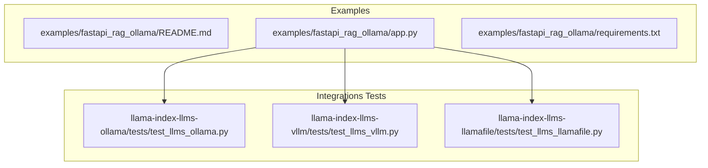
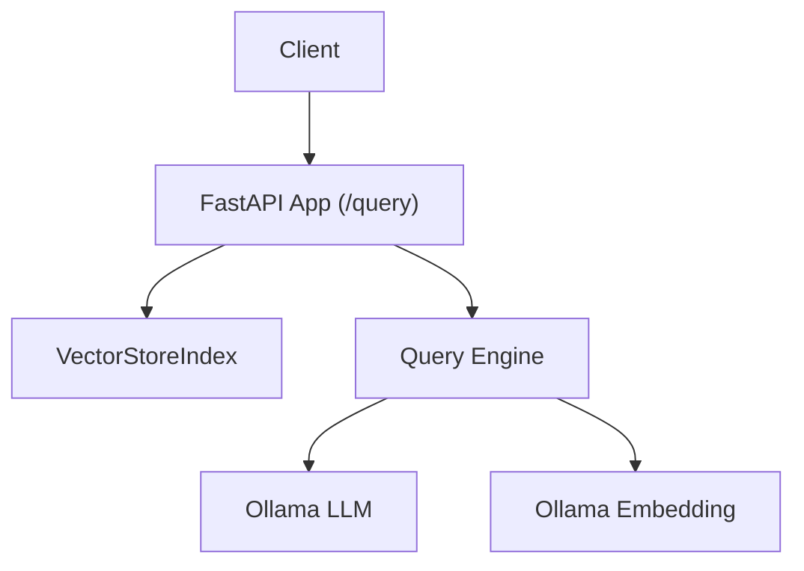
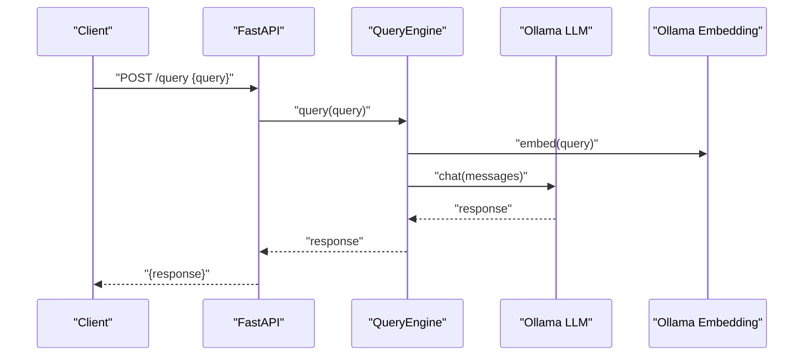
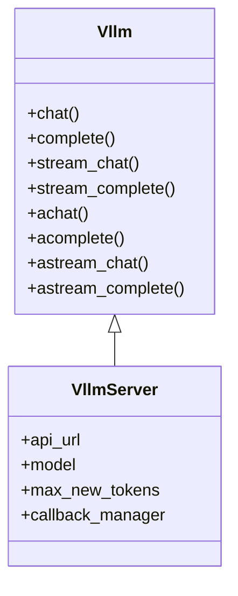
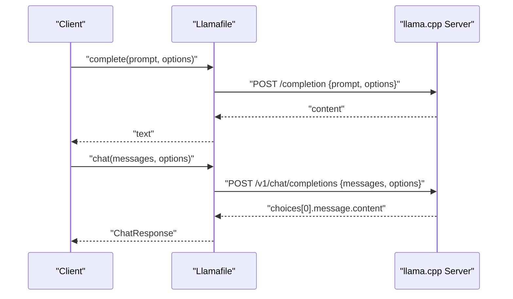
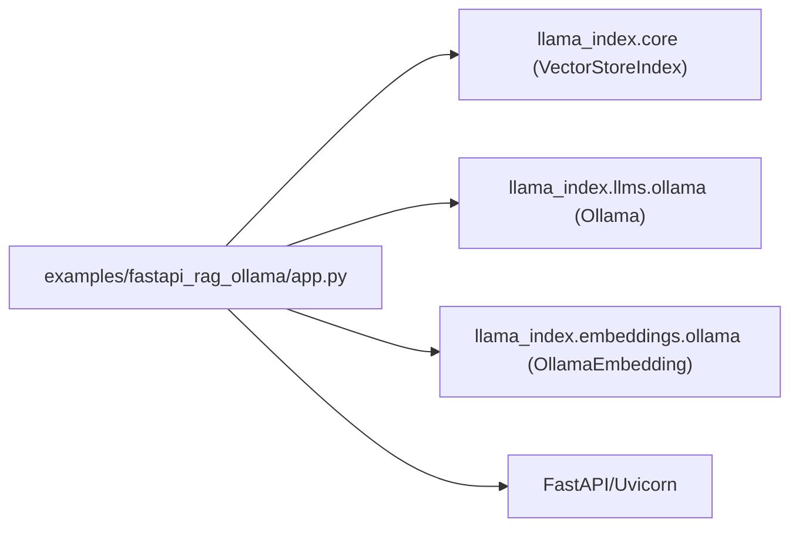

# Local and Edge LLM Solutions

<cite>
**Referenced Files in This Document**
- [examples/fastapi_rag_ollama/README.md](file://examples/fastapi_rag_ollama/README.md)
- [examples/fastapi_rag_ollama/app.py](file://examples/fastapi_rag_ollama/app.py)
- [examples/fastapi_rag_ollama/requirements.txt](file://examples/fastapi_rag_ollama/requirements.txt)
- [llama-index-integrations/llms/llama-index-llms-ollama/tests/test_llms_ollama.py](file://llama-index-integrations/llms/llama-index-llms-ollama/tests/test_llms_ollama.py)
- [llama-index-integrations/llms/llama-index-llms-vllm/tests/test_llms_vllm.py](file://llama-index-integrations/llms/llama-index-llms-vllm/tests/test_llms_vllm.py)
- [llama-index-integrations/llms/llama-index-llms-llamafile/tests/test_llms_llamafile.py](file://llama-index-integrations/llms/llama-index-llms-llamafile/tests/test_llms_llamafile.py)
</cite>

## Table of Contents
1. [Introduction](#introduction)
2. [Project Structure](#project-structure)
3. [Core Components](#core-components)
4. [Architecture Overview](#architecture-overview)
5. [Detailed Component Analysis](#detailed-component-analysis)
6. [Dependency Analysis](#dependency-analysis)
7. [Performance Considerations](#performance-considerations)
8. [Troubleshooting Guide](#troubleshooting-guide)
9. [Conclusion](#conclusion)
10. [Appendices](#appendices)

## Introduction
This document provides a comprehensive guide to deploying and operating local and edge LLM solutions using LlamaIndex. It focuses on practical integrations with Ollama, llama.cpp (via Llamafile), vLLM, and LM Studio, covering local model deployment, hardware requirements, GPU utilization strategies, model quantization, memory optimization, inference acceleration, setup across operating systems, containerization, Kubernetes deployment, performance benchmarking, latency optimization, throughput scaling, model management, version control, updates, and troubleshooting.

## Project Structure
The repository includes:
- A FastAPI + LlamaIndex RAG example using Ollama for local inference and embeddings.
- Integration tests for Ollama, vLLM, and Llamafile that demonstrate supported APIs and streaming capabilities.
- Examples and API references for Ollama, vLLM, Llamafile, and LM Studio across embeddings and LLMs.

**Diagram sources**
- [examples/fastapi_rag_ollama/app.py](file://examples/fastapi_rag_ollama/app.py#L1-L30)
- [llama-index-integrations/llms/llama-index-llms-ollama/tests/test_llms_ollama.py](file://llama-index-integrations/llms/llama-index-llms-ollama/tests/test_llms_ollama.py#L1-L496)
- [llama-index-integrations/llms/llama-index-llms-vllm/tests/test_llms_vllm.py](file://llama-index-integrations/llms/llama-index-llms-vllm/tests/test_llms_vllm.py#L1-L31)
- [llama-index-integrations/llms/llama-index-llms-llamafile/tests/test_llms_llamafile.py](file://llama-index-integrations/llms/llama-index-llms-llamafile/tests/test_llms_llamafile.py#L1-L217)

**Section sources**
- [examples/fastapi_rag_ollama/README.md](file://examples/fastapi_rag_ollama/README.md#L1-L58)
- [examples/fastapi_rag_ollama/app.py](file://examples/fastapi_rag_ollama/app.py#L1-L30)
- [examples/fastapi_rag_ollama/requirements.txt](file://examples/fastapi_rag_ollama/requirements.txt#L1-L7)

## Core Components
- Ollama integration for local LLMs and embeddings, supporting chat, completion, streaming, async operations, tool calling, and thinking modes.
- vLLM integration with server mode support and callback manager compatibility.
- Llamafile integration for llama.cpp-compatible inference with OpenAI-compatible endpoints, supporting completion and chat APIs, streaming, and generation options.

Key capabilities validated by tests:
- Chat and completion APIs for Ollama and Llamafile.
- Streaming variants for chat and completion.
- Async variants for chat and completion.
- Tool-calling and thinking modes for Ollama.
- Server-side LLM class for vLLM with callback support.

**Section sources**
- [llama-index-integrations/llms/llama-index-llms-ollama/tests/test_llms_ollama.py](file://llama-index-integrations/llms/llama-index-llms-ollama/tests/test_llms_ollama.py#L56-L315)
- [llama-index-integrations/llms/llama-index-llms-vllm/tests/test_llms_vllm.py](file://llama-index-integrations/llms/llama-index-llms-vllm/tests/test_llms_vllm.py#L12-L31)
- [llama-index-integrations/llms/llama-index-llms-llamafile/tests/test_llms_llamafile.py](file://llama-index-integrations/llms/llama-index-llms-llamafile/tests/test_llms_llamafile.py#L108-L217)

## Architecture Overview
The example demonstrates a production-style FastAPI application that:
- Loads documents at startup.
- Builds a VectorStoreIndex.
- Exposes a /query endpoint using a local LLM via Ollama and local embeddings via Ollama.

**Diagram sources**
- [examples/fastapi_rag_ollama/app.py](file://examples/fastapi_rag_ollama/app.py#L1-L30)

**Section sources**
- [examples/fastapi_rag_ollama/app.py](file://examples/fastapi_rag_ollama/app.py#L1-L30)

## Detailed Component Analysis

### Ollama Integration
- Purpose: Local LLM and embeddings via Ollama.
- Capabilities demonstrated:
  - Chat and completion APIs.
  - Streaming chat and completion.
  - Async chat and completion.
  - Tool-calling and thinking modes.
  - Model availability detection and skipping tests when models are not present.
- Hardware/GPU: Depends on Ollama installation and GPU drivers; tests rely on local Ollama client availability.

**Diagram sources**
- [examples/fastapi_rag_ollama/app.py](file://examples/fastapi_rag_ollama/app.py#L25-L29)
- [llama-index-integrations/llms/llama-index-llms-ollama/tests/test_llms_ollama.py](file://llama-index-integrations/llms/llama-index-llms-ollama/tests/test_llms_ollama.py#L59-L74)

**Section sources**
- [examples/fastapi_rag_ollama/README.md](file://examples/fastapi_rag_ollama/README.md#L15-L58)
- [examples/fastapi_rag_ollama/app.py](file://examples/fastapi_rag_ollama/app.py#L11-L13)
- [llama-index-integrations/llms/llama-index-llms-ollama/tests/test_llms_ollama.py](file://llama-index-integrations/llms/llama-index-llms-ollama/tests/test_llms_ollama.py#L56-L315)

### vLLM Integration
- Purpose: Remote or local vLLM server mode with callback support.
- Capabilities demonstrated:
  - Class hierarchy validation for Vllm and VllmServer.
  - Callback manager assignment to VllmServer.

**Diagram sources**
- [llama-index-integrations/llms/llama-index-llms-vllm/tests/test_llms_vllm.py](file://llama-index-integrations/llms/llama-index-llms-vllm/tests/test_llms_vllm.py#L5-L31)

**Section sources**
- [llama-index-integrations/llms/llama-index-llms-vllm/tests/test_llms_vllm.py](file://llama-index-integrations/llms/llama-index-llms-vllm/tests/test_llms_vllm.py#L1-L31)

### Llamafile Integration
- Purpose: llama.cpp-compatible inference with OpenAI-compatible endpoints.
- Capabilities demonstrated:
  - Completion and chat APIs.
  - Streaming variants.
  - Generation options via kwargs.
  - Mocked HTTP responses for testing.

**Diagram sources**
- [llama-index-integrations/llms/llama-index-llms-llamafile/tests/test_llms_llamafile.py](file://llama-index-integrations/llms/llama-index-llms-llamafile/tests/test_llms_llamafile.py#L108-L217)

**Section sources**
- [llama-index-integrations/llms/llama-index-llms-llamafile/tests/test_llms_llamafile.py](file://llama-index-integrations/llms/llama-index-llms-llamafile/tests/test_llms_llamafile.py#L1-L217)

### LM Studio Integration
- Purpose: Local inference via LM Studio’s OpenAI-compatible API.
- Implementation pattern: Similar to Llamafile, using OpenAI-compatible endpoints for chat and completions. Use the OpenAI-compatible interface exposed by LM Studio to integrate with LlamaIndex.

[No sources needed since this section describes a general integration pattern without analyzing specific files]

### Model Quantization and Memory Optimization
- Quantization: Use smaller model sizes (e.g., 3B or 7B parameter models) and quantized variants (e.g., GGUF with 4-bit or 3-bit settings) to reduce memory footprint.
- Memory optimization: Adjust context window, batch size, and generation parameters to fit device memory. Stream responses to reduce peak memory usage.
- Inference acceleration: Prefer GPU-backed engines (Ollama with GPU, vLLM with GPUs) and enable appropriate kernels (e.g., Flash Attention) when available.

[No sources needed since this section provides general guidance]

### Hardware Requirements and GPU Utilization Strategies
- CPU: Multi-core for preprocessing and lightweight serving.
- GPU: Dedicated VRAM for larger models; ensure drivers and runtime libraries match engine requirements (CUDA for Ollama/vLLM, ROCm for some backends).
- GPU utilization: Use batching, KV cache reuse, and streaming to maximize throughput while controlling latency.

[No sources needed since this section provides general guidance]

### Setup Guides by Operating System
- Linux/macOS/Windows: Install Ollama, pull desired models, and run the FastAPI example. Ensure Python and pip dependencies are installed.
- Containerization: Package the FastAPI app with Ollama or vLLM server in Docker. Mount volumes for persistent data and models.
- Kubernetes: Deploy stateless inference pods with horizontal scaling; use a stateful component for persistent embeddings or vector stores.

[No sources needed since this section provides general guidance]

### Performance Benchmarking, Latency Optimization, and Throughput Scaling
- Benchmarking: Measure tokens per second (TPS), latency per request, and memory usage under varying batch sizes and context lengths.
- Latency optimization: Enable streaming, reduce context length, and pre-load models. Use caching for repeated queries.
- Throughput scaling: Horizontal pod scaling in Kubernetes, connection pooling, and asynchronous request handling.

[No sources needed since this section provides general guidance]

### Local Model Management, Version Control, and Updates
- Model management: Pin model versions (e.g., specific Ollama model tags) and keep a registry of available models.
- Version control: Track model versions in deployment manifests and CI/CD pipelines.
- Updates: Roll out updates gradually, validate with tests, and monitor performance metrics.

[No sources needed since this section provides general guidance]

## Dependency Analysis
The example FastAPI app depends on:
- LlamaIndex core for indexing and querying.
- Ollama LLM and embeddings for local inference.
- FastAPI and Uvicorn for the web server.

**Diagram sources**
- [examples/fastapi_rag_ollama/app.py](file://examples/fastapi_rag_ollama/app.py#L1-L30)

**Section sources**
- [examples/fastapi_rag_ollama/requirements.txt](file://examples/fastapi_rag_ollama/requirements.txt#L1-L7)
- [examples/fastapi_rag_ollama/app.py](file://examples/fastapi_rag_ollama/app.py#L4-L13)

## Performance Considerations
- Choose engines aligned with hardware: Ollama with GPU, vLLM with GPU, Llamafile with optimized llama.cpp builds.
- Tune generation parameters (temperature, top-p, max tokens) and context window to balance quality and speed.
- Use streaming to improve perceived latency and reduce memory spikes.
- Monitor GPU utilization and adjust concurrency limits accordingly.

[No sources needed since this section provides general guidance]

## Troubleshooting Guide
Common issues and resolutions:
- Ollama client not available or model missing: Tests skip when Ollama client is unreachable or required models are not pulled. Ensure Ollama is running and models are downloaded.
- CUDA compatibility: Verify CUDA toolkit and driver versions match engine expectations. Reinstall engines or switch to CPU-only builds if necessary.
- Resource allocation problems: Reduce context window, batch size, or generation length; enable streaming; and scale horizontally.

**Section sources**
- [llama-index-integrations/llms/llama-index-llms-ollama/tests/test_llms_ollama.py](file://llama-index-integrations/llms/llama-index-llms-ollama/tests/test_llms_ollama.py#L20-L31)

## Conclusion
LlamaIndex integrates seamlessly with local and edge LLM stacks. The repository provides working examples and robust integration tests for Ollama, vLLM, and Llamafile. By aligning model choices with hardware, applying quantization and memory optimizations, and leveraging streaming and scaling strategies, teams can deploy efficient, low-latency, and scalable local inference systems.

## Appendices
- Example usage: See the FastAPI + Ollama RAG example for a production-style deployment pattern.
- API coverage: Refer to integration tests for supported methods and streaming/async variants.

[No sources needed since this section aggregates previously cited material]