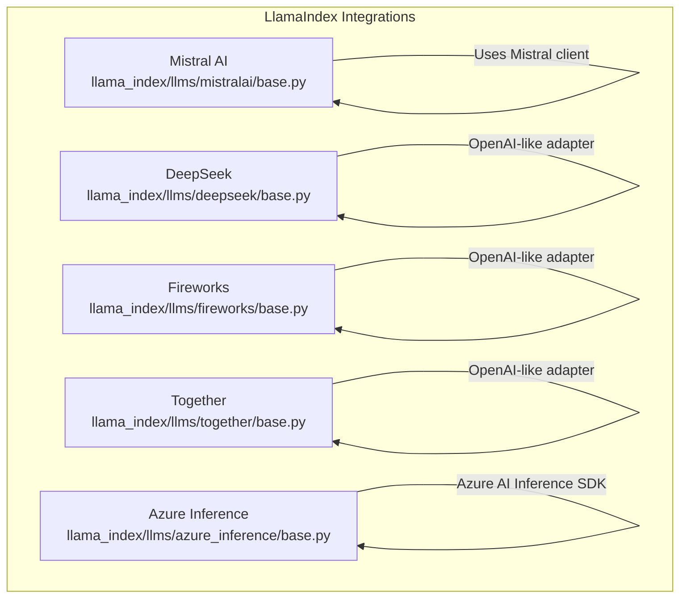
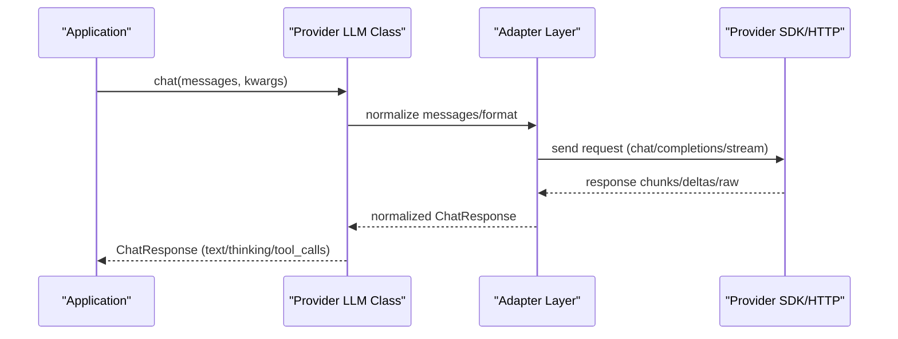
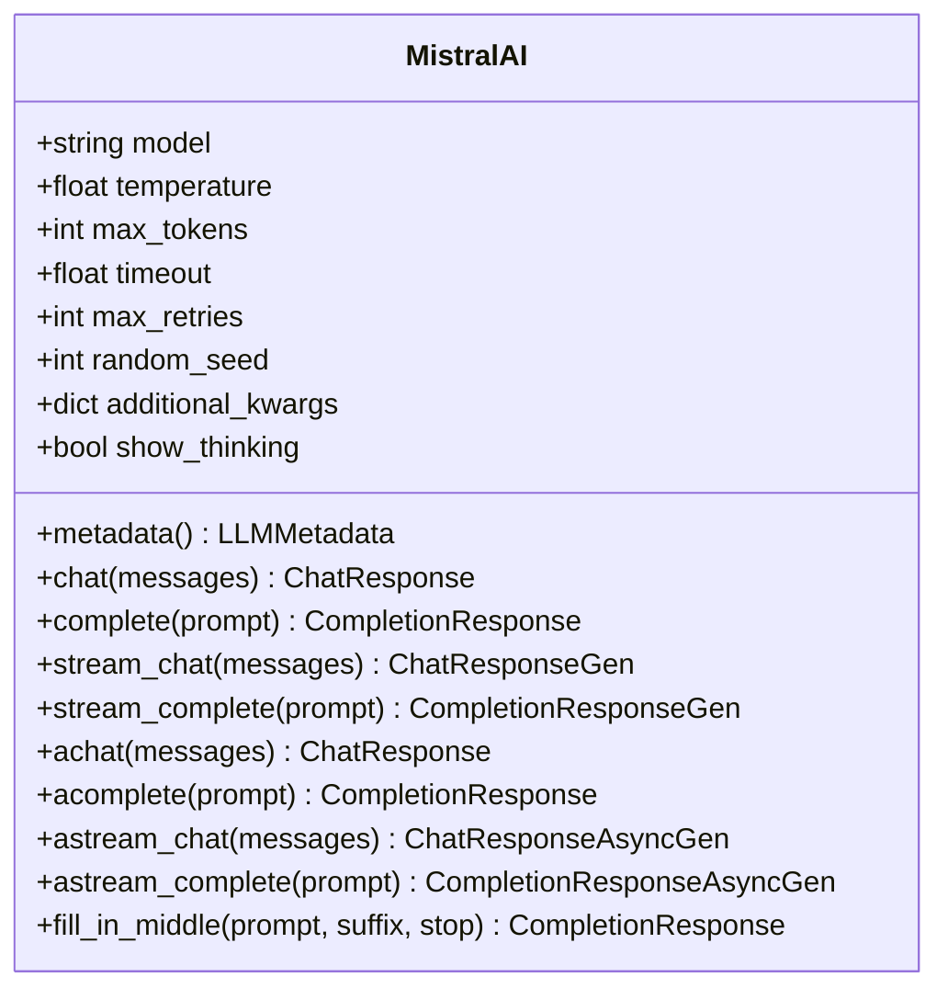
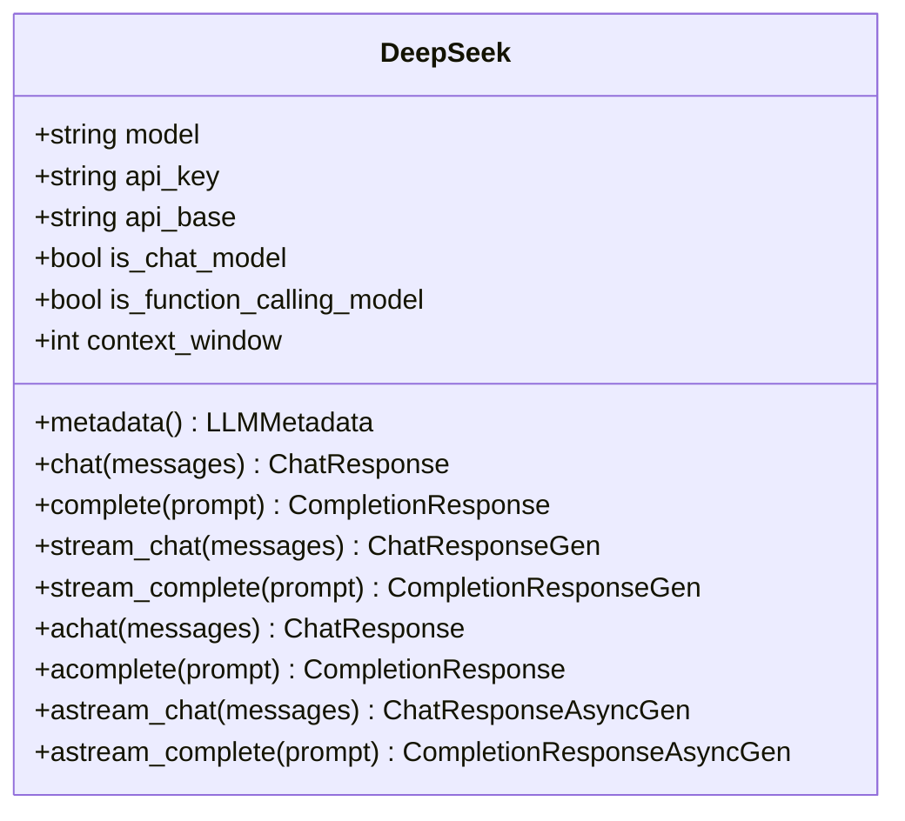
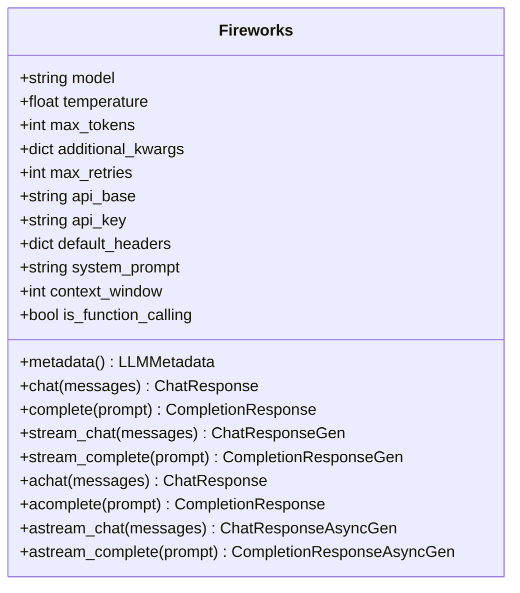
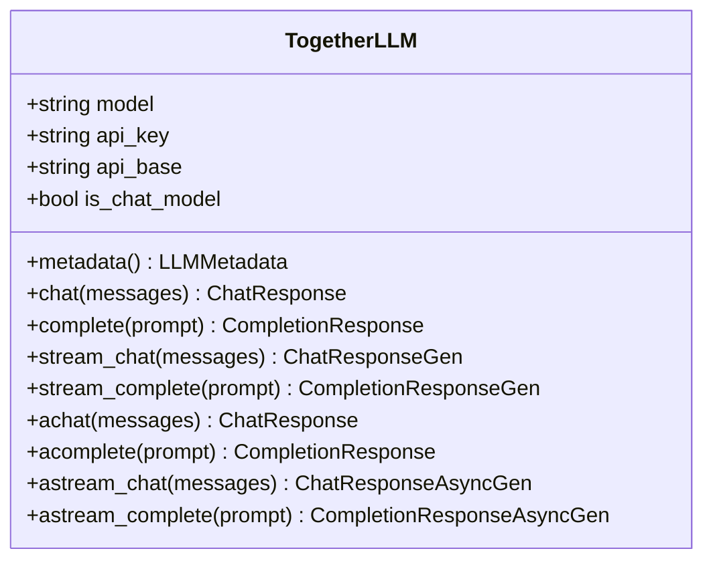
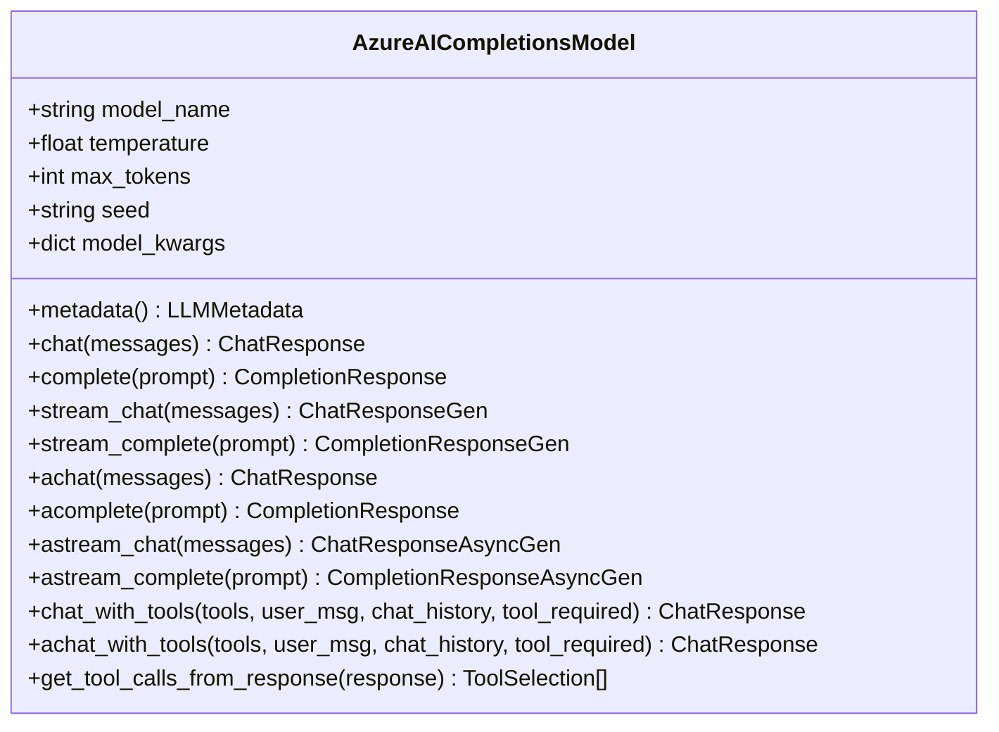
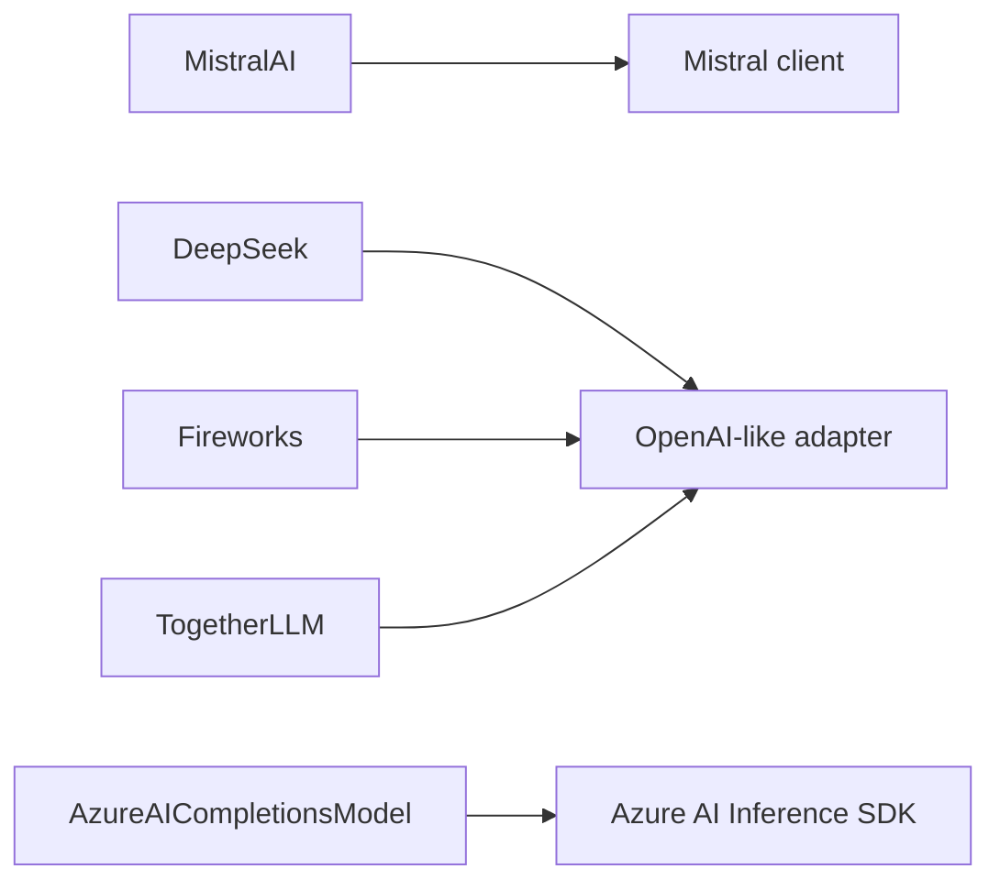

# Specialized LLM Providers

<cite>
**Referenced Files in This Document**
- [base.py](file://llama-index-integrations/llms/llama-index-llms-mistralai/llama_index/llms/mistralai/base.py)
- [base.py](file://llama-index-integrations/llms/llama-index-llms-deepseek/llama_index/llms/deepseek/base.py)
- [base.py](file://llama-index-integrations/llms/llama-index-llms-fireworks/llama_index/llms/fireworks/base.py)
- [base.py](file://llama-index-integrations/llms/llama-index-llms-together/llama_index/llms/together/base.py)
- [base.py](file://llama-index-integrations/llms/llama-index-llms-azure-inference/llama_index/llms/azure_inference/base.py)
</cite>

## Table of Contents
1. [Introduction](#introduction)
2. [Project Structure](#project-structure)
3. [Core Components](#core-components)
4. [Architecture Overview](#architecture-overview)
5. [Detailed Component Analysis](#detailed-component-analysis)
6. [Dependency Analysis](#dependency-analysis)
7. [Performance Considerations](#performance-considerations)
8. [Troubleshooting Guide](#troubleshooting-guide)
9. [Conclusion](#conclusion)

## Introduction
This document explains specialized Large Language Model (LLM) providers integrated in LlamaIndex: Mistral AI, DeepSeek, Fireworks, Together, and Azure Inference. It focuses on provider-specific model architectures, unique features, and use-case optimizations. It also covers configuration examples, provider-specific parameters, temperature settings, output formatting, and guidance for selecting models for reasoning, code generation, and research-oriented tasks. Pricing models, usage tracking, and billing considerations are addressed conceptually, with practical steps for monitoring and cost control.

## Project Structure
The specialized providers are implemented as separate packages under the LlamaIndex integrations tree. Each provider exposes a dedicated LLM class that adheres to LlamaIndex’s LLM interface, enabling drop-in replacement and consistent usage patterns.

**Diagram sources**
- [base.py](file://llama-index-integrations/llms/llama-index-llms-mistralai/llama_index/llms/mistralai/base.py#L178-L757)
- [base.py](file://llama-index-integrations/llms/llama-index-llms-deepseek/llama_index/llms/deepseek/base.py#L8-L56)
- [base.py](file://llama-index-integrations/llms/llama-index-llms-fireworks/llama_index/llms/fireworks/base.py#L18-L128)
- [base.py](file://llama-index-integrations/llms/llama-index-llms-together/llama_index/llms/together/base.py#L7-L52)
- [base.py](file://llama-index-integrations/llms/llama-index-llms-azure-inference/llama_index/llms/azure_inference/base.py#L147-L601)

**Section sources**
- [base.py](file://llama-index-integrations/llms/llama-index-llms-mistralai/llama_index/llms/mistralai/base.py#L1-L757)
- [base.py](file://llama-index-integrations/llms/llama-index-llms-deepseek/llama_index/llms/deepseek/base.py#L1-L56)
- [base.py](file://llama-index-integrations/llms/llama-index-llms-fireworks/llama_index/llms/fireworks/base.py#L1-L128)
- [base.py](file://llama-index-integrations/llms/llama-index-llms-together/llama_index/llms/together/base.py#L1-L52)
- [base.py](file://llama-index-integrations/llms/llama-index-llms-azure-inference/llama_index/llms/azure_inference/base.py#L1-L601)

## Core Components
- Mistral AI: Provides reasoning-aware models with “thinking” output parsing, function-calling support, and multimodal content handling. Includes specialized code model support via Fill-In-the-Middle.
- DeepSeek: OpenAI-like adapter configured against DeepSeek’s API base, with function-calling detection and context window sizing.
- Fireworks: OpenAI-like adapter with configurable context windows and function-calling detection, plus custom model metadata support.
- Together: OpenAI-like adapter configured against Together’s API base.
- Azure Inference: Azure AI Inference client wrapper supporting chat, streaming, function/tool calling, and multiple authentication modes.

Each provider class exposes:
- Standard LLM methods: chat, complete, stream_chat, stream_complete, async variants.
- Metadata reporting: context window, output token limits, chat capability, function-calling capability.
- Provider-specific parameters: API keys, endpoints, base URLs, model names, and optional headers.

**Section sources**
- [base.py](file://llama-index-integrations/llms/llama-index-llms-mistralai/llama_index/llms/mistralai/base.py#L178-L757)
- [base.py](file://llama-index-integrations/llms/llama-index-llms-deepseek/llama_index/llms/deepseek/base.py#L8-L56)
- [base.py](file://llama-index-integrations/llms/llama-index-llms-fireworks/llama_index/llms/fireworks/base.py#L18-L128)
- [base.py](file://llama-index-integrations/llms/llama-index-llms-together/llama_index/llms/together/base.py#L7-L52)
- [base.py](file://llama-index-integrations/llms/llama-index-llms-azure-inference/llama_index/llms/azure_inference/base.py#L147-L601)

## Architecture Overview
The providers follow a layered pattern:
- LlamaIndex LLM interface: unified chat/completion/streaming APIs.
- Provider adapters: OpenAI-like or SDK-specific clients.
- Provider SDKs: Mistral client, Azure AI Inference SDK, or OpenAI-compatible APIs.

**Diagram sources**
- [base.py](file://llama-index-integrations/llms/llama-index-llms-mistralai/llama_index/llms/mistralai/base.py#L358-L491)
- [base.py](file://llama-index-integrations/llms/llama-index-llms-azure-inference/llama_index/llms/azure_inference/base.py#L352-L472)

## Detailed Component Analysis

### Mistral AI
- Specialized features:
  - Reasoning models with “thinking” content extraction and optional display toggle.
  - Function-calling model detection and tool call injection.
  - Multimodal content conversion (text, images, thinking).
  - Fill-In-the-Middle for code completion with a dedicated code model.
- Key parameters:
  - model, temperature, max_tokens, timeout, max_retries, random_seed, additional_kwargs, endpoint, show_thinking.
- Use cases:
  - Research-oriented tasks, reasoning chains, and multimodal Q&A.
- Configuration highlights:
  - Environment variables: MISTRAL_API_KEY, MISTRAL_ENDPOINT.
  - Metadata exposes context window and function-calling capability.

**Diagram sources**
- [base.py](file://llama-index-integrations/llms/llama-index-llms-mistralai/llama_index/llms/mistralai/base.py#L178-L757)

**Section sources**
- [base.py](file://llama-index-integrations/llms/llama-index-llms-mistralai/llama_index/llms/mistralai/base.py#L178-L757)

### DeepSeek
- Specialized features:
  - OpenAI-like interface with function-calling detection and context window sizing.
  - Uses a provider-specific API base URL.
- Key parameters:
  - model, api_key, api_base, is_chat_model, is_function_calling_model, context_window.
- Use cases:
  - General-purpose chat and code tasks with OpenAI-like ergonomics.
- Configuration highlights:
  - Environment variable: DEEPSEEK_API_KEY.
  - Function-calling and context window derived from utilities.

**Diagram sources**
- [base.py](file://llama-index-integrations/llms/llama-index-llms-deepseek/llama_index/llms/deepseek/base.py#L8-L56)

**Section sources**
- [base.py](file://llama-index-integrations/llms/llama-index-llms-deepseek/llama_index/llms/deepseek/base.py#L8-L56)

### Fireworks
- Specialized features:
  - OpenAI-like interface with configurable context window and function-calling detection.
  - Supports custom models and explicit context window/function-calling toggles.
- Key parameters:
  - model, temperature, max_tokens, additional_kwargs, max_retries, api_base, api_key, default_headers, system_prompt, context_window, is_function_calling.
- Use cases:
  - Multi-modal instruction-following and specialized model deployments with extended context.
- Configuration highlights:
  - Environment variables: FIREWORKS_API_KEY, FIREWORKS_API_BASE.
  - Metadata computed from model name or defaults.

**Diagram sources**
- [base.py](file://llama-index-integrations/llms/llama-index-llms-fireworks/llama_index/llms/fireworks/base.py#L18-L128)

**Section sources**
- [base.py](file://llama-index-integrations/llms/llama-index-llms-fireworks/llama_index/llms/fireworks/base.py#L18-L128)

### Together
- Specialized features:
  - OpenAI-like adapter configured against Together’s API base.
- Key parameters:
  - model, api_key, api_base, is_chat_model.
- Use cases:
  - Aggregating and running diverse open-weight models via Together’s platform.
- Configuration highlights:
  - Environment variable: TOGETHER_API_KEY.
  - API base preconfigured to Together’s endpoint.

**Diagram sources**
- [base.py](file://llama-index-integrations/llms/llama-index-llms-together/llama_index/llms/together/base.py#L7-L52)

**Section sources**
- [base.py](file://llama-index-integrations/llms/llama-index-llms-together/llama_index/llms/together/base.py#L7-L52)

### Azure Inference
- Specialized features:
  - Azure AI Inference SDK integration with chat, streaming, and function/tool calling.
  - Multiple authentication modes: API key or Azure Identity credentials.
  - Metadata retrieval from endpoint when supported.
- Key parameters:
  - endpoint, credential, temperature, max_tokens, model_name, api_version, model_kwargs.
- Use cases:
  - Enterprise-grade deployments with Azure identity and compliance controls.
- Configuration highlights:
  - Environment variables: AZURE_INFERENCE_ENDPOINT, AZURE_INFERENCE_CREDENTIAL.
  - Tool choice presets for required vs auto tool selection.

**Diagram sources**
- [base.py](file://llama-index-integrations/llms/llama-index-llms-azure-inference/llama_index/llms/azure_inference/base.py#L147-L601)

**Section sources**
- [base.py](file://llama-index-integrations/llms/llama-index-llms-azure-inference/llama_index/llms/azure_inference/base.py#L147-L601)

## Dependency Analysis
- Mistral AI depends on the Mistral client and supports function-calling and multimodal inputs.
- DeepSeek, Fireworks, and Together rely on OpenAI-like adapters, enabling a uniform interface while pointing to provider-specific bases.
- Azure Inference integrates the Azure AI Inference SDK and supports both sync and async flows.

**Diagram sources**
- [base.py](file://llama-index-integrations/llms/llama-index-llms-mistralai/llama_index/llms/mistralai/base.py#L56-L68)
- [base.py](file://llama-index-integrations/llms/llama-index-llms-deepseek/llama_index/llms/deepseek/base.py#L4-L5)
- [base.py](file://llama-index-integrations/llms/llama-index-llms-fireworks/llama_index/llms/fireworks/base.py#L11)
- [base.py](file://llama-index-integrations/llms/llama-index-llms-together/llama_index/llms/together/base.py#L4)
- [base.py](file://llama-index-integrations/llms/llama-index-llms-azure-inference/llama_index/llms/azure_inference/base.py#L46-L51)

**Section sources**
- [base.py](file://llama-index-integrations/llms/llama-index-llms-mistralai/llama_index/llms/mistralai/base.py#L56-L68)
- [base.py](file://llama-index-integrations/llms/llama-index-llms-deepseek/llama_index/llms/deepseek/base.py#L4-L5)
- [base.py](file://llama-index-integrations/llms/llama-index-llms-fireworks/llama_index/llms/fireworks/base.py#L11)
- [base.py](file://llama-index-integrations/llms/llama-index-llms-together/llama_index/llms/together/base.py#L4)
- [base.py](file://llama-index-integrations/llms/llama-index-llms-azure-inference/llama_index/llms/azure_inference/base.py#L46-L51)

## Performance Considerations
- Temperature tuning:
  - Lower values (e.g., near zero) increase determinism for reasoning and code tasks.
  - Higher values (up to 1.0) increase creativity for open-ended tasks.
- Context window:
  - Respect provider context limits to avoid truncation and extra round-trips.
  - For Fireworks and DeepSeek, explicitly set context_window when using custom models.
- Streaming:
  - Prefer streaming for long responses to reduce perceived latency and enable early termination.
- Retries and timeouts:
  - Configure max_retries and timeout to balance reliability and responsiveness.
- Function-calling:
  - Enable function-calling models to reduce hallucinations and improve tool use accuracy.

[No sources needed since this section provides general guidance]

## Troubleshooting Guide
- Authentication errors:
  - Ensure environment variables are set or passed explicitly: MISTRAL_API_KEY, DEEPSEEK_API_KEY, FIREWORKS_API_KEY, TOGETHER_API_KEY, AZURE_INFERENCE_ENDPOINT, AZURE_INFERENCE_CREDENTIAL.
- Endpoint configuration:
  - Mistral AI allows overriding the endpoint via environment or constructor parameter.
  - Azure Inference requires endpoint and credential; missing either raises an error.
- Function-calling mismatches:
  - Verify model supports function-calling; providers expose metadata indicating capability.
- Tool call validation:
  - Some providers enforce single tool call per response; ensure allow_parallel_tool_calls is aligned with provider behavior.
- Pricing and usage tracking:
  - Use provider dashboards to monitor usage and costs.
  - Track tokens consumed per request/response and aggregate across runs.
  - Implement cost-aware batching and retry policies to minimize wasted compute.

**Section sources**
- [base.py](file://llama-index-integrations/llms/llama-index-llms-mistralai/llama_index/llms/mistralai/base.py#L262-L273)
- [base.py](file://llama-index-integrations/llms/llama-index-llms-azure-inference/llama_index/llms/azure_inference/base.py#L243-L266)

## Conclusion
These specialized providers bring distinct strengths to LlamaIndex:
- Mistral AI excels in reasoning and multimodal tasks with thinking support and function-calling.
- DeepSeek and Together offer OpenAI-like ergonomics with provider-specific bases and function-calling detection.
- Fireworks enables flexible context windows and function-calling for specialized models.
- Azure Inference integrates enterprise-grade authentication and compliance with robust streaming and tool-calling support.

Select models based on task type (reasoning, code, research), environment constraints (context, latency), and provider features. Combine temperature tuning, streaming, and function-calling to optimize performance and cost.